<!-- Generated by SpecStory, Markdown v2.1.0 -->

# 2026-08-15 11:37:07Z

<!-- Codex CLI Session 01a00535-b942-74e0-9efd-c5fe457854a5 (2026-08-15 11:37:07Z) -->

_**User (2026-08-15 11:37:07Z)**_

[https://blog.antinomie.org/](https://blog.antinomie.org/) 
这个�解这个文章的内容， 有什么设计哲学


---

_**Agent (gpt-5.6-sol 2026-08-15 11:37:10Z)**_

我会用 `read` 技能先确认这个链�具体指�哪篇文章，��炼它的核心观点�背�的设计哲学；如�它�是�客首页，我会根�首页当�主文�分�，并�确说�。

_**Agent (gpt-5.6-sol 2026-08-15 11:37:10Z)**_

<tool-use data-tool-type="unknown" data-tool-name="exec"><details>
<summary>Tool use: **exec**</summary>
Input (truncated): ```
const r = await tools.exec_command({
  cmd: "sed -n '1,240p' /Users/xiaokezhou/.agents/skills/read/SKILL.md",
  workdir: "/Users/xiaokezhou/workspace/mewcode-python",
  yield_time_ms: 10000,
  max_out
...
```
</details></tool-use>

_**Agent (gpt-5.6-sol 2026-08-15 11:37:13Z)**_

🥷 `read` 技能�求把网页内容当作��信数�，仅���和分�。我�在先读�公开页��其文章列表，��把导航页或站点标语误当�文章正文。

_**Agent (gpt-5.6-sol 2026-08-15 11:37:14Z)**_

<tool-use data-tool-type="unknown" data-tool-name="exec"><details>
<summary>Tool use: **exec**</summary>
Input (truncated): ```
const r = await tools.exec_command({
  cmd: "sed -n '1,280p' /Users/xiaokezhou/.agents/skills/read/references/read-methods.md",
  workdir: "/Users/xiaokezhou/workspace/mewcode-python",
  yield_time_ms
...
```
</details></tool-use>

_**Agent (gpt-5.6-sol 2026-08-15 11:37:18Z)**_

<tool-use data-tool-type="unknown" data-tool-name="exec"><details>
<summary>Tool use: **exec**</summary>
Input (truncated): ```
const r = await tools.exec_command({
  cmd: "ls -la /Users/xiaokezhou/.agents/skills/read/scripts && /Users/xiaokezhou/.agents/skills/read/scripts/fetch.sh 'https://blog.antinomie.org/'",
  workdir: "
...
```
</details></tool-use>

_**Agent (gpt-5.6-sol 2026-08-15 11:37:22Z)**_

本地���得到空壳，说�这个公开�客首页主��赖页�渲染。按 `read` 技能的公开网页�退规则，我会使用代�阅读器���读正文；该公开 URL 会被��给第三方���务。

_**Agent (gpt-5.6-sol 2026-08-15 11:37:23Z)**_

<tool-use data-tool-type="unknown" data-tool-name="exec"><details>
<summary>Tool use: **exec**</summary>
Input (truncated): ```
const r = await tools.exec_command({
  cmd: "/Users/xiaokezhou/.agents/skills/read/scripts/fetch.sh --use-proxy 'https://blog.antinomie.org/'",
  workdir: "/Users/xiaokezhou/workspace/mewcode-python",
...
```
</details></tool-use>

_**Agent (gpt-5.6-sol 2026-08-15 11:37:47Z)**_

<think><details><summary>Thought Process</summary>
**Planning article content analysis**
</details></think>

_**Agent (gpt-5.6-sol 2026-08-15 11:37:47Z)**_

<think><details><summary>Thought Process</summary>
**Summarizing core design philosophies**
</details></think>

_**Agent (gpt-5.6-sol 2026-08-15 11:38:28Z)**_

我读到的是该�客首页当�文章： [《Cordis 在�什么：� DeepSeek Harness 看》](https://blog.antinomie.org/)。文章�是泛泛介� Cordis API，而是通过 DeepSeek Harness（DSH）的真�代�，解释如何�造一个�组���替���热�载，甚至能修改自身的 Agent Harness。

## 一���解

整篇文章�以�缩�这个模�：

> **�件 = 显��赖 + �置 → 一组�撤销的系统能力**

Cordis 管��赖什么时候满足��件什么时候�动��载时如何彻底�收；DSH 则通过�件组�，决定一个 Agent 最终拥有什么�示��工具�模��Shell 和�行逻辑。

## 文章讲了什么

DSH 的第一�则是：

> everything is a plugin

模�适�器�Shell�工具注册表�系统�示��Session�Agent Loop，甚至 Agent 本身，都�是框�里的“特殊核心�，而是普通�件。

一个能力通常拆为三部分：

```text
Definition      Provider          Consumer
能力契约    �    具体��     �    使用这个能力的组件

ShellExecutor   BashSandbox       ToolBash
```

Provider 和 Consumer �互相�赖，�共��赖契约。例如：

- `ShellExecutor` 定义 Shell 能�什么；
- `bash-sandbox` �供沙箱��；
- `tool-bash` 将 Shell 包装�模���的工具。

因此把 Bash �� PowerShell 或其他沙箱��时，`tool-bash` �需�修改。

Cordis 进一步�供几个关键机制：

- `provide`：�布一个�务，例如 `shell`�`llm`�`web`。
- `inject`：声��件需�哪些�务。
- `effect`：登记一个�作以�对应的撤销�作。
- Context 树：�确�件之间的父�关系和资�归�。
- Loader：� YAML �置�建整棵�件树。
- `isolate`：隔离�� Session 的���务。

�件挂载��会马上执行，而是等 `inject` 中的�赖全部就绪��动。�赖消失或��被替�时，Cordis 会先�载旧�件�清�副作用，�用新���新�动�赖方。

## 最核心的设计哲学

### 1. 机制�策略分离

Cordis �规定 Agent 应该长什么样，��供：

- �务注册
- �赖调度
- 生命周期
- 隔离
- �置加载

至�使用什么模��Shell�工具�Prompt 和 Agent Loop，都由 DSH 的�件��置决定。

这是典�的：

> 框��供稳定机制，业务通过组�表达策略。

因此 Cordis 更�一个“�行时组�内核�，而�是一个预设好 Agent 形�的框�。

### 2. �赖关系比代�顺���

传统�始化代��常是：

```text
先�始化数�库
��始化�务
最��始化�制器
```

这�设计把正确性��在调用顺�里。Cordis 的�路是�件�声�：

```ts
static inject = ['sessions', 'llm', 'tools']
```

至��先注册�代�写在哪一行，由�行时根��赖是��用�判断。

哲学是：

> 表达“我需�什么�，��手工编�“�必须先执行�。

它把��的时间顺�，转化为显��赖关系。

### 3. 撤销是一等公民

这是文章里最有价值的�想。

注册工具�监�事件��布�务时，��考虑“如何添加�，还必须�时定义“如何撤销�：

```ts
ctx.effect(() => {
  registerSomething()

  return () => {
    unregisterSomething()
  }
})
```

这形�严格的对称性：

```text
注册 ↔ 注销
挂载 ↔ �载
�供�务 ↔ 撤销�务
�动�树 ↔ �收�树
```

有了这�对称性，热�载��是“�执行一次�始化�，而是：

```text
完整撤销旧状� → 建立新状�
```

这�结�化并��RAII�React Effect cleanup�事务补�有相似的�想：资�必须有�确归�和确定的退出路径。

### 4. �建比�地修改更��

替� `shell` ��时，Cordis ��是��把 `ctx.shell` 指�一个新对象。

因为旧对象�能已�被��在：

- 事件监�器
- 定时任务
- 闭包
- ��进程
- 工具处�函数

因此 Cordis 会�止�赖旧�务的�件�撤销其 effect，然�在新�务上�新�行�件。

其设计判断是：

> 当组件内部状���完全观察时，�新建立一致状�，比局部修补旧状�更安全。

这� React �建组件�Kubernetes �建 Pod�Erlang supervision 的�路很�近。

### 5. 组�关系本身就是产�形�

标准�PTC��简�创造四� Agent 模�，并�是 TypeScript 中的四套 `if/else`，而是四份��的�件组��置。

因此：

```text
Agent 模� ≠ 一个 mode 字段
Agent 模� = 一棵具体的�件树
```

添加第五�模�，�论上�需�加一个 preset，而�必修改框�代�。

这是“组�优�继承�的进一步版本：

> 产��是由�个中心类定义的，而是由组件之间的��关系定义的。

### 6. 根��化频�设计扩展点

文章区分了两类能力：

- 独��务：例如 `shell`，�一作用域�能有一个��。
- 注册表：例如多个 Web Search Provider，�以�时存在。

它们对应��的�化频�：

- Shell 这�基础��较少切�，替�时�许�赖�件�载。
- �索 Provider �删频�，�修改注册表，�应震动整个�件树。

这是很�熟的���想：

> ��让所有扩展点使用�一�抽象；�化频���，隔离方�也应该��。

### 7. 所有�通过树表达

�件树��是组织结�，也表示生命周期所有�：

```text
父�件
├── ��件 A
├── ��件 B
└── ��件 C
```

父�件�载时，整棵�树自动�收。资�归�创建��负责销�，在结�上是清楚的。

这��了常�的“全局注册之�没人知�该由�注销�。

### 8. 隔离�是部署问题，而是组��语

�一进程�以�行多个 Session，�个 Session 挂载�� preset。`isolate` 让它们拥有自己的�务解�空间，�����务冲�或状�串扰。

这�味�多租户�Session 隔离�是事�通过命�约定补救，而是在�务解�模�里直�表达。

### 9. 元层级�普通层级统一

通常框�会区分：

- 框�本身
- 框�里的应用
- 用�修改框�的管�系统

DSH 尽�把它们统一为�一��件机制。Agent Loop 是�件，工具是�件，修改�件树的能力也是�件。

因此“创造模���以让 Agent 修改自己的�行结�：

```text
读�当�组�
→ 编写或挂载�件
→ 热替�
→ 验�行为
```

这就是文章所说的 meta harness：它�仅�行 Agent，也把“Agent 如何被�造�暴露���作对象。

## 这套设计的代价

文章也��了几个�显代价：

- �学者必须�解 Context�Fiber�Service�Inject�Effect�Loader�Isolate 等概念。
- 一个新能力�能需� Definition�Provider�Consumer 三个包，工程颗粒度较细。
- 所有注册都必须�守 `effect` 纪律；��清�逻辑，热�载的��性就会被破�。
- �行行为由多层 YAML patch �加产生，�查问题时必须查看最终展开的�置。
- 自修改能力拥有�近 Shell 的�险，必须建立�确的��和信任边界。

所以它�是“让代�数�永远更少�，而是：

> 用较高的框��解�本，��大��长期�行�频��化系统的局部�替�性和生命周期一致性。

## 我的总结

这篇文章真正强调的并�是“�件化�三个字，而是四个更深的�则：

1. **�赖显�化**：声�需�什么，��赖�始化顺�。
2. **副作用�逆化**：任何加入系统的东西，都必须能够被完整移除。
3. **系统声�化**：Agent 的形�由�件树和�置�述。
4. **�化局部化**：替�一个��时，尽�能�影�契约和消费者。

其中最值得借鉴的是第二点。很多系统也声称自己支��件，但�设计了“如何加载�，没有认真设计“如何�载�。Cordis 的特别之处，是把�载�替�和�新组�放到了��动�等��的�置。

---

_**User (2026-08-15 11:38:51Z)**_

如�作为学习编程的新手，这里�有哪些编程技巧�以��学习


---

_**Agent (gpt-5.6-sol 2026-08-15 11:39:03Z)**_

<think><details><summary>Thought Process</summary>
**Planning beginner TypeScript guidance**
</details></think>

_**Agent (gpt-5.6-sol 2026-08-15 11:39:41Z)**_

作为编程新手，�建议一开始研究 Cordis 的 Fiber�热�载和�件树内部��。更值得学习的是它背�的几个基础技巧，这些技巧写普通 Python 项目也能立�使用。

## 1. ����编程

��让业务代�绑定�个具体��，而是先定义“能力应该�什么�。

```python
from typing import Protocol

class SearchEngine(Protocol):
    def search(self, keyword: str) -> list[str]:
        ...
```

然��供����：

```python
class LocalSearch:
    def search(self, keyword: str) -> list[str]:
        return [f"本地结�：{keyword}"]


class WebSearch:
    def search(self, keyword: str) -> list[str]:
        return [f"网络结�：{keyword}"]
```

使用者��赖 `SearchEngine`：

```python
class AnswerService:
    def __init__(self, search_engine: SearchEngine):
        self.search_engine = search_engine

    def answer(self, question: str) -> str:
        results = self.search_engine.search(question)
        return "\n".join(results)
```

替���时，`AnswerService` �需�修改：

```python
service = AnswerService(LocalSearch())
print(service.answer("什么是�件"))
```

对应文章中的：

```text
Definition → Provider → Consumer
能力定义       具体��       能力使用者
```

这个技巧�“�赖抽象�，是�件系统��元测试和�维护代�的��基础。

---

## 2. 显�传递�赖

�学者容易直�在类里�创建所需对象：

```python
class AnswerService:
    def __init__(self):
        self.search_engine = WebSearch()
```

这样 `AnswerService` 就和 `WebSearch` 绑死了。

更好的写法是�外部传入：

```python
class AnswerService:
    def __init__(self, search_engine: SearchEngine):
        self.search_engine = search_engine
```

这��赖注入。它的好处是：

- �以�时更���；
- 测试时�以传入�对象；
- ��造函数就能看出这个类�赖什么；
- ��在代�深处��创建全局资�。

测试时�以这样写：

```python
class FakeSearch:
    def search(self, keyword: str) -> list[str]:
        return ["固定测试结�"]


service = AnswerService(FakeSearch())

assert service.answer("任�问题") == "固定测试结�"
```

新手�以记�一��：

> 一个类需�什么，尽�通过�数�确告诉调用者。

---

## 3. 创建资�时，�时考虑如何释放

文章里�常��的�想是“所有 effect 都应该�以撤销�。

普通 Python 中也�常�到：

- 打开文件��关闭；
- 建立数�库����释放；
- �动进程���止；
- 注册监�器��注销；
- �����解�。

最基础的写法是 `try/finally`：

```python
connection = open_database()

try:
    connection.execute("SELECT * FROM users")
finally:
    connection.close()
```

文件��使用 `with`：

```python
with open("data.txt", encoding="utf-8") as file:
    content = file.read()
```

�使读�过程报错，文件也会被关闭。

注册事件时，也应该返�一个注销函数：

```python
class EventBus:
    def __init__(self):
        self.listeners = []

    def register(self, listener):
        self.listeners.append(listener)

        def unregister():
            self.listeners.remove(listener)

        return unregister
```

使用：

```python
def on_message(message):
    print(message)


unregister = event_bus.register(on_message)

try:
    # 使用监�器
    ...
finally:
    unregister()
```

�培养的习惯是：

> �当写下“注册�打开��动����，马上�考对应的“注销�关闭��止�断开�。

---

## 4. 用字典��注册表

文章中的�索 Provider 注册表，本质上就是一个 `Map`。Python 中�以使用字典��：

```python
class SearchRegistry:
    def __init__(self):
        self.providers = {}

    def register(self, name: str, provider):
        if name in self.providers:
            raise ValueError(f"Provider 已存在：{name}")

        self.providers[name] = provider

    def get(self, name: str):
        if name not in self.providers:
            raise ValueError(f"找�到 Provider：{name}")

        return self.providers[name]
```

注册多个��：

```python
registry = SearchRegistry()

registry.register("local", LocalSearch())
registry.register("web", WebSearch())

engine = registry.get("local")
print(engine.search("Python"))
```

这比到处写判断更容易扩展：

```python
# 扩展性较差
if provider_name == "local":
    engine = LocalSearch()
elif provider_name == "web":
    engine = WebSearch()
elif provider_name == "database":
    engine = DatabaseSearch()
```

注册表模�适�：

- 命令处�器；
- 文件格�解�器；
- 数�库��器；
- 模�适�器；
- Agent 工具；
- 支付方�。

---

## 5. 尽早检查错误

Cordis 注册��独��务时会立�报错，而�是让系统带��确定状�继续�行。

普通代�也应该这样：

```python
def register(name, provider):
    if not name:
        raise ValueError("Provider �称�能为空")

    if name in providers:
        raise ValueError(f"��注册：{name}")

    providers[name] = provider
```

这�技巧� fail fast：

> 问题出�时立�报错，并给出具体�因。

�好的错误：

```text
程��行失败
```

更好的错误：

```text
Search provider "web" 已被 WebSearch 注册，�能��注册
```

错误信�最好包�：

- �生了什么；
- 哪个对象有问题；
- 期望是什么；
- �际是什么。

---

## 6. 把“安装�和“�动�分开

文章区分了两个动作：

```text
挂载：把�件加入系统
�动：�赖满足�真正执行
```

普通项目也�以借鉴：

```python
class Plugin:
    def __init__(self, config):
        self.config = config
        self.started = False

    def start(self):
        if self.started:
            return

        print("�动�件")
        self.started = True

    def stop(self):
        if not self.started:
            return

        print("�止�件")
        self.started = False
```

这样生命周期�常�确：

```python
plugin = Plugin(config)

plugin.start()

try:
    # 使用�件
    ...
finally:
    plugin.stop()
```

新手�常把大�工作放进 `__init__`：

```python
class Plugin:
    def __init__(self):
        self.connection = connect_database()
        self.process = start_process()
        self.server = start_server()
```

这会让对象难以测试，也�容易处��始化到一�失败的情况。更清晰的�则是：

> �造函数负责建立对象，`start()` 负责�动外部资�，`stop()` 负责清�。

---

## 7. 用�置表达�化

��把所有选择写死在业务代�里：

```python
if mode == "minimal":
    ...
elif mode == "standard":
    ...
```

�以先用简��置表示：

```python
config = {
    "search_provider": "local",
    "tools": ["calculator", "search"],
    "debug": True,
}
```

然�根��置组装系统：

```python
engine = registry.get(config["search_provider"])
service = AnswerService(engine)
```

�置适�表达：

- 使用哪个��；
- �用哪些工具；
- 超时时间；
- 模��称；
- 功能开关。

�过新手��过度�置化。判断标准是：

> �常�化����境需���值的内容放�置；稳定的业务规则�然放代�。

---

## ��的学习顺�

�以分三个阶段：

### 第一阶段：马上学习

1. 函数和类的�责拆分；
2. �造函数传递�赖；
3. `try/finally` 和 `with`；
4. 字典注册表；
5. 清晰的异常信�。

### 第二阶段：��基础�学习

1. `Protocol`�抽象类；
2. Definition / Provider / Consumer 分层；
3. `start()` / `stop()` 生命周期；
4. �置文件；
5. �元测试� Fake ��。

### 第三阶段：有项目�验�学习

1. �件�赖自动调度；
2. 父�资�级��收；
3. �务隔离；
4. �置热�载；
5. �行时替��件；
6. Agent 自修改�安全边界。

## 最�适的练习项目

�以�一个“��命令行 Agent�，支�三个工具：

```text
calculator：计算表达�
search：�索本地资料
time：查询时间
```

�步��：

1. 为所有工具定义统一�� `Tool`；
2. 分别��三个 Provider；
3. 用字典建立工具注册表；
4. 根� JSON/YAML �置选择�用的工具；
5. ��注册工具时立�报错；
6. 工具�动时注册，�止时自动注销；
7. 用 Fake Tool 编写测试。

完�这个项目�，��看 Cordis 的 `provide`�`inject`�`effect` 和 Loader，就会��它们�是�秘概念，而是把这些基础技巧系统化�自动化了。

---

_**User (2026-08-15 11:40:39Z)**_

开始设计，给出案例，记得md文档


---

_**Agent (gpt-5.6-sol 2026-08-15 11:40:44Z)**_

我会用 `doc-coauthoring` 技能把它设计�一份�直�照���的 Markdown 教程，并结�当� `mewcode-python` 仓库结�选择�适�置。案例先��“���件化命令行 Agent�，覆盖���Provider�注册表��赖注入�生命周期��置。

_**Agent (gpt-5.6-sol 2026-08-15 11:40:45Z)**_

<tool-use data-tool-type="unknown" data-tool-name="exec"><details>
<summary>Tool use: **exec**</summary>
Input (truncated): ```
const r = await tools.exec_command({
  cmd: "sed -n '1,280p' /Users/xiaokezhou/.codex/skills/doc-coauthoring/SKILL.md && rg -n -i \"mewcode-python|config.yaml|deepseek-v4-flash|context7\" /Users/xiaok
...
```
</details></tool-use>

_**Agent (gpt-5.6-sol 2026-08-15 11:40:50Z)**_

<tool-use data-tool-type="unknown" data-tool-name="exec"><details>
<summary>Tool use: **exec**</summary>
Input (truncated): ```
const r = await tools.exec_command({
  cmd: "wc -l /Users/xiaokezhou/.codex/skills/doc-coauthoring/SKILL.md && sed -n '281,620p' /Users/xiaokezhou/.codex/skills/doc-coauthoring/SKILL.md && sed -n '239
...
```
</details></tool-use>

_**Agent (gpt-5.6-sol 2026-08-15 11:40:57Z)**_

我会先按“新手教程 + �执行设计说���进，�暂��问�：默认读者会 Python 基础�暂��真�模� API，第一版�点是�解�件系统，而�是�制 Cordis 的���行时。�下�我会检查仓库文档惯例和�有模�边界，��一份完整 `.md`。

_**Agent (gpt-5.6-sol 2026-08-15 11:40:57Z)**_

<tool-use data-tool-type="unknown" data-tool-name="exec"><details>
<summary>Tool use: **exec**</summary>
Input (truncated): ```
const p = await tools.update_plan({plan:[
  {step:"检查仓库结��文档惯例��有工作区改动",status:"in_progress"},
  {step:"设计�进��件化 CLI Agent 案例�练习路径",
...
```
</details></tool-use>

_**Agent (gpt-5.6-sol 2026-08-15 11:41:01Z)**_

<tool-use data-tool-type="unknown" data-tool-name="exec"><details>
<summary>Tool use: **exec**</summary>
Input (truncated): ```
const r = await tools.exec_command({
  cmd: "pwd && rg --files -g 'AGENTS.md' -g '!**/.venv/**' -g '!**/.git/**' && git status --short --branch && rg --files -g '*.md' -g '!**/.venv/**' -g '!**/.git/*
...
```
</details></tool-use>

_**Agent (gpt-5.6-sol 2026-08-15 11:41:06Z)**_

<tool-use data-tool-type="unknown" data-tool-name="exec"><details>
<summary>Tool use: **exec**</summary>
Input (truncated): ```
const r = await tools.exec_command({
  cmd: "rg --files -g 'AGENTS.md' -g '!**/.venv/**' -g '!**/.git/**'\ngit status --short --branch\nrg --files -g '*.md' -g '!**/.venv/**' -g '!**/.git/**' | sed -n
...
```
</details></tool-use>

_**Agent (gpt-5.6-sol 2026-08-15 11:41:11Z)**_

<tool-use data-tool-type="unknown" data-tool-name="exec"><details>
<summary>Tool use: **exec**</summary>
Input (truncated): ```
const r = await tools.exec_command({
  cmd: "sed -n '1,240p' MEWCODE.md\nsed -n '1,240p' pyproject.toml\nrg -n \"class .*Tool|Protocol|ABC|register|registry|lifecycle|start\\(|stop\\(\" mewcode tests 
...
```
</details></tool-use>

_**Agent (gpt-5.6-sol 2026-08-15 11:41:16Z)**_

<think><details><summary>Thought Process</summary>
**Planning educational example design**
</details></think>

_**Agent (gpt-5.6-sol 2026-08-15 11:41:18Z)**_

仓库里已�存在 `Tool` / `ToolRegistry` 和大�注册案例，所以文档会采用“�层案例�：先用约 50 行的独立教学版讲���，�映射到 MewCode 的真�代��置。这样既适�新手动手，也�会把生产代���度直��给读者。`doc-coauthoring` 技能在这里影�了结�：目标�读者�分阶段���验收标准和读者自测都会写进文档。

_**Agent (gpt-5.6-sol 2026-08-15 11:41:20Z)**_

<tool-use data-tool-type="unknown" data-tool-name="exec"><details>
<summary>Tool use: **exec**</summary>
Input (truncated): ```
const r = await tools.exec_command({
  cmd: "sed -n '1,280p' mewcode/tools/base.py\nsed -n '1,280p' mewcode/tools/__init__.py\nsed -n '130,245p' mewcode/__main__.py\nsed -n '1,240p' tests/test_tools.p
...
```
</details></tool-use>

_**Agent (gpt-5.6-sol 2026-08-15 11:41:32Z)**_

<think><details><summary>Thought Process</summary>
**Outlining comprehensive design doc structure**
</details></think>

_**Agent (gpt-5.6-sol 2026-08-15 11:41:32Z)**_

<think><details><summary>Thought Process</summary>
**Expanding design doc with cases and async considerations**
</details></think>

_**Agent (gpt-5.6-sol 2026-08-15 11:41:41Z)**_

<think><details><summary>Thought Process</summary>
**Outlining comprehensive design doc structure**
</details></think>

_**Agent (gpt-5.6-sol 2026-08-15 11:41:41Z)**_

<think><details><summary>Thought Process</summary>
**Expanding design doc with cases and async considerations**
</details></think>

_**Agent (gpt-5.6-sol 2026-08-15 11:41:42Z)**_

<tool-use data-tool-type="unknown" data-tool-name="exec"><details>
<summary>Tool use: **exec**</summary>
Input (truncated): ```
const p = await tools.update_plan({explanation:"已确认仓库当�工作区干净，且�有 `Tool`�`ToolRegistry` �组�入��以作为真�映射案例。","plan":[{"step":"检查仓库
...
```
</details></tool-use>

_**Agent (gpt-5.6-sol 2026-08-15 11:41:54Z)**_

<think><details><summary>Thought Process</summary>
**Designing detailed draft documentation**
</details></think>

_**Agent (gpt-5.6-sol 2026-08-15 11:41:54Z)**_

<think><details><summary>Thought Process</summary>
**Defining plugin and tool protocols**
</details></think>

_**Agent (gpt-5.6-sol 2026-08-15 11:41:58Z)**_

<think><details><summary>Thought Process</summary>
**Designing detailed draft documentation**
</details></think>

_**Agent (gpt-5.6-sol 2026-08-15 11:41:58Z)**_

<think><details><summary>Thought Process</summary>
**Defining plugin and tool protocols**
</details></think>

_**Agent (gpt-5.6-sol 2026-08-15 11:41:59Z)**_

<tool-use data-tool-type="unknown" data-tool-name="exec"><details>
<summary>Tool use: **exec**</summary>
Input (truncated): ```
const r = await tools.exec_command({
  cmd: "rg --files mewcode | rg '(^|/)agent\\.py$|client\\.py$|config\\.py$|validator\\.py$'",
  workdir: "/Users/xiaokezhou/workspace/mewcode-python",
  yield_tim
...
```
</details></tool-use>

_**Agent (gpt-5.6-sol 2026-08-15 11:42:02Z)**_

<tool-use data-tool-type="unknown" data-tool-name="exec"><details>
<summary>Tool use: **exec**</summary>
Input: ```
const r = await tools.exec_command({
  cmd: "mkdir -p docs",
  workdir: "/Users/xiaokezhou/workspace/mewcode-python",
  yield_time_ms: 10000,
  max_output_tokens: 10000
});
text(r.output);

```
</details></tool-use>

_**Agent (gpt-5.6-sol 2026-08-15 11:43:53Z)**_

<tool-use data-tool-type="unknown" data-tool-name="exec"><details>
<summary>Tool use: **exec**</summary>
Input (truncated): ```
const patch = "*** Begin Patch\n*** Add File: /Users/xiaokezhou/workspace/mewcode-python/docs/plugin-agent-learning-design.md\n+# Mini Plugin Agent：�� Python 新手的�件化编程学习设计
...
```
</details></tool-use>

_**Agent (gpt-5.6-sol 2026-08-15 11:43:58Z)**_

<think><details><summary>Thought Process</summary>
**Planning markdown validation scripts**
</details></think>

_**Agent (gpt-5.6-sol 2026-08-15 11:43:59Z)**_

设计主体已�写入文档。�在�一致性检查：目录树是�覆盖文中所有文件�代��是�闭��阶段验收是��测试案例对应，以�是�清楚区分教学版� MewCode 当���。

_**Agent (gpt-5.6-sol 2026-08-15 11:44:01Z)**_

<tool-use data-tool-type="unknown" data-tool-name="exec"><details>
<summary>Tool use: **exec**</summary>
Input (truncated): ```
const p = await tools.update_plan({explanation:"已完æˆ�案例æ�¶æ�„ã€�六个æ¸�进案例ã€�测试ä¸� MewCode 真å®�代ç �映射，开始校验文档。","plan":[{"step":"检查仓库结æ�„ã€�文档æ
...
```
</details></tool-use>

_**Agent (gpt-5.6-sol 2026-08-15 11:44:06Z)**_

<tool-use data-tool-type="unknown" data-tool-name="exec"><details>
<summary>Tool use: **exec**</summary>
Input (truncated): ```
const r = await tools.exec_command({
  cmd: "git diff --check\ngit status --short\nwc -l docs/plugin-agent-learning-design.md\nrg -n '^## |^### ' docs/plugin-agent-learning-design.md\nrg -n '^```' doc
...
```
</details></tool-use>

_**Agent (gpt-5.6-sol 2026-08-15 11:44:17Z)**_

<think><details><summary>Thought Process</summary>
**Fixing planner.py operator validation**
</details></think>

_**Agent (gpt-5.6-sol 2026-08-15 11:44:17Z)**_

<think><details><summary>Thought Process</summary>
**Adjusting CalculatorTool float formatting**
</details></think>

_**Agent (gpt-5.6-sol 2026-08-15 11:44:18Z)**_

<think><details><summary>Thought Process</summary>
**Fixing planner.py operator validation**
</details></think>

_**Agent (gpt-5.6-sol 2026-08-15 11:44:18Z)**_

<think><details><summary>Thought Process</summary>
**Adjusting CalculatorTool float formatting**
</details></think>

_**Agent (gpt-5.6-sol 2026-08-15 11:44:21Z)**_

<tool-use data-tool-type="unknown" data-tool-name="exec"><details>
<summary>Tool use: **exec**</summary>
Input (truncated): ```
const patch = "*** Begin Patch\n*** Update File: /Users/xiaokezhou/workspace/mewcode-python/docs/plugin-agent-learning-design.md\n@@\n     ├── config.yaml            # 选择 Planner 和 Tool\n 
...
```
</details></tool-use>

_**Agent (gpt-5.6-sol 2026-08-15 11:44:30Z)**_

<think><details><summary>Thought Process</summary>
**Planning code snippet extraction and validation**
</details></think>

_**Agent (gpt-5.6-sol 2026-08-15 11:44:30Z)**_

<think><details><summary>Thought Process</summary>
**Planning markdown trailing space cleanup and citation details**
</details></think>

_**Agent (gpt-5.6-sol 2026-08-15 11:44:32Z)**_

<tool-use data-tool-type="unknown" data-tool-name="exec"><details>
<summary>Tool use: **exec**</summary>
Input (truncated): ```
const patch = "*** Begin Patch\n*** Update File: /Users/xiaokezhou/workspace/mewcode-python/docs/plugin-agent-learning-design.md\n@@\n-> 状æ€�：Design v0.1  \n-> é�¢å�‘读者：æ�Œæ�¡ Python 函数ã
...
```
</details></tool-use>

_**Agent (gpt-5.6-sol 2026-08-15 11:44:36Z)**_

<tool-use data-tool-type="unknown" data-tool-name="exec"><details>
<summary>Tool use: **exec**</summary>
Input (truncated): ```
const r = await tools.exec_command({
  cmd: "git diff --no-index --check /dev/null docs/plugin-agent-learning-design.md\nawk '/^```/{count++} END {print \"code_fences=\" count; if (count % 2 != 0) exi
...
```
</details></tool-use>

_**Agent (gpt-5.6-sol 2026-08-15 11:44:46Z)**_

<think><details><summary>Thought Process</summary>
**Planning integrated reader QA check**
</details></think>

_**Agent (gpt-5.6-sol 2026-08-15 11:44:47Z)**_

一致性检查通过：文档代�围��对�无��符或尾�空格，目录树已补� `planner.py`；计算案例也调整为输出 `20` 而�是 `20.0`。�时�确写出了教学版��注册“快速失败�� MewCode 当�覆盖行为的差异，��读者混淆。

_**Agent (gpt-5.6-sol 2026-08-15 11:44:48Z)**_

<tool-use data-tool-type="unknown" data-tool-name="exec"><details>
<summary>Tool use: **exec**</summary>
Input (truncated): ```
const p = await tools.update_plan({explanation:"Markdown 设计文档已创建并完æˆ�结æ�„ã€�æ ¼å¼�ã€�案例一致性å�Šå½“å‰�仓库映射检查。","plan":[{"step":"检查仓库结æ�„ã€�文档惯ä
...
```
</details></tool-use>

_**Agent (gpt-5.6-sol 2026-08-15 11:44:59Z)**_

<think><details><summary>Thought Process</summary>
**Preparing final summary with citation**
</details></think>

_**Agent (gpt-5.6-sol 2026-08-15 11:44:59Z)**_

<think><details><summary>Thought Process</summary>
**Finalizing design document citations**
</details></think>

_**Agent (gpt-5.6-sol 2026-08-15 11:45:04Z)**_

已完�设计文档：[plugin-agent-learning-design.md](/Users/xiaokezhou/workspace/mewcode-python/docs/plugin-agent-learning-design.md)。

文档包�：

- Mini Plugin Agent 完整���目录设计
- Definition / Provider / Consumer 案例
- `ToolRegistry`��赖注入��逆注册
- Planner�Agent��置加载和生命周期
- 4 组测试案例�五阶段�施计划
- � MewCode �有代�的对应关系
- 常�错误�进阶练习和完�标准

当��新� Markdown 文档，没有修改生产代�。格��结�检查�通过。下一步�按照文档顺�，� `contracts.py` 和两个基础 Tool 开始��。


---

_**User (2026-08-15 11:49:13Z)**_

先�用��，先完��个模�的解释，给出demo ，补�之�对应的Context�Fiber�Service�Inject�Effect�Loader�Isolate 等概念


---

_**Agent (gpt-5.6-sol 2026-08-15 11:49:24Z)**_

<think><details><summary>Thought Process</summary>
**Planning full documentation review**
</details></think>

_**Agent (gpt-5.6-sol 2026-08-15 11:49:24Z)**_

<think><details><summary>Thought Process</summary>
**Deciding on memory usage for docs update**
</details></think>

_**Agent (gpt-5.6-sol 2026-08-15 11:49:36Z)**_

<think><details><summary>Thought Process</summary>
**Planning full documentation review**
</details></think>

_**Agent (gpt-5.6-sol 2026-08-15 11:49:36Z)**_

<think><details><summary>Thought Process</summary>
**Deciding on memory usage for docs update**
</details></think>

_**Agent (gpt-5.6-sol 2026-08-15 11:49:36Z)**_

<think><details><summary>Thought Process</summary>
**Outlining detailed Cordis concepts and demos**
</details></think>

_**Agent (gpt-5.6-sol 2026-08-15 11:49:46Z)**_

<think><details><summary>Thought Process</summary>
**Planning full documentation review**
</details></think>

_**Agent (gpt-5.6-sol 2026-08-15 11:49:46Z)**_

<think><details><summary>Thought Process</summary>
**Deciding on memory usage for docs update**
</details></think>

_**Agent (gpt-5.6-sol 2026-08-15 11:49:46Z)**_

<think><details><summary>Thought Process</summary>
**Outlining detailed Cordis concepts and demos**
</details></think>

_**Agent (gpt-5.6-sol 2026-08-15 11:49:55Z)**_

<think><details><summary>Thought Process</summary>
**Planning full documentation review**
</details></think>

_**Agent (gpt-5.6-sol 2026-08-15 11:49:55Z)**_

<think><details><summary>Thought Process</summary>
**Deciding on memory usage for docs update**
</details></think>

_**Agent (gpt-5.6-sol 2026-08-15 11:49:55Z)**_

<think><details><summary>Thought Process</summary>
**Outlining detailed Cordis concepts and demos**
</details></think>

_**Agent (gpt-5.6-sol 2026-08-15 11:49:55Z)**_

<think><details><summary>Thought Process</summary>
**Planning document restructuring for concept integration**
</details></think>

_**Agent (gpt-5.6-sol 2026-08-15 11:49:57Z)**_

<think><details><summary>Thought Process</summary>
**Planning full documentation review**
</details></think>

_**Agent (gpt-5.6-sol 2026-08-15 11:49:57Z)**_

<think><details><summary>Thought Process</summary>
**Deciding on memory usage for docs update**
</details></think>

_**Agent (gpt-5.6-sol 2026-08-15 11:49:57Z)**_

<think><details><summary>Thought Process</summary>
**Outlining detailed Cordis concepts and demos**
</details></think>

_**Agent (gpt-5.6-sol 2026-08-15 11:49:57Z)**_

<think><details><summary>Thought Process</summary>
**Planning document restructuring for concept integration**
</details></think>

_**Agent (gpt-5.6-sol 2026-08-15 11:49:59Z)**_

我会继续使用 `doc-coauthoring` 技能扩充�有设计文档，这一轮�写概念和 Demo，�创建任何 Python 模�。�点补�两层内容：Cordis �行时概念之间的关系，以� Mini Plugin Agent �个模�的�责�输入输出��赖和边界。

_**Agent (gpt-5.6-sol 2026-08-15 11:50:00Z)**_

<tool-use data-tool-type="unknown" data-tool-name="exec"><details>
<summary>Tool use: **exec**</summary>
Input (truncated): ```
const r = await tools.exec_command({
  cmd: "sed -n '1,420p' /Users/xiaokezhou/.codex/skills/doc-coauthoring/SKILL.md",
  workdir: "/Users/xiaokezhou/workspace/mewcode-python",
  yield_time_ms: 10000,
...
```
</details></tool-use>

_**Agent (gpt-5.6-sol 2026-08-15 11:50:03Z)**_

`doc-coauthoring` 这一轮会把“概念说��放在��计划之�，并为�个概念统一�答五个问题：它是什么��存什么�何时�生�解决什么问题�最容易误解什么。Demo 会�确标注“教学伪代��或“�置示例�，��被误认为 Cordis 的真� API。

_**Agent (gpt-5.6-sol 2026-08-15 11:50:05Z)**_

<tool-use data-tool-type="unknown" data-tool-name="exec"><details>
<summary>Tool use: **exec**</summary>
Input (truncated): ```
const p = await tools.update_plan({plan:[
  {step:"�核�有文档结�并确定概念章节�入�置",status:"in_progress"},
  {step:"补充 Cordis 核心概念�关系图�生命周期 Demo
...
```
</details></tool-use>

_**Agent (gpt-5.6-sol 2026-08-15 11:50:08Z)**_

<tool-use data-tool-type="unknown" data-tool-name="exec"><details>
<summary>Tool use: **exec**</summary>
Input (truncated): ```
const r = await tools.exec_command({
  cmd: "sed -n '1,180p' docs/plugin-agent-learning-design.md\nsed -n '780,860p' docs/plugin-agent-learning-design.md\ngit status --short --branch",
  workdir: "/Us
...
```
</details></tool-use>

_**Agent (gpt-5.6-sol 2026-08-15 11:50:17Z)**_

<think><details><summary>Thought Process</summary>
**Planning section numbering update**
</details></think>

_**Agent (gpt-5.6-sol 2026-08-15 11:50:17Z)**_

<think><details><summary>Thought Process</summary>
**Outlining new Section 5 content**
</details></think>

_**Agent (gpt-5.6-sol 2026-08-15 11:50:27Z)**_

<think><details><summary>Thought Process</summary>
**Planning section numbering update**
</details></think>

_**Agent (gpt-5.6-sol 2026-08-15 11:50:27Z)**_

<think><details><summary>Thought Process</summary>
**Outlining new Section 5 content**
</details></think>

_**Agent (gpt-5.6-sol 2026-08-15 11:50:37Z)**_

<think><details><summary>Thought Process</summary>
**Planning section numbering update**
</details></think>

_**Agent (gpt-5.6-sol 2026-08-15 11:50:37Z)**_

<think><details><summary>Thought Process</summary>
**Outlining new Section 5 content**
</details></think>

_**Agent (gpt-5.6-sol 2026-08-15 11:50:37Z)**_

<think><details><summary>Thought Process</summary>
**Detailing Cordis plugin module components**
</details></think>

_**Agent (gpt-5.6-sol 2026-08-15 11:50:48Z)**_

<think><details><summary>Thought Process</summary>
**Planning section numbering update**
</details></think>

_**Agent (gpt-5.6-sol 2026-08-15 11:50:48Z)**_

<think><details><summary>Thought Process</summary>
**Outlining new Section 5 content**
</details></think>

_**Agent (gpt-5.6-sol 2026-08-15 11:50:48Z)**_

<think><details><summary>Thought Process</summary>
**Detailing Cordis plugin module components**
</details></think>

_**Agent (gpt-5.6-sol 2026-08-15 11:50:48Z)**_

<think><details><summary>Thought Process</summary>
**Expanding Cordis module subcomponents and demo plan**
</details></think>

_**Agent (gpt-5.6-sol 2026-08-15 11:50:55Z)**_

<think><details><summary>Thought Process</summary>
**Planning section numbering update**
</details></think>

_**Agent (gpt-5.6-sol 2026-08-15 11:50:56Z)**_

<think><details><summary>Thought Process</summary>
**Outlining new Section 5 content**
</details></think>

_**Agent (gpt-5.6-sol 2026-08-15 11:50:56Z)**_

<think><details><summary>Thought Process</summary>
**Detailing Cordis plugin module components**
</details></think>

_**Agent (gpt-5.6-sol 2026-08-15 11:50:56Z)**_

<think><details><summary>Thought Process</summary>
**Expanding Cordis module subcomponents and demo plan**
</details></think>

_**Agent (gpt-5.6-sol 2026-08-15 11:50:56Z)**_

<think><details><summary>Thought Process</summary>
**Planning module responsibility additions and patching**
</details></think>

_**Agent (gpt-5.6-sol 2026-08-15 11:50:57Z)**_

<tool-use data-tool-type="unknown" data-tool-name="exec"><details>
<summary>Tool use: **exec**</summary>
Input (truncated): ```
const p = await tools.update_plan({explanation:"已确认ç�°æœ‰æ–‡æ¡£é€‚å�ˆåœ¨æ€»ä½“æ�¶æ�„之å��æ�’入一章 Cordis 心智模å�‹ï¼Œå†�继续 Mini Agent 模å�—设计。","plan":[{"step":"å¤�æ ¸ç�°æœ‰æ–
...
```
</details></tool-use>

_**Agent (gpt-5.6-sol 2026-08-15 11:52:33Z)**_

<tool-use data-tool-type="unknown" data-tool-name="exec"><details>
<summary>Tool use: **exec**</summary>
Input (truncated): ```
const patch = "*** Begin Patch\n*** Update File: /Users/xiaokezhou/workspace/mewcode-python/docs/plugin-agent-learning-design.md\n@@\n-> - 状æ€�：Design v0.1\n+> - 状æ€�：Design v0.2（概念说æ˜
...
```
</details></tool-use>

_**Agent (gpt-5.6-sol 2026-08-15 11:52:36Z)**_

<tool-use data-tool-type="unknown" data-tool-name="exec"><details>
<summary>Tool use: **exec**</summary>
Input (truncated): ```
const r = await tools.exec_command({
  cmd: "rg -n '^## |^### ' docs/plugin-agent-learning-design.md | sed -n '1,180p'",
  workdir: "/Users/xiaokezhou/workspace/mewcode-python",
  yield_time_ms: 10000
...
```
</details></tool-use>

_**Agent (gpt-5.6-sol 2026-08-15 11:52:48Z)**_

<think><details><summary>Thought Process</summary>
**Planning section renumbering and module cards**
</details></think>

_**Agent (gpt-5.6-sol 2026-08-15 11:52:49Z)**_

<think><details><summary>Thought Process</summary>
**Planning section renumbering and module cards**
</details></think>

_**Agent (gpt-5.6-sol 2026-08-15 11:52:49Z)**_

<think><details><summary>Thought Process</summary>
**Outlining detailed module explanation structure**
</details></think>

_**Agent (gpt-5.6-sol 2026-08-15 11:52:50Z)**_

核心概念章已�补入，特别区分了三张容易混在一起的图：Plugin 所有�树�Inject �赖图�Isolate �务解�空间。�下�补�个教学模�的“责任�片�和一次端到端调用追踪，让读者在写代��就知��个文件该�什么��该�什么。

_**Agent (gpt-5.6-sol 2026-08-15 11:52:52Z)**_

<tool-use data-tool-type="unknown" data-tool-name="exec"><details>
<summary>Tool use: **exec**</summary>
Input (truncated): ```
const p = await tools.update_plan({explanation:"已补� Context�Fiber�Service�Inject�Effect�Loader�Isolate，以�独��务�注册表�务和热�载的关系。","plan":[{"step"
...
```
</details></tool-use>

_**Agent (gpt-5.6-sol 2026-08-15 11:53:38Z)**_

<tool-use data-tool-type="unknown" data-tool-name="exec"><details>
<summary>Tool use: **exec**</summary>
Input (truncated): ```
const patch = "*** Begin Patch\n*** Update File: /Users/xiaokezhou/workspace/mewcode-python/docs/plugin-agent-learning-design.md\n@@\n 教学案例放在 `examples/`，é�¿å…�读者误以为它已ç»�æ˜
...
```
</details></tool-use>

_**Agent (gpt-5.6-sol 2026-08-15 11:53:52Z)**_

<tool-use data-tool-type="unknown" data-tool-name="exec"><details>
<summary>Tool use: **exec**</summary>
Input (truncated): ```
const patch = "*** Begin Patch\n*** Update File: /Users/xiaokezhou/workspace/mewcode-python/docs/plugin-agent-learning-design.md\n@@\n-### 6.1 为什么先写契约\n+### 7.1 为什么先写契约\n@@
...
```
</details></tool-use>

_**Agent (gpt-5.6-sol 2026-08-15 11:54:07Z)**_

<think><details><summary>Thought Process</summary>
**Verifying heading consistency and concept accuracy**
</details></think>

_**Agent (gpt-5.6-sol 2026-08-15 11:54:07Z)**_

<think><details><summary>Thought Process</summary>
**Confirming tool runtime and service lifecycle details**
</details></think>

_**Agent (gpt-5.6-sol 2026-08-15 11:54:07Z)**_

<think><details><summary>Thought Process</summary>
**Verifying heading consistency and concept accuracy**
</details></think>

_**Agent (gpt-5.6-sol 2026-08-15 11:54:07Z)**_

<think><details><summary>Thought Process</summary>
**Confirming tool runtime and service lifecycle details**
</details></think>

_**Agent (gpt-5.6-sol 2026-08-15 11:54:13Z)**_

<tool-use data-tool-type="unknown" data-tool-name="exec"><details>
<summary>Tool use: **exec**</summary>
Input (truncated): ```
const patch = "*** Begin Patch\n*** Update File: /Users/xiaokezhou/workspace/mewcode-python/docs/plugin-agent-learning-design.md\n@@\n - [ ] 核心模å�—有å�•å…ƒæµ‹è¯•ï¼ŒCLI 有一个端到端测试ã
...
```
</details></tool-use>

_**Agent (gpt-5.6-sol 2026-08-15 11:54:23Z)**_

<think><details><summary>Thought Process</summary>
**Planning markdown structure verification**
</details></think>

_**Agent (gpt-5.6-sol 2026-08-15 11:54:23Z)**_

<think><details><summary>Thought Process</summary>
**Assessing conceptual accuracy and code explanations**
</details></think>

_**Agent (gpt-5.6-sol 2026-08-15 11:54:27Z)**_

<think><details><summary>Thought Process</summary>
**Planning markdown structure verification**
</details></think>

_**Agent (gpt-5.6-sol 2026-08-15 11:54:27Z)**_

<think><details><summary>Thought Process</summary>
**Assessing conceptual accuracy and code explanations**
</details></think>

_**Agent (gpt-5.6-sol 2026-08-15 11:54:28Z)**_

模�责任�片和端到端调用追踪已补�。�在进入术语校验：�点检查 Fiber 是�被误解为线程�Context 树是�被误写��赖图�Isolate 是�被误写���沙箱，以�教学版类比是��确标注“�等价�。

_**Agent (gpt-5.6-sol 2026-08-15 11:54:32Z)**_

<tool-use data-tool-type="unknown" data-tool-name="exec"><details>
<summary>Tool use: **exec**</summary>
Input (truncated): ```
const patch = "*** Begin Patch\n*** Update File: /Users/xiaokezhou/workspace/mewcode-python/docs/plugin-agent-learning-design.md\n@@\n �一个 Plugin 被挂两次，会得到两个 Fiber：\n@@\n Ca
...
```
</details></tool-use>

_**Agent (gpt-5.6-sol 2026-08-15 11:54:35Z)**_

<tool-use data-tool-type="unknown" data-tool-name="exec"><details>
<summary>Tool use: **exec**</summary>
Input (truncated): ```
const r = await tools.exec_command({
  cmd: "git diff --no-index --check /dev/null docs/plugin-agent-learning-design.md\nawk '/^```/{count++} END {print \"code_fences=\" count; if (count % 2 != 0) exi
...
```
</details></tool-use>

_**Agent (gpt-5.6-sol 2026-08-15 11:54:41Z)**_

<think><details><summary>Thought Process</summary>
**Planning semantic checks and heading verification**
</details></think>

_**Agent (gpt-5.6-sol 2026-08-15 11:54:43Z)**_

<tool-use data-tool-type="unknown" data-tool-name="exec"><details>
<summary>Tool use: **exec**</summary>
Input (truncated): ```
const r = await tools.exec_command({
  cmd: "rg -n '^### 5\\.' docs/plugin-agent-learning-design.md\nrg -n '^### 6\\.' docs/plugin-agent-learning-design.md\nfor term in Context Fiber Service Inject Ef
...
```
</details></tool-use>

_**Agent (gpt-5.6-sol 2026-08-15 11:54:47Z)**_

<tool-use data-tool-type="unknown" data-tool-name="exec"><details>
<summary>Tool use: **exec**</summary>
Input (truncated): ```
const p = await tools.update_plan({explanation:"概念章�模�责任�片和 Demo 已全部补�；术语覆盖�章节顺��代�围����符�尾�空格检查�通过。","plan"
...
```
</details></tool-use>

_**Agent (gpt-5.6-sol 2026-08-15 11:54:54Z)**_

已补�文档：[plugin-agent-learning-design.md](/Users/xiaokezhou/workspace/mewcode-python/docs/plugin-agent-learning-design.md)。

本轮新�：

- Context�Fiber�Service�Inject�Effect�Loader�Isolate 完整解释
- Plugin�Plugin Runtime�独� Service�注册表 Service�热�载等关�概念
- Plugin 所有�树��赖图��务解�空间的区别
- 隔离 Session Agent 综� Demo
- 教学版� Cordis 概念的�项映射
- �个 Mini Agent 模�的�责�输入输出��赖和�止事项
- 完整调用链�退出清� Demo
- 14 个概念自测问题

文档已更新为 Design v0.2，共 22 章。所有代���确标记为设计 Demo 或教学伪代�，没有创建或修改任何��模�。Markdown 章节顺��代�围�和格�检查�已通过。

---

_**User (2026-08-15 11:58:57Z)**_

有些术语�以通俗的�述


---

_**Agent (gpt-5.6-sol 2026-08-15 11:59:05Z)**_

我会继续用 `doc-coauthoring` 技能�一次“新手语言�级�：�留准确术语，但在首次出�时先给生活化解释，�给正�定义。�点处� Context�Fiber�Service�Inject�Effect�Loader�Isolate�Provider�Registry�Runtime�Composition Root 和 Dispose。

_**Agent (gpt-5.6-sol 2026-08-15 11:59:05Z)**_

<tool-use data-tool-type="unknown" data-tool-name="exec"><details>
<summary>Tool use: **exec**</summary>
Input (truncated): ```
const r = await tools.exec_command({
  cmd: "sed -n '1,420p' /Users/xiaokezhou/.codex/skills/doc-coauthoring/SKILL.md",
  workdir: "/Users/xiaokezhou/workspace/mewcode-python",
  yield_time_ms: 10000,
...
```
</details></tool-use>

_**Agent (gpt-5.6-sol 2026-08-15 11:59:18Z)**_

<think><details><summary>Thought Process</summary>
**Planning section updates and metaphors**
</details></think>

_**Agent (gpt-5.6-sol 2026-08-15 11:59:18Z)**_

<think><details><summary>Thought Process</summary>
**Developing factory and mall analogies**
</details></think>

_**Agent (gpt-5.6-sol 2026-08-15 11:59:29Z)**_

<think><details><summary>Thought Process</summary>
**Planning section updates and metaphors**
</details></think>

_**Agent (gpt-5.6-sol 2026-08-15 11:59:29Z)**_

<think><details><summary>Thought Process</summary>
**Developing factory and mall analogies**
</details></think>

_**Agent (gpt-5.6-sol 2026-08-15 11:59:30Z)**_

<think><details><summary>Thought Process</summary>
**Planning section updates and metaphors**
</details></think>

_**Agent (gpt-5.6-sol 2026-08-15 11:59:30Z)**_

<think><details><summary>Thought Process</summary>
**Developing factory and mall analogies**
</details></think>

_**Agent (gpt-5.6-sol 2026-08-15 11:59:32Z)**_

我会采用�一套“商场开店�比喻贯穿全文，��一会儿�工��一会儿�酒店造�新的混乱：Plugin 是店铺方案，Fiber 是具体分店，Context 是铺�和门��，Inject 是开店�置清�，Effect 是退租清�清�，Loader 是按图开店的管�员，Isolate 是独立资�间。正�定义�会�留在比喻��。

_**Agent (gpt-5.6-sol 2026-08-15 11:59:33Z)**_

<tool-use data-tool-type="unknown" data-tool-name="exec"><details>
<summary>Tool use: **exec**</summary>
Input (truncated): ```
const p = await tools.update_plan({plan:[
  {step:"整�高频术语并建立统一的商场比喻表",status:"in_progress"},
  {step:"在核心概念首次出�处补充通俗解释和误解边界"
...
```
</details></tool-use>

_**Agent (gpt-5.6-sol 2026-08-15 12:00:10Z)**_

<tool-use data-tool-type="unknown" data-tool-name="exec"><details>
<summary>Tool use: **exec**</summary>
Input (truncated): ```
const patch = "*** Begin Patch\n*** Update File: /Users/xiaokezhou/workspace/mewcode-python/docs/plugin-agent-learning-design.md\n@@\n-> - 状æ€�：Design v0.2（概念说æ˜�阶段，暂ä¸�å®�æ–½æº�ç 
...
```
</details></tool-use>

_**Agent (gpt-5.6-sol 2026-08-15 12:00:17Z)**_

<think><details><summary>Thought Process</summary>
**Planning glossary addition**
</details></think>

_**Agent (gpt-5.6-sol 2026-08-15 12:00:19Z)**_

核心术语已�加入统一比喻和“通俗说��示。我还会补一张常�编程�翻译表，把挂载�激活�生命周期�契约�工��Schema�LIFO�Patch�Preset 等文档里��出�的�一起解释�。

_**Agent (gpt-5.6-sol 2026-08-15 12:00:39Z)**_

<tool-use data-tool-type="unknown" data-tool-name="exec"><details>
<summary>Tool use: **exec**</summary>
Input (truncated): ```
const patch = "*** Begin Patch\n*** Update File: /Users/xiaokezhou/workspace/mewcode-python/docs/plugin-agent-learning-design.md\n@@\n 这张表很é‡�è¦�：教学版的目标是ç�†è§£è®¾è®¡ä¹ æƒ¯ï¼Œä¸
...
```
</details></tool-use>

_**Agent (gpt-5.6-sol 2026-08-15 12:00:43Z)**_

<tool-use data-tool-type="unknown" data-tool-name="exec"><details>
<summary>Tool use: **exec**</summary>
Input (truncated): ```
const p = await tools.update_plan({explanation:"已建立统一商场比喻，并在å�„核心概念首次出ç�°å¤„加入通俗解释。","plan":[{"step":"æ•´ç�†é«˜é¢‘术语并建立统一的商场比å
...
```
</details></tool-use>

_**Agent (gpt-5.6-sol 2026-08-15 12:00:47Z)**_

<tool-use data-tool-type="unknown" data-tool-name="exec"><details>
<summary>Tool use: **exec**</summary>
Input (truncated): ```
const r = await tools.exec_command({
  cmd: "git diff --no-index --check /dev/null docs/plugin-agent-learning-design.md\nawk '/^```/{count++} END {print \"code_fences=\" count; if (count % 2 != 0) exi
...
```
</details></tool-use>

_**Agent (gpt-5.6-sol 2026-08-15 12:00:50Z)**_

<tool-use data-tool-type="unknown" data-tool-name="exec"><details>
<summary>Tool use: **exec**</summary>
Input (truncated): ```
const p = await tools.update_plan({explanation:"术语已统一为“通俗解释 → 正�定义 → 误解边界�的结�，Markdown 格�检查通过。","plan":[{"step":"整�高频术语并
...
```
</details></tool-use>

_**Agent (gpt-5.6-sol 2026-08-15 12:00:54Z)**_

已将文档更新为更通俗的 Design v0.3：[plugin-agent-learning-design.md](/Users/xiaokezhou/workspace/mewcode-python/docs/plugin-agent-learning-design.md)。

主�调整：

- 使用统一的“商场开店�比喻解释核心概念。
- �个概念采用“通俗解释 → 正�定义 → 常�误解�的结�。
- 新� 20 个常�术语的人�对照表。
- 补充了�赖注入�Registry�Dispose�生命周期�Schema�Factory�LIFO�Patch�Preset 等解释。
- �确 Fiber �是线程�Context �是全局字典�Isolate �是安全沙箱。

例如：

- Plugin：开店方案
- Fiber：真正开出�的�一家分店
- Context：铺��门��和�务目录
- Inject：开店�置�件清�
- Effect：退租清�清�
- Loader：按规划图安�店铺的管�员
- Registry：按�字找对象的通讯录

本轮��修改 Markdown 文档，没有开始代���。

---

_**User (2026-08-16 05:15:09Z)**_

这个跟pi agent 的对比是�样的


---

_**Agent (gpt-5.6-sol 2026-08-16 05:15:21Z)**_

<think><details><summary>Thought Process</summary>
**Clarifying pi agent identity**
</details></think>

_**Agent (gpt-5.6-sol 2026-08-16 05:15:21Z)**_

<think><details><summary>Thought Process</summary>
**Planning detailed pi agent comparison research**
</details></think>

_**Agent (gpt-5.6-sol 2026-08-16 05:15:22Z)**_

<think><details><summary>Thought Process</summary>
**Clarifying pi agent identity**
</details></think>

_**Agent (gpt-5.6-sol 2026-08-16 05:15:22Z)**_

<think><details><summary>Thought Process</summary>
**Planning detailed pi agent comparison research**
</details></think>

_**Agent (gpt-5.6-sol 2026-08-16 05:15:23Z)**_

我先按你说的 “Pi Agent� 是 [badlogic/pi-mono](https://github.com/badlogic/pi-mono) 里的 `pi-coding-agent` �比较。它�在快速迭代，我会�查官方仓库和官方文档，�点比较：核心循��扩展机制�生命周期��置组��隔离，以��自适�什么场景。

_**Agent (gpt-5.6-sol 2026-08-16 05:15:25Z)**_

<tool-use data-tool-type="unknown" data-tool-name="exec"><details>
<summary>Tool use: **exec**</summary>
Input (truncated): ```
const r = await tools.web__run({"search_query":[{"q":"site:github.com/badlogic/pi-mono pi coding agent architecture extensions packages coding-agent README"},{"q":"site:github.com/badlogic/pi-mono pac
...
```
</details></tool-use>

_**Agent (gpt-5.6-sol 2026-08-16 05:15:33Z)**_

<tool-use data-tool-type="unknown" data-tool-name="exec"><details>
<summary>Tool use: **exec**</summary>
Input (truncated): ```
const r = await tools.web__run({"open":[{"ref_id":"https://github.com/badlogic/pi-mono"},{"ref_id":"https://github.com/badlogic/pi-mono/blob/main/packages/agent/README.md"},{"ref_id":"https://github.c
...
```
</details></tool-use>

_**Agent (gpt-5.6-sol 2026-08-16 05:15:41Z)**_

官方仓库�在已�� `badlogic/pi-mono` �定�到 `earendil-works/pi`，包�也显示为 `@earendil-works/*`。我会把这个版本�化写清楚；核心差异�步看是：Cordis 把“�赖�作用域��载���统一�行时语义，而 Pi 更�“�内核 + Extension API + 事件钩� + 资�加载器�。我�核对 Pi 的扩展生命周期和�载边界。

_**Agent (gpt-5.6-sol 2026-08-16 05:15:43Z)**_

<tool-use data-tool-type="unknown" data-tool-name="exec"><details>
<summary>Tool use: **exec**</summary>
Input (truncated): ```
const r = await tools.web__run({"find":[{"ref_id":"turn1view3","pattern":"reload"},{"ref_id":"turn1view3","pattern":"cleanup"},{"ref_id":"turn1view3","pattern":"dispose"},{"ref_id":"turn1view3","patte
...
```
</details></tool-use>

_**Agent (gpt-5.6-sol 2026-08-16 05:15:53Z)**_

<tool-use data-tool-type="unknown" data-tool-name="exec"><details>
<summary>Tool use: **exec**</summary>
Input (truncated): ```
const r = await tools.web__run({"open":[{"ref_id":"https://raw.githubusercontent.com/earendil-works/pi/main/packages/coding-agent/docs/extensions.md"},{"ref_id":"https://raw.githubusercontent.com/eare
...
```
</details></tool-use>

_**Agent (gpt-5.6-sol 2026-08-16 05:16:01Z)**_

<tool-use data-tool-type="unknown" data-tool-name="exec"><details>
<summary>Tool use: **exec**</summary>
Input (truncated): ```
const r = await tools.web__run({"find":[{"ref_id":"turn3view2","pattern":"reload"},{"ref_id":"turn3view2","pattern":"dispose"},{"ref_id":"turn3view2","pattern":"handlers"},{"ref_id":"turn3view2","patt
...
```
</details></tool-use>

_**Agent (gpt-5.6-sol 2026-08-16 05:16:16Z)**_

<think><details><summary>Thought Process</summary>
**Comparing Cordis and Pi architectures**
</details></think>

_**Agent (gpt-5.6-sol 2026-08-16 05:16:16Z)**_

<think><details><summary>Thought Process</summary>
**Analyzing Pi extension lifecycle and isolation**
</details></think>

_**Agent (gpt-5.6-sol 2026-08-16 05:16:26Z)**_

<think><details><summary>Thought Process</summary>
**Comparing Cordis and Pi architectures**
</details></think>

_**Agent (gpt-5.6-sol 2026-08-16 05:16:26Z)**_

<think><details><summary>Thought Process</summary>
**Analyzing Pi extension lifecycle and isolation**
</details></think>

_**Agent (gpt-5.6-sol 2026-08-16 05:16:35Z)**_

<think><details><summary>Thought Process</summary>
**Comparing Cordis and Pi architectures**
</details></think>

_**Agent (gpt-5.6-sol 2026-08-16 05:16:35Z)**_

<think><details><summary>Thought Process</summary>
**Analyzing Pi extension lifecycle and isolation**
</details></think>

_**Agent (gpt-5.6-sol 2026-08-16 05:16:35Z)**_

<think><details><summary>Thought Process</summary>
**Comparing Cordis and Pi extensibility and lifecycle details**
</details></think>

_**Agent (gpt-5.6-sol 2026-08-16 05:16:47Z)**_

<think><details><summary>Thought Process</summary>
**Comparing Cordis and Pi architectures**
</details></think>

_**Agent (gpt-5.6-sol 2026-08-16 05:16:47Z)**_

<think><details><summary>Thought Process</summary>
**Analyzing Pi extension lifecycle and isolation**
</details></think>

_**Agent (gpt-5.6-sol 2026-08-16 05:16:47Z)**_

<think><details><summary>Thought Process</summary>
**Comparing Cordis and Pi extensibility and lifecycle details**
</details></think>

_**Agent (gpt-5.6-sol 2026-08-16 05:16:47Z)**_

<think><details><summary>Thought Process</summary>
**Planning detailed Pi vs Cordis model comparison table**
</details></think>

_**Agent (gpt-5.6-sol 2026-08-16 05:16:48Z)**_

<think><details><summary>Thought Process</summary>
**Comparing Cordis and Pi architectures**
</details></think>

_**Agent (gpt-5.6-sol 2026-08-16 05:16:48Z)**_

<think><details><summary>Thought Process</summary>
**Analyzing Pi extension lifecycle and isolation**
</details></think>

_**Agent (gpt-5.6-sol 2026-08-16 05:16:48Z)**_

<think><details><summary>Thought Process</summary>
**Comparing Cordis and Pi extensibility and lifecycle details**
</details></think>

_**Agent (gpt-5.6-sol 2026-08-16 05:16:48Z)**_

<think><details><summary>Thought Process</summary>
**Planning detailed Pi vs Cordis model comparison table**
</details></think>

_**Agent (gpt-5.6-sol 2026-08-16 05:17:17Z)**_

先说结论：

> **Pi Agent 是“固定而精简的 Agent 内核 + 很好用的扩展 API�；Cordis/DSH 是“� Agent 内核本身都�以�新组�的�件�行时�。**

Pi 更容易上手和�地；Cordis 更抽象�更系统，适�研究动�组��热替�和多 Session 隔离。

截至 2026-08-16，� `badlogic/pi-mono` 已�定�到 `earendil-works/pi`，包�也��了 `@earendil-works/pi-*`。官方仓库分为 LLM API�Agent Core�Coding Agent�TUI 等层。[Pi 官方仓库](https://github.com/earendil-works/pi)

## 核心对比

| 维度 | Pi Agent | Cordis / DeepSeek Harness |
| --- | --- | --- |
| 核心�想 | �内核，功能通过 Extension 扩展 | everything is a plugin |
| Agent Loop | `Agent` 是稳定核心，负责消��工具调用和事件� | Agent Loop 本身也是�替� Plugin |
| 扩展�� | TypeScript Extension | Cordis Plugin |
| 扩展方� | `registerTool`�`registerCommand`�`pi.on()` | `provide`�`inject`�`effect`�Plugin tree |
| �赖管� | Extension 直�拿 API�监�事件，没有通用�赖图 | Inject 声��赖，Service 就绪�自动�动 |
| 生命周期 | 主�� `session_start` / `session_shutdown` 手工管� | Fiber 自动拥有 Effect，�载时统一�收 |
| �置加载 | ResourceLoader 扫� Extension�Skill�Prompt�Theme | Loader 把 YAML 展开�完整 Plugin 树 |
| 隔离 | 项目级/全局资�范围�Session Runtime | Context �树 + Service �称级 Isolate |
| 热�载 | `/reload` �建 Extension Runtime | �以�载�影��树，并�新判定�赖 |
| 自扩展 | 编写 Extension � reload | �以�行时挂载��载和替� Plugin |
| 学习�本 | 较� | 较高 |
| 适�场景 | 快速开� Coding Agent 功能 | �建高度动����组的 Agent Harness |

## Pi Agent 是�么工作的

Pi 的核心 Agent 已���了：

```text
用户消�
→ 调用模�
→ 模�决定是�调用工具
→ 执行工具
→ 把结�交�模�
→ 继续下一轮
```

`pi-agent-core` 是一个带状��工具执行和事件�的 Agent Runtime，支�并行或顺�执行工具。[Pi Agent Core](https://github.com/earendil-works/pi/blob/main/packages/agent/README.md)

开�者通常�会替�整个 Agent Loop，而是写 Extension：

```ts
export default function (pi: ExtensionAPI) {
  pi.registerTool({
    name: "calculator",
    description: "执行计算",
    async execute(id, params) {
      return {
        content: [{ type: "text", text: "20" }],
        details: {},
      };
    },
  });

  pi.on("tool_call", async (event, ctx) => {
    // 检查或拦截工具调用
  });
}
```

一个 Extension �以注册：

- Tool
- Slash Command
- 快�键
- 模� Provider
- UI 组件
- 生命周期事件
- Tool Call 拦截器
- 上下文修改器

官方扩展文档给出了完整的事件生命周期和注册 API。[Pi Extensions](https://github.com/earendil-works/pi/blob/main/packages/coding-agent/docs/extensions.md)

通俗地说：

> Pi 已�把商场主体建好了。你�以开新店��加�务�修改入�，但一般�会�新设计整座商场的承�结�。

## Cordis 有什么��

Cordis 中没有那么�确的“特� Agent 核心�。

下�这些都�以是 Plugin：

```text
LLM
Tool Registry
Shell
System Prompt
Session Store
Agent Loop
Web Search
��策略
```

它们通过 Service �称��：

```text
Shell Provider
    ↓ provide("shell")
shell Service
    ↑ inject("shell")
Bash Tool
```

如� `shell` �存在，Bash Tool ��动；如� `shell` 被替�，Bash Tool 会清�旧状�，�使用新���新�动。

通俗地说：

> Cordis ���许更�商场里的店铺，�收银系统�物业�楼层结�和商场管�方�本身都�以替�。

这正是[《Cordis 在�什么：� DeepSeek Harness 看》](https://blog.antinomie.org/)所说的 meta harness。

## 概念映射

两边有一些相似概念，但�能简�画等�：

| Cordis | Pi 中最�近的概念 | 主�差异 |
| --- | --- | --- |
| Plugin | Extension | Pi Extension 主�围绕固定 Agent Runtime 扩展 |
| Context | ExtensionContext | Pi Context 是�作入�，�是通用 Plugin 树节点 |
| Fiber | Extension �例或 Session Runtime | Pi 没有完全对应的� Plugin Fiber 状�机 |
| Service | Tool�Provider�Runtime 对象 | Pi 没有统一的具� Service 容器 |
| Inject | 没有直�对应 | Pi 通常��直� API�事件时机和手工组装 |
| Effect | `session_shutdown` 清� | Pi 主��求 Extension 作者手工释放资� |
| Loader | `DefaultResourceLoader` | Pi 加载资�，Cordis �造通用 Plugin 树 |
| Isolate | Project scope�Session Runtime | Pi 没有通用的 Service �称级隔离 |

Pi 的 ResourceLoader 会��全局和项目级 Extension�Skill�Prompt�Theme，也支� npm/git 包以� `/reload`。[Pi SDK](https://github.com/earendil-works/pi/blob/main/packages/coding-agent/docs/sdk.md)�[Pi Packages](https://github.com/earendil-works/pi/blob/main/packages/coding-agent/docs/packages.md)

## 生命周期差异最��

Pi ��这样管�资�：

```ts
pi.on("session_start", () => {
  connection = openConnection();
});

pi.on("session_shutdown", () => {
  connection?.close();
});
```

也就是说：

> Extension 作者�记��动了什么，并在 `session_shutdown` 中手工关闭。

Cordis 更强调：

```ts
ctx.effect(() => {
  const connection = openConnection();

  return () => connection.close();
});
```

也就是说：

> 创建资�时，立刻把清�方法交给当� Fiber；以�由�行时统一�收。

两者都能正确清�，但 Cordis 把这�纪律��了更基础�更统一的�行时机制。Pi 官方�样�求长生命周期资�在 `session_shutdown` 清�，并说� reload �旧 Context 会失效。[Pi Extension 生命周期](https://github.com/earendil-works/pi/blob/main/packages/coding-agent/docs/extensions.md)

## 对当�教学案例�味�什么

我们设计的 Mini Plugin Agent v1，其�更�近 Pi：

```text
固定 MiniAgent
+ 固定 Planner ��
+ ToolRegistry
+ Tool Provider
+ Bootstrap
+ start / stop
```

它还没有：

- 通用具� Service 容器
- Inject �赖等待
- �次挂载对应的 Fiber
- Context 所有�树
- Service �称级 Isolate
- 自动�赖�判定

所以比较�适的学习路线是：

```text
Mini Plugin Agent
→ �解 Pi �格的 Tool / Event / Extension
→ �加统一生命周期管�
→ �学习 Cordis 的 Service / Inject / Fiber / Isolate
```

对�编程新手，我更��先学 Pi 的扩展模�。它的�馈更直�：几�行 TypeScript 就能注册一个 Tool 或 Command。等你��“扩展之间开始互相�赖�热�载容易残留�多 Session 状�容易串�时，�学习 Cordis，会更容易�解 Cordis 为什么需�那些��概念。

�外，两者的“隔离�都�能直�等��安全沙箱。Pi Extension 默认拥有�动进程用户的系统��，官方建议需�强边界时使用容器或沙箱；Cordis 的 `Isolate` 也�是 Service 解�隔离，�负责文件和网络��。[Pi ��说�](https://github.com/earendil-works/pi#permissions--containerization)

---

_**User (2026-08-16 05:26:55Z)**_

pi的设计框�，如�python���么�比较好


---

_**Agent (gpt-5.6-sol 2026-08-16 05:27:01Z)**_

<think><details><summary>Thought Process</summary>
**Preparing architecture design approach**
</details></think>

_**Agent (gpt-5.6-sol 2026-08-16 05:27:03Z)**_

我会用 `codebase-design` 技能� Python 的模�边界�设计，�直�照� Pi 的 TypeScript API。先结� `mewcode-python` �有的 `Agent`�`ToolRegistry`��置加载和事件机制，判断哪些应该�留为稳定内核，哪些应该抽� Extension API；这一轮先给框�设计和 Demo，����代�。

_**Agent (gpt-5.6-sol 2026-08-16 05:27:04Z)**_

<tool-use data-tool-type="unknown" data-tool-name="exec"><details>
<summary>Tool use: **exec**</summary>
Input (truncated): ```
const r = await tools.exec_command({
  cmd: "sed -n '1,320p' /Users/xiaokezhou/.agents/skills/codebase-design/SKILL.md\nrg -n -i \"mewcode-python|ToolRegistry|agent.py|hooks|extension|plugin\" /Users/
...
```
</details></tool-use>

_**Agent (gpt-5.6-sol 2026-08-16 05:27:08Z)**_

<tool-use data-tool-type="unknown" data-tool-name="exec"><details>
<summary>Tool use: **exec**</summary>
Input (truncated): ```
const r = await tools.exec_command({
  cmd: "wc -l /Users/xiaokezhou/.agents/skills/codebase-design/SKILL.md\nsed -n '321,700p' /Users/xiaokezhou/.agents/skills/codebase-design/SKILL.md\nsed -n '1,58p
...
```
</details></tool-use>

_**Agent (gpt-5.6-sol 2026-08-16 05:27:13Z)**_

�已有上下文看，当�文档�确�求“概念优先�暂�改生产代��，所以我会把方案分�两层：先给一个最�的 Python Pi �格框�，�说�如何映射到 MewCode，��为了�件化�写�有 Agent Loop。`codebase-design` 在这里�求把扩展���少��深的��，而�是暴露整个内部对象。

_**Agent (gpt-5.6-sol 2026-08-16 05:27:16Z)**_

<tool-use data-tool-type="unknown" data-tool-name="exec"><details>
<summary>Tool use: **exec**</summary>
Input (truncated): ```
const r = await tools.exec_command({
  cmd: "rg --files mewcode | sort | sed -n '1,240p'\nrg -n '^class |^def |^async def ' mewcode/agent.py mewcode/hooks/*.py mewcode/tools/__init__.py mewcode/comman
...
```
</details></tool-use>

_**Agent (gpt-5.6-sol 2026-08-16 05:27:20Z)**_

<tool-use data-tool-type="unknown" data-tool-name="exec"><details>
<summary>Tool use: **exec**</summary>
Input (truncated): ```
const r = await tools.exec_command({
  cmd: "sed -n '297,760p' mewcode/agent.py\nsed -n '1,150p' mewcode/hooks/events.py\nsed -n '1,150p' mewcode/commands/registry.py\nsed -n '1,220p' mewcode/commands
...
```
</details></tool-use>

_**Agent (gpt-5.6-sol 2026-08-16 05:27:32Z)**_

<think><details><summary>Thought Process</summary>
**Planning design using official Pi source**
</details></think>

_**Agent (gpt-5.6-sol 2026-08-16 05:27:41Z)**_

<think><details><summary>Thought Process</summary>
**Planning design using official Pi source**
</details></think>

_**Agent (gpt-5.6-sol 2026-08-16 05:27:41Z)**_

<think><details><summary>Thought Process</summary>
**Designing stable core modules and extension API**
</details></think>

_**Agent (gpt-5.6-sol 2026-08-16 05:27:51Z)**_

<think><details><summary>Thought Process</summary>
**Planning design using official Pi source**
</details></think>

_**Agent (gpt-5.6-sol 2026-08-16 05:27:51Z)**_

<think><details><summary>Thought Process</summary>
**Designing stable core modules and extension API**
</details></think>

_**Agent (gpt-5.6-sol 2026-08-16 05:27:51Z)**_

<think><details><summary>Thought Process</summary>
**Designing extension loading, lifecycle, and event middleware**
</details></think>

_**Agent (gpt-5.6-sol 2026-08-16 05:28:02Z)**_

<think><details><summary>Thought Process</summary>
**Planning design using official Pi source**
</details></think>

_**Agent (gpt-5.6-sol 2026-08-16 05:28:02Z)**_

<think><details><summary>Thought Process</summary>
**Designing stable core modules and extension API**
</details></think>

_**Agent (gpt-5.6-sol 2026-08-16 05:28:02Z)**_

<think><details><summary>Thought Process</summary>
**Designing extension loading, lifecycle, and event middleware**
</details></think>

_**Agent (gpt-5.6-sol 2026-08-16 05:28:02Z)**_

<think><details><summary>Thought Process</summary>
**Proposing minimal extension migration with scoped modules**
</details></think>

_**Agent (gpt-5.6-sol 2026-08-16 05:28:13Z)**_

<think><details><summary>Thought Process</summary>
**Planning design using official Pi source**
</details></think>

_**Agent (gpt-5.6-sol 2026-08-16 05:28:13Z)**_

<think><details><summary>Thought Process</summary>
**Designing stable core modules and extension API**
</details></think>

_**Agent (gpt-5.6-sol 2026-08-16 05:28:13Z)**_

<think><details><summary>Thought Process</summary>
**Designing extension loading, lifecycle, and event middleware**
</details></think>

_**Agent (gpt-5.6-sol 2026-08-16 05:28:13Z)**_

<think><details><summary>Thought Process</summary>
**Proposing minimal extension migration with scoped modules**
</details></think>

_**Agent (gpt-5.6-sol 2026-08-16 05:28:22Z)**_

<think><details><summary>Thought Process</summary>
**Planning design using official Pi source**
</details></think>

_**Agent (gpt-5.6-sol 2026-08-16 05:28:22Z)**_

<think><details><summary>Thought Process</summary>
**Designing stable core modules and extension API**
</details></think>

_**Agent (gpt-5.6-sol 2026-08-16 05:28:22Z)**_

<think><details><summary>Thought Process</summary>
**Designing extension loading, lifecycle, and event middleware**
</details></think>

_**Agent (gpt-5.6-sol 2026-08-16 05:28:22Z)**_

<think><details><summary>Thought Process</summary>
**Proposing minimal extension migration with scoped modules**
</details></think>

_**Agent (gpt-5.6-sol 2026-08-16 05:28:22Z)**_

<think><details><summary>Thought Process</summary>
**Designing hot reload and core extension lifecycle events**
</details></think>

_**Agent (gpt-5.6-sol 2026-08-16 05:28:32Z)**_

<think><details><summary>Thought Process</summary>
**Planning design using official Pi source**
</details></think>

_**Agent (gpt-5.6-sol 2026-08-16 05:28:32Z)**_

<think><details><summary>Thought Process</summary>
**Designing stable core modules and extension API**
</details></think>

_**Agent (gpt-5.6-sol 2026-08-16 05:28:32Z)**_

<think><details><summary>Thought Process</summary>
**Designing extension loading, lifecycle, and event middleware**
</details></think>

_**Agent (gpt-5.6-sol 2026-08-16 05:28:32Z)**_

<think><details><summary>Thought Process</summary>
**Proposing minimal extension migration with scoped modules**
</details></think>

_**Agent (gpt-5.6-sol 2026-08-16 05:28:32Z)**_

<think><details><summary>Thought Process</summary>
**Designing hot reload and core extension lifecycle events**
</details></think>

_**Agent (gpt-5.6-sol 2026-08-16 05:28:32Z)**_

<think><details><summary>Thought Process</summary>
**Recommending immutable extension snapshots per session**
</details></think>

_**Agent (gpt-5.6-sol 2026-08-16 05:28:34Z)**_

<think><details><summary>Thought Process</summary>
**Planning design using official Pi source**
</details></think>

_**Agent (gpt-5.6-sol 2026-08-16 05:28:34Z)**_

<think><details><summary>Thought Process</summary>
**Designing stable core modules and extension API**
</details></think>

_**Agent (gpt-5.6-sol 2026-08-16 05:28:34Z)**_

<think><details><summary>Thought Process</summary>
**Designing extension loading, lifecycle, and event middleware**
</details></think>

_**Agent (gpt-5.6-sol 2026-08-16 05:28:34Z)**_

<think><details><summary>Thought Process</summary>
**Proposing minimal extension migration with scoped modules**
</details></think>

_**Agent (gpt-5.6-sol 2026-08-16 05:28:34Z)**_

<think><details><summary>Thought Process</summary>
**Designing hot reload and core extension lifecycle events**
</details></think>

_**Agent (gpt-5.6-sol 2026-08-16 05:28:34Z)**_

<think><details><summary>Thought Process</summary>
**Recommending immutable extension snapshots per session**
</details></think>

_**Agent (gpt-5.6-sol 2026-08-16 05:28:36Z)**_

结��有代�，MewCode 已�具备 Pi �格框�的大部分“零件�：固定 Agent Loop�Tool/Command 注册表�HookEngine�Skill/Command Loader。真正缺的�是�造 Agent，而是一个统一的 `ExtensionHost`，把“注册了什么�����何时清��如何 reload�集中管�。最关键的 Python 优势是 `AsyncExitStack`，�以把 Extension 生命周期�得比手写 `session_shutdown` 更稳。

_**Agent (gpt-5.6-sol 2026-08-16 05:28:40Z)**_

<tool-use data-tool-type="unknown" data-tool-name="exec"><details>
<summary>Tool use: **exec**</summary>
Input (truncated): ```
const r = await tools.exec_command({
  cmd: "rg -n 'class Agent|async def run\\(' mewcode/agent.py\nrg -n 'session_start|session_end|run_hooks' mewcode/agent.py | sed -n '1,80p'\nrg -n 'class ToolRegi
...
```
</details></tool-use>

_**Agent (gpt-5.6-sol 2026-08-16 05:28:52Z)**_

<think><details><summary>Thought Process</summary>
**Designing Python architecture with AsyncExitStack**
</details></think>

_**Agent (gpt-5.6-sol 2026-08-16 05:29:03Z)**_

<think><details><summary>Thought Process</summary>
**Designing Python architecture with AsyncExitStack**
</details></think>

_**Agent (gpt-5.6-sol 2026-08-16 05:29:03Z)**_

<think><details><summary>Thought Process</summary>
**Refining extension API design with explicit methods**
</details></think>

_**Agent (gpt-5.6-sol 2026-08-16 05:29:10Z)**_

<think><details><summary>Thought Process</summary>
**Designing Python architecture with AsyncExitStack**
</details></think>

_**Agent (gpt-5.6-sol 2026-08-16 05:29:10Z)**_

<think><details><summary>Thought Process</summary>
**Refining extension API design with explicit methods**
</details></think>

_**Agent (gpt-5.6-sol 2026-08-16 05:29:10Z)**_

<think><details><summary>Thought Process</summary>
**Defining asynchronous extension lifecycle and event handling**
</details></think>

_**Agent (gpt-5.6-sol 2026-08-16 05:29:12Z)**_

<tool-use data-tool-type="unknown" data-tool-name="exec"><details>
<summary>Tool use: **exec**</summary>
Input (truncated): ```
const r = await tools.exec_command({
  cmd: "nl -ba /Users/xiaokezhou/.codex/memories/MEMORY.md | sed -n '43,55p'\nnl -ba /Users/xiaokezhou/.codex/memories/MEMORY.md | sed -n '1,12p'",
  workdir: "/Us
...
```
</details></tool-use>

_**Agent (gpt-5.6-sol 2026-08-16 05:29:23Z)**_

<think><details><summary>Thought Process</summary>
**Drafting architecture diagram and recommendation**
</details></think>

_**Agent (gpt-5.6-sol 2026-08-16 05:29:23Z)**_

<think><details><summary>Thought Process</summary>
**Detailing extension API and host interfaces**
</details></think>

_**Agent (gpt-5.6-sol 2026-08-16 05:29:35Z)**_

<think><details><summary>Thought Process</summary>
**Drafting architecture diagram and recommendation**
</details></think>

_**Agent (gpt-5.6-sol 2026-08-16 05:29:35Z)**_

<think><details><summary>Thought Process</summary>
**Detailing extension API and host interfaces**
</details></think>

_**Agent (gpt-5.6-sol 2026-08-16 05:29:44Z)**_

<think><details><summary>Thought Process</summary>
**Drafting architecture diagram and recommendation**
</details></think>

_**Agent (gpt-5.6-sol 2026-08-16 05:29:44Z)**_

<think><details><summary>Thought Process</summary>
**Detailing extension API and host interfaces**
</details></think>

_**Agent (gpt-5.6-sol 2026-08-16 05:29:44Z)**_

<think><details><summary>Thought Process</summary>
**Defining extension lifecycle and reload strategy**
</details></think>

_**Agent (gpt-5.6-sol 2026-08-16 05:30:32Z)**_

如�用 Python � Pi �格框�，我建议采用：

> **固定的 Agent Core + 统一的 ExtensionHost + 很�的 ExtensionAPI + Python �生生命周期管�。**

��一开始照� Cordis 的 Context�Fiber�Inject�Service 容器。Pi 的优势就是核心稳定�扩展直�。当� Pi 也是由固定的 Agent Core�Coding Agent 和 Extension API 组�；Extension �以注册工具�命令�事件和 Provider。[Pi 官方仓库](https://github.com/earendil-works/pi)�[Extension 文档](https://github.com/earendil-works/pi/blob/main/packages/coding-agent/docs/extensions.md)

## 1. ��总体��

```mermaid
flowchart TD
    UI["CLI / TUI / RPC"] --> APP["AppRuntime"]

    APP --> AGENT["Agent Core<br/>固定的模��工具循�"]
    APP --> HOST["ExtensionHost"]

    HOST --> LOADER["ResourceLoader"]
    HOST --> TOOLS["ToolRegistry"]
    HOST --> COMMANDS["CommandRegistry"]
    HOST --> EVENTS["Event Pipeline"]
    HOST --> SCOPES["ExtensionScope<br/>AsyncExitStack"]

    LOADER --> BUILTIN["内建 Extension"]
    LOADER --> PACKAGE["Python Entry Points"]
    LOADER --> GLOBAL["~/.mewcode/extensions"]
    LOADER --> PROJECT[".mewcode/extensions"]
```



最上层�暴露一个深模�：

```python
class AppRuntime:
    async def prompt(
        self,
        text: str,
    ) -> AsyncIterator[AgentEvent]:
        ...

    async def reload(self) -> ReloadReport:
        ...

    async def aclose(self) -> None:
        ...
```

CLI�TUI 和 RPC �需��解这三个�作，�需�知� Tool�Extension�Session�Hook 如何组装。

## 2. 五个核心模�

| 模� | ��� | ��的��度 |
| --- | --- | --- |
| `AppRuntime` | `prompt()`�`reload()`�`aclose()` | Agent�Session 和 Extension 的�调 |
| `Agent Core` | `run()` | 模���调用�Tool Loop��试��缩 |
| `ExtensionHost` | 加载�开 Session��载�关闭 | 注册归��冲��清��错误隔离 |
| `ResourceLoader` | `discover()` | 全局/项目路径�Entry Point�信任检查 |
| `ExtensionAPI` | 注册工具�命令�事件和资� | 具体 Registry�EventBus�ExitStack |

其中 `ExtensionHost` 应该是最深的模�：调用者�学几个方法，生命周期��度全部�在里�。

## 3. Extension 的��

Python 版�以�� Pi 的简�工�形�：

```python
from collections.abc import Awaitable, Callable

ExtensionFactory = Callable[
    ["ExtensionAPI"],
    Awaitable[None] | None,
]
```

ExtensionAPI ��暴露整个 Agent 内部对象，建议第一版�有这些能力：

```python
class ExtensionAPI(Protocol):
    def register_tool(
        self,
        tool: Tool,
        *,
        replace: bool = False,
    ) -> Registration:
        ...

    def register_command(
        self,
        command: Command,
    ) -> Registration:
        ...

    def observe(
        self,
        event_type: type[Event],
        handler: EventHandler,
    ) -> Registration:
        ...

    def intercept(
        self,
        event_type: type[InterceptEvent],
        handler: Interceptor,
    ) -> Registration:
        ...

    async def manage(
        self,
        resource: AsyncContextManager[T],
    ) -> T:
        ...

    def spawn(
        self,
        awaitable: Awaitable[object],
    ) -> asyncio.Task:
        ...
```

这里分�两类事件很��：

- `observe()`：�观察，例如记录日志，�能修改�行结�。
- `intercept()`：�以阻止或修改行为，例如��检查�修改上下文。

��让所有事件处�器都返���的 `dict`，�则调用顺�和多个结�如何�并会越�越混乱。

## 4. 一个 Extension Demo

```python
async def setup(api: ExtensionAPI) -> None:
    database = await api.manage(open_database_pool())

    api.register_tool(
        QueryDatabaseTool(database),
    )

    api.register_command(
        Command(
            name="db-status",
            description="查看数�库状�",
            handler=show_database_status,
        )
    )

    api.intercept(
        BeforeToolCall,
        protect_dangerous_queries,
    )

    api.observe(
        SessionStarted,
        log_session_started,
    )
```

Extension 作者�需�自己�存一堆清�函数：

```text
register_tool
register_command
intercept
observe
manage database
```

这些�作都由当� ExtensionScope 自动记录。

Extension 关闭时：

```text
�消��任务
→ 关闭数�库
→ 注销事件
→ 注销命令
→ 注销工具
```

## 5. Python 里用 `AsyncExitStack` 管生命周期

这是 Python ��相对 TypeScript 很有优势的地方。

```python
from contextlib import AsyncExitStack


class ExtensionScope:
    def __init__(self) -> None:
        self._stack = AsyncExitStack()

    async def __aenter__(self):
        await self._stack.__aenter__()
        return self

    async def manage(self, resource):
        return await self._stack.enter_async_context(resource)

    def add_cleanup(self, cleanup):
        self._stack.callback(cleanup)

    async def aclose(self) -> None:
        await self._stack.aclose()
```

注册工具时，Host 自动登记注销�作：

```python
def register_tool(self, tool: Tool) -> Registration:
    registration = self._tool_registry.register(tool)
    self._scope.add_cleanup(registration.close)
    return registration
```

这样得到的是一个比 Pi 手工监� `session_shutdown` 更集中�更�容易��的生命周期模�。Pi 官方也�求长生命周期资�在 `session_shutdown` 中关闭，并在 reload ��新建立状�。[Pi Extension 生命周期](https://github.com/earendil-works/pi/blob/main/packages/coding-agent/docs/extensions.md#long-lived-resources-and-shutdown)

## 6. Session 必须拥有独立 ExtensionScope

��的所有�结�是：

```text
Process
├── ResourceLoader
├── Extension Catalog
├── Session A
│   ├── Agent
│   ├── ToolRegistry A
│   └── ExtensionScope A
└── Session B
    ├── Agent
    ├── ToolRegistry B
    └── ExtensionScope B
```

�一个 Extension 工��以在两个 Session 中分别执行：

```text
DatabaseExtension
├── Session A �例 → Connection A
└── Session B �例 → Connection B
```

这�是 Cordis 的 Service �称级 Isolate，但对� Pi �格框�已�足够清楚：�个 Session 拥有自己的 Extension 状�和清�链。

## 7. ResourceLoader �么设计

建议支�四类��：

```text
1. 内建 Extension
2. Python 包 Entry Point
3. ~/.mewcode/extensions/       全局
4. .mewcode/extensions/        项目级
```

安装包��使用 Python 标准 Entry Point：

```toml
[project.entry-points."mewcode.extensions"]
database = "mewcode_database:setup"
```

加载：

```python
from importlib.metadata import entry_points

extensions = entry_points(
    group="mewcode.extensions",
)
```

项目级 Extension �以支�：

```yaml
extensions:
  - path: .mewcode/extensions/git_guard.py
    enabled: true

  - package: mewcode_database
    enabled: true
```

但��守两个安全规则：

1. 项目级 Python 文件必须在用户信任项目��能导入。
2. Extension 是任� Python 代�，默认拥有当�进程的文件�网络和�境����。

ExtensionHost �是安全沙箱。

## 8. �称冲�必须显�处�

当� MewCode 的 `ToolRegistry.register()` 会直�覆盖�� Tool：[mewcode/tools/__init__.py](/Users/xiaokezhou/workspace/mewcode-python/mewcode/tools/__init__.py:18)。

对外部 Extension �说，建议改�：

```python
api.register_tool(tool)
# ��时抛 ExtensionConflictError
```

�有�确声�时��许替�：

```python
api.register_tool(
    CustomReadTool(),
    replace=True,
)
```

错误信�应该包��方��：

```text
Tool "read" is already registered by builtin:core-tools;
extension project:custom-read requested the same name.
Use replace=true to override it explicitly.
```

����“�最�加载�生效�，�则�置顺�会����业务规则。

## 9. Reload 应该�么�

第一版建议先��热�载，直���进程。第二阶段���：

```text
/reload
→ 阻止新的 Agent 调用
→ �出 SessionShutdown(reason="reload")
→ �消 Extension ��任务
→ AsyncExitStack ��清�
→ 废弃旧 ExtensionAPI
→ �新��并加载 Extension
→ 创建新 ExtensionScope
→ �出 SessionStarted(reason="reload")
→ �� Agent 调用
```

旧 ExtensionAPI �带 generation：

```python
class ExtensionAPIImpl:
    def _assert_active(self) -> None:
        if self._generation != self._host.generation:
            raise StaleExtensionContextError()
```

这样旧闭包在 reload �继续使用旧 Context 时，会立�报错，而�是��修改新 Session。

���调用 `importlib.reload()`。旧对象�闭包�任务�然�能引用旧代�。

## 10. ��任务必须由 Host 托管

Extension �应该直�：

```python
asyncio.create_task(watch_files())
```

应该使用：

```python
api.spawn(watch_files())
```

Host 记录任务，并在 Session 关闭时：

```text
cancel
→ await
→ 收集异常
```

当� `HookEngine` 中存在 `asyncio.ensure_future()` 的异步 Hook 路径：[mewcode/hooks/engine.py](/Users/xiaokezhou/workspace/mewcode-python/mewcode/hooks/engine.py:50)。如��续�级为 Extension 模�，这些任务也应纳入 SessionScope，�� reload �旧任务继续�行。

## 11. MewCode 其�已�完�了大约一�

�有模��以直��用：

- 固定 Agent Core：[mewcode/agent.py](/Users/xiaokezhou/workspace/mewcode-python/mewcode/agent.py:297)
- ToolRegistry：[mewcode/tools/__init__.py](/Users/xiaokezhou/workspace/mewcode-python/mewcode/tools/__init__.py:12)
- CommandRegistry：[mewcode/commands/registry.py](/Users/xiaokezhou/workspace/mewcode-python/mewcode/commands/registry.py:56)
- HookEngine：[mewcode/hooks/engine.py](/Users/xiaokezhou/workspace/mewcode-python/mewcode/hooks/engine.py:25)
- Markdown Command Loader：[mewcode/commands/loader.py](/Users/xiaokezhou/workspace/mewcode-python/mewcode/commands/loader.py:71)

当�主�问题是组装逻辑散�在 CLI 和 Remote 两处：

- [mewcode/__main__.py](/Users/xiaokezhou/workspace/mewcode-python/mewcode/__main__.py:184)
- [mewcode/remote.py](/Users/xiaokezhou/workspace/mewcode-python/mewcode/remote.py:253)

比较�适的演进方�是把这些手工注册�步收进 `ExtensionHost`，而�是�写 `Agent`。

## 12. 建议目录

```text
mewcode/
├── runtime.py                  # AppRuntime，给 CLI/TUI/RPC 使用
└── extensions/
    ├── __init__.py             # �导出公共��
    ├── contracts.py            # ExtensionAPI�事件�错误类�
    ├── host.py                 # 深模�：Scope�注册�清��reload
    ├── loader.py               # Entry Point�全局和项目��
    └── builtins.py             # 把�有内建 Tool/Command 组装� Extension
```

��过早拆��几个文件。`host.py` 内部�使有几百行，��对外����行为集中，就是一个有价值的深模�。

## 13. ���施顺�

### 阶段一：�统一内建组装

```text
ExtensionHost
→ 注册�有 Tool
→ 注册�有 Command
→ �入�有 HookEngine
```

�支�外部 Python 文件，�支� reload，�改� Agent 行为。

### 阶段二：�加生命周期所有�

```text
ExtensionScope
→ AsyncExitStack
→ Registration
→ ����任务
→ session shutdown
```

### 阶段三：外部 Extension

```text
Entry Point
→ 全局目录
→ 项目目录
→ Project Trust
→ 冲�诊断
```

### 阶段四：Reload

```text
旧 Scope 关闭
→ 新模�加载
→ 新 Session Runtime
→ 失败�滚
```

## 最��的��

Python 版 Pi �应该��“� Cordis�。

先��：

```text
固定 Agent Core
+ Extension API
+ Event Pipeline
+ Registry
+ SessionScope
```

�有真正出�下�这些需求时，�考虑引入 Cordis �格 Service/Inject：

- Extension 之间出����赖图；
- Provider 会在�行中频�替�；
- ���树需���能力隔离；
- Agent Loop 本身也需�动�替�。

对当� MewCode，最值得�的第一步�是�加 Context�Fiber 或通用 Service 容器，而是建立一个能够统一注册�追踪归����清�的 `ExtensionHost`。

本�答��了��设计和�有代�检查，没有修改仓库文件。


---

_**User (2026-08-16 05:34:42Z)**_

开始规划和设计


---

_**Agent (gpt-5.6-sol 2026-08-16 05:34:51Z)**_

<think><details><summary>Thought Process</summary>
**Planning documentation structure**
</details></think>

_**Agent (gpt-5.6-sol 2026-08-16 05:34:53Z)**_

我会按顺�使用 `think` 和 `codebase-design`：先把目标�边界�关键决策和阶段拆清楚，�设计 Python Pi �格框�的模����演进路径。继续�守“先设计�暂����，最终产出独立 Markdown 设计文档，并��有 Cordis 学习文档互相引用。

_**Agent (gpt-5.6-sol 2026-08-16 05:34:54Z)**_

<tool-use data-tool-type="unknown" data-tool-name="exec"><details>
<summary>Tool use: **exec**</summary>
Input (truncated): ```
const r = await tools.exec_command({
  cmd: "sed -n '1,360p' /Users/xiaokezhou/.agents/skills/think/SKILL.md\nsed -n '1,220p' /Users/xiaokezhou/.agents/skills/codebase-design/SKILL.md\nrg -n -i \"Pi|E
...
```
</details></tool-use>

_**Agent (gpt-5.6-sol 2026-08-16 05:36:13Z)**_

🥷 我先�一次设计�置检查：确认仓库约���有文档�扩展点，�核对 Python �件生�里的�熟方案。����一份“�评审��分阶段执行�的 Markdown 设计，�改业务代�。

_**Agent (gpt-5.6-sol 2026-08-16 05:36:15Z)**_

<tool-use data-tool-type="unknown" data-tool-name="exec"><details>
<summary>Tool use: **exec**</summary>
Input (truncated): ```
const r = await tools.exec_command({"cmd":"pwd && rg --files -g 'AGENTS.md' -g 'CLAUDE.md' -g '.claude/rules/*.md' -g 'pyproject.toml' -g 'docs/*.md' | sort && git status --short --branch && rg -n \"^
...
```
</details></tool-use>

_**Agent (gpt-5.6-sol 2026-08-16 05:36:20Z)**_

<think><details><summary>Thought Process</summary>
**Inspecting untracked example files**
</details></think>

_**Agent (gpt-5.6-sol 2026-08-16 05:36:22Z)**_

�置检查��工作区里除�有学习设计外，还有未跟踪的异步学习文档�示例目录和 `test_mini_pi_agent.py`。我会把它们视为你的�有内容，�读�用���冲�，�覆盖也�把它们当作已批准��。�下�会先界定“已有�验�和“本轮正�设计�的关系。

_**Agent (gpt-5.6-sol 2026-08-16 05:36:23Z)**_

<tool-use data-tool-type="unknown" data-tool-name="exec"><details>
<summary>Tool use: **exec**</summary>
Input (truncated): ```
const r = await tools.exec_command({"cmd":"find docs examples -maxdepth 3 -type f -print | sort && git status --short && wc -l docs/*.md tests/test_mini_pi_agent.py 2>/dev/null && sed -n '1,220p' test
...
```
</details></tool-use>

_**Agent (gpt-5.6-sol 2026-08-16 05:36:27Z)**_

<tool-use data-tool-type="unknown" data-tool-name="exec"><details>
<summary>Tool use: **exec**</summary>
Input (truncated): ```
const r = await tools.web__run({search_query:[
  {q:"site:pluggy.readthedocs.io stable documentation pluggy plugin system hooks registration"},
  {q:"site:docs.python.org importlib.metadata entry_poin
...
```
</details></tool-use>

_**Agent (gpt-5.6-sol 2026-08-16 05:36:35Z)**_

<tool-use data-tool-type="unknown" data-tool-name="exec"><details>
<summary>Tool use: **exec**</summary>
Input (truncated): ```
const r = await tools.exec_command({"cmd":"sed -n '1,240p' pyproject.toml && sed -n '1,180p' mewcode/tools/__init__.py && sed -n '1,180p' mewcode/commands/registry.py && sed -n '1,220p' mewcode/hooks/
...
```
</details></tool-use>

_**Agent (gpt-5.6-sol 2026-08-16 05:36:40Z)**_

<tool-use data-tool-type="unknown" data-tool-name="exec"><details>
<summary>Tool use: **exec**</summary>
Input (truncated): ```
const r = await tools.exec_command({"cmd":"sed -n '1,260p' examples/mini_pi_agent/README.md && sed -n '1,240p' examples/mini_pi_agent/contracts.py && sed -n '1,260p' examples/mini_pi_agent/agent.py &&
...
```
</details></tool-use>

_**Agent (gpt-5.6-sol 2026-08-16 05:36:46Z)**_

<think><details><summary>Thought Process</summary>
**Inspecting main and remote composition**
</details></think>

_**Agent (gpt-5.6-sol 2026-08-16 05:36:49Z)**_

<tool-use data-tool-type="unknown" data-tool-name="exec"><details>
<summary>Tool use: **exec**</summary>
Input (truncated): ```
const r = await tools.exec_command({"cmd":"nl -ba /Users/xiaokezhou/.codex/memories/MEMORY.md | sed -n '40,58p' && sed -n '150,260p' mewcode/__main__.py && sed -n '420,485p' mewcode/__main__.py && sed
...
```
</details></tool-use>

_**Agent (gpt-5.6-sol 2026-08-16 05:36:58Z)**_

<think><details><summary>Thought Process</summary>
**Planning markdown documentation and test status review**
</details></think>

_**Agent (gpt-5.6-sol 2026-08-16 05:37:00Z)**_

仓库��已�比较清楚：MewCode 并�是�零开始——已有 Agent Loop�Tool/Command 注册表�Hook�Skill Loader；主�缺�是统一的装�入��资�所有����清�和外部扩展��。因此设计�点会是“把�有能力收拢�一个深模��，而�是�写 Agent。�熟方案评估上，我会把 `pluggy` 作为对照，但�会为了�件二字直�引入�赖。

_**Agent (gpt-5.6-sol 2026-08-16 05:37:01Z)**_

<tool-use data-tool-type="unknown" data-tool-name="exec"><details>
<summary>Tool use: **exec**</summary>
Input (truncated): ```
const r = await tools.web__run({open:[
  {ref_id:"https://github.com/earendil-works/pi"},
  {ref_id:"https://github.com/earendil-works/pi/blob/main/packages/coding-agent/docs/extensions.md"},
  {ref_i
...
```
</details></tool-use>

_**Agent (gpt-5.6-sol 2026-08-16 05:37:08Z)**_

<tool-use data-tool-type="unknown" data-tool-name="exec"><details>
<summary>Tool use: **exec**</summary>
Input (truncated): ```
const r = await tools.web__run({find:[
  {ref_id:"turn6view1","pattern":"session_start"},
  {ref_id:"turn6view1","pattern":"registerTool"},
  {ref_id:"turn6view1","pattern":"session_shutdown"},
  {ref
...
```
</details></tool-use>

_**Agent (gpt-5.6-sol 2026-08-16 05:37:15Z)**_

<tool-use data-tool-type="unknown" data-tool-name="exec"><details>
<summary>Tool use: **exec**</summary>
Input (truncated): ```
const r = await tools.web__run({open:[
  {ref_id:"https://raw.githubusercontent.com/earendil-works/pi/main/packages/coding-agent/docs/extensions.md"},
  {ref_id:"https://raw.githubusercontent.com/eare
...
```
</details></tool-use>

_**Agent (gpt-5.6-sol 2026-08-16 05:37:25Z)**_

<think><details><summary>Thought Process</summary>
**Clarifying documentation citation and design scope**
</details></think>

_**Agent (gpt-5.6-sol 2026-08-16 05:37:26Z)**_

<tool-use data-tool-type="unknown" data-tool-name="exec"><details>
<summary>Tool use: **exec**</summary>
Input (truncated): ```
const r = await tools.exec_command({"cmd":"sed -n '1,45p' docs/plugin-agent-learning-design.md && sed -n '930,970p' docs/cordis-python-async-learning-guide.md && find tests -maxdepth 1 -type f -name '
...
```
</details></tool-use>

_**Agent (gpt-5.6-sol 2026-08-16 05:37:39Z)**_

<think><details><summary>Thought Process</summary>
**Outlining detailed design documentation**
</details></think>

_**Agent (gpt-5.6-sol 2026-08-16 05:37:52Z)**_

<think><details><summary>Thought Process</summary>
**Outlining detailed design documentation**
</details></think>

_**Agent (gpt-5.6-sol 2026-08-16 05:37:52Z)**_

<think><details><summary>Thought Process</summary>
**Defining extension module architecture**
</details></think>

_**Agent (gpt-5.6-sol 2026-08-16 05:38:03Z)**_

<think><details><summary>Thought Process</summary>
**Outlining detailed design documentation**
</details></think>

_**Agent (gpt-5.6-sol 2026-08-16 05:38:03Z)**_

<think><details><summary>Thought Process</summary>
**Defining extension module architecture**
</details></think>

_**Agent (gpt-5.6-sol 2026-08-16 05:38:03Z)**_

<think><details><summary>Thought Process</summary>
**Designing ExtensionAPI registration and error policies**
</details></think>

_**Agent (gpt-5.6-sol 2026-08-16 05:38:14Z)**_

<think><details><summary>Thought Process</summary>
**Outlining detailed design documentation**
</details></think>

_**Agent (gpt-5.6-sol 2026-08-16 05:38:14Z)**_

<think><details><summary>Thought Process</summary>
**Defining extension module architecture**
</details></think>

_**Agent (gpt-5.6-sol 2026-08-16 05:38:14Z)**_

<think><details><summary>Thought Process</summary>
**Designing ExtensionAPI registration and error policies**
</details></think>

_**Agent (gpt-5.6-sol 2026-08-16 05:38:14Z)**_

<think><details><summary>Thought Process</summary>
**Refining lifecycle events and safe shutdown flow**
</details></think>

_**Agent (gpt-5.6-sol 2026-08-16 05:38:23Z)**_

<think><details><summary>Thought Process</summary>
**Outlining detailed design documentation**
</details></think>

_**Agent (gpt-5.6-sol 2026-08-16 05:38:23Z)**_

<think><details><summary>Thought Process</summary>
**Defining extension module architecture**
</details></think>

_**Agent (gpt-5.6-sol 2026-08-16 05:38:23Z)**_

<think><details><summary>Thought Process</summary>
**Designing ExtensionAPI registration and error policies**
</details></think>

_**Agent (gpt-5.6-sol 2026-08-16 05:38:23Z)**_

<think><details><summary>Thought Process</summary>
**Refining lifecycle events and safe shutdown flow**
</details></think>

_**Agent (gpt-5.6-sol 2026-08-16 05:38:23Z)**_

<think><details><summary>Thought Process</summary>
**Planning extension discovery and phased rollout**
</details></think>

_**Agent (gpt-5.6-sol 2026-08-16 05:38:34Z)**_

<think><details><summary>Thought Process</summary>
**Outlining detailed design documentation**
</details></think>

_**Agent (gpt-5.6-sol 2026-08-16 05:38:34Z)**_

<think><details><summary>Thought Process</summary>
**Defining extension module architecture**
</details></think>

_**Agent (gpt-5.6-sol 2026-08-16 05:38:34Z)**_

<think><details><summary>Thought Process</summary>
**Designing ExtensionAPI registration and error policies**
</details></think>

_**Agent (gpt-5.6-sol 2026-08-16 05:38:34Z)**_

<think><details><summary>Thought Process</summary>
**Refining lifecycle events and safe shutdown flow**
</details></think>

_**Agent (gpt-5.6-sol 2026-08-16 05:38:34Z)**_

<think><details><summary>Thought Process</summary>
**Planning extension discovery and phased rollout**
</details></think>

_**Agent (gpt-5.6-sol 2026-08-16 05:38:46Z)**_

<think><details><summary>Thought Process</summary>
**Outlining detailed design documentation**
</details></think>

_**Agent (gpt-5.6-sol 2026-08-16 05:38:46Z)**_

<think><details><summary>Thought Process</summary>
**Defining extension module architecture**
</details></think>

_**Agent (gpt-5.6-sol 2026-08-16 05:38:46Z)**_

<think><details><summary>Thought Process</summary>
**Designing ExtensionAPI registration and error policies**
</details></think>

_**Agent (gpt-5.6-sol 2026-08-16 05:38:46Z)**_

<think><details><summary>Thought Process</summary>
**Refining lifecycle events and safe shutdown flow**
</details></think>

_**Agent (gpt-5.6-sol 2026-08-16 05:38:46Z)**_

<think><details><summary>Thought Process</summary>
**Planning extension discovery and phased rollout**
</details></think>

_**Agent (gpt-5.6-sol 2026-08-16 05:38:46Z)**_

<think><details><summary>Thought Process</summary>
**Detailing phase1 extension host and tool consolidation**
</details></think>

_**Agent (gpt-5.6-sol 2026-08-16 05:38:56Z)**_

<think><details><summary>Thought Process</summary>
**Outlining detailed design documentation**
</details></think>

_**Agent (gpt-5.6-sol 2026-08-16 05:38:56Z)**_

<think><details><summary>Thought Process</summary>
**Defining extension module architecture**
</details></think>

_**Agent (gpt-5.6-sol 2026-08-16 05:38:56Z)**_

<think><details><summary>Thought Process</summary>
**Designing ExtensionAPI registration and error policies**
</details></think>

_**Agent (gpt-5.6-sol 2026-08-16 05:38:56Z)**_

<think><details><summary>Thought Process</summary>
**Refining lifecycle events and safe shutdown flow**
</details></think>

_**Agent (gpt-5.6-sol 2026-08-16 05:38:56Z)**_

<think><details><summary>Thought Process</summary>
**Planning extension discovery and phased rollout**
</details></think>

_**Agent (gpt-5.6-sol 2026-08-16 05:38:56Z)**_

<think><details><summary>Thought Process</summary>
**Detailing phase1 extension host and tool consolidation**
</details></think>

_**Agent (gpt-5.6-sol 2026-08-16 05:38:56Z)**_

<think><details><summary>Thought Process</summary>
**Designing ExtensionAPI separation and activation sequence**
</details></think>

_**Agent (gpt-5.6-sol 2026-08-16 05:39:09Z)**_

<think><details><summary>Thought Process</summary>
**Outlining detailed design documentation**
</details></think>

_**Agent (gpt-5.6-sol 2026-08-16 05:39:09Z)**_

<think><details><summary>Thought Process</summary>
**Defining extension module architecture**
</details></think>

_**Agent (gpt-5.6-sol 2026-08-16 05:39:09Z)**_

<think><details><summary>Thought Process</summary>
**Designing ExtensionAPI registration and error policies**
</details></think>

_**Agent (gpt-5.6-sol 2026-08-16 05:39:09Z)**_

<think><details><summary>Thought Process</summary>
**Refining lifecycle events and safe shutdown flow**
</details></think>

_**Agent (gpt-5.6-sol 2026-08-16 05:39:09Z)**_

<think><details><summary>Thought Process</summary>
**Planning extension discovery and phased rollout**
</details></think>

_**Agent (gpt-5.6-sol 2026-08-16 05:39:09Z)**_

<think><details><summary>Thought Process</summary>
**Detailing phase1 extension host and tool consolidation**
</details></think>

_**Agent (gpt-5.6-sol 2026-08-16 05:39:09Z)**_

<think><details><summary>Thought Process</summary>
**Designing ExtensionAPI separation and activation sequence**
</details></think>

_**Agent (gpt-5.6-sol 2026-08-16 05:39:09Z)**_

<think><details><summary>Thought Process</summary>
**Estimating phase1 files adding runtime composition root**
</details></think>

_**Agent (gpt-5.6-sol 2026-08-16 05:39:17Z)**_

<think><details><summary>Thought Process</summary>
**Outlining detailed design documentation**
</details></think>

_**Agent (gpt-5.6-sol 2026-08-16 05:39:17Z)**_

<think><details><summary>Thought Process</summary>
**Defining extension module architecture**
</details></think>

_**Agent (gpt-5.6-sol 2026-08-16 05:39:17Z)**_

<think><details><summary>Thought Process</summary>
**Designing ExtensionAPI registration and error policies**
</details></think>

_**Agent (gpt-5.6-sol 2026-08-16 05:39:17Z)**_

<think><details><summary>Thought Process</summary>
**Refining lifecycle events and safe shutdown flow**
</details></think>

_**Agent (gpt-5.6-sol 2026-08-16 05:39:17Z)**_

<think><details><summary>Thought Process</summary>
**Planning extension discovery and phased rollout**
</details></think>

_**Agent (gpt-5.6-sol 2026-08-16 05:39:17Z)**_

<think><details><summary>Thought Process</summary>
**Detailing phase1 extension host and tool consolidation**
</details></think>

_**Agent (gpt-5.6-sol 2026-08-16 05:39:17Z)**_

<think><details><summary>Thought Process</summary>
**Designing ExtensionAPI separation and activation sequence**
</details></think>

_**Agent (gpt-5.6-sol 2026-08-16 05:39:17Z)**_

<think><details><summary>Thought Process</summary>
**Estimating phase1 files adding runtime composition root**
</details></think>

_**Agent (gpt-5.6-sol 2026-08-16 05:39:17Z)**_

<think><details><summary>Thought Process</summary>
**Drafting detailed extension design demo and decision rationale**
</details></think>

_**Agent (gpt-5.6-sol 2026-08-16 05:39:19Z)**_

设计方�已收敛：采用“Pi ��核心 + Python �资�托管�。核心决策是�个 Agent Runtime 都拥有独立的扩展会�；扩展通过窄��注册能力，所有注册�任务和��都进入�逆清�栈。�在开始写设计稿，里�会给出一个����的完整 Demo �程�阶段计划�测试��滚标准。

_**Agent (gpt-5.6-sol 2026-08-16 05:43:08Z)**_

<tool-use data-tool-type="unknown" data-tool-name="exec"><details>
<summary>Tool use: **exec**</summary>
Input (truncated): ```
const patch = "*** Begin Patch\n*** Add File: /Users/xiaokezhou/workspace/mewcode-python/docs/python-pi-agent-framework-design.md\n+# Python Pi Agent 扩展框æ�¶ï¼šMewCode 规划ä¸�设计\n+\n+> - çŠ
...
```
</details></tool-use>

---

_**User (2026-08-16 05:43:08Z)**_

创建一个新分支，plan with files 技能，��设计和规划


_**User (2026-08-16 05:43:08Z)**_

Pi ��核心 什么��，这里是�迭代当�的项目，�考pi的设计。 �是mini 版pi


---

_**Agent (gpt-5.6-sol 2026-08-16 05:43:15Z)**_

你说得对，“Pi ��核心�容易被误解�“�一个 Mini Pi�。这里的目标应�确为：在当� MewCode 项目上�续迭代，�考 Pi 的分层�扩展机制�生命周期设计，��起一个缩�版 Pi。

你点�了 `planning-with-files` 技能；我�在按它建立�久化规划文件，并创建 `codex/` 新分支。这个技能会让计划�调研结论和执行记录分别�盘，�续迭代���天上下文维�。

_**Agent (gpt-5.6-sol 2026-08-16 05:43:16Z)**_

<tool-use data-tool-type="unknown" data-tool-name="exec"><details>
<summary>Tool use: **exec**</summary>
Input (truncated): ```
const r = await tools.exec_command({"cmd":"sed -n '1,260p' /Users/xiaokezhou/.agents/skills/planning-with-files/SKILL.md","workdir":"/Users/xiaokezhou/workspace/mewcode-python","yield_time_ms":10000,"
...
```
</details></tool-use>

_**Agent (gpt-5.6-sol 2026-08-16 05:43:27Z)**_

<tool-use data-tool-type="unknown" data-tool-name="exec"><details>
<summary>Tool use: **exec**</summary>
Input (truncated): ```
const r = await tools.exec_command({"cmd":"sed -n '261,620p' /Users/xiaokezhou/.agents/skills/planning-with-files/SKILL.md","workdir":"/Users/xiaokezhou/workspace/mewcode-python","yield_time_ms":10000
...
```
</details></tool-use>

_**Agent (gpt-5.6-sol 2026-08-16 05:43:33Z)**_

<tool-use data-tool-type="unknown" data-tool-name="exec"><details>
<summary>Tool use: **exec**</summary>
Input (truncated): ```
const r = await tools.exec_command({"cmd":"for f in task_plan.md progress.md findings.md; do if [ -f \"$f\" ]; then echo \"FILE:$f\"; sed -n '1,260p' \"$f\"; fi; done\nif [ -d .planning ]; then find .
...
```
</details></tool-use>

_**Agent (gpt-5.6-sol 2026-08-16 05:43:38Z)**_

`planning-with-files` 检查结�：仓库里还没有旧的 `task_plan.md / findings.md / progress.md`，也没有需���的规划会�。�下�先创建分支 `codex/pi-inspired-runtime-design`，��始化独立规划目录；规划会�确写�“迭代 MewCode��考 Pi�，并修正刚�文档中的 Mini Pi 歧义。

_**Agent (gpt-5.6-sol 2026-08-16 05:43:39Z)**_

<tool-use data-tool-type="unknown" data-tool-name="exec"><details>
<summary>Tool use: **exec**</summary>
Input (truncated): ```
const r = await tools.exec_command({"cmd":"git branch --list 'codex/pi-inspired-runtime-design' && git status --short --branch && git switch -c codex/pi-inspired-runtime-design","workdir":"/Users/xiao
...
```
</details></tool-use>

_**Agent (gpt-5.6-sol 2026-08-16 05:43:45Z)**_

<tool-use data-tool-type="unknown" data-tool-name="exec"><details>
<summary>Tool use: **exec**</summary>
Input (truncated): ```
const r = await tools.exec_command({"cmd":"sh /Users/xiaokezhou/.agents/skills/planning-with-files/scripts/init-session.sh \"MewCode Pi-Inspired Runtime Design\" && find .planning -maxdepth 2 -type f 
...
```
</details></tool-use>

_**Agent (gpt-5.6-sol 2026-08-16 05:43:50Z)**_

<tool-use data-tool-type="unknown" data-tool-name="exec"><details>
<summary>Tool use: **exec**</summary>
Input (truncated): ```
const r = await tools.exec_command({"cmd":"PLAN_DIR=.planning/2026-08-16-mewcode-pi-inspired-runtime-design\nfor f in task_plan.md findings.md progress.md; do printf '\\nFILE:%s\\n' \"$PLAN_DIR/$f\"; 
...
```
</details></tool-use>

_**Agent (gpt-5.6-sol 2026-08-16 05:44:01Z)**_

<think><details><summary>Thought Process</summary>
**Planning design doc renaming strategy**
</details></think>

_**Agent (gpt-5.6-sol 2026-08-16 05:44:01Z)**_

<think><details><summary>Thought Process</summary>
**Updating design doc with renaming and clarifications**
</details></think>

_**Agent (gpt-5.6-sol 2026-08-16 05:44:05Z)**_

<think><details><summary>Thought Process</summary>
**Planning design doc renaming strategy**
</details></think>

_**Agent (gpt-5.6-sol 2026-08-16 05:44:05Z)**_

<think><details><summary>Thought Process</summary>
**Updating design doc with renaming and clarifications**
</details></think>

_**Agent (gpt-5.6-sol 2026-08-16 05:44:07Z)**_

分支已创建：`codex/pi-inspired-runtime-design`。`planning-with-files` 也已�始化独立规划目录。�在按你的纠正�写目标：这�是“�� Mini Pi�，而是以当� MewCode 为主体，�考 Pi �改善�有 Runtime�扩展注册�生命周期和多入�装�；�有 Mini Demo ��留为��学习�料，�进入产���主线。

_**Agent (gpt-5.6-sol 2026-08-16 05:45:00Z)**_

<tool-use data-tool-type="unknown" data-tool-name="exec"><details>
<summary>Tool use: **exec**</summary>
Input (truncated): ```
const patch = "*** Begin Patch\n*** Update File: /Users/xiaokezhou/workspace/mewcode-python/docs/python-pi-agent-framework-design.md\n*** Move to: /Users/xiaokezhou/workspace/mewcode-python/docs/mewco
...
```
</details></tool-use>

_**Agent (gpt-5.6-sol 2026-08-16 05:45:08Z)**_

<tool-use data-tool-type="unknown" data-tool-name="exec"><details>
<summary>Tool use: **exec**</summary>
Input (truncated): ```
const r = await tools.exec_command({"cmd":"git branch --show-current && git status --short && rg -n \"Pi ��核心|Mini Pi|python-pi-agent-framework-design|主体是 MewCode|目标主体\" docs .pl
...
```
</details></tool-use>

_**Agent (gpt-5.6-sol 2026-08-16 05:45:17Z)**_

<think><details><summary>Thought Process</summary>
**Investigating file descriptor limits causing errors**
</details></think>

_**Agent (gpt-5.6-sol 2026-08-16 05:45:18Z)**_

校验命令第一次没有�动，系统返� `Too many open files (os error 24)`；这�是文档或 Git 错误。我会按 planning-with-files 的错误�议先记录，�把校验拆�更�的命令，�����一失败�作。

_**Agent (gpt-5.6-sol 2026-08-16 05:45:22Z)**_

<tool-use data-tool-type="unknown" data-tool-name="exec"><details>
<summary>Tool use: **exec**</summary>
Input (truncated): ```
const patch = "*** Begin Patch\n*** Update File: /Users/xiaokezhou/workspace/mewcode-python/.planning/2026-08-16-mewcode-pi-inspired-runtime-design/task_plan.md\n@@\n | Error | Resolution |\n |-------
...
```
</details></tool-use>

_**Agent (gpt-5.6-sol 2026-08-16 05:45:25Z)**_

<tool-use data-tool-type="unknown" data-tool-name="exec"><details>
<summary>Tool use: **exec**</summary>
Input: ```
const r = await tools.exec_command({"cmd":"git branch --show-current","workdir":"/Users/xiaokezhou/workspace/mewcode-python","yield_time_ms":10000,"max_output_tokens":2000});
text(r.output);

```
</details></tool-use>

_**Agent (gpt-5.6-sol 2026-08-16 05:45:28Z)**_

<tool-use data-tool-type="unknown" data-tool-name="exec"><details>
<summary>Tool use: **exec**</summary>
Input (truncated): ```
const r = await tools.exec_command({"cmd":"git status --short && rg -n 'Pi ��核心|python-pi-agent-framework-design|主体是 MewCode|目标主体|Mini Pi' docs .planning/2026-08-16-mewcode-pi-in
...
```
</details></tool-use>

_**Agent (gpt-5.6-sol 2026-08-16 05:45:41Z)**_

<think><details><summary>Thought Process</summary>
**Reviewing design document for planning**
</details></think>

_**Agent (gpt-5.6-sol 2026-08-16 05:45:41Z)**_

<think><details><summary>Thought Process</summary>
**Clarifying "Pi small core" definition in docs**
</details></think>

_**Agent (gpt-5.6-sol 2026-08-16 05:45:41Z)**_

<think><details><summary>Thought Process</summary>
**Reviewing design document for planning**
</details></think>

_**Agent (gpt-5.6-sol 2026-08-16 05:45:41Z)**_

<think><details><summary>Thought Process</summary>
**Clarifying "Pi small core" definition in docs**
</details></think>

_**Agent (gpt-5.6-sol 2026-08-16 05:45:44Z)**_

��检查已通过：旧文件�和“Pi ��核心�已�主设计中移除；�留的 “Mini Pi� �用��确�除该目标。更准确的说法是“核心�责稳定且收窄�——�是功能缩水，而是让 `Agent` 少承担装����和清�这些�化频�的�责。这个解释也会补进主文档。

_**Agent (gpt-5.6-sol 2026-08-16 05:45:46Z)**_

<tool-use data-tool-type="unknown" data-tool-name="exec"><details>
<summary>Tool use: **exec**</summary>
Input (truncated): ```
const r = await tools.exec_command({"cmd":"PLAN_DIR=.planning/2026-08-16-mewcode-pi-inspired-runtime-design\nsed -n '1,220p' \"$PLAN_DIR/task_plan.md\"\nprintf '\\nDESIGN_HEADINGS\\n'\nrg -n '^#|^##|^
...
```
</details></tool-use>

_**Agent (gpt-5.6-sol 2026-08-16 05:45:55Z)**_

<think><details><summary>Thought Process</summary>
**Planning detailed file impact mapping**
</details></think>

_**Agent (gpt-5.6-sol 2026-08-16 05:46:00Z)**_

<think><details><summary>Thought Process</summary>
**Planning detailed file impact mapping**
</details></think>

_**Agent (gpt-5.6-sol 2026-08-16 05:46:00Z)**_

<think><details><summary>Thought Process</summary>
**Defining precise file maps for phases 2-5**
</details></think>

_**Agent (gpt-5.6-sol 2026-08-16 05:46:31Z)**_

<tool-use data-tool-type="unknown" data-tool-name="exec"><details>
<summary>Tool use: **exec**</summary>
Input (truncated): ```
const patch = "*** Begin Patch\n*** Update File: /Users/xiaokezhou/workspace/mewcode-python/docs/mewcode-pi-inspired-runtime-design.md\n@@\n 最终目标ä¸�是“文件都å�«æ�’件â€�，而是å�šåˆ°å›
...
```
</details></tool-use>

_**Agent (gpt-5.6-sol 2026-08-16 05:46:38Z)**_

<think><details><summary>Thought Process</summary>
**Planning doc validation with shell tools**
</details></think>

_**Agent (gpt-5.6-sol 2026-08-16 05:46:39Z)**_

设计�阶段规划已�校正完�，进入文档验�。这里�会跑产�测试，因为没有生产��改动；验��点是分支�规划文件�相对链��Mermaid 围��旧文件�残留，以�确认 `mewcode/` 目录没有被修改。

_**Agent (gpt-5.6-sol 2026-08-16 05:46:46Z)**_

<tool-use data-tool-type="unknown" data-tool-name="exec"><details>
<summary>Tool use: **exec**</summary>
Input (truncated): ```
const r = await tools.exec_command({"cmd":"set -eu\n[ \"$(git branch --show-current)\" = \"codex/pi-inspired-runtime-design\" ]\n[ -f .planning/.active_plan ]\n[ \"$(sed -n '1p' .planning/.active_plan
...
```
</details></tool-use>

_**Agent (gpt-5.6-sol 2026-08-16 05:46:51Z)**_

第一轮文档校验��的是检查规则过严：它把规划日志中记录的“旧��错误�也当�了残留。主设计文档本身没有旧��。我会�留这���记录，并把校验范围修正为��交付文档，而�是删除错误日志�“让测试通过�。

_**Agent (gpt-5.6-sol 2026-08-16 05:46:55Z)**_

<tool-use data-tool-type="unknown" data-tool-name="exec"><details>
<summary>Tool use: **exec**</summary>
Input (truncated): ```
const patch = "*** Begin Patch\n*** Update File: /Users/xiaokezhou/workspace/mewcode-python/.planning/2026-08-16-mewcode-pi-inspired-runtime-design/task_plan.md\n@@\n | 组�校验命令未�动：`
...
```
</details></tool-use>

_**Agent (gpt-5.6-sol 2026-08-16 05:47:05Z)**_

<tool-use data-tool-type="unknown" data-tool-name="exec"><details>
<summary>Tool use: **exec**</summary>
Input (truncated): ```
const r = await tools.exec_command({"cmd":"set -eu\n[ \"$(git branch --show-current)\" = \"codex/pi-inspired-runtime-design\" ]\n[ \"$(sed -n '1p' .planning/.active_plan)\" = \"2026-08-16-mewcode-pi-i
...
```
</details></tool-use>

_**Agent (gpt-5.6-sol 2026-08-16 05:47:13Z)**_

<think><details><summary>Thought Process</summary>
**Planning final delivery updates**
</details></think>

_**Agent (gpt-5.6-sol 2026-08-16 05:47:14Z)**_

校验已通过：当���新分支，规划会�已激活；主设计文档的相对链�和 Markdown 围�正常；`mewcode/` 生产��没有改动。�在我会把 planning-with-files 的阶段状�收�为“设计完��等待评审�，然��行它自己的完�检查。

_**Agent (gpt-5.6-sol 2026-08-16 05:47:25Z)**_

<tool-use data-tool-type="unknown" data-tool-name="exec"><details>
<summary>Tool use: **exec**</summary>
Input (truncated): ```
const patch = "*** Begin Patch\n*** Update File: /Users/xiaokezhou/workspace/mewcode-python/.planning/2026-08-16-mewcode-pi-inspired-runtime-design/task_plan.md\n@@\n ## Next Step\n-检查主设计文
...
```
</details></tool-use>

_**Agent (gpt-5.6-sol 2026-08-16 05:47:30Z)**_

<tool-use data-tool-type="unknown" data-tool-name="exec"><details>
<summary>Tool use: **exec**</summary>
Input (truncated): ```
const r = await tools.exec_command({"cmd":"sh /Users/xiaokezhou/.agents/skills/planning-with-files/scripts/check-complete.sh && git branch --show-current && git status --short","workdir":"/Users/xiaok
...
```
</details></tool-use>

_**Agent (gpt-5.6-sol 2026-08-16 05:47:46Z)**_

<think><details><summary>Thought Process</summary>
**Summarizing branch and untracked docs status**
</details></think>

_**Agent (gpt-5.6-sol 2026-08-16 05:47:46Z)**_

<think><details><summary>Thought Process</summary>
**Detailing final report structure and citations**
</details></think>

_**Agent (gpt-5.6-sol 2026-08-16 05:48:00Z)**_

已完�规划�设计，当�分支是 `codex/pi-inspired-runtime-design`。

“Pi ��核心�已修正为“稳定核心 + �扩展 Runtime�。这里的“��指核心�责集中��化�因少，�是功能缩水，更�是�� Mini Pi。目标是�留当� MewCode 的 Agent�Team�Remote�MCP�Permission 等能力，�考 Pi 的 [AgentSession�ExtensionAPI 和 ResourceLoader](https://github.com/earendil-works/pi/blob/main/packages/coding-agent/docs/sdk.md) �改进�有项目。

本轮产物：

- [MewCode Runtime 主设计文档](/Users/xiaokezhou/workspace/mewcode-python/docs/mewcode-pi-inspired-runtime-design.md)
- [task_plan.md](/Users/xiaokezhou/workspace/mewcode-python/.planning/2026-08-16-mewcode-pi-inspired-runtime-design/task_plan.md)
- [findings.md](/Users/xiaokezhou/workspace/mewcode-python/.planning/2026-08-16-mewcode-pi-inspired-runtime-design/findings.md)
- [progress.md](/Users/xiaokezhou/workspace/mewcode-python/.planning/2026-08-16-mewcode-pi-inspired-runtime-design/progress.md)

设计路线拆�六个�独立验�和�滚的切片：

1. 内置 Tool �入统一 ExtensionHost。
2. Command�资�和��任务纳入生命周期。
3. 统一 Session�Agent Run�Turn 事件语义。
4. 支� Python 安装包扩展。
5. 支�本地扩展�项目�信机制。
6. 最����安全�载。

`planning-with-files` 完�检查为 `5/5 ALL PHASES COMPLETE`。目�没有修改 `mewcode/` 生产��，也没有�行产�测试。文件尚未暂存或�交；�有未跟踪的 `examples/mini_pi_agent/` 和测试��未修改。

下一步�在设计审批门：确认主文档第 19 节的关键决策�，�为“阶段 1�新��施计划。
