<!-- Generated by SpecStory, Markdown v2.1.0 -->

# 2026-08-16 01:06:59Z

<!-- Codex CLI Session 01a0081a-5e54-7720-b2c8-227ea26de769 (2026-08-16 01:06:59Z) -->

_**User (2026-08-16 01:06:59Z)**_

[https://www.zhihu.com/question/2071375581464343126/answer/2071477434554249696?mark_id=999_reallog_mark_ad%3A999%7CWeiboADNatural](https://www.zhihu.com/question/2071375581464343126/answer/2071477434554249696?mark_id=999_reallog_mark_ad%3A999%7CWeiboADNatural)
分�文章内容，总结哪些信�，然�分�有哪些设计哲学，然�通过python的方�，看下能�能抽象出�，方便�解


---

_**Agent (gpt-5.6-sol 2026-08-16 01:07:04Z)**_

我会用 `learn` 学习工作��拆这篇文章：先拿到�文��，�按“信�总结 → 设计哲学 → Python 最�抽象 → �学者解释�组织。这个任务也和你之�在 `mewcode-python` 里的概念优先学习文档有关，我会先快速对�已有约定，�读�文章。

_**Agent (gpt-5.6-sol 2026-08-16 01:07:05Z)**_

<tool-use data-tool-type="unknown" data-tool-name="exec"><details>
<summary>Tool use: **exec**</summary>
Input (truncated): ```
const r = await tools.exec_command({"cmd":"sed -n '1,240p' /Users/xiaokezhou/.agents/skills/learn/SKILL.md && rg -n \"mewcode-python|plugin-agent-learning-design|概念优先|Cordis|DeepSeek Harness\"
...
```
</details></tool-use>

_**Agent (gpt-5.6-sol 2026-08-16 01:07:11Z)**_

🥷我先按 `Quick Reference` 模�继续：目标是建立能马上讲清�能跑 Python �例�的心智模�，而�是写一篇超长研究论文。如�你更希望最���仓库里的完整 Markdown 教程，我也�以在这轮分��继续扩�文档。�下� `learn` �求�篇��先� `read` 抽�，我�在按这个步骤��知�正文。

_**Agent (gpt-5.6-sol 2026-08-16 01:07:12Z)**_

<tool-use data-tool-type="unknown" data-tool-name="exec"><details>
<summary>Tool use: **exec**</summary>
Input (truncated): ```
const r = await tools.exec_command({"cmd":"sed -n '1,280p' /Users/xiaokezhou/.agents/skills/read/SKILL.md && sed -n '1,220p' /Users/xiaokezhou/.agents/skills/write/SKILL.md && nl -ba /Users/xiaokezhou
...
```
</details></tool-use>

_**Agent (gpt-5.6-sol 2026-08-16 01:07:15Z)**_

<tool-use data-tool-type="unknown" data-tool-name="exec"><details>
<summary>Tool use: **exec**</summary>
Input (truncated): ```
const r = await tools.exec_command({"cmd":"sed -n '1,320p' /Users/xiaokezhou/.agents/skills/read/references/read-methods.md && find /Users/xiaokezhou/.agents/skills/read -maxdepth 2 -type f -print","w
...
```
</details></tool-use>

_**Agent (gpt-5.6-sol 2026-08-16 01:07:21Z)**_

<think><details><summary>Thought Process</summary>
**Planning fetch strategy with temp storage**
</details></think>

_**Agent (gpt-5.6-sol 2026-08-16 01:07:22Z)**_

<tool-use data-tool-type="unknown" data-tool-name="exec"><details>
<summary>Tool use: **exec**</summary>
Input (truncated): ```
const r = await tools.exec_command({"cmd":"sed -n '1,280p' /Users/xiaokezhou/.agents/skills/read/scripts/fetch.sh","workdir":"/Users/xiaokezhou/workspace/mewcode-python","yield_time_ms":10000,"max_out
...
```
</details></tool-use>

_**Agent (gpt-5.6-sol 2026-08-16 01:07:26Z)**_

<think><details><summary>Thought Process</summary>
**Planning safe file fetching strategy**
</details></think>

_**Agent (gpt-5.6-sol 2026-08-16 01:07:27Z)**_

<tool-use data-tool-type="unknown" data-tool-name="exec"><details>
<summary>Tool use: **exec**</summary>
Input (truncated): ```
const r = await tools.exec_command({"cmd":"bash /Users/xiaokezhou/.agents/skills/read/scripts/fetch.sh 'https://www.zhihu.com/question/2071375581464343126/answer/2071477434554249696?mark_id=999_reallo
...
```
</details></tool-use>

_**Agent (gpt-5.6-sol 2026-08-16 01:07:32Z)**_

本地直�被知�返�了 `403 Forbidden`。这是公开文章链�，我会按 `read` 的�级规则使用公开网页抽�代�；它�会收到这个公开 URL，�涉�登录�或�密链�。

_**Agent (gpt-5.6-sol 2026-08-16 01:07:34Z)**_

<tool-use data-tool-type="unknown" data-tool-name="exec"><details>
<summary>Tool use: **exec**</summary>
Input (truncated): ```
const r = await tools.exec_command({"cmd":"bash /Users/xiaokezhou/.agents/skills/read/scripts/fetch.sh --use-proxy 'https://www.zhihu.com/question/2071375581464343126/answer/2071477434554249696?mark_i
...
```
</details></tool-use>

_**Agent (gpt-5.6-sol 2026-08-16 01:07:57Z)**_

<think><details><summary>Thought Process</summary>
**Planning source verification and abstraction analysis**
</details></think>

_**Agent (gpt-5.6-sol 2026-08-16 01:07:59Z)**_

正文已完整抽�。文章的主线很清楚，但其中有一段作者自己标注为“纯臆测�的人物/项目�程，�能和论文结论混在一起。我会�核对论文�Cordis/Koishi 官方文档和 DeepSeek Harness 的一手�料，�把文章观点��验�事�分别呈�。

_**Agent (gpt-5.6-sol 2026-08-16 01:08:00Z)**_

<tool-use data-tool-type="unknown" data-tool-name="exec"><details>
<summary>Tool use: **exec**</summary>
Input (truncated): ```
const r = await tools.web__run({search_query:[
 {q:"\"A Programming Paradigm for Spatiotemporal Composability\""},
 {q:"site:github.com/deepseek-ai deepseek harness Cordis"},
 {q:"site:koishi.chat/zh-
...
```
</details></tool-use>

_**Agent (gpt-5.6-sol 2026-08-16 01:08:07Z)**_

<tool-use data-tool-type="unknown" data-tool-name="exec"><details>
<summary>Tool use: **exec**</summary>
Input (truncated): ```
const r = await tools.web__run({search_query:[
 {q:"\"Spatiotemporal Composability\" Yifan Shi PDF"},
 {q:"\"Reactive Coeffects\" \"Revertible Effects\" Cordis"},
 {q:"\"DeepSeek Harness\" Cordis Kern
...
```
</details></tool-use>

_**Agent (gpt-5.6-sol 2026-08-16 01:08:16Z)**_

<tool-use data-tool-type="unknown" data-tool-name="exec"><details>
<summary>Tool use: **exec**</summary>
Input (truncated): ```
const r = await tools.web__run({open:[
 {ref_id:"https://github.com/cordiverse/paper"},
 {ref_id:"https://github.com/deepseek-ai/deepseek-harness"},
 {ref_id:"https://github.com/cordiverse/cordis"},
 
...
```
</details></tool-use>

_**Agent (gpt-5.6-sol 2026-08-16 01:08:21Z)**_

<tool-use data-tool-type="unknown" data-tool-name="exec"><details>
<summary>Tool use: **exec**</summary>
Input: ```
const r = await tools.web__run({open:[
 {ref_id:"turn2view1","lineno":150},
 {ref_id:"turn2view2","lineno":150},
 {ref_id:"turn2view0","lineno":162}
],response_length:"long"}); text(r);

```
</details></tool-use>

_**Agent (gpt-5.6-sol 2026-08-16 01:08:33Z)**_

<think><details><summary>Thought Process</summary>
**Planning temporary source saving with apply_patch**
</details></think>

_**Agent (gpt-5.6-sol 2026-08-16 01:08:33Z)**_

<think><details><summary>Thought Process</summary>
**Deciding patch-based temp file saving strategy**
</details></think>

_**Agent (gpt-5.6-sol 2026-08-16 01:08:42Z)**_

<think><details><summary>Thought Process</summary>
**Planning temporary source saving with apply_patch**
</details></think>

_**Agent (gpt-5.6-sol 2026-08-16 01:08:42Z)**_

<think><details><summary>Thought Process</summary>
**Deciding patch-based temp file saving strategy**
</details></think>

_**Agent (gpt-5.6-sol 2026-08-16 01:08:42Z)**_

<think><details><summary>Thought Process</summary>
**Analyzing article structure and planning Python abstraction**
</details></think>

_**Agent (gpt-5.6-sol 2026-08-16 01:08:52Z)**_

<think><details><summary>Thought Process</summary>
**Planning temporary source saving with apply_patch**
</details></think>

_**Agent (gpt-5.6-sol 2026-08-16 01:08:52Z)**_

<think><details><summary>Thought Process</summary>
**Deciding patch-based temp file saving strategy**
</details></think>

_**Agent (gpt-5.6-sol 2026-08-16 01:08:52Z)**_

<think><details><summary>Thought Process</summary>
**Analyzing article structure and planning Python abstraction**
</details></think>

_**Agent (gpt-5.6-sol 2026-08-16 01:09:01Z)**_

<think><details><summary>Thought Process</summary>
**Planning temporary source saving with apply_patch**
</details></think>

_**Agent (gpt-5.6-sol 2026-08-16 01:09:01Z)**_

<think><details><summary>Thought Process</summary>
**Deciding patch-based temp file saving strategy**
</details></think>

_**Agent (gpt-5.6-sol 2026-08-16 01:09:01Z)**_

<think><details><summary>Thought Process</summary>
**Analyzing article structure and planning Python abstraction**
</details></think>

_**Agent (gpt-5.6-sol 2026-08-16 01:09:01Z)**_

<think><details><summary>Thought Process</summary>
**Designing minimal Python plugin runtime abstraction**
</details></think>

_**Agent (gpt-5.6-sol 2026-08-16 01:09:11Z)**_

<think><details><summary>Thought Process</summary>
**Planning temporary source saving with apply_patch**
</details></think>

_**Agent (gpt-5.6-sol 2026-08-16 01:09:11Z)**_

<think><details><summary>Thought Process</summary>
**Deciding patch-based temp file saving strategy**
</details></think>

_**Agent (gpt-5.6-sol 2026-08-16 01:09:11Z)**_

<think><details><summary>Thought Process</summary>
**Analyzing article structure and planning Python abstraction**
</details></think>

_**Agent (gpt-5.6-sol 2026-08-16 01:09:11Z)**_

<think><details><summary>Thought Process</summary>
**Designing minimal Python plugin runtime abstraction**
</details></think>

_**Agent (gpt-5.6-sol 2026-08-16 01:09:11Z)**_

<think><details><summary>Thought Process</summary>
**Modeling plugin dependencies and lifecycle management**
</details></think>

_**Agent (gpt-5.6-sol 2026-08-16 01:09:14Z)**_

<think><details><summary>Thought Process</summary>
**Planning temporary source saving with apply_patch**
</details></think>

_**Agent (gpt-5.6-sol 2026-08-16 01:09:14Z)**_

<think><details><summary>Thought Process</summary>
**Deciding patch-based temp file saving strategy**
</details></think>

_**Agent (gpt-5.6-sol 2026-08-16 01:09:14Z)**_

<think><details><summary>Thought Process</summary>
**Analyzing article structure and planning Python abstraction**
</details></think>

_**Agent (gpt-5.6-sol 2026-08-16 01:09:14Z)**_

<think><details><summary>Thought Process</summary>
**Designing minimal Python plugin runtime abstraction**
</details></think>

_**Agent (gpt-5.6-sol 2026-08-16 01:09:14Z)**_

<think><details><summary>Thought Process</summary>
**Modeling plugin dependencies and lifecycle management**
</details></think>

_**Agent (gpt-5.6-sol 2026-08-16 01:09:16Z)**_

一手�料确认了文章的核心技术骨�：论文把问题拆�“时间�组�性�和“空间�组�性�，Cordis 分别用�逆效应��应��赖处�；DeepSeek Harness 官方仓库也�确写�“一切皆�件�。�在我把它�缩�一个��行的 Python 教学模�，并验�两件事：�载是�按 LIFO 清���赖消失时消费者是�先退出。

_**Agent (gpt-5.6-sol 2026-08-16 01:09:17Z)**_

<tool-use data-tool-type="unknown" data-tool-name="exec"><details>
<summary>Tool use: **exec**</summary>
Input (truncated): ```
const r = await tools.exec_command({"cmd":"rg -n \"^#|�逆|effect|Effect|coeffect|�赖|Context|Python|路径无关\" docs/plugin-agent-learning-design.md | head -n 160","workdir":"/Users/xiaokezho
...
```
</details></tool-use>

_**Agent (gpt-5.6-sol 2026-08-16 01:09:34Z)**_

<tool-use data-tool-type="unknown" data-tool-name="exec"><details>
<summary>Tool use: **exec**</summary>
Input (truncated): ```
const patch = "*** Begin Patch\n*** Add File: /tmp/cordis_python_demo.py\n+from dataclasses import dataclass\n+from typing import Callable\n+\n+\n+Undo = Callable[[], None]\n+\n+\n+class Context:\n+  
...
```
</details></tool-use>

_**Agent (gpt-5.6-sol 2026-08-16 01:09:36Z)**_

<tool-use data-tool-type="unknown" data-tool-name="exec"><details>
<summary>Tool use: **exec**</summary>
Input: ```
const r = await tools.exec_command({"cmd":"python3 /tmp/cordis_python_demo.py","workdir":"/Users/xiaokezhou/workspace/mewcode-python","yield_time_ms":10000,"max_output_tokens":12000});
text(r.output);
```
</details></tool-use>

_**Agent (gpt-5.6-sol 2026-08-16 01:09:40Z)**_

<tool-use data-tool-type="unknown" data-tool-name="exec"><details>
<summary>Tool use: **exec**</summary>
Input (truncated): ```
const r = await tools.exec_command({"cmd":"mktemp -d /tmp/cordis-article-study.XXXXXX","workdir":"/Users/xiaokezhou/workspace/mewcode-python","yield_time_ms":10000,"max_output_tokens":2000});
text(r.o
...
```
</details></tool-use>

_**Agent (gpt-5.6-sol 2026-08-16 01:09:47Z)**_

<tool-use data-tool-type="unknown" data-tool-name="exec"><details>
<summary>Tool use: **exec**</summary>
Input (truncated): ```
const patch = "*** Begin Patch\n*** Add File: /tmp/cordis-article-study.J5zNPz/source-index.md\n+# Cordis article study source index\n+\n+## User-supplied article\n+\n+- Title: 如何评价 DeepSeek ä
...
```
</details></tool-use>

_**Agent (gpt-5.6-sol 2026-08-16 01:09:57Z)**_

<think><details><summary>Thought Process</summary>
**Outlining final answer structure**
</details></think>

_**Agent (gpt-5.6-sol 2026-08-16 01:09:57Z)**_

<think><details><summary>Thought Process</summary>
**Planning summary table and compact demo code**
</details></think>

_**Agent (gpt-5.6-sol 2026-08-16 01:10:05Z)**_

<think><details><summary>Thought Process</summary>
**Outlining final answer structure**
</details></think>

_**Agent (gpt-5.6-sol 2026-08-16 01:10:05Z)**_

<think><details><summary>Thought Process</summary>
**Planning summary table and compact demo code**
</details></think>

_**Agent (gpt-5.6-sol 2026-08-16 01:10:14Z)**_

<think><details><summary>Thought Process</summary>
**Outlining final answer structure**
</details></think>

_**Agent (gpt-5.6-sol 2026-08-16 01:10:14Z)**_

<think><details><summary>Thought Process</summary>
**Planning summary table and compact demo code**
</details></think>

_**Agent (gpt-5.6-sol 2026-08-16 01:10:14Z)**_

<think><details><summary>Thought Process</summary>
**Designing minimal reactive plugin runtime code**
</details></think>

_**Agent (gpt-5.6-sol 2026-08-16 01:10:23Z)**_

<think><details><summary>Thought Process</summary>
**Outlining final answer structure**
</details></think>

_**Agent (gpt-5.6-sol 2026-08-16 01:10:23Z)**_

<think><details><summary>Thought Process</summary>
**Planning summary table and compact demo code**
</details></think>

_**Agent (gpt-5.6-sol 2026-08-16 01:10:23Z)**_

<think><details><summary>Thought Process</summary>
**Designing minimal reactive plugin runtime code**
</details></think>

_**Agent (gpt-5.6-sol 2026-08-16 01:10:23Z)**_

<think><details><summary>Thought Process</summary>
**Summarizing article analysis and design philosophies**
</details></think>

_**Agent (gpt-5.6-sol 2026-08-16 01:10:28Z)**_

<think><details><summary>Thought Process</summary>
**Outlining final answer structure**
</details></think>

_**Agent (gpt-5.6-sol 2026-08-16 01:10:28Z)**_

<think><details><summary>Thought Process</summary>
**Planning summary table and compact demo code**
</details></think>

_**Agent (gpt-5.6-sol 2026-08-16 01:10:28Z)**_

<think><details><summary>Thought Process</summary>
**Designing minimal reactive plugin runtime code**
</details></think>

_**Agent (gpt-5.6-sol 2026-08-16 01:10:28Z)**_

<think><details><summary>Thought Process</summary>
**Summarizing article analysis and design philosophies**
</details></think>

_**Agent (gpt-5.6-sol 2026-08-16 01:10:28Z)**_

<think><details><summary>Thought Process</summary>
**Refining plugin runtime configure loop for correct dependency shutdown**
</details></think>

_**Agent (gpt-5.6-sol 2026-08-16 01:10:30Z)**_

Python 教学模�已�跑通：先�动 `clock` Provider，��动�赖它的 `greeter`；移除 `clock` 时，�行时先� `greeter`��� `clock`；�新装��，最终快照�第一次一致。最�我按 `learn` 的�求调用 `write` �一次中文表达和标点检查，��把“论文事��文章�断�我的抽象�写混。

_**Agent (gpt-5.6-sol 2026-08-16 01:10:31Z)**_

<tool-use data-tool-type="unknown" data-tool-name="exec"><details>
<summary>Tool use: **exec**</summary>
Input (truncated): ```
const r = await tools.exec_command({"cmd":"wc -l /Users/xiaokezhou/.agents/skills/write/references/write-zh-prose.md /Users/xiaokezhou/.agents/skills/write/references/write-zh.md && sed -n '1,260p' /U
...
```
</details></tool-use>

_**Agent (gpt-5.6-sol 2026-08-16 01:10:35Z)**_

<tool-use data-tool-type="unknown" data-tool-name="exec"><details>
<summary>Tool use: **exec**</summary>
Input (truncated): ```
const r = await tools.exec_command({"cmd":"sed -n '421,760p' /Users/xiaokezhou/.agents/skills/write/references/write-zh.md","workdir":"/Users/xiaokezhou/workspace/mewcode-python","yield_time_ms":10000
...
```
</details></tool-use>

_**Agent (gpt-5.6-sol 2026-08-16 01:10:47Z)**_

<think><details><summary>Thought Process</summary>
**Preparing final draft with punctuation check**
</details></think>

_**Agent (gpt-5.6-sol 2026-08-16 01:10:47Z)**_

<think><details><summary>Thought Process</summary>
**Designing article summary with technical table**
</details></think>

_**Agent (gpt-5.6-sol 2026-08-16 01:10:56Z)**_

<think><details><summary>Thought Process</summary>
**Preparing final draft with punctuation check**
</details></think>

_**Agent (gpt-5.6-sol 2026-08-16 01:10:56Z)**_

<think><details><summary>Thought Process</summary>
**Designing article summary with technical table**
</details></think>

_**Agent (gpt-5.6-sol 2026-08-16 01:11:03Z)**_

<think><details><summary>Thought Process</summary>
**Preparing final draft with punctuation check**
</details></think>

_**Agent (gpt-5.6-sol 2026-08-16 01:11:03Z)**_

<think><details><summary>Thought Process</summary>
**Designing article summary with technical table**
</details></think>

_**Agent (gpt-5.6-sol 2026-08-16 01:11:03Z)**_

<think><details><summary>Thought Process</summary>
**Drafting Python plugin system with rollback**
</details></think>

_**Agent (gpt-5.6-sol 2026-08-16 01:11:39Z)**_

<tool-use data-tool-type="unknown" data-tool-name="exec"><details>
<summary>Tool use: **exec**</summary>
Input (truncated): ```
const patch = "*** Begin Patch\n*** Add File: /tmp/cordis_article_final.md\n+这篇文章借 DeepSeek Harness 讨论的是一个更普�的问题：�行中的��系统�样一边更�组件，
...
```
</details></tool-use>

_**Agent (gpt-5.6-sol 2026-08-16 01:11:41Z)**_

<tool-use data-tool-type="unknown" data-tool-name="exec"><details>
<summary>Tool use: **exec**</summary>
Input (truncated): ```
const r = await tools.exec_command({"cmd":"bash /Users/xiaokezhou/.agents/skills/write/scripts/check-punctuation.sh --lang zh /tmp/cordis_article_final.md","workdir":"/Users/xiaokezhou/workspace/mewco
...
```
</details></tool-use>

_**Agent (gpt-5.6-sol 2026-08-16 01:11:47Z)**_

<think><details><summary>Thought Process</summary>
**Planning code extraction and verification**
</details></think>

_**Agent (gpt-5.6-sol 2026-08-16 01:11:48Z)**_

<tool-use data-tool-type="unknown" data-tool-name="exec"><details>
<summary>Tool use: **exec**</summary>
Input (truncated): ```
const r = await tools.exec_command({"cmd":"sed -n '/^```python$/,/^```$/p' /tmp/cordis_article_final.md | sed '1d;$d' | python3 -","workdir":"/Users/xiaokezhou/workspace/mewcode-python","yield_time_ms
...
```
</details></tool-use>

_**Agent (gpt-5.6-sol 2026-08-16 01:12:21Z)**_

这篇文章借 DeepSeek Harness 讨论了一个更普�的问题：�行中的��系统�样一边更�组件，一边��状��预测。�以��一��：

> 动�系统的最终状�应该由当��置决定，�应由此���过哪些安装��载和�载步骤决定。

## 文章包�哪些信�

| 层次 | 文章内容 | 应该�样看 |
|---|---|---|
| 已确认的项目事� | DeepSeek Harness 采用“一切皆�件�的��，由 Cordis 驱动 | 官方仓库直�确认了这一点，�时标�项目�处�开�者预览阶段，�能出�破�兼容性的改动。[DeepSeek Harness 官方仓库](https://github.com/deepseek-ai/deepseek-harness) |
| 论文的技术命题 | 动�组�分为时间�组�性和空间�组�性，分别由�逆效应和�应�共效应处� | 论文摘��确给出了这组定义，并说�两者会�并到统一的上下文中。[论文仓库](https://github.com/cordiverse/paper) |
| 工程脉络 | Cordis 的�想在 Koishi �件系统中已��践多年，��被形�化 | Koishi 官方文档确�把 Cordis 定义为元框�，并把�逆性�路径无关和资��收作为核心目标。[Koishi 设计文档](https://koishi.chat/zh-CN/cookbook/design/disposable) |
| 对 Agent 的解释 | Agent �以由模��会��循��工具�UI 等�件组�而�，�行时�负责组�秩� | 这是文章对 DeepSeek Harness ��的��归纳。它解释了为何 Agent 本身也�以被替�，而�必永远充当宿主程� |
| 作者的个人判断 | `Cordis > Harness > 模�`，Cordis �能�为自进化 Agent 的基础 | 这是作者的价值判断，�是论文结论 |
| 作者的�测 | Yifan Shi�Koishi�DeepSeek 团队之间的具体��和动机 | �文已�标注为“纯臆测�，�能当作线索，�能当作已确认�� |

[知��文](https://www.zhihu.com/question/2071375581464343126/answer/2071477434554249696)最有价值的部分，是把论文术语串�了这�因�链：

```text
�逆效应            -> 时间�组�性
�应��赖          -> 空间�组�性
两者统一到 Context  -> 动�组��预测
最终�置决定状�    -> 路径无关
```

文章也有两处需�收敛语气：

- 论文��的是一组�确��下的�行时组�性质，并没有�� Agent 能安全完�所有自我进化。
- Cordis �能撤销�过上下文登记��生在系统边界内的效应。已��出的邮件��交的订��删除的远程数�，�需外部系统�供�滚或补��作。

论文目�还是 2026 年 8 月 13 日的在修订预�本，仓库也�醒具体内容�能�化。[论文说�](https://github.com/cordiverse/paper)

## 这套设计的哲学

1. **资�必须有主人。** �件注册事件�命令��务或��任务时，所� Context �时记下清�方法。�载�件就能找到它留下的全部影�。

2. **��和释放��对称。** `open/close`�`subscribe/unsubscribe`�`register/unregister` 都是�一�结�。清�按 LIFO 顺�执行，因为�创建的资��常�赖先创建的资�。

3. **�赖决定生命周期。** �赖注入��负责�动时把对象传进�。Provider 消失时，Consumer 应先�止；Provider ���，�在目标�置中的 Consumer �以�新�动。

4. **�置�述目标，�行时负责对账。** 用户声�“�在�哪些�件�，�行时比较目标状�和�际状�，�决定�动��止或��哪些组件。

5. **Context 是能力边界和�作账本。** �件通过 Context 查�务�产生效应和挂载�组件。绕开 Context �改全局��，就绕开了�逆性��。

6. **内核�规定组�秩�。** Cordis �预设模��会��Agent loop 或 UI。�个具体 Agent 是一组�件在�份�置下形�的�行结�。[Cordis 官方仓库](https://github.com/cordiverse/cordis)

7. **框�让安全写法更�事。** �件作者调用 `ctx.on()` 或 `ctx.command()` 时，框�自动登记撤销动作。开�者�必先�解论文中的数学��，�能写出��收的�件。

## 用 Python 抽象

�以先把论文�缩�三个对象：

```text
Context = �务表 + 撤销栈
Plugin  = requires + provides + setup(context)
Runtime = reconcile(目标�置, 当�状�)
```

下�是教学版代�。它没有�刻完整 Cordis，��留�逆效应�声��赖����载和目标状�对账：

```python
from dataclasses import dataclass
from typing import Any, Callable


class Context:
    def __init__(self, shared: dict[str, Any]):
        self.shared = shared
        self.undos: list[Callable[[], None]] = []

    def effect(self, apply, undo) -> None:
        apply()
        self.undos.append(undo)

    def provide(self, name: str, value: Any) -> None:
        if name in self.shared:
            raise ValueError(f"service already exists: {name}")

        self.effect(
            lambda: self.shared.__setitem__(name, value),
            lambda: self.shared.pop(name, None),
        )

    def get(self, name: str) -> Any:
        return self.shared[name]

    def dispose(self) -> None:
        while self.undos:
            self.undos.pop()()  # �注册的效应先撤销


@dataclass
class Plugin:
    name: str
    requires: set[str]
    provides: set[str]
    setup: Callable[[Context], None]


class Runtime:
    def __init__(self, plugins: list[Plugin]):
        self.plugins = {p.name: p for p in plugins}
        self.shared: dict[str, Any] = {"commands": {}}
        self.active: dict[str, Context] = {}
        self.order: list[str] = []

    def plan(self, enabled: set[str]) -> list[str]:
        available = {"commands"}
        result: list[str] = []

        while True:
            changed = False
            for plugin in self.plugins.values():
                if plugin.name in enabled and plugin.name not in result:
                    if plugin.requires <= available:
                        result.append(plugin.name)
                        available |= plugin.provides
                        changed = True

            if not changed:
                return result

    def configure(self, enabled: set[str]) -> None:
        target = self.plan(enabled)

        # Consumer ��动，所以�载时�过�处�
        for name in reversed(self.order.copy()):
            if name not in target:
                self.active.pop(name).dispose()
                self.order.remove(name)

        for name in target:
            if name in self.active:
                continue

            context = Context(self.shared)
            try:
                self.plugins[name].setup(context)
            except Exception:
                context.dispose()  # �动到一�失败，也�清�
                raise

            self.active[name] = context
            self.order.append(name)


def clock_plugin(context: Context) -> None:
    context.provide("clock", lambda: "10:00")


def greeter_plugin(context: Context) -> None:
    commands = context.get("commands")
    clock = context.get("clock")

    context.effect(
        lambda: commands.__setitem__(
            "hello",
            lambda: f"hello at {clock()}",
        ),
        lambda: commands.pop("hello", None),
    )


runtime = Runtime([
    Plugin("clock", set(), {"clock"}, clock_plugin),
    Plugin(
        "greeter",
        {"clock", "commands"},
        set(),
        greeter_plugin,
    ),
])

runtime.configure({"clock", "greeter"})
print(runtime.shared["commands"]["hello"]())
# hello at 10:00

runtime.configure({"greeter"})
print(runtime.order)
# []，clock �在目标中，greeter 也因缺少�赖退出
```

我�际�行了包��样核心逻辑的版本。顺�是：

```text
start clock
start greeter
stop greeter
stop clock
```

�新�用两个�件�，最终快照�第一次�用一致，这就是“路径无关�的最�演示。

这个模�故��略了循��赖诊断�多 Provider 冲���务隔离�异步生命周期�并�状�切�和热模�替�。Python 标准库里的 `contextlib.ExitStack` �以替代手写撤销栈，但手写版更容易看懂 LIFO 机制。

## 对 Python 学习最有用的部分

- 写 `start()` 时�时设计 `stop()`，��等到出问题�补清�逻辑。
- 把�赖声��数�，少�赖��的�始化顺�。
- 把共享状�集中到一个�确对象里，���件直�修改全局��。
- �动失败也��滚已�完�的部分，这�异常安全。
- 测试�能�看“功能能跑�，还���执行 `加载 -> �载 -> 加载`，确认没有残留。

仓库里已有的 [Mini Plugin Agent 学习设计](/Users/xiaokezhou/workspace/mewcode-python/docs/plugin-agent-learning-design.md)�这套抽象基本一致，已�展开了 Context�Service�Inject�Effect�生命周期和 Python 注册表。这篇文章带�的新�点是“路径无关�：以�补测试时，�以把“多次动��更�的状��和“�最终�置全新�动的状���等价比较。

研究��索引临时�存在 [source-index.md](/tmp/cordis-article-study.J5zNPz/source-index.md)。


---

_**User (2026-08-16 01:14:57Z)**_

给出��设计， 数��程设计，方便�解，先�框�开始介�


---

_**Agent (gpt-5.6-sol 2026-08-16 01:15:02Z)**_

我会用 `diagram-design` 把上一轮的概念改造�一套“先框���组件��数���最�生命周期�的图解。�点会分清三��常混在一起的关系：�件所有�树��务�赖图��行时状��化。先�进入完整��。

_**Agent (gpt-5.6-sol 2026-08-16 01:15:04Z)**_

<tool-use data-tool-type="unknown" data-tool-name="exec"><details>
<summary>Tool use: **exec**</summary>
Input (truncated): ```
const r = await tools.exec_command({"cmd":"sed -n '1,320p' /Users/xiaokezhou/.agents/skills/diagram-design/SKILL.md && rg -n \"Plugin 树|�赖图|�务空间|路径无关|Context|Effect\" /Users/xi
...
```
</details></tool-use>

_**Agent (gpt-5.6-sol 2026-08-16 01:15:08Z)**_

<tool-use data-tool-type="unknown" data-tool-name="exec"><details>
<summary>Tool use: **exec**</summary>
Input (truncated): ```
const r = await tools.exec_command({"cmd":"wc -l /Users/xiaokezhou/.agents/skills/diagram-design/SKILL.md && sed -n '321,760p' /Users/xiaokezhou/.agents/skills/diagram-design/SKILL.md","workdir":"/Use
...
```
</details></tool-use>

_**Agent (gpt-5.6-sol 2026-08-16 01:15:12Z)**_

<tool-use data-tool-type="unknown" data-tool-name="exec"><details>
<summary>Tool use: **exec**</summary>
Input (truncated): ```
const r = await tools.exec_command({"cmd":"rg -n \"accent|#b5523a|#eb6c36|Custom tokens\" /Users/xiaokezhou/.agents/skills/diagram-design/references/style-guide.md | head -n 80 && sed -n '1,220p' /Use
...
```
</details></tool-use>

_**Agent (gpt-5.6-sol 2026-08-16 01:15:22Z)**_

<think><details><summary>Thought Process</summary>
**Choosing dual architecture and data flow diagrams**
</details></think>

_**Agent (gpt-5.6-sol 2026-08-16 01:15:22Z)**_

<think><details><summary>Thought Process</summary>
**Planning architecture and sequence diagram artifact**
</details></think>

_**Agent (gpt-5.6-sol 2026-08-16 01:15:24Z)**_

图解计划：�一个�页 HTML，采用 `Architecture` 总览图加 `Sequence` �行�程图，`doc-wide` 尺寸��� Python �学者。总览��留 7 个核心模�；数���焦“�置�更��赖解���件�动�效应登记���清��，把 Fiber�隔离�多 Provider 等高级细节放到文字边界说�里。若你���更细，我��独拆生命周期状�机。

_**Agent (gpt-5.6-sol 2026-08-16 01:15:29Z)**_

<think><details><summary>Thought Process</summary>
**Deciding file reads and patch strategy**
</details></think>

_**Agent (gpt-5.6-sol 2026-08-16 01:15:31Z)**_

<tool-use data-tool-type="unknown" data-tool-name="exec"><details>
<summary>Tool use: **exec**</summary>
Input (truncated): ```
const r = await tools.exec_command({"cmd":"sed -n '1,260p' /Users/xiaokezhou/.agents/skills/diagram-design/references/type-sequence.md && sed -n '1,220p' /Users/xiaokezhou/.agents/skills/diagram-desig
...
```
</details></tool-use>

_**Agent (gpt-5.6-sol 2026-08-16 01:15:42Z)**_

<think><details><summary>Thought Process</summary>
**Planning HTML with two SVG diagrams**
</details></think>

_**Agent (gpt-5.6-sol 2026-08-16 01:15:42Z)**_

<think><details><summary>Thought Process</summary>
**Defining architecture diagram nodes and connections**
</details></think>

_**Agent (gpt-5.6-sol 2026-08-16 01:15:51Z)**_

<think><details><summary>Thought Process</summary>
**Planning HTML with two SVG diagrams**
</details></think>

_**Agent (gpt-5.6-sol 2026-08-16 01:15:51Z)**_

<think><details><summary>Thought Process</summary>
**Defining architecture diagram nodes and connections**
</details></think>

_**Agent (gpt-5.6-sol 2026-08-16 01:16:00Z)**_

<think><details><summary>Thought Process</summary>
**Planning HTML with two SVG diagrams**
</details></think>

_**Agent (gpt-5.6-sol 2026-08-16 01:16:00Z)**_

<think><details><summary>Thought Process</summary>
**Defining architecture diagram nodes and connections**
</details></think>

_**Agent (gpt-5.6-sol 2026-08-16 01:16:00Z)**_

<think><details><summary>Thought Process</summary>
**Designing layered architecture diagram layout and routing**
</details></think>

_**Agent (gpt-5.6-sol 2026-08-16 01:16:08Z)**_

<think><details><summary>Thought Process</summary>
**Planning HTML with two SVG diagrams**
</details></think>

_**Agent (gpt-5.6-sol 2026-08-16 01:16:08Z)**_

<think><details><summary>Thought Process</summary>
**Defining architecture diagram nodes and connections**
</details></think>

_**Agent (gpt-5.6-sol 2026-08-16 01:16:08Z)**_

<think><details><summary>Thought Process</summary>
**Designing layered architecture diagram layout and routing**
</details></think>

_**Agent (gpt-5.6-sol 2026-08-16 01:16:08Z)**_

<think><details><summary>Thought Process</summary>
**Refining node placement and connection routing for clarity**
</details></think>

_**Agent (gpt-5.6-sol 2026-08-16 01:16:17Z)**_

<think><details><summary>Thought Process</summary>
**Planning HTML with two SVG diagrams**
</details></think>

_**Agent (gpt-5.6-sol 2026-08-16 01:16:17Z)**_

<think><details><summary>Thought Process</summary>
**Defining architecture diagram nodes and connections**
</details></think>

_**Agent (gpt-5.6-sol 2026-08-16 01:16:17Z)**_

<think><details><summary>Thought Process</summary>
**Designing layered architecture diagram layout and routing**
</details></think>

_**Agent (gpt-5.6-sol 2026-08-16 01:16:17Z)**_

<think><details><summary>Thought Process</summary>
**Refining node placement and connection routing for clarity**
</details></think>

_**Agent (gpt-5.6-sol 2026-08-16 01:16:17Z)**_

<think><details><summary>Thought Process</summary>
**Designing layered grid architecture diagram with clear connections**
</details></think>

_**Agent (gpt-5.6-sol 2026-08-16 01:16:27Z)**_

<think><details><summary>Thought Process</summary>
**Planning HTML with two SVG diagrams**
</details></think>

_**Agent (gpt-5.6-sol 2026-08-16 01:16:27Z)**_

<think><details><summary>Thought Process</summary>
**Defining architecture diagram nodes and connections**
</details></think>

_**Agent (gpt-5.6-sol 2026-08-16 01:16:27Z)**_

<think><details><summary>Thought Process</summary>
**Designing layered architecture diagram layout and routing**
</details></think>

_**Agent (gpt-5.6-sol 2026-08-16 01:16:27Z)**_

<think><details><summary>Thought Process</summary>
**Refining node placement and connection routing for clarity**
</details></think>

_**Agent (gpt-5.6-sol 2026-08-16 01:16:27Z)**_

<think><details><summary>Thought Process</summary>
**Designing layered grid architecture diagram with clear connections**
</details></think>

_**Agent (gpt-5.6-sol 2026-08-16 01:16:27Z)**_

<think><details><summary>Thought Process</summary>
**Optimizing arrow routing and refining sequence messages**
</details></think>

_**Agent (gpt-5.6-sol 2026-08-16 01:16:27Z)**_

<think><details><summary>Thought Process</summary>
**Planning HTML with two SVG diagrams**
</details></think>

_**Agent (gpt-5.6-sol 2026-08-16 01:16:27Z)**_

<think><details><summary>Thought Process</summary>
**Defining architecture diagram nodes and connections**
</details></think>

_**Agent (gpt-5.6-sol 2026-08-16 01:16:27Z)**_

<think><details><summary>Thought Process</summary>
**Designing layered architecture diagram layout and routing**
</details></think>

_**Agent (gpt-5.6-sol 2026-08-16 01:16:27Z)**_

<think><details><summary>Thought Process</summary>
**Refining node placement and connection routing for clarity**
</details></think>

_**Agent (gpt-5.6-sol 2026-08-16 01:16:27Z)**_

<think><details><summary>Thought Process</summary>
**Designing layered grid architecture diagram with clear connections**
</details></think>

_**Agent (gpt-5.6-sol 2026-08-16 01:16:27Z)**_

<think><details><summary>Thought Process</summary>
**Optimizing arrow routing and refining sequence messages**
</details></think>

_**Agent (gpt-5.6-sol 2026-08-16 01:16:28Z)**_

<tool-use data-tool-type="unknown" data-tool-name="exec"><details>
<summary>Tool use: **exec**</summary>
Input (truncated): ```
const r = await tools.exec_command({"cmd":"test -e docs/cordis-architecture-data-flow.html; echo $? && git status --short","workdir":"/Users/xiaokezhou/workspace/mewcode-python","yield_time_ms":10000,
...
```
</details></tool-use>

_**Agent (gpt-5.6-sol 2026-08-16 01:16:44Z)**_

<think><details><summary>Thought Process</summary>
**Planning visual file creation outside repo**
</details></think>

_**Agent (gpt-5.6-sol 2026-08-16 01:16:44Z)**_

<think><details><summary>Thought Process</summary>
**Designing Mermaid diagrams integration**
</details></think>

_**Agent (gpt-5.6-sol 2026-08-16 01:16:49Z)**_

<think><details><summary>Thought Process</summary>
**Planning visual file creation outside repo**
</details></think>

_**Agent (gpt-5.6-sol 2026-08-16 01:16:49Z)**_

<think><details><summary>Thought Process</summary>
**Designing Mermaid diagrams integration**
</details></think>

_**Agent (gpt-5.6-sol 2026-08-16 01:16:57Z)**_

<think><details><summary>Thought Process</summary>
**Planning visual file creation outside repo**
</details></think>

_**Agent (gpt-5.6-sol 2026-08-16 01:16:57Z)**_

<think><details><summary>Thought Process</summary>
**Designing Mermaid diagrams integration**
</details></think>

_**Agent (gpt-5.6-sol 2026-08-16 01:16:57Z)**_

<think><details><summary>Thought Process</summary>
**Mapping precise architecture coordinates and paths**
</details></think>

_**Agent (gpt-5.6-sol 2026-08-16 01:17:05Z)**_

<think><details><summary>Thought Process</summary>
**Planning visual file creation outside repo**
</details></think>

_**Agent (gpt-5.6-sol 2026-08-16 01:17:05Z)**_

<think><details><summary>Thought Process</summary>
**Designing Mermaid diagrams integration**
</details></think>

_**Agent (gpt-5.6-sol 2026-08-16 01:17:05Z)**_

<think><details><summary>Thought Process</summary>
**Mapping precise architecture coordinates and paths**
</details></think>

_**Agent (gpt-5.6-sol 2026-08-16 01:17:05Z)**_

<think><details><summary>Thought Process</summary>
**Detailing sequence diagram layout and arrow routing**
</details></think>

_**Agent (gpt-5.6-sol 2026-08-16 01:17:07Z)**_

<think><details><summary>Thought Process</summary>
**Planning visual file creation outside repo**
</details></think>

_**Agent (gpt-5.6-sol 2026-08-16 01:17:07Z)**_

<think><details><summary>Thought Process</summary>
**Designing Mermaid diagrams integration**
</details></think>

_**Agent (gpt-5.6-sol 2026-08-16 01:17:07Z)**_

<think><details><summary>Thought Process</summary>
**Mapping precise architecture coordinates and paths**
</details></think>

_**Agent (gpt-5.6-sol 2026-08-16 01:17:07Z)**_

<think><details><summary>Thought Process</summary>
**Detailing sequence diagram layout and arrow routing**
</details></think>

_**Agent (gpt-5.6-sol 2026-08-16 01:19:27Z)**_

<tool-use data-tool-type="unknown" data-tool-name="exec"><details>
<summary>Tool use: **exec**</summary>
Input (truncated): ```
const patch = "*** Begin Patch\n*** Add File: /Users/xiaokezhou/.codex/visualizations/2026/08/16/01a0081a-5e54-7720-b2c8-227ea26de769/cordis-architecture-data-flow.html\n+<!DOCTYPE html>\n+<html lang=
...
```
</details></tool-use>

_**Agent (gpt-5.6-sol 2026-08-16 01:19:30Z)**_

两张图已�生�：第一张固定框�边界，第二张把 `clock Provider -> greeter Consumer` 的加载和�载按时间展开。�在我在�图形自检，主�检查无障�标签�节点预算�箭头路由和文字是�溢出。

_**Agent (gpt-5.6-sol 2026-08-16 01:19:31Z)**_

<tool-use data-tool-type="unknown" data-tool-name="exec"><details>
<summary>Tool use: **exec**</summary>
Input (truncated): ```
const r = await tools.exec_command({"cmd":"python3 /Users/xiaokezhou/.agents/skills/diagram-design/scripts/self_check.py /Users/xiaokezhou/.codex/visualizations/2026/08/16/01a0081a-5e54-7720-b2c8-227e
...
```
</details></tool-use>

_**Agent (gpt-5.6-sol 2026-08-16 01:19:35Z)**_

<tool-use data-tool-type="unknown" data-tool-name="exec"><details>
<summary>Tool use: **exec**</summary>
Input (truncated): ```
const r = await tools.exec_command({"cmd":"which chromium || which chromium-browser || which google-chrome || which playwright || true; node --version; npx playwright --version","workdir":"/Users/xiao
...
```
</details></tool-use>

_**Agent (gpt-5.6-sol 2026-08-16 01:19:49Z)**_

<tool-use data-tool-type="unknown" data-tool-name="exec"><details>
<summary>Tool use: **exec**</summary>
Input (truncated): ```
const r = await tools.exec_command({"cmd":"playwright screenshot --viewport-size='1440,2200' 'file:///Users/xiaokezhou/.codex/visualizations/2026/08/16/01a0081a-5e54-7720-b2c8-227ea26de769/cordis-arch
...
```
</details></tool-use>

_**Agent (gpt-5.6-sol 2026-08-16 01:19:55Z)**_

<tool-use data-tool-type="unknown" data-tool-name="exec"><details>
<summary>Tool use: **exec**</summary>
Input: ```
const r = await tools.view_image({path:"/tmp/cordis-architecture-data-flow-check.png"}); image(r.image_url);
```
</details></tool-use>

_**Agent (gpt-5.6-sol 2026-08-16 01:20:09Z)**_

<think><details><summary>Thought Process</summary>
**Inspecting screenshot layout and visuals**
</details></think>

_**Agent (gpt-5.6-sol 2026-08-16 01:20:09Z)**_

<think><details><summary>Thought Process</summary>
**Confirming font size standards and final artifacts**
</details></think>

_**Agent (gpt-5.6-sol 2026-08-16 01:20:14Z)**_

<think><details><summary>Thought Process</summary>
**Inspecting screenshot layout and visuals**
</details></think>

_**Agent (gpt-5.6-sol 2026-08-16 01:20:14Z)**_

<think><details><summary>Thought Process</summary>
**Confirming font size standards and final artifacts**
</details></think>

_**Agent (gpt-5.6-sol 2026-08-16 01:20:28Z)**_

已�按“框�总览 → 核心模� → 加载�程 → �载�程�整��两张完整图：

[打开 Cordis ��件�行时���数��程图](/Users/xiaokezhou/.codex/visualizations/2026/08/16/01a0081a-5e54-7720-b2c8-227ea26de769/cordis-architecture-data-flow.html)

## 先�解框�

整个系统�以分�四层：

```text
目标�置 + �件定义
          ↓
Loader / Reconciler
          ↓
Context + Service Registry + Effect Ledger
          ↓
Provider �件 → Consumer �件
          ↓
文件�网络�远程系统
```

### �置层

�置�述系统最终想�用哪些�件，例如：

```python
enabled = {"clock", "greeter"}
```

�件定义则�供�行时需�的元数�：

```python
Plugin(
    name="greeter",
    requires={"clock", "commands"},
    provides=set(),
    setup=start_greeter,
)
```

它们表达的是目标状�，�是手写�动顺�。

### �行时内核

内核由四个核心模�组�：

- `Loader / Reconciler`：比较目标状�和当�状�，计算需��动��止或��的�件。
- `Context`：管�一次�件挂载拥有的�务���件和生命周期。
- `Service Registry`：�存 Provider �供的能力，并通知�赖这些能力的 Consumer。
- `Effect Ledger`：记录�件造�的副作用�撤销函数，�载时按 LIFO 顺�清�。

### �件层

Provider �供能力：

```text
clock
llm
shell
tool registry
```

Consumer 使用能力：

```text
agent loop
command
UI
greeter
```

Consumer �需�知� Provider 的具体��，�需�声�：

```python
requires = {"clock"}
```

### 系统边界

Context 能自动撤销�过它登记的内部效应，比如命令注册�事件监�和�务注册。

已�越过系统边界的�作�能自动撤销，例如：

- 邮件已���；
- 远程订�已��交；
- 外部数�库记录已�删除。

这些�作需�幂等�事务或补�机制。

## 加载时的数��

```text
1. �置�交 {"clock", "greeter"}
2. Loader 计算目标状�
3. Runtime 创建 clock 的� Context
4. clock Provider 注册�务和撤销函数
5. Service Registry 通知 clock 已就绪
6. greeter 的�赖全部满足
7. Runtime �动 greeter
8. greeter 注册 hello 命令和撤销函数
```

�动顺�由�赖关系决定：

```text
clock Provider
      ↓ �供 clock
greeter Consumer
```

## �载时的数��

�设�置��：

```python
enabled = {"greeter"}
```

虽然�置还�留 `greeter`，但它�赖的 `clock` 已��存在，因此�行时执行：

```text
1. Loader �新计算目标状�
2. �� greeter 缺少 clock
3. 先�止 greeter
4. 撤销 greeter 注册的命令和监�器
5. ��止 clock
6. � Service Registry 移除 clock
7. 清� clock 的剩余资�
```

�止顺���动顺�相�：

```text
�动：Provider → Consumer
�止：Consumer → Provider
```

## 三�关系��混淆

| 关系 | �答的问题 | 主�结� |
|---|---|---|
| �件所有�树 | �创建�，�负责�收�？ | Context 树 |
| �务�赖图 | �需��，什么时候�以�动？ | Service Registry |
| 生命周期时� | 先�动�，先�止�？ | Effect Ledger + Reconciler |

�一个 Provider 和 Consumer �以是 Context 树中的兄弟节点，但在�赖图里�然存在：

```text
Consumer → requires → Provider
```

这轮采用 `balanced` 细节级别，�留了 9 个核心��节点。暂时�略了 Fiber�Isolate�多 Provider 冲��循��赖�并�切�和热模�替�，没有修改仓库里的 Python 代�。


---

_**User (2026-08-16 01:24:58Z)**_

deepseek-harness 值得借鉴的是「能力� seam�的�件��耦�：http://[ctx.tools/ctx.sandbox/ct](https://t.co/rgx9GB1atW)x.llm 等都是�挂载替� Provider 的�务；�有��放 SessionEvent ��ToolGuard 护��LlmAdapter 抽象�per-task 沙箱 seam.
�解和解释


---

_**Agent (gpt-5.6-sol 2026-08-16 01:25:09Z)**_

<think><details><summary>Thought Process</summary>
**Planning to browse and read shortened URL**
</details></think>

_**Agent (gpt-5.6-sol 2026-08-16 01:25:09Z)**_

<think><details><summary>Thought Process</summary>
**Planning to clone and analyze official repo**
</details></think>

_**Agent (gpt-5.6-sol 2026-08-16 01:25:10Z)**_

<think><details><summary>Thought Process</summary>
**Planning to browse and read shortened URL**
</details></think>

_**Agent (gpt-5.6-sol 2026-08-16 01:25:10Z)**_

<think><details><summary>Thought Process</summary>
**Planning to clone and analyze official repo**
</details></think>

_**Agent (gpt-5.6-sol 2026-08-16 01:25:12Z)**_

我先把你这��拆� 5 个�验�概念：`能力� seam`�Provider �务�SessionEvent �放�ToolGuard�LlmAdapter�per-task 沙箱。你贴出的 Markdown 链�有些错�，我会按其中真�短链 `https://t.co/rgx9GB1atW` 解�，并以 DeepSeek Harness 官方仓库为准解释，��把二手概括当�代�事�。这里会用 `read` 读�链�和一手�料。

_**Agent (gpt-5.6-sol 2026-08-16 01:25:13Z)**_

<tool-use data-tool-type="unknown" data-tool-name="exec"><details>
<summary>Tool use: **exec**</summary>
Input (truncated): ```
const r = await tools.exec_command({"cmd":"sed -n '1,280p' /Users/xiaokezhou/.agents/skills/read/SKILL.md && rg -n \"deepseek-harness|能力�|Provider|SessionEvent|ToolGuard|LlmAdapter|sandbox|seam|
...
```
</details></tool-use>

_**Agent (gpt-5.6-sol 2026-08-16 01:25:17Z)**_

<tool-use data-tool-type="unknown" data-tool-name="exec"><details>
<summary>Tool use: **exec**</summary>
Input (truncated): ```
const r = await tools.exec_command({"cmd":"sed -n '1,320p' /Users/xiaokezhou/.agents/skills/read/references/read-methods.md && curl -sSIL --max-time 20 'https://t.co/rgx9GB1atW' | sed -n '1,80p'","wor
...
```
</details></tool-use>

_**Agent (gpt-5.6-sol 2026-08-16 01:25:25Z)**_

🥷短链已�解��功，目标确�是 `https://ctx.tools/ctx.sandbox/ctx.llm`，并�你把 `ctx.llm` 写�了。�下�我会读�这个页�，�到官方仓库�项核对这些 seam 在代�中对应的契约和调用边界。

_**Agent (gpt-5.6-sol 2026-08-16 01:25:27Z)**_

<tool-use data-tool-type="unknown" data-tool-name="exec"><details>
<summary>Tool use: **exec**</summary>
Input (truncated): ```
const r = await tools.exec_command({"cmd":"bash /Users/xiaokezhou/.agents/skills/read/scripts/fetch.sh 'https://ctx.tools/ctx.sandbox/ctx.llm'","workdir":"/Users/xiaokezhou/workspace/mewcode-python","
...
```
</details></tool-use>

_**Agent (gpt-5.6-sol 2026-08-16 01:25:31Z)**_

目标页本地 TLS �手失败，返�的是�议层错误，�是页��存在。它是公开链�，我会按 `read` 的�级规则通过公开抽�代�读�；代��会收到该公开 URL。

_**Agent (gpt-5.6-sol 2026-08-16 01:25:32Z)**_

<tool-use data-tool-type="unknown" data-tool-name="exec"><details>
<summary>Tool use: **exec**</summary>
Input (truncated): ```
const r = await tools.exec_command({"cmd":"bash /Users/xiaokezhou/.agents/skills/read/scripts/fetch.sh --use-proxy 'https://ctx.tools/ctx.sandbox/ctx.llm'","workdir":"/Users/xiaokezhou/workspace/mewco
...
```
</details></tool-use>

_**Agent (gpt-5.6-sol 2026-08-16 01:25:47Z)**_

<tool-use data-tool-type="unknown" data-tool-name="exec"><details>
<summary>Tool use: **exec**</summary>
Input: ```
const r = await tools.web__run({open:[
 {ref_id:"https://ctx.tools/ctx.sandbox/ctx.llm"},
 {ref_id:"https://t.co/rgx9GB1atW"}
],response_length:"long"}); text(r);

```
</details></tool-use>

_**Agent (gpt-5.6-sol 2026-08-16 01:25:54Z)**_

<tool-use data-tool-type="unknown" data-tool-name="exec"><details>
<summary>Tool use: **exec**</summary>
Input (truncated): ```
const r = await tools.exec_command({"cmd":"gh api 'repos/deepseek-ai/deepseek-harness/git/trees/master?recursive=1' --jq '.tree[].path' | rg -i '(session.*event|tool.*guard|llm.*adapter|sandbox|archit
...
```
</details></tool-use>

_**Agent (gpt-5.6-sol 2026-08-16 01:26:02Z)**_

<think><details><summary>Thought Process</summary>
**Planning parallel GitHub API fetches**
</details></think>

_**Agent (gpt-5.6-sol 2026-08-16 01:26:04Z)**_

官方仓库里确�有对应的一手设计记录：`capability-seams`�`event-sourced-sessions`�`twin/provider-routed LLM adapters`�`repeat-tool-guard`，以�多� sandbox/subprocess seam。�下�我会�时核对设计文档和当�类�定义，因为“有设计记录��等�“当�公开 API �完全���。

_**Agent (gpt-5.6-sol 2026-08-16 01:26:08Z)**_

<tool-use data-tool-type="unknown" data-tool-name="exec"><details>
<summary>Tool use: **exec**</summary>
Input (truncated): ```
const qs = [
  "ToolGuard repo:deepseek-ai/deepseek-harness",
  "LlmAdapter repo:deepseek-ai/deepseek-harness",
  "SessionEvent repo:deepseek-ai/deepseek-harness",
  "\"ctx.sandbox\" repo:deepseek-ai/
...
```
</details></tool-use>

_**Agent (gpt-5.6-sol 2026-08-16 01:26:21Z)**_

<tool-use data-tool-type="unknown" data-tool-name="exec"><details>
<summary>Tool use: **exec**</summary>
Input (truncated): ```
const qs = [
  "SessionEvent repo:deepseek-ai/deepseek-harness path:packages",
  "class LlmAdapter repo:deepseek-ai/deepseek-harness path:packages",
  "ctx.sandboxPolicy repo:deepseek-ai/deepseek-harn
...
```
</details></tool-use>

_**Agent (gpt-5.6-sol 2026-08-16 01:26:29Z)**_

<tool-use data-tool-type="unknown" data-tool-name="exec"><details>
<summary>Tool use: **exec**</summary>
Input (truncated): ```
const paths = [
".agents/notes/implemented/architecture/2026-06-13-capability-seams.zh.md",
".agents/notes/implemented/architecture/2026-06-11-event-sourced-sessions.zh.md",
"docs/subsystems/tools.zh.
...
```
</details></tool-use>

_**Agent (gpt-5.6-sol 2026-08-16 01:26:36Z)**_

<think><details><summary>Thought Process</summary>
**Reviewing interface and semantics details**
</details></think>

_**Agent (gpt-5.6-sol 2026-08-16 01:26:38Z)**_

<tool-use data-tool-type="unknown" data-tool-name="exec"><details>
<summary>Tool use: **exec**</summary>
Input (truncated): ```
const r = await tools.exec_command({"cmd":"gh api 'repos/deepseek-ai/deepseek-harness/git/trees/master?recursive=1' --jq '.tree[].path' | rg -i '(sandbox.*task|task.*sandbox|sandbox.*scope|scope.*sand
...
```
</details></tool-use>

_**Agent (gpt-5.6-sol 2026-08-16 01:26:46Z)**_

<tool-use data-tool-type="unknown" data-tool-name="exec"><details>
<summary>Tool use: **exec**</summary>
Input (truncated): ```
const paths = [
"packages/sandbox/sandbox/README.zh.md",
"packages/e2b/e2b/README.zh.md",
"packages/e2b/README.zh.md",
"docs/architecture.zh.md",
"docs/glossary.zh.md"
];
const rs = await Promise.all(
...
```
</details></tool-use>

_**Agent (gpt-5.6-sol 2026-08-16 01:27:03Z)**_

<think><details><summary>Thought Process</summary>
**Planning precise explanation with citations**
</details></think>

_**Agent (gpt-5.6-sol 2026-08-16 01:27:03Z)**_

<think><details><summary>Thought Process</summary>
**Clarifying sandbox and LLM context seams**
</details></think>

_**Agent (gpt-5.6-sol 2026-08-16 01:27:08Z)**_

<think><details><summary>Thought Process</summary>
**Planning precise explanation with citations**
</details></think>

_**Agent (gpt-5.6-sol 2026-08-16 01:27:08Z)**_

<think><details><summary>Thought Process</summary>
**Clarifying sandbox and LLM context seams**
</details></think>

_**Agent (gpt-5.6-sol 2026-08-16 01:27:16Z)**_

<think><details><summary>Thought Process</summary>
**Planning precise explanation with citations**
</details></think>

_**Agent (gpt-5.6-sol 2026-08-16 01:27:16Z)**_

<think><details><summary>Thought Process</summary>
**Clarifying sandbox and LLM context seams**
</details></think>

_**Agent (gpt-5.6-sol 2026-08-16 01:27:16Z)**_

<think><details><summary>Thought Process</summary>
**Summarizing capability seam and session event design**
</details></think>

_**Agent (gpt-5.6-sol 2026-08-16 01:27:20Z)**_

<think><details><summary>Thought Process</summary>
**Planning precise explanation with citations**
</details></think>

_**Agent (gpt-5.6-sol 2026-08-16 01:27:20Z)**_

<think><details><summary>Thought Process</summary>
**Clarifying sandbox and LLM context seams**
</details></think>

_**Agent (gpt-5.6-sol 2026-08-16 01:27:20Z)**_

<think><details><summary>Thought Process</summary>
**Summarizing capability seam and session event design**
</details></think>

_**Agent (gpt-5.6-sol 2026-08-16 01:27:20Z)**_

<think><details><summary>Thought Process</summary>
**Designing layered seam architecture with Python analogy**
</details></think>

_**Agent (gpt-5.6-sol 2026-08-16 01:27:25Z)**_

关键边界已�核�：你的概括方�对，但有一处需�修正。当���里的 `per-task sandbox` 更准确地说是“�按会�/调用解�策略��按 Context 替�执行世界�，并�表示�个工具调用都会自动创建一个独立沙箱；E2B POC �而让文件系统和进程 Provider 共享�一个远程执行世界。

_**Agent (gpt-5.6-sol 2026-08-16 01:27:28Z)**_

<tool-use data-tool-type="unknown" data-tool-name="exec"><details>
<summary>Tool use: **exec**</summary>
Input (truncated): ```
const r = await tools.exec_command({"cmd":"gh api repos/deepseek-ai/deepseek-harness/commits/master --jq '.sha + \" \" + .commit.committer.date + \" \" + .commit.message' | sed -n '1,4p'","workdir":"/
...
```
</details></tool-use>

_**Agent (gpt-5.6-sol 2026-08-16 01:27:40Z)**_

<think><details><summary>Thought Process</summary>
**Planning final citation and composition**
</details></think>

_**Agent (gpt-5.6-sol 2026-08-16 01:27:49Z)**_

<think><details><summary>Thought Process</summary>
**Planning final citation and composition**
</details></think>

_**Agent (gpt-5.6-sol 2026-08-16 01:27:49Z)**_

<think><details><summary>Thought Process</summary>
**Designing detailed architecture diagrams**
</details></think>

_**Agent (gpt-5.6-sol 2026-08-16 01:27:58Z)**_

<think><details><summary>Thought Process</summary>
**Planning final citation and composition**
</details></think>

_**Agent (gpt-5.6-sol 2026-08-16 01:27:58Z)**_

<think><details><summary>Thought Process</summary>
**Designing detailed architecture diagrams**
</details></think>

_**Agent (gpt-5.6-sol 2026-08-16 01:27:58Z)**_

<think><details><summary>Thought Process</summary>
**Summarizing Cordis harness components and behavior**
</details></think>

_**Agent (gpt-5.6-sol 2026-08-16 01:27:59Z)**_

<think><details><summary>Thought Process</summary>
**Planning final citation and composition**
</details></think>

_**Agent (gpt-5.6-sol 2026-08-16 01:27:59Z)**_

<think><details><summary>Thought Process</summary>
**Designing detailed architecture diagrams**
</details></think>

_**Agent (gpt-5.6-sol 2026-08-16 01:27:59Z)**_

<think><details><summary>Thought Process</summary>
**Summarizing Cordis harness components and behavior**
</details></think>

_**Agent (gpt-5.6-sol 2026-08-16 01:28:39Z)**_

这���以翻译�：

> DeepSeek Harness 把容易�化的�行能力设计��替�的��。Agent Loop ��赖稳定契约，具体使用本地���远程��还是沙箱��，由�行时�置和 Provider 决定。

截至 2026 年 8 月 16 日，我核对的是官方仓库 `master@47f9438`。你贴出的短链解�到 `https://ctx.tools/ctx.sandbox/ctx.llm`，但目标页当�无法通过本地 TLS 或公开代�抽�，下�以 DeepSeek Harness 官方代�和中文设计文档为准。

## 先�解 seam

在 DeepSeek Harness 里，seam �是一个 TypeScript `interface`，而是一项完整能力，由三个角色组�：

```mermaid
flowchart LR
    D["Service Definition<br/>能力契约�领域类�"]
    P1["Provider A<br/>本地��"]
    P2["Provider B<br/>沙箱或远程��"]
    C["Consumer<br/>工具或 Agent Loop"]

    D --> P1
    D --> P2
    D --> C
    P1 -->|"�行时挂载其一"| C
    P2 -->|"�行时挂载其一"| C
```



| 角色 | 负责什么 | Shell 例� |
|---|---|---|
| Service Definition | 定义能力是什么�输入输出和生命周期契约 | `dsh-shell` |
| Service Provider | 决定能力�样�� | `dsh-bash-local`�`dsh-bash-sandbox` |
| Consumer | 使用能力，��赖具体�� | `dsh-tool-bash` |

官方把 seam 严格定义为这三个角色的组�。拆分它们的目的，是让 Provider � Consumer 独立演进。把本地 Bash ��沙箱 Bash 时，��模�的工具�称��数 schema 和结�格�都�需�修改。[能力 seam 设计记录](https://github.com/deepseek-ai/deepseek-harness/blob/master/.agents/notes/implemented/architecture/2026-06-13-capability-seams.zh.md)

这�普通�赖注入相比多了两层�义：

- Provider 通过 Cordis 动�挂载和�载；
- 注册�事件监�和资��用会��件生命周期一起�收。

所以 seam 包�契约����消费方��作用域和生命周期，��是一层��。

## 几项机制之间的关系

```mermaid
flowchart LR
    S["SessionEvent 日志"]
    H["Agent Loop"]
    L["ctx.llm"]
    A["LlmAdapter"]
    M["模� Provider"]
    T["ctx.tools"]
    G["ToolGuard"]
    C["工具 Consumer"]
    E["执行世界<br/>ctx.fs / ctx.subprocess / ctx.sandbox"]

    S -->|"deriveMessages()"| H
    H --> L
    L --> A
    A --> M
    H --> T
    T --> G
    G --> C
    C --> E
```



�以把它们分�三类：

- `ctx.llm`�`ctx.fs`�`ctx.subprocess`�`ctx.sandbox` 主�解决���替�。
- `SessionEvent` 解决状���建��审计���放。
- `ToolGuard` 解决工具调用进入具体���的最终策略检查。

`ctx.tools` �有��。它更�近一个�扩展注册表，�件�以�其中注册工具��制�Guard 和�水线包装层，��是“�两个 Provider 中选择一个�。

## SessionEvent：把日志作为状�真�

DeepSeek Harness 没有把“当�对�消�数组�设为��状�。`Session` 是一个�追加�带类�的 `SessionEvent` 日志。

```text
user/message
assistant/chunk
assistant/message
tool/call
tool/result
sandbox/mode
turn/start
step/start
step/end
turn/end
```

�行时通过 `deriveMessages()` �事件日志�新计算模���：

```text
SessionEvent[]
      ↓ deriveMessages()
ModelMessage[]
      ↓
LLM request
```

这里有一个��区分：

- �始 `assistant/chunk` 用�还���输出和 UI。
- 组装完�的 `assistant/message` 是派生模���的��事件。
- 工具调用和结��样进入日志。
- replay�fork�����测和 transcript 都�这�事件�派生。

因此�会出�“内存消�已�修改，但日志没有记录�的��状�。�放和审计�是�加功能，而是数�模�本身的结�。[事件溯�会�设计](https://github.com/deepseek-ai/deepseek-harness/blob/master/.agents/notes/implemented/architecture/2026-06-11-event-sourced-sessions.zh.md)

代价也很直�：日志会越�越长，派生�本会上�，需��久化��缩和事件版本兼容。

## ToolGuard：�能收紧��的最终护�

工具执行大致�过：

```text
模�请求调用工具
      ↓
�数校验
      ↓
tools/pre-execute
      ↓
ToolGuard
      ↓
tools/execute
      ↓
工具主体
      ↓
tools/post-execute
      ↓
��� ToolResult
```

`ToolGuard` 的类�很简�：

```ts
type ToolGuard =
    (execution: Readonly<ToolExecution>) =>
        string | undefined
```

返�值�有两�：

- `undefined`：��此�决定；
- 字符串：拒�执行，字符串是拒��因。

它没有 `allow` 返�值。这��调策略：

```text
�许状� → �以被 Guard 改为拒�
拒�状� → �续 Guard �能�新改为�许
```

因此�件加载顺��会让��的监�器�外绕过安全策略。Guard 还支�作用域：

- 通过普通 `ctx.tools.guard()` 注册，对全局生效；
- 通过 `agent.ctx` 注册，�对该 Agent 生效；
- 所� Fiber �载时，Guard 自动移除。

[官方工具�水线文档](https://github.com/deepseek-ai/deepseek-harness/blob/master/docs/subsystems/tools.zh.md)

ToolGuard �是沙箱。两者分别解决：

| 机制 | 解决什么 |
|---|---|
| ToolGuard | 这次工具调用是��许进入�� |
| Sandbox | 进入���，�作系统层��许它�什么 |
| Approval | 是�需��用户申请更高�� |
| Tool schema | 模�应该�样�造�数 |

一个��系统通常�时需�这些层。

## LlmAdapter：隔离模��供方差异

`LlmAdapter` 把 Harness 的统一模�请求转�为具体供应商 API，�把�应转��统一的��分片：

```text
Agent Loop
    ↓ GenerateOptions
LlmAdapter
    ↓ Provider API Request
DeepSeek / OpenAI / Anthropic / Local Model
    ↓ Provider Stream
LlmAdapter
    ↓ StreamChunk
Agent Loop
```

适�器主�拥有：

- `stream()`：请求和���应转�；
- Provider 路由；
- 模��称和模�目录；
- 上下文容��默认输出长度；
- �用��强度；
- Provider 自己的�试策略。

注册方�类似：

```ts
ctx.llm.registerAdapter(
    ["deepseek"],
    new DeepSeekAdapter(),
)
```

Agent Loop �知� `ctx.llm.stream()`，�需�导入 DeepSeek SDK。切�模��供方时，Agent Loop�工具和 SessionEvent �汇都��。

当���还强调��替�：新路由集�会先完整校验，�生冲�时�留旧 Provider，�会先�载旧���留下�务空档。[LLM Adapter 开�文档](https://github.com/deepseek-ai/deepseek-harness/blob/master/docs/user/develop/practice/llm-adapter.zh.md)

## per-task 沙箱需�更准确地�解

“per-task 沙箱 seam��以�解�：

> �个任务或会��以解�自己的执行策略，并通过 Context 选择对应执行世界。

但它�表示�个工具调用都会自动创建一个全新沙箱。

当�设计分�三层。

### 策略层

`ctx.sandboxPolicy` 按调用解�策略：

```text
显�批准模�
    优先�
SessionEvent 中最�一次 sandbox/mode
    优先�
部署默认模�
```

会�自己的��� `cwd` 决定工作区根目录，所以两个会��以�得��的工作区和��状�。

### 本地进程�制

`ctx.sandbox` 的核心�作类似：

```ts
ctx.sandbox.confine(argv, policy)
```

它返�被沙箱包装�的�动�数。无法找到有效�制�端时会拒�执行，�会�默退�无�制�行。

这个 seam 当�主�针对�宿主共享内核和文件系统的本地�制，例如 Linux `bwrap`�Landlock 和 macOS Seatbelt。[Sandbox Service Definition](https://github.com/deepseek-ai/deepseek-harness/blob/master/packages/sandbox/sandbox/README.zh.md)

它的模�目��表达文件�作��：

```text
read-only
workspace-write
danger-full-access
```

它�自动�制网络�设备�凭�或所有系统调用。

### 远程执行世界

E2B 这类远程沙箱�是简�替� `ctx.sandbox`，而是共�替�：

```text
ctx.fs
ctx.subprocess
```

两者共享�一个远程执行世界。上层的 Bash�PTY 和 LSP Consumer �需�针对 E2B 分别�写。

```text
通用 Bash / PTY / LSP
          ↓
ctx.fs + ctx.subprocess
          ↓
本地 Provider 或 E2B Provider
```

官方 E2B POC 创建一个共享沙箱，由文件系统和进程 Provider 共用。Harness�Agent Loop�LLM 调用和 SessionEvent 日志�留在宿主端。[E2B 执行世界说�](https://github.com/deepseek-ai/deepseek-harness/blob/master/packages/e2b/README.zh.md)

## 用 Python 建立最�心智模�

```python
from typing import Protocol


# Service Definition
class LlmService(Protocol):
    def stream(self, request): ...


# Service Provider
class DeepSeekAdapter:
    def stream(self, request):
        return call_deepseek_api(request)


class LocalAdapter:
    def stream(self, request):
        return call_local_model(request)


# Consumer
class AgentLoop:
    def __init__(self, llm: LlmService):
        self.llm = llm

    def step(self, request):
        return self.llm.stream(request)


# Composition Root
provider = DeepSeekAdapter()  # �以�� LocalAdapter
agent = AgentLoop(provider)
```

真正的 Harness 在这层基础上��加了：

```text
Context �务��
+ Provider 挂载/�载
+ 作用域
+ 撤销函数
+ 事件�
+ �置对账
```

## 最值得借鉴的几��则

- 把�化频���的部分分开：契约����消费方�分别演进。
- Consumer �导入 Provider 特有类�，替��端�应改动模�工具 schema。
- 安全策略和执行隔离分层，ToolGuard 负责拒�，Sandbox 负责约�。
- 模�看到的内容必须能�事件日志�建。
- Provider 注册必须绑定作用域和清�函数，��热替���留旧��。
- ��为了“�件化���拆包。官方设计也�确建议：�有出�第二个 Provider 或独立�化需求时，�建立完整 seam。


---

_**User (2026-08-16 04:40:52Z)**_

Provider 是干什么的 ，�么�解，通俗易懂的解释，结�案例

---

_**Agent (gpt-5.6-sol 2026-08-16 04:40:59Z)**_

<think><details><summary>Thought Process</summary>
**Planning self-contained Provider explanation**
</details></think>

_**Agent (gpt-5.6-sol 2026-08-16 04:41:00Z)**_

我会把 Provider 放�刚�的完整链路里讲：先用生活类比说�“它负责什么�，�用 LLM�文件系统�沙箱三个案例解释为什么�替� Provider，最�给一个最� Python 例�。

_**Agent (gpt-5.6-sol 2026-08-16 04:41:01Z)**_

<tool-use data-tool-type="unknown" data-tool-name="exec"><details>
<summary>Tool use: **exec**</summary>
Input (truncated): ```
const r = await tools.exec_command({"cmd":"rg -n \"Service Definition|Service Provider|Consumer|Provider|Consumer|dependency injection\" /Users/xiaokezhou/.codex/memories/MEMORY.md | head -n 80 && rg 
...
```
</details></tool-use>

_**Agent (gpt-5.6-sol 2026-08-16 04:41:53Z)**_

Provider �以�解�：**�项能力的“具体供货商�**。

系统先规定“我需�什么能力�，Provider �负责把这项能力真正��并�供出�。

```text
Definition：规定能力长什么样
Provider：真正��并�供能力
Consumer：使用这项能力
```

## 1. 用�座�解

把整个系统想象�家里的电器系统：

- Definition：�座标准，规定电���头形状
- Provider：供电公�，真正把电�过�
- Consumer：电视�冰箱�空调
- Context：房�的供电线路，负责把电�给�个电器

电器�关心：

> 这个�座能�能�供符�标准的电？

它�应该关心：

> 电�自�电�水电还是太阳能？

这就是�耦�。

对应到 DeepSeek Harness：

```text
LlmAdapter        = �座标准
DeepSeekProvider  = DeepSeek 供电商
OpenAIProvider    = OpenAI 供电商
LocalLlmProvider  = 本地模�供电商
AgentLoop         = 使用电力的电器
ctx.llm           = 供电线路/�务入�
```

## 2. LLM Provider 案例

�设 Agent 需�调用大模�。

先定义能力：

```python
from typing import Protocol


class Llm(Protocol):
    def ask(self, prompt: str) -> str:
        ...
```

这里的 `Llm` �规定：

> 任何 LLM ��，都必须支� `ask(prompt)`。

它没有指定使用 DeepSeek�OpenAI 还是本地模�。

然��供�� Provider：

```python
class DeepSeekProvider:
    def ask(self, prompt: str) -> str:
        return f"DeepSeek �答：{prompt}"


class LocalModelProvider:
    def ask(self, prompt: str) -> str:
        return f"本地模��答：{prompt}"
```

使用能力的 Consumer：

```python
class Agent:
    def __init__(self, llm: Llm):
        self.llm = llm

    def run(self, task: str) -> str:
        return self.llm.ask(task)
```

�行时选择 Provider：

```python
llm = DeepSeekProvider()
agent = Agent(llm)

print(agent.run("分�这段代�"))
```

如���本地模�：

```python
llm = LocalModelProvider()
agent = Agent(llm)
```

`Agent` 完全�用修改。

这就是 Provider 的核心价值：

> Consumer ��赖能力标准，��赖具体�商。

## 3. Provider 和普通工具类有什么区别？

Provider 通常�仅有��，还承担“把能力交给系统�的责任。

例如：

```python
class DeepSeekProvider:
    def start(self, ctx):
        client = DeepSeekClient(api_key="...")
        ctx.llm = client

    def stop(self, ctx):
        ctx.llm.close()
        ctx.llm = None
```

它�能负责：

- 创建客户端
- 读��置
- 建立��
- 将�务注册到 `ctx`
- �止时释放��
- 被其他 Provider 替�

所以 Provider 更完整的�解是：

> �项能力的��者�安装者和生命周期管�者。

## 4. �看几个案例

### 文件系统

```text
能力标准：read(path)�write(path, content)

LocalFsProvider
    → 读写本机文件

MemoryFsProvider
    → 文件�存在内存，适�测试

S3FsProvider
    → 文件�存到对象存储

Consumer
    → 报告生�器�代�编辑工具
```

报告生�器�需�知�文件最终存在本机�内存还是云端。

### 沙箱

```text
能力标准：execute(command)

LocalSandboxProvider
    → 在本机执行

DockerSandboxProvider
    → 在 Docker 容器执行

RemoteSandboxProvider
    → 在远程隔离�境执行

Consumer
    → BashTool�PythonTool
```

工具�调用：

```python
result = ctx.sandbox.execute("python demo.py")
```

至�命令在哪里执行，由 Provider 决定。

### 支付系统

```text
能力标准：pay(amount)

AlipayProvider
WeChatPayProvider
StripeProvider

Consumer：OrderService
```

订�系统�调用：

```python
payment.pay(100)
```

而�应该在订�代�里到处写：

```python
if payment_type == "alipay":
    ...
elif payment_type == "wechat":
    ...
```

## 5. 放� DeepSeek Harness 中�解

�以抽象�：

```mermaid
flowchart LR
    A["LlmAdapter<br/>能力标准"] --> B["DeepSeek Provider"]
    A --> C["OpenAI Provider"]
    A --> D["Local LLM Provider"]

    B --> E["ctx.llm<br/>统一�务入�"]
    C --> E
    D --> E

    E --> F["AgentLoop<br/>Consumer"]
```



AgentLoop �关心当�是哪一家 Provider：

```python
response = ctx.llm.generate(messages)
```

�行时�以根��置决定：

```python
providers = {
    "deepseek": DeepSeekProvider,
    "local": LocalModelProvider,
}

provider = providers[config["llm_provider"]]()
agent = Agent(provider)
```

## 6. Provider 为什么�“能力� seam�？

`seam` �以�解为系统里的“���或者“�替�点�。

```text
AgentLoop | LLM Provider
BashTool  | Sandbox Provider
FileTool  | FileSystem Provider
```

系统在这些地方没有焊死。

因此�以：

- 生产�境用真� Provider
- 测试�境用 Fake Provider
- 本地�境用本地 Provider
- 云端�境用远程 Provider
- Provider 出问题时切�备用��

例如测试时：

```python
class FakeLlmProvider:
    def ask(self, prompt: str) -> str:
        return "固定测试答案"


agent = Agent(FakeLlmProvider())

assert agent.run("任何问题") == "固定测试答案"
```

完全�需�真的调用模�，也�会消耗 Token。

## 一��记忆

```text
Definition 负责说“需�什么�
Provider 负责说“我��供�
Consumer 负责说“我�使用�
Context 负责说“你们在这里���
```

或者更通俗一点：

> Provider 就是�替�的�动机；Agent 是汽车；��标准规定�动机�么装。��动机�以，但汽车的方�盘和驾驶方��需�跟��写。

更完整的 Definition / Provider / Consumer 设计，�以继续�考 [Mini Plugin Agent 文档](/Users/xiaokezhou/workspace/mewcode-python/docs/plugin-agent-learning-design.md:100)。


---

_**User (2026-08-16 04:42:12Z)**_

Consumer是干什么的 ，�么�解，通俗易懂的解释，结�案例

---

_**Agent (gpt-5.6-sol 2026-08-16 04:42:18Z)**_

<think><details><summary>Thought Process</summary>
**Clarifying consumer definition with examples**
</details></think>

_**Agent (gpt-5.6-sol 2026-08-16 04:42:40Z)**_

Consumer �以�解�：**能力的使用者**。

Provider 负责“把能力�供出��，Consumer 负责“使用这些能力完�业务任务�。

```text
Definition：规定能�什么
Provider：具体�么�
Consumer：拿这个能力�完�任务
```

## 1. 用生活例��解

还是用�座：

- Definition：�座标准
- Provider：供电公�
- Consumer：电视�冰箱�空调

电视是 Consumer，因为它使用电�完�“播放节目�这个任务。

电视�需�知�：

- 电是�力�电还是水力�电
- 电网�样调度
- 电�在哪里
- 电�过了多少个�电站

它�需�相信：

```text
�座能够按照标准�供电力
```

对应到程�里：

```text
LlmAdapter       = �座标准
DeepSeekProvider = 供电方
Agent            = Consumer
```

## 2. Consumer 的核心�责

Consumer 通常负责三件事：

1. ��需�的能力。
2. 调用这些能力。
3. 把能力组�起�，完�业务任务。

例如一个代� Agent：

```text
LLM 能力       → �解任务�生�方案
文件系统能力    → 读�和修改代�
Shell 能力     → 执行测试
```

Agent �时消费这些能力：

```mermaid
flowchart LR
    A["LLM Provider"] --> D["Agent Consumer"]
    B["FileSystem Provider"] --> D
    C["Sandbox Provider"] --> D
    D --> E["完�代�修改任务"]
```



Provider �供��料，Consumer 使用这些��料完�任务。

## 3. Python 案例

先定义 LLM 能力：

```python
from typing import Protocol


class Llm(Protocol):
    def ask(self, prompt: str) -> str:
        ...
```

Provider 负责��：

```python
class DeepSeekProvider:
    def ask(self, prompt: str) -> str:
        return f"DeepSeek �答：{prompt}"
```

Consumer 负责使用：

```python
class Agent:
    def __init__(self, llm: Llm):
        self.llm = llm

    def run(self, task: str) -> str:
        prompt = f"请完�任务：{task}"
        answer = self.llm.ask(prompt)
        return f"Agent 执行结�：{answer}"
```

组装并�行：

```python
provider = DeepSeekProvider()
consumer = Agent(provider)

print(consumer.run("分� Python 代�"))
```

这里：

```text
DeepSeekProvider.ask()  → �供模�调用能力
Agent.run()             → 消费模�能力，完�用户任务
```

注�，Consumer �负责��大模�调用。它�知�：

```python
answer = self.llm.ask(prompt)
```

## 4. 为什么 Consumer �应该直��赖 Provider？

下�这�写法耦�比较严�：

```python
class Agent:
    def __init__(self):
        self.llm = DeepSeekProvider(
            api_key="deepseek-key",
            endpoint="https://..."
        )
```

因为 Agent 把自己和 DeepSeek 绑定了。

如���� OpenAI，就必须修改 Agent：

```python
class Agent:
    def __init__(self):
        self.llm = OpenAIProvider(...)
```

更好的写法是：

```python
class Agent:
    def __init__(self, llm: Llm):
        self.llm = llm
```

由外部决定使用哪个 Provider：

```python
# 生产�境
agent = Agent(DeepSeekProvider())

# 本地�境
agent = Agent(LocalModelProvider())

# 测试�境
agent = Agent(FakeLlmProvider())
```

Consumer 始终��。

这就是：

> Consumer �赖能力标准，而�是�赖具体供应商。

## 5. DeepSeek Harness 中的 Consumer

### AgentLoop 消费 LLM

```text
DeepSeekAdapter Provider
            ↓
          ctx.llm
            ↓
AgentLoop Consumer
```

AgentLoop �能�需�调用：

```python
response = ctx.llm.generate(messages)
```

它�需�知�：

- 请求��给 DeepSeek 还是 OpenAI
- API 地�是什么
- 鉴�方�是什么
- HTTP 请求如何�试
- 返�结�如何解�

这些细节由 Provider 和 Adapter 处�。

AgentLoop �负责：

- 组织消�
- 请求模�
- 处�模�输出
- 判断是�需�调用工具
- �进下一轮任务

### BashTool 消费 Sandbox

```text
DockerSandboxProvider
          ↓
      ctx.sandbox
          ↓
   BashTool Consumer
```

BashTool 调用：

```python
result = ctx.sandbox.execute("pytest")
```

BashTool �关心命令是在：

- 本机
- Docker
- 远程�务器
- per-task 隔离沙箱

它�是 Sandbox 能力的 Consumer。

### ReportService 消费文件系统

```python
class ReportService:
    def __init__(self, fs):
        self.fs = fs

    def save_report(self, content: str):
        self.fs.write("report.md", content)
```

这里的 `ReportService` 是 Consumer。

文件�以由�� Provider �存：

```python
ReportService(LocalFileProvider())
ReportService(S3FileProvider())
ReportService(MemoryFileProvider())
```

## 6. Consumer �等�最终用户

这是一个容易混淆的地方。

这里的 Consumer 通常�是“买东西的消费者�，而是：

> 在程�内部，调用�项能力的模���件或者�务。

例如：

```text
人类用户
  ↓ �交任务
Agent Consumer
  ↓ 使用
LLM / Sandbox / FileSystem Provider
```

人类是系统的用户；Agent 是内部能力的 Consumer。

## 7. 一个组件�以�时是 Provider 和 Consumer

Provider 和 Consumer �是永久身份，而是相对��项能力而言。

例如 `SearchService`：

```text
SearchService 消费 LLM
SearchService �供�索总结能力
```

它相对� LLM 是 Consumer：

```python
summary = self.llm.ask(search_result)
```

但相对� Agent，它�是 Provider：

```python
agent.search_service.search_and_summarize(question)
```

�以�解为��：

- ���供货商采购食�，所以��是 Consumer。
- ���顾客�供�饮，所以���是 Provider。

## 一��记忆

```text
Provider �供“能力�
Consumer 使用“能力�完�“业务�
```

或者更形象地说：

> Provider 是�动机，Consumer 是驾驶汽车��货的人。驾驶员使用�动机完��货任务，但�需�自己制造�动机。

在 Agent ��中：

```text
Provider：LLM�文件�沙箱��索等基础能力
Consumer：使用这些能力完�任务的 Agent�Tool 或业务�务
```


---

_**User (2026-08-16 04:44:20Z)**_


# Response annotations:
Each item contains text selected from an earlier Codex response and may include a user comment. Use every selection as context and address every comment in your response.
<response-annotations>
[{"text":"Cordis 动�挂载和�载"}]
</response-annotations>

## My request for Codex:

这个是什么框�，�么��，利弊是什么

---

_**Agent (gpt-5.6-sol 2026-08-16 04:44:25Z)**_

<think><details><summary>Thought Process</summary>
**Planning research on Cordis framework**
</details></think>

_**Agent (gpt-5.6-sol 2026-08-16 04:44:26Z)**_

我会用 `learn` 的研究�程�拆解 Cordis，因为这里既涉�框�定�，也涉�它的�行机制和设计��。我会先核对本地已有的学习文档，�用 Cordis 官方文档/��验�“动�挂载��载�到底如何��。

_**Agent (gpt-5.6-sol 2026-08-16 04:44:27Z)**_

<tool-use data-tool-type="unknown" data-tool-name="exec"><details>
<summary>Tool use: **exec**</summary>
Input (truncated): ```
const r = await tools.exec_command({"cmd":"sed -n '1,260p' /Users/xiaokezhou/.agents/skills/learn/SKILL.md","workdir":"/Users/xiaokezhou/workspace/mewcode-python","yield_time_ms":10000,"max_output_tok
...
```
</details></tool-use>

_**Agent (gpt-5.6-sol 2026-08-16 04:44:32Z)**_

<think><details><summary>Thought Process</summary>
**Resolving user confirmation approach**
</details></think>

_**Agent (gpt-5.6-sol 2026-08-16 04:44:33Z)**_

这次我按 `Quick Reference` 模�处�：目标是先建立�工作的心智模�，�扩写�长文。�点会放在四件事：Cordis 是什么�挂载/�载的核心对象��行时顺�，以�哪些场景值得/�值得采用。

_**Agent (gpt-5.6-sol 2026-08-16 04:44:34Z)**_

<tool-use data-tool-type="unknown" data-tool-name="exec"><details>
<summary>Tool use: **exec**</summary>
Input (truncated): ```
const r = await tools.exec_command({"cmd":"sed -n '1,280p' /Users/xiaokezhou/.agents/skills/read/SKILL.md && rg -n -i \"Cordis|动�挂载|�载|Provider|Consumer|Fiber|Effect|Service\" /Users/xiaok
...
```
</details></tool-use>

_**Agent (gpt-5.6-sol 2026-08-16 04:44:39Z)**_

<tool-use data-tool-type="unknown" data-tool-name="exec"><details>
<summary>Tool use: **exec**</summary>
Input (truncated): ```
const r = await tools.web__run({search_query:[
  {q:"site:cordisjs.org Cordis plugin framework lifecycle effect inject official"},
  {q:"site:github.com/cordisjs/cordis Cordis official plugin framewor
...
```
</details></tool-use>

_**Agent (gpt-5.6-sol 2026-08-16 04:44:47Z)**_

<tool-use data-tool-type="unknown" data-tool-name="exec"><details>
<summary>Tool use: **exec**</summary>
Input: ```
const r = await tools.web__run({search_query:[
  {q:"\"@cordisjs/core\""},
  {q:"\"Cordis\" \"ctx.plugin\" TypeScript"},
  {q:"\"cordisjs\" github"}
],response_length:"long"}); text(r);

```
</details></tool-use>

_**Agent (gpt-5.6-sol 2026-08-16 04:44:55Z)**_

<tool-use data-tool-type="unknown" data-tool-name="exec"><details>
<summary>Tool use: **exec**</summary>
Input (truncated): ```
const r = await tools.exec_command({"cmd":"sed -n '1,320p' /Users/xiaokezhou/.agents/skills/read/references/read-methods.md","workdir":"/Users/xiaokezhou/workspace/mewcode-python","yield_time_ms":1000
...
```
</details></tool-use>

_**Agent (gpt-5.6-sol 2026-08-16 04:44:58Z)**_

<tool-use data-tool-type="unknown" data-tool-name="exec"><details>
<summary>Tool use: **exec**</summary>
Input (truncated): ```
const r = await tools.web__run({open:[
  {ref_id:"https://github.com/cordiverse/cordis"},
  {ref_id:"https://raw.githubusercontent.com/cordiverse/cordis/master/README.md"},
  {ref_id:"https://raw.gith
...
```
</details></tool-use>

_**Agent (gpt-5.6-sol 2026-08-16 04:45:04Z)**_

<tool-use data-tool-type="unknown" data-tool-name="exec"><details>
<summary>Tool use: **exec**</summary>
Input: ```
const r = await tools.web__run({click:[
  {ref_id:"turn7view0","id":73},
  {ref_id:"turn7view0","id":90},
  {ref_id:"turn7view0","id":91}
],response_length:"long"}); text(r);

```
</details></tool-use>

_**Agent (gpt-5.6-sol 2026-08-16 04:45:10Z)**_

<tool-use data-tool-type="unknown" data-tool-name="exec"><details>
<summary>Tool use: **exec**</summary>
Input: ```
const r = await tools.web__run({click:[{ref_id:"turn8view0","id":71}],response_length:"long"}); text(r);

```
</details></tool-use>

_**Agent (gpt-5.6-sol 2026-08-16 04:45:16Z)**_

<tool-use data-tool-type="unknown" data-tool-name="exec"><details>
<summary>Tool use: **exec**</summary>
Input: ```
const r = await tools.web__run({click:[{ref_id:"turn9view0","id":72}],response_length:"long"}); text(r);

```
</details></tool-use>

_**Agent (gpt-5.6-sol 2026-08-16 04:45:23Z)**_

<tool-use data-tool-type="unknown" data-tool-name="exec"><details>
<summary>Tool use: **exec**</summary>
Input (truncated): ```
const r = await tools.web__run({click:[
  {ref_id:"turn10view0","id":73},
  {ref_id:"turn10view0","id":75},
  {ref_id:"turn10view0","id":79},
  {ref_id:"turn10view0","id":80}
],response_length:"long"}
...
```
</details></tool-use>

_**Agent (gpt-5.6-sol 2026-08-16 04:45:30Z)**_

<tool-use data-tool-type="unknown" data-tool-name="exec"><details>
<summary>Tool use: **exec**</summary>
Input (truncated): ```
const r = await tools.web__run({open:[
  {ref_id:"https://raw.githubusercontent.com/cordiverse/cordis/main/packages/core/src/fiber.ts"},
  {ref_id:"https://raw.githubusercontent.com/cordiverse/cordis/
...
```
</details></tool-use>

_**Agent (gpt-5.6-sol 2026-08-16 04:45:37Z)**_

<tool-use data-tool-type="unknown" data-tool-name="exec"><details>
<summary>Tool use: **exec**</summary>
Input (truncated): ```
const r = await tools.web__run({open:[
  {ref_id:"turn12view3","lineno":70},
  {ref_id:"turn12view3","lineno":110},
  {ref_id:"https://raw.githubusercontent.com/cordiverse/cordis/main/packages/loader/
...
```
</details></tool-use>

_**Agent (gpt-5.6-sol 2026-08-16 04:45:46Z)**_

<think><details><summary>Thought Process</summary>
**Planning source saving method**
</details></think>

_**Agent (gpt-5.6-sol 2026-08-16 04:45:48Z)**_

官方资料确认了一个关键点：Cordis �是普通的“�件列表�，而是一个管��件�赖和�逆副作用的�行时。动�挂载的核心记录是 `Fiber`；�载�是简��数组删除，而是让 Fiber ��执行它收集的清�函数，并在�赖�务�化时自动�用/�� Consumer。�下�我把��机制�缩�容易�解的�程和利弊。

_**Agent (gpt-5.6-sol 2026-08-16 04:45:50Z)**_

<tool-use data-tool-type="unknown" data-tool-name="exec"><details>
<summary>Tool use: **exec**</summary>
Input (truncated): ```
const r = await tools.exec_command({"cmd":"nl -ba docs/plugin-agent-learning-design.md | sed -n '119,230p;267,455p;620,650p' && rg -n \"Cordis / DeepSeek Harness|plugin-agent-learning-design|Definitio
...
```
</details></tool-use>

_**Agent (gpt-5.6-sol 2026-08-16 04:46:01Z)**_

<think><details><summary>Thought Process</summary>
**Summarizing Cordis framework details with citations**
</details></think>

_**Agent (gpt-5.6-sol 2026-08-16 04:46:12Z)**_

<think><details><summary>Thought Process</summary>
**Summarizing Cordis framework details with citations**
</details></think>

_**Agent (gpt-5.6-sol 2026-08-16 04:46:12Z)**_

<think><details><summary>Thought Process</summary>
**Detailing Cordis dynamic mount/unmount mechanism nuances**
</details></think>

_**Agent (gpt-5.6-sol 2026-08-16 04:46:20Z)**_

<think><details><summary>Thought Process</summary>
**Summarizing Cordis framework details with citations**
</details></think>

_**Agent (gpt-5.6-sol 2026-08-16 04:46:20Z)**_

<think><details><summary>Thought Process</summary>
**Detailing Cordis dynamic mount/unmount mechanism nuances**
</details></think>

_**Agent (gpt-5.6-sol 2026-08-16 04:46:20Z)**_

<think><details><summary>Thought Process</summary>
**Outlining Cordis implementation with Python abstraction and pros-cons**
</details></think>

_**Agent (gpt-5.6-sol 2026-08-16 04:46:28Z)**_

<think><details><summary>Thought Process</summary>
**Summarizing Cordis framework details with citations**
</details></think>

_**Agent (gpt-5.6-sol 2026-08-16 04:46:28Z)**_

<think><details><summary>Thought Process</summary>
**Detailing Cordis dynamic mount/unmount mechanism nuances**
</details></think>

_**Agent (gpt-5.6-sol 2026-08-16 04:46:28Z)**_

<think><details><summary>Thought Process</summary>
**Outlining Cordis implementation with Python abstraction and pros-cons**
</details></think>

_**Agent (gpt-5.6-sol 2026-08-16 04:46:28Z)**_

<think><details><summary>Thought Process</summary>
**Constructing minimal Python Cordis example with reactive refresh**
</details></think>

_**Agent (gpt-5.6-sol 2026-08-16 04:47:14Z)**_

🥷 Cordis 是一个 TypeScript/JavaScript 的�件�行时元框�，�是 Web 框�。它主�解决：

> 系统�行过程中，如何安全地�加�替��暂�和�载组件，并让�赖这些组件的其他模�自动�应。

官方称它为“时空�组�性�框�：

- 时间�组�：组件�载�，副作用能够撤销。
- 空间�组�：�� Context/Session �以看到��的 Service。

DeepSeek Harness 把 Cordis 作为底层�件框�引入，用它管� `ctx.llm`�`ctx.tools`�`ctx.sessions` 等能力。[Cordis 官方仓库](https://github.com/cordiverse/cordis)�[DeepSeek Harness 官方入门](https://deepseek-harness.github.io/deepseek-harness/reference/cordis-primer)

## 1. 通俗�解：商场管�系统

把 Cordis 想�一套商场管�系统：

| Cordis 概念 | 商场类比 |
|---|---|
| Plugin | 开店方案 |
| Fiber | �际开出�的一家店 |
| Context | 店铺的�置�门�和�务范围 |
| Service | 商场�供的仓库�供电��安 |
| Provider | ���项�务的公� |
| Consumer | 使用�务的店铺 |
| Inject | 开业�置�件 |
| Effect | 安装设备时登记拆除方法 |
| Dispose | 关店并拆除设备 |
| Loader | 根��置决定开哪些店 |

所谓动�挂载：

```text
读�开店方案
→ 创建店铺 Fiber
→ 检查水�电�收银是��全
→ �件满足��业
```

动��载：

```text
�止�业
→ 注销事件
→ �止定时器
→ 关闭��
→ 撤销注册
→ 删除 Fiber
```

因此，动��载�是简�地：

```python
plugins.remove(plugin)
```

而是：

> 把这个�件�行期间产生的所有副作用清�干净。

## 2. Cordis 的��框�

```mermaid
flowchart TD
    L["Loader<br/>读��置�导入 Plugin"] --> R["Registry<br/>登记 Plugin Runtime"]
    R --> F["Fiber<br/>一次具体挂载"]
    F --> C["派生 Context"]
    F --> I{"Inject �赖是�满足？"}

    I -- � --> W["等待"]
    I -- 是 --> A["执行 Plugin"]

    A --> S["�布 Service"]
    A --> E["登记 Effect 和清�函数"]

    S --> N["通知�赖方"]
    N --> AC["Consumer 激活"]

    U["�载或替�"] --> D["Consumer �止"]
    D --> X["执行 Effect 清�"]
    X --> Z["释放 Service 和 Fiber"]
```



核心�是�一个类，而是几个机制��：

```text
Loader 决定挂什么
Registry 记录�件定义
Fiber 记录这次挂载
Context 决定��范围
Inject 管��赖
Effect 管�撤销
```

## 3. ��层��么��？

### 第一步：挂载 Plugin，创建 Fiber

调用：

```ts
const fiber = ctx.plugin(MyPlugin, config)
```

Cordis 的 `RegistryService.plugin()` 会：

1. 找到 Plugin 的函数��造器或者 `apply()`。
2. 创建或�用 Plugin Runtime。
3. 解� `inject` �赖。
4. 为本次挂载创建一个新的 Fiber。
5. 返�这个 Fiber。

�一个 Plugin �以挂载多次：

```text
ShellPlugin
├── Fiber A：Session A
├── Fiber B：Session B
└── Fiber C：测试�境
```

�个 Fiber 有自己的�置�Context��行状�和清�函数。���� [registry.ts](https://github.com/cordiverse/cordis/blob/main/packages/core/src/registry.ts)。

### 第二步：检查 Inject �赖

例如 BashTool 声�：

```ts
BashTool.inject = ["shell", "tools"]
```

Cordis 会检查：

```text
shell 是�存在？
tools 是�存在？
```

如�缺失，Fiber ��等待；全部存在，Fiber �执行。

```text
t0：挂载 BashTool，但没有 shell → 等待
t1：ShellProvider �布 shell → BashTool �动
t2：shell 消失 → BashTool �止
t3：新 shell 出� → BashTool �新�动
```

Cordis 会根� Provider Fiber 的标识计算�赖版本。�赖���生�化时，版本也会�化，�是触� unload/reload。[fiber.ts](https://github.com/cordiverse/cordis/blob/main/packages/core/src/fiber.ts)

### 第三步：Effect 记录清�函数

�件注册工具时：

```ts
ctx.effect(() => {
  ctx.tools.register(calculator)

  return () => {
    ctx.tools.unregister(calculator)
  }
})
```

��部分是“安装�：

```text
register calculator
```

返�函数是“�载�：

```text
unregister calculator
```

Fiber 会�存这个清�函数。�载时自动执行：

```text
注册事件       → �载时�消事件
�动定时器     → �载时�止定时器
打开数�库�� → �载时关闭��
�布 Service  → �载时撤销 Service
```

Cordis 内部的 `Fiber.effect()` 会收集 disposer；清�一个 Effect 内部的资�时采用��顺�。多个有顺��赖的清�动作应放进�一个 Effect，这也是官方�践规则强调的地方。[Cordis 入门](https://deepseek-harness.github.io/deepseek-harness/reference/cordis-primer)�[fiber.ts](https://github.com/cordiverse/cordis/blob/main/packages/core/src/fiber.ts)

### 第四步：Loader 处��置�化

Loader �存�置对应的 Entry：

```yaml
plugins:
  - name: deepseek-provider
    config:
      model: deepseek-v4

  - name: bash-tool
    inject:
      - shell
```

�置�化时，Loader 会：

```text
比较新旧�置
→ 找到�影�的 Entry/Fiber
→ dispose 旧 Fiber
→ 导入新 Plugin
→ 创建新 Fiber
→ 等待 Inject 满足
→ 激活新 Plugin
```

��中的 `Entry.update()` 会判断�置差异，决定更新��载或者�新�始化。[entry.ts](https://github.com/cordiverse/cordis/blob/main/packages/loader/src/config/entry.ts)

## 4. 用 Python 抽象核心机制

这�是 Cordis ��，�是用 Python 表达它最核心的�想：

```python
class Fiber:
    def __init__(self, plugin, ctx):
        self.plugin = plugin
        self.ctx = ctx
        self.cleanups = []
        self.active = False

    def effect(self, setup):
        cleanup = setup()

        if cleanup:
            self.cleanups.append(cleanup)

    def start(self):
        if not all(
            name in self.ctx.services
            for name in self.plugin.inject
        ):
            return

        self.plugin.apply(self.ctx, self)
        self.active = True

    def stop(self):
        for cleanup in reversed(self.cleanups):
            cleanup()

        self.cleanups.clear()
        self.active = False
```

�件：

```python
class CalculatorPlugin:
    inject = ["tools"]

    def apply(self, ctx, fiber):
        def setup():
            ctx.services["tools"]["calculator"] = lambda x: x + 1
            print("注册 calculator")

            def cleanup():
                del ctx.services["tools"]["calculator"]
                print("注销 calculator")

            return cleanup

        fiber.effect(setup)
```

�行：

```python
class Context:
    def __init__(self):
        self.services = {
            "tools": {}
        }


ctx = Context()

fiber = Fiber(CalculatorPlugin(), ctx)

fiber.start()
# 注册 calculator

fiber.stop()
# 注销 calculator
```

真� Cordis 还会�加：

- Fiber 状�机
- Service �化通知
- Context 作用域继承
- Inject 自动�新求值
- 异步 Effect
- �置校验
- Loader �置�调
- 热模�替�
- Isolate �务隔离

## 5. DeepSeek Harness 中的替�案例

例如最开始：

```text
LocalShellProvider
        ↓
     ctx.shell
        ↓
 BashTool Consumer
```

�在需�把本地执行��远程沙箱：

```text
RemoteSandboxProvider
          ↓
       ctx.shell
          ↓
  BashTool Consumer
```

��的替�过程是：

```text
1. �止�赖旧 shell 的 BashTool
2. 清� BashTool 注册的工具和监�器
3. �载 LocalShellProvider
4. 关闭旧进程或��
5. 挂载 RemoteSandboxProvider
6. �布新的 ctx.shell
7. BashTool 的 Inject �次满足
8. BashTool �新�动
```

BashTool �需��写，因为它�赖的是稳定的 `shell` Service，而�是 `LocalShellProvider`。

## 6. 优点

| 优点 | 价值 |
|---|---|
| 动�替� | LLM�工具�沙箱�以�行时切� |
| �赖自动调度 | �需�手写���动顺� |
| 副作用�撤销 | ����监�器�残留定时器和旧�� |
| 故障局部化 | �以����影�的 Fiber |
| 作用域隔离 | �� Session �以使用�� Provider |
| 测试方便 | 真� Provider �以�� Fake Provider |
| �置驱动 | �置�化�以自动�调�行状� |

它尤其适�：

- Agent Harness
- Bot 平�
- IDE �件系统
- 多租户 Session
- LLM/Tool/Sandbox ��拔系统
- 需�热更新的长期�行进程

## 7. 缺点和�险

### 学习和���本高

它��是��加注册表，还包�：

```text
�件树 + �赖图 + Fiber 状�机
+ Context 作用域 + Effect �收
+ Loader �调
```

�项目采用��能比业务本身还��。

### �制��直观

�件代�虽然写在一个地方，但何时�动�决�：

- Service 是�存在
- Inject 是�满足
- Provider 是�被替�
- Context ��哪个作用域
- �置是��化

调试时�能�看普通调用栈，还�看 Fiber 状�和�赖图。

### 严��赖开�纪律

如��件绕开 `ctx.effect()`：

```ts
setInterval(doSomething, 1000)
```

�没有登记：

```ts
return () => clearInterval(timer)
```

那么 Cordis 显示“�件已�载�，旧定时器�然�能继续�行。

所以：

> Cordis �能清�它知�的副作用。

### 动�替�存在过渡状�

替� Provider 期间，Consumer 会��：

```text
Active → Unloading → Waiting → Loading → Active
```

如�外部请求�然进�，就需�处�暂时��用�任务�消��试和并�一致性。

### Isolate �等�安全沙箱

Cordis 的 Isolate 主�隔离 Service 的�称解�，�会自动隔离：

- 文件系统
- 网络
- Shell
- �境��
- �作系统进程

真正�行��信代�，�然需� Docker�虚拟机或远程 Sandbox。

### API ��能�化

Cordis 官方仓库�确�示它�在积�开�，API 尚�稳定。因此生产采用时需��定版本�补充集�测试并评估�级�本。[Cordis 官方说�](https://github.com/cordiverse/cordis)

## 8. 是�值得借鉴？

我的判断是：**�想�常值得借鉴，但没有必�一开始完整�制 Cordis。**

建议先��它最有价值的三个部分：

```text
1. Service：通过稳定�称或���供能力
2. Inject：Consumer 声��赖
3. Effect：�次注册都返�清�函数
```

然���步�加：

```text
Fiber 状�机
→ Provider 动�替�
→ Context 隔离
→ Loader �置�调
→ HMR
```

如��是�几个固定模��部署���本很�，普通�赖注入加 `start()/stop()` 就够了；如�系统需�长期�行�per-task 沙箱�多 Session�LLM/Tool 动�替�，Cordis 这套设计会�常有价值。

项目里已有更完整的教学图和状�说�：[plugin-agent-learning-design.md](/Users/xiaokezhou/workspace/mewcode-python/docs/plugin-agent-learning-design.md:119)。


---

_**User (2026-08-16 04:50:33Z)**_

cordis 代�库���，�么�以快速知�他是�什么的 通俗易懂，pythin案例

---

_**Agent (gpt-5.6-sol 2026-08-16 04:50:43Z)**_

<think><details><summary>Thought Process</summary>
**Explaining codebase complexity tiers**
</details></think>

_**Agent (gpt-5.6-sol 2026-08-16 04:50:43Z)**_

<think><details><summary>Thought Process</summary>
**Outlining quick 5-file learning path**
</details></think>

_**Agent (gpt-5.6-sol 2026-08-16 04:50:52Z)**_

<think><details><summary>Thought Process</summary>
**Explaining codebase complexity tiers**
</details></think>

_**Agent (gpt-5.6-sol 2026-08-16 04:50:53Z)**_

<think><details><summary>Thought Process</summary>
**Outlining quick 5-file learning path**
</details></think>

_**Agent (gpt-5.6-sol 2026-08-16 04:50:57Z)**_

<think><details><summary>Thought Process</summary>
**Explaining codebase complexity tiers**
</details></think>

_**Agent (gpt-5.6-sol 2026-08-16 04:50:57Z)**_

<think><details><summary>Thought Process</summary>
**Outlining quick 5-file learning path**
</details></think>

_**Agent (gpt-5.6-sol 2026-08-16 04:50:57Z)**_

<think><details><summary>Thought Process</summary>
**Designing Python Context-Fiber example**
</details></think>

_**Agent (gpt-5.6-sol 2026-08-16 04:51:00Z)**_

🥷 我会继续用 `learn` 的 Quick Reference 路线：��整个仓库�文件硬啃，而是�追一�主链 `ctx.plugin() → Registry → Fiber → Inject → Effect → dispose()`，�用一个��行的 Python �模���它。这样最快能判断 Cordis “到底解决什么问题�。

_**Agent (gpt-5.6-sol 2026-08-16 04:51:02Z)**_

<tool-use data-tool-type="unknown" data-tool-name="exec"><details>
<summary>Tool use: **exec**</summary>
Input (truncated): ```
const r = await tools.exec_command({"cmd":"sed -n '1,260p' /Users/xiaokezhou/.agents/skills/learn/SKILL.md && nl -ba docs/plugin-agent-learning-design.md | sed -n '125,220p;267,451p' && rg -n \"Cordis
...
```
</details></tool-use>

_**Agent (gpt-5.6-sol 2026-08-16 04:51:12Z)**_

<think><details><summary>Thought Process</summary>
**Designing Context and Fiber lifecycle**
</details></think>

_**Agent (gpt-5.6-sol 2026-08-16 04:51:21Z)**_

<think><details><summary>Thought Process</summary>
**Designing Context and Fiber lifecycle**
</details></think>

_**Agent (gpt-5.6-sol 2026-08-16 04:51:21Z)**_

<think><details><summary>Thought Process</summary>
**Refining provider-consumer cleanup sequence**
</details></think>

_**Agent (gpt-5.6-sol 2026-08-16 04:51:54Z)**_

🥷 Cordis 的代�库��“概念�多，但�行时������。

简�评价：

```text
�解核心�想：�难，约 5/10
读懂 core ��：中等，约 7/10
读懂 Loader�HMR�隔离和异步生命周期：较难，约 8/10
```

它本质上��一件事：

> 管��以动�安装和�载的�件，并���件�赖满足���动��载时能够清�干净。

## 一�先用一���解 Cordis

把系统想�一座商场：

```text
Plugin  = 开店方案
Fiber   = �际开出�的一家店
Service = 商场公共�务
Inject  = 开店�置�件
Effect  = 安装时登记拆除方法
Dispose = 关店并清�
Context = 店铺能看到的�务范围
```

Cordis 的核心�程�有五个�：

```text
挂载 → 等待 → �动 → 使用 → 清�
```

例如：

```text
先挂载 BashTool
→ 它需� shell，但 shell 还�存在
→ BashTool 等待
→ ShellProvider �布 shell
→ BashTool 自动�动
→ ShellProvider 被�载
→ BashTool 自动�止并清�
```

## 二�为什么代�看起���？

业务逻辑其����，��的是 Cordis �处�大�时�情况。

例如：

```text
Plugin 已挂载，但�赖还没出�
Provider �动到一�失败
Provider 被�一个��替�
�置�化触��新加载
异步清�还没结�，新�件��了
父 Context �载，需�级�清���件
一个 Plugin 在多个 Session 中挂载多次
```

所以 Cordis �能�有一个�件数组：

```python
plugins = []
```

它还需�维护：

```text
�件树
�务�赖图
Fiber 状�机
Context 作用域
Effect 清�函数
异步加载和�载任务
�置�化
```

官方仓库也将它定�为“时空�组�性�的元框�，而�是普通�件注册表。[Cordis 官方仓库](https://github.com/cordiverse/cordis)

## 三�快速阅读代�库的方法

���第一个文件开始�行读。�追下�这�主链：

```text
ctx.plugin()
    ↓
Registry 创建 Fiber
    ↓
Fiber 检查 Inject
    ↓
�赖满足�执行 Plugin
    ↓
Plugin �布 Service�登记 Effect
    ↓
fiber.dispose() 执行清�
```

��阅读顺�：

### 1. `registry.ts`：�件�么挂载

先找：

```ts
RegistryService.plugin()
```

�点看它如何：

- 识别 Plugin；
- 创建 Plugin Runtime；
- 解� `inject`；
- 创建 Fiber；
- 返� Fiber。

[registry.ts](https://github.com/cordiverse/cordis/blob/main/packages/core/src/registry.ts)

### 2. `fiber.ts`：Cordis 最核心的文件

�看这些方法：

```text
effect()     收集清�函数
_refresh()   检查�赖
_setEpoch()  判断�赖��是��化
_reload()    �动 Plugin
_unload()    清� Plugin
dispose()    完全�载
```

第一次�用�行读完整文件。�需��答：

> Fiber 在什么�件下�动？�在什么�件下�止？

[fiber.ts](https://github.com/cordiverse/cordis/blob/main/packages/core/src/fiber.ts)

### 3. `service.ts`：能力�么�布

关注：

```ts
ctx.reflect.provide(name, service)
```

它表达的是：

```text
Provider 把能力�布为 ctx.shell
Consumer 通过 ctx.shell 使用能力
```

[service.ts](https://github.com/cordiverse/cordis/blob/main/packages/core/src/service.ts)

### 4. `loader/config/entry.ts`：�置�么���行系统

�点看：

```text
Entry.init()
Entry.update()
Entry.refresh()
```

它负责：

```text
读��置
→ 导入模�
→ 挂载 Plugin
→ �置�化时更新或�载
```

[entry.ts](https://github.com/cordiverse/cordis/blob/main/packages/loader/src/config/entry.ts)

第一�先跳过：

- `events.ts`
- `reflect.ts`
- `utils.ts`
- HMR
- Isolate
- Loader �置�久化

它们是完善框�的机制，�是�解 Cordis 的入�。

## 四�用 Python ��一个 Mini Cordis

下��是 Cordis ��，而是一个简化模�，用��解它的核心行为。

```python
from typing import Callable, Any


Cleanup = Callable[[], None]


class Context:
    def __init__(self):
        self.services: dict[str, Any] = {}
        self.fibers: list[Fiber] = []

    def mount(self, plugin) -> "Fiber":
        """动�挂载一个 Plugin。"""
        fiber = Fiber(self, plugin)
        self.fibers.append(fiber)
        fiber.refresh()
        return fiber

    def provide(self, name: str, service: Any) -> Cleanup:
        """Provider �布一个 Service。"""
        if name in self.services:
            raise RuntimeError(f"Service 已存在：{name}")

        self.services[name] = service
        self.notify()

        def cleanup():
            if self.services.get(name) is service:
                del self.services[name]
                self.notify()

        return cleanup

    def notify(self):
        """Service �化�，�新检查所有 Fiber。"""
        for fiber in list(self.fibers):
            fiber.refresh()


class Fiber:
    def __init__(self, ctx: Context, plugin):
        self.ctx = ctx
        self.plugin = plugin
        self.active = False
        self.disposed = False
        self.cleanups: list[Cleanup] = []

    def refresh(self):
        if self.disposed:
            return

        inject = getattr(self.plugin, "inject", ())
        ready = all(name in self.ctx.services for name in inject)

        if ready and not self.active:
            self.active = True
            self.plugin.start(self.ctx, self)

        elif not ready and self.active:
            self.stop()

    def effect(self, setup: Callable[[], Cleanup | None]):
        """执行副作用，�时�存撤销方法。"""
        cleanup = setup()

        if cleanup:
            self.cleanups.append(cleanup)

    def stop(self):
        self.active = False

        for cleanup in reversed(self.cleanups):
            cleanup()

        self.cleanups.clear()

    def dispose(self):
        """彻底�载这次 Plugin 挂载。"""
        self.disposed = True
        self.stop()

        if self in self.ctx.fibers:
            self.ctx.fibers.remove(self)
```

## 五�Provider 和 Consumer 案例

定义 Shell Service：

```python
class Shell:
    def __init__(self, provider_name: str):
        self.provider_name = provider_name

    def run(self, command: str) -> str:
        return f"[{self.provider_name}] 执行：{command}"
```

Shell Provider：

```python
class ShellProvider:
    inject = ()

    def __init__(self, provider_name: str):
        self.provider_name = provider_name

    def start(self, ctx: Context, fiber: Fiber):
        def setup():
            print(f"�布 shell：{self.provider_name}")

            shell = Shell(self.provider_name)
            unregister = ctx.provide("shell", shell)

            def cleanup():
                print(f"�载 shell：{self.provider_name}")
                unregister()

            return cleanup

        fiber.effect(setup)
```

Shell Consumer：

```python
class BashTool:
    inject = ("shell",)

    def start(self, ctx: Context, fiber: Fiber):
        print("BashTool �动")
        print(ctx.services["shell"].run("pwd"))

        def setup():
            def cleanup():
                print("BashTool �止")

            return cleanup

        fiber.effect(setup)
```

�行：

```python
ctx = Context()

# 1. 先挂载 Consumer，因为没有 shell，所以暂时��动
bash_fiber = ctx.mount(BashTool())

# 2. 挂载本地 Provider
local_fiber = ctx.mount(ShellProvider("LocalShell"))

# 3. �载本地 Provider
local_fiber.dispose()

# 4. ��远程 Provider
remote_fiber = ctx.mount(ShellProvider("RemoteSandbox"))
```

大致输出：

```text
�布 shell：LocalShell
BashTool �动
[LocalShell] 执行：pwd

�载 shell：LocalShell
BashTool �止

�布 shell：RemoteSandbox
BashTool �动
[RemoteSandbox] 执行：pwd
```

这就是 Cordis 的核心：

```text
Provider 出�
→ Consumer 自动�动

Provider 消失
→ Consumer 自动�止

新 Provider 出�
→ Consumer 在新能力上�新�动
```

## 六�读懂代�的检查题

如�你能�答下�五个问题，就已��� Cordis 主体了：

1. `ctx.plugin()` 为什么返� Fiber？
2. Plugin 已�挂载，为什么�能还没�动？
3. Service 消失�，Consumer 为什么会�止？
4. `ctx.effect()` 为什么必须返� cleanup？
5. �一个 Plugin 挂载两次，状�为什么�能放在全局��？

最短答案是：

```text
Plugin 是方案
Fiber 是一次�行
Inject 是�动�件
Service 是共享能力
Effect 是�撤销副作用
```

项目里已有更完整的学习图：[plugin-agent-learning-design.md](/Users/xiaokezhou/workspace/mewcode-python/docs/plugin-agent-learning-design.md:125)。
