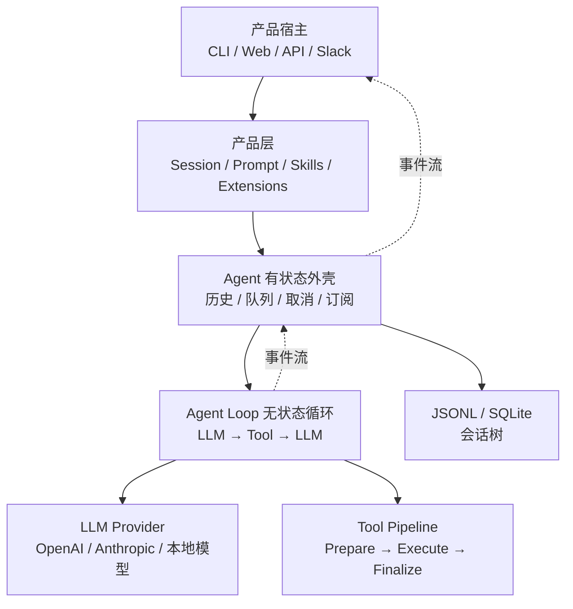

<!-- Generated by SpecStory, Markdown v2.1.0 -->

# 2026-08-16 03:32:12Z

<!-- Codex CLI Session 01a008a0-698f-72c3-911f-e6211a6fa165 (2026-08-16 03:32:12Z) -->

_**User (2026-08-16 03:32:12Z)**_

from contextlib import contextmanager
from collections import defaultdict

class Exchange:
    def __init__(self):
        self._subscribers = set()

    def attach(self, task):
        self._subscribers.add(task)

    def detach(self, task):
        self._subscribers.remove(task)

    @contextmanager
    def subscribe(self, *tasks):
        for task in tasks:
            self.attach(task)
        try:
            yield
        finally:
            for task in tasks:
                self.detach(task)

    def send(self, msg):
        for subscriber in self._subscribers:
            subscriber.send(msg)

# Dictionary of all created exchanges
_exchanges = defaultdict(Exchange)

# Return the Exchange instance associated with a given name
def get_exchange(name):
    return _exchanges[name]

# Example of using the subscribe() method
exc = get_exchange('name')
with exc.subscribe(task_a, task_b):
     ...
     exc.send('msg1')
     exc.send('msg2')
     ...

这里的yeild 含义是什么，后续我怎么使用这个


---

_**Agent (gpt-5.6-sol 2026-08-16 03:32:18Z)**_

<think><details><summary>Thought Process</summary>
**Explaining contextmanager mechanics with examples**
</details></think>

_**Agent (gpt-5.6-sol 2026-08-16 03:32:30Z)**_

这里是 `yield`，不是 `yeild`。

它在 `@contextmanager` 中表示：**暂停 `subscribe()` 的执行，把控制权交给 `with` 代码块；等 `with` 结束后，再从 `yield` 后面继续执行。**

执行顺序相当于：

```python
with exc.subscribe(task_a, task_b):
    exc.send("msg1")
    exc.send("msg2")
```

实际经历：

```text
attach(task_a)
attach(task_b)
        ↓
执行 with 里面的代码
        ↓
detach(task_a)
detach(task_b)
```

即使 `with` 里面发生异常，`finally` 也会执行，订阅仍然会被解除。

## 完整使用示例

订阅对象需要提供 `send()` 方法：

```python
class Task:
    def __init__(self, name):
        self.name = name

    def send(self, msg):
        print(f"{self.name} 收到消息：{msg}")


task_a = Task("任务 A")
task_b = Task("任务 B")

exc = get_exchange("orders")

with exc.subscribe(task_a, task_b):
    exc.send("订单已创建")
    exc.send("订单已支付")

# 离开 with 后，task_a 和 task_b 已经自动取消订阅
exc.send("这条消息没人接收")
```

输出类似：

```text
任务 A 收到消息：订单已创建
任务 B 收到消息：订单已创建
任务 A 收到消息：订单已支付
任务 B 收到消息：订单已支付
```

因为订阅者保存在 `set` 中，所以 A、B 的实际输出顺序不固定。

## `yield` 前后分别负责什么

```python
@contextmanager
def subscribe(self, *tasks):
    # 进入 with 时执行：建立资源
    for task in tasks:
        self.attach(task)

    try:
        yield  # 暂停在这里，开始执行 with 内部代码
    finally:
        # 离开 with 时执行：清理资源
        for task in tasks:
            self.detach(task)
```

这是一种典型的“进入时准备、离开时清理”写法，类似于文件操作：

```python
with open("data.txt") as file:
    content = file.read()
# 离开 with 后文件自动关闭
```

## `yield` 也可以返回一个值

当前代码只是：

```python
yield
```

因此下面的 `subscription` 是 `None`：

```python
with exc.subscribe(task_a) as subscription:
    print(subscription)  # None
```

如果写成：

```python
@contextmanager
def subscribe(self, *tasks):
    for task in tasks:
        self.attach(task)

    try:
        yield self
    finally:
        for task in tasks:
            self.detach(task)
```

就可以这样使用：

```python
with exc.subscribe(task_a, task_b) as subscribed_exchange:
    subscribed_exchange.send("消息")
```

不过这里通常没有必要，因为外面已经有 `exc` 变量。

一句话理解：**`yield` 是 `with` 代码块的分界线——前面负责订阅，后面负责取消订阅。**

---

_**User (2026-08-16 03:34:21Z)**_

所以这里的yield的目的和作用是什么


---

_**Agent (gpt-5.6-sol 2026-08-16 03:34:31Z)**_

这里 `yield` 的核心作用是：**把订阅的有效期包住 `with` 代码块。**

```python
@contextmanager
def subscribe(self, *tasks):
    # 1. 进入 with：建立订阅
    for task in tasks:
        self.attach(task)

    try:
        yield  # 2. 暂停这里，执行 with 里面的代码
    finally:
        # 3. 离开 with：取消订阅
        for task in tasks:
            self.detach(task)
```

执行：

```python
with exc.subscribe(task_a, task_b):
    exc.send("hello")
```

相当于：

```python
exc.attach(task_a)
exc.attach(task_b)

try:
    exc.send("hello")
finally:
    exc.detach(task_a)
    exc.detach(task_b)
```

所以它的目的有三个：

1. `yield` 前面的代码负责“进入”：添加订阅者。
2. `yield` 把控制权交给 `with` 内部，让订阅暂时生效。
3. `yield` 后面的代码负责“退出”：自动取消订阅。

即使 `with` 内发生异常，`finally` 也会执行：

```python
with exc.subscribe(task_a):
    exc.send("消息")
    raise ValueError("出错了")

# task_a 依然会被取消订阅
```

在 `@contextmanager` 修饰的函数里，通常必须有且只有一次 `yield`。可以把它理解为：

> `yield` 前面是进入 `with` 时执行的代码，`yield` 后面是退出 `with` 时执行的代码。

---

_**User (2026-08-16 03:39:48Z)**_

def countdown(n):
    while n > 0:
        print('T-minus', n)
        yield
        n -= 1
    print('Blastoff!')

def countup(n):
    x = 0
    while x < n:
        print('Counting up', x)
        yield
        x += 1
这个是什么意思，执行顺序呢


---

_**Agent (gpt-5.6-sol 2026-08-16 03:39:57Z)**_

<think><details><summary>Thought Process</summary>
**Explaining generator execution and scheduling**
</details></think>

_**Agent (gpt-5.6-sol 2026-08-16 03:40:08Z)**_

这两个函数都是“生成器函数”。这里的 `yield` 表示：

> 暂停当前函数，保存局部变量和执行位置；下一次调用 `next()` 时，从 `yield` 后面继续。

注意：`yield` 不会自动从 `countdown()` 切换到 `countup()`，需要外部代码负责调用和调度。

## `countdown(3)` 的执行顺序

```python
task = countdown(3)
```

此时只创建生成器，函数体还没有执行，也不会打印。

第一次：

```python
next(task)
```

执行到第一个 `yield`：

```text
n = 3
打印 T-minus 3
遇到 yield，暂停
```

输出：

```text
T-minus 3
```

第二次：

```python
next(task)
```

从上一次 `yield` 后面继续：

```text
n -= 1，n 变成 2
进入下一轮循环
打印 T-minus 2
遇到 yield，再次暂停
```

继续执行：

```python
next(task)  # 打印 T-minus 1
next(task)  # 打印 Blastoff!，然后抛出 StopIteration
```

完整代码：

```python
task = countdown(3)

next(task)  # T-minus 3
next(task)  # T-minus 2
next(task)  # T-minus 1
next(task)  # Blastoff!，然后抛出 StopIteration
```

最后一次会报：

```text
StopIteration
```

因为生成器已经执行完毕。

## `countup(3)` 的执行顺序

```python
task = countup(3)

next(task)  # Counting up 0
next(task)  # Counting up 1
next(task)  # Counting up 2
next(task)  # 抛出 StopIteration
```

执行过程是：

```text
x = 0 → 打印 0 → yield 暂停
x = 1 → 打印 1 → yield 暂停
x = 2 → 打印 2 → yield 暂停
x = 3 → 循环结束
```

## 交替执行两个生成器

可以手动交替调用：

```python
down = countdown(3)
up = countup(3)

next(down)
next(up)

next(down)
next(up)

next(down)
next(up)
```

输出：

```text
T-minus 3
Counting up 0
T-minus 2
Counting up 1
T-minus 1
Counting up 2
```

这就是一种简单的“协作式任务切换”：

```text
countdown 执行到 yield
        ↓
countup 执行到 yield
        ↓
countdown 从上次位置继续
        ↓
countup 从上次位置继续
```

也可以写一个简单调度器：

```python
tasks = [
    countdown(3),
    countup(3),
]

while tasks:
    for task in tasks.copy():
        try:
            next(task)
        except StopIteration:
            tasks.remove(task)
```

输出：

```text
T-minus 3
Counting up 0
T-minus 2
Counting up 1
T-minus 1
Counting up 2
Blastoff!
```

这里的 `yield` 没有返回具体内容，相当于：

```python
yield None
```

它的主要用途不是产生数据，而是提供一个“暂停点”，让外部调度器有机会执行其他任务。之前 `@contextmanager` 中的 `yield` 也使用了相同的暂停机制，只不过 `contextmanager` 把它包装成了 `with` 的进入和退出流程。

---

_**User (2026-08-16 03:40:24Z)**_

        n -= 1
 是什么时候执行的


---

_**Agent (gpt-5.6-sol 2026-08-16 03:40:30Z)**_

`n -= 1` 是在**下一次调用 `next()` 时**执行的，因为它位于 `yield` 后面。

例如：

```python
def countdown(n):
    while n > 0:
        print("T-minus", n)
        yield
        n -= 1
    print("Blastoff!")
```

执行：

```python
task = countdown(3)
```

这里只创建生成器，函数体尚未执行。

```python
next(task)
```

执行顺序：

```text
print("T-minus", 3)
yield 暂停
```

此时 `n` 仍然是 `3`，`n -= 1` 还没执行。

再次调用：

```python
next(task)
```

函数从 `yield` 后面恢复：

```text
n -= 1       # n 从 3 变成 2
检查 while   # 2 > 0
打印 T-minus 2
遇到 yield，再次暂停
```

因此完整时间线是：

```text
第一次 next()
    打印 T-minus 3
    yield 暂停

第二次 next()
    n -= 1，n 变成 2
    打印 T-minus 2
    yield 暂停

第三次 next()
    n -= 1，n 变成 1
    打印 T-minus 1
    yield 暂停

第四次 next()
    n -= 1，n 变成 0
    while 条件不成立
    打印 Blastoff!
    生成器结束，抛出 StopIteration
```

关键规则是：

> 遇到 `yield` 时暂停；下一次调用 `next()` 时，从 `yield` 的下一行继续执行。

---

_**User (2026-08-16 04:27:59Z)**_

https://zhanghandong.github.io/pi-book/ 分析这个里面的设计哲学，用了什么系统设计，用python来做 需要懂哪些知识

---

_**Agent (gpt-5.6-sol 2026-08-16 04:28:07Z)**_

<think><details><summary>Thought Process</summary>
**Planning comprehensive site analysis**
</details></think>

_**Agent (gpt-5.6-sol 2026-08-16 04:28:09Z)**_

我会用 `learn` 技能来做这次分析，因为它适合把一套陌生的技术资料拆成“核心模型、设计哲学、系统结构、Python 学习路径”。我会先核对站点正文和它引用的源码，再给你一个偏初学者、可落地的结论。

_**Agent (gpt-5.6-sol 2026-08-16 04:28:11Z)**_

<tool-use data-tool-type="unknown" data-tool-name="exec"><details>
<summary>Tool use: **exec**</summary>
Input (truncated): ```
const r = await tools.exec_command({"cmd":"sed -n '1,260p' /Users/xiaokezhou/.agents/skills/learn/SKILL.md\nrg -n \"pi-book|plugin-agent-learning-design|Cordis|DeepSeek Harness|concept-first|概念\" 
...
```
</details></tool-use>

_**Agent (gpt-5.6-sol 2026-08-16 04:28:19Z)**_

<think><details><summary>Thought Process</summary>
**Deciding default Quick Reference mode with non-blocking prompt**
</details></think>

_**Agent (gpt-5.6-sol 2026-08-16 04:28:20Z)**_

我先按 `Quick Reference` 模式推进：重点是让你快速建立可用的心智模型，不先写成超长文章。`learn` 流程要求外部页面先按 `read` 的规则抓取，因此我现在先确认抓取方式，再做源码交叉验证。

_**Agent (gpt-5.6-sol 2026-08-16 04:28:21Z)**_

<tool-use data-tool-type="unknown" data-tool-name="exec"><details>
<summary>Tool use: **exec**</summary>
Input (truncated): ```
const r = await tools.exec_command({"cmd":"sed -n '1,320p' /Users/xiaokezhou/.agents/skills/read/SKILL.md\nsed -n '1,220p' /Users/xiaokezhou/.agents/skills/write/SKILL.md\nsed -n '1,120p' /Users/xiaok
...
```
</details></tool-use>

_**Agent (gpt-5.6-sol 2026-08-16 04:28:27Z)**_

<think><details><summary>Thought Process</summary>
**Planning web discovery and targeted searches**
</details></think>

_**Agent (gpt-5.6-sol 2026-08-16 04:28:29Z)**_

<tool-use data-tool-type="unknown" data-tool-name="exec"><details>
<summary>Tool use: **exec**</summary>
Input (truncated): ```
const r = await tools.exec_command({"cmd":"sed -n '1,360p' /Users/xiaokezhou/.agents/skills/read/references/read-methods.md","workdir":"/Users/xiaokezhou/workspace/mewcode-python","yield_time_ms":1000
...
```
</details></tool-use>

_**Agent (gpt-5.6-sol 2026-08-16 04:28:32Z)**_

<tool-use data-tool-type="unknown" data-tool-name="exec"><details>
<summary>Tool use: **exec**</summary>
Input (truncated): ```
const r = await tools.web__run({"search_query":[{"q":"site:zhanghandong.github.io/pi-book \"动手学 Pi\""},{"q":"site:github.com badlogic pi-mono pi coding agent repository"},{"q":"Pi coding agent o
...
```
</details></tool-use>

_**Agent (gpt-5.6-sol 2026-08-16 04:28:42Z)**_

<think><details><summary>Thought Process</summary>
**Planning direct website fetching approach**
</details></think>

_**Agent (gpt-5.6-sol 2026-08-16 04:28:43Z)**_

<tool-use data-tool-type="unknown" data-tool-name="exec"><details>
<summary>Tool use: **exec**</summary>
Input (truncated): ```
const r = await tools.exec_command({"cmd":"rg --files /Users/xiaokezhou/.agents/skills/read | sort\nbash /Users/xiaokezhou/.agents/skills/read/scripts/fetch.sh --help","workdir":"/Users/xiaokezhou/wor
...
```
</details></tool-use>

_**Agent (gpt-5.6-sol 2026-08-16 04:28:48Z)**_

<think><details><summary>Thought Process</summary>
**Evaluating fetch output handling without file writes**
</details></think>

_**Agent (gpt-5.6-sol 2026-08-16 04:28:49Z)**_

<tool-use data-tool-type="unknown" data-tool-name="exec"><details>
<summary>Tool use: **exec**</summary>
Input (truncated): ```
const r = await tools.exec_command({"cmd":"bash /Users/xiaokezhou/.agents/skills/read/scripts/fetch.sh https://zhanghandong.github.io/pi-book/","workdir":"/Users/xiaokezhou/workspace/mewcode-python","
...
```
</details></tool-use>

_**Agent (gpt-5.6-sol 2026-08-16 04:28:53Z)**_

本地隐私抓取被当前网络权限拦住了。我会按 `read` 技能的回退规则改用网页读取工具；这个站点是公开资料，不涉及登录或私密链接。

_**Agent (gpt-5.6-sol 2026-08-16 04:28:54Z)**_

<tool-use data-tool-type="unknown" data-tool-name="exec"><details>
<summary>Tool use: **exec**</summary>
Input (truncated): ```
const r = await tools.web__run({"open":[{"ref_id":"https://zhanghandong.github.io/pi-book/"},{"ref_id":"https://github.com/badlogic/pi-mono"},{"ref_id":"https://github.com/badlogic/pi-mono/tree/main/p
...
```
</details></tool-use>

_**Agent (gpt-5.6-sol 2026-08-16 04:29:03Z)**_

<tool-use data-tool-type="unknown" data-tool-name="exec"><details>
<summary>Tool use: **exec**</summary>
Input (truncated): ```
const r = await tools.web__run({"search_query":[{"q":"\"pi 的设计艺术：构建生产级 Coding Agent 的架构决策\""},{"q":"\"第九篇\" \"pi 的设计艺术\""},{"q":"\"能力外置\" \"pi\"
...
```
</details></tool-use>

_**Agent (gpt-5.6-sol 2026-08-16 04:29:13Z)**_

<think><details><summary>Thought Process</summary>
**Exploring mdBook chapter links via search index**
</details></think>

_**Agent (gpt-5.6-sol 2026-08-16 04:29:16Z)**_

<tool-use data-tool-type="unknown" data-tool-name="exec"><details>
<summary>Tool use: **exec**</summary>
Input (truncated): ```
const r = await tools.web__run({"search_query":[{"q":"site:zhanghandong.github.io/pi-book/ \"第 1 章\""},{"q":"site:zhanghandong.github.io/pi-book/ \"第 8 章\""},{"q":"site:zhanghandong.github.io/
...
```
</details></tool-use>

_**Agent (gpt-5.6-sol 2026-08-16 04:29:29Z)**_

<think><details><summary>Thought Process</summary>
**Planning chapter content retrieval**
</details></think>

_**Agent (gpt-5.6-sol 2026-08-16 04:29:29Z)**_

<tool-use data-tool-type="unknown" data-tool-name="exec"><details>
<summary>Tool use: **exec**</summary>
Input (truncated): ```
const r = await tools.web__run({"open":[{"ref_id":"https://zhanghandong.github.io/pi-book/toc.html"},{"ref_id":"https://zhanghandong.github.io/pi-book/searchindex.json"},{"ref_id":"https://zhanghandon
...
```
</details></tool-use>

_**Agent (gpt-5.6-sol 2026-08-16 04:29:37Z)**_

<tool-use data-tool-type="unknown" data-tool-name="exec"><details>
<summary>Tool use: **exec**</summary>
Input (truncated): ```
const r = await tools.web__run({"open":[{"ref_id":"turn4view3","lineno":109},{"ref_id":"turn4view3","lineno":148},{"ref_id":"turn4view3","lineno":210},{"ref_id":"turn4view3","lineno":270},{"ref_id":"t
...
```
</details></tool-use>

_**Agent (gpt-5.6-sol 2026-08-16 04:29:44Z)**_

<tool-use data-tool-type="unknown" data-tool-name="exec"><details>
<summary>Tool use: **exec**</summary>
Input (truncated): ```
const r = await tools.web__run({"search_query":[{"q":"site:zhanghandong.github.io/pi-book/ch32-boundaries.html \"这套架构的适用边界\""},{"q":"site:zhanghandong.github.io/pi-book/ \"会话树\
...
```
</details></tool-use>

_**Agent (gpt-5.6-sol 2026-08-16 04:29:56Z)**_

<think><details><summary>Thought Process</summary>
**Verifying source version alignment**
</details></think>

_**Agent (gpt-5.6-sol 2026-08-16 04:29:58Z)**_

目前已经确认，这本书的主线不是“怎么调用一次 LLM”，而是“怎样把一个可长期运行、能调用工具、能被多种产品复用的 Agent Runtime 做薄、做稳”。接下来我会重点核对分层、事件流、工具管道、会话树和扩展机制，再把它们逐项翻译成 Python 设计。

_**Agent (gpt-5.6-sol 2026-08-16 04:29:59Z)**_

<tool-use data-tool-type="unknown" data-tool-name="exec"><details>
<summary>Tool use: **exec**</summary>
Input (truncated): ```
const r = await tools.web__run({"click":[{"ref_id":"turn4view0","id":2},{"ref_id":"turn4view0","id":4},{"ref_id":"turn4view0","id":6},{"ref_id":"turn4view0","id":9},{"ref_id":"turn4view0","id":10},{"r
...
```
</details></tool-use>

_**Agent (gpt-5.6-sol 2026-08-16 04:30:08Z)**_

<tool-use data-tool-type="unknown" data-tool-name="exec"><details>
<summary>Tool use: **exec**</summary>
Input (truncated): ```
const r = await tools.web__run({"open":[{"ref_id":"turn7view1","lineno":17},{"ref_id":"turn7view1","lineno":105},{"ref_id":"turn7view1","lineno":244},{"ref_id":"turn7view2","lineno":14},{"ref_id":"tur
...
```
</details></tool-use>

_**Agent (gpt-5.6-sol 2026-08-16 04:30:18Z)**_

<tool-use data-tool-type="unknown" data-tool-name="exec"><details>
<summary>Tool use: **exec**</summary>
Input (truncated): ```
const r = await tools.web__run({"open":[{"ref_id":"turn7view5","lineno":14},{"ref_id":"turn7view5","lineno":90},{"ref_id":"turn7view5","lineno":270},{"ref_id":"turn7view5","lineno":438},{"ref_id":"tur
...
```
</details></tool-use>

_**Agent (gpt-5.6-sol 2026-08-16 04:30:25Z)**_

<tool-use data-tool-type="unknown" data-tool-name="exec"><details>
<summary>Tool use: **exec**</summary>
Input (truncated): ```
const r = await tools.web__run({"open":[{"ref_id":"turn7view9","lineno":14},{"ref_id":"turn7view9","lineno":76},{"ref_id":"turn7view9","lineno":198},{"ref_id":"turn7view10","lineno":14},{"ref_id":"tur
...
```
</details></tool-use>

_**Agent (gpt-5.6-sol 2026-08-16 04:30:39Z)**_

<think><details><summary>Thought Process</summary>
**Planning Python learning roadmap with memory citations**
</details></think>

_**Agent (gpt-5.6-sol 2026-08-16 04:30:39Z)**_

<think><details><summary>Thought Process</summary>
**Citing MEMORY.md lines with repo version comparison**
</details></think>

_**Agent (gpt-5.6-sol 2026-08-16 04:30:49Z)**_

<think><details><summary>Thought Process</summary>
**Planning Python learning roadmap with memory citations**
</details></think>

_**Agent (gpt-5.6-sol 2026-08-16 04:30:49Z)**_

<think><details><summary>Thought Process</summary>
**Citing MEMORY.md lines with repo version comparison**
</details></think>

_**Agent (gpt-5.6-sol 2026-08-16 04:30:57Z)**_

<think><details><summary>Thought Process</summary>
**Planning Python learning roadmap with memory citations**
</details></think>

_**Agent (gpt-5.6-sol 2026-08-16 04:30:57Z)**_

<think><details><summary>Thought Process</summary>
**Citing MEMORY.md lines with repo version comparison**
</details></think>

_**Agent (gpt-5.6-sol 2026-08-16 04:30:57Z)**_

<think><details><summary>Thought Process</summary>
**Summarizing agent runtime design and Python knowledge roadmap**
</details></think>

_**Agent (gpt-5.6-sol 2026-08-16 04:31:05Z)**_

<think><details><summary>Thought Process</summary>
**Planning Python learning roadmap with memory citations**
</details></think>

_**Agent (gpt-5.6-sol 2026-08-16 04:31:05Z)**_

<think><details><summary>Thought Process</summary>
**Citing MEMORY.md lines with repo version comparison**
</details></think>

_**Agent (gpt-5.6-sol 2026-08-16 04:31:05Z)**_

<think><details><summary>Thought Process</summary>
**Summarizing agent runtime design and Python knowledge roadmap**
</details></think>

_**Agent (gpt-5.6-sol 2026-08-16 04:31:05Z)**_

<think><details><summary>Thought Process</summary>
**Outlining Python agent architecture with phased implementation**
</details></think>

_**Agent (gpt-5.6-sol 2026-08-16 04:31:13Z)**_

<think><details><summary>Thought Process</summary>
**Planning Python learning roadmap with memory citations**
</details></think>

_**Agent (gpt-5.6-sol 2026-08-16 04:31:13Z)**_

<think><details><summary>Thought Process</summary>
**Citing MEMORY.md lines with repo version comparison**
</details></think>

_**Agent (gpt-5.6-sol 2026-08-16 04:31:13Z)**_

<think><details><summary>Thought Process</summary>
**Summarizing agent runtime design and Python knowledge roadmap**
</details></think>

_**Agent (gpt-5.6-sol 2026-08-16 04:31:13Z)**_

<think><details><summary>Thought Process</summary>
**Outlining Python agent architecture with phased implementation**
</details></think>

_**Agent (gpt-5.6-sol 2026-08-16 04:31:13Z)**_

<think><details><summary>Thought Process</summary>
**Finalizing conclusion with architecture diagram and citations**
</details></think>

_**Agent (gpt-5.6-sol 2026-08-16 04:31:54Z)**_

🥷结论：这本书真正值得学的不是 TypeScript 写法，而是一套 Agent Runtime 的设计方法：

> 用尽可能薄、稳定、可测试的内核，提供少量组合原语；把产品相关能力放到外层。

书中分析基于 pi v0.66.0，并对照到 v0.82.1。当前官方仓库已经迁移为 `earendil-works/pi`，所以设计思想仍可参考，但具体包名、文件路径和接口可能继续变化。[书籍前言](https://zhanghandong.github.io/pi-book/)、[当前官方仓库](https://github.com/earendil-works/pi)

## 一、Pi 的抽象模型



它不是把所有功能塞进一个 `Agent` 大类，而是拆成：

- `pi-ai`：统一不同 LLM 厂商。
- `pi-agent-core`：负责 Agent Loop、工具调用和事件。
- `pi-coding-agent`：负责会话、提示词、工具、扩展等具体产品能力。
- TUI、RPC、Web、Slack：只是不同的宿主外壳。

依赖只能从上层指向下层，底层不知道上层存在。这属于严格的分层架构和依赖倒置。[分层设计](https://zhanghandong.github.io/pi-book/ch02-packages.html)

## 二、核心设计哲学

### 1. 极简核心，能力外置

内核只负责三件事：

1. 调模型。
2. 跑 Agent Loop。
3. 管运行时状态。

会话存储、上下文压缩、权限界面、Plan Mode、Sub-agent、UI、Skill 都在内核之外。[极简核心设计](https://zhanghandong.github.io/pi-book/ch30-minimal-core.html)

它判断一个功能要不要进入内核时，会问：

- 是否和具体产品形态有关？有关就外置。
- 是否存在多种合理实现？有就做成接口或回调。
- 是否必须全系统保持一致？必须一致才进入内核。

例如权限确认在 CLI 里可能是弹窗，在 Slack 里可能是消息审批，在 CI 中可能完全禁止人工确认。因此内核只提供 `beforeToolCall()`，不内建固定弹窗。

### 2. 协议优先，不是框架优先

Pi 更像“积木接口”，不是“替你决定一切的框架”。

工具只要满足 Tool 协议，模型调用只要满足 Stream 协议，UI 只要消费事件流。上层可以自由替换实现。

Python 中可以使用 `Protocol` 表达：

```python
from collections.abc import AsyncIterator
from typing import Protocol


class LLMProvider(Protocol):
    async def stream(
        self,
        context: "LLMContext",
    ) -> AsyncIterator["LLMEvent"]:
        ...


class Tool(Protocol):
    name: str

    async def execute(
        self,
        arguments: dict,
    ) -> "ToolResult":
        ...
```

这里建议优先使用 `Protocol`，只有需要提供共享实现时才使用 `ABC`。

### 3. 无状态发动机，有状态外壳

`agent_loop()` 尽量不保存长期状态，只接收：

- 当前消息；
- 模型；
- 工具；
- 回调；
- 事件接收器。

真正的对话历史、订阅者、消息队列、取消状态、运行互斥，由外面的 `Agent` 对象保存。[Agent Loop](https://zhanghandong.github.io/pi-book/ch08-agent-loop.html)、[有状态 Agent 外壳](https://zhanghandong.github.io/pi-book/ch10-agent-class.html)

Python 中可以对应为：

```python
async def agent_loop(context, config):
    while True:
        response = await call_llm(context, config)

        yield MessageCompleted(response)

        if not response.tool_calls:
            break

        results = await execute_tools(response.tool_calls, config)

        for result in results:
            context.messages.append(result)
            yield ToolCompleted(result)
```

外面再套一层：

```python
class Agent:
    def __init__(self, loop_config):
        self.messages = []
        self.listeners = set()
        self.steering_queue = []
        self.running_task = None
        self.loop_config = loop_config
```

这让循环可以脱离真实 LLM、数据库和 UI 单独测试。

### 4. 事件流是一等数据模型

LLM 不只返回最终字符串，而是不断产生：

- 文本增量；
- thinking 增量；
- tool call；
- token 使用量；
-错误；
- 完成事件。

Pi 把请求失败也编码进事件流，而不是运行到一半突然抛出异常。[统一事件流](https://zhanghandong.github.io/pi-book/ch06-event-stream.html)

Python 最自然的对应是：

- `async generator`
- `AsyncIterator`
- `asyncio.Queue`
- `asyncio.TaskGroup`
- `asyncio.CancelledError`

```python
async for event in provider.stream(context):
    await event_queue.put(event)
    yield event
```

### 5. 工具不是直接调用，而是一条管道

工具执行分成：

```text
Prepare → Execute → Finalize
```

- Prepare：查找工具、转换参数、Pydantic 校验、权限检查。
- Execute：执行真实操作，产生进度。
- Finalize：记录结果、审计、格式化错误、发送事件。

这样权限、日志、限流、审计就不用污染每个工具的业务代码。[工具执行管道](https://zhanghandong.github.io/pi-book/ch09-tool-execution.html)

在 Python 中，这类似于：

- Middleware；
- Pipeline；
- Command Pattern；
- Hook；
- 结构化并发。

参数模型建议使用 Pydantic：

```python
from pydantic import BaseModel


class ReadFileArgs(BaseModel):
    path: str
    offset: int = 0
    limit: int = 200
```

不要直接把任意 `dict` 交给工具执行。

### 6. 约束比万能更安全

Pi 没有只给模型一个万能 Shell，而是提供 `read`、`write`、`edit`、`find`、`grep` 等结构化工具，再把 Shell 作为后备。

因为：

```text
能力越宽泛
    → 参数空间越大
    → 模型犯错方式越多
    → 权限和审计越困难
```

因此 Python 工具也应该尽量做到：

- 参数明确；
- 路径明确；
- 输出有上限；
- 支持超时和取消；
- 错误结构化；
- 副作用可审计。

这属于 Capability Security 和最小权限思想。[工具设计原则](https://zhanghandong.github.io/pi-book/ch19-tool-principles.html)

### 7. 会话不是列表，而是追加式树

Coding Agent 经常需要回到某一步重新尝试。因此会话采用：

```text
entry_id + parent_id
```

每个新记录只追加，不修改旧记录。同一个父节点有多个子节点，就形成不同分支。[会话树设计](https://zhanghandong.github.io/pi-book/ch11-session-tree.html)

Python 第一版可以直接使用 JSONL：

```python
@dataclass
class SessionEntry:
    id: str
    parent_id: str | None
    type: str
    payload: dict
```

后续再换 SQLite：

```sql
CREATE TABLE session_entries (
    id TEXT PRIMARY KEY,
    session_id TEXT NOT NULL,
    parent_id TEXT,
    entry_type TEXT NOT NULL,
    payload_json TEXT NOT NULL,
    created_at TEXT NOT NULL
);
```

它带有 Append-only Log 和 Event Sourcing 的味道，但不要一开始就做成复杂的完整事件溯源框架。

### 8. 能用文档解决，就不要写运行时代码

Pi 把能力分成两类：

- Skill：Markdown，告诉模型“应该怎么做”。
- Extension：代码，真正增加工具、事件处理和 UI 能力。

如果只是 TDD 流程、代码审查规范、项目知识，用文档足够。只有需要访问数据库、调用 API、操作文件时才写代码。[Skill 设计](https://zhanghandong.github.io/pi-book/ch16-skills.html)、[Extension 设计](https://zhanghandong.github.io/pi-book/ch15-extensions.html)

这是一种很重要的复杂度控制：

> 能用配置解决，不写插件；能用文档解决，不写配置；确实需要副作用时，才写代码。

## 三、用 Python 实现需要掌握什么

建议按这个顺序学习。

### 第一层：必须先掌握

- 函数、类、迭代器、生成器、异常。
- `dataclass`。
- 类型标注。
- `Protocol`、`Generic`、`TypeVar`、`Literal`。
- `async/await`。
- 异步生成器和 `async for`。
- `asyncio.Queue`、`Task`、`Lock`、取消和超时。
- Pydantic 数据校验。
- pytest 和 `pytest-asyncio`。

你前面正在学习的 `yield`，在这里非常关键。事件流通常就是：

```python
async def stream_events():
    yield AgentStarted()
    yield TextDelta("hello")
    yield AgentCompleted()
```

### 第二层：Agent 相关知识

- LLM Message：system、user、assistant、tool。
- Tool Calling 和 JSON Schema。
- Streaming/SSE。
- Token 和 Context Window。
- 上下文裁剪与摘要。
- Prompt 装配。
- 多模型 Provider 差异。
- 重试、限流、超时和费用统计。

### 第三层：系统设计知识

- 分层架构。
- 依赖倒置和依赖注入。
- Strategy/Provider 模式。
- Observer/Pub-Sub。
- Command 模式。
- Pipeline/Middleware。
- 状态机。
- Plugin Registry。
- Append-only Log。
- JSONL、SQLite、事务和崩溃恢复。
- RPC、JSON Lines、WebSocket。
- 日志、Tracing、权限控制和 Sandbox。

## 四、推荐的 Python 实现顺序

不要一上来做完整 Coding Agent，可以按五步实现。

1. 最小 Agent Loop

   使用 Fake Provider，完成“用户消息 → 模型响应 → 停止”。

2. 工具调用

   加一个计算器工具，实现参数校验和 `prepare → execute → finalize`。

3. 事件流和 Agent 外壳

   增加 `async generator`、订阅者、消息队列、取消和防止重复运行。

4. 会话持久化

   使用 JSONL 保存 `id + parent_id`，实现恢复和分支。

5. 外置能力

   加入 Skills、Extension Registry、Provider Registry，最后再做 CLI、Web 或 RPC。

推荐的目录结构：

```text
mini_pi/
├── ai/
│   ├── types.py
│   ├── provider.py
│   └── fake_provider.py
├── agent/
│   ├── events.py
│   ├── loop.py
│   ├── runtime.py
│   └── tools.py
├── product/
│   ├── session.py
│   ├── skills.py
│   ├── extensions.py
│   └── prompt_builder.py
├── hosts/
│   ├── cli.py
│   └── rpc.py
└── tests/
```

第一版不需要学习 MCP、向量数据库、多 Agent 编排、Docker、Kubernetes 或复杂 Web UI。先把“无状态循环 + 有状态外壳 + 事件流 + 工具管道”做出来，你就已经掌握了 Pi 最核心的设计思想。
