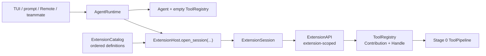
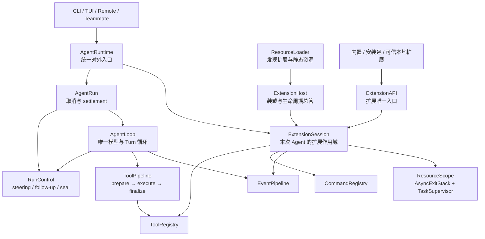

<!-- Generated by SpecStory, Markdown v2.1.0 -->

# 2026-08-17 03:23:27Z

<!-- Claude Code Session 4eb54f9a-4be7-423d-9caf-2a9222ea7b55 (2026-08-17 03:23:27Z) -->

_**User (2026-08-17 03:23:27Z)**_

pi的极简核心 + ExtensionsMicrokernel、Plugin Architecture、开闭原则、控制反转新能力不需要修改核心
当前是怎么做的

---

_**Agent (claude-opus-5 2026-08-17 03:23:40Z)**_

<think><details><summary>Thought Process</summary>
The user is asking in Chinese about how the current codebase (mewcode-python) implements its extension mechanism and kernel architecture — essentially wanting to understand the existing design around minimal core, extensions, microkernel pattern, plugin architecture, open-closed principle, and inversion of control. This calls for exploring the actual codebase to see how it's currently structured.

I don't think any special skill applies here since this is an analytical question about existing code, not creative brainstorming or debugging. I'll explore the repository directly using Grep and Read rather than delegating to an agent tool, since the instructions say not to call it unless requested.
</details></think>

_**Agent (claude-opus-5 2026-08-17 03:23:41Z)**_

<tool-use data-tool-type="shell" data-tool-name="Bash"><details>
<summary>Tool use: **Bash**</summary>
列出项目 Python 文件与根目录结构

`find . -type f -name "*.py" -not -path "./.git/*" -not -path "*/node_modules/*" -not -path "*/.venv/*" | head -100 && echo "---TREE---" && ls -la`

```text
./tests/test_team_protocol.py
./tests/test_toolresult_wiring.py
./tests/test_agent_runtime.py
./tests/test_coordinator_multi_team.py
./tests/test_run_control.py
./tests/conftest.py
./tests/test_agent.py
./tests/test_tool_search.py
./tests/test_mascot_overlay.py
./tests/test_ui_state.py
./tests/test_conversation_pairing.py
./tests/test_extensions.py
./tests/test_recovery.py
./tests/test_consolidation.py
./tests/test_hello_world.py
./tests/test_tool_registry.py
./tests/test_subagent.py
./tests/test_tui_runtime_adapter.py
./tests/test_tool_call_block.py
./tests/test_input_focus.py
./tests/test_turn_preparer.py
./tests/test_tool_pipeline.py
./tests/test_teammate_registry.py
./tests/test_diff.py
./tests/test_remote_mascot.py
./tests/test_hooks.py
./tests/test_commands.py
./tests/test_remote_runtime_adapter.py
./tests/test_skills.py
./tests/test_clear.py
./tests/test_context.py
./tests/test_memory.py
./tests/test_mini_pi_agent.py
./tests/test_teams.py
./tests/test_serialization.py
./tests/test_context_window.py
./tests/test_mcp.py
./tests/test_runtime_composition.py
./tests/test_edit_file.py
./tests/test_worktree.py
./tests/test_permissions.py
./tests/verify_subagent.py
./examples/__init__.py
./mewcode/validator.py
./mewcode/ui_state.py
./mewcode/teammate_tree.py
./mewcode/session_dialog.py
./mewcode/config.py
./mewcode/askuser_dialog.py
./mewcode/remote.py
./mewcode/conversation.py
./mewcode/plan_dialog.py
./mewcode/client.py
./mewcode/permission_dialog.py
./mewcode/__init__.py
./mewcode/prompts.py
./mewcode/web_content.py
./mewcode/mascot_overlay.py
./mewcode/agent.py
./mewcode/app.py
./mewcode/driver.py
./mewcode/conversation_pairing.py
./mewcode/__main__.py
./mewcode/serialization.py
./examples/cordis_coffee_shop/__init__.py
./examples/cordis_coffee_shop/demo.py
./examples/mini_pi_agent/models.py
./examples/mini_pi_agent/registry.py
./examples/mini_pi_agent/tools.py
./examples/mini_pi_agent/__init__.py
./examples/mini_pi_agent/agent.py
./examples/mini_pi_agent/loop.py
./examples/mini_pi_agent/contracts.py
./examples/mini_pi_agent/fake_llm.py
./examples/mini_pi_agent/demo.py
./mewcode/tools/agent_tool.py
./mewcode/tools/exit_plan_mode.py
./mewcode/tools/exit_worktree.py
./mewcode/tools/install_skill.py
./mewcode/tools/send_message.py
./mewcode/tools/task_create.py
./mewcode/tools/enter_worktree.py
./mewcode/tools/team_create.py
./mewcode/tools/edit_file.py
./mewcode/tools/file_state_cache.py
./mewcode/tools/bash.py
./mewcode/tools/team_delete.py
./mewcode/tools/__init__.py
./mewcode/tools/ask_user.py
./mewcode/tools/grep.py
./mewcode/tools/task_update.py
./mewcode/tools/load_skill.py
./mewcode/tools/glob.py
./mewcode/tools/task_stop.py
./mewcode/tools/task_get.py
./mewcode/tools/diff.py
./mewcode/tools/read_file.py
./mewcode/tools/write_file.py
./mewcode/tools/synthetic_output.py
./mewcode/tools/base.py
---TREE---
total 424
drwxr-xr-x@ 18 xiaokezhou  staff     576 Aug 16 18:35 .
drwxr-xr-x  44 xiaokezhou  staff    1408 Aug 11 20:06 ..
-rw-r--r--@  1 xiaokezhou  staff     110 Aug 16 18:35 .cursorindexingignore
drwxr-xr-x@ 17 xiaokezhou  staff     544 Aug 17 09:51 .git
-rw-r--r--@  1 xiaokezhou  staff     292 Aug 11 20:06 .gitignore
drwxr-xr-x@ 11 xiaokezhou  staff     352 Aug 16 21:01 .mewcode
drwx------@  6 xiaokezhou  staff     192 Aug 16 15:52 .planning
drwx------@  6 xiaokezhou  staff     192 Aug 16 13:32 .pytest_cache
drwx------@  5 xiaokezhou  staff     160 Aug 16 14:28 .ruff_cache
drwxr-xr-x@  6 xiaokezhou  staff     192 Aug 17 11:23 .specstory
drwxr-xr-x@  7 xiaokezhou  staff     224 Aug 11 20:09 .venv
-rw-r--r--@  1 xiaokezhou  staff     121 Aug 11 20:06 MEWCODE.md
drwxr-xr-x@  9 xiaokezhou  staff     288 Aug 16 16:16 docs
drwx------@  6 xiaokezhou  staff     192 Aug 16 21:04 examples
drwxr-xr-x@ 40 xiaokezhou  staff    1280 Aug 16 15:37 mewcode
-rw-r--r--@  1 xiaokezhou  staff     584 Aug 11 20:06 pyproject.toml
drwxr-xr-x@ 45 xiaokezhou  staff    1440 Aug 16 17:30 tests
-rw-r--r--@  1 xiaokezhou  staff  198779 Aug 11 20:06 uv.lock
```
</details></tool-use>

_**Agent (claude-opus-5 2026-08-17 03:23:40Z)**_

<tool-use data-tool-type="shell" data-tool-name="Bash"><details>
<summary>Tool use: **Bash**</summary>
读取 README

`cat README.md 2>/dev/null | head -80`

```text
(Bash completed with no output)
```
</details></tool-use>

_**Agent (claude-opus-5 2026-08-17 03:23:44Z)**_

<think><details><summary>Thought Process</summary>
Let me look at the mewcode directory structure, especially anything related to extensions.
</details></think>

_**Agent (claude-opus-5 2026-08-17 03:23:44Z)**_

<tool-use data-tool-type="shell" data-tool-name="Bash"><details>
<summary>Tool use: **Bash**</summary>
列出 mewcode 包结构

`ls -R mewcode | head -150`

```text
__init__.py
__main__.py
__pycache__
agent.py
agents
app.py
askuser_dialog.py
client.py
commands
config.py
context
conversation.py
conversation_pairing.py
driver.py
extensions
filehistory
hooks
mascot_overlay.py
mcp
memory
permission_dialog.py
permissions
plan_dialog.py
prompts.py
remote.py
runtime
sandbox
serialization.py
session_dialog.py
skills
styles.tcss
teammate_tree.py
teams
tools
ui_state.py
validator.py
web_content.py
worktree

mewcode/__pycache__:
__init__.cpython-312.pyc
__main__.cpython-312.pyc
agent.cpython-312.pyc
app.cpython-312.pyc
askuser_dialog.cpython-312.pyc
client.cpython-312.pyc
config.cpython-312.pyc
conversation.cpython-312.pyc
conversation_pairing.cpython-312.pyc
driver.cpython-312.pyc
mascot_overlay.cpython-312.pyc
permission_dialog.cpython-312.pyc
plan_dialog.cpython-312.pyc
prompts.cpython-312.pyc
remote.cpython-312.pyc
serialization.cpython-312.pyc
session_dialog.cpython-312.pyc
teammate_tree.cpython-312.pyc
ui_state.cpython-312.pyc
validator.cpython-312.pyc
web_content.cpython-312.pyc

mewcode/agents:
__init__.py
__pycache__
builtins
fork.py
loader.py
notification.py
parser.py
task_manager.py
tool_filter.py
trace.py

mewcode/agents/__pycache__:
__init__.cpython-312.pyc
fork.cpython-312.pyc
loader.cpython-312.pyc
notification.cpython-312.pyc
parser.cpython-312.pyc
task_manager.cpython-312.pyc
tool_filter.cpython-312.pyc
trace.cpython-312.pyc

mewcode/agents/builtins:
__init__.py
__pycache__
explore.md
general-purpose.md
plan.md
verification.md

mewcode/agents/builtins/__pycache__:
__init__.cpython-312.pyc

mewcode/commands:
__init__.py
__pycache__
completion.py
handlers
loader.py
parser.py
registry.py

mewcode/commands/__pycache__:
__init__.cpython-312.pyc
completion.cpython-312.pyc
loader.cpython-312.pyc
parser.cpython-312.pyc
registry.cpython-312.pyc

mewcode/commands/handlers:
__init__.py
__pycache__
clear.py
compact.py
help.py
mascot.py
mcp.py
memory.py
permission.py
plan.py
review.py
rewind.py
sandbox.py
session.py
skill.py
skill_register.py
status.py
tasks.py
trace.py
worktree.py

mewcode/commands/handlers/__pycache__:
__init__.cpython-312.pyc
clear.cpython-312.pyc
compact.cpython-312.pyc
help.cpython-312.pyc
mascot.cpython-312.pyc
mcp.cpython-312.pyc
memory.cpython-312.pyc
permission.cpython-312.pyc
plan.cpython-312.pyc
review.cpython-312.pyc
rewind.cpython-312.pyc
sandbox.cpython-312.pyc
session.cpython-312.pyc
skill.cpython-312.pyc
skill_register.cpython-312.pyc
status.cpython-312.pyc
```
</details></tool-use>

_**Agent (claude-opus-5 2026-08-17 03:23:44Z)**_

<tool-use data-tool-type="shell" data-tool-name="Bash"><details>
<summary>Tool use: **Bash**</summary>
查看文档目录

`ls docs && echo "---" && cat MEWCODE.md`

```text
cordis-python-async-learning-guide.md
mewcode-agent-loop-stage0-design.md
mewcode-agent-run-control-stage2a-design.md
mewcode-extension-host-stage1-design.md
mewcode-extension-resources-stage2a-design.md
mewcode-pi-inspired-runtime-design.md
plugin-agent-learning-design.md
---
# MewCode 项目

## 技术栈
- Python

## 代码规范
- commit message 用英文
- 变量命名用 snake_case
```
</details></tool-use>

_**Agent (claude-opus-5 2026-08-17 03:23:49Z)**_

<think><details><summary>Thought Process</summary>
There are existing design docs covering exactly what the user is asking about - I should check the extensions directory and runtime implementation to see how they align.
</details></think>

_**Agent (claude-opus-5 2026-08-17 03:23:49Z)**_

<tool-use data-tool-type="shell" data-tool-name="Bash"><details>
<summary>Tool use: **Bash**</summary>
查看 extensions 与 runtime 目录

`ls -la mewcode/extensions mewcode/runtime && echo "=== wc ===" && wc -l mewcode/extensions/*.py mewcode/runtime/*.py`

```text
mewcode/extensions:
total 56
drwxr-xr-x@  7 xiaokezhou  staff    224 Aug 16 15:07 .
drwxr-xr-x@ 40 xiaokezhou  staff   1280 Aug 16 15:37 ..
-rw-r--r--@  1 xiaokezhou  staff    962 Aug 16 15:14 __init__.py
drwxr-xr-x@  6 xiaokezhou  staff    192 Aug 16 15:38 __pycache__
-rw-r--r--@  1 xiaokezhou  staff  10773 Aug 16 15:38 builtins.py
-rw-r--r--@  1 xiaokezhou  staff   1639 Aug 16 15:07 contracts.py
-rw-r--r--@  1 xiaokezhou  staff   5777 Aug 16 15:30 host.py

mewcode/runtime:
total 184
drwx------@ 13 xiaokezhou  staff    416 Aug 17 09:51 .
drwxr-xr-x@ 40 xiaokezhou  staff   1280 Aug 16 15:37 ..
-rw-------@  1 xiaokezhou  staff   2482 Aug 16 22:04 __init__.py
drwx------@ 12 xiaokezhou  staff    384 Aug 17 09:51 __pycache__
-rw-------@  1 xiaokezhou  staff  20639 Aug 17 09:50 agent_loop.py
-rw-r--r--@  1 xiaokezhou  staff   6180 Aug 16 22:04 agent_run.py
-rw-r--r--@  1 xiaokezhou  staff   5217 Aug 17 09:51 agent_runtime.py
-rw-------@  1 xiaokezhou  staff   3154 Aug 16 16:26 events.py
-rw-r--r--@  1 xiaokezhou  staff   2407 Aug 16 21:59 model_stream.py
-rw-------@  1 xiaokezhou  staff   4743 Aug 16 16:25 run_control.py
-rw-r--r--@  1 xiaokezhou  staff   1954 Aug 16 22:04 streaming_adapter.py
-rw-------@  1 xiaokezhou  staff  17170 Aug 16 14:36 tool_pipeline.py
-rw-r--r--@  1 xiaokezhou  staff   5594 Aug 16 22:06 turn_preparer.py
=== wc ===
      41 mewcode/extensions/__init__.py
     346 mewcode/extensions/builtins.py
      75 mewcode/extensions/contracts.py
     184 mewcode/extensions/host.py
     114 mewcode/runtime/__init__.py
     598 mewcode/runtime/agent_loop.py
     206 mewcode/runtime/agent_run.py
     166 mewcode/runtime/agent_runtime.py
     190 mewcode/runtime/events.py
      78 mewcode/runtime/model_stream.py
     168 mewcode/runtime/run_control.py
      54 mewcode/runtime/streaming_adapter.py
     499 mewcode/runtime/tool_pipeline.py
     163 mewcode/runtime/turn_preparer.py
    2882 total
```
</details></tool-use>

_**Agent (claude-opus-5 2026-08-17 03:23:49Z)**_

<tool-use data-tool-type="shell" data-tool-name="Bash"><details>
<summary>Tool use: **Bash**</summary>
读扩展宿主设计文档开头

`head -60 docs/mewcode-extension-host-stage1-design.md`

```text
# MewCode 阶段 1 设计：ExtensionHost 内置 Tool 纵向切片

> - 状态：Implemented v1.0，Stage 1A–1F 已完成并验证
> - 日期：2026-08-16
> - 前置条件：[阶段 0：统一 Agent Loop 与 Tool Execution Pipeline](./mewcode-agent-loop-stage0-design.md)已完成
> - 主路线：[MewCode Runtime 迭代设计](./mewcode-pi-inspired-runtime-design.md)

## 1. 结论

阶段 1 不先做“第三方插件系统”，也不加载外部 Python 代码。它只完成一条最小但真实的纵向切片：

> 把当前散落在 TUI、prompt、Remote 和 teammate 中的内置 Tool 装配，收进一个可追踪、可回滚、可反向注销的 ExtensionHost 会话。

这一阶段真正解决的是 Tool 的所有权，不是 Tool 的业务逻辑。现有 Tool 类、名称、Schema、Permission、Hook、ToolPipeline 和 Session JSONL 都保持不变。

完成后，应用入口只选择一个 `ToolProfile` 并创建 `AgentRuntime`；它不再逐个调用 `registry.register(...)`。



## 2. 为什么阶段 1 要这样收窄

主设计描述了 ExtensionHost 的终局能力：Tool、Command、事件、资源、后台任务、发现、信任和重载。如果一次实现全部能力，会在真实调用方迁移前先铺出大量浅 Interface。

阶段 1 只证明四件事：

1. 同一个内置 Tool manifest 可以为不同入口生成确定的 Tool profile。
2. 每条 Tool contribution 都知道“谁注册了我、从哪里来”。
3. 第 N 次注册失败时，前 N-1 次注册可以自动撤销。
4. Runtime 关闭后，本 Session 拥有的 contribution 数量为零。

后续能力按独立阶段增加：

| 能力 | 阶段 |
| --- | --- |
| 通用资源、后台任务 | 2A |
| Observer、Interceptor、Hook Adapter | 2B |
| Command contribution 所有权 | 2C |
| Python 安装包发现 | 3 |
| 本地路径与项目信任 | 4 |
| 候选会话与安全重载 | 5 |

## 3. 当前代码证据

### 3.1 同一件事有四份装配 Implementation

| 入口 | 当前装配位置 | 特征 |
| --- | --- | --- |
| TUI lead | `mewcode/app.py::_select_provider()` | Tool 分多段注册，并依赖 Session、Skill、Worktree、Team 和 UI |
| headless prompt | `mewcode/__main__.py::_run_prompt()` | 先建 Agent，再补 Team Tool；函数存在多个早退分支 |
| Remote lead | `mewcode/remote.py::_init_agent()` | 注释明确写着“复刻 TUI 流程”，但实际 Tool 清单已经不同 |
```
</details></tool-use>

_**Agent (claude-opus-5 2026-08-17 03:23:57Z)**_

<think><details><summary>Thought Process</summary>
I'm on the codex/mewcode-runtime-stage-2c branch, which tells me Stage 2C (Command contribution ownership) is underway. I should read through the core files—contracts.py, host.py, builtins.py, __init__.py in extensions, plus runtime/agent_runtime.py—to understand the current state.
</details></think>

_**Agent (claude-opus-5 2026-08-17 03:23:57Z)**_

<tool-use data-tool-type="read" data-tool-name="Read"><details>
<summary>Tool use: **Read**</summary>
 `./mewcode/extensions/contracts.py`

```text
1	from __future__ import annotations
2	
3	from collections.abc import Awaitable, Callable
4	from dataclasses import dataclass
5	from enum import Enum
6	from typing import TYPE_CHECKING, Any
7	
8	from mewcode.tools import ToolRegistry
9	
10	if TYPE_CHECKING:
11	    from mewcode.extensions.host import ExtensionAPI
12	
13	
14	class ToolProfile(str, Enum):
15	    TUI_LEAD = "tui_lead"
16	    PROMPT_LEAD = "prompt_lead"
17	    REMOTE_LEAD = "remote_lead"
18	    TEAMMATE_WORKER = "teammate_worker"
19	
20	
21	ExtensionInstaller = Callable[["ExtensionAPI", Any], Awaitable[None] | None]
22	
23	
24	@dataclass(frozen=True)
25	class ExtensionDefinition:
26	    extension_id: str
27	    display_name: str
28	    source: str
29	    installer: ExtensionInstaller
30	    critical: bool = True
31	    profiles: frozenset[ToolProfile] | None = None
32	
33	
34	@dataclass(frozen=True)
35	class SessionContext:
36	    runtime_id: str
37	    generation: int
38	    work_dir: str
39	    profile: ToolProfile
40	
41	
42	@dataclass(frozen=True)
43	class OpenExtensionSession:
44	    context: SessionContext
45	    registry: ToolRegistry
46	    bindings: Any
47	
48	
49	@dataclass(frozen=True)
50	class ExtensionDiagnostic:
51	    extension_id: str
52	    source: str
53	    status: str
54	    error: str = ""
55	
56	
57	class DuplicateExtensionIdError(ValueError):
58	    pass
59	
60	
61	class ExtensionPhaseError(RuntimeError):
62	    pass
63	
64	
65	class ExtensionStartupError(RuntimeError):
66	    def __init__(
67	        self,
68	        extension_id: str,
69	        cause: BaseException,
70	        diagnostics: tuple[ExtensionDiagnostic, ...],
71	    ) -> None:
72	        self.extension_id = extension_id
73	        self.cause = cause
74	        self.diagnostics = diagnostics
75	        super().__init__(f"Extension '{extension_id}' failed to start: {cause}")
76
```
</details></tool-use>

_**Agent (claude-opus-5 2026-08-17 03:23:57Z)**_

<tool-use data-tool-type="read" data-tool-name="Read"><details>
<summary>Tool use: **Read**</summary>
 `./mewcode/extensions/host.py`

```text
1	from __future__ import annotations
2	
3	import inspect
4	from contextlib import AsyncExitStack
5	
6	from mewcode.extensions.contracts import (
7	    DuplicateExtensionIdError,
8	    ExtensionDefinition,
9	    ExtensionDiagnostic,
10	    ExtensionPhaseError,
11	    ExtensionStartupError,
12	    OpenExtensionSession,
13	    SessionContext,
14	    ToolProfile,
15	)
16	from mewcode.tools import ContributionOwner, RegistrationHandle, ToolRegistry
17	from mewcode.tools.base import Tool
18	
19	
20	class ExtensionCatalog:
21	    def __init__(self, definitions: list[ExtensionDefinition]) -> None:
22	        seen: set[str] = set()
23	        for definition in definitions:
24	            if definition.extension_id in seen:
25	                raise DuplicateExtensionIdError(definition.extension_id)
26	            seen.add(definition.extension_id)
27	        self._definitions = tuple(definitions)
28	
29	    def definitions_for(self, profile: ToolProfile) -> tuple[ExtensionDefinition, ...]:
30	        return tuple(
31	            definition
32	            for definition in self._definitions
33	            if definition.profiles is None or profile in definition.profiles
34	        )
35	
36	
37	class ExtensionAPI:
38	    def __init__(
39	        self,
40	        *,
41	        definition: ExtensionDefinition,
42	        context: SessionContext,
43	        registry: ToolRegistry,
44	        scope: AsyncExitStack,
45	    ) -> None:
46	        self._definition = definition
47	        self._context = context
48	        self._registry = registry
49	        self._scope = scope
50	        self._state = "activating"
51	
52	    @property
53	    def context(self) -> SessionContext:
54	        return self._context
55	
56	    def register_tool(self, tool: Tool) -> RegistrationHandle:
57	        if self._state != "activating":
58	            raise ExtensionPhaseError(
59	                f"Extension '{self._definition.extension_id}' cannot register tools "
60	                f"while {self._state}"
61	            )
62	        handle = self._registry.register(
63	            tool,
64	            owner=ContributionOwner(
65	                extension_id=self._definition.extension_id,
66	                source=self._definition.source,
67	                runtime_id=self._context.runtime_id,
68	                generation=self._context.generation,
69	            ),
70	        )
71	        self._scope.callback(handle.close)
72	        return handle
73	
74	    def _finish_activation(self) -> None:
75	        self._state = "active"
76	
77	    def _close(self) -> None:
78	        self._state = "closed"
79	
80	
81	class ExtensionSession:
82	    def __init__(
83	        self,
84	        *,
85	        registry: ToolRegistry,
86	        diagnostics: list[ExtensionDiagnostic],
87	        scope: AsyncExitStack,
88	        apis: list[ExtensionAPI],
89	    ) -> None:
90	        self._registry = registry
91	        self._diagnostics = diagnostics
92	        self._scope = scope
93	        self._apis = apis
94	        self._state = "active"
95	
96	    @property
97	    def registry(self) -> ToolRegistry:
98	        return self._registry
99	
100	    @property
101	    def diagnostics(self) -> tuple[ExtensionDiagnostic, ...]:
102	        return tuple(self._diagnostics)
103	
104	    @property
105	    def state(self) -> str:
106	        return self._state
107	
108	    async def aclose(self) -> None:
109	        if self._state == "closed":
110	            return
111	        self._state = "closing"
112	        for api in self._apis:
113	            api._close()
114	        try:
115	            await self._scope.aclose()
116	        finally:
117	            self._state = "closed"
118	
119	
120	class ExtensionHost:
121	    def __init__(self, catalog: ExtensionCatalog) -> None:
122	        self._catalog = catalog
123	
124	    async def open_session(self, request: OpenExtensionSession) -> ExtensionSession:
125	        session_scope = AsyncExitStack()
126	        diagnostics: list[ExtensionDiagnostic] = []
127	        apis: list[ExtensionAPI] = []
128	
129	        for definition in self._catalog.definitions_for(request.context.profile):
130	            extension_scope = AsyncExitStack()
131	            api = ExtensionAPI(
132	                definition=definition,
133	                context=request.context,
134	                registry=request.registry,
135	                scope=extension_scope,
136	            )
137	            try:
138	                result = definition.installer(api, request.bindings)
139	                if inspect.isawaitable(result):
140	                    await result
141	            except BaseException as error:
142	                api._close()
143	                await extension_scope.aclose()
144	                if not isinstance(error, Exception):
145	                    for active_api in apis:
146	                        active_api._close()
147	                    await session_scope.aclose()
148	                    raise
149	                diagnostics.append(
150	                    ExtensionDiagnostic(
151	                        extension_id=definition.extension_id,
152	                        source=definition.source,
153	                        status="failed",
154	                        error=str(error),
155	                    )
156	                )
157	                if definition.critical:
158	                    for active_api in apis:
159	                        active_api._close()
160	                    await session_scope.aclose()
161	                    raise ExtensionStartupError(
162	                        definition.extension_id,
163	                        error,
164	                        tuple(diagnostics),
165	                    ) from error
166	                continue
167	
168	            api._finish_activation()
169	            apis.append(api)
170	            session_scope.push_async_callback(extension_scope.aclose)
171	            diagnostics.append(
172	                ExtensionDiagnostic(
173	                    extension_id=definition.extension_id,
174	                    source=definition.source,
175	                    status="activated",
176	                )
177	            )
178	
179	        return ExtensionSession(
180	            registry=request.registry,
181	            diagnostics=diagnostics,
182	            scope=session_scope,
183	            apis=apis,
184	        )
185
```
</details></tool-use>

_**Agent (claude-opus-5 2026-08-17 03:23:57Z)**_

<tool-use data-tool-type="read" data-tool-name="Read"><details>
<summary>Tool use: **Read**</summary>
 `./mewcode/extensions/__init__.py`

```text
1	from mewcode.extensions.builtins import (
2	    BuiltinBindingError,
3	    BuiltinRuntimeBindings,
4	    create_builtin_extension_host,
5	    tool_names_for_profile,
6	)
7	from mewcode.extensions.contracts import (
8	    DuplicateExtensionIdError,
9	    ExtensionDefinition,
10	    ExtensionDiagnostic,
11	    ExtensionPhaseError,
12	    ExtensionStartupError,
13	    OpenExtensionSession,
14	    SessionContext,
15	    ToolProfile,
16	)
17	from mewcode.extensions.host import (
18	    ExtensionAPI,
19	    ExtensionCatalog,
20	    ExtensionHost,
21	    ExtensionSession,
22	)
23	
24	__all__ = [
25	    "DuplicateExtensionIdError",
26	    "BuiltinBindingError",
27	    "BuiltinRuntimeBindings",
28	    "ExtensionAPI",
29	    "ExtensionCatalog",
30	    "ExtensionDefinition",
31	    "ExtensionDiagnostic",
32	    "ExtensionHost",
33	    "ExtensionPhaseError",
34	    "ExtensionSession",
35	    "ExtensionStartupError",
36	    "OpenExtensionSession",
37	    "SessionContext",
38	    "ToolProfile",
39	    "create_builtin_extension_host",
40	    "tool_names_for_profile",
41	]
42
```
</details></tool-use>

_**Agent (claude-opus-5 2026-08-17 03:23:59Z)**_

<tool-use data-tool-type="read" data-tool-name="Read"><details>
<summary>Tool use: **Read**</summary>
 `./mewcode/extensions/builtins.py`

```text
1	from __future__ import annotations
2	
3	from collections.abc import Callable
4	from dataclasses import dataclass
5	from typing import TYPE_CHECKING, Any, Protocol, TypeVar
6	
7	from mewcode.extensions.contracts import ExtensionDefinition, ToolProfile
8	from mewcode.extensions.host import ExtensionAPI, ExtensionCatalog, ExtensionHost
9	from mewcode.tools import ToolRegistry
10	
11	if TYPE_CHECKING:
12	    from mewcode.agents.loader import AgentLoader
13	    from mewcode.agents.task_manager import TaskManager
14	    from mewcode.agents.trace import TraceManager
15	    from mewcode.skills.executor import SkillExecutor
16	    from mewcode.skills.loader import SkillLoader
17	    from mewcode.teams.manager import TeamManager
18	    from mewcode.worktree import WorktreeManager
19	
20	
21	class BuiltinAgent(Protocol):
22	    registry: ToolRegistry
23	    agent_id: str
24	
25	    @property
26	    def plan_mode(self) -> bool: ...
27	
28	    def _get_plan_path(self) -> Any: ...
29	
30	
31	@dataclass(frozen=True)
32	class BuiltinRuntimeBindings:
33	    agent: BuiltinAgent
34	    registry: ToolRegistry
35	    protocol: str
36	    file_history: Any = None
37	    agent_loader: AgentLoader | None = None
38	    task_manager: TaskManager | None = None
39	    trace_manager: TraceManager | None = None
40	    provider_config: Any = None
41	    worktree_manager: WorktreeManager | None = None
42	    team_manager: TeamManager | None = None
43	    skill_loader: SkillLoader | None = None
44	    skill_executor: SkillExecutor | None = None
45	    on_skill_installed: Callable[[str], None] | None = None
46	    bash_sandbox: Any = None
47	    bash_sandbox_config: Any = None
48	    enable_fork: bool = False
49	    teammate_mode: str = "in-process"
50	    is_interactive: bool = False
51	    enable_coordinator_mode: bool = False
52	    team_name: str = ""
53	    agent_name: str = ""
54	    from_agent_id: str = ""
55	    synthetic_output_schema: dict[str, Any] | None = None
56	
57	
58	class BuiltinBindingError(ValueError):
59	    pass
60	
61	
62	T = TypeVar("T")
63	
64	
65	def _required(value: T | None, field_name: str, tool_name: str) -> T:
66	    if value is None:
67	        raise BuiltinBindingError(
68	            f"Tool '{tool_name}' requires BuiltinRuntimeBindings.{field_name}"
69	        )
70	    return value
71	
72	
73	_PROFILE_TOOL_NAMES: dict[ToolProfile, tuple[str, ...]] = {
74	    ToolProfile.TUI_LEAD: (
75	        "ReadFile",
76	        "WriteFile",
77	        "EditFile",
78	        "Bash",
79	        "Glob",
80	        "Grep",
81	        "LoadSkill",
82	        "InstallSkill",
83	        "ToolSearch",
84	        "AskUserQuestion",
85	        "ExitPlanMode",
86	        "EnterWorktree",
87	        "ExitWorktree",
88	        "Agent",
89	        "TeamCreate",
90	        "TeamDelete",
91	        "SyntheticOutput",
92	        "TaskStop",
93	    ),
94	    ToolProfile.PROMPT_LEAD: (
95	        "ReadFile",
96	        "WriteFile",
97	        "EditFile",
98	        "Bash",
99	        "Glob",
100	        "Grep",
101	        "ToolSearch",
102	        "Agent",
103	        "TeamCreate",
104	        "TeamDelete",
105	        "SyntheticOutput",
106	        "TaskStop",
107	    ),
108	    ToolProfile.REMOTE_LEAD: (
109	        "ReadFile",
110	        "WriteFile",
111	        "EditFile",
112	        "Bash",
113	        "Glob",
114	        "Grep",
115	        "ToolSearch",
116	        "LoadSkill",
117	        "Agent",
118	        "TeamCreate",
119	        "TeamDelete",
120	        "TaskStop",
121	        "SyntheticOutput",
122	    ),
123	    ToolProfile.TEAMMATE_WORKER: (
124	        "ReadFile",
125	        "WriteFile",
126	        "EditFile",
127	        "Bash",
128	        "Glob",
129	        "Grep",
130	        "ToolSearch",
131	        "SyntheticOutput",
132	        "EnterWorktree",
133	        "ExitWorktree",
134	        "LoadSkill",
135	        "InstallSkill",
136	        "SendMessage",
137	        "TaskCreate",
138	        "TaskGet",
139	        "TaskList",
140	        "TaskUpdate",
141	    ),
142	}
143	
144	
145	def tool_names_for_profile(profile: ToolProfile) -> tuple[str, ...]:
146	    return _PROFILE_TOOL_NAMES[profile]
147	
148	
149	def _create_builtin_tool(
150	    name: str,
151	    bindings: BuiltinRuntimeBindings,
152	    file_state_cache: Any,
153	) -> Any:
154	    if name == "ReadFile":
155	        from mewcode.tools.read_file import ReadFile
156	
157	        return ReadFile(file_state_cache=file_state_cache)
158	    if name == "WriteFile":
159	        from mewcode.tools.write_file import WriteFile
160	
161	        return WriteFile(
162	            file_history=bindings.file_history,
163	            file_state_cache=file_state_cache,
164	        )
165	    if name == "EditFile":
166	        from mewcode.tools.edit_file import EditFile
167	
168	        return EditFile(
169	            file_history=bindings.file_history,
170	            file_state_cache=file_state_cache,
171	        )
172	    if name == "Bash":
173	        from mewcode.tools.bash import Bash
174	
175	        tool = Bash()
176	        if bindings.bash_sandbox is not None:
177	            tool.sandbox = bindings.bash_sandbox
178	            tool.sandbox_config = bindings.bash_sandbox_config
179	        return tool
180	    if name == "Glob":
181	        from mewcode.tools.glob import Glob
182	
183	        return Glob()
184	    if name == "Grep":
185	        from mewcode.tools.grep import Grep
186	
187	        return Grep()
188	    if name == "LoadSkill":
189	        from mewcode.tools.load_skill import LoadSkill
190	
191	        tool = LoadSkill()
192	        tool.set_agent(bindings.agent)
193	        tool.set_loader(_required(bindings.skill_loader, "skill_loader", name))
194	        if bindings.skill_executor is not None:
195	            tool.set_executor(bindings.skill_executor)
196	        return tool
197	    if name == "InstallSkill":
198	        from mewcode.tools.install_skill import InstallSkillTool
199	
200	        tool = InstallSkillTool()
201	        tool.set_loader(_required(bindings.skill_loader, "skill_loader", name))
202	        if bindings.on_skill_installed is not None:
203	            tool.set_on_installed(bindings.on_skill_installed)
204	        return tool
205	    if name == "ToolSearch":
206	        from mewcode.tools.impl.tool_search import ToolSearchTool
207	
208	        return ToolSearchTool(bindings.registry, protocol=bindings.protocol)
209	    if name == "AskUserQuestion":
210	        from mewcode.tools.ask_user import AskUserTool
211	
212	        return AskUserTool()
213	    if name == "ExitPlanMode":
214	        from mewcode.tools.exit_plan_mode import ExitPlanModeTool
215	
216	        return ExitPlanModeTool(
217	            is_plan_mode=lambda: bindings.agent.plan_mode,
218	            plan_exists=lambda: bindings.agent._get_plan_path().exists(),
219	        )
220	    if name == "EnterWorktree":
221	        from mewcode.tools.enter_worktree import EnterWorktreeTool
222	
223	        return EnterWorktreeTool(
224	            worktree_manager=_required(
225	                bindings.worktree_manager, "worktree_manager", name
226	            )
227	        )
228	    if name == "ExitWorktree":
229	        from mewcode.tools.exit_worktree import ExitWorktreeTool
230	
231	        return ExitWorktreeTool(
232	            worktree_manager=_required(
233	                bindings.worktree_manager, "worktree_manager", name
234	            )
235	        )
236	    if name == "Agent":
237	        from mewcode.tools.agent_tool import AgentTool
238	
239	        return AgentTool(
240	            agent_loader=_required(bindings.agent_loader, "agent_loader", name),
241	            task_manager=_required(bindings.task_manager, "task_manager", name),
242	            trace_manager=_required(bindings.trace_manager, "trace_manager", name),
243	            parent_agent=bindings.agent,
244	            enable_fork=bindings.enable_fork,
245	            provider_config=bindings.provider_config,
246	            worktree_manager=bindings.worktree_manager,
247	            team_manager=bindings.team_manager,
248	        )
249	    if name == "TeamCreate":
250	        from mewcode.tools.team_create import TeamCreateTool
251	
252	        return TeamCreateTool(
253	            team_manager=_required(bindings.team_manager, "team_manager", name),
254	            parent_agent=bindings.agent,
255	            teammate_mode=bindings.teammate_mode,
256	            is_interactive=bindings.is_interactive,
257	            enable_coordinator_mode=bindings.enable_coordinator_mode,
258	        )
259	    if name == "TeamDelete":
260	        from mewcode.tools.team_delete import TeamDeleteTool
261	
262	        return TeamDeleteTool(
263	            team_manager=_required(bindings.team_manager, "team_manager", name),
264	            parent_agent=bindings.agent,
265	        )
266	    if name == "SyntheticOutput":
267	        from mewcode.tools.synthetic_output import SyntheticOutputTool
268	
269	        return SyntheticOutputTool(json_schema=bindings.synthetic_output_schema)
270	    if name == "TaskStop":
271	        from mewcode.tools.task_stop import TaskStopTool
272	
273	        return TaskStopTool(
274	            team_manager=_required(bindings.team_manager, "team_manager", name)
275	        )
276	    if name == "SendMessage":
277	        from mewcode.tools.send_message import SendMessageTool
278	
279	        return SendMessageTool(
280	            team_manager=_required(bindings.team_manager, "team_manager", name),
281	            team_name=bindings.team_name,
282	            from_agent_id=bindings.from_agent_id or bindings.agent_name,
283	            from_agent_name=bindings.agent_name,
284	        )
285	    if name == "TaskCreate":
286	        from mewcode.tools.task_create import TaskCreateTool
287	
288	        return TaskCreateTool(
289	            _required(bindings.team_manager, "team_manager", name),
290	            bindings.team_name,
291	            bindings.agent_name,
292	        )
293	    if name == "TaskGet":
294	        from mewcode.tools.task_get import TaskGetTool
295	
296	        return TaskGetTool(
297	            _required(bindings.team_manager, "team_manager", name),
298	            bindings.team_name,
299	        )
300	    if name == "TaskList":
301	        from mewcode.tools.task_list import TaskListTool
302	
303	        return TaskListTool(
304	            _required(bindings.team_manager, "team_manager", name),
305	            bindings.team_name,
306	        )
307	    if name == "TaskUpdate":
308	        from mewcode.tools.task_update import TaskUpdateTool
309	
310	        return TaskUpdateTool(
311	            _required(bindings.team_manager, "team_manager", name),
312	            bindings.team_name,
313	        )
314	    raise AssertionError(f"Unknown builtin tool '{name}'")
315	
316	
317	def _install_builtin_tools(api: ExtensionAPI, raw_bindings: Any) -> None:
318	    from mewcode.tools.file_state_cache import FileStateCache
319	
320	    if not isinstance(raw_bindings, BuiltinRuntimeBindings):
321	        raise BuiltinBindingError(
322	            "mewcode.builtin-tools requires BuiltinRuntimeBindings"
323	        )
324	    if raw_bindings.agent.registry is not raw_bindings.registry:
325	        raise BuiltinBindingError(
326	            "Agent and bindings must share the runtime ToolRegistry"
327	        )
328	
329	    file_state_cache = FileStateCache()
330	    for name in tool_names_for_profile(api.context.profile):
331	        api.register_tool(_create_builtin_tool(name, raw_bindings, file_state_cache))
332	
333	
334	def create_builtin_extension_host() -> ExtensionHost:
335	    return ExtensionHost(
336	        ExtensionCatalog(
337	            [
338	                ExtensionDefinition(
339	                    extension_id="mewcode.builtin-tools",
340	                    display_name="MewCode built-in tools",
341	                    source="builtin",
342	                    installer=_install_builtin_tools,
343	                )
344	            ]
345	        )
346	    )
347
```
</details></tool-use>

_**Agent (claude-opus-5 2026-08-17 03:23:59Z)**_

<tool-use data-tool-type="read" data-tool-name="Read"><details>
<summary>Tool use: **Read**</summary>
 `./mewcode/runtime/agent_runtime.py`

```text
1	from __future__ import annotations
2	
3	import asyncio
4	import uuid
5	from collections.abc import Callable
6	from dataclasses import dataclass, field
7	from typing import Any
8	
9	from mewcode.extensions import (
10	    ExtensionDiagnostic,
11	    ExtensionHost,
12	    OpenExtensionSession,
13	    SessionContext,
14	    ToolProfile,
15	)
16	from mewcode.extensions.host import ExtensionSession
17	from mewcode.runtime.run_control import RunInputReceipt
18	from mewcode.tools import ToolRegistry, ToolView
19	
20	AgentFactory = Callable[[ToolRegistry], Any]
21	BindingsFactory = Callable[[Any, ToolRegistry], Any]
22	
23	
24	@dataclass(frozen=True)
25	class AgentRuntimeRequest:
26	    profile: ToolProfile
27	    work_dir: str
28	    agent_factory: AgentFactory
29	    bindings_factory: BindingsFactory
30	    runtime_id: str = field(default_factory=lambda: uuid.uuid4().hex)
31	    generation: int = 1
32	
33	
34	class AgentRuntime:
35	    def __init__(
36	        self,
37	        *,
38	        agent: Any,
39	        registry: ToolRegistry,
40	        session: ExtensionSession,
41	    ) -> None:
42	        self._agent = agent
43	        self._registry = registry
44	        self._session = session
45	        self._diagnostics = list(session.diagnostics)
46	        self._state = "active"
47	        self._close_lock = asyncio.Lock()
48	
49	    @classmethod
50	    async def open(
51	        cls,
52	        request: AgentRuntimeRequest,
53	        *,
54	        extension_host: ExtensionHost,
55	    ) -> AgentRuntime:
56	        registry = ToolRegistry()
57	        agent = request.agent_factory(registry)
58	        if getattr(agent, "registry", None) is not registry:
59	            raise ValueError("Agent factory must attach the runtime ToolRegistry")
60	        bindings = request.bindings_factory(agent, registry)
61	        session = await extension_host.open_session(
62	            OpenExtensionSession(
63	                context=SessionContext(
64	                    runtime_id=request.runtime_id,
65	                    generation=request.generation,
66	                    work_dir=request.work_dir,
67	                    profile=request.profile,
68	                ),
69	                registry=registry,
70	                bindings=bindings,
71	            )
72	        )
73	        return cls(agent=agent, registry=registry, session=session)
74	
75	    @property
76	    def agent(self) -> Any:
77	        return self._agent
78	
79	    @property
80	    def registry(self) -> ToolRegistry:
81	        return self._registry
82	
83	    @property
84	    def diagnostics(self) -> tuple[ExtensionDiagnostic, ...]:
85	        return tuple(self._diagnostics)
86	
87	    @property
88	    def state(self) -> str:
89	        return self._state
90	
91	    def start_run(self, *args: Any, **kwargs: Any) -> Any:
92	        self._ensure_active()
93	        return self._agent.start_run(*args, **kwargs)
94	
95	    def steer_active_run(self, text: str) -> RunInputReceipt | None:
96	        self._ensure_active()
97	        active_run = self._agent.active_run
98	        if active_run is None:
99	            return None
100	        return active_run.steer(text)
101	
102	    def follow_up_active_run(self, text: str) -> RunInputReceipt | None:
103	        self._ensure_active()
104	        active_run = self._agent.active_run
105	        if active_run is None:
106	            return None
107	        return active_run.follow_up(text)
108	
109	    def cancel_active_run(self) -> bool:
110	        self._ensure_active()
111	        if self._agent.active_run is None:
112	            return False
113	        self._agent.cancel_active_run()
114	        return True
115	
116	    def _ensure_active(self) -> None:
117	        if self._state != "active":
118	            raise RuntimeError(f"AgentRuntime is {self._state}")
119	
120	    async def aclose(self) -> None:
121	        async with self._close_lock:
122	            if self._state == "closed":
123	                return
124	            self._state = "closing"
125	            active_run = self._agent.active_run
126	            if active_run is not None:
127	                self._agent.cancel_active_run()
128	            try:
129	                if active_run is not None:
130	                    await active_run.wait_until_idle()
131	            finally:
132	                await self._release_extensions()
133	
134	    async def _release_extensions(self) -> None:
135	        """Tear down the extension session, reaching 'closed' whatever happens."""
136	
137	        try:
138	            visible_registry = getattr(self._agent, "registry", None)
139	            if isinstance(visible_registry, ToolView):
140	                visible_registry.close()
141	                self._agent.registry = self._registry
142	            await self._session.aclose()
143	        finally:
144	            self._record_leaked_contributions()
145	            self._state = "closed"
146	
147	    def _record_leaked_contributions(self) -> None:
148	        for contribution in self._registry.list_contributions():
149	            self._diagnostics.append(
150	                ExtensionDiagnostic(
151	                    extension_id=contribution.owner.extension_id,
152	                    source=contribution.owner.source,
153	                    status="leaked",
154	                    error=(
155	                        f"Tool '{contribution.name}' remained registered "
156	                        "after AgentRuntime close"
157	                    ),
158	                )
159	            )
160	
161	    async def __aenter__(self) -> AgentRuntime:
162	        self._ensure_active()
163	        return self
164	
165	    async def __aexit__(self, *exc_info: object) -> None:
166	        await self.aclose()
167
```
</details></tool-use>

_**Agent (claude-opus-5 2026-08-17 03:24:06Z)**_

<think><details><summary>Thought Process</summary>
I want to examine the ToolRegistry's ContributionOwner/RegistrationHandle implementation, the Stage 2C command contribution in commands/registry.py, and the minimal core design for pi in the main design doc. I should also check the modified agent_loop.py and agent_runtime.py files, starting with tools/__init__.py and the registry.
</details></think>

_**Agent (claude-opus-5 2026-08-17 03:24:06Z)**_

<tool-use data-tool-type="shell" data-tool-name="Bash"><details>
<summary>Tool use: **Bash**</summary>
查找 ToolRegistry 实现

`ls mewcode/tools/ && echo "=== registry ===" && sed -n 1,200p mewcode/tools/registry.py 2>/dev/null || find mewcode/tools -name "*.py" | xargs grep -ln "class ToolRegistry"`

```text
__init__.py
__pycache__
agent_tool.py
ask_user.py
base.py
bash.py
diff.py
edit_file.py
enter_worktree.py
exit_plan_mode.py
exit_worktree.py
file_state_cache.py
glob.py
grep.py
impl
install_skill.py
load_skill.py
read_file.py
send_message.py
synthetic_output.py
task_create.py
task_get.py
task_list.py
task_stop.py
task_update.py
team_create.py
team_delete.py
write_file.py
=== registry ===
mewcode/tools/__init__.py
```
</details></tool-use>

_**Agent (claude-opus-5 2026-08-17 03:24:06Z)**_

<tool-use data-tool-type="shell" data-tool-name="Bash"><details>
<summary>Tool use: **Bash**</summary>
读命令注册表

`sed -n 1,120p mewcode/commands/registry.py`

```text
# 来源：公众号@小林coding
# 后端八股网站：xiaolincoding.com
# Agent网站：xiaolinnote.com
# 简历模版：jianli.xiaolinnote.com
from __future__ import annotations

import asyncio
from dataclasses import dataclass, field
from enum import Enum
from typing import Any, Awaitable, Callable, Protocol


class CommandType(str, Enum):
    LOCAL = "local"
    LOCAL_UI = "local_ui"
    PROMPT = "prompt"


class UIController(Protocol):
    def add_system_message(self, text: str) -> None: ...

    def send_user_message(self, text: str) -> None: ...
    def set_plan_mode(self, enabled: bool) -> None: ...
    def get_token_count(self) -> tuple[int, int]: ...
    def refresh_status(self) -> None: ...
    def show_mascot(self) -> None: ...


@dataclass
class CommandContext:
    args: str
    agent: Any
    conversation: Any
    session: Any
    session_manager: Any
    memory_manager: Any
    ui: UIController
    config: Any


CommandHandler = Callable[[CommandContext], Awaitable[None]]


@dataclass
class Command:
    name: str
    description: str
    type: CommandType
    handler: CommandHandler
    aliases: list[str] = field(default_factory=list)
    usage: str = ""
    arg_prompt: str = ""
    hidden: bool = False


class CommandRegistry:


    def __init__(self) -> None:
        self._commands: dict[str, Command] = {}
        self._alias_map: dict[str, str] = {}
        self._lock = asyncio.Lock()

    async def register(self, command: Command) -> None:
        async with self._lock:
            if command.name in self._commands or command.name in self._alias_map:
                raise ValueError(
                    f"Command name '{command.name}' conflicts with an existing command or alias"
                )
            for alias in command.aliases:
                if alias in self._alias_map or alias in self._commands:
                    raise ValueError(
                        f"Alias '{alias}' conflicts with an existing command or alias"
                    )
            self._commands[command.name] = command
            for alias in command.aliases:
                self._alias_map[alias] = command.name

    def register_sync(self, command: Command) -> None:
        if command.name in self._commands or command.name in self._alias_map:
            raise ValueError(
                f"Command name '{command.name}' conflicts with an existing command or alias"
            )
        for alias in command.aliases:
            if alias in self._alias_map or alias in self._commands:
                raise ValueError(
                    f"Alias '{alias}' conflicts with an existing command or alias"
                )
        self._commands[command.name] = command
        for alias in command.aliases:
            self._alias_map[alias] = command.name


    def find(self, name: str) -> Command | None:
        if name in self._commands:
            return self._commands[name]
        canon = self._alias_map.get(name)
        if canon:
            return self._commands.get(canon)
        return None


    def list_commands(self) -> list[Command]:
        return [cmd for cmd in self._commands.values() if not cmd.hidden]
```
</details></tool-use>

_**Agent (claude-opus-5 2026-08-17 03:24:12Z)**_

<think><details><summary>Thought Process</summary>
I notice CommandRegistry lacks an owner/handle mechanism, which is exactly what Stage 2C is meant to address for command contribution ownership. Since the current branch is codex/mewcode-runtime-stage-2c, I want to check whether that stage is already complete or still in progress, so I'm looking at ToolRegistry in tools/__init__.py.
</details></think>

_**Agent (claude-opus-5 2026-08-17 03:24:13Z)**_

<tool-use data-tool-type="shell" data-tool-name="Bash"><details>
<summary>Tool use: **Bash**</summary>
查看 ToolRegistry 结构

`grep -n "class \|def \|ContributionOwner\|RegistrationHandle" mewcode/tools/__init__.py | head -80 && echo "=== 行数 ===" && wc -l mewcode/tools/__init__.py`

```text
15:class ContributionOwner:
24:class ToolContribution:
27:    owner: ContributionOwner
32:_LEGACY_OWNER = ContributionOwner(extension_id="legacy", source="legacy")
35:class ToolConflictError(ValueError):
36:    def __init__(
40:        attempted_owner: ContributionOwner,
52:class RegistrationHandle:
53:    def __init__(self, registry: ToolRegistry, name: str, token: object) -> None:
60:    def closed(self) -> bool:
63:    def close(self) -> None:
70:class ToolRegistry:
71:    def __init__(self) -> None:
77:    def register(
81:        owner: ContributionOwner | None = None,
82:    ) -> RegistrationHandle:
97:        return RegistrationHandle(self, tool.name, token)
99:    def _unregister(self, name: str, token: object) -> None:
107:    def get(self, name: str) -> Tool | None:
111:    def list_contributions(self) -> tuple[ToolContribution, ...]:
114:    def is_enabled(self, name: str) -> bool:
117:    def enable(self, name: str) -> None:
120:    def disable(self, name: str) -> None:
124:    def enable_all(self) -> None:
127:    def mark_discovered(self, name: str) -> None:
130:    def is_discovered(self, name: str) -> bool:
133:    def get_deferred_tool_names(self) -> list[str]:
142:    def search_deferred(
184:    def find_deferred_by_names(
209:    def list_tools(self) -> list[Tool]:
212:    def get_all_schemas(self, protocol: str = "anthropic") -> list[dict[str, Any]]:
235:class ToolView(ToolRegistry):
236:    def __init__(
243:        local_owner: ContributionOwner | None = None,
247:        self._view_handles: list[RegistrationHandle] = []
268:                owner = ContributionOwner(
278:            addition_owner = local_owner or ContributionOwner(
291:    def borrow(
298:        local_owner: ContributionOwner | None = None,
309:    def parent(self) -> ToolRegistry:
313:    def state(self) -> str:
316:    def register(
320:        owner: ContributionOwner | None = None,
321:    ) -> RegistrationHandle:
324:    def close(self) -> None:
333:def create_default_registry(file_history: Any = None) -> ToolRegistry:
=== 行数 ===
     355 mewcode/tools/__init__.py
```
</details></tool-use>

_**Agent (claude-opus-5 2026-08-17 03:24:13Z)**_

<tool-use data-tool-type="shell" data-tool-name="Bash"><details>
<summary>Tool use: **Bash**</summary>
查看提交历史与当前改动

`git log --oneline -20 && echo "=== 分支 ===" && git branch -a | head -20 && echo "=== diff stat ===" && git diff --stat`

```text
f6883eb Refactor AgentLoop and AgentRuntime for improved context management and error handling. Introduced _RunContext and _ModelTurn dataclasses to streamline turn processing and reduce redundancy in method parameters. Updated statistics and session history to reflect recent changes.
b85e7c7 Update Python async learning guide
4a43658 Update session history for runtime simplification work
b893d73 Update project documentation and supporting implementation
6578fa6 feat: unify agent runtime and tool pipeline
bf41f68 Merge pull request #1 from xiaokekehaha/codex/mascot-ui-polish
08f1385 feat: polish mascot and chat input interactions
d3aae54 fix: complete mascot integration
9a3cfa1 feat: initialize MewCode terminal coding assistant
=== 分支 ===
  codex/mewcode-extensionhost-stage-1
* codex/mewcode-runtime-stage-2c
  codex/pi-inspired-runtime-design
  main
  remotes/origin/HEAD -> origin/main
  remotes/origin/codex/mascot-ui-polish
  remotes/origin/codex/mewcode-extensionhost-stage-1
  remotes/origin/codex/mewcode-runtime-stage-2c
  remotes/origin/codex/pi-inspired-runtime-design
  remotes/origin/main
=== diff stat ===
 .../2026-08-16_10-48-33Z-https-dg-ai-notes.md      |  2034 ---
 .../history/2026-08-17_01-41-30Z-you-are-a-code.md | 12822 ++++++++++++++++++-
 .specstory/statistics.json                         |    47 +-
 mewcode/runtime/agent_loop.py                      |   189 +-
 mewcode/runtime/agent_runtime.py                   |    51 +-
 5 files changed, 12945 insertions(+), 2198 deletions(-)
```
</details></tool-use>

_**Agent (claude-opus-5 2026-08-17 03:24:20Z)**_

<think><details><summary>Thought Process</summary>
I want to check the key parts of tools/__init__.py (ToolRegistry, ToolView) against the pi-inspired minimal core design doc and the stage-2a extension-resources design, then verify how callers like app.py, __main__.py, remote.py, and agents/loader.py actually use AgentRuntime to confirm new capabilities don't require modification there.
</details></think>

_**Agent (claude-opus-5 2026-08-17 03:24:20Z)**_

<tool-use data-tool-type="read" data-tool-name="Read"><details>
<summary>Tool use: **Read**</summary>
 `./mewcode/tools/__init__.py`

```text
1	# 来源：公众号@小林coding
2	# 后端八股网站：xiaolincoding.com
3	# Agent网站：xiaolinnote.com
4	# 简历模版：jianli.xiaolinnote.com
5	from __future__ import annotations
6	
7	from collections.abc import Iterable, Mapping
8	from dataclasses import dataclass, field
9	from typing import Any
10	
11	from mewcode.tools.base import Tool
12	
13	
14	@dataclass(frozen=True)
15	class ContributionOwner:
16	    extension_id: str
17	    source: str
18	    runtime_id: str = ""
19	    generation: int = 0
20	    borrowed_from: str | None = None
21	
22	
23	@dataclass(frozen=True)
24	class ToolContribution:
25	    name: str
26	    tool: Tool
27	    owner: ContributionOwner
28	    sequence: int
29	    _token: object = field(repr=False, compare=False)
30	
31	
32	_LEGACY_OWNER = ContributionOwner(extension_id="legacy", source="legacy")
33	
34	
35	class ToolConflictError(ValueError):
36	    def __init__(
37	        self,
38	        name: str,
39	        existing: ToolContribution,
40	        attempted_owner: ContributionOwner,
41	    ) -> None:
42	        self.name = name
43	        self.existing = existing
44	        self.attempted_owner = attempted_owner
45	        super().__init__(
46	            f"Tool '{name}' is already registered by "
47	            f"{existing.owner.extension_id} ({existing.owner.source}); attempted by "
48	            f"{attempted_owner.extension_id} ({attempted_owner.source})"
49	        )
50	
51	
52	class RegistrationHandle:
53	    def __init__(self, registry: ToolRegistry, name: str, token: object) -> None:
54	        self._registry = registry
55	        self._name = name
56	        self._token = token
57	        self._closed = False
58	
59	    @property
60	    def closed(self) -> bool:
61	        return self._closed
62	
63	    def close(self) -> None:
64	        if self._closed:
65	            return
66	        self._closed = True
67	        self._registry._unregister(self._name, self._token)
68	
69	
70	class ToolRegistry:
71	    def __init__(self) -> None:
72	        self._tools: dict[str, ToolContribution] = {}
73	        self._disabled: set[str] = set()
74	        self._discovered: set[str] = set()
75	        self._next_sequence = 1
76	
77	    def register(
78	        self,
79	        tool: Tool,
80	        *,
81	        owner: ContributionOwner | None = None,
82	    ) -> RegistrationHandle:
83	        contribution_owner = owner or _LEGACY_OWNER
84	        existing = self._tools.get(tool.name)
85	        if existing is not None:
86	            raise ToolConflictError(tool.name, existing, contribution_owner)
87	        token = object()
88	        contribution = ToolContribution(
89	            name=tool.name,
90	            tool=tool,
91	            owner=contribution_owner,
92	            sequence=self._next_sequence,
93	            _token=token,
94	        )
95	        self._next_sequence += 1
96	        self._tools[tool.name] = contribution
97	        return RegistrationHandle(self, tool.name, token)
98	
99	    def _unregister(self, name: str, token: object) -> None:
100	        contribution = self._tools.get(name)
101	        if contribution is None or contribution._token is not token:
102	            return
103	        del self._tools[name]
104	        self._disabled.discard(name)
105	        self._discovered.discard(name)
106	
107	    def get(self, name: str) -> Tool | None:
108	        contribution = self._tools.get(name)
109	        return contribution.tool if contribution is not None else None
110	
111	    def list_contributions(self) -> tuple[ToolContribution, ...]:
112	        return tuple(self._tools.values())
113	
114	    def is_enabled(self, name: str) -> bool:
115	        return name in self._tools and name not in self._disabled
116	
117	    def enable(self, name: str) -> None:
118	        self._disabled.discard(name)
119	
120	    def disable(self, name: str) -> None:
121	        if name in self._tools:
122	            self._disabled.add(name)
123	
124	    def enable_all(self) -> None:
125	        self._disabled.clear()
126	
127	    def mark_discovered(self, name: str) -> None:
128	        self._discovered.add(name)
129	
130	    def is_discovered(self, name: str) -> bool:
131	        return name in self._discovered
132	
133	    def get_deferred_tool_names(self) -> list[str]:
134	        return [
135	            name
136	            for name, contribution in self._tools.items()
137	            if getattr(contribution.tool, "should_defer", False)
138	            and name not in self._discovered
139	            and name not in self._disabled
140	        ]
```
</details></tool-use>

_**Agent (claude-opus-5 2026-08-17 03:24:20Z)**_

<tool-use data-tool-type="shell" data-tool-name="Bash"><details>
<summary>Tool use: **Bash**</summary>
查找 AgentRuntime 的调用方

`grep -rn "AgentRuntime\|create_builtin_extension_host\|ToolProfile\." --include="*.py" mewcode/ | grep -v "extensions/\|runtime/agent_runtime" | head -40`

```text
mewcode/remote.py:52:    create_builtin_extension_host,
mewcode/remote.py:66:    AgentRuntime,
mewcode/remote.py:67:    AgentRuntimeRequest,
mewcode/remote.py:104:        self.runtime: AgentRuntime | None = None
mewcode/remote.py:344:        runtime = await AgentRuntime.open(
mewcode/remote.py:345:            AgentRuntimeRequest(
mewcode/remote.py:346:                profile=ToolProfile.REMOTE_LEAD,
mewcode/remote.py:351:            extension_host=create_builtin_extension_host(),
mewcode/app.py:87:    create_builtin_extension_host,
mewcode/app.py:90:    AgentRuntime,
mewcode/app.py:91:    AgentRuntimeRequest,
mewcode/app.py:784:        self.runtime: AgentRuntime | None = None
mewcode/app.py:1029:        self.runtime = await AgentRuntime.open(
mewcode/app.py:1030:            AgentRuntimeRequest(
mewcode/app.py:1031:                profile=ToolProfile.TUI_LEAD,
mewcode/app.py:1036:            extension_host=create_builtin_extension_host(),
mewcode/__main__.py:148:        create_builtin_extension_host,
mewcode/__main__.py:150:    from mewcode.runtime import AgentRuntime, AgentRuntimeRequest
mewcode/__main__.py:224:    runtime = await AgentRuntime.open(
mewcode/__main__.py:225:        AgentRuntimeRequest(
mewcode/__main__.py:226:            profile=ToolProfile.PROMPT_LEAD,
mewcode/__main__.py:231:        extension_host=create_builtin_extension_host(),
mewcode/__main__.py:433:        create_builtin_extension_host,
mewcode/__main__.py:435:    from mewcode.runtime import AgentRuntime, AgentRuntimeRequest
mewcode/__main__.py:474:    return await AgentRuntime.open(
mewcode/__main__.py:475:        AgentRuntimeRequest(
mewcode/__main__.py:476:            profile=ToolProfile.TEAMMATE_WORKER,
mewcode/__main__.py:481:        extension_host=create_builtin_extension_host(),
mewcode/runtime/__init__.py:8:from mewcode.runtime.agent_runtime import AgentRuntime, AgentRuntimeRequest
mewcode/runtime/__init__.py:65:    "AgentRuntime",
mewcode/runtime/__init__.py:66:    "AgentRuntimeRequest",
```
</details></tool-use>

_**Agent (claude-opus-5 2026-08-17 03:24:30Z)**_

<think><details><summary>Thought Process</summary>
All four entry points are now unified. I want to check whether Stage 2A (resources, background tasks) is actually implemented, since extensions/ only has contracts/host/builtins but no resources folder — I should check the status of the stage2a design doc and whether Stage 2B/2C have landed. I also want to look at how other extension points like hooks/, mcp/, skills/, and commands/loader.py are structured, since the user's question is about new capabilities.

Right now there seem to be several parallel extension mechanisms — skills, commands, agents, hooks, MCP — but only tools actually go through ExtensionHost. I should trace the design doc's main thread first, then verify against the actual code.
</details></think>

_**Agent (claude-opus-5 2026-08-17 03:24:33Z)**_

<tool-use data-tool-type="shell" data-tool-name="Bash"><details>
<summary>Tool use: **Bash**</summary>
读各设计文档的状态头

`for f in docs/mewcode-pi-inspired-runtime-design.md docs/mewcode-extension-resources-stage2a-design.md docs/mewcode-agent-run-control-stage2a-design.md; do echo "=== $f ==="; head -30 "$f"; done`

```text
=== docs/mewcode-pi-inspired-runtime-design.md ===
# MewCode Runtime 迭代设计：参考 Pi，而不是实现 Mini Pi

> - 状态：Design v0.9，阶段 0/1/2A/2B 已实施并通过全量验证
> - 日期：2026-08-16
> - 目标主体：当前 MewCode 0.2.0 项目，Python 3.11+
> - 当前阶段：阶段 2B TurnPreparer 已完成；下一阶段候选为 2C 资源与受控任务所有权
> - 核心取向：在现有 MewCode 上迭代 Runtime，参考 Pi 的分层与扩展机制，并用 Python 的资源管理机制保证可靠清理
> - 明确边界：不是另起炉灶实现一个 Mini Pi，也不是把 MewCode 改名或复刻成 Pi

关联阅读：

- [Mini Plugin Agent：面向 Python 新手的插件化编程学习设计](./plugin-agent-learning-design.md)
- [从 Cordis 的时空可组合性到 Python 插件运行时](./cordis-python-async-learning-guide.md)
- [阶段 0：统一 Agent Loop 与 Tool Execution Pipeline](./mewcode-agent-loop-stage0-design.md)
- [阶段 1：ExtensionHost 内置 Tool 纵向切片](./mewcode-extension-host-stage1-design.md)
- [阶段 2A：AgentRun 控制面与运行中输入](./mewcode-agent-run-control-stage2a-design.md)
- [ResourceScope 与 TaskSupervisor 候选设计（已顺延）](./mewcode-extension-resources-stage2a-design.md)
- [Pi 官方仓库](https://github.com/earendil-works/pi)
- [Pi Chapter 1：Core、Agent 与 Harness](https://books.antinomie.org/pi/chapter/01)
- [Pi Chapter 2：一次 Prompt 的完整路径](https://books.antinomie.org/pi/chapter/02)
- [Pi Extensions 官方文档](https://github.com/earendil-works/pi/blob/main/packages/coding-agent/docs/extensions.md)
- [Pi SDK 官方文档](https://github.com/earendil-works/pi/blob/main/packages/coding-agent/docs/sdk.md)
- [Pi Agent Loop 讲解](https://dg-ai-notes.pages.dev/modules/ch03-agent-loop/)
- [Pi 官方 Agent Loop 源码](https://github.com/earendil-works/pi/blob/main/packages/agent/src/agent-loop.ts)

## 1. 先说结论：主体是 MewCode

这份设计的主体始终是当前 MewCode。Pi 是架构参考和对照样本，不是要交付的新产品。

MewCode 不需要重写成 Cordis，也不需要重新实现一个 Pi 或 Agent Loop。
=== docs/mewcode-extension-resources-stage2a-design.md ===
# MewCode 候选设计：ResourceScope 与 TaskSupervisor（原阶段 2A）

> 路线状态更新（2026-08-16）：在补充 Agent Loop 材料并对照 TUI/Remote/Core 的运行中输入行为后，当前阶段 2A 已改为 `RunControl`。本文设计证据和 Interface 继续保留，但实施顺延到候选阶段 2C；文内 2A0–2A5 是原批次编号，真正开发前统一重编号并重新审批。

> - 状态：Design v1.0，等待开发授权
> - 日期：2026-08-16
> - 前置条件：[阶段 1：ExtensionHost 内置 Tool 纵向切片](./mewcode-extension-host-stage1-design.md)已完成
> - 主路线：[MewCode Runtime 迭代设计](./mewcode-pi-inspired-runtime-design.md)
> - 实施方法：设计先行，完整切片实现后补行为验证；不采用 red-green-refactor TDD

## 1. 结论

阶段 2A 只做一件事：

> 让每个 Extension 实例拥有一个真正的 ResourceScope，由它统一撤销贡献、取消并等待扩展后台任务、关闭文件或连接，并把所有清理错误汇总成可观察诊断。

本阶段不迁 Command，不做 EventPipeline，也不开放动态扩展发现或 reload。

这是对 Stage 1 现有 ExtensionSession seam 的纵向深化，不是另加一层生命周期包装。完成后：

- 扩展不再需要自己保存 cleanup 列表或裸 `asyncio.Task`；
- MCPManager 在开始连接前就归属于 Runtime，连接取消或异常不会留下失主 client；
- TUI 的 worktree stale-cleanup 任务由 Runtime 取消并等待；
- 一个 cleanup 失败不会阻止剩余资源关闭；
- Runtime 关闭后可以说明哪个 extension 的哪个资源或任务失败、超时或泄漏。

## 2. 为什么先做资源和任务，不先做 Command

主路线初稿把 Command、资源和任务都放在原 Stage 2A。Stage 1 完成后的真实代码证据表明，它们不适合绑成一个批次。

=== docs/mewcode-agent-run-control-stage2a-design.md ===
# MewCode 阶段 2A 设计：AgentRun 控制面与运行中输入

> - 状态：Implemented and verified
> - 日期：2026-08-16
> - 前置：阶段 0 AgentLoop/ToolPipeline/AgentRun 与阶段 1 AgentRuntime/ExtensionHost 已完成
> - 开发方式：设计先行，完整实现一个批次后补行为验证；不采用 red-green-refactor TDD
> - 实施结果：2A0–2A5 已完成；目标矩阵与全量回归通过

## 1. 结论

下一阶段不再优先实施 ResourceScope，而是先交付一个用户能直接感知的 Agent Loop 功能：

> 让 TUI、Remote 和核心 Runtime 对“Agent 仍在工作时，用户又提交了一条消息”使用同一套语义：普通 Enter 作为 steering，在当前 Turn 的工具结束后送入；follow-up 在 Agent 原本准备结束时送入；取消或硬停止时，尚未送入的消息可以恢复，不能静默丢失。

本阶段新增一个内部深 Module `RunControl`。它拥有两类运行中输入、FIFO、优先级、Turn 边界投递、停止时封口和未投递恢复。外部只通过 `AgentRun`/`AgentRuntime` 的窄 Interface 排队，不直接操作队列。

ResourceScope 的原详细设计仍然有效，只是从“立即实施”改为“后续基础设施候选”。这次改序不是推翻 ExtensionHost，而是先补齐 Stage 0 暴露出的跨入口产品行为缺口。

## 2. 为什么重新排序

### 2.1 实施前的真实行为有三套答案

同一个问题——运行中再次提交普通文本——实施前由三个入口给出三种不同结果：

| 入口 | 当前行为 | 用户风险 |
| --- | --- | --- |
| TUI | 取消当前 `_agent_task`，等待后再启动新 Run | 当前工作被打断，Tool/上下文可能只完成一半 |
| Remote | `_streaming` 时直接 return | 新消息静默丢失 |
| Agent Core | active run 存在时拒绝第二个 `start_run()` | 调用方得到异常，但没有正确替代路径 |
```
</details></tool-use>

_**Agent (claude-opus-5 2026-08-17 03:24:33Z)**_

<tool-use data-tool-type="shell" data-tool-name="Bash"><details>
<summary>Tool use: **Bash**</summary>
查看其它扩展点的加载器

`grep -rn "class \|def register\|def load" mewcode/hooks/*.py mewcode/skills/loader.py mewcode/commands/loader.py mewcode/agents/loader.py mewcode/mcp/*.py 2>/dev/null | head -50`

```text
mewcode/hooks/conditions.py:17:class Condition:
mewcode/hooks/conditions.py:43:class ConditionGroup:
mewcode/hooks/conditions.py:56:class ConditionParseError(Exception):
mewcode/hooks/events.py:11:class LifecycleEvent(StrEnum):
mewcode/hooks/engine.py:18:class HookNotification:
mewcode/hooks/engine.py:25:class HookEngine:
mewcode/hooks/loader.py:23:class HookConfigError(Exception):
mewcode/hooks/loader.py:32:def load_hooks(raw_hooks: list[dict] | None) -> list[Hook]:
mewcode/hooks/models.py:14:class Action:
mewcode/hooks/models.py:27:class ActionResult:
mewcode/hooks/models.py:33:class Hook:
mewcode/hooks/models.py:55:class HookContext:
mewcode/hooks/models.py:86:class ToolRejectedError(Exception):
mewcode/commands/loader.py:71:def load_dir(directory: str) -> list[Command]:
mewcode/commands/loader.py:134:def load_user_commands(work_dir: str) -> list[Command]:
mewcode/mcp/manager.py:24:class ServerInfo:
mewcode/mcp/manager.py:31:class ConnectResult:
mewcode/mcp/manager.py:38:class MCPManager:
mewcode/mcp/manager.py:47:    def load_configs(self, configs: list[MCPServerConfig]) -> None:
mewcode/mcp/manager.py:82:    async def register_all_tools(self, registry: ToolRegistry) -> ConnectResult:
mewcode/skills/loader.py:26:class SkillLoader:
mewcode/skills/loader.py:36:    def load_all(self) -> dict[str, SkillDef]:
mewcode/mcp/client.py:22:class MCPClient:
mewcode/agents/loader.py:19:class AgentLoader:
mewcode/agents/loader.py:94:    def load_all(self) -> dict[str, AgentDef]:
mewcode/agents/loader.py:146:    def register_plugin_source(self, path: Path) -> None:
mewcode/mcp/tool_wrapper.py:61:class MCPToolWrapper(Tool):
```
</details></tool-use>

_**Agent (claude-opus-5 2026-08-17 03:24:42Z)**_

<think><details><summary>Thought Process</summary>
The document mentions stages 0/1/2A/2B are implemented with 2C as the next candidate, matching the current branch name stage-2c. But checking the extensions directory, I only see 3 files with no resources.py or tasks.py, confirming 2C hasn't actually been built yet—the current branch changes are really just refactoring agent_loop.py and agent_runtime.py.

Now I want to read the main design document's section comparing the minimal pi core against the current state to understand the gap.
</details></think>

_**Agent (claude-opus-5 2026-08-17 03:24:42Z)**_

<tool-use data-tool-type="shell" data-tool-name="Bash"><details>
<summary>Tool use: **Bash**</summary>
列出主设计文档目录

`grep -n "^#\{2,3\} " docs/mewcode-pi-inspired-runtime-design.md`

```text
26:## 1. 先说结论：主体是 MewCode
56:### 1.1 “核心职责收窄”不等于 Mini
71:## 2. 为什么现在适合这样设计
73:### 2.1 MewCode 已经具备的基础
89:### 2.2 当前最值得解决的八个问题
102:### 2.3 现有学习 Demo 不属于产品主线
116:## 3. 目标、成功标准与非目标
118:### 3.1 目标
148:### 3.2 可验收的完成标准
166:### 3.3 当前明确不做
179:## 4. 总体架构
209:## 5. 深模块设计
211:### 5.0 `AgentLoop`、`ToolPipeline` 与 `AgentRun`：Runtime 地基
225:### 5.0A `RunControl`：AgentRun 的运行中输入控制面
237:### 5.1 `AgentRuntime`：应用看到的统一入口
259:### 5.2 `ExtensionHost`：扩展总管
284:### 5.3 `ExtensionCatalog`：可加载扩展的菜单
301:### 5.4 `ExtensionSession`：一次实际营业
321:### 5.5 `ExtensionAPI`：扩展唯一可以使用的窗口
338:### 5.6 `ResourceScope`：Python 版 Effect 账本
350:### 5.7 `TaskSupervisor`：后台任务的监护人
365:### 5.8 `ResourceLoader`：发现，不负责运行
379:## 6. 生命周期语义
381:### 6.1 三个时间尺度
397:### 6.2 启动顺序
423:### 6.3 关闭顺序
434:### 6.4 启动、运行和关闭状态
448:## 7. 事件模型：观察与拦截分开
452:### 7.1 Observer：只观察
466:### 7.2 Interceptor：允许阻止或转换
487:### 7.3 与现有 HookEngine 的关系
498:## 8. 注册、冲突与所有权
500:### 8.1 所有贡献必须带来源
514:### 8.2 默认冲突策略
526:### 8.3 RegistrationHandle
537:## 9. 配置与安全边界
539:### 9.1 规划中的配置字段
552:### 9.2 信任模型
568:## 10. 为什么第一版不直接采用 pluggy
593:## 11. 与 Pi、Cordis 概念的对应
595:### 11.1 Pi 是参考架构，不是目标产品
613:### 11.2 与 Cordis 概念的映射
627:## 12. 设计 Demo：Safe Ops 扩展的一生
631:### 12.1 Demo 能力
642:### 12.2 正常流程
663:### 12.3 启动失败 Demo
674:### 12.4 多 Agent 隔离 Demo
687:## 13. 重载设计：先定义安全条件，后实现
705:## 14. 分阶段实施计划
709:### 14.1 阶段总览
724:### 阶段 0：统一 Agent Loop 与 Tool Execution Pipeline
745:### 阶段 1：内置 Tool 走通 ExtensionHost
778:### 阶段 2A：AgentRun 控制面与运行中输入
798:### 阶段 2B：Turn preparation seam
812:### 阶段 2C：资源与受控后台任务纳入所有权
816:### 阶段 2D：扩展事件管线
820:### 阶段 2E：Command contribution 所有权
824:### 阶段 3：安装包扩展
840:### 阶段 4：本地路径与项目信任
856:### 阶段 5：会话替换与安全重载
872:## 15. 测试与验证计划
874:### 15.1 单元测试
893:### 15.2 集成测试
903:### 15.3 每阶段验证命令
921:## 16. 失败处理与回滚原则
923:### 16.1 失败分类
936:### 16.2 回滚原则
944:## 17. 关键风险与观察指标
965:## 18. 关键假设与何时改变设计
967:### 18.1 当前较稳的假设
974:### 18.2 最脆弱的假设
982:### 18.3 会改变当前决策的新证据
990:## 19. 待评审的关键决策
1012:## 20. 下一步
```
</details></tool-use>

_**Agent (claude-opus-5 2026-08-17 03:24:42Z)**_

<tool-use data-tool-type="shell" data-tool-name="Bash"><details>
<summary>Tool use: **Bash**</summary>
查找绕过 ExtensionHost 的直接注册

`grep -rn "register_all_tools\|registry.register(" --include="*.py" mewcode/ | grep -v "extensions/builtins" | head -30`

```text
mewcode/remote.py:386:        connect_result = await manager.register_all_tools(self.registry)
mewcode/__main__.py:541:    name_registry.register(agent_name, agent_name)
mewcode/__main__.py:542:    name_registry.register(LEAD_NAME, team.lead_agent_id)
mewcode/__main__.py:572:                result = await mcp_manager.register_all_tools(runtime.registry)
mewcode/app.py:2192:        connect_result: ConnectResult = await manager.register_all_tools(self.registry)
mewcode/tools/__init__.py:345:    registry.register(ReadFile(file_state_cache=file_state_cache))
mewcode/tools/__init__.py:346:    registry.register(
mewcode/tools/__init__.py:349:    registry.register(
mewcode/tools/__init__.py:352:    registry.register(Bash())
mewcode/tools/__init__.py:353:    registry.register(Glob())
mewcode/tools/__init__.py:354:    registry.register(Grep())
mewcode/memory/consolidation.py:136:            registry.register(tool_cls())
mewcode/mcp/manager.py:82:    async def register_all_tools(self, registry: ToolRegistry) -> ConnectResult:
mewcode/mcp/manager.py:120:                handle = registry.register(tool, owner=owner)
mewcode/extensions/host.py:62:        handle = self._registry.register(
```
</details></tool-use>

_**Agent (claude-opus-5 2026-08-17 03:24:52Z)**_

<think><details><summary>Thought Process</summary>
I'm noticing that MCP tool registration in manager.py bypasses ExtensionHost/ExtensionAPI entirely—it calls registry.register directly with an owner but manages the handle itself, leaving things in a half-migrated state. I also spot another bare register call in memory/consolidation.py around line 136, so I should check for more instances like this across the tools.

Looking at tools/__init__.py:333, create_default_registry appears to be a legacy path using the old owner pattern. I want to examine these spots together with ToolView, which is how subagents borrow tools.
</details></think>

_**Agent (claude-opus-5 2026-08-17 03:24:52Z)**_

<tool-use data-tool-type="shell" data-tool-name="Bash"><details>
<summary>Tool use: **Bash**</summary>
读 MCP 注册与 ToolView

`sed -n 82,140p mewcode/mcp/manager.py && echo "=== ToolView ===" && sed -n 235,355p mewcode/tools/__init__.py`

```text
    async def register_all_tools(self, registry: ToolRegistry) -> ConnectResult:
        """连接所有服务器并注册工具到 registry，返回 ConnectResult。

        与旧版签名兼容（之前返回 list[str]），现在返回 ConnectResult，
        调用方可通过 result.errors 获取错误列表，也可通过 result.servers
        获取每个服务器的 instructions。
        """
        result = await self.connect_all()
        runtime_identity = {
            (
                contribution.owner.runtime_id,
                contribution.owner.generation,
            )
            for contribution in registry.list_contributions()
            if contribution.owner.runtime_id
        }
        if len(runtime_identity) == 1:
            runtime_id, generation = next(iter(runtime_identity))
        else:
            runtime_id, generation = "", 0
        handles_by_server: dict[str, list[RegistrationHandle]] = {}
        registered_tools: list[Tool] = []
        failed_servers: set[str] = set()
        for tool in result.tools:
            server_name = getattr(
                tool,
                "server_name",
                getattr(tool, "_server_name", "unknown"),
            )
            if server_name in failed_servers:
                continue
            owner = ContributionOwner(
                extension_id=f"mcp.{server_name}",
                source=f"mcp:{server_name}",
                runtime_id=runtime_id,
                generation=generation,
            )
            try:
                handle = registry.register(tool, owner=owner)
            except Exception as error:
                failed_servers.add(server_name)
                server_handles = handles_by_server.pop(server_name, [])
                for registered_handle in reversed(server_handles):
                    registered_handle.close()
                    self._registration_handles.remove(registered_handle)
                registered_tools = [
                    registered_tool
                    for registered_tool in registered_tools
                    if getattr(
                        registered_tool,
                        "server_name",
                        getattr(registered_tool, "_server_name", "unknown"),
                    )
                    != server_name
                ]
                message = f"MCP server '{server_name}' tool registration: {error}"
                logger.warning(message)
                result.errors.append(message)
                continue
=== ToolView ===
class ToolView(ToolRegistry):
    def __init__(
        self,
        parent: ToolRegistry,
        *,
        names: Iterable[str] | None = None,
        replacements: Mapping[str, Tool] | None = None,
        additions: Iterable[Tool] = (),
        local_owner: ContributionOwner | None = None,
    ) -> None:
        super().__init__()
        self._parent = parent
        self._view_handles: list[RegistrationHandle] = []
        self._state = "active"
        replacement_tools = replacements or {}
        try:
            parent_contributions = parent.list_contributions()
            if names is None:
                selected_contributions = parent_contributions
            else:
                by_name = {
                    contribution.name: contribution
                    for contribution in parent_contributions
                }
                selected_contributions = tuple(
                    by_name[name] for name in names if name in by_name
                )
            for contribution in selected_contributions:
                origin = (
                    contribution.owner.borrowed_from
                    or contribution.owner.runtime_id
                    or contribution.owner.extension_id
                )
                owner = ContributionOwner(
                    extension_id=contribution.owner.extension_id,
                    source=contribution.owner.source,
                    generation=contribution.owner.generation,
                    borrowed_from=origin,
                )
                tool = replacement_tools.get(contribution.name, contribution.tool)
                self._view_handles.append(
                    ToolRegistry.register(self, tool, owner=owner)
                )
            addition_owner = local_owner or ContributionOwner(
                extension_id="mewcode.tool-view-local",
                source="runtime-local",
            )
            for tool in additions:
                self._view_handles.append(
                    ToolRegistry.register(self, tool, owner=addition_owner)
                )
        except BaseException:
            self.close()
            raise

    @classmethod
    def borrow(
        cls,
        parent: ToolRegistry,
        *,
        names: Iterable[str] | None = None,
        replacements: Mapping[str, Tool] | None = None,
        additions: Iterable[Tool] = (),
        local_owner: ContributionOwner | None = None,
    ) -> ToolView:
        return cls(
            parent,
            names=names,
            replacements=replacements,
            additions=additions,
            local_owner=local_owner,
        )

    @property
    def parent(self) -> ToolRegistry:
        return self._parent

    @property
    def state(self) -> str:
        return self._state

    def register(
        self,
        tool: Tool,
        *,
        owner: ContributionOwner | None = None,
    ) -> RegistrationHandle:
        raise RuntimeError("ToolView is read-only")

    def close(self) -> None:
        if self._state == "closed":
            return
        for handle in reversed(self._view_handles):
            handle.close()
        self._view_handles.clear()
        self._state = "closed"


def create_default_registry(file_history: Any = None) -> ToolRegistry:
    from mewcode.tools.bash import Bash
    from mewcode.tools.edit_file import EditFile
    from mewcode.tools.file_state_cache import FileStateCache
    from mewcode.tools.glob import Glob
    from mewcode.tools.grep import Grep
    from mewcode.tools.read_file import ReadFile
    from mewcode.tools.write_file import WriteFile

    file_state_cache = FileStateCache()

    registry = ToolRegistry()
    registry.register(ReadFile(file_state_cache=file_state_cache))
    registry.register(
        WriteFile(file_history=file_history, file_state_cache=file_state_cache)
    )
    registry.register(
        EditFile(file_history=file_history, file_state_cache=file_state_cache)
    )
    registry.register(Bash())
    registry.register(Glob())
    registry.register(Grep())
    return registry
```
</details></tool-use>

_**Agent (claude-opus-5 2026-08-17 03:24:52Z)**_

<tool-use data-tool-type="shell" data-tool-name="Bash"><details>
<summary>Tool use: **Bash**</summary>
读主设计文档架构章节

`sed -n 179,300p docs/mewcode-pi-inspired-runtime-design.md`

```text
## 4. 总体架构



这里有两个不同层级，不能混为一谈：

1. `ExtensionHost` 属于进程层，保存扩展说明和工厂，本身不保存某个 Agent 的业务状态。
2. `ExtensionSession` 属于 Agent Runtime 层，每创建一个主 Agent 或队友 Agent，就创建一份独立会话。

这让多 Agent 隔离成为默认行为，而不是以后再补的特殊情况。

## 5. 深模块设计

### 5.0 `AgentLoop`、`ToolPipeline` 与 `AgentRun`：Runtime 地基

在进入扩展装配前，先形成三个稳定能力：

| Module | 小 Interface | 隐藏的 Implementation |
| --- | --- | --- |
| `AgentLoop` | 运行一个 RunRequest，向 EventSink 发事件并返回 RunResult | 模型流、Turn 循环、重试、消息回写和停止判断 |
| `ToolPipeline` | 执行一个完整 Tool Batch | 查找、校验、Hook、Permission、Approval、并发、截断保护、spill、budget、排序和 terminate |
| `AgentRun` | `steer()`、`follow_up()`、`cancel()`、`wait_until_idle()`、只读状态 | active-run、RunControl、最终事件和 settlement |

TUI、Remote、Headless、Skill 和 Sub-agent 是这些 Interface 的 Adapter，不再拥有自己的 Loop Implementation。

详细不变量、时序、Interface 草案和 0A–0F 迁移计划见[阶段 0 设计](./mewcode-agent-loop-stage0-design.md)。

### 5.0A `RunControl`：AgentRun 的运行中输入控制面

阶段 0 统一了 Loop，但没有定义 active run 收到新用户输入时的产品语义。阶段 2A 在不创建第二个 Loop 的前提下增加一个内部 `RunControl`：

- steering 在当前完整 Turn 后投递；
- follow-up 只在 Loop 原本自然停止时投递；
- cancel、terminate、max turns 和 failure 不消费 queued input；
- AgentLoop 是 active run 期间把 queued input 写入 Conversation 的唯一 owner；
- TUI、Remote 与直接 AgentRun 调用共享同一个 Interface。

完整 Interface、状态机、竞态处理、Adapter 协议和非 TDD 实施步骤见[阶段 2A 详细设计](./mewcode-agent-run-control-stage2a-design.md)。

### 5.1 `AgentRuntime`：应用看到的统一入口

`AgentRuntime` 是 CLI、Remote 和队友模式共同依赖的 Module。

它对外负责：

- 接收一次用户运行请求；
- 暴露命令分发能力；
- 提供当前 Runtime 的只读诊断信息；
- 停止进行中的工作；
- 关闭 Runtime 并等待全部资源清理。

它内部隐藏：

- Agent 如何创建；
- Tool、Command、Hook 和 Skill 如何装配；
- TeamManager、TaskManager 和 WorktreeManager 如何接线；
- 扩展会话何时激活和关闭；
- CLI 与 Remote 当前重复的注册步骤。

目标 Interface 应保持很小：创建、运行、停止、关闭、读取诊断。初始迁移期可以暂时保留对底层 Agent 的只读访问，但它是迁移接缝，不是长期扩展接口。

### 5.2 `ExtensionHost`：扩展总管

`ExtensionHost` 是本设计中最重要的深模块。

它只向调用方暴露少量操作：

- 建立扩展目录；
- 为一个 Agent Runtime 打开扩展会话；
- 返回加载诊断；
- 关闭或替换扩展会话。

它内部承担较多复杂性：

- 扩展排序；
- 扩展 ID 唯一性；
- 启动失败回滚；
- 资源所有权记录；
- 反向清理；
- 任务取消和等待；
- 冲突诊断；
- Runtime 批次号；
- 未来的重载切换。

这符合“深模块”原则：外部接口小，内部吸收的复杂度大。

### 5.3 `ExtensionCatalog`：可加载扩展的菜单

`ExtensionCatalog` 保存的是扩展说明，不是已经运行的扩展对象。

每条说明至少包含：

| 字段 | 含义 |
| --- | --- |
| 扩展 ID | 稳定、唯一、可用于启用或禁用的名字 |
| 显示名称 | 给用户看的名称 |
| 来源 | 内置、安装包、用户路径、项目路径或命令行路径 |
| 版本 | 用于诊断和兼容性判断 |
| 工厂 | 每次打开扩展会话时创建新实例的入口 |
| 是否关键 | 启动失败时是终止 Runtime，还是隔离该扩展后继续 |

“目录”和“会话”分开非常重要。同一个扩展工厂可以为主 Agent 和两个队友 Agent 各创建一次实例，它们不会共享清理栈和可变状态。
```
</details></tool-use>

_**Agent (claude-opus-5 2026-08-17 03:24:59Z)**_

<think><details><summary>Thought Process</summary>
I have enough to answer how things currently work, but I want to verify a few more details: whether commands are still registered globally in app.py, how skills/agents/hooks get loaded via markdown files, and what test_extensions.py actually validates.
</details></think>

_**Agent (claude-opus-5 2026-08-17 03:24:59Z)**_

<tool-use data-tool-type="shell" data-tool-name="Bash"><details>
<summary>Tool use: **Bash**</summary>
查看命令注册方式

`grep -n "CommandRegistry\|register_sync\|register(" mewcode/app.py | head -25 && echo "=== commands/__init__ ===" && sed -n 1,60p mewcode/commands/__init__.py`

```text
47:    CommandRegistry,
803:        self.command_registry = CommandRegistry()
898:            self.command_registry = CommandRegistry()
1070:        self.command_registry.register_sync(wt_command)
1112:        self.command_registry.register_sync(create_tasks_command(self.task_manager))
1115:        self.command_registry.register_sync(
=== commands/__init__ ===
# 来源：公众号@小林coding
# 后端八股网站：xiaolincoding.com
# Agent网站：xiaolinnote.com
# 简历模版：jianli.xiaolinnote.com


from mewcode.commands.loader import load_user_commands
from mewcode.commands.parser import complete, parse_command
from mewcode.commands.registry import (
    Command,
    CommandContext,
    CommandHandler,
    CommandRegistry,
    CommandType,
    UIController,
)


__all__ = [
    "Command",
    "CommandContext",
    "CommandHandler",
    "CommandRegistry",
    "CommandType",
    "UIController",
    "complete",
    "load_user_commands",
    "parse_command",
]
```
</details></tool-use>

_**Agent (claude-opus-5 2026-08-17 03:24:59Z)**_

<tool-use data-tool-type="shell" data-tool-name="Bash"><details>
<summary>Tool use: **Bash**</summary>
查看扩展测试覆盖

`grep -n "def test_" tests/test_extensions.py | head -40 && echo "=== 总数 ===" && grep -c "def test_" tests/test_extensions.py`

```text
39:async def test_open_session_activates_tools_and_close_reverses_ownership() -> None:
84:async def test_session_close_runs_all_callbacks_when_one_handle_fails() -> None:
140:async def test_startup_failure_rolls_back_partial_extension_registration() -> None:
184:async def test_critical_failure_closes_previously_activated_extensions() -> None:
236:async def test_noncritical_failure_isolated_and_active_api_is_sealed() -> None:
296:def test_catalog_rejects_duplicate_extension_ids() -> None:
312:async def test_cancelled_activation_rolls_back_and_preserves_cancellation() -> None:
=== 总数 ===
7
```
</details></tool-use>

_**Agent (claude-opus-5 2026-08-17 03:25:13Z)**_

<think><details><summary>Thought Process</summary>
I now have the full picture, though I should verify how app.py registers commands and confirm that skills/agents/hooks serve as directory-convention extension points. I also want to quickly check section 11.1 against the pi comparison to answer the "current vs pi gap" question, and I should give an honest assessment of the claim that new capabilities don't require core modifications.

Actually, the real answer is more nuanced: Tools route through ExtensionHost, Skills/Agents/Commands load via file directories, and MCP is semi-automatic — but adding a new built-in Tool still requires editing the if-chain in `_create_builtin_tool` and the `_PROFILE_TOOL_NAMES` table, which genuinely violates the open-closed principle. ExtensionHost itself is open for extension via the catalog, but all built-in tools are crammed into a single extension rather than being independently pluggable. I want to check the actual wiring around app.py line 1029 and count registered commands to back this up with concrete evidence.
</details></think>

_**Agent (claude-opus-5 2026-08-17 03:25:13Z)**_

<tool-use data-tool-type="shell" data-tool-name="Bash"><details>
<summary>Tool use: **Bash**</summary>
读 TUI 入口的 Runtime 装配

`sed -n 1020,1125p mewcode/app.py`

```text
                on_skill_installed=on_skill_installed,
                bash_sandbox=bash_sandbox,
                bash_sandbox_config=bash_sandbox_config,
                enable_fork=self._enable_fork,
                teammate_mode=self._teammate_mode,
                is_interactive=True,
                enable_coordinator_mode=self._enable_coordinator_mode,
            )

        self.runtime = await AgentRuntime.open(
            AgentRuntimeRequest(
                profile=ToolProfile.TUI_LEAD,
                work_dir=work_dir,
                agent_factory=create_agent,
                bindings_factory=create_bindings,
            ),
            extension_host=create_builtin_extension_host(),
        )
        self.agent = self.runtime.agent
        self.registry = self.runtime.registry
        self._load_skill_tool = self.registry.get("LoadSkill")
        self._install_skill_tool = self.registry.get("InstallSkill")
        self._exit_plan_tool = self.registry.get("ExitPlanMode")

        self.run_worker(
            self._resolve_context_window(provider),
            exclusive=False,
        )

        catalog = self.skill_loader.get_catalog()
        if catalog:
            lines = ["You can use the following Skills:", ""]
            for name, desc in catalog:
                lines.append(f"- {name}: {desc}")
            lines.extend(
                [
                    "",
                    "If the user's request matches a Skill, call LoadSkill to activate it.",
                ]
            )
            self.agent.set_skill_catalog("\n".join(lines))

        assert self.skill_executor is not None
        register_skill_commands(
            self.command_registry,
            self.skill_loader,
            self.skill_executor,
        )

        wt_command = create_worktree_command(self.worktree_manager)
        self.command_registry.register_sync(wt_command)
        self._stale_cleanup_task = asyncio.create_task(
            start_stale_cleanup_task(
                self.worktree_manager,
                wt_cfg.stale_cleanup_interval,
                wt_cfg.stale_cutoff_hours,
            )
        )

        agent_catalog = self.agent_loader.list_agents()
        if agent_catalog:
            lines = [
                "## Available Sub-Agent Types",
                "",
                "Use the Agent tool with subagent_type parameter to delegate tasks:",
                "",
            ]
            for agent_type, when_to_use in agent_catalog:
                lines.append(f"- **{agent_type}**: {when_to_use}")
            if self._enable_fork:
                lines.extend(
                    [
                        "",
                        "Leave subagent_type empty to fork the current conversation "
                        "(inherits full dialog history).",
                    ]
                )
            lines.extend(
                [
                    "",
                    "IMPORTANT: Sub-agents run in the background. "
                    "After calling the Agent tool, you will get a task ID immediately. "
                    "Do NOT wait, sleep, or poll for the result. "
                    "Simply report the task ID to the user and end your turn. "
                    "The system will automatically notify when the task completes.",
                ]
            )
            self.agent.set_agent_catalog(
                "\n".join(lines),
                catalog_list=agent_catalog,
            )

        self.command_registry.register_sync(create_tasks_command(self.task_manager))
        from mewcode.commands.handlers.trace import create_trace_command

        self.command_registry.register_sync(
            create_trace_command(self.trace_manager, self.agent.agent_id)
        )

        if self._enable_coordinator_mode:
            from mewcode.agents.tool_filter import apply_coordinator_filter

            self.agent.enable_coordinator_mode = True
            self.agent.registry = apply_coordinator_filter(self.agent.registry)
        self.agent._team_manager = self.team_manager
```
</details></tool-use>

_**Agent (claude-opus-5 2026-08-17 03:25:13Z)**_

<tool-use data-tool-type="shell" data-tool-name="Bash"><details>
<summary>Tool use: **Bash**</summary>
读 pi 对照与阶段总览

`sed -n 593,625p docs/mewcode-pi-inspired-runtime-design.md && echo "=== 阶段总览 ===" && sed -n 705,730p docs/mewcode-pi-inspired-runtime-design.md`

```text
## 11. 与 Pi、Cordis 概念的对应

### 11.1 Pi 是参考架构，不是目标产品

MewCode 选择性吸收 Pi 的这些取向：

- Agent 核心保持小，产品能力通过扩展注册；
- Tool、Command、事件和资源由统一扩展入口贡献；
- ResourceLoader 负责发现扩展、Skill 和 Prompt 等资源；
- Session 生命周期与单次 Agent 运行生命周期分开；
- 项目本地扩展需要信任；
- 扩展运行在宿主进程中，因此拥有完整系统权限。

结合 MewCode 的 Python 代码和既有多 Agent 能力，本次迭代额外强调：

- 用 `AsyncExitStack` 托管资源，而不是只约定扩展作者手写 shutdown；
- 用标准 Python entry points 发现安装包扩展；
- 每个主 Agent 和队友 Agent 都有独立 ExtensionSession；
- Observer 与 Interceptor 在类型和失败策略上分开。

### 11.2 与 Cordis 概念的映射

| Cordis 概念 | 本设计中的对应物 | 是否完整等价 |
| --- | --- | --- |
| Context | ExtensionAPI + 只读 SessionContext | 部分对应，只暴露扩展需要的能力 |
| Fiber | 某个 ExtensionSpec 在某个 ExtensionSession 中的挂载记录 | 部分对应，不实现完整状态机和依赖协调 |
| Service | Tool、Command、事件管道等稳定能力入口 | 部分对应，第一版不做通用 Service 容器 |
| Inject | 组合根传入依赖、扩展读取窄 SessionContext | 不等价，不做响应式依赖重绑定 |
| Effect | ResourceScope 中的注册 Handle 和清理动作 | 接近，使用 AsyncExitStack 实现 LIFO |
| Loader | ResourceLoader | 接近，但第一版只做发现和校验 |
| Isolate | 每个 AgentRuntime 的独立 ExtensionSession | 只做状态与解析隔离，不是安全沙箱 |

这里刻意不加入通用 Service/Inject 容器。当前 MewCode 的真实扩展点主要是 Tool、Command、Hook 和 Skill；先把这些做深，比提前设计一个可以装任何对象的容器更可靠。
=== 阶段总览 ===
## 14. 分阶段实施计划

每个阶段都必须可以独立合并、独立回滚，并保持现有用户路径可用。

### 14.1 阶段总览

| 阶段 | 可独立交付的价值 | 主要 Interface 变化 | 配置与兼容性 |
| --- | --- | --- | --- |
| 0：统一 Loop 与 Tool Pipeline | 所有运行路径共享安全语义、取消和 settlement | 新增 AgentLoop、ToolPipeline、AgentRun、EventSink 和 Approval Adapter | 无配置和 Session 格式变化；旧 Agent 方法暂时兼容 |
| 1：内置 Tool 纵向切片 | 三个入口使用同一 Tool 装配，注册可追踪、可撤销 | 新增 AgentRuntime、ExtensionHost、ExtensionAPI 的 Tool 子集 | 无配置变化；工具名称和 Schema 保持不变 |
| 2A：AgentRun 控制面 | 运行中输入不再打断、丢失或触发并发 Run | AgentRun 增加 steering/follow-up，内部新增 RunControl | Remote 协议只增加可选 delivery；Session 格式不变 |
| 2B：Turn preparation seam | compaction、memory、reminder 与 Tool projection 从肥 Loop 集中到一个阶段 Module | 新增 TurnPreparer 与 PreparedModelCall | 无配置、Session 或 Provider Interface 变化 |
| 2C：资源与受控任务所有权 | 文件、连接和扩展后台任务统一清理 | ExtensionAPI 增加资源托管和受控任务 | 无配置变化；Tool 与入口行为不变 |
| 2D：扩展事件管线 | 稳定运行事件可被观察和拦截，Session 与 Run Hook 正式分层 | 新增 Observer、Interceptor 和类型化决策结果 | 复用 2A 稳定后的 Run/Turn 生命周期 |
| 2E：Command contribution 所有权 | Command 来源、冲突、刷新和注销可追踪 | CommandRegistry 增加 Contribution/Handle，入口使用 Command profile | 原命令格式不变；Markdown loader 仍不自动发现 |
| 3：安装包扩展 | 可从已安装 Python 包发现第三方扩展 | 新增 ResourceLoader 和扩展加载诊断 | 只增加可选配置；默认仍只启用内置能力 |
| 4：本地路径与信任 | 支持扩展开发，同时阻止仓库代码静默执行 | 新增 ProjectTrust Interface | 新增独立信任记录；项目配置不能自我授权 |
| 5：安全重载 | 新版本失败时旧 Runtime 继续工作 | AgentRuntime 增加会话替换，API 增加批次校验 | 不改变会话持久化格式；默认不开自动监听 |

### 阶段 0：统一 Agent Loop 与 Tool Execution Pipeline

目标：在不改变用户配置、Provider、Tool Schema 和 Session JSONL 的前提下，形成唯一执行路径和明确运行生命周期。

阶段 0 分为六个可独立回滚的批次：

| 批次 | 交付 |
```
</details></tool-use>

_**Agent (claude-opus-5 2026-08-17 03:25:27Z)**_

<think><details><summary>Thought Process</summary>
I think I can give a grounded answer now without needing to run tests, since the user is just asking how things currently work. But I should double-check the stage-2c branch status—it seems extensions/ doesn't yet have resource hosting code, and the current diff is really about refactoring agent_loop/agent_runtime.

I've confirmed ExtensionAPI has no register_resource or spawn_task methods, only register_tool in host.py. Command registration in app.py is also global and direct via register_sync, with no owner tracking. MCP turns out to be only half-migrated: it carries an owner but the handle itself stays with MCPManager rather than living in ExtensionSession's scope, meaning runtime.aclose() won't actually revoke MCP tools—they'd just get flagged as leaked by _record_leaked_contributions. That's a real gap worth calling out, so I want to verify exactly when MCPManager's handle gets closed.
</details></think>

_**Agent (claude-opus-5 2026-08-17 03:25:27Z)**_

<tool-use data-tool-type="shell" data-tool-name="Bash"><details>
<summary>Tool use: **Bash**</summary>
查 MCP handle 生命周期

`grep -n "_registration_handles\|def close\|def shutdown\|aclose" mewcode/mcp/manager.py`

```text
44:        self._registration_handles: list[RegistrationHandle] = []
126:                    self._registration_handles.remove(registered_handle)
142:            self._registration_handles.append(handle)
169:    async def shutdown(self) -> None:
170:        for handle in reversed(self._registration_handles):
172:        self._registration_handles.clear()
```
</details></tool-use>

_**Agent (claude-opus-5 2026-08-17 03:25:27Z)**_

<tool-use data-tool-type="shell" data-tool-name="Bash"><details>
<summary>Tool use: **Bash**</summary>
查看其它资源的装配位置

`grep -rn "skill_loader = \|SkillLoader(\|AgentLoader(\|load_user_commands\|HookEngine(" mewcode/app.py mewcode/__main__.py mewcode/remote.py | head -20`

```text
mewcode/__main__.py:81:    hook_engine = HookEngine(hooks) if hooks else None
mewcode/__main__.py:191:    agent_loader = AgentLoader(work_dir, enable_verification=config.enable_verification_agent)
mewcode/__main__.py:444:    skill_loader = SkillLoader(work_dir)
mewcode/app.py:947:        self.skill_loader = SkillLoader(work_dir)
mewcode/app.py:959:        self.agent_loader = AgentLoader(
mewcode/remote.py:281:        self.skill_loader = SkillLoader(work_dir)
mewcode/remote.py:304:        agent_loader = AgentLoader(work_dir, enable_verification=enable_verification)
```
</details></tool-use>

_**Agent (claude-opus-5 2026-08-17 03:25:43Z)**_

<think><details><summary>Thought Process</summary>
I'm noting that MCPManager.shutdown() is the caller's responsibility, not part of ExtensionSession's scope. Now I'm ready to answer the user's conceptual comparison question by laying out which implementation phases are done (0/1/2A/2B complete, 2C not started), identifying the actual "kernel" code components (AgentRuntime, ExtensionHost, ExtensionSession, ExtensionAPI, and ToolRegistry's owner/handle), and explaining how inversion of control is achieved through the agent factory pattern.

I should be honest that open/closed principle compliance is uneven — only Tool contributions follow this path, and all built-in tools are crammed into one extension, so adding a new built-in tool still requires modifying the if-chain in builtins.py plus the profile table. The only truly "no core changes needed" paths are Markdown directory loading for Skill/Agent/Command, and MCP tools. I'll structure the answer with a one-line conclusion, kernel boundaries, mapping of the four concepts, an honest assessment of open/closed compliance, and a gap list, using precise file:line references with markdown links and tables where helpful — this doesn't need extra tooling since it's pure codebase understanding I've already explored directly.
</details></think>

_**Agent (claude-opus-5 2026-08-17 03:26:19Z)**_

看完了代码和 `docs/` 下的设计线。先给结论,再给证据。

## 一句话现状

微内核那套东西在 MewCode 里**只落到了 Tool 这一类贡献上**,而且是"单一内置扩展 + 四个 Profile"的形态。真正做到"新能力不改核心"的,目前是 Skill / Sub-agent / Markdown Command 这些**文件目录约定**的扩展点,以及 MCP 工具;而新增一个内置 Tool,**仍然要改核心文件**。

按 [mewcode-pi-inspired-runtime-design.md](docs/mewcode-pi-inspired-runtime-design.md) 的路线图:阶段 0 / 1 / 2A / 2B 已落地,2C(资源与后台任务所有权)、2D(事件管线)、2E(Command 所有权)、3(entry points 发现)、4(信任)、5(重载)**都还没开始**。当前分支 `codex/mewcode-runtime-stage-2c` 的改动是 `agent_loop.py` / `agent_runtime.py` 的重构,还没动 `ExtensionAPI`。

## 内核到底是哪几个文件

一共 300 行,不到:

| 角色 | 代码 | 行数 |
|---|---|---|
| 组合根 / 对外唯一入口 | [agent_runtime.py](mewcode/runtime/agent_runtime.py) | 166 |
| 插件宿主 + 会话 + 扩展 API | [host.py](mewcode/extensions/host.py) | 184 |
| 契约(纯数据,零逻辑) | [contracts.py](mewcode/extensions/contracts.py) | 75 |
| 贡献所有权账本 | [tools/\_\_init\_\_.py](mewcode/tools/__init__.py) 的 `ContributionOwner` / `RegistrationHandle` | ~100 |

`ExtensionHost` 不认识任何一个具体 Tool——它只会遍历 catalog、调 `definition.installer(api, bindings)`、成功就把 `extension_scope.aclose` 压进 session 栈([host.py:129-177](mewcode/extensions/host.py:129))。这一层确实是干净的微内核。

## 四个概念分别对应到什么

**控制反转**做得最实。`AgentRuntime.open()` 收的是两个工厂,不是两个实例:

```
agent_factory: Callable[[ToolRegistry], Any]
bindings_factory: Callable[[Any, ToolRegistry], Any]
```

Runtime 自己 `new ToolRegistry()`,再把它注入工厂,然后校验 `agent.registry is registry`([agent_runtime.py:56-59](mewcode/runtime/agent_runtime.py:56))。扩展侧同理:installer 是被调用的,它拿到的 `ExtensionAPI` 是内核递过来的窄窗口,拿不到 registry 本体([host.py:56-72](mewcode/extensions/host.py:56))。

**生命周期靠 `AsyncExitStack` 双层栈**,而不是靠扩展作者自觉写 shutdown。每个扩展一个 `extension_scope`,注册成功就把 `handle.close` 塞进去;整个会话一个 `session_scope`。所以第 N 个扩展炸了,前 N-1 个能原子回滚——[test_extensions.py](tests/test_extensions.py) 里 7 个测试基本都在测这个,包括 `BaseException`(比如 `CancelledError`)要在回滚后原样抛出。

**所有权可追溯**。每条贡献带 `extension_id / source / runtime_id / generation`,重名直接 `ToolConflictError` 并把双方来源打进消息([tools/\_\_init\_\_.py:35-49](mewcode/tools/__init__.py:35))。Runtime 关闭后还会扫一遍残留,记成 `status="leaked"` 诊断([agent_runtime.py:147](mewcode/runtime/agent_runtime.py:147))。

**四个入口终于共用一套装配**。`ToolProfile` 有 TUI_LEAD / PROMPT_LEAD / REMOTE_LEAD / TEAMMATE_WORKER 四档,`app.py:1029`、`__main__.py:224`、`__main__.py:474`、`remote.py:344` 现在都是同一个调用形状,只换 profile。这是阶段 1 最值钱的产出——以前 `remote.py` 注释写着"复刻 TUI 流程"但工具清单实际已经漂了。

## 开闭原则的实际成色

这里要说得直白些。

**已经开放的**:
- Skill / Sub-agent / Markdown Command —— 放个 `.md` 文件就有,`SkillLoader`、`AgentLoader`、`load_user_commands` 扫目录,核心零改动
- MCP 工具 —— `register_all_tools` 动态注册,带 owner
- 新增一整个扩展 —— 往 `ExtensionCatalog` 加一条 `ExtensionDefinition` 即可

**还没开放的,新增一个内置 Tool 要改三处核心**:
1. [builtins.py:73](mewcode/extensions/builtins.py:73) 的 `_PROFILE_TOOL_NAMES` 表,加名字
2. [builtins.py:149](mewcode/extensions/builtins.py:149) 的 `_create_builtin_tool`,加一段 `if name == "Xxx"`——这是个 160 行的 if 链
3. 如果需要新依赖,还要改 `BuiltinRuntimeBindings` 的字段

也就是说:**内核对扩展开放了,但"内置工具集"这一个扩展自己是封闭的**。所有 20 多个内置工具挤在 `mewcode.builtin-tools` 一个 extension 里,靠字符串 switch 分发。这是阶段 1 刻意收窄的结果(文档 §2 说得很清楚:"只证明四件事"),不是疏漏,但它确实意味着开闭原则目前只在**扩展粒度**成立,不在**工具粒度**成立。

## 三个明确的现状缺口

1. **`ExtensionAPI` 只有 `register_tool` 一个方法**。没有资源托管、没有受控后台任务。所以 `MCPManager` 自己攒了一个 `_registration_handles` 列表,要靠调用方记得调 `shutdown()`([manager.py:169](mewcode/mcp/manager.py:169));TUI 的 worktree stale-cleanup 是一个裸 `asyncio.create_task`([app.py:1071](mewcode/app.py:1071))。这正是 2C 要解决的。

2. **Command 完全在所有权体系之外**。`CommandRegistry.register_sync()` 不收 owner、不返回 handle([commands/registry.py:76](mewcode/commands/registry.py:76)),`app.py` 里散着好几处直接注册。Runtime 关闭撤不掉命令。

3. **遗留旁路还在**。`create_default_registry()`([tools/\_\_init\_\_.py:333](mewcode/tools/__init__.py:333))和 `memory/consolidation.py:136` 仍走无 owner 注册,落到 `_LEGACY_OWNER`。

要我针对其中某一块(比如把 `_create_builtin_tool` 的 if 链拆成按工具的 `ExtensionDefinition`,或者推进 2C 的 `ResourceScope`)展开做,可以直接说。
