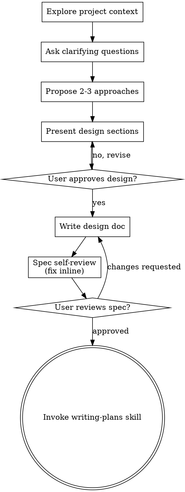

<!-- Generated by SpecStory, Markdown v2.1.0 -->

# 2026-08-17 04:11:34Z

<!-- Claude Code Session 8cc31462-c619-4495-b1f5-3517152ff92b (2026-08-17 04:11:34Z) -->

_**User (2026-08-17 04:11:34Z)**_

用户 / CLI / Web / Slack
          ↓
产品层：会话树、压缩、Prompt、Skill、Extension
          ↓
Agent：保存消息、队列、运行状态
          ↓
agentLoop：调模型 → 执行工具 → 把结果交回模型
          ↓
pi-ai：统一不同 LLM Provider 的消息与流式事件

每一层是否有详细的解释，结合pi 的文章和源代码

---

_**Agent (claude-opus-5 2026-08-17 04:11:49Z)**_

<think><details><summary>Thought Process</summary>
I'm trying to recall the context here—the user's been exploring pi's architecture through some saved history files about its microkernel plugin design, event observer pattern, and message/LLM handling, so they likely want me to connect that research to the layered diagram they're asking about.

Rather than jumping into a formal research workflow, I think the right move is to just explore the repo directly—check if there's actual pi source code or article material saved locally that I can reference for a grounded, detailed explanation of each layer. Let me look at the project structure and those specstory history files first before writing anything.
</details></think>

_**Agent (claude-opus-5 2026-08-17 04:11:50Z)**_

<tool-use data-tool-type="shell" data-tool-name="Bash"><details>
<summary>Tool use: **Bash**</summary>
查看项目结构和历史记录

`ls -la && echo "---SPECSTORY---" && ls -la .specstory/history/ | tail -30`

```text
total 424
drwxr-xr-x@ 18 xiaokezhou  staff     576 Aug 16 18:35 .
drwxr-xr-x  44 xiaokezhou  staff    1408 Aug 11 20:06 ..
-rw-r--r--@  1 xiaokezhou  staff     110 Aug 16 18:35 .cursorindexingignore
drwxr-xr-x@ 17 xiaokezhou  staff     544 Aug 17 09:51 .git
-rw-r--r--@  1 xiaokezhou  staff     292 Aug 11 20:06 .gitignore
drwxr-xr-x@ 11 xiaokezhou  staff     352 Aug 16 21:01 .mewcode
drwx------@  6 xiaokezhou  staff     192 Aug 16 15:52 .planning
drwx------@  6 xiaokezhou  staff     192 Aug 16 13:32 .pytest_cache
drwx------@  5 xiaokezhou  staff     160 Aug 16 14:28 .ruff_cache
drwxr-xr-x@  6 xiaokezhou  staff     192 Aug 17 12:11 .specstory
drwxr-xr-x@  7 xiaokezhou  staff     224 Aug 11 20:09 .venv
-rw-r--r--@  1 xiaokezhou  staff     121 Aug 11 20:06 MEWCODE.md
drwxr-xr-x@  9 xiaokezhou  staff     288 Aug 16 16:16 docs
drwx------@  6 xiaokezhou  staff     192 Aug 16 21:04 examples
drwxr-xr-x@ 40 xiaokezhou  staff    1280 Aug 16 15:37 mewcode
-rw-r--r--@  1 xiaokezhou  staff     584 Aug 11 20:06 pyproject.toml
drwxr-xr-x@ 45 xiaokezhou  staff    1440 Aug 16 17:30 tests
-rw-r--r--@  1 xiaokezhou  staff  198779 Aug 11 20:06 uv.lock
---SPECSTORY---
total 5400
drwxr-xr-x@ 26 xiaokezhou  staff     832 Aug 17 12:11 .
drwxr-xr-x@  6 xiaokezhou  staff     192 Aug 17 12:11 ..
-rw-r--r--@  1 xiaokezhou  staff   11775 Aug 16 18:35 2026-08-11_12-08-44Z-config.md
-rw-r--r--@  1 xiaokezhou  staff   32634 Aug 16 18:35 2026-08-11_12-15-04Z.md
-rw-r--r--@  1 xiaokezhou  staff   18598 Aug 16 18:35 2026-08-15_11-36-37Z-https-blog-antinomie-org.md
-rw-r--r--@  1 xiaokezhou  staff  124192 Aug 16 18:35 2026-08-15_11-37-05Z-https-blog-antinomie-org.md
-rw-r--r--@  1 xiaokezhou  staff  112558 Aug 16 18:35 2026-08-16_01-06-58Z-https-www-zhihu-com.md
-rw-r--r--@  1 xiaokezhou  staff   36635 Aug 16 18:35 2026-08-16_01-08-41Z-goal-https-www-zhihu.md
-rw-r--r--@  1 xiaokezhou  staff   33193 Aug 16 18:35 2026-08-16_03-32-06Z-from-contextlib-import-contextmanager.md
-rw-r--r--@  1 xiaokezhou  staff   56410 Aug 16 18:35 2026-08-16_04-28-49Z-https-zhanghandong-github-io.md
-rw-r--r--@  1 xiaokezhou  staff   31294 Aug 16 18:35 2026-08-16_04-29-47Z-the-following-is-the.md
-rw-r--r--@  1 xiaokezhou  staff  702207 Aug 16 22:07 2026-08-16_05-45-03Z-https-books-antinomie-org.md
-rw-r--r--@  1 xiaokezhou  staff   10751 Aug 16 18:35 2026-08-16_06-00-01Z-rom-collections-import-deque.md
-rw-r--r--@  1 xiaokezhou  staff   34677 Aug 16 18:35 2026-08-16_06-35-48Z-pi-https-dg-ai.md
-rw-r--r--@  1 xiaokezhou  staff   25490 Aug 16 18:49 2026-08-16_10-44-17Z-https-dg-ai-notes.md
-rw-r--r--@  1 xiaokezhou  staff    1504 Aug 17 09:44 2026-08-16_10-48-33Z-https-dg-ai-notes.md
-rw-r--r--@  1 xiaokezhou  staff    1324 Aug 16 18:50 2026-08-16_10-48-33Z.md
-rw-r--r--@  1 xiaokezhou  staff   32230 Aug 16 20:15 2026-08-16_12-07-22Z-https-dg-ai-notes.md
-rw-r--r--@  1 xiaokezhou  staff   41744 Aug 16 21:17 2026-08-16_12-59-37Z-https-blog-antinomie-org.md
-rw-r--r--@  1 xiaokezhou  staff   23703 Aug 16 22:22 2026-08-16_14-13-06Z-simplify-users-xiaokezhou-codex.md
-rw-r--r--@  1 xiaokezhou  staff  994857 Aug 17 11:30 2026-08-17_01-41-30Z-you-are-a-code.md
-rw-r--r--@  1 xiaokezhou  staff   73376 Aug 17 09:41 2026-08-17_01-41-30Z.md
-rw-r--r--@  1 xiaokezhou  staff  111762 Aug 17 11:26 2026-08-17_03-23-24Z-pi-extensionsmicrokernel-plugin-architecture.md
-rw-r--r--@  1 xiaokezhou  staff  109903 Aug 17 11:26 2026-08-17_03-23-44Z-pi-agentevent-observer-publish.md
-rw-r--r--@  1 xiaokezhou  staff  102110 Aug 17 11:26 2026-08-17_03-24-01Z-pi-agentmessage-llm-message.md
-rw-r--r--@  1 xiaokezhou  staff    1995 Aug 17 12:11 2026-08-17_04-11-32Z-cli-web-slack-prompt.md
```
</details></tool-use>

_**Agent (claude-opus-5 2026-08-17 04:11:50Z)**_

<tool-use data-tool-type="shell" data-tool-name="Bash"><details>
<summary>Tool use: **Bash**</summary>
查看目录树

`find . -maxdepth 3 -type d -not -path "*/node_modules/*" -not -path "*/.git/*" -not -path "*/.specstory/*" -not -path "*/__pycache__/*" | head -60`

```text
.
./.pytest_cache
./.ruff_cache
./tests
./.specstory
./docs
./examples
./.venv
./mewcode
./.planning
./.git
./.mewcode
./.pytest_cache/v
./.ruff_cache/0.16.3
./tests/__pycache__
./examples/cordis_coffee_shop
./examples/mini_pi_agent
./examples/__pycache__
./.venv/bin
./.venv/lib
./mewcode/tools
./mewcode/context
./mewcode/memory
./mewcode/runtime
./mewcode/worktree
./mewcode/agents
./mewcode/mcp
./mewcode/__pycache__
./mewcode/permissions
./mewcode/extensions
./mewcode/filehistory
./mewcode/sandbox
./mewcode/hooks
./mewcode/teams
./mewcode/commands
./mewcode/skills
./.planning/2026-08-16-mewcode-extensionhost-stage-1-design
./.planning/2026-08-16-mewcode-extensionhost-stage-2-design
./.planning/2026-08-16-mewcode-pi-inspired-runtime-design
./.mewcode/memory
./.mewcode/plans
./.mewcode/sessions
./.mewcode/file-history
./.pytest_cache/v/cache
./examples/cordis_coffee_shop/__pycache__
./examples/mini_pi_agent/__pycache__
./.venv/lib/python3.12
./mewcode/tools/impl
./mewcode/tools/__pycache__
./mewcode/context/__pycache__
./mewcode/memory/__pycache__
./mewcode/runtime/__pycache__
./mewcode/worktree/__pycache__
./mewcode/agents/__pycache__
./mewcode/agents/builtins
./mewcode/mcp/__pycache__
./mewcode/permissions/__pycache__
./mewcode/extensions/__pycache__
./mewcode/filehistory/__pycache__
./mewcode/sandbox/__pycache__
```
</details></tool-use>

_**Agent (claude-opus-5 2026-08-17 04:11:55Z)**_

<think><details><summary>Thought Process</summary>
The latest history file matches the current session, so I should check it along with the docs directory to see if there's already an existing pi analysis document.
</details></think>

_**Agent (claude-opus-5 2026-08-17 04:11:55Z)**_

<tool-use data-tool-type="shell" data-tool-name="Bash"><details>
<summary>Tool use: **Bash**</summary>
查看docs和当前会话记录

`find docs -type f | head -50 && echo "---" && cat .specstory/history/2026-08-17_04-11-32Z-cli-web-slack-prompt.md`

```text
docs/mewcode-extension-resources-stage2a-design.md
docs/cordis-python-async-learning-guide.md
docs/mewcode-agent-run-control-stage2a-design.md
docs/mewcode-agent-loop-stage0-design.md
docs/mewcode-extension-host-stage1-design.md
docs/plugin-agent-learning-design.md
docs/mewcode-pi-inspired-runtime-design.md
---
<!-- Generated by SpecStory, Markdown v2.1.0 -->

# 2026-08-17 04:11:34Z

<!-- Claude Code Session 8cc31462-c619-4495-b1f5-3517152ff92b (2026-08-17 04:11:34Z) -->

_**User (2026-08-17 04:11:34Z)**_

用户 / CLI / Web / Slack
          ↓
产品层：会话树、压缩、Prompt、Skill、Extension
          ↓
Agent：保存消息、队列、运行状态
          ↓
agentLoop：调模型 → 执行工具 → 把结果交回模型
          ↓
pi-ai：统一不同 LLM Provider 的消息与流式事件

每一层是否有详细的解释，结合pi 的文章和源代码

---

_**Agent (claude-opus-5 2026-08-17 04:11:49Z)**_

<think><details><summary>Thought Process</summary>
I'm trying to recall the context here—the user's been exploring pi's architecture through some saved history files about its microkernel plugin design, event observer pattern, and message/LLM handling, so they likely want me to connect that research to the layered diagram they're asking about.

Rather than jumping into a formal research workflow, I think the right move is to just explore the repo directly—check if there's actual pi source code or article material saved locally that I can reference for a grounded, detailed explanation of each layer. Let me look at the project structure and those specstory history files first before writing anything.
</details></think>

_**Agent (claude-opus-5 2026-08-17 04:11:50Z)**_

<tool-use data-tool-type="shell" data-tool-name="Bash"><details>
<summary>Tool use: **Bash**</summary>
查看项目结构和历史记录

`ls -la && echo "---SPECSTORY---" && ls -la .specstory/history/ | tail -30`

```text
total 424
drwxr-xr-x@ 18 xiaokezhou  staff     576 Aug 16 18:35 .
drwxr-xr-x  44 xiaokezhou  staff    1408 Aug 11 20:06 ..
-rw-r--r--@  1 xiaokezhou  staff     110 Aug 16 18:35 .cursorindexingignore
drwxr-xr-x@ 17 xiaokezhou  staff     544 Aug 17 09:51 .git
-rw-r--r--@  1 xiaokezhou  staff     292 Aug 11 20:06 .gitignore
drwxr-xr-x@ 11 xiaokezhou  staff     352 Aug 16 21:01 .mewcode
drwx------@  6 xiaokezhou  staff     192 Aug 16 15:52 .planning
drwx------@  6 xiaokezhou  staff     192 Aug 16 13:32 .pytest_cache
drwx------@  5 xiaokezhou  staff     160 Aug 16 14:28 .ruff_cache
drwxr-xr-x@  6 xiaokezhou  staff     192 Aug 17 12:11 .specstory
drwxr-xr-x@  7 xiaokezhou  staff     224 Aug 11 20:09 .venv
-rw-r--r--@  1 xiaokezhou  staff     121 Aug 11 20:06 MEWCODE.md
drwxr-xr-x@  9 xiaokezhou  staff     288 Aug 16 16:16 docs
drwx------@  6 xiaokezhou  staff     192 Aug 16 21:04 examples
drwxr-xr-x@ 40 xiaokezhou  staff    1280 Aug 16 15:37 mewcode
-rw-r--r--@  1 xiaokezhou  staff     584 Aug 11 20:06 pyproject.toml
drwxr-xr-x@ 45 xiaokezhou  staff    1440 Aug 16 17:30 tests
-rw-r--r--@  1 xiaokezhou  staff  198779 Aug 11 20:06 uv.lock
---SPECSTORY---
total 5400
drwxr-xr-x@ 26 xiaokezhou  staff     832 Aug 17 12:11 .
drwxr-xr-x@  6 xiaokezhou  staff     192 Aug 17 12:11 ..
-rw-r--r--@  1 xiaokezhou  staff   11775 Aug 16 18:35 2026-08-11_12-08-44Z-config.md
-rw-r--r--@  1 xiaokezhou  staff   32634 Aug 16 18:35 2026-08-11_12-15-04Z.md
-rw-r--r--@  1 xiaokezhou  staff   18598 Aug 16 18:35 2026-08-15_11-36-37Z-https-blog-antinomie-org.md
-rw-r--r--@  1 xiaokezhou  staff  124192 Aug 16 18:35 2026-08-15_11-37-05Z-https-blog-antinomie-org.md
-rw-r--r--@  1 xiaokezhou  staff  112558 Aug 16 18:35 2026-08-16_01-06-58Z-https-www-zhihu-com.md
-rw-r--r--@  1 xiaokezhou  staff   36635 Aug 16 18:35 2026-08-16_01-08-41Z-goal-https-www-zhihu.md
-rw-r--r--@  1 xiaokezhou  staff   33193 Aug 16 18:35 2026-08-16_03-32-06Z-from-contextlib-import-contextmanager.md
-rw-r--r--@  1 xiaokezhou  staff   56410 Aug 16 18:35 2026-08-16_04-28-49Z-https-zhanghandong-github-io.md
-rw-r--r--@  1 xiaokezhou  staff   31294 Aug 16 18:35 2026-08-16_04-29-47Z-the-following-is-the.md
-rw-r--r--@  1 xiaokezhou  staff  702207 Aug 16 22:07 2026-08-16_05-45-03Z-https-books-antinomie-org.md
-rw-r--r--@  1 xiaokezhou  staff   10751 Aug 16 18:35 2026-08-16_06-00-01Z-rom-collections-import-deque.md
-rw-r--r--@  1 xiaokezhou  staff   34677 Aug 16 18:35 2026-08-16_06-35-48Z-pi-https-dg-ai.md
-rw-r--r--@  1 xiaokezhou  staff   25490 Aug 16 18:49 2026-08-16_10-44-17Z-https-dg-ai-notes.md
-rw-r--r--@  1 xiaokezhou  staff    1504 Aug 17 09:44 2026-08-16_10-48-33Z-https-dg-ai-notes.md
-rw-r--r--@  1 xiaokezhou  staff    1324 Aug 16 18:50 2026-08-16_10-48-33Z.md
-rw-r--r--@  1 xiaokezhou  staff   32230 Aug 16 20:15 2026-08-16_12-07-22Z-https-dg-ai-notes.md
-rw-r--r--@  1 xiaokezhou  staff   41744 Aug 16 21:17 2026-08-16_12-59-37Z-https-blog-antinomie-org.md
-rw-r--r--@  1 xiaokezhou  staff   23703 Aug 16 22:22 2026-08-16_14-13-06Z-simplify-users-xiaokezhou-codex.md
-rw-r--r--@  1 xiaokezhou  staff  994857 Aug 17 11:30 2026-08-17_01-41-30Z-you-are-a-code.md
-rw-r--r--@  1 xiaokezhou  staff   73376 Aug 17 09:41 2026-08-17_01-41-30Z.md
-rw-r--r--@  1 xiaokezhou  staff  111762 Aug 17 11:26 2026-08-17_03-23-24Z-pi-extensionsmicrokernel-plugin-architecture.md
-rw-r--r--@  1 xiaokezhou  staff  109903 Aug 17 11:26 2026-08-17_03-23-44Z-pi-agentevent-observer-publish.md
-rw-r--r--@  1 xiaokezhou  staff  102110 Aug 17 11:26 2026-08-17_03-24-01Z-pi-agentmessage-llm-message.md
-rw-r--r--@  1 xiaokezhou  staff    1995 Aug 17 12:11 2026-08-17_04-11-32Z-cli-web-slack-prompt.md
```
</details></tool-use>

_**Agent (claude-opus-5 2026-08-17 04:11:50Z)**_

<tool-use data-tool-type="shell" data-tool-name="Bash"><details>
<summary>Tool use: **Bash**</summary>
查看目录树

`find . -maxdepth 3 -type d -not -path "*/node_modules/*" -not -path "*/.git/*" -not -path "*/.specstory/*" -not -path "*/__pycache__/*" | head -60`

```text
.
./.pytest_cache
./.ruff_cache
./tests
./.specstory
./docs
./examples
./.venv
./mewcode
./.planning
./.git
./.mewcode
./.pytest_cache/v
./.ruff_cache/0.16.3
./tests/__pycache__
./examples/cordis_coffee_shop
./examples/mini_pi_agent
./examples/__pycache__
./.venv/bin
./.venv/lib
./mewcode/tools
./mewcode/context
./mewcode/memory
./mewcode/runtime
./mewcode/worktree
./mewcode/agents
./mewcode/mcp
./mewcode/__pycache__
./mewcode/permissions
./mewcode/extensions
./mewcode/filehistory
./mewcode/sandbox
./mewcode/hooks
./mewcode/teams
./mewcode/commands
./mewcode/skills
./.planning/2026-08-16-mewcode-extensionhost-stage-1-design
./.planning/2026-08-16-mewcode-extensionhost-stage-2-design
./.planning/2026-08-16-mewcode-pi-inspired-runtime-design
./.mewcode/memory
./.mewcode/plans
./.mewcode/sessions
./.mewcode/file-history
./.pytest_cache/v/cache
./examples/cordis_coffee_shop/__pycache__
./examples/mini_pi_agent/__pycache__
./.venv/lib/python3.12
./mewcode/tools/impl
./mewcode/tools/__pycache__
./mewcode/context/__pycache__
./mewcode/memory/__pycache__
./mewcode/runtime/__pycache__
./mewcode/worktree/__pycache__
./mewcode/agents/__pycache__
./mewcode/agents/builtins
./mewcode/mcp/__pycache__
./mewcode/permissions/__pycache__
./mewcode/extensions/__pycache__
./mewcode/filehistory/__pycache__
./mewcode/sandbox/__pycache__
```
</details></tool-use>
```
</details></tool-use>

_**Agent (claude-opus-5 2026-08-17 04:12:04Z)**_

<tool-use data-tool-type="shell" data-tool-name="Bash"><details>
<summary>Tool use: **Bash**</summary>
查找 pi 源代码位置

`ls -la ~/workspace/ 2>/dev/null | head -40; echo "---查找pi源码---"; find ~ -maxdepth 4 -type d \( -name "pi" -o -name "pi-ai" -o -name "*pi-mono*" \) -not -path "*/node_modules/*" 2>/dev/null | head -20`

```text
total 168
drwxr-xr-x   44 xiaokezhou  staff   1408 Aug 11 20:06 .
drwxr-x---+ 125 xiaokezhou  staff   4000 Aug 17 12:11 ..
-rw-r--r--@   1 xiaokezhou  staff  14340 Aug  6 12:42 .DS_Store
drwxr-xr-x@  10 xiaokezhou  staff    320 Aug 14 09:07 .git
drwxr-xr-x@  16 xiaokezhou  staff    512 Aug  9 11:32 AGI-Gilgamesh
drwxr-xr-x@  20 xiaokezhou  staff    640 Aug  6 12:54 A_安克创新
drwxr-xr-x@  29 xiaokezhou  staff    928 Jul 17  2025 Context-Engineering
drwxr-xr-x@  18 xiaokezhou  staff    576 Jan 17  2026 Kylie
drwxr-xr-x@   5 xiaokezhou  staff    160 Dec  2  2025 ML_1000_questions
drwxr-xr-x@  41 xiaokezhou  staff   1312 Aug  3  2025 TradingAgents-CN
drwxr-xr-x@  23 xiaokezhou  staff    736 Jan  3  2026 YT-Navigator
drwxr-xr-x@  21 xiaokezhou  staff    672 Jun 21  2025 ZigZag
drwxr-xr-x@  43 xiaokezhou  staff   1376 Jan  1  2026 agentic-design-patterns-cn
drwxr-xr-x@  17 xiaokezhou  staff    544 Jan  2  2026 ai-agents-from-scratch
drwxr-xr-x@  12 xiaokezhou  staff    384 Aug  9  2025 ai-dev-tasks
drwxr-xr-x@   8 xiaokezhou  staff    256 Aug 10  2025 awesome-claude-code-subagents
drwxr-xr-x@  18 xiaokezhou  staff    576 Aug  9 11:35 big-data-agent
drwxr-xr-x@  15 xiaokezhou  staff    480 Mar 28 07:29 child-growth-plan
drwxr-xr-x@   6 xiaokezhou  staff    192 Jul 25  2025 claude-agents
drwxr-xr-x@  13 xiaokezhou  staff    416 Jul 27  2025 claude-code-cookbook
drwxr-xr-x    3 xiaokezhou  staff     96 Jul 30  2025 claude-code-example
drwxr-xr-x@   9 xiaokezhou  staff    288 Jul 26  2025 claude-code-requirements-builder
drwxr-xr-x@  11 xiaokezhou  staff    352 Jul 28  2025 claude-code-settings
drwxr-xr-x@  15 xiaokezhou  staff    480 Aug 10  2025 claude-code-spec
drwxr-xr-x@   9 xiaokezhou  staff    288 Jul 30  2025 claude-setup
drwxr-xr-x@   6 xiaokezhou  staff    192 Aug 11  2025 claude-setup-1
drwxr-xr-x@  10 xiaokezhou  staff    320 Aug  3  2025 claude-sub-agent
drwxr-xr-x@  11 xiaokezhou  staff    352 Jun 21  2025 cursorkleosr
drwxr-xr-x@  39 xiaokezhou  staff   1248 Jan  3  2026 deer-flow
drwxr-xr-x@  18 xiaokezhou  staff    576 Jan  3  2026 event-deep-research
drwxr-xr-x@  27 xiaokezhou  staff    864 Aug  8 21:27 flink-sql-jobs-1
drwxr-xr-x@  28 xiaokezhou  staff    896 Jul 11  2025 go-stock-v2
drwxr-xr-x@  17 xiaokezhou  staff    544 Jan  3  2026 hello-agents
drwxr-xr-x@   4 xiaokezhou  staff    128 Nov 28  2025 machine-learning-interview
drwxr-xr-x@  18 xiaokezhou  staff    576 Aug 16 18:35 mewcode-python
drwxr-xr-x@  10 xiaokezhou  staff    320 Jan  3  2026 multi_agent_workflow
-rw-r--r--@   1 xiaokezhou  staff  69598 Jan  3  2026 multi_agent_workflow.zip
drwxr-xr-x@  17 xiaokezhou  staff    544 Oct 18  2025 nanochat
drwxr-xr-x@   7 xiaokezhou  staff    224 Aug  9  2025 ooda-subagents
---查找pi源码---
```
</details></tool-use>

_**Agent (claude-opus-5 2026-08-17 04:12:12Z)**_

<think><details><summary>Thought Process</summary>
I can't find the pi source directory directly, so I'm checking the .specstory session logs for any pi article content scraped from dg-ai.dev, along with examples/mini_pi_agent and the docs/mewcode-pi-inspired-runtime-design.md file. I'll look at that design doc next and also check other possible locations where the pi source might be stored.
</details></think>

_**Agent (claude-opus-5 2026-08-17 04:12:15Z)**_

<tool-use data-tool-type="shell" data-tool-name="Bash"><details>
<summary>Tool use: **Bash**</summary>
查找本地 pi 安装

`find ~ -maxdepth 6 -type d -name "pi-ai" -o -maxdepth 6 -type d -name "@mariozechner" 2>/dev/null | head; echo "---"; ls ~/.pi 2>/dev/null; echo "---npm---"; npm ls -g --depth=0 2>/dev/null | head -20; echo "---which pi---"; which pi 2>/dev/null; ls -la $(which pi 2>/dev/null) 2>/dev/null`

```text
Exit code 1
---
---npm---
/opt/homebrew/lib
+-- @anthropic-ai/claude-code@2.1.207
+-- @augmentcode/auggie@0.1.0
+-- @openai/codex@0.144.6
+-- @pimzino/claude-code-spec-workflow@1.5.8
+-- agent-browser@0.5.0
+-- ccundo@1.1.0
+-- ccusage@15.7.1
+-- corepack@0.32.0
+-- npm@10.9.2
`-- pyright@

---which pi---
pi not found
```
</details></tool-use>

_**Agent (claude-opus-5 2026-08-17 04:12:15Z)**_

<tool-use data-tool-type="shell" data-tool-name="Bash"><details>
<summary>Tool use: **Bash**</summary>
查看 pi 启发的运行时设计文档

`head -100 docs/mewcode-pi-inspired-runtime-design.md`

```text
# MewCode Runtime 迭代设计：参考 Pi，而不是实现 Mini Pi

> - 状态：Design v0.9，阶段 0/1/2A/2B 已实施并通过全量验证
> - 日期：2026-08-16
> - 目标主体：当前 MewCode 0.2.0 项目，Python 3.11+
> - 当前阶段：阶段 2B TurnPreparer 已完成；下一阶段候选为 2C 资源与受控任务所有权
> - 核心取向：在现有 MewCode 上迭代 Runtime，参考 Pi 的分层与扩展机制，并用 Python 的资源管理机制保证可靠清理
> - 明确边界：不是另起炉灶实现一个 Mini Pi，也不是把 MewCode 改名或复刻成 Pi

关联阅读：

- [Mini Plugin Agent：面向 Python 新手的插件化编程学习设计](./plugin-agent-learning-design.md)
- [从 Cordis 的时空可组合性到 Python 插件运行时](./cordis-python-async-learning-guide.md)
- [阶段 0：统一 Agent Loop 与 Tool Execution Pipeline](./mewcode-agent-loop-stage0-design.md)
- [阶段 1：ExtensionHost 内置 Tool 纵向切片](./mewcode-extension-host-stage1-design.md)
- [阶段 2A：AgentRun 控制面与运行中输入](./mewcode-agent-run-control-stage2a-design.md)
- [ResourceScope 与 TaskSupervisor 候选设计（已顺延）](./mewcode-extension-resources-stage2a-design.md)
- [Pi 官方仓库](https://github.com/earendil-works/pi)
- [Pi Chapter 1：Core、Agent 与 Harness](https://books.antinomie.org/pi/chapter/01)
- [Pi Chapter 2：一次 Prompt 的完整路径](https://books.antinomie.org/pi/chapter/02)
- [Pi Extensions 官方文档](https://github.com/earendil-works/pi/blob/main/packages/coding-agent/docs/extensions.md)
- [Pi SDK 官方文档](https://github.com/earendil-works/pi/blob/main/packages/coding-agent/docs/sdk.md)
- [Pi Agent Loop 讲解](https://dg-ai-notes.pages.dev/modules/ch03-agent-loop/)
- [Pi 官方 Agent Loop 源码](https://github.com/earendil-works/pi/blob/main/packages/agent/src/agent-loop.ts)

## 1. 先说结论：主体是 MewCode

这份设计的主体始终是当前 MewCode。Pi 是架构参考和对照样本，不是要交付的新产品。

MewCode 不需要重写成 Cordis，也不需要重新实现一个 Pi 或 Agent Loop。

更合适的方向是：

> 保留当前 MewCode 的 Agent、Tool、Command、Hook、Skill、Team 和 Remote 行为；先把分叉的运行路径收敛成唯一 `AgentLoop`、`ToolPipeline` 和 `AgentRun`，再由 `AgentRuntime` 与 `ExtensionHost` 统一装配和管理扩展生命周期。

用通俗的话说：

- 当前 Agent 行为继续保留，但 `run()` 与 `run_to_completion()` 共享同一个 `AgentLoop`，不再维护两台发动机；
- `ToolPipeline` 是唯一工具通道，统一参数校验、权限、Hook、并发、截断保护和结果排序；
- `AgentRun` 负责单 active run、取消、最终事件和 settlement；
- `AgentRuntime` 负责把发动机、工具、命令、Hook、Skill 和会话装成一辆完整的车；
- `ExtensionHost` 是改装管理处，所有改装都必须登记；
- `ExtensionAPI` 是给扩展使用的服务窗口，扩展不能随意摸内部零件；
- `AsyncExitStack` 是撤场清单，退出时按照相反顺序逐项清理；
- 每个 Agent 都有自己的 `ExtensionSession`，避免主 Agent、队友 Agent 和测试实例相互串状态。

最终目标不是“文件都叫插件”，而是做到六件可验证的事情：

1. 生产代码只有一个模型 → Tool → 模型循环和一个 Tool 执行管线。
2. 截断 Tool Call、取消和非并发安全 Tool 有明确且可测试的安全语义。
3. 新能力可以在不修改 Agent Loop 的前提下接入。
4. 能力由谁注册、何时生效、何时撤销都可以追踪。
5. CLI、Remote 和队友 Agent 使用同一套运行和装配逻辑。
6. 一个扩展启动失败或会话结束后，不留下工具、监听器、后台任务和连接。

### 1.1 “核心职责收窄”不等于 Mini

Pi 的设计有时会被概括为“small core”。这里的 small 指核心承担的职责少、变化原因少，不是功能少、代码玩具化或另做一个缩小版 Pi。

放到 MewCode 中，更准确的翻译是“稳定核心 + 可扩展 Runtime”：

| 保留的行为 | 收拢为稳定深模块 | 明确不会删除 |
| --- | --- | --- |
| 模型流式调用与响应收集 | `AgentLoop` 与 `AgentRun` | Team 与多 Agent 能力 |
| model → tool → model 行为 | `ToolPipeline` | CLI 与 Remote 两种使用方式 |
| 工具调用、重试、压缩等已验证行为 | Tool、Command、Hook、Skill 的装配 | 当前 Provider、Permission 与 MCP 接入 |
| 当前用户配置和会话格式 | 扩展发现、所有权和 Session 级清理 | Skill、Memory 与 Worktree 能力 |

所以，“核心职责收窄”描述的是代码职责边界，不是产品功能降级。MewCode 的功能继续保留，只让变化频繁的装配与扩展逻辑不再散落进 Agent 和多个入口。

## 2. 为什么现在适合这样设计

### 2.1 MewCode 已经具备的基础

当前仓库已经有不少 Pi 风格的基础能力：

| 已有能力 | 当前位置 | 可以保留的价值 |
| --- | --- | --- |
| Agent Loop | `mewcode/agent.py` | 模型、工具、重试、压缩和事件循环已经存在，不应重写 |
| Tool 注册表 | `mewcode/tools/__init__.py` | 已经把 Agent 与具体工具列表分开 |
| Command 注册表 | `mewcode/commands/registry.py` | 已有命令和别名冲突检查 |
| Hook 引擎 | `mewcode/hooks/engine.py` | 已有观察事件和工具前置拦截的雏形 |
| Skill Loader | `mewcode/skills/loader.py` | 已有全局、项目和内置资源的加载顺序 |
| Markdown Command Loader | `mewcode/commands/loader.py` | 已有声明式命令发现能力 |
| CLI、Remote、队友模式 | `mewcode/__main__.py`、`mewcode/remote.py` | 已有多个入口，正好能检验统一 Runtime 是否有效 |

所以这次设计的性质是“收拢和加固”，不是“推倒重来”。

### 2.2 当前最值得解决的八个问题

| 问题 | 当前表现 | 设计后应达到的状态 |
| --- | --- | --- |
| 装配分散 | CLI、Remote、队友分别手工注册工具 | 一个组合根产生一致的 Runtime |
| 所有权不清 | 注册表知道对象，不知道来自哪个扩展 | 每项贡献都带扩展 ID 和来源 |
| Tool 冲突静默 | 同名 Tool 会被后注册对象覆盖 | 默认立即报错，不依赖加载顺序猜结果 |
| 清理不完整 | 注册之后缺少统一注销路径 | 每项注册自动进入扩展自己的清理栈 |
| 后台任务无托管 | 部分 Hook 使用未跟踪的异步任务 | Runtime 统一创建、取消、等待并报告任务错误 |
| 生命周期叫法混淆 | 当前一次 `Agent.run()` 也会触发 `session_start/end` | 明确区分持久会话、一次 Agent 运行和一次模型轮次 |
| Loop 双轨 | `run()` 与 `run_to_completion()` 分别实现循环 | Streaming 与 Headless 只是同一 AgentRun 的不同 Adapter |
| Tool 安全语义分叉 | streaming 期间抢跑、Hook 路径不一致、并发声明未进入主执行路径 | 完整消息后统一 prepare → execute → finalize |
```
</details></tool-use>

_**Agent (claude-opus-5 2026-08-17 04:12:24Z)**_

<think><details><summary>Thought Process</summary>
I should look for pi's article content referenced in the project, since the diagram likely comes from dg-ai-notes or books.antinomie.org/pi, and I want to pull from the scraped history to explain each layer using both the article and the source code.
</details></think>

_**Agent (claude-opus-5 2026-08-17 04:12:24Z)**_

<tool-use data-tool-type="shell" data-tool-name="Bash"><details>
<summary>Tool use: **Bash**</summary>
查找 pi 分层架构相关内容

`cd .specstory/history && grep -l "agentLoop\|agent-loop\|pi-ai" *.md 2>/dev/null; echo "===查找分层图==="; grep -rn "会话树" *.md | head -20`

```text
2026-08-11_12-15-04Z.md
2026-08-15_11-36-37Z-https-blog-antinomie-org.md
2026-08-16_04-29-47Z-the-following-is-the.md
2026-08-16_06-35-48Z-pi-https-dg-ai.md
2026-08-16_03-32-06Z-from-contextlib-import-contextmanager.md
2026-08-16_10-44-17Z-https-dg-ai-notes.md
2026-08-16_12-07-22Z-https-dg-ai-notes.md
2026-08-17_01-41-30Z.md
2026-08-17_03-23-24Z-pi-extensionsmicrokernel-plugin-architecture.md
2026-08-17_04-11-32Z-cli-web-slack-prompt.md
2026-08-17_03-23-44Z-pi-agentevent-observer-publish.md
2026-08-17_01-41-30Z-you-are-a-code.md
2026-08-17_03-24-01Z-pi-agentmessage-llm-message.md
===查找分层图===
2026-08-16_03-32-06Z-from-contextlib-import-contextmanager.md:729:const r = await tools.web__run({"search_query":[{"q":"site:zhanghandong.github.io/pi-book/ch32-boundaries.html \"这套架构的适用边界\""},{"q":"site:zhanghandong.github.io/pi-book/ \"会话树\
2026-08-16_03-32-06Z-from-contextlib-import-contextmanager.md:742:目前已经确认，这本书的主线不是“怎么调用一次 LLM”，而是“怎样把一个可长期运行、能调用工具、能被多种产品复用的 Agent Runtime 做薄、做稳”。接下来我会重点核对分层、事件流、工具管道、会话树和扩展机制，再把它们逐项翻译成 Python 设计。
2026-08-16_03-32-06Z-from-contextlib-import-contextmanager.md:898:    Store["JSONL / SQLite<br/>会话树"]
2026-08-16_03-32-06Z-from-contextlib-import-contextmanager.md:1112:每个新记录只追加，不修改旧记录。同一个父节点有多个子节点，就形成不同分支。[会话树设计](https://zhanghandong.github.io/pi-book/ch11-session-tree.html)
2026-08-16_06-35-48Z-pi-https-dg-ai.md:556:所有运行过程通过事件、消息和会话树变得可观察
2026-08-16_06-35-48Z-pi-https-dg-ai.md:578:| JSONL + `parentId` 会话树 | Append-only Log、Memento、版本控制式历史 | 分叉、回退而不删除旧探索 |
2026-08-16_06-35-48Z-pi-https-dg-ai.md:701:## 三、会话树为什么很重要
2026-08-17_04-11-32Z-cli-web-slack-prompt.md:11:产品层：会话树、压缩、Prompt、Skill、Extension
2026-08-17_04-11-32Z-cli-web-slack-prompt.md:195:产品层：会话树、压缩、Prompt、Skill、Extension
2026-08-17_03-24-01Z-pi-agentmessage-llm-message.md:11:JSONL + parentId 会话树	Append-only Log、Memento、版本控制式历史	分叉、回退而不删除旧探索
2026-08-17_03-24-01Z-pi-agentmessage-llm-message.md:1959:`grep -n -iE "parentId|parent_id|会话树|分叉|领域模型|反腐|DTO|Append-only|Memento" docs/*.md | head -30`
2026-08-17_03-24-01Z-pi-agentmessage-llm-message.md:2133:## 第二行：JSONL + parentId 会话树
```
</details></tool-use>

_**Agent (claude-opus-5 2026-08-17 04:12:24Z)**_

<tool-use data-tool-type="shell" data-tool-name="Bash"><details>
<summary>Tool use: **Bash**</summary>
搜索分层图文本来源

`cd .specstory/history && grep -n "产品层\|pi-ai：\|统一不同 LLM" *.md | head -30`

```text
2026-08-16_04-29-47Z-the-following-is-the.md:576:subgraph Product["产品层"]
2026-08-16_03-32-06Z-from-contextlib-import-contextmanager.md:893:    Product["产品层<br/>Session / Prompt / Skills / Extensions"]
2026-08-16_03-32-06Z-from-contextlib-import-contextmanager.md:912:- `pi-ai`：统一不同 LLM 厂商。
2026-08-16_10-44-17Z-https-dg-ai-notes.md:490:   模型层只需要知道工具描述；Agent Runtime 才关心执行；产品层再加入 UI、提示词和会话上下文。
2026-08-16_10-44-17Z-https-dg-ai-notes.md:504:有一个需要修正的细节：Pi 不是严格的三级继承。`AgentTool` 继承基础 `Tool`，但产品层 `ToolDefinition` 是平行契约，通过包装器转换为 `AgentTool`。这其实比文章表述得更好——产品上下文不会泄漏进低层 Agent Loop。[Tool](https://github.com/badlogic/pi-mono/blob/v0.80.2/packages/ai/src/types.ts#L427-L431)、[AgentTool](https://github.com/badlogic/pi-mono/blob/v0.80.2/packages/agent/src/types.ts#L371-L394)、[ToolDefinition 与包装器](https://github.com/badlogic/pi-mono/blob/v0.80.2/packages/coding-agent/src/core/tools/tool-definition-wrapper.ts#L1-L44)。
2026-08-16_10-44-17Z-https-dg-ai-notes.md:510:| 工具契约 | `Tool → AgentTool`，产品层另有 `ToolDefinition` | 一个 `Tool` ABC 同时承担 Schema、执行、分类、并发声明 | MewCode 简单；Pi 边界更稳定 |
2026-08-17_04-11-32Z-cli-web-slack-prompt.md:11:产品层：会话树、压缩、Prompt、Skill、Extension
2026-08-17_04-11-32Z-cli-web-slack-prompt.md:17:pi-ai：统一不同 LLM Provider 的消息与流式事件
2026-08-17_04-11-32Z-cli-web-slack-prompt.md:195:产品层：会话树、压缩、Prompt、Skill、Extension
2026-08-17_04-11-32Z-cli-web-slack-prompt.md:201:pi-ai：统一不同 LLM Provider 的消息与流式事件
2026-08-17_01-41-30Z-you-are-a-code.md:19096:759	shouldStopAfterTurn —— 外部注入的停止判断。coding-agent 层会用它来检查上下文窗口是否快满了（快满了就停下来触发压缩），或者是否达到了最大 Turn 数限制。这是产品层的”安全阀”，最简 Loop 不需要它。
```
</details></tool-use>

_**Agent (claude-opus-5 2026-08-17 04:12:36Z)**_

<think><details><summary>Thought Process</summary>
I found the source of that layered diagram around lines 890-920 in that earlier conversation log, so I want to pull the key details about pi's layered architecture from there. I also note pi's source lives on GitHub under badlogic/pi-mono, though the docs reference both earendil-works/pi and badlogic/pi-mono, and I don't have the source locally.

The user wants me to combine pi's articles with its source code to explain each layer in detail, so I need to gather enough material — I already have a lot of scraped pi article content from dg-ai-notes, the pi-book site, and books.antinomie.org, plus source references with GitHub line links from earlier analysis. Let me read lines 850-1150 of that same conversation log for the relevant passages.
</details></think>

_**Agent (claude-opus-5 2026-08-17 04:12:36Z)**_

<tool-use data-tool-type="read" data-tool-name="Read"><details>
<summary>Tool use: **Read**</summary>
 `./.specstory/history/2026-08-16_03-32-06Z-from-contextlib-import-contextmanager.md`

```text
860	</details></think>
861	
862	_**Agent (gpt-5.6-sol 2026-08-16 04:31:13Z)**_
863	
864	<think><details><summary>Thought Process</summary>
865	**Summarizing agent runtime design and Python knowledge roadmap**
866	</details></think>
867	
868	_**Agent (gpt-5.6-sol 2026-08-16 04:31:13Z)**_
869	
870	<think><details><summary>Thought Process</summary>
871	**Outlining Python agent architecture with phased implementation**
872	</details></think>
873	
874	_**Agent (gpt-5.6-sol 2026-08-16 04:31:13Z)**_
875	
876	<think><details><summary>Thought Process</summary>
877	**Finalizing conclusion with architecture diagram and citations**
878	</details></think>
879	
880	_**Agent (gpt-5.6-sol 2026-08-16 04:31:54Z)**_
881	
882	🥷结论：这本书真正值得学的不是 TypeScript 写法，而是一套 Agent Runtime 的设计方法：
883	
884	> 用尽可能薄、稳定、可测试的内核，提供少量组合原语；把产品相关能力放到外层。
885	
886	书中分析基于 pi v0.66.0，并对照到 v0.82.1。当前官方仓库已经迁移为 `earendil-works/pi`，所以设计思想仍可参考，但具体包名、文件路径和接口可能继续变化。[书籍前言](https://zhanghandong.github.io/pi-book/)、[当前官方仓库](https://github.com/earendil-works/pi)
887	
888	## 一、Pi 的抽象模型
889	
890	```mermaid
891	flowchart TB
892	    Host["产品宿主<br/>CLI / Web / API / Slack"]
893	    Product["产品层<br/>Session / Prompt / Skills / Extensions"]
894	    Agent["Agent 有状态外壳<br/>历史 / 队列 / 取消 / 订阅"]
895	    Loop["Agent Loop 无状态循环<br/>LLM → Tool → LLM"]
896	    Provider["LLM Provider<br/>OpenAI / Anthropic / 本地模型"]
897	    Tools["Tool Pipeline<br/>Prepare → Execute → Finalize"]
898	    Store["JSONL / SQLite<br/>会话树"]
899	
900	    Host --> Product
901	    Product --> Agent
902	    Agent --> Loop
903	    Loop --> Provider
904	    Loop --> Tools
905	    Agent --> Store
906	    Loop -.事件流.-> Agent
907	    Agent -.事件流.-> Host
908	```
909	
910	它不是把所有功能塞进一个 `Agent` 大类，而是拆成：
911	
912	- `pi-ai`：统一不同 LLM 厂商。
913	- `pi-agent-core`：负责 Agent Loop、工具调用和事件。
914	- `pi-coding-agent`：负责会话、提示词、工具、扩展等具体产品能力。
915	- TUI、RPC、Web、Slack：只是不同的宿主外壳。
916	
917	依赖只能从上层指向下层，底层不知道上层存在。这属于严格的分层架构和依赖倒置。[分层设计](https://zhanghandong.github.io/pi-book/ch02-packages.html)
918	
919	## 二、核心设计哲学
920	
921	### 1. 极简核心，能力外置
922	
923	内核只负责三件事：
924	
925	1. 调模型。
926	2. 跑 Agent Loop。
927	3. 管运行时状态。
928	
929	会话存储、上下文压缩、权限界面、Plan Mode、Sub-agent、UI、Skill 都在内核之外。[极简核心设计](https://zhanghandong.github.io/pi-book/ch30-minimal-core.html)
930	
931	它判断一个功能要不要进入内核时，会问：
932	
933	- 是否和具体产品形态有关？有关就外置。
934	- 是否存在多种合理实现？有就做成接口或回调。
935	- 是否必须全系统保持一致？必须一致才进入内核。
936	
937	例如权限确认在 CLI 里可能是弹窗，在 Slack 里可能是消息审批，在 CI 中可能完全禁止人工确认。因此内核只提供 `beforeToolCall()`，不内建固定弹窗。
938	
939	### 2. 协议优先，不是框架优先
940	
941	Pi 更像“积木接口”，不是“替你决定一切的框架”。
942	
943	工具只要满足 Tool 协议，模型调用只要满足 Stream 协议，UI 只要消费事件流。上层可以自由替换实现。
944	
945	Python 中可以使用 `Protocol` 表达：
946	
947	```python
948	from collections.abc import AsyncIterator
949	from typing import Protocol
950	
951	
952	class LLMProvider(Protocol):
953	    async def stream(
954	        self,
955	        context: "LLMContext",
956	    ) -> AsyncIterator["LLMEvent"]:
957	        ...
958	
959	
960	class Tool(Protocol):
961	    name: str
962	
963	    async def execute(
964	        self,
965	        arguments: dict,
966	    ) -> "ToolResult":
967	        ...
968	```
969	
970	这里建议优先使用 `Protocol`，只有需要提供共享实现时才使用 `ABC`。
971	
972	### 3. 无状态发动机，有状态外壳
973	
974	`agent_loop()` 尽量不保存长期状态，只接收：
975	
976	- 当前消息；
977	- 模型；
978	- 工具；
979	- 回调；
980	- 事件接收器。
981	
982	真正的对话历史、订阅者、消息队列、取消状态、运行互斥，由外面的 `Agent` 对象保存。[Agent Loop](https://zhanghandong.github.io/pi-book/ch08-agent-loop.html)、[有状态 Agent 外壳](https://zhanghandong.github.io/pi-book/ch10-agent-class.html)
983	
984	Python 中可以对应为：
985	
986	```python
987	async def agent_loop(context, config):
988	    while True:
989	        response = await call_llm(context, config)
990	
991	        yield MessageCompleted(response)
992	
993	        if not response.tool_calls:
994	            break
995	
996	        results = await execute_tools(response.tool_calls, config)
997	
998	        for result in results:
999	            context.messages.append(result)
1000	            yield ToolCompleted(result)
1001	```
1002	
1003	外面再套一层：
1004	
1005	```python
1006	class Agent:
1007	    def __init__(self, loop_config):
1008	        self.messages = []
1009	        self.listeners = set()
1010	        self.steering_queue = []
1011	        self.running_task = None
1012	        self.loop_config = loop_config
1013	```
1014	
1015	这让循环可以脱离真实 LLM、数据库和 UI 单独测试。
1016	
1017	### 4. 事件流是一等数据模型
1018	
1019	LLM 不只返回最终字符串，而是不断产生：
1020	
1021	- 文本增量；
1022	- thinking 增量；
1023	- tool call；
1024	- token 使用量；
1025	-错误；
1026	- 完成事件。
1027	
1028	Pi 把请求失败也编码进事件流，而不是运行到一半突然抛出异常。[统一事件流](https://zhanghandong.github.io/pi-book/ch06-event-stream.html)
1029	
1030	Python 最自然的对应是：
1031	
1032	- `async generator`
1033	- `AsyncIterator`
1034	- `asyncio.Queue`
1035	- `asyncio.TaskGroup`
1036	- `asyncio.CancelledError`
1037	
1038	```python
1039	async for event in provider.stream(context):
1040	    await event_queue.put(event)
1041	    yield event
1042	```
1043	
1044	### 5. 工具不是直接调用，而是一条管道
1045	
1046	工具执行分成：
1047	
1048	```text
1049	Prepare → Execute → Finalize
1050	```
1051	
1052	- Prepare：查找工具、转换参数、Pydantic 校验、权限检查。
1053	- Execute：执行真实操作，产生进度。
1054	- Finalize：记录结果、审计、格式化错误、发送事件。
1055	
1056	这样权限、日志、限流、审计就不用污染每个工具的业务代码。[工具执行管道](https://zhanghandong.github.io/pi-book/ch09-tool-execution.html)
1057	
1058	在 Python 中，这类似于：
1059	
1060	- Middleware；
1061	- Pipeline；
1062	- Command Pattern；
1063	- Hook；
1064	- 结构化并发。
1065	
1066	参数模型建议使用 Pydantic：
1067	
1068	```python
1069	from pydantic import BaseModel
1070	
1071	
1072	class ReadFileArgs(BaseModel):
1073	    path: str
1074	    offset: int = 0
1075	    limit: int = 200
1076	```
1077	
1078	不要直接把任意 `dict` 交给工具执行。
1079	
1080	### 6. 约束比万能更安全
1081	
1082	Pi 没有只给模型一个万能 Shell，而是提供 `read`、`write`、`edit`、`find`、`grep` 等结构化工具，再把 Shell 作为后备。
1083	
1084	因为：
1085	
1086	```text
1087	能力越宽泛
1088	    → 参数空间越大
1089	    → 模型犯错方式越多
1090	    → 权限和审计越困难
1091	```
1092	
1093	因此 Python 工具也应该尽量做到：
1094	
1095	- 参数明确；
1096	- 路径明确；
1097	- 输出有上限；
1098	- 支持超时和取消；
1099	- 错误结构化；
1100	- 副作用可审计。
1101	
1102	这属于 Capability Security 和最小权限思想。[工具设计原则](https://zhanghandong.github.io/pi-book/ch19-tool-principles.html)
1103	
1104	### 7. 会话不是列表，而是追加式树
1105	
1106	Coding Agent 经常需要回到某一步重新尝试。因此会话采用：
1107	
1108	```text
1109	entry_id + parent_id
1110	```
1111	
1112	每个新记录只追加，不修改旧记录。同一个父节点有多个子节点，就形成不同分支。[会话树设计](https://zhanghandong.github.io/pi-book/ch11-session-tree.html)
1113	
1114	Python 第一版可以直接使用 JSONL：
1115	
1116	```python
1117	@dataclass
1118	class SessionEntry:
1119	    id: str
1120	    parent_id: str | None
1121	    type: str
1122	    payload: dict
1123	```
1124	
1125	后续再换 SQLite：
1126	
1127	```sql
1128	CREATE TABLE session_entries (
1129	    id TEXT PRIMARY KEY,
1130	    session_id TEXT NOT NULL,
1131	    parent_id TEXT,
1132	    entry_type TEXT NOT NULL,
1133	    payload_json TEXT NOT NULL,
1134	    created_at TEXT NOT NULL
1135	);
1136	```
1137	
1138	它带有 Append-only Log 和 Event Sourcing 的味道，但不要一开始就做成复杂的完整事件溯源框架。
1139
```
</details></tool-use>

_**Agent (claude-opus-5 2026-08-17 04:12:46Z)**_

<think><details><summary>Thought Process</summary>
Now the user wants a detailed layer-by-layer explanation combining pi's article with the source code, so I need to dig deeper into the source files—especially the large agent-loop.ts analysis and the pi-* files—to pull out the line-by-line details I'll need.

Since I shouldn't spin up subagents unless asked, I'll read through this myself, grepping for key source locations to stay efficient while gathering enough code-backed material to write a thorough layered explanation.
</details></think>

_**Agent (claude-opus-5 2026-08-17 04:12:48Z)**_

<tool-use data-tool-type="shell" data-tool-name="Bash"><details>
<summary>Tool use: **Bash**</summary>
收集源码引用

`cd .specstory/history && grep -n "github.com/badlogic/pi-mono\|github.com/earendil-works/pi" 2026-08-17_01-41-30Z-you-are-a-code.md 2026-08-16_10-44-17Z-https-dg-ai-notes.md 2026-08-16_12-07-22Z-https-dg-ai-notes.md 2026-08-17_03-23-24Z-*.md 2026-08-17_03-23-44Z-*.md 2026-08-17_03-24-01Z-*.md 2>/dev/null | sed 's/\(.\{300\}\).*/\1/' | head -60`

```text
Exit code 1
(eval):cd:1: no such file or directory: .specstory/history
```
</details></tool-use>

_**Agent (claude-opus-5 2026-08-17 04:12:53Z)**_

<think><details><summary>Thought Process</summary>
The working directory already shifted to .specstory/history from the earlier cd, so I should use an absolute path instead.
</details></think>

_**Agent (claude-opus-5 2026-08-17 04:12:53Z)**_

<tool-use data-tool-type="shell" data-tool-name="Bash"><details>
<summary>Tool use: **Bash**</summary>
收集所有 pi 源码引用链接

`grep -oh "https://github.com/[a-z-]*/pi[a-z-]*/blob/[^)\" ]*" *.md 2>/dev/null | sort | uniq -c | sort -rn | head -70`

```text
   3 https://github.com/earendil-works/pi/blob/main/packages/coding-agent/docs/sdk.md
   3 https://github.com/earendil-works/pi/blob/main/packages/coding-agent/docs/extensions.md
   3 https://github.com/earendil-works/pi/blob/main/packages/agent/src/agent-loop.ts
   2 https://github.com/badlogic/pi-mono/blob/v0.80.2/packages/coding-agent/src/core/tools/tool-definition-wrapper.ts#L1-L44
   2 https://github.com/badlogic/pi-mono/blob/v0.80.2/packages/ai/src/types.ts#L427-L431
   2 https://github.com/badlogic/pi-mono/blob/v0.80.2/packages/agent/src/types.ts#L371-L394
   1 https://github.com/earendil-works/pi/blob/v0.80.2/packages/coding-agent/src/core/extensions/runner.ts#L736-L768
   1 https://github.com/earendil-works/pi/blob/v0.80.2/packages/coding-agent/src/core/agent-session.ts#L124-L152
   1 https://github.com/earendil-works/pi/blob/v0.80.2/packages/ai/src/utils/event-stream.ts#L21-L35
   1 https://github.com/earendil-works/pi/blob/v0.80.2/packages/agent/src/types.ts#L413-L428
   1 https://github.com/earendil-works/pi/blob/v0.80.2/packages/agent/src/agent.ts#L502-L555
   1 https://github.com/earendil-works/pi/blob/v0.80.2/packages/agent/src/agent-loop.ts#L628-L668
   1 https://github.com/earendil-works/pi/blob/v0.80.2/packages/agent/src/agent-loop.ts#L31-L53
   1 https://github.com/badlogic/pi-mono/blob/v0.80.2/packages/coding-agent/src/core/tools/read.ts#L43-L63
   1 https://github.com/badlogic/pi-mono/blob/v0.80.2/packages/agent/src/agent-loop.ts#L628-L669
   1 https://github.com/badlogic/pi-mono/blob/086c32e74530564922d011ade23ff582c9d63116/packages/coding-agent/src/core/session-manager.ts#L46-L153
   1 https://github.com/badlogic/pi-mono/blob/086c32e74530564922d011ade23ff582c9d63116/packages/coding-agent/docs/extensions.md#L3-L29
   1 https://github.com/badlogic/pi-mono/blob/086c32e74530564922d011ade23ff582c9d63116/packages/coding-agent/README.md#L494-L508
   1 https://github.com/badlogic/pi-mono/blob/086c32e74530564922d011ade23ff582c9d63116/packages/ai/src/compat.ts#L1-L10
   1 https://github.com/badlogic/pi-mono/blob/086c32e74530564922d011ade23ff582c9d63116/packages/agent/src/agent-loop.ts#L155-L275
   1 https://github.com/badlogic/pi-mono/blob/086c32e74530564922d011ade23ff582c9d63116/README.md#L38-L46
   1 https://github.com/badlogic/pi-mono/blob/086c32e74530564922d011ade23ff582c9d63116/README.md#L13-L35
```
</details></tool-use>

_**Agent (claude-opus-5 2026-08-17 04:13:04Z)**_

<think><details><summary>Thought Process</summary>
I have source references but no local source code—the earlier session pulled this via WebFetch. Now I'm weighing whether to re-fetch the pi source again or just work from the existing .specstory notes, which already contain a fairly detailed source analysis I could draw on since the user wants both the article and the code covered.

Let me check the quality of that 994KB file with the line-by-line agent-loop.ts walkthrough by grepping for its key structures.
</details></think>

_**Agent (claude-opus-5 2026-08-17 04:13:04Z)**_

<tool-use data-tool-type="shell" data-tool-name="Bash"><details>
<summary>Tool use: **Bash**</summary>
查看大文件的结构

`grep -n "^## \|^### \|^# " 2026-08-17_01-41-30Z-you-are-a-code.md | head -80`

```text
3:# 2026-08-17 01:41:32Z
23:## Phase 0 — Gather the diff
32:## Phase 1 — Review (4 cleanup agents in parallel)
40:### Reuse
46:### Simplification
52:### Efficiency
62:### Altitude
69:## Phase 2 — Apply the fixes
1878:## Findings
1925:## Minor
1930:## Checked and clean
2760:## Findings, ranked
2762:### 1. `getattr(self, "_turn", 0)` — defensive reads for state the object should own from birth
2777:### 2. `iteration` is threaded through seven methods but is always `self._turn`
2784:### 3. `_ModelTurn` stores two fields that are pure projections of a third
2800:### 4. `_finish_turn` is a wrapper with one added line, and both its callers share the same tail
2818:### 5. Dead compatibility re-exports
2821:### 6. `_record_truncated_response` re-implements `_execute_tool_batch` minus the cancel guard
2835:### 7. `agent._current_conversation` and `agent._conversation` are the same object under two names
2838:### 8. Small stuff introduced by this diff
2844:### 9. `agent_runtime.py:153-156` — `__aenter__` duplicates `_ensure_active` verbatim
2847:### 10. `agent_runtime.py:120-151` — three-deep try/finally in `aclose()`
2870:### 11. `agent_runtime.py:91-114` — three near-identical guard/fetch/None-check bodies
2875:## What's already clean
5898:## Findings
5919:## Explicitly negligible — do not "fix" these
5928:## On the refactor itself
8732:## Contained in the two reviewed files — do these
8768:## Ripples outside the diff — worth it, in this order
8806:## Accepted debt — leave it
15827:## Contained in the two reviewed files — do these
15863:## Ripples outside the diff — worth it, in this order
15901:## Accepted debt — leave it
15967:## Findings
16014:## Minor
16019:## Checked and clean
16027:## Findings, ranked
16029:### 1. `getattr(self, "_turn", 0)` — defensive reads for state the object should own from birth
16044:### 2. `iteration` is threaded through seven methods but is always `self._turn`
16051:### 3. `_ModelTurn` stores two fields that are pure projections of a third
16067:### 4. `_finish_turn` is a wrapper with one added line, and both its callers share the same tail
16085:### 5. Dead compatibility re-exports
16088:### 6. `_record_truncated_response` re-implements `_execute_tool_batch` minus the cancel guard
16102:### 7. `agent._current_conversation` and `agent._conversation` are the same object under two names
16105:### 8. Small stuff introduced by this diff
16111:### 9. `agent_runtime.py:153-156` — `__aenter__` duplicates `_ensure_active` verbatim
16114:### 10. `agent_runtime.py:120-151` — three-deep try/finally in `aclose()`
16137:### 11. `agent_runtime.py:91-114` — three near-identical guard/fetch/None-check bodies
16142:## What's already clean
16186:## Findings
16207:## Explicitly negligible — do not "fix" these
16216:## On the refactor itself
17805:## 已修复
17826:## 已跳过
17883:# Read: Read Any URL or PDF
17889:## Outcome Contract
17900:## Routing
17913:## Privacy and Fetch Tiers
17924:## Output Format
17953:## Saving
17970:## Images
17974:## Content Extraction for Restyling
17978:## Hard Rules
17986:## Gotchas
18262:# MewCode Runtime 迭代设计：参考 Pi，而不是实现 Mini Pi
18287:## 1. 先说结论：主体是 MewCode
18317:### 1.1 “核心职责收窄”不等于 Mini
21230:## 文章要点
21237:## 对照结论
21241:### 已对齐，或已超前
21253:### 真实差距
21297:## 我的建议顺序
21337:# Brainstorming Ideas Into Designs
21347:## Anti-Pattern: "This Is Too Simple To Need A Design"
21351:## Checklist
21365:## Process Flow
21394:## The Process
21433:## After the Design
21464:## Key Principles
21473:## Visual Companion
```
</details></tool-use>

_**Agent (claude-opus-5 2026-08-17 04:13:04Z)**_

<tool-use data-tool-type="shell" data-tool-name="Bash"><details>
<summary>Tool use: **Bash**</summary>
查看 dg-ai-notes 文章结构

`grep -n "^## \|^### " 2026-08-16_10-44-17Z-https-dg-ai-notes.md 2026-08-16_12-07-22Z-https-dg-ai-notes.md 2026-08-16_06-35-48Z-pi-https-dg-ai.md | head -60`

```text
2026-08-16_12-07-22Z-https-dg-ai-notes.md:679:## 结论
2026-08-16_12-07-22Z-https-dg-ai-notes.md:687:## 文章与源码是否一致
2026-08-16_12-07-22Z-https-dg-ai-notes.md:705:## Pi 与 MewCode 的实现对比
2026-08-16_12-07-22Z-https-dg-ai-notes.md:723:## 建议的演进顺序
2026-08-16_10-44-17Z-https-dg-ai-notes.md:485:## 文章真正讲的设计哲学
2026-08-16_10-44-17Z-https-dg-ai-notes.md:506:## 与当前项目对比
2026-08-16_10-44-17Z-https-dg-ai-notes.md:521:## MewCode 当前更好的地方
2026-08-16_10-44-17Z-https-dg-ai-notes.md:529:## 当前明显短板
2026-08-16_10-44-17Z-https-dg-ai-notes.md:546:## 建议怎么吸收，而不是照搬
2026-08-16_06-35-48Z-pi-https-dg-ai.md:541:## 一、Pi 为什么这样设计
2026-08-16_06-35-48Z-pi-https-dg-ai.md:567:## 二、对应哪些软件设计范式
2026-08-16_06-35-48Z-pi-https-dg-ai.md:580:### 1. 分层架构，但不是教条式“三层架构”
2026-08-16_06-35-48Z-pi-https-dg-ai.md:602:### 2. Provider 层是典型的反腐层
2026-08-16_06-35-48Z-pi-https-dg-ai.md:627:### 3. 扩展系统属于微内核架构
2026-08-16_06-35-48Z-pi-https-dg-ai.md:649:### 4. Agent Loop 是“概率决策器 + 确定性执行器”
2026-08-16_06-35-48Z-pi-https-dg-ai.md:680:### 5. 工具系统是命令管道
2026-08-16_06-35-48Z-pi-https-dg-ai.md:701:## 三、会话树为什么很重要
2026-08-16_06-35-48Z-pi-https-dg-ai.md:719:## 四、对思维方式最有参考意义的地方
2026-08-16_06-35-48Z-pi-https-dg-ai.md:723:### 1. 先找不变量，再隔离变化
2026-08-16_06-35-48Z-pi-https-dg-ai.md:735:### 2. 把不确定性关在一个小区域里
2026-08-16_06-35-48Z-pi-https-dg-ai.md:749:### 3. 机制与策略分离
2026-08-16_06-35-48Z-pi-https-dg-ai.md:757:### 4. 信息不是越多越好
2026-08-16_06-35-48Z-pi-https-dg-ai.md:768:### 5. 停止不等于完成
2026-08-16_06-35-48Z-pi-https-dg-ai.md:780:## 五、我的总体评价
2026-08-16_06-35-48Z-pi-https-dg-ai.md:813:## My request for Codex:
2026-08-16_06-35-48Z-pi-https-dg-ai.md:831:## 1. 运行过程属于 Event
2026-08-16_06-35-48Z-pi-https-dg-ai.md:872:## 2. 历史探索属于 Session Tree
2026-08-16_06-35-48Z-pi-https-dg-ai.md:917:## 3. Event 和 Session Tree 不是一一对应
2026-08-16_06-35-48Z-pi-https-dg-ai.md:966:## 4. 为什么必须分开
```
</details></tool-use>

_**Agent (claude-opus-5 2026-08-17 04:13:17Z)**_

<think><details><summary>Thought Process</summary>
I'm missing the key detail about pi's actual source code, but I recall earlier sessions analyzed agent-loop.ts in depth, including the shouldStopAfterTurn logic. I should also check the sessions covering the Extension microkernel architecture and the AgentEvent observer pattern for more context.

My plan is to combine existing local material — the captured articles and analyses — with fresh verification against pi's real source code, likely by fetching GitHub raw files directly. But first I want to check whether the three newest analysis files already have enough conclusions to work from before reaching for that tool.
</details></think>

_**Agent (claude-opus-5 2026-08-17 04:13:19Z)**_

<tool-use data-tool-type="shell" data-tool-name="Bash"><details>
<summary>Tool use: **Bash**</summary>
查看三个新 pi 分析文件的结构

`for f in 2026-08-17_03-23-24Z-pi-extensionsmicrokernel-plugin-architecture.md 2026-08-17_03-23-44Z-pi-agentevent-observer-publish.md 2026-08-17_03-24-01Z-pi-agentmessage-llm-message.md; do echo "=========== $f"; grep -n "^## \|^### " "$f" | tail -40; done`

```text
=========== 2026-08-17_03-23-24Z-pi-extensionsmicrokernel-plugin-architecture.md
354:## 技术栈
357:## 代码规范
438:## 1. 结论
460:## 2. 为什么阶段 1 要这样收窄
482:## 3. 当前代码证据
484:### 3.1 同一件事有四份装配 Implementation
1878:## 1. 先说结论：主体是 MewCode
1894:## 1. 结论
1910:## 2. 为什么先做资源和任务，不先做 Command
1923:## 1. 结论
1933:## 2. 为什么重新排序
1935:### 2.1 实施前的真实行为有三套答案
2317:## 4. 总体架构
2347:## 5. 深模块设计
2349:### 5.0 `AgentLoop`、`ToolPipeline` 与 `AgentRun`：Runtime 地基
2363:### 5.0A `RunControl`：AgentRun 的运行中输入控制面
2375:### 5.1 `AgentRuntime`：应用看到的统一入口
2397:### 5.2 `ExtensionHost`：扩展总管
2422:### 5.3 `ExtensionCatalog`：可加载扩展的菜单
2650:## 11. 与 Pi、Cordis 概念的对应
2652:### 11.1 Pi 是参考架构，不是目标产品
2670:### 11.2 与 Cordis 概念的映射
2684:## 14. 分阶段实施计划
2688:### 14.1 阶段总览
2703:### 阶段 0：统一 Agent Loop 与 Tool Execution Pipeline
2770:## 一句话现状
2776:## 内核到底是哪几个文件
2789:## 四个概念分别对应到什么
2806:## 开闭原则的实际成色
2822:## 三个明确的现状缺口
=========== 2026-08-17_03-23-44Z-pi-agentevent-observer-publish.md
2291:## 7. 事件模型：观察与拦截分开
2295:### 7.1 Observer：只观察
2309:### 7.2 Interceptor：允许阻止或转换
2330:### 7.3 与现有 HookEngine 的关系
2341:## 8. 注册、冲突与所有权
2343:### 8.1 所有贡献必须带来源
2357:### 8.2 默认冲突策略
2369:### 8.3 RegistrationHandle
2390:## 14. 分阶段实施计划
2394:### 14.1 阶段总览
2409:### 阶段 0：统一 Agent Loop 与 Tool Execution Pipeline
2419:### 阶段 2C：资源与受控后台任务纳入所有权
2423:### 阶段 2D：扩展事件管线
2427:### 阶段 2E：Command contribution 所有权
2431:### 阶段 3：安装包扩展
2447:### 阶段 4：本地路径与项目信任
2531:## 一句话结论
2537:## 逐项对照
2539:### 1. 事件类型 —— 已对齐
2549:### 2. 分发 —— 单播 callback，不是 Publish–Subscribe
2564:### 3. 背压 —— 做了，而且很硬
2579:### 4. 持久化 —— 与 UI 直接耦合
2585:### 5. 日志 —— 完全旁路
2589:### 6. 扩展 —— 拿不到事件
2593:### 7. Hook —— 是生产者，不是订阅者
2597:### 8. 观察与拦截没有分离 —— 这是最该注意的一处
2605:## 差距总结
=========== 2026-08-17_03-24-01Z-pi-agentmessage-llm-message.md
2102:## 第一行：AgentMessage → LLM Message
2133:## 第二行：JSONL + parentId 会话树
2147:### 缺 parentId 带来的两个实际裂缝
```
</details></tool-use>

_**Agent (claude-opus-5 2026-08-17 04:13:35Z)**_

<think><details><summary>Thought Process</summary>
这些对照分析很有价值，但用户真正想要的是针对五层架构图的系统讲解——每一层都要结合 pi 的原文和真实源码做深入展开，而不只是概括性总结。我需要去抓取 pi 的真实内容来支撑这个展开。

我打算用 WebFetch 抓取 pi 仓库（earendil-works/pi）的关键源码文件，比如统一消息类型定义、agent 循环、会话管理和扩展运行器等，先确认仓库结构再逐个抓取验证细节，最终写成一份详细的分层解读文档。不过在大量抓取之前，我想先检查本地已有材料里是否已经有对 agent-loop 的逐行讲解可以直接利用。
</details></think>

_**Agent (claude-opus-5 2026-08-17 04:13:35Z)**_

<tool-use data-tool-type="shell" data-tool-name="Bash"><details>
<summary>Tool use: **Bash**</summary>
查看 agent loop 逐行讲解片段

`sed -n '18950,19200p' 2026-08-17_01-41-30Z-you-are-a-code.md`

```text
613	阶段 D：流式处理响应 —— 原地替换的妙用
614	
615	streamFunction 返回的是 AssistantMessageEventStream——一个异步迭代器。这步有一个很精巧的设计：
616	
617	for await (const event of response) {
618	switch (event.type) {
619	case "start":
620	// 拿到一个"空壳"消息，直接 push 到 context
621	partialMessage = event.partial;
622	context.messages.push(partialMessage);
623	emit({ type: "message_start", ... });
624	break;
625	
626	case "text_delta":       // 文本增量
627	case "toolcall_delta":   // 工具调用增量
628	case "thinking_delta":   // 思考增量
629	partialMessage = event.partial;            // 更新后的部分消息
630	context.messages[last] = partialMessage;    // ★ 原地替换！
631	emit({ type: "message_update", ... });      // UI 收到增量更新
632	break;
633	
634	case "done":
635	case "error":
636	finalMessage = await response.result();
637	context.messages[last] = finalMessage;       // ★ 用最终完整消息替换
638	emit({ type: "message_end", ... });
639	return finalMessage;
640	}
641	}
642	
643	为什么要先 push 空壳再原地替换？注意”原地替换”的意思——不是往 context.messages 数组里 push 新条目，而是用新内容覆盖最后一条（context.messages[last] = partialMessage）。这样 context 的消息数量不变，但最后一条消息的内容在”长大”。
644	
645	为了UI 能实时展示。如果等全部响应完成才 push 到 context，用户在 LLM 思考的几秒里盯着空白屏幕。通过”先放空壳、逐 token 替换”，UI 通过 message_update 事件拿到最新部分消息，能做到逐字渲染。
646	
647	流式响应原地替换的时间线
648	
649	配图说明：四个时间点的 context.messages[last] 演变——start 时空壳、text_delta 时文字在长、toolcall_delta 时工具调用出现、done 时最终完整消息替换。每一步同步展示 UI 显示状态。
650	
651	数据在流式响应期间，context.messages[last] 的演变：
652	
653	start    → { role: "assistant", content: [] }                    ← 空壳 push
654	text_delta → { content: [{ type:"text", text:"好的..." }] }       ← 文字在长
655	toolcall   → { content: [{ text:"好的..." },                        ← 工具调用出现
656	{ type:"toolCall", name:"read", arguments:{file_path:"src/main.ts"} }] }
657	done     → { content: [...], stopReason:"toolUse", usage:{...} } ← 最终完整消息替换
658	
659	4.5 【内核 · 步骤C】检查 stopReason
660	
661	§三详细讲了 stopReason 的来源和含义。这里看代码怎么处理它。拿到 AssistantMessage 后，立即做一次硬停止判断：
662	
663	// agent-loop.ts:196-200
664	if (message.stopReason === "error" || message.stopReason === "aborted") {
665	await emit({ type: "turn_end", message, toolResults: [] });
666	await emit({ type: "agent_end", messages: newMessages });
667	return;   // ← 直接退出整个 runLoop，不检查 followUp
668	}
669	
670	error 和 aborted 是”硬停止”——立即发 turn_end + agent_end，直接 return。连工具都不执行，连 followUp 都不检查。这是一种快速失败（fail fast）策略：既然模型调用本身就失败了（网络异常或用户中止），继续跑没有任何意义。
671	
672	而 stop、toolUse、length 这三种，代码继续往下走——进入工具执行逻辑。区别在于：stop 和 length 时，toolCalls 数组为空，所以工具执行步骤什么也不干。
673	
674	4.6 【内核 · 步骤D】executeToolCalls() — 执行工具
675	
676	模型返回的 AssistantMessage.content 里，可能有多个 type === "toolCall" 的块（模型一口气要求了多个操作）。先过滤出来：
677	
678	const toolCalls = message.content.filter((c) => c.type === "toolCall");
679	
680	然后决定这批工具并行还是串行执行：
681	
682	if (config.toolExecution === "sequential" || hasSequentialToolCall) {
683	return executeToolCallsSequential(...);   // 串行
684	}
685	return executeToolCallsParallel(...);         // 并行
686	
687	“一票否决”策略：只要这批工具中有任何一个声明了 executionMode: "sequential"，整批都串行。为什么这么保守？因为判断”哪些工具会冲突”很难——edit 和 edit 操作不同文件就安全吗？万一它们编辑的文件有依赖关系呢？所以 Pi 选择了”宁可多等，不可出错”。而 edit 工具内部还有第二道防线（withFileMutationQueue，对同一文件的编辑串行化），确保即使外层判断为并行，也不会互相覆盖。
688	
689	两种执行模式的内部结构：
690	
691	串行模式：
692	ToolCall A: 准备 → 验证 → beforeHook → 执行 → afterHook → emit end
693	ToolCall B: 准备 → 验证 → beforeHook → 执行 → afterHook → emit end
694	（一个完全结束，才开始下一个）
695	
696	并行模式（三阶段设计）：
697	阶段1 - 准备（顺序）：  A 准备 → B 准备 → C 准备
698	↑ prepareToolCall 含验证和 beforeHook，必须顺序执行
699	阶段2 - 执行（并行）：  A、B、C 同时执行（Promise.all）
700	↑ 只有 tool.execute 并行，省时间
701	阶段3 - 事件（有序）：  end 按完成顺序发；result 按调用顺序发
702	↑ result 消息保持和 ToolCall 一致的顺序，LLM 收到的上下文才是正确的
703	
704	注意并行模式的精妙之处：准备阶段始终顺序（因为验证和权限检查不能并行——万一 B 被拦截了，C 就不应该执行），只有实际执行并行。
705	
706	每个工具的结果被包装成 ToolResultMessage，追加到 context 和 newMessages：
707	
708	工具执行后：
709	context.messages = [..., user2, assistantMessage, {
710	role: "toolResult", toolCallId: "toolu_01", toolName: "read",
711	content: [{ text: "文件内容..." }], isError: false
712	}]
713	
714	terminate 机制：工具可以在返回结果中设置 terminate: true，表示”我觉得不该继续了”。但 Loop 不会因为某一个工具喊停就停——它用的是 every 而非 some：必须这批工具的全部结果都设置了 terminate 才真正退出。这是保守策略：只要有一个工具还在正常工作，Loop 就不中断。
715	
716	工具执行的完整五步管道（prepareArguments → Schema 验证 → beforeToolCall → execute → afterToolCall）详见《第5章：工具系统》。
717	
718	4.7 【内核+叠加 · 步骤E~F】turn_end + 钩子 + 再次检查 steering
719	
720	Turn 的核心工作做完了（调模型 + 执行工具），接下来是收尾。收尾分四步，其中前两步是内核，后两步是 coding-agent 叠加的扩展点：
721	
722	// ① emit turn_end —— 通知外部"这一轮结束了"（内核）
723	await emit({ type: "turn_end", message, toolResults });
724	
725	// ② prepareNextTurn —— 给外部一个机会"改装"下一轮（叠加）
726	// 返回值可包含 context / model / thinkingLevel 三者之一的覆盖
727	const nextTurnSnapshot = await config.prepareNextTurn?.({...});
728	if (nextTurnSnapshot) {
729	currentContext = nextTurnSnapshot.context ?? currentContext;
730	config.model = nextTurnSnapshot.model ?? config.model;
731	// thinkingLevel 也在此处覆盖（详见 agent-loop.ts 中 prepareNextTurn 处理逻辑）
732	}
733	
734	// ③ shouldStopAfterTurn —— 外部判断是否该停了（叠加）
735	if (await config.shouldStopAfterTurn?.({...})) {
736	await emit({ type: "agent_end", messages: newMessages });
737	return;
738	}
739	
740	// ④ 再次检查 steering —— 有没有新的紧急消息？（叠加1）
741	pendingMessages = (await config.getSteeringMessages?.()) || [];
742	
743	prepareNextTurn —— 这是个容易被忽略但很强大的扩展点。它在每个 turn_end 之后、下一轮开始前被调用，允许外部动态切换下一轮的配置。具体例子：
744	
745	场景：按任务复杂度切换模型
746	
747	Turn 1: 用户问了一个简单问题 → 模型用 Haiku（快、便宜）
748	turn_end → prepareNextTurn 检查到问题很简单
749	→ 返回 { model: haiku } → 下一轮继续用 Haiku
750	
751	场景：中途发现任务变复杂了
752	
753	Turn 1: 用户让"重构这个模块" → Haiku 开始读文件
754	turn_end → prepareNextTurn 发现要改的文件很多
755	→ 返回 { model: opus } → 下一轮自动切到 Opus（强、贵）
756	
757	除了换模型，它还能换 context（比如注入新的上下文信息）和 thinkingLevel（思考强度）。返回 undefined 表示”什么都不换，按原配置继续”。
758	
759	shouldStopAfterTurn —— 外部注入的停止判断。coding-agent 层会用它来检查上下文窗口是否快满了（快满了就停下来触发压缩），或者是否达到了最大 Turn 数限制。这是产品层的”安全阀”，最简 Loop 不需要它。
760	
761	④再次检查 steering —— 一圈内层循环结束，再看看 steering 队列有没有新积攒的紧急消息。如果有，下一圈继续跑。
762	
763	4.8 回到循环顶部
764	
765	工具执行完且收尾结束，代码回到内层 while 循环的条件判断。§三已经详细讲了 hasMoreToolCalls 由 toolCalls 数组长度 > 0 && !terminate 驱动——这里只看代码：
766	
767	while (hasMoreToolCalls || pendingMessages.length > 0)
768	
769	两个条件任一为 true 就继续。hasMoreToolCalls 由模型输出里有没有 toolCall 块（且未全部 terminate）决定（内核），pendingMessages 由 steering 队列决定（叠加1）。两个都为 false 时，内层循环退出。
770	
771	4.9 【叠加2 · 步骤G】外层循环：followUp 的续命机制
772	
773	内层循环退出了——没有工具要执行，也没有紧急消息。但 coding-agent 的设计是：此时检查一下 getFollowUpMessages()，看看系统有没有追加任务：
774	
775	const followUpMessages = (await config.getFollowUpMessages?.()) || [];
776	if (followUpMessages.length > 0) {
777	pendingMessages = followUpMessages;   // 塞进 pending，触发新 Turn
778	continue;                              // 回到外层循环顶部
779	}
780	break;  // 两个队列都空了，真正退出
781	
782	如果有 followUp 消息，它们被塞进 pendingMessages，continue 回到外层循环顶部，内层循环检测到 pendingMessages 不为空，在同一个 Trace 内继续跑。这比重新启动一个新的 runAgentLoop() 好在哪？——连续性：同一个 newMessages 数组、同一个事件序列，不需要额外合并。
783	
784	§四开头已经说过：如果你做的是简单 Agent，外层循环是多余的——内层循环退出后直接 break + emit agent_end 就行了。
785	
786	4.10 steering vs followUp：一张表看清两种干预
787	
788	本章出现了两种”外部消息注入”机制。虽然 §四开头已经分别介绍过，但放在一起对比更能看清它们的差异：
789	
790	维度steering（叠加1）followUp（叠加2）
791	
792	检查时机runLoop 开始前 + 内层循环每圈结尾内层循环全部结束后
793	
794	语义”紧急插队”——在工具执行间隙中插入”排队等叫号”——等当前任务全部完成
795	
796	典型场景用户在 Agent 工作时输入了新指令系统在 Agent 完成后追加”顺便跑个测试”
797	
798	生活类比：steering 是你正在开会，有人敲门递了张纸条——“紧急，先看这个”。followUp 是开完会翻了翻信箱——“不急，但需要处理”。
799	
800	steering vs followUp 对比
801	
802	配图说明：左红右绿对照——steering 在每圈内层循环开头+结尾检查、紧急插队；followUp 在内层循环全部结束后检查、续命重启。底部列出各自时机/来源/影响/典型场景。
803	
804	五、总结：Loop 的四条核心设计
805	
806	回顾从按下回车到 Agent 完成的整段旅程：
807	
808	1. ReAct 循环模式
809	
810	Loop 的本质是 Reason（模型思考）→ Act（执行工具）→ Observe（观察结果）→ Reason（再次思考）的循环。模型的输出内容决定”该调什么工具”——这是 Agent 区别于 Workflow 的核心。但”什么时候停”不是模型的决策，而是我们人类定义的规则：模型不再输出工具调用时，就认为本轮结束。
811	
812	2. stopReason 驱动机制
813	
814	整个循环由一个字段驱动：stopReason。但实际驱动循环的不是 stopReason 本身，而是模型输出里有没有 toolCall 块且未全部 terminate——"有 toolCall" = 继续转；没有 toolCall 或全部 terminate = 准备停（或立即停）。“是否继续”不靠代码的复杂判断，只靠一条简单规则：模型的输出中有没有工具调用。 这是 Agent 架构的核心设计原则——把决策外包给模型输出模式，代码只做最简单的信号判断。
815	
816	3. 内核 + 叠加的架构思路
817	
818	Agent Loop 的内核极其简短——十几行代码就能实现一个能用的循环。Pi 的 coding-agent 在内核上叠加了 steering（紧急插队）、followUp（任务追加）、prepareNextTurn（动态切模型）、shouldStopAfterTurn（安全阀）等设计。内核是所有 Agent 的通用法则，叠加是产品功能的按需选择。 做自己的 Agent 时，先搭内核，再按场景加叠加。
819	
820	Agent Loop 内核与叠加设计
821	
822	配图说明：从里到外的四层洋葱——最内核是最简 Loop（~10 行通用法则）；外层依次叠加 steering（紧急插队）、followUp（任务追加）、钩子（切模型/安全阀）。剥掉任何一层，里层仍能跑——这是判断”内核是否被污染”的试金石。
823	
824	六、下一站
825	
826	Loop 跑起来了——我们知道它怎么调用模型、怎么执行工具。但 Loop 调用的”模型”到底是什么？Pi 是怎么用同一套代码调用 OpenAI、Claude、Gemini 等 30+ 家不同供应商的？streamSimple() 内部做了什么？
827	
828	下一章，我们拆开 Pi 的模型调用层：《第4章：模型调用 —— 一行代码驾驭多个模型》。
829	
830	本章关键源码索引（v0.80.2 实际行号）：
831	
832	agent-loop.ts:95-118 — runAgentLoop() 入口
833	
834	agent-loop.ts:155-269 — runLoop() 双层循环完整实现
835	
836	agent-loop.ts:167 — steering 首次检查（进入内层循环之前）
837	
838	agent-loop.ts:175-179 — turn_start 的首轮跳过机制
839	
840	agent-loop.ts:196-200 — stopReason 硬停止判断
841	
842	agent-loop.ts:275-368 — streamAssistantResponse() 流式响应
843	
844	agent-loop.ts:313-357 — 流式处理中的原地替换
845	
846	agent-loop.ts:373-516 — executeToolCalls() 并行/串行调度
847	
848	agent-loop.ts:218-253 — turn_end + prepareNextTurn + shouldStopAfterTurn
849	
850	agent-loop.ts:253 — steering 每圈二次检查
851	
852	agent.ts:118-152 — PendingMessageQueue 和 drain 模式
853	
854	agent.ts:451-474 — runWithLifecycle() 生命周期管理
855
```
</details></tool-use>

_**Agent (claude-opus-5 2026-08-17 02:19:28Z)**_

<think><details><summary>Thought Process</summary>
I want to verify the article against pi's actual source, so I should fetch the raw agent-loop.ts from GitHub and also re-examine mewcode's run_control.py, agent_run.py, and tool_pipeline.py for comparison.
</details></think>
```
</details></tool-use>

_**Agent (claude-opus-5 2026-08-17 04:13:42Z)**_

<think><details><summary>Thought Process</summary>
There's already detailed local material on the Pi source code articles, apparently captured in the session history from the dg-ai-notes "Pi Source Code Interpretation" series. I want to find the full content of these articles and check which chapters were captured, so I'm searching for the section headings.
</details></think>

_**Agent (claude-opus-5 2026-08-17 04:13:42Z)**_

<tool-use data-tool-type="shell" data-tool-name="Bash"><details>
<summary>Tool use: **Bash**</summary>
列出已抓取的 pi 文章章节

`grep -n "第[0-9]*章" *.md | grep -o "第[0-9]*章[：:][^，。\"'|]*" | sort -u | head -40`

```text
第3章：Agent Loop —— 让模型转动起来的引擎
第3章：Agent Loop —— 让模型转动起来的引擎 
第4章：模型调用 —— 一行代码驾驭多个模型》
第5章：工具系统》
第6章：消息系统》
```
</details></tool-use>

_**Agent (claude-opus-5 2026-08-17 04:13:48Z)**_

<think><details><summary>Thought Process</summary>
Only chapter 3 got fully captured, so I need more content from the pi article series on dg-ai-notes.pages.dev to give the user a detailed explanation of each layer. Let me check the URL for that site.
</details></think>

_**Agent (claude-opus-5 2026-08-17 04:13:48Z)**_

<tool-use data-tool-type="shell" data-tool-name="Bash"><details>
<summary>Tool use: **Bash**</summary>
列出 pi 文章 URL

`grep -oh "https://dg-ai-notes[^)\" ]*\|https://books.antinomie.org/pi[^)\" ]*\|https://zhanghandong.github.io/pi-book[^)\" ]*" *.md | sort -u | head -40`

```text
https://books.antinomie.org/pi/chapter/01
https://books.antinomie.org/pi/chapter/02
https://dg-ai-notes.pages.dev/modules/ch01-overview/
https://dg-ai-notes.pages.dev/modules/ch01-overview/'
https://dg-ai-notes.pages.dev/modules/ch01-overview/](https://dg-ai-notes.pages.dev/modules/ch01-overview/
https://dg-ai-notes.pages.dev/modules/ch02-three-layer-arch/
https://dg-ai-notes.pages.dev/modules/ch02-three-layer-arch/'
https://dg-ai-notes.pages.dev/modules/ch02-three-layer-arch/](https://dg-ai-notes.pages.dev/modules/ch02-three-layer-arch/
https://dg-ai-notes.pages.dev/modules/ch03-agent-loop/
https://dg-ai-notes.pages.dev/modules/ch03-agent-loop/](https://dg-ai-notes.pages.dev/modules/ch03-agent-loop/
https://dg-ai-notes.pages.dev/modules/ch03-agent-loop/`
https://dg-ai-notes.pages.dev/modules/ch04-model-call/
https://dg-ai-notes.pages.dev/modules/ch05-
https://dg-ai-notes.pages.dev/modules/ch05-tools/
https://dg-ai-notes.pages.dev/modules/ch05-tools/](https://dg-ai-notes.pages.dev/modules/ch05-tools/
https://dg-ai-notes.pages.dev/modules/ch06-messages/
https://dg-ai-notes.pages.dev/modules/ch07-event-driven/
https://dg-ai-notes.pages.dev/modules/ch07-event-driven/](https://dg-ai-notes.pages.dev/modules/ch07-event-driven/
https://zhanghandong.github.io/pi-book/
https://zhanghandong.github.io/pi-book/'
https://zhanghandong.github.io/pi-book/ch02-packages.html
https://zhanghandong.github.io/pi-book/ch06-event-stream.html
https://zhanghandong.github.io/pi-book/ch08-agent-loop.html
https://zhanghandong.github.io/pi-book/ch09-tool-execution.html
https://zhanghandong.github.io/pi-book/ch10-agent-class.html
https://zhanghandong.github.io/pi-book/ch11-session-tree.html
https://zhanghandong.github.io/pi-book/ch15-extensions.html
https://zhanghandong.github.io/pi-book/ch16-skills.html
https://zhanghandong.github.io/pi-book/ch19-tool-principles.html
https://zhanghandong.github.io/pi-book/ch30-minimal-core.html
https://zhanghandong.github.io/pi-book/print.html'
https://zhanghandong.github.io/pi-book/searchindex.json
https://zhanghandong.github.io/pi-book/toc.html
```
</details></tool-use>

_**Agent (claude-opus-5 2026-08-17 04:13:58Z)**_

<think><details><summary>Thought Process</summary>
I have two sources to work with, so I need to pull both the article content and the actual source code. My plan is to fetch the real pi source from GitHub to verify the key interfaces at each layer, grab the relevant articles (dg-ai-notes chapters and the pi-book sections), then write a detailed layered analysis document into docs/. First I should confirm the repo and file paths using the web fetch tool.
</details></think>

_**Agent (claude-opus-5 2026-08-17 04:13:58Z)**_

<tool-use data-tool-type="unknown" data-tool-name="ToolSearch"><details>
<summary>Tool use: **ToolSearch**</summary>

**Input:**

- max_results: `5`
- query: `select:WebFetch,WebSearch`

**Result:**

```

```
</details></tool-use>

_**Agent (claude-opus-5 2026-08-17 04:14:05Z)**_

<think><details><summary>Thought Process</summary>
I want to pull the actual pi source code to verify its real structure, so I'm fetching key files from the earendil-works/pi GitHub repo, including the agent loop and agent core implementation files.
</details></think>

_**Agent (claude-opus-5 2026-08-17 04:14:19Z)**_

<tool-use data-tool-type="read" data-tool-name="WebFetch"><details>
<summary>Tool use: **WebFetch**</summary>
 `https://raw.githubusercontent.com/earendil-works/pi/main/packages/agent/src/agent-loop.ts`

```text
# Agent Loop File Structure

## Exported Types/Interfaces

```typescript
// Line 20
export type AgentEventSink = (event: AgentEvent) => Promise<void> | void;
```

## Exported Functions

```typescript
// Line 27-35
export function agentLoop(
  prompts: AgentMessage[],
  context: AgentContext,
  config: AgentLoopConfig,
  signal: AbortSignal | undefined,
  streamFn: StreamFn,
): EventStream<AgentEvent, AgentMessage[]>

// Line 42-60
export function agentLoopContinue(
  context: AgentContext,
  config: AgentLoopConfig,
  signal: AbortSignal | undefined,
  streamFn: StreamFn,
): EventStream<AgentEvent, AgentMessage[]>

// Line 62-81
export async function runAgentLoop(
  prompts: AgentMessage[],
  context: AgentContext,
  config: AgentLoopConfig,
  emit: AgentEventSink,
  signal: AbortSignal | undefined,
  streamFn: StreamFn,
): Promise<AgentMessage[]>

// Line 83-102
export async function runAgentLoopContinue(
  context: AgentContext,
  config: AgentLoopConfig,
  emit: AgentEventSink,
  signal: AbortSignal | undefined,
  streamFn: StreamFn,
): Promise<AgentMessage[]>
```

## runAgentLoop Implementation (Lines 62-81)

Initializes new message array, merges prompts into context, emits start/turn-start events, emits individual prompt messages, then delegates to shared `runLoop`.

## runLoop Implementation (Lines 108-230)

Manages dual-layer loop structure: outer loop handles follow-up messages; inner loop processes tool calls and steering messages. Streams assistant responses, executes tools sequentially/parallel, checks termination conditions, and applies context transformations via callbacks.

## AgentLoopConfig Fields (Inferred)

Based on usage patterns:
- `transformContext?`: Transform agent messages before LLM
- `convertToLlm`: Convert to LLM-compatible format
- `getApiKey?`: Resolve dynamic API keys
- `apiKey`: Static API key fallback
- `model`: LLM model configuration
- `reasoning`: Thinking level configuration
- `toolExecution`: "sequential" | parallel mode
- `beforeToolCall?`: Pre-execution hook
- `afterToolCall?`: Post-execution hook
- `shouldStopAfterTurn?`: Termination predicate
- `getSteeringMessages?`: Fetch steering messages
- `getFollowUpMessages?`: Fetch follow-up messages
- `prepareNextTurn?`: Turn state transformer
```
</details></tool-use>

_**Agent (claude-opus-5 2026-08-17 04:14:21Z)**_

<tool-use data-tool-type="read" data-tool-name="WebFetch"><details>
<summary>Tool use: **WebFetch**</summary>
 `https://raw.githubusercontent.com/earendil-works/pi/main/packages/agent/src/agent.ts`

```text
# Agent 类完整结构分析

## 核心字段

```typescript
private _state: MutableAgentState;
private readonly listeners = new Set<(event: AgentEvent, signal: AbortSignal) => Promise<void> | void>();
private readonly steeringQueue: PendingMessageQueue;
private readonly followUpQueue: PendingMessageQueue;
private activeRun?: ActiveRun;
public sessionId?: string;
public thinkingBudgets?: ThinkingBudgets;
public transport: Transport;
public maxRetryDelayMs?: number;
public toolExecution: ToolExecutionMode;
```

## 主要公共方法

| 方法 | 功能 |
|------|------|
| `subscribe()` | "订阅代理生命周期事件" |
| `prompt()` | 启动新提示（文本或消息批处理） |
| `continue()` | "从当前记录继续，最后一条必须是用户或工具结果消息" |
| `steer()` | 队列消息在助手回合后注入 |
| `followUp()` | 队列消息仅在代理停止时运行 |
| `abort()` | 中止当前运行 |
| `waitForIdle()` | "在当前运行和所有监听器完成时解决" |
| `reset()` | 清除记录、运行时和队列状态 |

## PendingMessageQueue 结构

```typescript
class PendingMessageQueue {
  private messages: AgentMessage[] = [];
  public mode: QueueMode;
  
  enqueue(message: AgentMessage): void;
  hasItems(): boolean;
  drain(): AgentMessage[]; // "all"模式返回全部，其他仅返回首条
  clear(): void;
}
```

## 事件订阅机制

- 监听器按订阅顺序等待，纳入当前运行的结算
- 接收活跃中止信号参数
- `agent_end` 是最终事件，但运行在监听器完成后才真正空闲

## prompt/steering/abort 实现要点

**prompt流程**：
- 规范化输入（文本/单消息/消息批）
- 调用 `runPromptMessages()` → `runAgentLoop()`
- 异步执行，抛出异常时触发 `handleRunFailure()`

**steering机制**：
- `steer()` 入队消息到 `steeringQueue`
- `continue()` 时若末条为助手消息，则优先取出steering队列执行
- 支持"all"（全部）或"one-at-a-time"（逐条）两种模式

**abort实现**：
- 通过 `AbortController` 中止当前运行
- `signal` 属性暴露给监听器和配置函数
- 失败处理区分 `aborted` 与 `error` 两种停止原因

## 生命周期管理

```typescript
private async runWithLifecycle(executor: (signal: AbortSignal) => Promise<void>) {
  // 初始化 activeRun、isStreaming 为 true
  // 执行器异常→handleRunFailure()
  // finally→finishRun()清空状态
}
```
```
</details></tool-use>

_**Agent (claude-opus-5 2026-08-17 04:14:28Z)**_

<think><details><summary>Thought Process</summary>
WebFetch summarizes through a smaller model, which loses detail, and I really want the raw source code instead. Maybe I can use curl via Bash to pull the raw file directly into a scratchpad and then read it myself, getting the actual source. Let me test whether curl works given possible sandbox network restrictions.
</details></think>

_**Agent (claude-opus-5 2026-08-17 04:14:30Z)**_

<tool-use data-tool-type="shell" data-tool-name="Bash"><details>
<summary>Tool use: **Bash**</summary>
下载 pi agent-loop 源码

`D=/private/tmp/claude-501/-Users-xiaokezhou-workspace-mewcode-python/8cc31462-c619-4495-b1f5-3517152ff92b/scratchpad/pi-src; mkdir -p $D && curl -sSL -o $D/agent-loop.ts https://raw.githubusercontent.com/earendil-works/pi/main/packages/agent/src/agent-loop.ts && wc -l $D/agent-loop.ts && head -30 $D/agent-loop.ts`

```text
     796 /private/tmp/claude-501/-Users-xiaokezhou-workspace-mewcode-python/8cc31462-c619-4495-b1f5-3517152ff92b/scratchpad/pi-src/agent-loop.ts
/**
 * Agent loop that works with AgentMessage throughout.
 * Transforms to Message[] only at the LLM call boundary.
 */

import {
	type AssistantMessage,
	type Context,
	EventStream,
	type ToolResultMessage,
	validateToolArguments,
} from "@earendil-works/pi-ai";
import { getDefaultStreamFn } from "./stream-fn.ts";
import type {
	AgentContext,
	AgentEvent,
	AgentLoopConfig,
	AgentMessage,
	AgentTool,
	AgentToolCall,
	AgentToolResult,
	StreamFn,
} from "./types.ts";

export type AgentEventSink = (event: AgentEvent) => Promise<void> | void;

/**
 * Start an agent loop with a new prompt message.
 * The prompt is added to the context and events are emitted for it.
 */
```
</details></tool-use>

_**Agent (claude-opus-5 2026-08-17 04:14:40Z)**_

<think><details><summary>Thought Process</summary>
Curl works for fetching directly, so I can grab the real source code. I'm planning to download the key pi source files across five layers: the pi-ai package (types, index, streaming utilities), the pi-agent package (agent loop, agent core, types), and the coding-agent product layer starting with the agent session module.

Before diving deeper, I should first list out the repo's file tree using the GitHub API to get a full picture of session management, extensions, and documentation.
</details></think>

_**Agent (claude-opus-5 2026-08-17 04:14:44Z)**_

<tool-use data-tool-type="shell" data-tool-name="Bash"><details>
<summary>Tool use: **Bash**</summary>
列出 pi 仓库源码文件树

```bash
curl -sS "https://api.github.com/repos/earendil-works/pi/git/trees/main?recursive=1" | python3 -c "
import json,sys
d=json.load(sys.stdin)
paths=[t['path'] for t in d.get('tree',[]) if t['type']=='blob']
paths=[p for p in paths if p.startswith('packages/') and (p.endswith('.ts') or p.endswith('.md'))]
for p in sorted(paths):
    if '/test' in p or '.test.' in p: continue
    print(p)
" | head -200
```

```text
packages/agent/CHANGELOG.md
packages/agent/README.md
packages/agent/docs/harness.md
packages/agent/docs/search.md
packages/agent/docs/telemetry-schema.md
packages/agent/scripts/generate-telemetry-docs.ts
packages/agent/src/agent-loop.ts
packages/agent/src/agent.ts
packages/agent/src/harness/agent-harness.ts
packages/agent/src/harness/compaction/branch-summarization.ts
packages/agent/src/harness/compaction/compaction.ts
packages/agent/src/harness/compaction/utils.ts
packages/agent/src/harness/env/nodejs.ts
packages/agent/src/harness/events.ts
packages/agent/src/harness/messages.ts
packages/agent/src/harness/prompt-templates.ts
packages/agent/src/harness/reducer.ts
packages/agent/src/harness/result.ts
packages/agent/src/harness/session/context.ts
packages/agent/src/harness/session/index.ts
packages/agent/src/harness/session/jsonl.ts
packages/agent/src/harness/session/jsonl/codec.ts
packages/agent/src/harness/session/jsonl/errors.ts
packages/agent/src/harness/session/jsonl/repo.ts
packages/agent/src/harness/session/jsonl/storage.ts
packages/agent/src/harness/session/jsonl/types.ts
packages/agent/src/harness/session/memory.ts
packages/agent/src/harness/session/session.ts
packages/agent/src/harness/session/state.ts
packages/agent/src/harness/session/types.ts
packages/agent/src/harness/skills.ts
packages/agent/src/harness/system-prompt.ts
packages/agent/src/harness/telemetry.ts
packages/agent/src/harness/tools/bash.ts
packages/agent/src/harness/tools/edit-diff.ts
packages/agent/src/harness/tools/edit.ts
packages/agent/src/harness/tools/file-mutation-queue.ts
packages/agent/src/harness/tools/image.ts
packages/agent/src/harness/tools/index.ts
packages/agent/src/harness/tools/path-utils.ts
packages/agent/src/harness/tools/read.ts
packages/agent/src/harness/tools/tool-context.ts
packages/agent/src/harness/tools/write.ts
packages/agent/src/harness/types.ts
packages/agent/src/harness/utils/shell-output.ts
packages/agent/src/harness/utils/truncate.ts
packages/agent/src/index.ts
packages/agent/src/node.ts
packages/agent/src/proxy.ts
packages/agent/src/search/index.ts
packages/agent/src/search/scanning.ts
packages/agent/src/stream-fn.ts
packages/agent/src/types.ts
packages/agent/vitest.config.ts
packages/agent/vitest.harness.config.ts
packages/ai/CHANGELOG.md
packages/ai/README.md
packages/ai/bedrock-provider.d.ts
packages/ai/scripts/check-model-data.ts
packages/ai/scripts/generate-image-models.ts
packages/ai/scripts/generate-models.ts
packages/ai/scripts/generate-test-image.ts
packages/ai/scripts/model-data.ts
packages/ai/scripts/models-dev-reasoning-options.ts
packages/ai/src/api/anthropic-messages.lazy.ts
packages/ai/src/api/anthropic-messages.ts
packages/ai/src/api/azure-openai-responses.lazy.ts
packages/ai/src/api/azure-openai-responses.ts
packages/ai/src/api/bedrock-converse-stream.lazy.ts
packages/ai/src/api/bedrock-converse-stream.ts
packages/ai/src/api/cloudflare-gateway-binding.ts
packages/ai/src/api/cloudflare.ts
packages/ai/src/api/constrained-sampling.ts
packages/ai/src/api/github-copilot-headers.ts
packages/ai/src/api/google-generative-ai.lazy.ts
packages/ai/src/api/google-generative-ai.ts
packages/ai/src/api/google-shared.ts
packages/ai/src/api/google-vertex.lazy.ts
packages/ai/src/api/google-vertex.ts
packages/ai/src/api/lazy.ts
packages/ai/src/api/mistral-conversations.lazy.ts
packages/ai/src/api/mistral-conversations.ts
packages/ai/src/api/openai-codex-responses.lazy.ts
packages/ai/src/api/openai-codex-responses.ts
packages/ai/src/api/openai-completions.lazy.ts
packages/ai/src/api/openai-completions.ts
packages/ai/src/api/openai-prompt-cache.ts
packages/ai/src/api/openai-responses-shared.ts
packages/ai/src/api/openai-responses.lazy.ts
packages/ai/src/api/openai-responses.ts
packages/ai/src/api/openrouter-images.lazy.ts
packages/ai/src/api/openrouter-images.ts
packages/ai/src/api/pi-messages.lazy.ts
packages/ai/src/api/pi-messages.ts
packages/ai/src/api/simple-options.ts
packages/ai/src/api/transform-messages.ts
packages/ai/src/auth/context.ts
packages/ai/src/auth/credential-store.ts
packages/ai/src/auth/helpers.ts
packages/ai/src/auth/oauth/anthropic.ts
packages/ai/src/auth/oauth/device-code.ts
packages/ai/src/auth/oauth/github-copilot.ts
packages/ai/src/auth/oauth/kimi-coding.ts
packages/ai/src/auth/oauth/load.ts
packages/ai/src/auth/oauth/oauth-page.ts
packages/ai/src/auth/oauth/openai-codex.ts
packages/ai/src/auth/oauth/openrouter.ts
packages/ai/src/auth/oauth/pkce.ts
packages/ai/src/auth/oauth/radius.ts
packages/ai/src/auth/oauth/xai.ts
packages/ai/src/auth/resolve.ts
packages/ai/src/auth/types.ts
packages/ai/src/bedrock-provider.ts
packages/ai/src/bun-oauth.ts
packages/ai/src/cli.ts
packages/ai/src/compat.ts
packages/ai/src/compat/extension-oauth-types.ts
packages/ai/src/env-api-keys.ts
packages/ai/src/image-models.generated.ts
packages/ai/src/image-models.ts
packages/ai/src/images-api-registry.ts
packages/ai/src/images-models.ts
packages/ai/src/images.ts
packages/ai/src/index.ts
packages/ai/src/legacy-api-aliases.ts
packages/ai/src/model-catalog.ts
packages/ai/src/models-store.ts
packages/ai/src/models.generated.ts
packages/ai/src/models.ts
packages/ai/src/oauth.ts
packages/ai/src/providers/all.ts
packages/ai/src/providers/amazon-bedrock.models.ts
packages/ai/src/providers/amazon-bedrock.ts
packages/ai/src/providers/ant-ling.models.ts
packages/ai/src/providers/ant-ling.ts
packages/ai/src/providers/anthropic.models.ts
packages/ai/src/providers/anthropic.ts
packages/ai/src/providers/azure-openai-responses.models.ts
packages/ai/src/providers/azure-openai-responses.ts
packages/ai/src/providers/baseten.models.ts
packages/ai/src/providers/baseten.ts
packages/ai/src/providers/cerebras.models.ts
packages/ai/src/providers/cerebras.ts
packages/ai/src/providers/cloudflare-ai-gateway.models.ts
packages/ai/src/providers/cloudflare-ai-gateway.ts
packages/ai/src/providers/cloudflare-auth.ts
packages/ai/src/providers/cloudflare-stream.ts
packages/ai/src/providers/cloudflare-workers-ai.models.ts
packages/ai/src/providers/cloudflare-workers-ai.ts
packages/ai/src/providers/data-json.d.ts
packages/ai/src/providers/deepseek.models.ts
packages/ai/src/providers/deepseek.ts
packages/ai/src/providers/faux.ts
packages/ai/src/providers/fireworks.models.ts
packages/ai/src/providers/fireworks.ts
packages/ai/src/providers/github-copilot.models.ts
packages/ai/src/providers/github-copilot.ts
packages/ai/src/providers/google-vertex.models.ts
packages/ai/src/providers/google-vertex.ts
packages/ai/src/providers/google.models.ts
packages/ai/src/providers/google.ts
packages/ai/src/providers/groq.models.ts
packages/ai/src/providers/groq.ts
packages/ai/src/providers/huggingface.models.ts
packages/ai/src/providers/huggingface.ts
packages/ai/src/providers/images/register-builtins.ts
packages/ai/src/providers/kimi-coding.models.ts
packages/ai/src/providers/kimi-coding.ts
packages/ai/src/providers/minimax-cn.models.ts
packages/ai/src/providers/minimax-cn.ts
packages/ai/src/providers/minimax.models.ts
packages/ai/src/providers/minimax.ts
packages/ai/src/providers/mistral.models.ts
packages/ai/src/providers/mistral.ts
packages/ai/src/providers/moonshotai-cn.models.ts
packages/ai/src/providers/moonshotai-cn.ts
packages/ai/src/providers/moonshotai.models.ts
packages/ai/src/providers/moonshotai.ts
packages/ai/src/providers/nvidia.models.ts
packages/ai/src/providers/nvidia.ts
packages/ai/src/providers/openai-codex.models.ts
packages/ai/src/providers/openai-codex.ts
packages/ai/src/providers/openai.models.ts
packages/ai/src/providers/openai.ts
packages/ai/src/providers/opencode-go.models.ts
packages/ai/src/providers/opencode-go.ts
packages/ai/src/providers/opencode.models.ts
packages/ai/src/providers/opencode.ts
packages/ai/src/providers/openrouter-images.ts
packages/ai/src/providers/openrouter.models.ts
packages/ai/src/providers/openrouter.ts
packages/ai/src/providers/qwen-token-plan-cn.models.ts
packages/ai/src/providers/qwen-token-plan-cn.ts
packages/ai/src/providers/qwen-token-plan-individual.models.ts
packages/ai/src/providers/qwen-token-plan-individual.ts
packages/ai/src/providers/qwen-token-plan.models.ts
packages/ai/src/providers/qwen-token-plan.ts
packages/ai/src/providers/radius-config.ts
packages/ai/src/providers/radius.ts
packages/ai/src/providers/together.models.ts
```
</details></tool-use>

_**Agent (claude-opus-5 2026-08-17 04:14:50Z)**_

<think><details><summary>Thought Process</summary>
I notice the repo structure has changed — the old coding-agent functionality seems to have been merged into packages/agent/src/harness/, now containing session, skills, system-prompt, tools, and compaction. Let me keep checking what other packages exist.
</details></think>

_**Agent (claude-opus-5 2026-08-17 04:14:58Z)**_

<tool-use data-tool-type="shell" data-tool-name="Bash"><details>
<summary>Tool use: **Bash**</summary>
列出 pi 的所有 package

```bash
curl -sS "https://api.github.com/repos/earendil-works/pi/git/trees/main?recursive=1" > /private/tmp/claude-501/-Users-xiaokezhou-workspace-mewcode-python/8cc31462-c619-4495-b1f5-3517152ff92b/scratchpad/tree.json; python3 -c "
import json
d=json.load(open('/private/tmp/claude-501/-Users-xiaokezhou-workspace-mewcode-python/8cc31462-c619-4495-b1f5-3517152ff92b/scratchpad/tree.json'))
paths=[t['path'] for t in d.get('tree',[]) if t['type']=='blob']
import collections
pkgs=collections.Counter(p.split('/')[1] for p in paths if p.startswith('packages/'))
print('=== packages ===')
for k,v in pkgs.most_common(): print(f'{v:5d}  {k}')
print()
print('=== 顶层 ===')
print(sorted(set(p.split('/')[0] for p in paths)))
"
```

```text
=== packages ===
  649  coding-agent
  327  ai
   92  tui
   86  agent
   37  session-backends
   31  server
   23  client
   19  evals
   17  protocol
   12  telemetry

=== 顶层 ===
['.gitattributes', '.github', '.gitignore', '.husky', '.npmrc', '.pi', 'AGENTS.md', 'CONTRIBUTING.md', 'LICENSE', 'README.md', 'SECURITY.md', 'biome.json', 'package-lock.json', 'package.json', 'packages', 'pi-test.bat', 'pi-test.ps1', 'pi-test.sh', 'scripts', 'test.sh', 'tsconfig.base.json', 'tsconfig.json', 'tui-plan.md', 'vitest.base.ts']
```
</details></tool-use>

_**Agent (claude-opus-5 2026-08-17 04:15:02Z)**_

<think><details><summary>Thought Process</summary>
coding-agent 目录还在，有649个文件，我打算列出它的核心结构看看。
</details></think>

_**Agent (claude-opus-5 2026-08-17 04:15:06Z)**_

<tool-use data-tool-type="shell" data-tool-name="Bash"><details>
<summary>Tool use: **Bash**</summary>
列出 coding-agent 核心目录

```bash
python3 -c "
import json
d=json.load(open('/private/tmp/claude-501/-Users-xiaokezhou-workspace-mewcode-python/8cc31462-c619-4495-b1f5-3517152ff92b/scratchpad/tree.json'))
paths=[t['path'] for t in d.get('tree',[]) if t['type']=='blob']
for p in sorted(paths):
    if not p.startswith('packages/coding-agent/'): continue
    if '/test' in p or '.test.' in p or '/node_modules' in p: continue
    if not (p.endswith('.ts') or p.endswith('.md')): continue
    rest = p[len('packages/coding-agent/'):]
    if rest.startswith('src/core/') or rest.startswith('docs/') or rest.count('/')<=1:
        print(rest)
" | head -120
```

```text
CHANGELOG.md
README.md
docs/compaction.md
docs/containerization.md
docs/custom-provider.md
docs/development.md
docs/environment-variables.md
docs/extensions.md
docs/index.md
docs/json.md
docs/keybindings.md
docs/llama-cpp.md
docs/models.md
docs/packages.md
docs/prompt-templates.md
docs/providers.md
docs/quickstart.md
docs/rpc.md
docs/sdk.md
docs/security.md
docs/session-format.md
docs/sessions.md
docs/settings.md
docs/shell-aliases.md
docs/skills.md
docs/terminal-setup.md
docs/termux.md
docs/themes.md
docs/tmux.md
docs/tui.md
docs/usage.md
docs/windows.md
examples/README.md
examples/rpc-extension-ui.ts
src/cli.ts
src/config.ts
src/core/agent-session-runtime.ts
src/core/agent-session-services.ts
src/core/agent-session.ts
src/core/auth-guidance.ts
src/core/auth-storage.ts
src/core/bash-executor.ts
src/core/cache-stats.ts
src/core/compaction/branch-summarization.ts
src/core/compaction/compaction.ts
src/core/compaction/index.ts
src/core/compaction/utils.ts
src/core/defaults.ts
src/core/diagnostics.ts
src/core/event-bus.ts
src/core/exec.ts
src/core/experimental.ts
src/core/export-html/ansi-to-html.ts
src/core/export-html/index.ts
src/core/export-html/tool-renderer.ts
src/core/extensions/index.ts
src/core/extensions/loader.ts
src/core/extensions/runner.ts
src/core/extensions/types.ts
src/core/extensions/wrapper.ts
src/core/footer-data-provider.ts
src/core/http-dispatcher.ts
src/core/index.ts
src/core/keybindings.ts
src/core/messages.ts
src/core/model-config.ts
src/core/model-registry.ts
src/core/model-resolver.ts
src/core/model-runtime.ts
src/core/models-store.ts
src/core/output-guard.ts
src/core/package-manager.ts
src/core/pi-manifest.ts
src/core/project-trust.ts
src/core/prompt-templates.ts
src/core/provider-attribution.ts
src/core/provider-composer.ts
src/core/radius.ts
src/core/remote-catalog-provider.ts
src/core/resolve-config-value.ts
src/core/resource-loader.ts
src/core/runtime-credentials.ts
src/core/sdk.ts
src/core/session-cwd.ts
src/core/session-manager.ts
src/core/settings-manager.ts
src/core/skills.ts
src/core/slash-commands.ts
src/core/source-info.ts
src/core/system-prompt.ts
src/core/telemetry.ts
src/core/timings.ts
src/core/tools/bash.ts
src/core/tools/edit-diff.ts
src/core/tools/edit.ts
src/core/tools/file-mutation-queue.ts
src/core/tools/find.ts
src/core/tools/grep.ts
src/core/tools/index.ts
src/core/tools/ls.ts
src/core/tools/output-accumulator.ts
src/core/tools/path-utils.ts
src/core/tools/read.ts
src/core/tools/render-utils.ts
src/core/tools/tool-definition-wrapper.ts
src/core/tools/truncate.ts
src/core/tools/write.ts
src/core/trust-manager.ts
src/core/usage-totals.ts
src/index.ts
src/main.ts
src/migrations.ts
src/package-manager-cli.ts
src/rpc-entry.ts
vitest.config.ts
```
</details></tool-use>

_**Agent (claude-opus-5 2026-08-17 04:15:14Z)**_

<think><details><summary>Thought Process</summary>
Now that the structure is clear, I want to pull the key source files into the scratchpad to read the real implementation across the five layers: the pi-ai types and index, the agent-loop and its types, the agent.ts file, and the coding-agent product layer source.

I also need the session management, extensions, compaction, skills, system prompt, and event bus files, plus the host layer (main/cli, tui, server packages). I'll batch-download these first, keeping in mind some may be quite large, and check line counts before diving in.
</details></think>

_**Agent (claude-opus-5 2026-08-17 04:15:47Z)**_

<tool-use data-tool-type="shell" data-tool-name="Bash"><details>
<summary>Tool use: **Bash**</summary>
批量下载 pi 各层关键源码

```bash
D=/private/tmp/claude-501/-Users-xiaokezhou-workspace-mewcode-python/8cc31462-c619-4495-b1f5-3517152ff92b/scratchpad/pi-src
B=https://raw.githubusercontent.com/earendil-works/pi/main
for f in \
  packages/ai/src/types.ts \
  packages/agent/src/types.ts \
  packages/agent/src/agent.ts \
  packages/coding-agent/src/core/agent-session.ts \
  packages/coding-agent/src/core/agent-session-runtime.ts \
  packages/coding-agent/src/core/session-manager.ts \
  packages/coding-agent/src/core/extensions/types.ts \
  packages/coding-agent/src/core/event-bus.ts \
  packages/coding-agent/src/core/compaction/compaction.ts \
  packages/coding-agent/src/core/skills.ts \
  packages/coding-agent/src/core/system-prompt.ts \
  packages/coding-agent/docs/extensions.md \
  packages/coding-agent/docs/sdk.md \
  packages/coding-agent/docs/packages.md \
  packages/coding-agent/docs/session-format.md \
  ; do
  out=$D/$(echo $f | sed 's|packages/||; s|/|__|g')
  curl -sSL -o "$out" "$B/$f"
done
wc -l $D/* | sort -n
```

```text
      33 /private/tmp/claude-501/-Users-xiaokezhou-workspace-mewcode-python/8cc31462-c619-4495-b1f5-3517152ff92b/scratchpad/pi-src/coding-agent__src__core__event-bus.ts
     162 /private/tmp/claude-501/-Users-xiaokezhou-workspace-mewcode-python/8cc31462-c619-4495-b1f5-3517152ff92b/scratchpad/pi-src/coding-agent__src__core__system-prompt.ts
     228 /private/tmp/claude-501/-Users-xiaokezhou-workspace-mewcode-python/8cc31462-c619-4495-b1f5-3517152ff92b/scratchpad/pi-src/coding-agent__docs__packages.md
     438 /private/tmp/claude-501/-Users-xiaokezhou-workspace-mewcode-python/8cc31462-c619-4495-b1f5-3517152ff92b/scratchpad/pi-src/coding-agent__docs__session-format.md
     441 /private/tmp/claude-501/-Users-xiaokezhou-workspace-mewcode-python/8cc31462-c619-4495-b1f5-3517152ff92b/scratchpad/pi-src/coding-agent__src__core__agent-session-runtime.ts
     443 /private/tmp/claude-501/-Users-xiaokezhou-workspace-mewcode-python/8cc31462-c619-4495-b1f5-3517152ff92b/scratchpad/pi-src/agent__src__types.ts
     487 /private/tmp/claude-501/-Users-xiaokezhou-workspace-mewcode-python/8cc31462-c619-4495-b1f5-3517152ff92b/scratchpad/pi-src/coding-agent__src__core__skills.ts
     592 /private/tmp/claude-501/-Users-xiaokezhou-workspace-mewcode-python/8cc31462-c619-4495-b1f5-3517152ff92b/scratchpad/pi-src/agent__src__agent.ts
     796 /private/tmp/claude-501/-Users-xiaokezhou-workspace-mewcode-python/8cc31462-c619-4495-b1f5-3517152ff92b/scratchpad/pi-src/agent-loop.ts
     830 /private/tmp/claude-501/-Users-xiaokezhou-workspace-mewcode-python/8cc31462-c619-4495-b1f5-3517152ff92b/scratchpad/pi-src/ai__src__types.ts
     969 /private/tmp/claude-501/-Users-xiaokezhou-workspace-mewcode-python/8cc31462-c619-4495-b1f5-3517152ff92b/scratchpad/pi-src/coding-agent__src__core__compaction__compaction.ts
    1214 /private/tmp/claude-501/-Users-xiaokezhou-workspace-mewcode-python/8cc31462-c619-4495-b1f5-3517152ff92b/scratchpad/pi-src/coding-agent__docs__sdk.md
    1714 /private/tmp/claude-501/-Users-xiaokezhou-workspace-mewcode-python/8cc31462-c619-4495-b1f5-3517152ff92b/scratchpad/pi-src/coding-agent__src__core__session-manager.ts
    1728 /private/tmp/claude-501/-Users-xiaokezhou-workspace-mewcode-python/8cc31462-c619-4495-b1f5-3517152ff92b/scratchpad/pi-src/coding-agent__src__core__extensions__types.ts
    2992 /private/tmp/claude-501/-Users-xiaokezhou-workspace-mewcode-python/8cc31462-c619-4495-b1f5-3517152ff92b/scratchpad/pi-src/coding-agent__docs__extensions.md
    3344 /private/tmp/claude-501/-Users-xiaokezhou-workspace-mewcode-python/8cc31462-c619-4495-b1f5-3517152ff92b/scratchpad/pi-src/coding-agent__src__core__agent-session.ts
   16411 total
```
</details></tool-use>

_**Agent (claude-opus-5 2026-08-17 04:15:56Z)**_

<think><details><summary>Thought Process</summary>
Good, agent-session.ts is 3344 lines. Now I need to plan my reading order for the core files: agent-loop.ts (796 lines) at layer 4, agent.ts (592 lines) at layer 3, types.ts (443 lines), and ai/types.ts (830 lines) at layer 5 — roughly 2661 lines total before factoring in agent-session, so I should budget my context carefully and start with agent-loop.ts in full.
</details></think>

_**Agent (claude-opus-5 2026-08-17 04:15:56Z)**_

<tool-use data-tool-type="read" data-tool-name="Read"><details>
<summary>Tool use: **Read**</summary>
 `/private/tmp/claude-501/-Users-xiaokezhou-workspace-mewcode-python/8cc31462-c619-4495-b1f5-3517152ff92b/scratchpad/pi-src/agent-loop.ts`

```text
1	/**
2	 * Agent loop that works with AgentMessage throughout.
3	 * Transforms to Message[] only at the LLM call boundary.
4	 */
5	
6	import {
7		type AssistantMessage,
8		type Context,
9		EventStream,
10		type ToolResultMessage,
11		validateToolArguments,
12	} from "@earendil-works/pi-ai";
13	import { getDefaultStreamFn } from "./stream-fn.ts";
14	import type {
15		AgentContext,
16		AgentEvent,
17		AgentLoopConfig,
18		AgentMessage,
19		AgentTool,
20		AgentToolCall,
21		AgentToolResult,
22		StreamFn,
23	} from "./types.ts";
24	
25	export type AgentEventSink = (event: AgentEvent) => Promise<void> | void;
26	
27	/**
28	 * Start an agent loop with a new prompt message.
29	 * The prompt is added to the context and events are emitted for it.
30	 */
31	export function agentLoop(
32		prompts: AgentMessage[],
33		context: AgentContext,
34		config: AgentLoopConfig,
35		signal: AbortSignal | undefined,
36		streamFn: StreamFn,
37	): EventStream<AgentEvent, AgentMessage[]> {
38		const stream = createAgentStream();
39	
40		void runAgentLoop(
41			prompts,
42			context,
43			config,
44			async (event) => {
45				stream.push(event);
46			},
47			signal,
48			streamFn,
49		).then((messages) => {
50			stream.end(messages);
51		});
52	
53		return stream;
54	}
55	
56	/**
57	 * Continue an agent loop from the current context without adding a new message.
58	 * Used for retries - context already has user message or tool results.
59	 *
60	 * **Important:** The last message in context must convert to a `user` or `toolResult` message
61	 * via `convertToLlm`. If it doesn't, the LLM provider will reject the request.
62	 * This cannot be validated here since `convertToLlm` is only called once per turn.
63	 */
64	export function agentLoopContinue(
65		context: AgentContext,
66		config: AgentLoopConfig,
67		signal: AbortSignal | undefined,
68		streamFn: StreamFn,
69	): EventStream<AgentEvent, AgentMessage[]> {
70		if (context.messages.length === 0) {
71			throw new Error("Cannot continue: no messages in context");
72		}
73	
74		if (context.messages[context.messages.length - 1].role === "assistant") {
75			throw new Error("Cannot continue from message role: assistant");
76		}
77	
78		const stream = createAgentStream();
79	
80		void runAgentLoopContinue(
81			context,
82			config,
83			async (event) => {
84				stream.push(event);
85			},
86			signal,
87			streamFn,
88		).then((messages) => {
89			stream.end(messages);
90		});
91	
92		return stream;
93	}
94	
95	export async function runAgentLoop(
96		prompts: AgentMessage[],
97		context: AgentContext,
98		config: AgentLoopConfig,
99		emit: AgentEventSink,
100		signal: AbortSignal | undefined,
101		streamFn: StreamFn,
102	): Promise<AgentMessage[]> {
103		const newMessages: AgentMessage[] = [...prompts];
104		const currentContext: AgentContext = {
105			...context,
106			messages: [...context.messages, ...prompts],
107		};
108	
109		await emit({ type: "agent_start" });
110		await emit({ type: "turn_start" });
111		for (const prompt of prompts) {
112			await emit({ type: "message_start", message: prompt });
113			await emit({ type: "message_end", message: prompt });
114		}
115	
116		await runLoop(currentContext, newMessages, config, signal, emit, streamFn ?? getDefaultStreamFn());
117		return newMessages;
118	}
119	
120	export async function runAgentLoopContinue(
121		context: AgentContext,
122		config: AgentLoopConfig,
123		emit: AgentEventSink,
124		signal: AbortSignal | undefined,
125		streamFn: StreamFn,
126	): Promise<AgentMessage[]> {
127		if (context.messages.length === 0) {
128			throw new Error("Cannot continue: no messages in context");
129		}
130	
131		if (context.messages[context.messages.length - 1].role === "assistant") {
132			throw new Error("Cannot continue from message role: assistant");
133		}
134	
135		const newMessages: AgentMessage[] = [];
136		const currentContext: AgentContext = { ...context };
137	
138		await emit({ type: "agent_start" });
139		await emit({ type: "turn_start" });
140	
141		await runLoop(currentContext, newMessages, config, signal, emit, streamFn ?? getDefaultStreamFn());
142		return newMessages;
143	}
144	
145	function createAgentStream(): EventStream<AgentEvent, AgentMessage[]> {
146		return new EventStream<AgentEvent, AgentMessage[]>(
147			(event: AgentEvent) => event.type === "agent_end",
148			(event: AgentEvent) => (event.type === "agent_end" ? event.messages : []),
149		);
150	}
151	
152	/**
153	 * Main loop logic shared by agentLoop and agentLoopContinue.
154	 */
155	async function runLoop(
156		initialContext: AgentContext,
157		newMessages: AgentMessage[],
158		initialConfig: AgentLoopConfig,
159		signal: AbortSignal | undefined,
160		emit: AgentEventSink,
161		streamFunction: StreamFn,
162	): Promise<void> {
163		let currentContext = initialContext;
164		let config = initialConfig;
165		let firstTurn = true;
166		// Check for steering messages at start (user may have typed while waiting)
167		let pendingMessages: AgentMessage[] = (await config.getSteeringMessages?.()) || [];
168	
169		// Outer loop: continues when queued follow-up messages arrive after agent would stop
170		while (true) {
171			let hasMoreToolCalls = true;
172	
173			// Inner loop: process tool calls and steering messages
174			while (hasMoreToolCalls || pendingMessages.length > 0) {
175				if (!firstTurn) {
176					await emit({ type: "turn_start" });
177				} else {
178					firstTurn = false;
179				}
180	
181				// Process pending messages (inject before next assistant response)
182				if (pendingMessages.length > 0) {
183					for (const message of pendingMessages) {
184						await emit({ type: "message_start", message });
185						await emit({ type: "message_end", message });
186						currentContext.messages.push(message);
187						newMessages.push(message);
188					}
189					pendingMessages = [];
190				}
191	
192				// Stream assistant response
193				const message = await streamAssistantResponse(currentContext, config, signal, emit, streamFunction);
194				newMessages.push(message);
195	
196				if (message.stopReason === "error" || message.stopReason === "aborted") {
197					await emit({ type: "turn_end", message, toolResults: [] });
198					await emit({ type: "agent_end", messages: newMessages });
199					return;
200				}
201	
202				// Check for tool calls
203				const toolCalls = message.content.filter((c) => c.type === "toolCall");
204	
205				const toolResults: ToolResultMessage[] = [];
206				hasMoreToolCalls = false;
207				if (toolCalls.length > 0) {
208					// A "length" stop means the output was cut off by the token limit, so
209					// every tool call in the message may carry truncated arguments. Fail
210					// them all instead of executing potentially borked calls.
211					const executedToolBatch =
212						message.stopReason === "length"
213							? await failToolCallsFromTruncatedMessage(toolCalls, emit)
214							: await executeToolCalls(currentContext, message, config, signal, emit);
215					toolResults.push(...executedToolBatch.messages);
216					hasMoreToolCalls = !executedToolBatch.terminate;
217	
218					for (const result of toolResults) {
219						currentContext.messages.push(result);
220						newMessages.push(result);
221					}
222				}
223	
224				await emit({ type: "turn_end", message, toolResults });
225	
226				const nextTurnContext = {
227					message,
228					toolResults,
229					context: currentContext,
230					newMessages,
231				};
232				const nextTurnSnapshot = await config.prepareNextTurn?.(nextTurnContext);
233				if (nextTurnSnapshot) {
234					currentContext = nextTurnSnapshot.context ?? currentContext;
235					config = {
236						...config,
237						model: nextTurnSnapshot.model ?? config.model,
238						reasoning:
239							nextTurnSnapshot.thinkingLevel === undefined
240								? config.reasoning
241								: nextTurnSnapshot.thinkingLevel === "off"
242									? undefined
243									: nextTurnSnapshot.thinkingLevel,
244					};
245				}
246	
247				if (
248					await config.shouldStopAfterTurn?.({
249						message,
250						toolResults,
251						context: currentContext,
252						newMessages,
253					})
254				) {
255					await emit({ type: "agent_end", messages: newMessages });
256					return;
257				}
258	
259				pendingMessages = (await config.getSteeringMessages?.()) || [];
260			}
261	
262			// Agent would stop here. Check for follow-up messages.
263			const followUpMessages = (await config.getFollowUpMessages?.()) || [];
264			if (followUpMessages.length > 0) {
265				// Set as pending so inner loop processes them
266				pendingMessages = followUpMessages;
267				continue;
268			}
269	
270			// No more messages, exit
271			break;
272		}
273	
274		await emit({ type: "agent_end", messages: newMessages });
275	}
276	
277	/**
278	 * Stream an assistant response from the LLM.
279	 * This is where AgentMessage[] gets transformed to Message[] for the LLM.
280	 */
281	async function streamAssistantResponse(
282		context: AgentContext,
283		config: AgentLoopConfig,
284		signal: AbortSignal | undefined,
285		emit: AgentEventSink,
286		streamFunction: StreamFn,
287	): Promise<AssistantMessage> {
288		// Apply context transform if configured (AgentMessage[] → AgentMessage[])
289		let messages = context.messages;
290		if (config.transformContext) {
291			messages = await config.transformContext(messages, signal);
292		}
293	
294		// Convert to LLM-compatible messages (AgentMessage[] → Message[])
295		const llmMessages = await config.convertToLlm(messages);
296	
297		// Build LLM context
298		const llmContext: Context = {
299			systemPrompt: context.systemPrompt,
300			messages: llmMessages,
301			tools: context.tools,
302		};
303	
304		// Resolve API key (important for expiring tokens)
305		const resolvedApiKey =
306			(config.getApiKey ? await config.getApiKey(config.model.provider) : undefined) || config.apiKey;
307	
308		const response = await streamFunction(config.model, llmContext, {
309			...config,
310			apiKey: resolvedApiKey,
311			signal,
312		});
313	
314		let partialMessage: AssistantMessage | null = null;
315		let addedPartial = false;
316	
317		for await (const event of response) {
318			switch (event.type) {
319				case "start":
320					partialMessage = event.partial;
321					context.messages.push(partialMessage);
322					addedPartial = true;
323					await emit({ type: "message_start", message: { ...partialMessage } });
324					break;
325	
326				case "text_start":
327				case "text_delta":
328				case "text_end":
329				case "thinking_start":
330				case "thinking_delta":
331				case "thinking_end":
332				case "toolcall_start":
333				case "toolcall_delta":
334				case "toolcall_end":
335					if (partialMessage) {
336						partialMessage = event.partial;
337						context.messages[context.messages.length - 1] = partialMessage;
338						await emit({
339							type: "message_update",
340							assistantMessageEvent: event,
341							message: { ...partialMessage },
342						});
343					}
344					break;
345	
346				case "done":
347				case "error": {
348					const finalMessage = await response.result();
349					if (addedPartial) {
350						context.messages[context.messages.length - 1] = finalMessage;
351					} else {
352						context.messages.push(finalMessage);
353					}
354					if (!addedPartial) {
355						await emit({ type: "message_start", message: { ...finalMessage } });
356					}
357					await emit({ type: "message_end", message: finalMessage });
358					return finalMessage;
359				}
360			}
361		}
362	
363		const finalMessage = await response.result();
364		if (addedPartial) {
365			context.messages[context.messages.length - 1] = finalMessage;
366		} else {
367			context.messages.push(finalMessage);
368			await emit({ type: "message_start", message: { ...finalMessage } });
369		}
370		await emit({ type: "message_end", message: finalMessage });
371		return finalMessage;
372	}
373	
374	/**
375	 * Fail all tool calls from an assistant message that was truncated by the
376	 * output token limit. Streamed tool-call arguments are finalized with a
377	 * best-effort JSON salvage parser, so a truncated message can yield tool calls
378	 * whose arguments parse and validate but are silently incomplete. None of them
379	 * are safe to execute; report each as an error so the model can re-issue them.
380	 */
381	async function failToolCallsFromTruncatedMessage(
382		toolCalls: AgentToolCall[],
383		emit: AgentEventSink,
384	): Promise<ExecutedToolCallBatch> {
385		const messages: ToolResultMessage[] = [];
386		for (const toolCall of toolCalls) {
387			await emit({
388				type: "tool_execution_start",
389				toolCallId: toolCall.id,
390				toolName: toolCall.name,
391				args: toolCall.arguments,
392			});
393			const finalized: FinalizedToolCallOutcome = {
394				toolCall,
395				result: createErrorToolResult(
396					`Tool call "${toolCall.name}" was not executed: the response hit the output token limit, so its arguments may be truncated. Re-issue the tool call with complete arguments.`,
397				),
398				isError: true,
399			};
400			await emitToolExecutionEnd(finalized, emit);
401			const toolResultMessage = createToolResultMessage(finalized);
402			await emitToolResultMessage(toolResultMessage, emit);
403			messages.push(toolResultMessage);
404		}
405		return { messages, terminate: false };
406	}
407	
408	/**
409	 * Execute tool calls from an assistant message.
410	 */
411	async function executeToolCalls(
412		currentContext: AgentContext,
413		assistantMessage: AssistantMessage,
414		config: AgentLoopConfig,
415		signal: AbortSignal | undefined,
416		emit: AgentEventSink,
417	): Promise<ExecutedToolCallBatch> {
418		const toolCalls = assistantMessage.content.filter((c) => c.type === "toolCall");
419		const hasSequentialToolCall = toolCalls.some(
420			(tc) => currentContext.tools?.find((t) => t.name === tc.name)?.executionMode === "sequential",
421		);
422		if (config.toolExecution === "sequential" || hasSequentialToolCall) {
423			return executeToolCallsSequential(currentContext, assistantMessage, toolCalls, config, signal, emit);
424		}
425		return executeToolCallsParallel(currentContext, assistantMessage, toolCalls, config, signal, emit);
426	}
427	
428	type ExecutedToolCallBatch = {
429		messages: ToolResultMessage[];
430		terminate: boolean;
431	};
432	
433	async function executeToolCallsSequential(
434		currentContext: AgentContext,
435		assistantMessage: AssistantMessage,
436		toolCalls: AgentToolCall[],
437		config: AgentLoopConfig,
438		signal: AbortSignal | undefined,
439		emit: AgentEventSink,
440	): Promise<ExecutedToolCallBatch> {
441		const finalizedCalls: FinalizedToolCallOutcome[] = [];
442		const messages: ToolResultMessage[] = [];
443	
444		for (const toolCall of toolCalls) {
445			await emit({
446				type: "tool_execution_start",
447				toolCallId: toolCall.id,
448				toolName: toolCall.name,
449				args: toolCall.arguments,
450			});
451	
452			const preparation = await prepareToolCall(currentContext, assistantMessage, toolCall, config, signal);
453			let finalized: FinalizedToolCallOutcome;
454			if (preparation.kind === "immediate") {
455				finalized = {
456					toolCall,
457					result: preparation.result,
458					isError: preparation.isError,
459				};
460			} else {
461				const executed = await executePreparedToolCall(preparation, signal, emit);
462				finalized = await finalizeExecutedToolCall(
463					currentContext,
464					assistantMessage,
465					preparation,
466					executed,
467					config,
468					signal,
469				);
470			}
471	
472			await emitToolExecutionEnd(finalized, emit);
473			const toolResultMessage = createToolResultMessage(finalized);
474			await emitToolResultMessage(toolResultMessage, emit);
475			finalizedCalls.push(finalized);
476			messages.push(toolResultMessage);
477	
478			if (signal?.aborted) {
479				break;
480			}
481		}
482	
483		return {
484			messages,
485			terminate: shouldTerminateToolBatch(finalizedCalls),
486		};
487	}
488	
489	async function executeToolCallsParallel(
490		currentContext: AgentContext,
491		assistantMessage: AssistantMessage,
492		toolCalls: AgentToolCall[],
493		config: AgentLoopConfig,
494		signal: AbortSignal | undefined,
495		emit: AgentEventSink,
496	): Promise<ExecutedToolCallBatch> {
497		const finalizedCalls: FinalizedToolCallEntry[] = [];
498	
499		for (const toolCall of toolCalls) {
500			await emit({
501				type: "tool_execution_start",
502				toolCallId: toolCall.id,
503				toolName: toolCall.name,
504				args: toolCall.arguments,
505			});
506	
507			const preparation = await prepareToolCall(currentContext, assistantMessage, toolCall, config, signal);
508			if (preparation.kind === "immediate") {
509				const finalized = {
510					toolCall,
511					result: preparation.result,
512					isError: preparation.isError,
513				} satisfies FinalizedToolCallOutcome;
514				await emitToolExecutionEnd(finalized, emit);
515				finalizedCalls.push(finalized);
516				if (signal?.aborted) {
517					break;
518				}
519				continue;
520			}
521	
522			finalizedCalls.push(async () => {
523				const executed = await executePreparedToolCall(preparation, signal, emit);
524				const finalized = await finalizeExecutedToolCall(
525					currentContext,
526					assistantMessage,
527					preparation,
528					executed,
529					config,
530					signal,
531				);
532				await emitToolExecutionEnd(finalized, emit);
533				return finalized;
534			});
535			if (signal?.aborted) {
536				break;
537			}
538		}
539	
540		const orderedFinalizedCalls = await Promise.all(
541			finalizedCalls.map((entry) => (typeof entry === "function" ? entry() : Promise.resolve(entry))),
542		);
543		const messages: ToolResultMessage[] = [];
544		for (const finalized of orderedFinalizedCalls) {
545			const toolResultMessage = createToolResultMessage(finalized);
546			await emitToolResultMessage(toolResultMessage, emit);
547			messages.push(toolResultMessage);
548		}
549	
550		return {
551			messages,
552			terminate: shouldTerminateToolBatch(orderedFinalizedCalls),
553		};
554	}
555	
556	type PreparedToolCall = {
557		kind: "prepared";
558		toolCall: AgentToolCall;
559		tool: AgentTool<any>;
560		args: unknown;
561	};
562	
563	type ImmediateToolCallOutcome = {
564		kind: "immediate";
565		result: AgentToolResult<any>;
566		isError: boolean;
567	};
568	
569	type ExecutedToolCallOutcome = {
570		result: AgentToolResult<any>;
571		isError: boolean;
572	};
573	
574	type FinalizedToolCallOutcome = {
575		toolCall: AgentToolCall;
576		result: AgentToolResult<any>;
577		isError: boolean;
578	};
579	
580	type FinalizedToolCallEntry = FinalizedToolCallOutcome | (() => Promise<FinalizedToolCallOutcome>);
581	
582	function shouldTerminateToolBatch(finalizedCalls: FinalizedToolCallOutcome[]): boolean {
583		return finalizedCalls.length > 0 && finalizedCalls.every((finalized) => finalized.result.terminate === true);
584	}
585	
586	function prepareToolCallArguments(tool: AgentTool<any>, toolCall: AgentToolCall): AgentToolCall {
587		if (!tool.prepareArguments) {
588			return toolCall;
589		}
590		const preparedArguments = tool.prepareArguments(toolCall.arguments);
591		if (preparedArguments === toolCall.arguments) {
592			return toolCall;
593		}
594		return {
595			...toolCall,
596			arguments: preparedArguments as Record<string, any>,
597		};
598	}
599	
600	async function prepareToolCall(
601		currentContext: AgentContext,
602		assistantMessage: AssistantMessage,
603		toolCall: AgentToolCall,
604		config: AgentLoopConfig,
605		signal: AbortSignal | undefined,
606	): Promise<PreparedToolCall | ImmediateToolCallOutcome> {
607		const tool = currentContext.tools?.find((t) => t.name === toolCall.name);
608		if (!tool) {
609			return {
610				kind: "immediate",
611				result: createErrorToolResult(`Tool ${toolCall.name} not found`),
612				isError: true,
613			};
614		}
615	
616		try {
617			const preparedToolCall = prepareToolCallArguments(tool, toolCall);
618			const validatedArgs = validateToolArguments(tool, preparedToolCall);
619			if (config.beforeToolCall) {
620				const beforeResult = await config.beforeToolCall(
621					{
622						assistantMessage,
623						toolCall,
624						args: validatedArgs,
625						context: currentContext,
626					},
627					signal,
628				);
629				if (signal?.aborted) {
630					return {
631						kind: "immediate",
632						result: createErrorToolResult("Operation aborted"),
633						isError: true,
634					};
635				}
636				if (beforeResult?.block) {
637					const result = createErrorToolResult(beforeResult.reason || "Tool execution was blocked");
638					if (beforeResult.terminate === true) {
639						result.terminate = true;
640					}
641					return {
642						kind: "immediate",
643						result,
644						isError: true,
645					};
646				}
647			}
648			if (signal?.aborted) {
649				return {
650					kind: "immediate",
651					result: createErrorToolResult("Operation aborted"),
652					isError: true,
653				};
654			}
655			return {
656				kind: "prepared",
657				toolCall,
658				tool,
659				args: validatedArgs,
660			};
661		} catch (error) {
662			return {
663				kind: "immediate",
664				result: createErrorToolResult(error instanceof Error ? error.message : String(error)),
665				isError: true,
666			};
667		}
668	}
669	
670	async function executePreparedToolCall(
671		prepared: PreparedToolCall,
672		signal: AbortSignal | undefined,
673		emit: AgentEventSink,
674	): Promise<ExecutedToolCallOutcome> {
675		const updateEvents: Promise<void>[] = [];
676		let acceptingUpdates = true;
677	
678		try {
679			const result = await prepared.tool.execute(
680				prepared.toolCall.id,
681				prepared.args as never,
682				signal,
683				(partialResult) => {
684					if (!acceptingUpdates) return;
685					updateEvents.push(
686						Promise.resolve(
687							emit({
688								type: "tool_execution_update",
689								toolCallId: prepared.toolCall.id,
690								toolName: prepared.toolCall.name,
691								args: prepared.toolCall.arguments,
692								partialResult,
693							}),
694						),
695					);
696				},
697			);
698			acceptingUpdates = false;
699			await Promise.all(updateEvents);
700			return { result, isError: false };
701		} catch (error) {
702			acceptingUpdates = false;
703			await Promise.all(updateEvents);
704			return {
705				result: createErrorToolResult(error instanceof Error ? error.message : String(error)),
706				isError: true,
707			};
708		} finally {
709			acceptingUpdates = false;
710		}
711	}
712	
713	async function finalizeExecutedToolCall(
714		currentContext: AgentContext,
715		assistantMessage: AssistantMessage,
716		prepared: PreparedToolCall,
717		executed: ExecutedToolCallOutcome,
718		config: AgentLoopConfig,
719		signal: AbortSignal | undefined,
720	): Promise<FinalizedToolCallOutcome> {
721		let result = executed.result;
722		let isError = executed.isError;
723	
724		if (config.afterToolCall) {
725			try {
726				const afterResult = await config.afterToolCall(
727					{
728						assistantMessage,
729						toolCall: prepared.toolCall,
730						args: prepared.args,
731						result,
732						isError,
733						context: currentContext,
734					},
735					signal,
736				);
737				if (afterResult) {
738					result = {
739						...result,
740						content: afterResult.content ?? result.content,
741						details: afterResult.details ?? result.details,
742						usage: afterResult.usage ?? result.usage,
743						terminate: afterResult.terminate ?? result.terminate,
744					};
745					isError = afterResult.isError ?? isError;
746				}
747			} catch (error) {
748				result = createErrorToolResult(error instanceof Error ? error.message : String(error));
749				isError = true;
750			}
751		}
752	
753		return {
754			toolCall: prepared.toolCall,
755			result,
756			isError,
757		};
758	}
759	
760	function createErrorToolResult(message: string): AgentToolResult<any> {
761		return {
762			content: [{ type: "text", text: message }],
763			details: {},
764		};
765	}
766	
767	async function emitToolExecutionEnd(finalized: FinalizedToolCallOutcome, emit: AgentEventSink): Promise<void> {
768		await emit({
769			type: "tool_execution_end",
770			toolCallId: finalized.toolCall.id,
771			toolName: finalized.toolCall.name,
772			result: finalized.result,
773			isError: finalized.isError,
774		});
775	}
776	
777	function createToolResultMessage(finalized: FinalizedToolCallOutcome): ToolResultMessage {
778		return {
779			role: "toolResult",
780			toolCallId: finalized.toolCall.id,
781			toolName: finalized.toolCall.name,
782			// Untyped tools (JS extensions) can return results without content; normalize
783			// so the null never enters session history or provider payloads.
784			content: finalized.result.content ?? [],
785			details: finalized.result.details,
786			usage: finalized.result.usage,
787			...(finalized.result.addedToolNames?.length ? { addedToolNames: finalized.result.addedToolNames } : {}),
788			isError: finalized.isError,
789			timestamp: Date.now(),
790		};
791	}
792	
793	async function emitToolResultMessage(toolResultMessage: ToolResultMessage, emit: AgentEventSink): Promise<void> {
794		await emit({ type: "message_start", message: toolResultMessage });
795		await emit({ type: "message_end", message: toolResultMessage });
796	}
797
```
</details></tool-use>

_**Agent (claude-opus-5 2026-08-17 04:16:06Z)**_

<think><details><summary>Thought Process</summary>
I'm comparing the actual main-branch source of agent-loop.ts against the article's description of v0.80.2, and noticing it now includes a mechanism that fails all tool calls when the stop reason is truncation due to length—something the article never mentioned. I'm also cataloging the event types the loop emits, like agent_start, turn_start, message_start/update/end, and tool_execution_start/update.

The termination logic uses `every` so all agents must signal termination before stopping, matching the article and confirmed at line 583, and the parallel execution mode—preparing sequentially, executing in parallel, then returning results in original call order—also matches what the article described. Now I'm moving on to read agent/types.ts and agent.ts.
</details></think>

_**Agent (claude-opus-5 2026-08-17 04:16:06Z)**_

<tool-use data-tool-type="read" data-tool-name="Read"><details>
<summary>Tool use: **Read**</summary>
 `/private/tmp/claude-501/-Users-xiaokezhou-workspace-mewcode-python/8cc31462-c619-4495-b1f5-3517152ff92b/scratchpad/pi-src/agent__src__types.ts`

```text
1	import type {
2		Api,
3		AssistantMessage,
4		AssistantMessageEvent,
5		AssistantMessageEventStream,
6		Context,
7		ImageContent,
8		Message,
9		Model,
10		SimpleStreamOptions,
11		TextContent,
12		Tool,
13		ToolResultMessage,
14		Usage,
15	} from "@earendil-works/pi-ai";
16	import type { Static, TSchema } from "typebox";
17	
18	/**
19	 * Stream function used by the agent loop. `Models.streamSimple` satisfies
20	 * this shape.
21	 *
22	 * Contract:
23	 * - Must not throw or return a rejected promise for request/model/runtime failures.
24	 * - Must return an AssistantMessageEventStream.
25	 * - Failures must be encoded in the returned stream via protocol events and a
26	 *   final AssistantMessage with stopReason "error" or "aborted" and errorMessage.
27	 */
28	export type StreamFn = (
29		model: Model<Api>,
30		context: Context,
31		options?: SimpleStreamOptions,
32	) => AssistantMessageEventStream | Promise<AssistantMessageEventStream>;
33	
34	/**
35	 * Configuration for how tool calls from a single assistant message are executed.
36	 *
37	 * - "sequential": each tool call is prepared, executed, and finalized before the next one starts.
38	 * - "parallel": tool calls are prepared sequentially, then allowed tools execute concurrently.
39	 *   `tool_execution_end` is emitted in tool completion order after each tool is finalized,
40	 *   while tool-result message artifacts are emitted later in assistant source order.
41	 */
42	export type ToolExecutionMode = "sequential" | "parallel";
43	
44	/**
45	 * Controls how many queued user messages are injected when the agent loop reaches a queue drain point.
46	 *
47	 * - "all": drain and inject every queued message at that point.
48	 * - "one-at-a-time": drain and inject only the oldest queued message, leaving the rest queued for later drain points.
49	 */
50	export type QueueMode = "all" | "one-at-a-time";
51	
52	/** A single tool call content block emitted by an assistant message. */
53	export type AgentToolCall = Extract<AssistantMessage["content"][number], { type: "toolCall" }>;
54	
55	/**
56	 * Result returned from `beforeToolCall`.
57	 *
58	 * Returning `{ block: true }` prevents the tool from executing. The loop emits an error tool result instead.
59	 * `reason` becomes the text shown in that error result. If omitted, a default blocked message is used.
60	 */
61	export interface BeforeToolCallResult {
62		block?: boolean;
63		reason?: string;
64		/**
65		 * Hint that the agent should stop after the current tool batch when this call is blocked.
66		 * Early termination only happens when every finalized tool result in the batch sets this to true.
67		 */
68		terminate?: boolean;
69	}
70	
71	/**
72	 * Partial override returned from `afterToolCall`.
73	 *
74	 * Merge semantics are field-by-field:
75	 * - `content`: if provided, replaces the tool result content array in full
76	 * - `details`: if provided, replaces the tool result details value in full
77	 * - `isError`: if provided, replaces the tool result error flag
78	 * - `usage`: if provided, replaces the tool result usage
79	 * - `terminate`: if provided, replaces the early-termination hint
80	 *
81	 * Omitted fields keep the original executed tool result values.
82	 * There is no deep merge for `content`, `details`, or `usage`.
83	 */
84	export interface AfterToolCallResult {
85		content?: (TextContent | ImageContent)[];
86		details?: unknown;
87		isError?: boolean;
88		/** Usage from the final tool execution itself, if available. Not used for main LLM context accounting. */
89		usage?: Usage;
90		/**
91		 * Hint that the agent should stop after the current tool batch.
92		 * Early termination only happens when every finalized tool result in the batch sets this to true.
93		 */
94		terminate?: boolean;
95	}
96	
97	/** Context passed to `beforeToolCall`. */
98	export interface BeforeToolCallContext {
99		/** The assistant message that requested the tool call. */
100		assistantMessage: AssistantMessage;
101		/** The raw tool call block from `assistantMessage.content`. */
102		toolCall: AgentToolCall;
103		/** Validated tool arguments for the target tool schema. */
104		args: unknown;
105		/** Current agent context at the time the tool call is prepared. */
106		context: AgentContext;
107	}
108	
109	/** Context passed to `afterToolCall`. */
110	export interface AfterToolCallContext {
111		/** The assistant message that requested the tool call. */
112		assistantMessage: AssistantMessage;
113		/** The raw tool call block from `assistantMessage.content`. */
114		toolCall: AgentToolCall;
115		/** Validated tool arguments for the target tool schema. */
116		args: unknown;
117		/** The executed tool result before any `afterToolCall` overrides are applied. */
118		result: AgentToolResult<any>;
119		/** Whether the executed tool result is currently treated as an error. */
120		isError: boolean;
121		/** Current agent context at the time the tool call is finalized. */
122		context: AgentContext;
123	}
124	
125	/** Context passed to `shouldStopAfterTurn`. */
126	export interface ShouldStopAfterTurnContext {
127		/** The assistant message that completed the turn. */
128		message: AssistantMessage;
129		/** Tool result messages passed to the preceding `turn_end` event. */
130		toolResults: ToolResultMessage[];
131		/** Current agent context after the turn's assistant message and tool results have been appended. */
132		context: AgentContext;
133		/** Messages that this loop invocation will return if it exits at this point. Prompt runs include the initial prompt messages; continuation runs do not include pre-existing context messages. */
134		newMessages: AgentMessage[];
135	}
136	
137	/** Replacement runtime state used by the agent loop before starting another provider request. */
138	export interface AgentLoopTurnUpdate {
139		/** Context for the next provider request. */
140		context?: AgentContext;
141		/** Model for the next provider request. */
142		model?: Model<any>;
143		/** Thinking level for the next provider request. */
144		thinkingLevel?: ThinkingLevel;
145	}
146	
147	export interface PrepareNextTurnContext extends ShouldStopAfterTurnContext {}
148	
149	export interface AgentLoopConfig extends SimpleStreamOptions {
150		model: Model<any>;
151	
152		/**
153		 * Converts AgentMessage[] to LLM-compatible Message[] before each LLM call.
154		 *
155		 * Each AgentMessage must be converted to a UserMessage, AssistantMessage, or ToolResultMessage
156		 * that the LLM can understand. AgentMessages that cannot be converted (e.g., UI-only notifications,
157		 * status messages) should be filtered out.
158		 *
159		 * Contract: must not throw or reject. Return a safe fallback value instead.
160		 * Throwing interrupts the low-level agent loop without producing a normal event sequence.
161		 *
162		 * @example
163		 * ```typescript
164		 * convertToLlm: (messages) => messages.flatMap(m => {
165		 *   if (m.role === "custom") {
166		 *     // Convert custom message to user message
167		 *     return [{ role: "user", content: m.content, timestamp: m.timestamp }];
168		 *   }
169		 *   if (m.role === "notification") {
170		 *     // Filter out UI-only messages
171		 *     return [];
172		 *   }
173		 *   // Pass through standard LLM messages
174		 *   return [m];
175		 * })
176		 * ```
177		 */
178		convertToLlm: (messages: AgentMessage[]) => Message[] | Promise<Message[]>;
179	
180		/**
181		 * Optional transform applied to the context before `convertToLlm`.
182		 *
183		 * Use this for operations that work at the AgentMessage level:
184		 * - Context window management (pruning old messages)
185		 * - Injecting context from external sources
186		 *
187		 * Contract: must not throw or reject. Return the original messages or another
188		 * safe fallback value instead.
189		 *
190		 * @example
191		 * ```typescript
192		 * transformContext: async (messages) => {
193		 *   if (estimateTokens(messages) > MAX_TOKENS) {
194		 *     return pruneOldMessages(messages);
195		 *   }
196		 *   return messages;
197		 * }
198		 * ```
199		 */
200		transformContext?: (messages: AgentMessage[], signal?: AbortSignal) => Promise<AgentMessage[]>;
201	
202		/**
203		 * Resolves an API key dynamically for each LLM call.
204		 *
205		 * Useful for short-lived OAuth tokens (e.g., GitHub Copilot) that may expire
206		 * during long-running tool execution phases.
207		 *
208		 * Contract: must not throw or reject. Return undefined when no key is available.
209		 */
210		getApiKey?: (provider: string) => Promise<string | undefined> | string | undefined;
211	
212		/**
213		 * Called after each turn fully completes and `turn_end` has been emitted.
214		 *
215		 * If it returns true, the loop emits `agent_end` and exits before polling steering or follow-up queues,
216		 * without starting another LLM call. The current assistant response and any tool executions finish normally.
217		 *
218		 * Use this to request a graceful stop after the current turn, e.g. before context gets too full.
219		 *
220		 * Contract: must not throw or reject. Throwing interrupts the low-level agent loop without producing a normal event sequence.
221		 */
222		shouldStopAfterTurn?: (context: ShouldStopAfterTurnContext) => boolean | Promise<boolean>;
223	
224		/**
225		 * Called after `turn_end` and before the loop decides whether another provider request should start.
226		 * Return replacement context/model/thinking state to affect the next turn in this run.
227		 * Return undefined to keep using the current context/config.
228		 */
229		prepareNextTurn?: (
230			context: PrepareNextTurnContext,
231		) => AgentLoopTurnUpdate | undefined | Promise<AgentLoopTurnUpdate | undefined>;
232	
233		/**
234		 * Returns steering messages to inject into the conversation mid-run.
235		 *
236		 * Called after the current assistant turn finishes executing its tool calls, unless `shouldStopAfterTurn` exits first.
237		 * If messages are returned, they are added to the context before the next LLM call.
238		 * Tool calls from the current assistant message are not skipped.
239		 *
240		 * Use this for "steering" the agent while it's working.
241		 *
242		 * Contract: must not throw or reject. Return [] when no steering messages are available.
243		 */
244		getSteeringMessages?: () => Promise<AgentMessage[]>;
245	
246		/**
247		 * Returns follow-up messages to process after the agent would otherwise stop.
248		 *
249		 * Called when the agent has no more tool calls and no steering messages.
250		 * If messages are returned, they're added to the context and the agent
251		 * continues with another turn.
252		 *
253		 * Use this for follow-up messages that should wait until the agent finishes.
254		 *
255		 * Contract: must not throw or reject. Return [] when no follow-up messages are available.
256		 */
257		getFollowUpMessages?: () => Promise<AgentMessage[]>;
258	
259		/**
260		 * Tool execution mode.
261		 * - "sequential": execute tool calls one by one
262		 * - "parallel": preflight tool calls sequentially, then execute allowed tools concurrently;
263		 *   emit `tool_execution_end` in tool completion order after each tool is finalized,
264		 *   then emit tool-result message artifacts later in assistant source order
265		 *
266		 * Default: "parallel"
267		 */
268		toolExecution?: ToolExecutionMode;
269	
270		/**
271		 * Called before a tool is executed, after arguments have been validated.
272		 *
273		 * Return `{ block: true }` to prevent execution. The loop emits an error tool result instead.
274		 * A blocked result can also set `terminate: true` to participate in the batch early-termination rule.
275		 * The hook receives the agent abort signal and is responsible for honoring it.
276		 */
277		beforeToolCall?: (context: BeforeToolCallContext, signal?: AbortSignal) => Promise<BeforeToolCallResult | undefined>;
278	
279		/**
280		 * Called after a tool finishes executing, before `tool_execution_end` and tool-result message events are emitted.
281		 *
282		 * Return an `AfterToolCallResult` to override parts of the executed tool result:
283		 * - `content` replaces the full content array
284		 * - `details` replaces the full details payload
285		 * - `isError` replaces the error flag
286		 * - `usage` replaces the tool result usage
287		 * - `terminate` replaces the early-termination hint
288		 *
289		 * Any omitted fields keep their original values. No deep merge is performed.
290		 * The hook receives the agent abort signal and is responsible for honoring it.
291		 */
292		afterToolCall?: (context: AfterToolCallContext, signal?: AbortSignal) => Promise<AfterToolCallResult | undefined>;
293	}
294	
295	/**
296	 * Thinking/reasoning level for models that support it.
297	 * Note: "xhigh" and "max" are only supported by selected model families. Use model
298	 * thinking-level metadata from @earendil-works/pi-ai to detect support for a concrete model.
299	 */
300	export type ThinkingLevel = "off" | "minimal" | "low" | "medium" | "high" | "xhigh" | "max";
301	
302	/**
303	 * Extensible interface for custom app messages.
304	 * Apps can extend via declaration merging:
305	 *
306	 * @example
307	 * ```typescript
308	 * declare module "@mariozechner/agent" {
309	 *   interface CustomAgentMessages {
310	 *     artifact: ArtifactMessage;
311	 *     notification: NotificationMessage;
312	 *   }
313	 * }
314	 * ```
315	 */
316	export interface CustomAgentMessages {
317		// Empty by default - apps extend via declaration merging
318	}
319	
320	/**
321	 * AgentMessage: Union of LLM messages + custom messages.
322	 * This abstraction allows apps to add custom message types while maintaining
323	 * type safety and compatibility with the base LLM messages.
324	 */
325	export type AgentMessage = Message | CustomAgentMessages[keyof CustomAgentMessages];
326	
327	/**
328	 * Public agent state.
329	 *
330	 * `tools` and `messages` use accessor properties so implementations can copy
331	 * assigned arrays before storing them.
332	 */
333	export interface AgentState {
334		/** System prompt sent with each model request. */
335		systemPrompt: string;
336		/** Active model used for future turns. */
337		model: Model<any>;
338		/** Requested reasoning level for future turns. */
339		thinkingLevel: ThinkingLevel;
340		/** Available tools. Assigning a new array copies the top-level array. */
341		set tools(tools: AgentTool<any>[]);
342		get tools(): AgentTool<any>[];
343		/** Conversation transcript. Assigning a new array copies the top-level array. */
344		set messages(messages: AgentMessage[]);
345		get messages(): AgentMessage[];
346		/**
347		 * True while the agent is processing a prompt or continuation.
348		 *
349		 * This remains true until awaited `agent_end` listeners settle.
350		 */
351		readonly isStreaming: boolean;
352		/** Partial assistant message for the current streamed response, if any. */
353		readonly streamingMessage?: AgentMessage;
354		/** Tool call ids currently executing. */
355		readonly pendingToolCalls: ReadonlySet<string>;
356		/** Error message from the most recent failed or aborted assistant turn, if any. */
357		readonly errorMessage?: string;
358	}
359	
360	/** Final or partial result produced by a tool. */
361	export interface AgentToolResult<T> {
362		/** Text or image content returned to the model. */
363		content: (TextContent | ImageContent)[];
364		/** Arbitrary structured details for logs or UI rendering. */
365		details: T;
366		/** Usage from the final tool execution itself, if available. Not used for main LLM context accounting. */
367		usage?: Usage;
368		/** Names of tools introduced by this result and available from this transcript point onward. */
369		addedToolNames?: string[];
370		/**
371		 * Hint that the agent should stop after the current tool batch.
372		 * Early termination only happens when every finalized tool result in the batch sets this to true.
373		 */
374		terminate?: boolean;
375	}
376	
377	/**
378	 * Callback used by tools to stream partial execution updates.
379	 *
380	 * The callback is scoped to the current `execute()` invocation. Calls made after
381	 * the tool promise settles are ignored.
382	 */
383	export type AgentToolUpdateCallback<T = any> = (partialResult: AgentToolResult<T>) => void;
384	
385	/** Tool definition used by the agent runtime. */
386	export interface AgentTool<TParameters extends TSchema = TSchema, TDetails = any> extends Tool<TParameters> {
387		/** Human-readable label for UI display. */
388		label: string;
389		/**
390		 * Optional compatibility shim for raw tool-call arguments before schema validation.
391		 * Must return an object that matches `TParameters`.
392		 */
393		prepareArguments?: (args: unknown) => Static<TParameters>;
394		/** Execute the tool call. Throw on failure instead of encoding errors in `content`. */
395		execute: (
396			toolCallId: string,
397			params: Static<TParameters>,
398			signal?: AbortSignal,
399			onUpdate?: AgentToolUpdateCallback<TDetails>,
400		) => Promise<AgentToolResult<TDetails>>;
401		/**
402		 * Per-tool execution mode override.
403		 * - "sequential": this tool must execute one at a time with other tool calls.
404		 * - "parallel": this tool can execute concurrently with other tool calls.
405		 *
406		 * If omitted, the default execution mode applies.
407		 */
408		executionMode?: ToolExecutionMode;
409	}
410	
411	/** Context snapshot passed into the low-level agent loop. */
412	export interface AgentContext {
413		/** System prompt included with the request. */
414		systemPrompt: string;
415		/** Transcript visible to the model. */
416		messages: AgentMessage[];
417		/** Tools available for this run. */
418		tools?: AgentTool<any>[];
419	}
420	
421	/**
422	 * Events emitted by the Agent for UI updates.
423	 *
424	 * `agent_end` is the last event emitted for a run, but awaited `Agent.subscribe()`
425	 * listeners for that event are still part of run settlement. The agent becomes
426	 * idle only after those listeners finish.
427	 */
428	export type AgentEvent =
429		// Agent lifecycle
430		| { type: "agent_start" }
431		| { type: "agent_end"; messages: AgentMessage[] }
432		// Turn lifecycle - a turn is one assistant response + any tool calls/results
433		| { type: "turn_start" }
434		| { type: "turn_end"; message: AgentMessage; toolResults: ToolResultMessage[] }
435		// Message lifecycle - emitted for user, assistant, and toolResult messages
436		| { type: "message_start"; message: AgentMessage }
437		// Only emitted for assistant messages during streaming
438		| { type: "message_update"; message: AgentMessage; assistantMessageEvent: AssistantMessageEvent }
439		| { type: "message_end"; message: AgentMessage }
440		// Tool execution lifecycle
441		| { type: "tool_execution_start"; toolCallId: string; toolName: string; args: any }
442		| { type: "tool_execution_update"; toolCallId: string; toolName: string; args: any; partialResult: any }
443		| { type: "tool_execution_end"; toolCallId: string; toolName: string; result: any; isError: boolean };
444
```
</details></tool-use>

_**Agent (claude-opus-5 2026-08-17 04:16:11Z)**_

<think><details><summary>Thought Process</summary>
Good, that covers layer 4 plus part of layer 3's contract. Now I'm moving on to read agent.ts, which is layer 3 and spans 592 lines.
</details></think>

_**Agent (claude-opus-5 2026-08-17 04:16:11Z)**_

<tool-use data-tool-type="read" data-tool-name="Read"><details>
<summary>Tool use: **Read**</summary>
 `/private/tmp/claude-501/-Users-xiaokezhou-workspace-mewcode-python/8cc31462-c619-4495-b1f5-3517152ff92b/scratchpad/pi-src/agent__src__agent.ts`

```text
1	import type {
2		ImageContent,
3		Message,
4		Model,
5		SimpleStreamOptions,
6		TextContent,
7		ThinkingBudgets,
8		Transport,
9	} from "@earendil-works/pi-ai";
10	import { runAgentLoop, runAgentLoopContinue } from "./agent-loop.ts";
11	import { getDefaultStreamFn } from "./stream-fn.ts";
12	import type {
13		AfterToolCallContext,
14		AfterToolCallResult,
15		AgentContext,
16		AgentEvent,
17		AgentLoopConfig,
18		AgentLoopTurnUpdate,
19		AgentMessage,
20		AgentState,
21		AgentTool,
22		BeforeToolCallContext,
23		BeforeToolCallResult,
24		PrepareNextTurnContext,
25		QueueMode,
26		ShouldStopAfterTurnContext,
27		StreamFn,
28		ToolExecutionMode,
29	} from "./types.ts";
30	
31	export type { QueueMode } from "./types.ts";
32	
33	function defaultConvertToLlm(messages: AgentMessage[]): Message[] {
34		return messages.filter(
35			(message) => message.role === "user" || message.role === "assistant" || message.role === "toolResult",
36		);
37	}
38	
39	const EMPTY_USAGE = {
40		input: 0,
41		output: 0,
42		cacheRead: 0,
43		cacheWrite: 0,
44		totalTokens: 0,
45		cost: { input: 0, output: 0, cacheRead: 0, cacheWrite: 0, total: 0 },
46	};
47	
48	const DEFAULT_MODEL = {
49		id: "unknown",
50		name: "unknown",
51		api: "unknown",
52		provider: "unknown",
53		baseUrl: "",
54		reasoning: false,
55		input: [],
56		cost: { input: 0, output: 0, cacheRead: 0, cacheWrite: 0 },
57		contextWindow: 0,
58		maxTokens: 0,
59	} satisfies Model<any>;
60	
61	type MutableAgentState = Omit<AgentState, "isStreaming" | "streamingMessage" | "pendingToolCalls" | "errorMessage"> & {
62		isStreaming: boolean;
63		streamingMessage?: AgentMessage;
64		pendingToolCalls: Set<string>;
65		errorMessage?: string;
66	};
67	
68	function createMutableAgentState(
69		initialState?: Partial<Omit<AgentState, "pendingToolCalls" | "isStreaming" | "streamingMessage" | "errorMessage">>,
70	): MutableAgentState {
71		let tools = initialState?.tools?.slice() ?? [];
72		let messages = initialState?.messages?.slice() ?? [];
73	
74		return {
75			systemPrompt: initialState?.systemPrompt ?? "",
76			model: initialState?.model ?? DEFAULT_MODEL,
77			thinkingLevel: initialState?.thinkingLevel ?? "off",
78			get tools() {
79				return tools;
80			},
81			set tools(nextTools: AgentTool<any>[]) {
82				tools = nextTools.slice();
83			},
84			get messages() {
85				return messages;
86			},
87			set messages(nextMessages: AgentMessage[]) {
88				messages = nextMessages.slice();
89			},
90			isStreaming: false,
91			streamingMessage: undefined,
92			pendingToolCalls: new Set<string>(),
93			errorMessage: undefined,
94		};
95	}
96	
97	/** Options for constructing an {@link Agent}. */
98	export interface AgentOptions {
99		initialState?: Partial<Omit<AgentState, "pendingToolCalls" | "isStreaming" | "streamingMessage" | "errorMessage">>;
100		convertToLlm?: (messages: AgentMessage[]) => Message[] | Promise<Message[]>;
101		transformContext?: (messages: AgentMessage[], signal?: AbortSignal) => Promise<AgentMessage[]>;
102		streamFn: StreamFn;
103		getApiKey?: (provider: string) => Promise<string | undefined> | string | undefined;
104		onPayload?: SimpleStreamOptions["onPayload"];
105		onResponse?: SimpleStreamOptions["onResponse"];
106		beforeToolCall?: (context: BeforeToolCallContext, signal?: AbortSignal) => Promise<BeforeToolCallResult | undefined>;
107		afterToolCall?: (context: AfterToolCallContext, signal?: AbortSignal) => Promise<AfterToolCallResult | undefined>;
108		shouldStopAfterTurn?: (context: ShouldStopAfterTurnContext, signal?: AbortSignal) => boolean | Promise<boolean>;
109		prepareNextTurn?: (
110			signal?: AbortSignal,
111		) => Promise<AgentLoopTurnUpdate | undefined> | AgentLoopTurnUpdate | undefined;
112		prepareNextTurnWithContext?: (
113			context: PrepareNextTurnContext,
114			signal?: AbortSignal,
115		) => Promise<AgentLoopTurnUpdate | undefined> | AgentLoopTurnUpdate | undefined;
116		steeringMode?: QueueMode;
117		followUpMode?: QueueMode;
118		sessionId?: string;
119		thinkingBudgets?: ThinkingBudgets;
120		transport?: Transport;
121		maxRetryDelayMs?: number;
122		toolExecution?: ToolExecutionMode;
123	}
124	
125	class PendingMessageQueue {
126		private messages: AgentMessage[] = [];
127		public mode: QueueMode;
128	
129		constructor(mode: QueueMode) {
130			this.mode = mode;
131		}
132	
133		enqueue(message: AgentMessage): void {
134			this.messages.push(message);
135		}
136	
137		hasItems(): boolean {
138			return this.messages.length > 0;
139		}
140	
141		drain(): AgentMessage[] {
142			if (this.mode === "all") {
143				const drained = this.messages.slice();
144				this.messages = [];
145				return drained;
146			}
147	
148			const first = this.messages[0];
149			if (!first) {
150				return [];
151			}
152			this.messages = this.messages.slice(1);
153			return [first];
154		}
155	
156		clear(): void {
157			this.messages = [];
158		}
159	}
160	
161	type ActiveRun = {
162		promise: Promise<void>;
163		resolve: () => void;
164		abortController: AbortController;
165	};
166	
167	/**
168	 * Stateful wrapper around the low-level agent loop.
169	 *
170	 * `Agent` owns the current transcript, emits lifecycle events, executes tools,
171	 * and exposes queueing APIs for steering and follow-up messages.
172	 */
173	export class Agent {
174		private _state: MutableAgentState;
175		private readonly listeners = new Set<(event: AgentEvent, signal: AbortSignal) => Promise<void> | void>();
176		private readonly steeringQueue: PendingMessageQueue;
177		private readonly followUpQueue: PendingMessageQueue;
178	
179		public convertToLlm: (messages: AgentMessage[]) => Message[] | Promise<Message[]>;
180		public transformContext?: (messages: AgentMessage[], signal?: AbortSignal) => Promise<AgentMessage[]>;
181		public streamFunction: StreamFn;
182		public getApiKey?: (provider: string) => Promise<string | undefined> | string | undefined;
183		public onPayload?: SimpleStreamOptions["onPayload"];
184		public onResponse?: SimpleStreamOptions["onResponse"];
185		public beforeToolCall?: (
186			context: BeforeToolCallContext,
187			signal?: AbortSignal,
188		) => Promise<BeforeToolCallResult | undefined>;
189		public afterToolCall?: (
190			context: AfterToolCallContext,
191			signal?: AbortSignal,
192		) => Promise<AfterToolCallResult | undefined>;
193		public shouldStopAfterTurn?: (
194			context: ShouldStopAfterTurnContext,
195			signal?: AbortSignal,
196		) => boolean | Promise<boolean>;
197		public prepareNextTurn?: (
198			signal?: AbortSignal,
199		) => Promise<AgentLoopTurnUpdate | undefined> | AgentLoopTurnUpdate | undefined;
200		public prepareNextTurnWithContext?: (
201			context: PrepareNextTurnContext,
202			signal?: AbortSignal,
203		) => Promise<AgentLoopTurnUpdate | undefined> | AgentLoopTurnUpdate | undefined;
204		private activeRun?: ActiveRun;
205		/** Session identifier forwarded to providers for cache-aware backends. */
206		public sessionId?: string;
207		/** Optional per-level thinking token budgets forwarded to the stream function. */
208		public thinkingBudgets?: ThinkingBudgets;
209		/** Preferred transport forwarded to the stream function. */
210		public transport: Transport;
211		/** Optional cap for provider-requested retry delays. */
212		public maxRetryDelayMs?: number;
213		/** Tool execution strategy for assistant messages that contain multiple tool calls. */
214		public toolExecution: ToolExecutionMode;
215	
216		constructor(options: AgentOptions) {
217			// Older compiled consumers may omit options or streamFn even though the current API requires them.
218			const runtimeOptions: Partial<AgentOptions> = options ?? {};
219			this._state = createMutableAgentState(runtimeOptions.initialState);
220			this.convertToLlm = runtimeOptions.convertToLlm ?? defaultConvertToLlm;
221			this.transformContext = runtimeOptions.transformContext;
222			this.streamFunction = runtimeOptions.streamFn ?? getDefaultStreamFn();
223			this.getApiKey = runtimeOptions.getApiKey;
224			this.onPayload = runtimeOptions.onPayload;
225			this.onResponse = runtimeOptions.onResponse;
226			this.beforeToolCall = runtimeOptions.beforeToolCall;
227			this.afterToolCall = runtimeOptions.afterToolCall;
228			this.shouldStopAfterTurn = runtimeOptions.shouldStopAfterTurn;
229			this.prepareNextTurn = runtimeOptions.prepareNextTurn;
230			this.prepareNextTurnWithContext = runtimeOptions.prepareNextTurnWithContext;
231			this.steeringQueue = new PendingMessageQueue(runtimeOptions.steeringMode ?? "one-at-a-time");
232			this.followUpQueue = new PendingMessageQueue(runtimeOptions.followUpMode ?? "one-at-a-time");
233			this.sessionId = runtimeOptions.sessionId;
234			this.thinkingBudgets = runtimeOptions.thinkingBudgets;
235			this.transport = runtimeOptions.transport ?? "auto";
236			this.maxRetryDelayMs = runtimeOptions.maxRetryDelayMs;
237			this.toolExecution = runtimeOptions.toolExecution ?? "parallel";
238		}
239	
240		/**
241		 * Subscribe to agent lifecycle events.
242		 *
243		 * Listener promises are awaited in subscription order and are included in
244		 * the current run's settlement. Listeners also receive the active abort
245		 * signal for the current run.
246		 *
247		 * `agent_end` is the final emitted event for a run, but the agent does not
248		 * become idle until all awaited listeners for that event have settled.
249		 */
250		subscribe(listener: (event: AgentEvent, signal: AbortSignal) => Promise<void> | void): () => void {
251			this.listeners.add(listener);
252			return () => this.listeners.delete(listener);
253		}
254	
255		/**
256		 * Current agent state.
257		 *
258		 * Assigning `state.tools` or `state.messages` copies the provided top-level array.
259		 */
260		get state(): AgentState {
261			return this._state;
262		}
263	
264		/** Controls how queued steering messages are drained. */
265		set steeringMode(mode: QueueMode) {
266			this.steeringQueue.mode = mode;
267		}
268	
269		get steeringMode(): QueueMode {
270			return this.steeringQueue.mode;
271		}
272	
273		/** Controls how queued follow-up messages are drained. */
274		set followUpMode(mode: QueueMode) {
275			this.followUpQueue.mode = mode;
276		}
277	
278		get followUpMode(): QueueMode {
279			return this.followUpQueue.mode;
280		}
281	
282		/** Queue a message to be injected after the current assistant turn finishes. */
283		steer(message: AgentMessage): void {
284			this.steeringQueue.enqueue(message);
285		}
286	
287		/** Queue a message to run only after the agent would otherwise stop. */
288		followUp(message: AgentMessage): void {
289			this.followUpQueue.enqueue(message);
290		}
291	
292		/** Remove all queued steering messages. */
293		clearSteeringQueue(): void {
294			this.steeringQueue.clear();
295		}
296	
297		/** Remove all queued follow-up messages. */
298		clearFollowUpQueue(): void {
299			this.followUpQueue.clear();
300		}
301	
302		/** Remove all queued steering and follow-up messages. */
303		clearAllQueues(): void {
304			this.clearSteeringQueue();
305			this.clearFollowUpQueue();
306		}
307	
308		/** Returns true when either queue still contains pending messages. */
309		hasQueuedMessages(): boolean {
310			return this.steeringQueue.hasItems() || this.followUpQueue.hasItems();
311		}
312	
313		/** Active abort signal for the current run, if any. */
314		get signal(): AbortSignal | undefined {
315			return this.activeRun?.abortController.signal;
316		}
317	
318		/** Abort the current run, if one is active. */
319		abort(): void {
320			this.activeRun?.abortController.abort();
321		}
322	
323		/**
324		 * Resolve when the current run and all awaited event listeners have finished.
325		 *
326		 * This resolves after `agent_end` listeners settle.
327		 */
328		waitForIdle(): Promise<void> {
329			return this.activeRun?.promise ?? Promise.resolve();
330		}
331	
332		/** Clear transcript state, runtime state, and queued messages. */
333		reset(): void {
334			if (this.activeRun) {
335				throw new Error("Agent is already processing. Wait for completion before resetting.");
336			}
337	
338			this._state.messages = [];
339			this._state.isStreaming = false;
340			this._state.streamingMessage = undefined;
341			this._state.pendingToolCalls = new Set<string>();
342			this._state.errorMessage = undefined;
343			this.clearFollowUpQueue();
344			this.clearSteeringQueue();
345		}
346	
347		/** Start a new prompt from text, a single message, or a batch of messages. */
348		async prompt(message: AgentMessage | AgentMessage[]): Promise<void>;
349		async prompt(input: string, images?: ImageContent[]): Promise<void>;
350		async prompt(input: string | AgentMessage | AgentMessage[], images?: ImageContent[]): Promise<void> {
351			if (this.activeRun) {
352				throw new Error(
353					"Agent is already processing a prompt. Use steer() or followUp() to queue messages, or wait for completion.",
354				);
355			}
356			const messages = this.normalizePromptInput(input, images);
357			await this.runPromptMessages(messages);
358		}
359	
360		/** Continue from the current transcript. The last message must be a user or tool-result message. */
361		async continue(): Promise<void> {
362			if (this.activeRun) {
363				throw new Error("Agent is already processing. Wait for completion before continuing.");
364			}
365	
366			const lastMessage = this._state.messages[this._state.messages.length - 1];
367			if (!lastMessage) {
368				throw new Error("No messages to continue from");
369			}
370	
371			if (lastMessage.role === "assistant") {
372				const queuedSteering = this.steeringQueue.drain();
373				if (queuedSteering.length > 0) {
374					await this.runPromptMessages(queuedSteering, { skipInitialSteeringPoll: true });
375					return;
376				}
377	
378				const queuedFollowUps = this.followUpQueue.drain();
379				if (queuedFollowUps.length > 0) {
380					await this.runPromptMessages(queuedFollowUps);
381					return;
382				}
383	
384				throw new Error("Cannot continue from message role: assistant");
385			}
386	
387			await this.runContinuation();
388		}
389	
390		private normalizePromptInput(
391			input: string | AgentMessage | AgentMessage[],
392			images?: ImageContent[],
393		): AgentMessage[] {
394			if (Array.isArray(input)) {
395				return input;
396			}
397	
398			if (typeof input !== "string") {
399				return [input];
400			}
401	
402			const content: Array<TextContent | ImageContent> = [{ type: "text", text: input }];
403			if (images && images.length > 0) {
404				content.push(...images);
405			}
406			return [{ role: "user", content, timestamp: Date.now() }];
407		}
408	
409		private async runPromptMessages(
410			messages: AgentMessage[],
411			options: { skipInitialSteeringPoll?: boolean } = {},
412		): Promise<void> {
413			await this.runWithLifecycle(async (signal) => {
414				await runAgentLoop(
415					messages,
416					this.createContextSnapshot(),
417					this.createLoopConfig(options),
418					(event) => this.processEvents(event),
419					signal,
420					this.streamFunction,
421				);
422			});
423		}
424	
425		private async runContinuation(): Promise<void> {
426			await this.runWithLifecycle(async (signal) => {
427				await runAgentLoopContinue(
428					this.createContextSnapshot(),
429					this.createLoopConfig(),
430					(event) => this.processEvents(event),
431					signal,
432					this.streamFunction,
433				);
434			});
435		}
436	
437		private createContextSnapshot(): AgentContext {
438			return {
439				systemPrompt: this._state.systemPrompt,
440				messages: this._state.messages.slice(),
441				tools: this._state.tools.slice(),
442			};
443		}
444	
445		private createLoopConfig(options: { skipInitialSteeringPoll?: boolean } = {}): AgentLoopConfig {
446			let skipInitialSteeringPoll = options.skipInitialSteeringPoll === true;
447			const shouldStopAfterTurn = this.shouldStopAfterTurn;
448			return {
449				model: this._state.model,
450				reasoning: this._state.thinkingLevel === "off" ? undefined : this._state.thinkingLevel,
451				sessionId: this.sessionId,
452				onPayload: this.onPayload,
453				onResponse: this.onResponse,
454				transport: this.transport,
455				thinkingBudgets: this.thinkingBudgets,
456				maxRetryDelayMs: this.maxRetryDelayMs,
457				toolExecution: this.toolExecution,
458				beforeToolCall: this.beforeToolCall,
459				afterToolCall: this.afterToolCall,
460				shouldStopAfterTurn: shouldStopAfterTurn
461					? async (context) => await shouldStopAfterTurn(context, this.signal)
462					: undefined,
463				prepareNextTurn:
464					this.prepareNextTurnWithContext || this.prepareNextTurn
465						? async (context) => {
466								if (this.prepareNextTurnWithContext) {
467									return await this.prepareNextTurnWithContext(context, this.signal);
468								}
469								return await this.prepareNextTurn?.(this.signal);
470							}
471						: undefined,
472				convertToLlm: this.convertToLlm,
473				transformContext: this.transformContext,
474				getApiKey: this.getApiKey,
475				getSteeringMessages: async () => {
476					if (skipInitialSteeringPoll) {
477						skipInitialSteeringPoll = false;
478						return [];
479					}
480					return this.steeringQueue.drain();
481				},
482				getFollowUpMessages: async () => this.followUpQueue.drain(),
483			};
484		}
485	
486		private async runWithLifecycle(executor: (signal: AbortSignal) => Promise<void>): Promise<void> {
487			if (this.activeRun) {
488				throw new Error("Agent is already processing.");
489			}
490	
491			const abortController = new AbortController();
492			let resolvePromise = () => {};
493			const promise = new Promise<void>((resolve) => {
494				resolvePromise = resolve;
495			});
496			this.activeRun = { promise, resolve: resolvePromise, abortController };
497	
498			this._state.isStreaming = true;
499			this._state.streamingMessage = undefined;
500			this._state.errorMessage = undefined;
501	
502			try {
503				await executor(abortController.signal);
504			} catch (error) {
505				await this.handleRunFailure(error, abortController.signal.aborted);
506			} finally {
507				this.finishRun();
508			}
509		}
510	
511		private async handleRunFailure(error: unknown, aborted: boolean): Promise<void> {
512			const failureMessage = {
513				role: "assistant",
514				content: [{ type: "text", text: "" }],
515				api: this._state.model.api,
516				provider: this._state.model.provider,
517				model: this._state.model.id,
518				usage: EMPTY_USAGE,
519				stopReason: aborted ? "aborted" : "error",
520				errorMessage: error instanceof Error ? error.message : String(error),
521				timestamp: Date.now(),
522			} satisfies AgentMessage;
523			await this.processEvents({ type: "message_start", message: failureMessage });
524			await this.processEvents({ type: "message_end", message: failureMessage });
525			await this.processEvents({ type: "turn_end", message: failureMessage, toolResults: [] });
526			await this.processEvents({ type: "agent_end", messages: [failureMessage] });
527		}
528	
529		private finishRun(): void {
530			this._state.isStreaming = false;
531			this._state.streamingMessage = undefined;
532			this._state.pendingToolCalls = new Set<string>();
533			this.activeRun?.resolve();
534			this.activeRun = undefined;
535		}
536	
537		/**
538		 * Reduce internal state for a loop event, then await listeners.
539		 *
540		 * `agent_end` only means no further loop events will be emitted. The run is
541		 * considered idle later, after all awaited listeners for `agent_end` finish
542		 * and `finishRun()` clears runtime-owned state.
543		 */
544		private async processEvents(event: AgentEvent): Promise<void> {
545			switch (event.type) {
546				case "message_start":
547					this._state.streamingMessage = event.message;
548					break;
549	
550				case "message_update":
551					this._state.streamingMessage = event.message;
552					break;
553	
554				case "message_end":
555					this._state.streamingMessage = undefined;
556					this._state.messages.push(event.message);
557					break;
558	
559				case "tool_execution_start": {
560					const pendingToolCalls = new Set(this._state.pendingToolCalls);
561					pendingToolCalls.add(event.toolCallId);
562					this._state.pendingToolCalls = pendingToolCalls;
563					break;
564				}
565	
566				case "tool_execution_end": {
567					const pendingToolCalls = new Set(this._state.pendingToolCalls);
568					pendingToolCalls.delete(event.toolCallId);
569					this._state.pendingToolCalls = pendingToolCalls;
570					break;
571				}
572	
573				case "turn_end":
574					if (event.message.role === "assistant" && event.message.errorMessage) {
575						this._state.errorMessage = event.message.errorMessage;
576					}
577					break;
578	
579				case "agent_end":
580					this._state.streamingMessage = undefined;
581					break;
582			}
583	
584			const signal = this.activeRun?.abortController.signal;
585			if (!signal) {
586				throw new Error("Agent listener invoked outside active run");
587			}
588			for (const listener of this.listeners) {
589				await listener(event, signal);
590			}
591		}
592	}
593
```
</details></tool-use>

_**Agent (claude-opus-5 2026-08-17 04:16:18Z)**_

<think><details><summary>Thought Process</summary>
Good, layer 3 is fully captured. Now I need to check pi-ai's types.ts at layer 5, which is 830 lines — I just need the key parts like Message, AssistantMessageEvent, EventStream, Tool, Model, Usage, and stopReason, so I'll grep for exported structures rather than reading the whole file.
</details></think>

_**Agent (claude-opus-5 2026-08-17 04:16:19Z)**_

<tool-use data-tool-type="shell" data-tool-name="Bash"><details>
<summary>Tool use: **Bash**</summary>
列出 pi-ai types 导出

`grep -n "^export \|^	type:\|^}" /private/tmp/claude-501/-Users-xiaokezhou-workspace-mewcode-python/8cc31462-c619-4495-b1f5-3517152ff92b/scratchpad/pi-src/ai__src__types.ts | head -100`

```text
15:export type { AssistantMessageEventStream } from "./utils/event-stream.ts";
17:export type KnownApi =
29:export type Api = KnownApi | (string & {});
31:export type KnownImagesApi = "openrouter-images";
33:export type ImagesApi = KnownImagesApi | (string & {});
35:export type KnownProvider =
76:export type ProviderId = KnownProvider | string;
78:export type KnownImagesProvider = "openrouter";
80:export type ImagesProviderId = KnownImagesProvider | string;
82:export type ThinkingLevel = "minimal" | "low" | "medium" | "high" | "xhigh" | "max";
83:export type ModelThinkingLevel = "off" | ThinkingLevel;
84:export type ThinkingLevelMap = Partial<Record<ModelThinkingLevel, string | null>>;
85:export type ChatTemplateKwargValue =
96:export interface ThinkingBudgets {
101:}
104:export type CacheRetention = "none" | "short" | "long";
106:export type Transport = "sse" | "websocket" | "websocket-cached" | "auto";
109:export type ProviderEnv = Record<string, string>;
110:export type ProviderHeaders = Record<string, string | null>;
111:export type FetchFunction = typeof globalThis.fetch;
112:export type SessionAffinityFormat = "openai" | "openai-nosession" | "openrouter";
114:export interface ProviderResponse {
117:}
120:export interface ProviderRequestOptions<TModel = Model<Api>> {
173:}
175:export interface StreamOptions extends ProviderRequestOptions<Model<Api>> {
219:}
221:export type ProviderStreamOptions = StreamOptions & Record<string, unknown>;
223:export interface DeferredFetchOptions extends ProviderRequestOptions<Model<Api>> {
229:}
232:export type DeferredCancelOptions = ProviderRequestOptions<Model<Api>>;
239:export interface ApiOptionsMap {
250:}
256:export type ApiStreamOptions<TApi extends Api> = TApi extends keyof ApiOptionsMap
268:export interface ProviderStreams {
277:}
285:export interface ProviderImages {
291:}
293:export interface ImagesOptions extends ProviderRequestOptions<ImagesModel<ImagesApi>> {
299:}
301:export type ProviderImagesOptions = ImagesOptions & Record<string, unknown>;
304:export interface SimpleStreamOptions extends StreamOptions {
310:}
320:export type StreamFunction<TApi extends Api = Api, TOptions extends StreamOptions = StreamOptions> = (
326:export type ImagesFunction<TApi extends ImagesApi = ImagesApi, TOptions extends ImagesOptions = ImagesOptions> = (
332:export interface TextSignatureV1 {
336:}
338:export interface TextContent {
339:	type: "text";
342:}
344:export interface ThinkingContent {
345:	type: "thinking";
352:}
354:export interface ImageContent {
355:	type: "image";
358:}
360:export interface ToolCall {
361:	type: "toolCall";
368:}
370:export interface Usage {
391:}
393:export type StopReason = "pending" | "stop" | "length" | "toolUse" | "error" | "aborted" | "deferred";
395:export type JsonValue = string | number | boolean | null | JsonValue[] | { [key: string]: JsonValue };
397:export interface DeferredHandle {
407:}
409:export interface UserMessage {
413:}
415:export interface AssistantMessage {
435:}
437:export interface ToolResultMessage<TDetails = any> {
453:}
455:export type Message = UserMessage | AssistantMessage | ToolResultMessage;
457:export type ImagesInputContent = TextContent | ImageContent;
458:export type ImagesOutputContent = TextContent | ImageContent;
460:export interface ImagesContext {
462:}
464:export type ImagesStopReason = "stop" | "error" | "aborted";
466:export interface AssistantImages {
476:}
481:export type GrammarFormat = "openai_lark" | "openai_regex";
483:export type GrammarVariants = Partial<Record<GrammarFormat, string>>;
492:export type ConstrainedSamplingConfig =
502:export interface Tool<TParameters extends TSchema = TSchema> {
507:}
509:export interface Context {
513:}
523:export type AssistantMessageEvent =
545:export interface OpenAICompletionsCompat {
605:}
608:export interface OpenAIResponsesCompat {
625:}
628:export interface AnthropicMessagesCompat {
681:}
684:export interface BedrockCompat {
687:}
695:export interface OpenRouterRouting {
762:}
769:export interface VercelGatewayRouting {
774:}
776:export interface ModelCostRates {
```
</details></tool-use>

_**Agent (claude-opus-5 2026-08-17 04:16:23Z)**_

<tool-use data-tool-type="read" data-tool-name="Read"><details>
<summary>Tool use: **Read**</summary>
 `/private/tmp/claude-501/-Users-xiaokezhou-workspace-mewcode-python/8cc31462-c619-4495-b1f5-3517152ff92b/scratchpad/pi-src/ai__src__types.ts`

```text
332	export interface TextSignatureV1 {
333		v: 1;
334		id: string;
335		phase?: "commentary" | "final_answer";
336	}
337	
338	export interface TextContent {
339		type: "text";
340		text: string;
341		textSignature?: string; // e.g., for OpenAI responses, message metadata (legacy id string or TextSignatureV1 JSON)
342	}
343	
344	export interface ThinkingContent {
345		type: "thinking";
346		thinking: string;
347		thinkingSignature?: string; // e.g., for OpenAI responses, the reasoning item ID
348		/** When true, the thinking content was redacted by safety filters. The opaque
349		 *  encrypted payload is stored in `thinkingSignature` so it can be passed back
350		 *  to the API for multi-turn continuity. */
351		redacted?: boolean;
352	}
353	
354	export interface ImageContent {
355		type: "image";
356		data: string; // base64 encoded image data
357		mimeType: string; // e.g., "image/jpeg", "image/png"
358	}
359	
360	export interface ToolCall {
361		type: "toolCall";
362		id: string;
363		name: string;
364		arguments: Record<string, any>;
365		thoughtSignature?: string; // Google-specific: opaque signature for reusing thought context
366		/** OpenAI Responses namespace for calls to dynamically loaded or namespaced tools. */
367		namespace?: string;
368	}
369	
370	export interface Usage {
371		input: number;
372		output: number;
373		cacheRead: number;
374		cacheWrite: number;
375		/** Subset of `cacheWrite` written with 1h retention. Only Anthropic reports this split. */
376		cacheWrite1h?: number;
377		/**
378		 * Reasoning/thinking tokens, when the provider reports them. This is a subset of
379		 * `output`: `output` already includes these tokens. Set to a number (possibly 0) by
380		 * providers that expose a reasoning breakdown; left undefined by providers that don't.
381		 */
382		reasoning?: number;
383		totalTokens: number;
384		cost: {
385			input: number;
386			output: number;
387			cacheRead: number;
388			cacheWrite: number;
389			total: number;
390		};
391	}
392	
393	export type StopReason = "pending" | "stop" | "length" | "toolUse" | "error" | "aborted" | "deferred";
394	
395	export type JsonValue = string | number | boolean | null | JsonValue[] | { [key: string]: JsonValue };
396	
397	export interface DeferredHandle {
398		provider: string;
399		modelId: string;
400		api: string;
401		/** Provider token, such as a response id or batch id plus row id. */
402		id: string;
403		expiresAt?: number;
404		pollAfterMs?: number;
405		/** Provider conversion data required to reconstruct the final assistant message. */
406		data?: JsonValue;
407	}
408	
409	export interface UserMessage {
410		role: "user";
411		content: string | (TextContent | ImageContent)[];
412		timestamp: number; // Unix timestamp in milliseconds
413	}
414	
415	export interface AssistantMessage {
416		role: "assistant";
417		content: (TextContent | ThinkingContent | ToolCall)[];
418		api: Api;
419		provider: ProviderId;
420		model: string;
421		responseModel?: string; // Concrete `chunk.model` when different from the requested `model` (e.g. OpenRouter `auto` -> `anthropic/...`)
422		responseId?: string; // Provider-specific response/message identifier when the upstream API exposes one
423		diagnostics?: AssistantMessageDiagnostic[]; // Redacted provider/runtime diagnostics for failures and recoveries.
424		usage: Usage;
425		stopReason: StopReason;
426		deferred?: DeferredHandle;
427		errorMessage?: string;
428		rawStopReason?: string;
429		/**
430		 * Provider indication of whether the model explicitly ended its turn.
431		 * Preserved for debugging and does not currently affect agent control flow.
432		 */
433		endTurn?: boolean;
434		timestamp: number; // Unix timestamp in milliseconds
435	}
436	
437	export interface ToolResultMessage<TDetails = any> {
438		role: "toolResult";
439		toolCallId: string;
440		toolName: string;
441		content: (TextContent | ImageContent)[]; // Supports text and images
442		details?: TDetails;
443		/** Usage from the tool execution itself, if available. Not part of main LLM context accounting. */
444		usage?: Usage;
445		/**
446		 * Names from `Context.tools` that became available after this result.
447		 * Providers with native deferred tool loading use this as the load point;
448		 * other providers ignore it and use `Context.tools` normally.
449		 */
450		addedToolNames?: string[];
451		isError: boolean;
452		timestamp: number; // Unix timestamp in milliseconds
453	}
454	
455	export type Message = UserMessage | AssistantMessage | ToolResultMessage;
456	
457	export type ImagesInputContent = TextContent | ImageContent;
458	export type ImagesOutputContent = TextContent | ImageContent;
459	
460	export interface ImagesContext {
461		input: ImagesInputContent[];
462	}
463	
464	export type ImagesStopReason = "stop" | "error" | "aborted";
465	
466	export interface AssistantImages {
467		api: ImagesApi;
468		provider: ImagesProviderId;
469		model: string;
470		output: ImagesOutputContent[];
471		responseId?: string;
472		usage?: Usage;
473		stopReason: ImagesStopReason;
474		errorMessage?: string;
475		timestamp: number; // Unix timestamp in milliseconds
476	}
477	
478	import type { TSchema } from "typebox";
479	
480	/** OpenAI grammar variants for constrained sampling. */
481	export type GrammarFormat = "openai_lark" | "openai_regex";
482	
483	export type GrammarVariants = Partial<Record<GrammarFormat, string>>;
484	
485	/**
486	 * Optional provider-side constrained sampling configs for a tool.
487	 *
488	 * The `json_schema` value roughly maps to the concept of `strict` in APIs which is
489	 * implemented as json-schema constrained sampling by APIs. Grammar variants let
490	 * callers provide provider-specific encodings of the same intended language.
491	 */
492	export type ConstrainedSamplingConfig =
493		| {
494				type: "json_schema";
495				strict: "prefer" | "require";
496		  }
497		| {
498				type: "grammar";
499				variants: GrammarVariants;
500		  };
501	
502	export interface Tool<TParameters extends TSchema = TSchema> {
503		name: string;
504		description: string;
505		parameters: TParameters;
506		constrainedSampling?: false | ConstrainedSamplingConfig;
507	}
508	
509	export interface Context {
510		systemPrompt?: string;
511		messages: Message[];
512		tools?: Tool[];
513	}
514	
515	/**
516	 * Event protocol for AssistantMessageEventStream.
517	 *
518	 * Streams should emit `start` before partial updates, then terminate with either:
519	 * - `done` carrying the final successful AssistantMessage, or
520	 * - `error` carrying the final AssistantMessage with stopReason "error" or "aborted"
521	 *   and errorMessage.
522	 */
523	export type AssistantMessageEvent =
524		| { type: "start"; partial: AssistantMessage }
525		| { type: "text_start"; contentIndex: number; partial: AssistantMessage }
526		| { type: "text_delta"; contentIndex: number; delta: string; partial: AssistantMessage }
527		| { type: "text_end"; contentIndex: number; content: string; partial: AssistantMessage }
528		| { type: "thinking_start"; contentIndex: number; partial: AssistantMessage }
529		| { type: "thinking_delta"; contentIndex: number; delta: string; partial: AssistantMessage }
530		| { type: "thinking_end"; contentIndex: number; content: string; partial: AssistantMessage }
531		| { type: "toolcall_start"; contentIndex: number; partial: AssistantMessage }
532		| { type: "toolcall_delta"; contentIndex: number; delta: string; partial: AssistantMessage }
533		| { type: "toolcall_end"; contentIndex: number; toolCall: ToolCall; partial: AssistantMessage }
534		| {
535				type: "done";
536				reason: Extract<StopReason, "stop" | "length" | "toolUse" | "deferred">;
537				message: AssistantMessage;
538		  }
539		| { type: "error"; reason: Extract<StopReason, "aborted" | "error">; error: AssistantMessage };
540	
541	/**
542	 * Compatibility settings for OpenAI-compatible completions APIs.
543	 * Use this to override URL-based auto-detection for custom providers.
544	 */
545	export interface OpenAICompletionsCompat {
546		/** Whether the provider supports the `store` field. Default: auto-detected from URL. */
```
</details></tool-use>

_**Agent (claude-opus-5 2026-08-17 04:16:28Z)**_

<think><details><summary>Thought Process</summary>
Got the core of layer 5. Now I'll move to the product layer, checking agent-session.ts (too large to read fully, so I'll sample it), session-manager.ts, event-bus.ts, and extensions/types.ts — starting with the small event-bus.ts and system-prompt.ts before grepping through agent-session.ts's structure.
</details></think>

_**Agent (claude-opus-5 2026-08-17 04:16:29Z)**_

<tool-use data-tool-type="shell" data-tool-name="Bash"><details>
<summary>Tool use: **Bash**</summary>
查看 event-bus 和 agent-session 结构

`D=/private/tmp/claude-501/-Users-xiaokezhou-workspace-mewcode-python/8cc31462-c619-4495-b1f5-3517152ff92b/scratchpad/pi-src; cat $D/coding-agent__src__core__event-bus.ts; echo "=========== agent-session 结构"; grep -n "^export \|^	async \|^	private \|^	public \|^	get \|^	set \|^class \|^interface " $D/coding-agent__src__core__agent-session.ts | head -120`

```text
import { EventEmitter } from "node:events";

export interface EventBus {
	emit(channel: string, data: unknown): void;
	on(channel: string, handler: (data: unknown) => void): () => void;
}

export interface EventBusController extends EventBus {
	clear(): void;
}

export function createEventBus(): EventBusController {
	const emitter = new EventEmitter();
	return {
		emit: (channel, data) => {
			emitter.emit(channel, data);
		},
		on: (channel, handler) => {
			const safeHandler = async (data: unknown) => {
				try {
					await handler(data);
				} catch (err) {
					console.error(`Event handler error (${channel}):`, err);
				}
			};
			emitter.on(channel, safeHandler);
			return () => emitter.off(channel, safeHandler);
		},
		clear: () => {
			emitter.removeAllListeners();
		},
	};
}
=========== agent-session 结构
118:export interface ParsedSkillBlock {
129:export function parseSkillBlock(text: string): ParsedSkillBlock | null {
141:export type AgentSessionEvent =
186:export type AgentSessionEventListener = (event: AgentSessionEvent) => void;
198:export interface AgentSessionConfig {
230:export interface ExtensionBindings {
240:export interface PromptOptions {
254:export interface ModelCycleResult {
262:export interface SessionStats {
281:interface ToolDefinitionEntry {
305:export class AgentSession {
310:	private _scopedModels: Array<{ model: Model<any>; thinkingLevel?: ThinkingLevel }>;
313:	private _unsubscribeAgent?: () => void;
314:	private _eventListeners: AgentSessionEventListener[] = [];
315:	private _isAgentRunActive = false;
316:	private _idleWaitPromise: Promise<void> | undefined;
317:	private _resolveIdleWait: (() => void) | undefined;
320:	private _steeringMessages: string[] = [];
322:	private _followUpMessages: string[] = [];
324:	private _pendingNextTurnMessages: CustomMessage[] = [];
327:	private _compactionAbortController: AbortController | undefined = undefined;
328:	private _autoCompactionAbortController: AbortController | undefined = undefined;
329:	private _overflowRecoveryAttempted = false;
332:	private _branchSummaryAbortController: AbortController | undefined = undefined;
335:	private _retryAbortController: AbortController | undefined = undefined;
336:	private _retryAttempt = 0;
339:	private readonly _bashAbortControllers = new Set<AbortController>();
340:	private _pendingBashMessages: BashExecutionMessage[] = [];
343:	private _extensionRunner!: ExtensionRunner;
344:	private _turnIndex = 0;
346:	private _resourceLoader: ResourceLoader;
347:	private _customTools: ToolDefinition[];
348:	private _baseToolDefinitions: Map<string, ToolDefinition> = new Map();
349:	private _cwd: string;
350:	private _extensionRunnerRef?: { current?: ExtensionRunner };
351:	private _initialActiveToolNames?: string[];
352:	private _allowedToolNames?: Set<string>;
353:	private _excludedToolNames?: Set<string>;
354:	private _baseToolsOverride?: Record<string, AgentTool>;
355:	private _sessionStartEvent: SessionStartEvent;
356:	private _extensionUIContext?: ExtensionUIContext;
357:	private _extensionMode: ExtensionMode = "print";
358:	private _extensionCommandContextActions?: ExtensionCommandContextActions;
359:	private _extensionAbortHandler?: () => void;
360:	private _extensionShutdownHandler?: ShutdownHandler;
361:	private _extensionErrorListener?: ExtensionErrorListener;
362:	private _extensionErrorUnsubscriber?: () => void;
364:	private _modelRuntime: ModelRuntime;
367:	private _toolRegistry: Map<string, AgentTool> = new Map();
368:	private _toolDefinitions: Map<string, ToolDefinitionEntry> = new Map();
369:	private _toolPromptSnippets: Map<string, string> = new Map();
370:	private _toolPromptGuidelines: Map<string, string[]> = new Map();
373:	private _baseSystemPrompt = "";
374:	private _baseSystemPromptOptions!: BuildSystemPromptOptions;
375:	private _systemPromptOverride?: string;
405:	get modelRuntime(): ModelRuntime {
409:	private async _getRequiredRequestAuth(model: Model<any>): Promise<{
446:	private async _getSummarizationRequestAuth(model: Model<any>): Promise<{
479:	private _installAgentToolHooks(): void {
535:	private _installAgentNextTurnRefresh(): void {
563:	private _emit(event: AgentSessionEvent): void {
569:	private _emitQueueUpdate(): void {
577:	private _getIdleWaitPromise(): Promise<void> {
586:	private _resolveIdleWaitIfIdle(): void {
596:	private async _emitAgentSettled(): Promise<void> {
607:	private _lastAssistantMessage: AssistantMessage | undefined = undefined;
610:	private _handleAgentEvent = async (event: AgentEvent): Promise<void> => {
683:	private _willRetryAfterAgentEnd(event: Extract<AgentEvent, { type: "agent_end" }>): boolean {
699:	private _findLastAssistantMessage(): AssistantMessage | undefined {
710:	private _replaceMessageInPlace(target: AgentMessage, replacement: AgentMessage): void {
727:	private async _emitExtensionEvent(event: AgentEvent): Promise<void> {
828:	private _disconnectFromAgent(): void {
863:	get state(): AgentState {
868:	get model(): Model<any> | undefined {
873:	get thinkingLevel(): ThinkingLevel {
878:	get isStreaming(): boolean {
883:	get isIdle(): boolean {
888:	get systemPrompt(): string {
893:	get retryAttempt(): number {
946:	get isCompacting(): boolean {
955:	get messages(): AgentMessage[] {
960:	get steeringMode(): "all" | "one-at-a-time" {
965:	get followUpMode(): "all" | "one-at-a-time" {
970:	get sessionFile(): string | undefined {
975:	get sessionId(): string {
980:	get sessionName(): string | undefined {
985:	get scopedModels(): ReadonlyArray<{ model: Model<any>; thinkingLevel?: ThinkingLevel }> {
995:	get promptTemplates(): ReadonlyArray<PromptTemplate> {
999:	private _normalizePromptSnippet(text: string | undefined): string | undefined {
1008:	private _normalizePromptGuidelines(guidelines: string[] | undefined): string[] {
1023:	private _rebuildSystemPrompt(toolNames: string[]): string {
1063:	private async _runAgentPrompt(messages: AgentMessage | AgentMessage[]): Promise<void> {
1077:	private async _handlePostAgentRun(): Promise<boolean> {
1116:	async prompt(text: string, options?: PromptOptions): Promise<void> {
1278:	private async _tryExecuteExtensionCommand(text: string): Promise<boolean> {
1309:	private _expandSkillCommand(text: string): string {
1343:	async steer(text: string, images?: ImageContent[]): Promise<void> {
1363:	async followUp(text: string, images?: ImageContent[]): Promise<void> {
1379:	private async _queueSteer(text: string, images?: ImageContent[]): Promise<void> {
1396:	private async _queueFollowUp(text: string, images?: ImageContent[]): Promise<void> {
1413:	private _throwIfExtensionCommand(text: string): void {
1437:	async sendCustomMessage<T = unknown>(
1481:	async sendUserMessage(
1529:	get pendingMessageCount(): number {
1543:	get resourceLoader(): ResourceLoader {
1550:	async abort(): Promise<void> {
1556:	async waitForIdle(): Promise<void> {
1567:	private async _emitModelSelect(
1586:	async setModel(model: Model<any>): Promise<void> {
1609:	async cycleModel(direction: "forward" | "backward" = "forward"): Promise<ModelCycleResult | undefined> {
1616:	private async _cycleScopedModel(direction: "forward" | "backward"): Promise<ModelCycleResult | undefined> {
1650:	private async _cycleAvailableModel(direction: "forward" | "backward"): Promise<ModelCycleResult | undefined> {
1740:	private _getThinkingLevelForModelSwitch(explicitLevel?: ThinkingLevel): ThinkingLevel {
1750:	private _clampThinkingLevel(level: ThinkingLevel, _availableLevels: ThinkingLevel[]): ThinkingLevel {
1758:	private syncQueueModesFromSettings(): void {
1790:	async compact(customInstructions?: string): Promise<CompactionResult> {
1962:	private async _checkCompaction(assistantMessage: AssistantMessage, skipAbortedCheck = true): Promise<boolean> {
2058:	private async _runAutoCompaction(reason: "overflow" | "threshold", willRetry: boolean): Promise<boolean> {
2233:	get autoCompactionEnabled(): boolean {
2237:	async bindExtensions(bindings: ExtensionBindings): Promise<void> {
```
</details></tool-use>

_**Agent (claude-opus-5 2026-08-17 04:16:40Z)**_

<think><details><summary>Thought Process</summary>
AgentSession 这个 3344 行的大类确实印证了"产品层"的定位，管理着会话、压缩、扩展、工具、系统提示、模型切换、重试等核心功能。接下来我还需要深入了解会话树、Extension 机制、Skill、压缩逻辑以及宿主层（tui、server、client）这几块内容。

docs/packages.md 这份 228 行的官方分层说明最权威，我打算先读这个，再结合 session-format.md 一起看。
</details></think>

_**Agent (claude-opus-5 2026-08-17 04:16:40Z)**_

<tool-use data-tool-type="read" data-tool-name="Read"><details>
<summary>Tool use: **Read**</summary>
 `/private/tmp/claude-501/-Users-xiaokezhou-workspace-mewcode-python/8cc31462-c619-4495-b1f5-3517152ff92b/scratchpad/pi-src/coding-agent__docs__packages.md`

```text
1	> pi can help you create pi packages. Ask it to bundle your extensions, skills, prompt templates, or themes.
2	
3	# Pi Packages
4	
5	Pi packages bundle extensions, skills, prompt templates, and themes so you can share them through npm or git. A package can declare resources in `package.json` under the `pi` key, or use conventional directories.
6	
7	## Table of Contents
8	
9	- [Install and Manage](#install-and-manage)
10	- [Package Sources](#package-sources)
11	- [Creating a Pi Package](#creating-a-pi-package)
12	- [Package Structure](#package-structure)
13	- [Dependencies](#dependencies)
14	- [Package Filtering](#package-filtering)
15	- [Enable and Disable Resources](#enable-and-disable-resources)
16	- [Scope and Deduplication](#scope-and-deduplication)
17	
18	## Install and Manage
19	
20	> **Security:** Pi packages run with full system access. Extensions execute arbitrary code, and skills can instruct the model to perform any action including running executables. Review source code before installing third-party packages.
21	
22	```bash
23	pi install npm:@foo/bar@1.0.0
24	pi install git:github.com/user/repo@v1
25	pi install https://github.com/user/repo  # raw URLs work too
26	pi install /absolute/path/to/package
27	pi install ./relative/path/to/package
28	
29	pi remove npm:@foo/bar
30	pi list                     # show installed packages from settings
31	pi update                   # update pi only
32	pi update --all             # update pi, update packages, and reconcile pinned git refs
33	pi update --extensions      # update packages and reconcile pinned git refs only
34	pi update --models          # refresh model catalogs only
35	pi update --self            # update pi only
36	pi update --self --force    # reinstall pi even if current
37	pi update npm:@foo/bar      # update one package
38	pi update --extension npm:@foo/bar
39	```
40	
41	These commands manage pi packages and `pi update` can update the pi CLI installation. To uninstall pi itself, see [Quickstart](quickstart.md#uninstall).
42	
43	By default, `install` and `remove` write to user settings (`~/.pi/agent/settings.json`). Use `-l` to write to project settings (`.pi/settings.json`) instead. Project settings can be shared with your team, and pi installs any missing packages automatically on startup after the project is trusted.
44	
45	To try a package without installing it, use `--extension` or `-e`. This installs to a temporary directory for the current run only:
46	
47	```bash
48	pi -e npm:@foo/bar
49	pi -e git:github.com/user/repo
50	```
51	
52	## Package Sources
53	
54	Pi accepts three source types in settings and `pi install`.
55	
56	### npm
57	
58	```
59	npm:@scope/pkg@1.2.3
60	npm:pkg
61	```
62	
63	- Versioned specs are pinned and skipped by package updates (`pi update --extensions`, `pi update --all`).
64	- User installs go under `~/.pi/agent/npm/`.
65	- Project installs go under `.pi/npm/`.
66	- Set `npmCommand` in `settings.json` to pin npm package lookup and install operations to a specific wrapper command such as `mise` or `asdf`.
67	
68	Example:
69	
70	```json
71	{
72	  "npmCommand": ["mise", "exec", "node@20", "--", "npm"]
73	}
74	```
75	
76	### git
77	
78	```
79	git:github.com/user/repo@v1
80	git:git@github.com:user/repo@v1
81	https://github.com/user/repo@v1
82	ssh://git@github.com/user/repo@v1
83	```
84	
85	- Without `git:` prefix, only protocol URLs are accepted (`https://`, `http://`, `ssh://`, `git://`).
86	- With `git:` prefix, shorthand formats are accepted, including `github.com/user/repo` and `git@github.com:user/repo`.
87	- HTTPS and SSH URLs are both supported.
88	- SSH URLs use your configured SSH keys automatically (respects `~/.ssh/config`).
89	- For non-interactive runs (for example CI), you can set `GIT_TERMINAL_PROMPT=0` to disable credential prompts and set `GIT_SSH_COMMAND` (for example `ssh -o BatchMode=yes -o ConnectTimeout=5`) to fail fast.
90	- Refs are pinned tags or commits. `pi update --extensions` and `pi update --all` do not move them to newer refs, but they do reconcile an existing clone to the configured ref.
91	- Use `pi install git:host/user/repo@new-ref` to update settings and move an existing package to a new pinned ref.
92	- Cloned to `~/.pi/agent/git/<host>/<path>` (global) or `.pi/git/<host>/<path>` (project).
93	- When reconciliation changes the checkout, pi resets and cleans the clone, then runs `npm install` if `package.json` exists.
94	
95	**SSH examples:**
96	```bash
97	# git@host:path shorthand (requires git: prefix)
98	pi install git:git@github.com:user/repo
99	
100	# ssh:// protocol format
101	pi install ssh://git@github.com/user/repo
102	
103	# With version ref
104	pi install git:git@github.com:user/repo@v1.0.0
105	```
106	
107	### Local Paths
108	
109	```
110	/absolute/path/to/package
111	./relative/path/to/package
112	```
113	
114	Local paths point to files or directories on disk and are added to settings without copying. Relative paths are resolved against the settings file they appear in. If the path is a file, it loads as a single extension. If it is a directory, pi loads resources using package rules.
115	
116	## Creating a Pi Package
117	
118	Add a `pi` manifest to `package.json` or use conventional directories. Include the `pi-package` keyword for discoverability.
119	
120	```json
121	{
122	  "name": "my-package",
123	  "keywords": ["pi-package"],
124	  "pi": {
125	    "extensions": ["./extensions"],
126	    "skills": ["./skills"],
127	    "prompts": ["./prompts"],
128	    "themes": ["./themes"]
129	  }
130	}
131	```
132	
133	Paths are relative to the package root. Arrays support glob patterns and `!exclusions`.
134	
135	### Gallery Metadata
136	
137	The [package gallery](https://pi.dev/packages) displays packages tagged with `pi-package`. Add `video` or `image` fields to show a preview:
138	
139	```json
140	{
141	  "name": "my-package",
142	  "keywords": ["pi-package"],
143	  "pi": {
144	    "extensions": ["./extensions"],
145	    "video": "https://example.com/demo.mp4",
146	    "image": "https://example.com/screenshot.png"
147	  }
148	}
149	```
150	
151	- **video**: MP4 only. On desktop, autoplays on hover. Clicking opens a fullscreen player.
152	- **image**: PNG, JPEG, GIF, or WebP. Displayed as a static preview.
153	
154	If both are set, video takes precedence.
155	
156	## Package Structure
157	
158	### Convention Directories
159	
160	If no `pi` manifest is present, pi auto-discovers resources from these directories:
161	
162	- `extensions/` loads `.ts` and `.js` files
163	- `skills/` recursively finds `SKILL.md` folders and loads top-level `.md` files as skills
164	- `prompts/` loads `.md` files
165	- `themes/` loads `.json` files
166	
167	## Dependencies
168	
169	Third party runtime dependencies belong in `dependencies` in `package.json`. Dependencies that do not register extensions, skills, prompt templates, or themes also belong in `dependencies`. When pi installs a package from npm or git, it runs `npm install`, so those dependencies are installed automatically.
170	
171	Pi bundles core packages for extensions and skills. If you import any of these, list them in `peerDependencies` with a `"*"` range and do not bundle them: `@earendil-works/pi-ai`, `@earendil-works/pi-agent-core`, `@earendil-works/pi-coding-agent`, `@earendil-works/pi-tui`, `typebox`.
172	
173	Other pi packages must be bundled in your tarball. Add them to `dependencies` and `bundledDependencies`, then reference their resources through `node_modules/` paths. Pi loads packages with separate module roots, so separate installs do not collide or share modules.
174	
175	Example:
176	
177	```json
178	{
179	  "dependencies": {
180	    "shitty-extensions": "^1.0.1"
181	  },
182	  "bundledDependencies": ["shitty-extensions"],
183	  "pi": {
184	    "extensions": ["extensions", "node_modules/shitty-extensions/extensions"],
185	    "skills": ["skills", "node_modules/shitty-extensions/skills"]
186	  }
187	}
188	```
189	
190	## Package Filtering
191	
192	Filter what a package loads using the object form in settings:
193	
194	```json
195	{
196	  "packages": [
197	    "npm:simple-pkg",
198	    {
199	      "source": "npm:my-package",
200	      "extensions": ["extensions/*.ts", "!extensions/legacy.ts"],
201	      "skills": [],
202	      "prompts": ["prompts/review.md"],
203	      "themes": ["+themes/legacy.json"]
204	    }
205	  ]
206	}
207	```
208	
209	`+path` and `-path` are exact paths relative to the package root.
210	
211	- Omit a key to load all of that type.
212	- Use `[]` to load none of that type.
213	- `!pattern` excludes matches.
214	- `+path` force-includes an exact path.
215	- `-path` force-excludes an exact path.
216	- Filters layer on top of the manifest. They narrow down what is already allowed.
217	
218	## Enable and Disable Resources
219	
220	Use `pi config` to enable or disable extensions, skills, prompt templates, and themes from installed packages and local directories. `pi config` starts in global settings (`~/.pi/agent/settings.json`); press Tab to switch between global and project-local modes. Use `pi config -l` to start in project overrides (`.pi/settings.json`) with inherited global resources dimmed.
221	
222	## Scope and Deduplication
223	
224	Packages can appear in both global and project settings. If the same package appears in both, the project entry wins unless the project entry has `autoload: false`, in which case it is applied as a delta over the global entry. Identity is determined by:
225	
226	- npm: package name
227	- git: repository URL without ref
228	- local: resolved absolute path
229
```
</details></tool-use>

_**Agent (claude-opus-5 2026-08-17 04:16:48Z)**_

<think><details><summary>Thought Process</summary>
That was the packages documentation, not the layering explanation I need—I should check the README for that instead. I now have enough material for layers 5, 4, and 3, plus the AgentSession structure for the product layer. I still need the session tree details (session-format.md and session-manager.ts), the Extension types, and the host layer from the README, so I'll pull these in parallel, with session-format.md being the key piece for understanding the session tree.
</details></think>

_**Agent (claude-opus-5 2026-08-17 04:16:48Z)**_

<tool-use data-tool-type="shell" data-tool-name="Bash"><details>
<summary>Tool use: **Bash**</summary>
阅读会话格式文档

`D=/private/tmp/claude-501/-Users-xiaokezhou-workspace-mewcode-python/8cc31462-c619-4495-b1f5-3517152ff92b/scratchpad/pi-src; sed -n '1,140p' $D/coding-agent__docs__session-format.md`

```text
# Session File Format

Sessions are stored as JSONL (JSON Lines) files. Each line is a JSON object with a `type` field. Session entries form a tree structure via `id`/`parentId` fields, enabling in-place branching without creating new files.

## File Location

```
~/.pi/agent/sessions/--<path>--/<timestamp>_<uuid>.jsonl
```

Where `<path>` is the working directory with `/` replaced by `-`.

## Deleting Sessions

Sessions can be removed by deleting their `.jsonl` files under `~/.pi/agent/sessions/`.

Pi also supports deleting sessions interactively from `/resume` (select a session and press `Ctrl+D`, then confirm). When available, pi uses the `trash` CLI to avoid permanent deletion.

## Session Version

Sessions have a version field in the header:

- **Version 1**: Linear entry sequence (legacy, auto-migrated on load)
- **Version 2**: Tree structure with `id`/`parentId` linking
- **Version 3**: Renamed `hookMessage` role to `custom` (extensions unification)

Existing sessions are automatically migrated to the current version (v3) when loaded.

## Source Files

Source on GitHub ([pi-mono](https://github.com/earendil-works/pi-mono)):
- [`packages/coding-agent/src/core/session-manager.ts`](https://github.com/earendil-works/pi-mono/blob/main/packages/coding-agent/src/core/session-manager.ts) - Session entry types and SessionManager
- [`packages/coding-agent/src/core/messages.ts`](https://github.com/earendil-works/pi-mono/blob/main/packages/coding-agent/src/core/messages.ts) - Extended message types (BashExecutionMessage, CustomMessage, etc.)
- [`packages/ai/src/types.ts`](https://github.com/earendil-works/pi-mono/blob/main/packages/ai/src/types.ts) - Base message types (UserMessage, AssistantMessage, ToolResultMessage)
- [`packages/agent/src/types.ts`](https://github.com/earendil-works/pi-mono/blob/main/packages/agent/src/types.ts) - AgentMessage union type

For TypeScript definitions in your project, inspect `node_modules/@earendil-works/pi-coding-agent/dist/` and `node_modules/@earendil-works/pi-ai/dist/`.

## Message Types

Session entries contain `AgentMessage` objects. Understanding these types is essential for parsing sessions and writing extensions.

### Content Blocks

Messages contain arrays of typed content blocks:

```typescript
interface TextContent {
  type: "text";
  text: string;
}

interface ImageContent {
  type: "image";
  data: string;      // base64 encoded
  mimeType: string;  // e.g., "image/jpeg", "image/png"
}

interface ThinkingContent {
  type: "thinking";
  thinking: string;
}

interface ToolCall {
  type: "toolCall";
  id: string;
  name: string;
  arguments: Record<string, any>;
}
```

### Base Message Types (from pi-ai)

```typescript
interface UserMessage {
  role: "user";
  content: string | (TextContent | ImageContent)[];
  timestamp: number;  // Unix ms
}

interface AssistantMessage {
  role: "assistant";
  content: (TextContent | ThinkingContent | ToolCall)[];
  api: string;
  provider: string;
  model: string;
  usage: Usage;
  stopReason: "stop" | "length" | "toolUse" | "error" | "aborted";
  errorMessage?: string;
  timestamp: number;
}

interface ToolResultMessage {
  role: "toolResult";
  toolCallId: string;
  toolName: string;
  content: (TextContent | ImageContent)[];
  details?: any;      // Tool-specific metadata
  usage?: Usage;      // Nested LLM work performed by the tool
  isError: boolean;
  timestamp: number;
}

interface Usage {
  input: number;
  output: number;
  cacheRead: number;
  cacheWrite: number;
  totalTokens: number;
  cost: {
    input: number;
    output: number;
    cacheRead: number;
    cacheWrite: number;
    total: number;
  };
}
```

The exported pi-ai `StopReason` type also includes `"pending"`, but that value is reserved for partial messages in streaming events. Terminal `done`/`error` messages replace it with a completion reason before pi persists the assistant message, so `"pending"` should never appear in session JSONL.

### Extended Message Types (from pi-coding-agent)

```typescript
interface BashExecutionMessage {
  role: "bashExecution";
  command: string;
  output: string;
  exitCode: number | undefined;
  cancelled: boolean;
  truncated: boolean;
  fullOutputPath?: string;
  excludeFromContext?: boolean;  // true for !! prefix commands
  timestamp: number;
}

interface CustomMessage {
  role: "custom";
  customType: string;            // Extension identifier
  content: string | (TextContent | ImageContent)[];
```
</details></tool-use>

_**Agent (claude-opus-5 2026-08-17 04:16:49Z)**_

<tool-use data-tool-type="shell" data-tool-name="Bash"><details>
<summary>Tool use: **Bash**</summary>
阅读扩展文档开头

`D=/private/tmp/claude-501/-Users-xiaokezhou-workspace-mewcode-python/8cc31462-c619-4495-b1f5-3517152ff92b/scratchpad/pi-src; sed -n '1,120p' $D/coding-agent__docs__extensions.md`

```text
> pi can create extensions. Ask it to build one for your use case.

# Extensions

Extensions are TypeScript modules that extend pi's behavior. They can subscribe to lifecycle events, register custom tools callable by the LLM, add commands, and more.

> **Placement for /reload:** Put extensions in `~/.pi/agent/extensions/` (global) or `.pi/extensions/` (project-local) for auto-discovery. Use `pi -e ./path.ts` only for quick tests. Extensions in auto-discovered locations can be hot-reloaded with `/reload`.

**Key capabilities:**
- **Custom tools** - Register tools the LLM can call via `pi.registerTool()`
- **Event interception** - Block or modify tool calls, inject context, customize compaction
- **User interaction** - Prompt users via `ctx.ui` (select, confirm, input, notify)
- **Custom UI components** - Full TUI components with keyboard input via `ctx.ui.custom()` for complex interactions
- **Custom commands** - Register commands like `/mycommand` via `pi.registerCommand()`
- **Session persistence** - Store state that survives restarts via `pi.appendEntry()`
- **Custom rendering** - Control how tool calls/results and messages appear in TUI

**Example use cases:**
- Permission gates (confirm before `rm -rf`, `sudo`, etc.)
- Git checkpointing (stash at each turn, restore on branch)
- Path protection (block writes to `.env`, `node_modules/`)
- Custom compaction (summarize conversation your way)
- Conversation summaries (see `summarize.ts` example)
- Interactive tools (questions, wizards, custom dialogs)
- Stateful tools (todo lists, connection pools)
- External integrations (file watchers, webhooks, CI triggers)
- Games while you wait (see `snake.ts` example)

See [examples/extensions/](../examples/extensions/) for working implementations.

## Table of Contents

- [Quick Start](#quick-start)
- [Extension Locations](#extension-locations)
- [Available Imports](#available-imports)
- [Writing an Extension](#writing-an-extension)
  - [Extension Styles](#extension-styles)
- [Events](#events)
  - [Lifecycle Overview](#lifecycle-overview)
  - [Resource Events](#resource-events)
  - [Session Events](#session-events)
  - [Agent Events](#agent-events)
  - [Model Events](#model-events)
  - [Tool Events](#tool-events)
- [ExtensionContext](#extensioncontext)
- [ExtensionCommandContext](#extensioncommandcontext)
- [ExtensionAPI Methods](#extensionapi-methods)
- [State Management](#state-management)
- [Custom Tools](#custom-tools)
  - [Dynamic Tool Loading](#dynamic-tool-loading)
- [Custom UI](#custom-ui)
- [Error Handling](#error-handling)
- [Mode Behavior](#mode-behavior)
- [Examples Reference](#examples-reference)

## Quick Start

Create `~/.pi/agent/extensions/my-extension.ts`:

```typescript
import type { ExtensionAPI } from "@earendil-works/pi-coding-agent";
import { Type } from "typebox";

export default function (pi: ExtensionAPI) {
  // React to events
  pi.on("session_start", async (_event, ctx) => {
    ctx.ui.notify("Extension loaded!", "info");
  });

  pi.on("tool_call", async (event, ctx) => {
    if (event.toolName === "bash" && event.input.command?.includes("rm -rf")) {
      const ok = await ctx.ui.confirm("Dangerous!", "Allow rm -rf?");
      if (!ok) return { block: true, reason: "Blocked by user" };
    }
  });

  // Register a custom tool
  pi.registerTool({
    name: "greet",
    label: "Greet",
    description: "Greet someone by name",
    parameters: Type.Object({
      name: Type.String({ description: "Name to greet" }),
    }),
    async execute(toolCallId, params, signal, onUpdate, ctx) {
      return {
        content: [{ type: "text", text: `Hello, ${params.name}!` }],
        details: {},
      };
    },
  });

  // Register a command
  pi.registerCommand("hello", {
    description: "Say hello",
    handler: async (args, ctx) => {
      ctx.ui.notify(`Hello ${args || "world"}!`, "info");
    },
  });
}
```

Test with `--extension` (or `-e`) flag:

```bash
pi -e ./my-extension.ts
```

## Extension Locations

> **Security:** Extensions run with your full system permissions and can execute arbitrary code. Only install from sources you trust.

Extensions are auto-discovered from trusted locations. Project-local `.pi/extensions` entries load only after the project is trusted.

| Location | Scope |
|----------|-------|
| `~/.pi/agent/extensions/*.ts` | Global (all projects) |
| `~/.pi/agent/extensions/*/index.ts` | Global (subdirectory) |
| `.pi/extensions/*.ts` | Project-local |
| `.pi/extensions/*/index.ts` | Project-local (subdirectory) |
```
</details></tool-use>

_**Agent (claude-opus-5 2026-08-17 04:16:59Z)**_

<think><details><summary>Thought Process</summary>
I have enough material now, but I still want to check the actual session tree structure (the entry types in session-format.md), the extension lifecycle events, and the host layer covering TUI, server, client, and RPC. I also need to understand how compaction hooks in through transformContext or shouldStopAfterTurn, so I'll start by grepping the entry types in session-format.md.
</details></think>

_**Agent (claude-opus-5 2026-08-17 04:16:59Z)**_

<tool-use data-tool-type="shell" data-tool-name="Bash"><details>
<summary>Tool use: **Bash**</summary>
阅读会话树 entry 结构

`D=/private/tmp/claude-501/-Users-xiaokezhou-workspace-mewcode-python/8cc31462-c619-4495-b1f5-3517152ff92b/scratchpad/pi-src; sed -n '160,300p' $D/coding-agent__docs__session-format.md`

```text
### AgentMessage Union

```typescript
type AgentMessage =
  | UserMessage
  | AssistantMessage
  | ToolResultMessage
  | BashExecutionMessage
  | CustomMessage
  | BranchSummaryMessage
  | CompactionSummaryMessage;
```

## Entry Base

All entries (except `SessionHeader`) extend `SessionEntryBase`:

```typescript
interface SessionEntryBase {
  type: string;
  id: string;           // 8-char hex ID
  parentId: string | null;  // Parent entry ID (null for first entry)
  timestamp: string;    // ISO timestamp
}
```

## Entry Types

### SessionHeader

First line of the file. Metadata only, not part of the tree (no `id`/`parentId`).

```json
{"type":"session","version":3,"id":"uuid","timestamp":"2024-12-03T14:00:00.000Z","cwd":"/path/to/project"}
```

For sessions with a parent (created via `/fork`, `/clone`, or `newSession({ parentSession })`):

```json
{"type":"session","version":3,"id":"uuid","timestamp":"2024-12-03T14:00:00.000Z","cwd":"/path/to/project","parentSession":"/path/to/original/session.jsonl"}
```

### SessionMessageEntry

A message in the conversation. The `message` field contains an `AgentMessage`.

```json
{"type":"message","id":"a1b2c3d4","parentId":"prev1234","timestamp":"2024-12-03T14:00:01.000Z","message":{"role":"user","content":"Hello"}}
{"type":"message","id":"b2c3d4e5","parentId":"a1b2c3d4","timestamp":"2024-12-03T14:00:02.000Z","message":{"role":"assistant","content":[{"type":"text","text":"Hi!"}],"provider":"anthropic","model":"claude-sonnet-4-5","usage":{...},"stopReason":"stop"}}
{"type":"message","id":"c3d4e5f6","parentId":"b2c3d4e5","timestamp":"2024-12-03T14:00:03.000Z","message":{"role":"toolResult","toolCallId":"call_123","toolName":"bash","content":[{"type":"text","text":"output"}],"isError":false}}
```

### ModelChangeEntry

Emitted when the user switches models mid-session.

```json
{"type":"model_change","id":"d4e5f6g7","parentId":"c3d4e5f6","timestamp":"2024-12-03T14:05:00.000Z","provider":"openai","modelId":"gpt-4o"}
```

### ThinkingLevelChangeEntry

Emitted when the user changes the thinking/reasoning level.

```json
{"type":"thinking_level_change","id":"e5f6g7h8","parentId":"d4e5f6g7","timestamp":"2024-12-03T14:06:00.000Z","thinkingLevel":"high"}
```

### CompactionEntry

Created when context is compacted. Stores a summary of earlier messages.

```json
{"type":"compaction","id":"f6g7h8i9","parentId":"e5f6g7h8","timestamp":"2024-12-03T14:10:00.000Z","summary":"User discussed X, Y, Z...","firstKeptEntryId":"c3d4e5f6","tokensBefore":50000}
```

Newer harness-generated compactions embed the retained post-compaction context directly on the entry, instead of `firstKeptEntryId`:

```json
{"type":"compaction","id":"f6g7h8i9","parentId":"e5f6g7h8","timestamp":"2024-12-03T14:10:00.000Z","summary":"User discussed X, Y, Z...","tokensBefore":50000,"retainedTail":[{"role":"user","content":"latest request"},{"role":"assistant","content":[{"type":"text","text":"latest reply"}],"provider":"anthropic","model":"claude-sonnet-4-5","usage":{...},"stopReason":"stop"}]}
```

Optional fields:
- `usage`: LLM usage from generating the summary; included in session token and cost totals
- `retainedTail`: Materialized `AgentMessage[]` kept after compaction. This is optional only for backward compatibility with older sessions. Newer harness-generated compactions include it so we can rebuild context from this checkpoint without walking older entries before the compaction entry.
- `details`: Implementation-specific data (e.g., `{ readFiles: string[], modifiedFiles: string[] }` for default, or custom data for extensions)
- `fromHook`: `true` if generated by an extension, `false`/`undefined` if pi-generated (legacy field name)
- `firstKeptEntryId`: for compatibility with old entry format.

### BranchSummaryEntry

Created when switching branches via `/tree` with an LLM generated summary of the left branch up to the common ancestor. Captures context from the abandoned path.

```json
{"type":"branch_summary","id":"g7h8i9j0","parentId":"a1b2c3d4","timestamp":"2024-12-03T14:15:00.000Z","fromId":"f6g7h8i9","summary":"Branch explored approach A..."}
```

Optional fields:
- `usage`: LLM usage from generating the summary; included in session token and cost totals
- `details`: File tracking data (`{ readFiles: string[], modifiedFiles: string[] }`) for default, or custom data for extensions
- `fromHook`: `true` if generated by an extension, `false`/`undefined` if pi-generated (legacy field name)

### CustomEntry

Extension state persistence. Does NOT participate in LLM context.

```json
{"type":"custom","id":"h8i9j0k1","parentId":"g7h8i9j0","timestamp":"2024-12-03T14:20:00.000Z","customType":"my-extension","data":{"count":42}}
```

Use `customType` to identify your extension's entries on reload. Interactive mode can render custom entries via `pi.registerEntryRenderer(customType, renderer)`, but they still do not participate in LLM context.

### CustomMessageEntry

Extension-injected messages that DO participate in LLM context.

```json
{"type":"custom_message","id":"i9j0k1l2","parentId":"h8i9j0k1","timestamp":"2024-12-03T14:25:00.000Z","customType":"my-extension","content":"Injected context...","display":true}
```

Fields:
- `content`: String or `(TextContent | ImageContent)[]` (same as UserMessage)
- `display`: `true` = show in TUI with distinct styling, `false` = hidden
- `details`: Optional extension-specific metadata (not sent to LLM)

### LabelEntry

User-defined bookmark/marker on an entry.

```json
{"type":"label","id":"j0k1l2m3","parentId":"i9j0k1l2","timestamp":"2024-12-03T14:30:00.000Z","targetId":"a1b2c3d4","label":"checkpoint-1"}
```

Set `label` to `undefined` to clear a label.

### SessionInfoEntry

Session metadata (e.g., user-defined display name). Set via `/name`, `--name` / `-n`, or `pi.setSessionName()` in extensions.

```json
```
</details></tool-use>

_**Agent (claude-opus-5 2026-08-17 04:17:01Z)**_

<tool-use data-tool-type="shell" data-tool-name="Bash"><details>
<summary>Tool use: **Bash**</summary>
阅读扩展事件列表

`D=/private/tmp/claude-501/-Users-xiaokezhou-workspace-mewcode-python/8cc31462-c619-4495-b1f5-3517152ff92b/scratchpad/pi-src; awk '/^## Events/,/^## ExtensionContext/' $D/coding-agent__docs__extensions.md | head -150`

```text
## Events

### Lifecycle Overview

```
pi starts
  │
  ├─► project_trust (user/global and CLI extensions only, before project resources load)
  ├─► session_start { reason: "startup" }
  └─► resources_discover { reason: "startup" }
      │
      ▼
user sends prompt ─────────────────────────────────────────┐
  │                                                        │
  ├─► (extension commands checked first, bypass if found)  │
  ├─► input (can intercept, transform, or handle)          │
  ├─► (skill/template expansion if not handled)            │
  ├─► before_agent_start (can inject message, modify system prompt)
  ├─► agent_start                                          │
  ├─► message_start / message_update / message_end         │
  │                                                        │
  │   ┌─── turn (repeats while LLM calls tools) ───┐       │
  │   │                                            │       │
  │   ├─► turn_start                               │       │
  │   ├─► context (can modify messages)            │       │
  │   ├─► before_provider_headers (can mutate headers)     |
  │   ├─► before_provider_request (can inspect or replace payload)
  │   ├─► after_provider_response (status + headers, before stream consume)
  │   │                                            │       │
  │   │   LLM responds, may call tools:            │       │
  │   │     ├─► tool_execution_start               │       │
  │   │     ├─► tool_call (can block)              │       │
  │   │     ├─► tool_execution_update              │       │
  │   │     ├─► tool_result (can modify)           │       │
  │   │     └─► tool_execution_end                 │       │
  │   │                                            │       │
  │   └─► turn_end                                 │       │
  │                                                        │
  ├─► agent_end                                            │
  └─► agent_settled (no retry/compaction/follow-up left)   │
                                                           │
user sends another prompt ◄────────────────────────────────┘

/new (new session) or /resume (switch session)
  ├─► session_before_switch (can cancel)
  ├─► session_shutdown
  ├─► session_start { reason: "new" | "resume", previousSessionFile? }
  └─► resources_discover { reason: "startup" }

/fork or /clone
  ├─► session_before_fork (can cancel)
  ├─► session_shutdown
  ├─► session_start { reason: "fork", previousSessionFile }
  └─► resources_discover { reason: "startup" }

/name or pi.setSessionName()
  └─► session_info_changed

/compact or auto-compaction
  ├─► session_before_compact (can cancel or customize)
  └─► session_compact

/tree navigation
  ├─► session_before_tree (can cancel or customize)
  └─► session_tree

/model or Ctrl+P (model selection/cycling)
  ├─► thinking_level_select (if model change changes/clamps thinking level)
  └─► model_select

thinking level changes (settings, keybinding, pi.setThinkingLevel())
  └─► thinking_level_select

exit (Ctrl+C, Ctrl+D, SIGHUP, SIGTERM)
  └─► session_shutdown
```

### Startup Events

#### project_trust

Fired before pi decides whether to trust a project with dynamic configs (`.pi` or `.agents/skills`). It runs during startup and when session replacement (for example `/resume`) enters a cwd whose trust has not been resolved in the current process. Only user/global extensions and CLI `-e` extensions participate; project-local extensions are not loaded until after trust is resolved.

```typescript
pi.on("project_trust", async (event, ctx) => {
  // event.cwd - current working directory
  // ctx has a limited trust context: cwd, mode, hasUI, and select/confirm/input/notify UI helpers
  if (await ctx.ui.confirm("Trust project?", event.cwd)) {
    return { trusted: "yes", remember: true };
  }
  return { trusted: "undecided" };
});
```

A `project_trust` handler must return `{ trusted: "yes" | "no" | "undecided" }`. A user/global or CLI extension that returns `"yes"` or `"no"` owns the decision; the first yes/no decision wins and suppresses the built-in trust prompt. Use `remember: true` to persist a yes/no decision; otherwise it applies only to the current process. Return `"undecided"` to let later handlers or the built-in trust flow decide. Check `ctx.hasUI` before prompting. If no handler returns yes/no, normal trust resolution continues: saved `trust.json` decisions apply first, then `defaultProjectTrust` controls whether pi asks, trusts, or declines by default.

### Resource Events

#### resources_discover

Fired after `session_start` so extensions can contribute additional skill, prompt, and theme paths.
The startup path uses `reason: "startup"`. Reload uses `reason: "reload"`.

```typescript
pi.on("resources_discover", async (event, _ctx) => {
  // event.cwd - current working directory
  // event.reason - "startup" | "reload"
  return {
    skillPaths: ["/path/to/skills"],
    promptPaths: ["/path/to/prompts"],
    themePaths: ["/path/to/themes"],
  };
});
```

### Session Events

See [Session Format](session-format.md) for session storage internals and the SessionManager API.

#### session_start

Fired when a session is started, loaded, or reloaded.

```typescript
pi.on("session_start", async (event, ctx) => {
  // event.reason - "startup" | "reload" | "new" | "resume" | "fork"
  // event.previousSessionFile - present for "new", "resume", and "fork"
  ctx.ui.notify(`Session: ${ctx.sessionManager.getSessionFile() ?? "ephemeral"}`, "info");
});
```

#### session_info_changed

Fired when the current session display name is set via `/name`, RPC, or `pi.setSessionName()`.

```typescript
pi.on("session_info_changed", async (event, ctx) => {
  // event.name - current normalized name, or undefined if cleared
  ctx.ui.notify(`Session renamed: ${event.name ?? "(none)"}`, "info");
});
```

#### session_before_switch

Fired before starting a new session (`/new`) or switching sessions (`/resume`).

```typescript
pi.on("session_before_switch", async (event, ctx) => {
  // event.reason - "new" or "resume"
  // event.targetSessionFile - session we're switching to (only for "resume")
```
</details></tool-use>

_**Agent (claude-opus-5 2026-08-17 04:17:11Z)**_

<think><details><summary>Thought Process</summary>
This extended lifecycle diagram is key—it shows precisely how the product layer overlays its own events on top of agentLoop's events. I still need to confirm the host layer (CLI/TUI/Web/Slack) by checking the README and package list, and figure out how compaction hooks in, so let me look at those next.
</details></think>

_**Agent (claude-opus-5 2026-08-17 04:17:13Z)**_

<tool-use data-tool-type="shell" data-tool-name="Bash"><details>
<summary>Tool use: **Bash**</summary>
阅读 pi 根 README

`D=/private/tmp/claude-501/-Users-xiaokezhou-workspace-mewcode-python/8cc31462-c619-4495-b1f5-3517152ff92b/scratchpad/pi-src; curl -sSL -o $D/README.md https://raw.githubusercontent.com/earendil-works/pi/main/README.md; sed -n '1,80p' $D/README.md`

```text
<p align="center">
  <a href="https://pi.dev">
    
  </a>
</p>
<p align="center">
  <a href="https://discord.com/invite/3cU7Bz4UPx"></a>
  <a href="https://www.npmjs.com/package/@earendil-works/pi-coding-agent"></a>
</p>

> New issues and PRs from new contributors are auto-closed by default. Maintainers review auto-closed issues daily. See [CONTRIBUTING.md](CONTRIBUTING.md).

# Pi Agent Harness

This is the home of the Pi agent harness project including our self extensible coding agent.

* **[@earendil-works/pi-coding-agent](packages/coding-agent)**: Interactive coding agent CLI
* **[@earendil-works/pi-agent-core](packages/agent)**: Agent runtime with tool calling and state management
* **[@earendil-works/pi-ai](packages/ai)**: Unified multi-provider LLM API (OpenAI, Anthropic, Google, …)

To learn more about Pi:

* [Visit pi.dev](https://pi.dev), the project website with demos
* [Read the documentation](https://pi.dev/docs/latest), but you can also ask the agent to explain itself

## All Packages

| Package | Description |
|---------|-------------|
| **[@earendil-works/pi-telemetry](packages/telemetry)** | Vendor-neutral telemetry contracts, reference adapter, conformance tests, and typed schemas |
| **[@earendil-works/pi-ai](packages/ai)** | Unified multi-provider LLM API (OpenAI, Anthropic, Google, etc.) |
| **[@earendil-works/pi-agent-core](packages/agent)** | Agent runtime with tool calling and state management |
| **[@earendil-works/pi-coding-agent](packages/coding-agent)** | Interactive coding agent CLI |
| **[@earendil-works/pi-tui](packages/tui)** | Terminal UI library with differential rendering |

For Slack/chat automation and workflows see [earendil-works/pi-chat](https://github.com/earendil-works/pi-chat).

## Permissions & Containerization

Pi does not include a built-in permission system for restricting filesystem, process, network, or credential access. By default, it runs with the permissions of the user and process that launched it.

If you need stronger boundaries, containerize or sandbox Pi. See [packages/coding-agent/docs/containerization.md](packages/coding-agent/docs/containerization.md) for three patterns:

- **Gondolin extension**: keep `pi` and provider auth on the host while routing built-in tools and `!` commands into a local Linux micro-VM.
- **Plain Docker**: run the whole `pi` process in a local container for simple isolation.
- **OpenShell**: run the whole `pi` process in a policy-controlled sandbox.

## Contributing

See [CONTRIBUTING.md](CONTRIBUTING.md) for contribution guidelines and [AGENTS.md](AGENTS.md) for project-specific rules (for both humans and agents).  Longer term plans for Pi can also be found in [RFCs](https://rfc.earendil.com/keyword/pi/).

## Development

```bash
npm install --ignore-scripts  # Install all dependencies without running lifecycle scripts
npm run build         # Refresh model data, then build all packages
npm run build:offline # Rebuild using existing model data without network access
npm run check         # Lint, format, and type check
./test.sh            # Run tests (skips LLM-dependent tests without API keys)
./pi-test.sh         # Run pi from sources (can be run from any directory)
```

## Building standalone binaries from release source

GitHub releases include a versioned source archive covered by the release's `SHA256SUMS` file. Extract it and run the same build script used for the official standalone binaries:

```bash
VERSION="<release-version>"
tar -xzf "pi-${VERSION}-source.tar.gz"
cd "pi-${VERSION}"
./scripts/build-binaries.sh --offline-model-data --platform linux-x64 --out "$PWD/out"
```

The source archive includes the generated provider model data used for the release. `--offline-model-data` builds with that snapshot instead of refreshing it from live provider catalogs. The script still installs dependencies, builds the monorepo, compiles the Bun executable, and stages its runtime assets. Package maintainers who provide dependencies separately can pass `--skip-install --skip-deps`.

## Supply-chain hardening

We treat npm dependency changes as reviewed code changes.

- Direct external dependencies are pinned to exact versions. Internal workspace packages remain version-ranged.
```
</details></tool-use>

_**Agent (claude-opus-5 2026-08-17 04:17:13Z)**_

<tool-use data-tool-type="shell" data-tool-name="Bash"><details>
<summary>Tool use: **Bash**</summary>
查找产品层如何挂接 loop 回调

`D=/private/tmp/claude-501/-Users-xiaokezhou-workspace-mewcode-python/8cc31462-c619-4495-b1f5-3517152ff92b/scratchpad/pi-src; grep -n "transformContext\|shouldStopAfterTurn\|prepareNextTurn\|_agent\.\|new Agent(" $D/coding-agent__src__core__agent-session.ts | head -40`

```text
537:			this.agent.prepareNextTurnWithContext ??
538:			(this.agent.prepareNextTurn
539:				? async (_turn: PrepareNextTurnContext, signal?: AbortSignal) => await this.agent.prepareNextTurn?.(signal)
541:		this.agent.prepareNextTurnWithContext = async (turn, signal) => {
```
</details></tool-use>

_**Agent (claude-opus-5 2026-08-17 04:17:23Z)**_

<think><details><summary>Thought Process</summary>
Slack lives in a separate repo, earendil-works/pi-chat, so it's just one of the hosts in the user's diagram. I'm now looking at how agent-session is constructed and how the agent attaches to it, checking agent-session-runtime.ts and the tool hooks installer to understand how the product layer wires in beforeToolCall/afterToolCall and context transformation hooks.

I want to trace how shouldStopAfterTurn ties into compaction checks, so I'm reading through lines 479-620 of agent-session.ts.
</details></think>

_**Agent (claude-opus-5 2026-08-17 04:17:23Z)**_

<tool-use data-tool-type="read" data-tool-name="Read"><details>
<summary>Tool use: **Read**</summary>
 `/private/tmp/claude-501/-Users-xiaokezhou-workspace-mewcode-python/8cc31462-c619-4495-b1f5-3517152ff92b/scratchpad/pi-src/coding-agent__src__core__agent-session.ts`

```text
479		private _installAgentToolHooks(): void {
480			this.agent.beforeToolCall = async ({ toolCall, args }) => {
481				const runner = this._extensionRunner;
482				if (!runner.hasHandlers("tool_call")) {
483					return undefined;
484				}
485	
486				try {
487					return await runner.emitToolCall({
488						type: "tool_call",
489						toolName: toolCall.name,
490						toolCallId: toolCall.id,
491						input: args as Record<string, unknown>,
492					});
493				} catch (err) {
494					if (err instanceof Error) {
495						throw err;
496					}
497					throw new Error(`Extension failed, blocking execution: ${String(err)}`);
498				}
499			};
500	
501			this.agent.afterToolCall = async ({ toolCall, args, result, isError }) => {
502				const runner = this._extensionRunner;
503				const hookResult = runner.hasHandlers("tool_result")
504					? await runner.emitToolResult({
505							type: "tool_result",
506							toolName: toolCall.name,
507							toolCallId: toolCall.id,
508							input: args as Record<string, unknown>,
509							content: result.content,
510							details: result.details,
511							isError,
512							usage: result.usage,
513						})
514					: undefined;
515	
516				const content = hookResult?.content ?? result.content ?? [];
517				// Runs after the extension hook so images injected or replaced by extensions are normalized too.
518				const normalizedContent = await normalizeToolResultImages(content, {
519					autoResizeImages: this.settingsManager.getImageAutoResize(),
520				});
521	
522				if (!hookResult && normalizedContent === content) {
523					return undefined;
524				}
525	
526				return {
527					content: normalizedContent,
528					details: hookResult?.details,
529					isError: hookResult?.isError ?? isError,
530					usage: hookResult?.usage,
531				};
532			};
533		}
534	
535		private _installAgentNextTurnRefresh(): void {
536			const previousPrepareNextTurnWithContext =
537				this.agent.prepareNextTurnWithContext ??
538				(this.agent.prepareNextTurn
539					? async (_turn: PrepareNextTurnContext, signal?: AbortSignal) => await this.agent.prepareNextTurn?.(signal)
540					: undefined);
541			this.agent.prepareNextTurnWithContext = async (turn, signal) => {
542				const previousSnapshot = await previousPrepareNextTurnWithContext?.(turn, signal);
543				const previousContext = previousSnapshot?.context ?? turn.context;
544	
545				return {
546					...previousSnapshot,
547					context: {
548						...previousContext,
549						systemPrompt: this._systemPromptOverride ?? this._baseSystemPrompt,
550						tools: this.agent.state.tools.slice(),
551					},
552					model: this.agent.state.model,
553					thinkingLevel: this.agent.state.thinkingLevel,
554				};
555			};
556		}
557	
558		// =========================================================================
559		// Event Subscription
560		// =========================================================================
561	
562		/** Emit an event to all listeners */
563		private _emit(event: AgentSessionEvent): void {
564			for (const l of this._eventListeners) {
565				l(event);
566			}
567		}
568	
569		private _emitQueueUpdate(): void {
570			this._emit({
571				type: "queue_update",
572				steering: [...this._steeringMessages],
573				followUp: [...this._followUpMessages],
574			});
575		}
576	
577		private _getIdleWaitPromise(): Promise<void> {
578			if (!this._idleWaitPromise) {
579				this._idleWaitPromise = new Promise((resolve) => {
580					this._resolveIdleWait = resolve;
581				});
582			}
583			return this._idleWaitPromise;
584		}
585	
586		private _resolveIdleWaitIfIdle(): void {
587			if (this._isAgentRunActive || !this._resolveIdleWait) {
588				return;
589			}
590			const resolve = this._resolveIdleWait;
591			this._idleWaitPromise = undefined;
592			this._resolveIdleWait = undefined;
593			resolve();
594		}
595	
596		private async _emitAgentSettled(): Promise<void> {
597			this._isAgentRunActive = false;
598			try {
599				await this._extensionRunner.emit({ type: "agent_settled" });
600				this._emit({ type: "agent_settled" });
601			} finally {
602				this._resolveIdleWaitIfIdle();
603			}
604		}
605	
606		// Track last assistant message for auto-compaction check
607		private _lastAssistantMessage: AssistantMessage | undefined = undefined;
608
```
</details></tool-use>

_**Agent (claude-opus-5 2026-08-17 04:17:31Z)**_

<think><details><summary>Thought Process</summary>
Now I want to confirm where compaction actually hooks in. I should check where `_checkCompaction` is called—it looks like it's after agent_end via `_handlePostAgentRun`, not `shouldStopAfterTurn`, so I'll look around lines 1077-1116 and near 1962, plus check `_handleAgentEvent` (610-683) to see how the product layer converts loop events into session entries.
</details></think>

_**Agent (claude-opus-5 2026-08-17 04:17:31Z)**_

<tool-use data-tool-type="read" data-tool-name="Read"><details>
<summary>Tool use: **Read**</summary>
 `/private/tmp/claude-501/-Users-xiaokezhou-workspace-mewcode-python/8cc31462-c619-4495-b1f5-3517152ff92b/scratchpad/pi-src/coding-agent__src__core__agent-session.ts`

```text
608	
609		/** Internal handler for agent events - shared by subscribe and reconnect */
610		private _handleAgentEvent = async (event: AgentEvent): Promise<void> => {
611			// When a user message starts, check if it's from either queue and remove it BEFORE emitting
612			// This ensures the UI sees the updated queue state
613			if (event.type === "message_start" && event.message.role === "user") {
614				this._overflowRecoveryAttempted = false;
615				const messageText = contentText(event.message.content, "");
616				if (messageText) {
617					// Check steering queue first
618					const steeringIndex = this._steeringMessages.indexOf(messageText);
619					if (steeringIndex !== -1) {
620						this._steeringMessages.splice(steeringIndex, 1);
621						this._emitQueueUpdate();
622					} else {
623						// Check follow-up queue
624						const followUpIndex = this._followUpMessages.indexOf(messageText);
625						if (followUpIndex !== -1) {
626							this._followUpMessages.splice(followUpIndex, 1);
627							this._emitQueueUpdate();
628						}
629					}
630				}
631			}
632	
633			// Emit to extensions first
634			await this._emitExtensionEvent(event);
635	
636			// Notify all listeners
637			this._emit(event.type === "agent_end" ? { ...event, willRetry: this._willRetryAfterAgentEnd(event) } : event);
638	
639			// Handle session persistence
640			if (event.type === "message_end") {
641				// Check if this is a custom message from extensions
642				if (event.message.role === "custom") {
643					// Persist as CustomMessageEntry
644					this.sessionManager.appendCustomMessageEntry(
645						event.message.customType,
646						event.message.content,
647						event.message.display,
648						event.message.details,
649					);
650				} else if (
651					event.message.role === "user" ||
652					event.message.role === "assistant" ||
653					event.message.role === "toolResult"
654				) {
655					// Regular LLM message - persist as SessionMessageEntry
656					this.sessionManager.appendMessage(event.message);
657				}
658				// Other message types (bashExecution, compactionSummary, branchSummary) are persisted elsewhere
659	
660				// Track assistant message for auto-compaction (checked on agent_end)
661				if (event.message.role === "assistant") {
662					this._lastAssistantMessage = event.message;
663	
664					const assistantMsg = event.message as AssistantMessage;
665					if (assistantMsg.stopReason !== "error" && assistantMsg.stopReason !== "length") {
666						this._overflowRecoveryAttempted = false;
667					}
668	
669					// Reset retry counter immediately on successful assistant response
670					// This prevents accumulation across multiple LLM calls within a turn
671					if (assistantMsg.stopReason !== "error" && this._retryAttempt > 0) {
672						this._emit({
673							type: "auto_retry_end",
674							success: true,
675							attempt: this._retryAttempt,
676						});
677						this._retryAttempt = 0;
678					}
679				}
680			}
681		};
682	
683		private _willRetryAfterAgentEnd(event: Extract<AgentEvent, { type: "agent_end" }>): boolean {
684			const settings = this.settingsManager.getRetrySettings();
685			if (!settings.enabled || this._retryAttempt >= settings.maxRetries) {
686				return false;
687			}
688	
689			for (let i = event.messages.length - 1; i >= 0; i--) {
690				const message = event.messages[i];
691				if (message.role === "assistant") {
692					return this._isRetryableError(message as AssistantMessage);
693				}
694			}
695			return false;
696		}
697	
698		/** Find the last assistant message in agent state (including aborted ones) */
699		private _findLastAssistantMessage(): AssistantMessage | undefined {
700			const messages = this.agent.state.messages;
701			for (let i = messages.length - 1; i >= 0; i--) {
702				const msg = messages[i];
703				if (msg.role === "assistant") {
704					return msg as AssistantMessage;
705				}
706			}
707			return undefined;
708		}
709	
710		private _replaceMessageInPlace(target: AgentMessage, replacement: AgentMessage): void {
711			// Agent-core stores the finalized message object in its state before emitting message_end.
712			// SessionManager persistence happens later in _handleAgentEvent() with event.message.
713			// Mutating this object in place keeps agent state, later turn/agent events, listeners,
714			// and the eventual SessionManager.appendMessage(event.message) persistence in sync.
715			if (target === replacement) {
716				return;
717			}
718	
719			const targetRecord = target as unknown as Record<string, unknown>;
720			for (const key of Object.keys(targetRecord)) {
721				delete targetRecord[key];
722			}
723			Object.assign(targetRecord, replacement);
724		}
725	
726		/** Emit extension events based on agent events */
727		private async _emitExtensionEvent(event: AgentEvent): Promise<void> {
728			if (event.type === "agent_start") {
729				this._turnIndex = 0;
730				await this._extensionRunner.emit({ type: "agent_start" });
731			} else if (event.type === "agent_end") {
732				await this._extensionRunner.emit({ type: "agent_end", messages: event.messages });
```
</details></tool-use>

_**Agent (claude-opus-5 2026-08-17 04:17:37Z)**_

<think><details><summary>Thought Process</summary>
Now that I have evidence across all five layers, I want to quickly verify the product layer's compression entry point by checking `_handlePostAgentRun`, and also trace how transformContext wires into context events.
</details></think>

_**Agent (claude-opus-5 2026-08-17 04:17:38Z)**_

<tool-use data-tool-type="shell" data-tool-name="Bash"><details>
<summary>Tool use: **Bash**</summary>
查看压缩与 context 事件接线

`D=/private/tmp/claude-501/-Users-xiaokezhou-workspace-mewcode-python/8cc31462-c619-4495-b1f5-3517152ff92b/scratchpad/pi-src; sed -n '1063,1120p' $D/coding-agent__src__core__agent-session.ts; echo "=== transformContext 接线 ==="; grep -rn "transformContext" $D/coding-agent__src__core__*.ts`

```text
	private async _runAgentPrompt(messages: AgentMessage | AgentMessage[]): Promise<void> {
		this._isAgentRunActive = true;
		try {
			await this.agent.prompt(messages);
			while (await this._handlePostAgentRun()) {
				await this.agent.continue();
			}
		} finally {
			this._systemPromptOverride = undefined;
			this._flushPendingBashMessages();
			await this._emitAgentSettled();
		}
	}

	private async _handlePostAgentRun(): Promise<boolean> {
		const msg = this._lastAssistantMessage;
		this._lastAssistantMessage = undefined;
		if (!msg) {
			return false;
		}

		if (this._isRetryableError(msg) && (await this._prepareRetry(msg))) {
			return true;
		}

		if (msg.stopReason === "error" && this._retryAttempt > 0) {
			this._emit({
				type: "auto_retry_end",
				success: false,
				attempt: this._retryAttempt,
				finalError: msg.errorMessage,
			});
			this._retryAttempt = 0;
		}

		if (await this._checkCompaction(msg)) {
			return true;
		}

		// The agent loop drains both queues before emitting agent_end. Any messages
		// here were queued by agent_end extension handlers and need a continuation.
		return this.agent.hasQueuedMessages();
	}

	/**
	 * Send a prompt to the agent.
	 * - Handles extension commands (registered via pi.registerCommand) immediately, even during streaming
	 * - Expands file-based prompt templates by default
	 * - During streaming, queues via steer() or followUp() based on streamingBehavior option
	 * - Validates model and API key before sending (when not streaming)
	 * @throws Error if streaming and no streamingBehavior specified
	 * @throws Error if no model selected or no API key available (when not streaming)
	 */
	async prompt(text: string, options?: PromptOptions): Promise<void> {
		const expandPromptTemplates = options?.expandPromptTemplates ?? true;
		const preflightResult = options?.preflightResult;
		let messages: AgentMessage[] | undefined;

=== transformContext 接线 ===
```
</details></tool-use>

_**Agent (claude-opus-5 2026-08-17 04:17:53Z)**_

<think><details><summary>Thought Process</summary>
I'm realizing that `transformContext` actually isn't used in coding-agent at all — compression instead happens after `agent.prompt()` completes a full run, when `_handlePostAgentRun()` checks and compresses before calling `agent.continue()`. This contradicts my earlier assumption that `shouldStopAfterTurn` was the mechanism checking for a nearly-full context window.

I need to verify whether `shouldStopAfterTurn` is actually used anywhere in coding-agent, since my earlier grep only covered top-level core files without recursing, and only searched for `transformContext`. I should also figure out how the `context` lifecycle event (which can modify messages) is actually implemented if not through `transformContext` — possibly in `prepareNextTurn` or agent-session-runtime.ts, so I'll grep those next.
</details></think>

_**Agent (claude-opus-5 2026-08-17 04:17:55Z)**_

<tool-use data-tool-type="shell" data-tool-name="Bash"><details>
<summary>Tool use: **Bash**</summary>
验证产品层实际使用的 loop 钩子

`D=/private/tmp/claude-501/-Users-xiaokezhou-workspace-mewcode-python/8cc31462-c619-4495-b1f5-3517152ff92b/scratchpad/pi-src; echo "=== shouldStopAfterTurn ==="; grep -rn "shouldStopAfterTurn" $D/coding-agent__*.ts $D/coding-agent__*.md; echo "=== emit context 事件 ==="; grep -rn '"context"' $D/coding-agent__src__core__agent-session.ts | head; echo "=== convertToLlm ==="; grep -rn "convertToLlm" $D/coding-agent__src__core__*.ts | head`

```text
=== shouldStopAfterTurn ===
=== emit context 事件 ===
=== convertToLlm ===
/private/tmp/claude-501/-Users-xiaokezhou-workspace-mewcode-python/8cc31462-c619-4495-b1f5-3517152ff92b/scratchpad/pi-src/coding-agent__src__core__compaction__compaction.ts:12:import { convertToLlm } from "../messages.ts";
/private/tmp/claude-501/-Users-xiaokezhou-workspace-mewcode-python/8cc31462-c619-4495-b1f5-3517152ff92b/scratchpad/pi-src/coding-agent__src__core__compaction__compaction.ts:650:	const llmMessages = convertToLlm(currentMessages);
/private/tmp/claude-501/-Users-xiaokezhou-workspace-mewcode-python/8cc31462-c619-4495-b1f5-3517152ff92b/scratchpad/pi-src/coding-agent__src__core__compaction__compaction.ts:941:	const llmMessages = convertToLlm(messages);
```
</details></tool-use>

_**Agent (claude-opus-5 2026-08-17 04:18:05Z)**_

<think><details><summary>Thought Process</summary>
I've confirmed that coding-agent doesn't actually use `shouldStopAfterTurn` or `transformContext` — those are extension points agent-core exposes but the product layer doesn't wire up, at least along the agent-session.ts path. So I need to figure out where the context extension event actually gets implemented, possibly in agent-session-runtime.ts or via `prepareNextTurnWithContext`, which means I should check that file next.

I also notice `convertToLlm` comes from core/messages.ts — this is where the product layer converts AgentMessage (with bashExecution, custom, compactionSummary, etc.) into LLM Message format, essentially acting as an anti-corruption layer. Since runner.ts is quite large, I think using the GitHub search API would be faster than downloading the whole file, or I could just grab agent-session-runtime.ts directly and grep through the already-downloaded extensions/types.ts for the context event definition.
</details></think>

_**Agent (claude-opus-5 2026-08-17 04:18:06Z)**_

<tool-use data-tool-type="shell" data-tool-name="Bash"><details>
<summary>Tool use: **Bash**</summary>
查找 context 扩展事件定义

`D=/private/tmp/claude-501/-Users-xiaokezhou-workspace-mewcode-python/8cc31462-c619-4495-b1f5-3517152ff92b/scratchpad/pi-src; grep -n "ContextEvent\|type: \"context\"\|\"context\"" $D/coding-agent__src__core__extensions__types.ts | head -20; echo "=== runtime ==="; grep -n "context\b" $D/coding-agent__src__core__agent-session-runtime.ts | head -20`

```text
670:export interface ContextEvent {
671:	type: "context";
1038:	| ContextEvent
1065:export interface ContextEventResult {
1220:	on(event: "context", handler: ExtensionHandler<ContextEvent, ContextEventResult>): void;
=== runtime ===
127:	 * context becomes stale.
```
</details></tool-use>

_**Agent (claude-opus-5 2026-08-17 04:18:14Z)**_

<tool-use data-tool-type="shell" data-tool-name="Bash"><details>
<summary>Tool use: **Bash**</summary>
查看 context 事件契约

`D=/private/tmp/claude-501/-Users-xiaokezhou-workspace-mewcode-python/8cc31462-c619-4495-b1f5-3517152ff92b/scratchpad/pi-src; sed -n '655,700p;1055,1085p' $D/coding-agent__src__core__extensions__types.ts; echo "=== 谁调用 emitContext ==="; curl -sS "https://api.github.com/search/code?q=emitContext+repo:earendil-works/pi" -H "Accept: application/vnd.github+json" | python3 -c "import json,sys; d=json.load(sys.stdin); print([i['path'] for i in d.get('items',[])] if 'items' in d else d.get('message'))"`

```text
	| SessionStartEvent
	| SessionInfoChangedEvent
	| SessionBeforeSwitchEvent
	| SessionBeforeForkEvent
	| SessionBeforeCompactEvent
	| SessionCompactEvent
	| SessionShutdownEvent
	| SessionBeforeTreeEvent
	| SessionTreeEvent;

// ============================================================================
// Agent Events
// ============================================================================

/** Fired before each LLM call. Can modify messages. */
export interface ContextEvent {
	type: "context";
	messages: AgentMessage[];
}

/** Fired before a provider request is sent. Can replace the payload. */
export interface BeforeProviderRequestEvent {
	type: "before_provider_request";
	payload: unknown;
}

/**
 * Fired after request headers are assembled, before the provider HTTP call.
 * Handlers mutate `headers` in place (e.g. to inject tracing/session headers);
 * the return value is ignored. A `null` value deletes that header.
 */
export interface BeforeProviderHeadersEvent {
	type: "before_provider_headers";
	headers: ProviderHeaders;
}

/** Fired after a provider response is received and before the response stream is consumed. */
export interface AfterProviderResponseEvent {
	type: "after_provider_response";
	status: number;
	headers: Record<string, string>;
}

/** Fired after user submits prompt but before agent loop. */
export interface BeforeAgentStartEvent {
	type: "before_agent_start";
	| ThinkingLevelSelectEvent
	| UserBashEvent
	| InputEvent
	| ToolCallEvent
	| ToolResultEvent;

// ============================================================================
// Event Results
// ============================================================================

export interface ContextEventResult {
	messages?: AgentMessage[];
}

export type BeforeProviderRequestEventResult = unknown;

export interface ToolCallEventResult {
	/** Block tool execution. To modify arguments, mutate `event.input` in place instead. */
	block?: boolean;
	reason?: string;
	/**
	 * Hint that the agent should stop after the current tool batch when this call is blocked.
	 * Early termination only happens when every finalized tool result in the batch sets this to true.
	 */
	terminate?: boolean;
}

/** Result from user_bash event handler */
export interface UserBashEventResult {
	/** Custom operations to use for execution */
	operations?: BashOperations;
=== 谁调用 emitContext ===
Requires authentication
```
</details></tool-use>

_**Agent (claude-opus-5 2026-08-17 04:18:23Z)**_

<think><details><summary>Thought Process</summary>
GitHub代码搜索需要认证，我打算直接下载messages.ts和agent-session-services.ts来查找context事件的发射点。我怀疑context事件是通过convertToLlm包装实现的——agent-session可能把convertToLlm设成一个会先触发扩展context事件的函数，我打算在agent-session.ts里搜索convertToLlm来验证这个猜测。

但刚才在core目录下搜索只在compaction相关代码里找到了，说明不在agent-session.ts里，那可能是在agent-session-runtime.ts或agent-session-services.ts创建Agent实例时传入的，我打算下载这些文件搜索"new Agent"来确认。
</details></think>

_**Agent (claude-opus-5 2026-08-17 04:18:30Z)**_

<tool-use data-tool-type="shell" data-tool-name="Bash"><details>
<summary>Tool use: **Bash**</summary>
查找 Agent 实例创建与 convertToLlm 接线

```bash
D=/private/tmp/claude-501/-Users-xiaokezhou-workspace-mewcode-python/8cc31462-c619-4495-b1f5-3517152ff92b/scratchpad/pi-src
B=https://raw.githubusercontent.com/earendil-works/pi/main
curl -sSL -o $D/coding-agent__src__core__agent-session-services.ts $B/packages/coding-agent/src/core/agent-session-services.ts
curl -sSL -o $D/coding-agent__src__core__messages.ts $B/packages/coding-agent/src/core/messages.ts
grep -rn "new Agent(\|convertToLlm\|emitContext\|type: \"context\"" $D/coding-agent__src__core__agent-session-services.ts $D/coding-agent__src__core__messages.ts | head -20; wc -l $D/coding-agent__src__core__agent-session-services.ts $D/coding-agent__src__core__messages.ts
```

```text
/private/tmp/claude-501/-Users-xiaokezhou-workspace-mewcode-python/8cc31462-c619-4495-b1f5-3517152ff92b/scratchpad/pi-src/coding-agent__src__core__messages.ts:148:export function convertToLlm(messages: AgentMessage[]): Message[] {
     221 /private/tmp/claude-501/-Users-xiaokezhou-workspace-mewcode-python/8cc31462-c619-4495-b1f5-3517152ff92b/scratchpad/pi-src/coding-agent__src__core__agent-session-services.ts
     195 /private/tmp/claude-501/-Users-xiaokezhou-workspace-mewcode-python/8cc31462-c619-4495-b1f5-3517152ff92b/scratchpad/pi-src/coding-agent__src__core__messages.ts
     416 total
```
</details></tool-use>

_**Agent (claude-opus-5 2026-08-17 04:18:36Z)**_

<tool-use data-tool-type="shell" data-tool-name="Bash"><details>
<summary>Tool use: **Bash**</summary>
找到 Agent 实例化位置

```bash
D=/private/tmp/claude-501/-Users-xiaokezhou-workspace-mewcode-python/8cc31462-c619-4495-b1f5-3517152ff92b/scratchpad/pi-src
B=https://raw.githubusercontent.com/earendil-works/pi/main
curl -sSL -o $D/coding-agent__src__core__sdk.ts $B/packages/coding-agent/src/core/sdk.ts
grep -rn "new Agent(" $D/*.ts; echo "--- sdk 中 Agent 构造参数 ---"; grep -n -A25 "new Agent(" $D/coding-agent__src__core__sdk.ts | head -50
```

```text
/private/tmp/claude-501/-Users-xiaokezhou-workspace-mewcode-python/8cc31462-c619-4495-b1f5-3517152ff92b/scratchpad/pi-src/coding-agent__src__core__sdk.ts:297:	agent = new Agent({
--- sdk 中 Agent 构造参数 ---
297:	agent = new Agent({
298-		initialState: {
299-			systemPrompt: "",
300-			model,
301-			thinkingLevel,
302-			tools: [],
303-		},
304-		convertToLlm: convertToLlmWithBlockImages,
305-		streamFn: async (model, context, options) => {
306-			const providerRetrySettings = settingsManager.getProviderRetrySettings();
307-			const httpIdleTimeoutMs = settingsManager.getHttpIdleTimeoutMs();
308-			// SDKs treat timeout=0 as 0ms (immediate timeout), not "no timeout".
309-			// Use max int32 to effectively disable the timeout.
310-			const effectiveTimeoutMs = httpIdleTimeoutMs === 0 ? 2147483647 : httpIdleTimeoutMs;
311-			const timeoutMs = options?.timeoutMs ?? providerRetrySettings.timeoutMs ?? effectiveTimeoutMs;
312-			const websocketConnectTimeoutMs =
313-				options?.websocketConnectTimeoutMs ?? settingsManager.getWebSocketConnectTimeoutMs();
314-			const headerRunner = extensionRunnerRef.current;
315-			return modelRuntime.streamSimple(model, context, {
316-				...options,
317-				timeoutMs,
318-				websocketConnectTimeoutMs,
319-				maxRetries: options?.maxRetries ?? providerRetrySettings.maxRetries,
320-				maxRetryDelayMs: options?.maxRetryDelayMs ?? providerRetrySettings.maxRetryDelayMs,
321-				transformHeaders: async (requestHeaders) => {
322-					const headers = mergeProviderAttributionHeaders(
```
</details></tool-use>

_**Agent (claude-opus-5 2026-08-17 04:18:42Z)**_

<think><details><summary>Thought Process</summary>
Found it — sdk.ts:297 is where the product layer assembles the Agent, the composition root, using convertToLlmWithBlockImages for the conversion. I want to look at the full Agent constructor parameters in sdk.ts, including where context events get emitted, so I'll keep reading lines 297-400.
</details></think>

_**Agent (claude-opus-5 2026-08-17 04:18:42Z)**_

<tool-use data-tool-type="read" data-tool-name="Read"><details>
<summary>Tool use: **Read**</summary>
 `/private/tmp/claude-501/-Users-xiaokezhou-workspace-mewcode-python/8cc31462-c619-4495-b1f5-3517152ff92b/scratchpad/pi-src/coding-agent__src__core__sdk.ts`

```text
255	
256		let agent: Agent;
257	
258		// Create convertToLlm wrapper that filters images if blockImages is enabled (defense-in-depth)
259		const convertToLlmWithBlockImages = (messages: AgentMessage[]): Message[] => {
260			const converted = convertToLlm(messages);
261			// Check setting dynamically so mid-session changes take effect
262			if (!settingsManager.getBlockImages()) {
263				return converted;
264			}
265			// Filter out ImageContent from all messages, replacing with text placeholder
266			return converted.map((msg) => {
267				if (msg.role === "user" || msg.role === "toolResult") {
268					const content = msg.content;
269					if (Array.isArray(content)) {
270						const hasImages = content.some((c) => c.type === "image");
271						if (hasImages) {
272							const filteredContent = content
273								.map((c) =>
274									c.type === "image" ? { type: "text" as const, text: "Image reading is disabled." } : c,
275								)
276								.filter(
277									(c, i, arr) =>
278										// Dedupe consecutive "Image reading is disabled." texts
279										!(
280											c.type === "text" &&
281											c.text === "Image reading is disabled." &&
282											i > 0 &&
283											arr[i - 1].type === "text" &&
284											(arr[i - 1] as { type: "text"; text: string }).text === "Image reading is disabled."
285										),
286								);
287							return { ...msg, content: filteredContent };
288						}
289					}
290				}
291				return msg;
292			});
293		};
294	
295		const extensionRunnerRef: { current?: ExtensionRunner } = {};
296	
297		agent = new Agent({
298			initialState: {
299				systemPrompt: "",
300				model,
301				thinkingLevel,
302				tools: [],
303			},
304			convertToLlm: convertToLlmWithBlockImages,
305			streamFn: async (model, context, options) => {
306				const providerRetrySettings = settingsManager.getProviderRetrySettings();
307				const httpIdleTimeoutMs = settingsManager.getHttpIdleTimeoutMs();
308				// SDKs treat timeout=0 as 0ms (immediate timeout), not "no timeout".
309				// Use max int32 to effectively disable the timeout.
310				const effectiveTimeoutMs = httpIdleTimeoutMs === 0 ? 2147483647 : httpIdleTimeoutMs;
311				const timeoutMs = options?.timeoutMs ?? providerRetrySettings.timeoutMs ?? effectiveTimeoutMs;
312				const websocketConnectTimeoutMs =
313					options?.websocketConnectTimeoutMs ?? settingsManager.getWebSocketConnectTimeoutMs();
314				const headerRunner = extensionRunnerRef.current;
315				return modelRuntime.streamSimple(model, context, {
316					...options,
317					timeoutMs,
318					websocketConnectTimeoutMs,
319					maxRetries: options?.maxRetries ?? providerRetrySettings.maxRetries,
320					maxRetryDelayMs: options?.maxRetryDelayMs ?? providerRetrySettings.maxRetryDelayMs,
321					transformHeaders: async (requestHeaders) => {
322						const headers = mergeProviderAttributionHeaders(
323							model,
324							settingsManager,
325							options?.sessionId,
326							requestHeaders,
327						);
328						return headerRunner?.hasHandlers("before_provider_headers")
329							? headerRunner.emitBeforeProviderHeaders(headers ?? {})
330							: (headers ?? {});
331					},
332				});
333			},
334			onPayload: async (payload, _model) => {
335				const runner = extensionRunnerRef.current;
336				if (!runner?.hasHandlers("before_provider_request")) {
337					return payload;
338				}
339				return runner.emitBeforeProviderRequest(payload);
340			},
341			onResponse: async (response, _model) => {
342				const runner = extensionRunnerRef.current;
343				if (!runner?.hasHandlers("after_provider_response")) {
344					return;
345				}
346				await runner.emit({
347					type: "after_provider_response",
348					status: response.status,
349					headers: response.headers,
350				});
351			},
352			sessionId: sessionManager.getSessionId(),
353			transformContext: async (messages) => {
354				const runner = extensionRunnerRef.current;
355				if (!runner) return messages;
356				return runner.emitContext(messages);
357			},
358			steeringMode: settingsManager.getSteeringMode(),
359			followUpMode: settingsManager.getFollowUpMode(),
360			transport: settingsManager.getTransport(),
361			thinkingBudgets: settingsManager.getThinkingBudgets(),
362			maxRetryDelayMs: settingsManager.getProviderRetrySettings().maxRetryDelayMs,
363		});
364	
365		// Restore messages if session has existing data
366		if (hasExistingSession) {
367			agent.state.messages = existingSession.messages;
368			if (!hasThinkingEntry) {
369				sessionManager.appendThinkingLevelChange(thinkingLevel);
370			}
371		} else {
372			// Save initial model and thinking level for new sessions so they can be restored on resume
373			if (model) {
374				sessionManager.appendModelChange(model.provider, model.id);
375			}
376			sessionManager.appendThinkingLevelChange(thinkingLevel);
377		}
378	
379		const session = new AgentSession({
380			agent,
381			sessionManager,
382			settingsManager,
383			cwd,
384			scopedModels: options.scopedModels,
```
</details></tool-use>

_**Agent (claude-opus-5 2026-08-17 04:18:55Z)**_

<think><details><summary>Thought Process</summary>
Found it — `transformContext` in sdk.ts is actually used as the hook point for extending the `context` event, which I missed earlier since I hadn't pulled that file. So I need to correct myself: `shouldStopAfterTurn` isn't used in the coding agent, since compaction goes through `_handlePostAgentRun` instead.

Now I have the full primary-source picture, so I'm planning to write a detailed doc, `docs/pi-layered-architecture.md`, walking through each layer — what invariant it solves, key types/functions with file paths and line numbers, mechanism-level code details, a comparison against MewCode, and where the write-up's claims diverge from what the source actually does.
</details></think>

_**Agent (claude-opus-5 2026-08-17 04:18:59Z)**_

<tool-use data-tool-type="shell" data-tool-name="Bash"><details>
<summary>Tool use: **Bash**</summary>
确认 shouldStopAfterTurn 未被产品层使用

`D=/private/tmp/claude-501/-Users-xiaokezhou-workspace-mewcode-python/8cc31462-c619-4495-b1f5-3517152ff92b/scratchpad/pi-src; echo "=== shouldStopAfterTurn in all downloaded ==="; grep -rn "shouldStopAfterTurn" $D/ | grep -v "agent__src__"; echo "(空=产品层未使用)"; echo "=== AgentSession 构造参数 (sdk.ts 379+) ==="; sed -n '379,430p' $D/coding-agent__src__core__sdk.ts`

```text
=== shouldStopAfterTurn in all downloaded ===
/private/tmp/claude-501/-Users-xiaokezhou-workspace-mewcode-python/8cc31462-c619-4495-b1f5-3517152ff92b/scratchpad/pi-src/agent-loop.ts:248:				await config.shouldStopAfterTurn?.({
(空=产品层未使用)
=== AgentSession 构造参数 (sdk.ts 379+) ===
	const session = new AgentSession({
		agent,
		sessionManager,
		settingsManager,
		cwd,
		scopedModels: options.scopedModels,
		resourceLoader,
		customTools: options.customTools,
		modelRuntime,
		initialActiveToolNames,
		allowedToolNames,
		excludedToolNames,
		extensionRunnerRef,
		sessionStartEvent: options.sessionStartEvent,
	});
	const extensionsResult = resourceLoader.getExtensions();

	return {
		session,
		extensionsResult,
		modelFallbackMessage,
	};
}
```
</details></tool-use>

_**Agent (claude-opus-5 2026-08-17 04:19:22Z)**_

<think><details><summary>Thought Process</summary>
Confirmed that shouldStopAfterTurn is an extension point agent-core exposes but coding-agent doesn't use. Now I'm planning the documentation structure for explaining the five-layer Pi architecture, starting with how the diagram maps to actual code, noting that it omits the stream-fn/provider layering, and building a table connecting each diagram layer to its real package and file.

I'm outlining each layer in detail: layer 5 (pi-ai) unifying message/streaming events across 30+ LLM providers with the invariant that StreamFn must never throw and instead encode errors into the event stream; layer 4 (agentLoop) as a stateless double loop handling model calls, tool execution with a three-stage prepare/execute/finalize pipeline, hard-stop voting, and length-truncation defenses; layer 3 (Agent) as the stateful shell managing the pending message queue, active runs, abort handling, and event reducers; and layer 2 (the product layer) covering AgentSession, the session tree, context compression logic, and how extensions layer onto loop events.

Now I'm mapping out layer 1, the host layer (CLI/TUI/Web/Slack), then planning sections on dependency direction, invariants, a comparison with MewCode, and discrepancies between the article and the actual source code, ending with a direct answer about which layers have detailed explanations. Given the user's habit of delivering docs as markdown files, I'll write the full document to a file first and give a condensed version in my reply -- but before drafting the MewCode comparison, I should check MewCode's actual current structure to make sure the comparison is accurate.

I want to keep this focused on pi since that's what was asked, with just a brief comparison section since the project context suggests pi is being used as a reference point. Let me peek at the mewcode/runtime directory structure to get the comparison right.
</details></think>

_**Agent (claude-opus-5 2026-08-17 04:19:22Z)**_

<tool-use data-tool-type="shell" data-tool-name="Bash"><details>
<summary>Tool use: **Bash**</summary>
查看 MewCode runtime 结构用于对照

`cd /Users/xiaokezhou/workspace/mewcode-python && ls mewcode/runtime/ && echo "---" && wc -l mewcode/runtime/*.py | sort -n | tail -15 && echo "--- 顶层 ---" && ls mewcode/*.py`

```text
__init__.py
__pycache__
agent_loop.py
agent_run.py
agent_runtime.py
events.py
model_stream.py
run_control.py
streaming_adapter.py
tool_pipeline.py
turn_preparer.py
---
      54 mewcode/runtime/streaming_adapter.py
      78 mewcode/runtime/model_stream.py
     114 mewcode/runtime/__init__.py
     163 mewcode/runtime/turn_preparer.py
     166 mewcode/runtime/agent_runtime.py
     168 mewcode/runtime/run_control.py
     190 mewcode/runtime/events.py
     206 mewcode/runtime/agent_run.py
     499 mewcode/runtime/tool_pipeline.py
     598 mewcode/runtime/agent_loop.py
    2236 total
--- 顶层 ---
mewcode/__init__.py
mewcode/__main__.py
mewcode/agent.py
mewcode/app.py
mewcode/askuser_dialog.py
mewcode/client.py
mewcode/config.py
mewcode/conversation.py
mewcode/conversation_pairing.py
mewcode/driver.py
mewcode/mascot_overlay.py
mewcode/permission_dialog.py
mewcode/plan_dialog.py
mewcode/prompts.py
mewcode/remote.py
mewcode/serialization.py
mewcode/session_dialog.py
mewcode/teammate_tree.py
mewcode/ui_state.py
mewcode/validator.py
mewcode/web_content.py
```
</details></tool-use>

_**Agent (claude-opus-5 2026-08-17 04:20:11Z)**_

<think><details><summary>Thought Process</summary>
I've confirmed MewCode's runtime structure maps well onto pi's layered architecture, so now I'll write the documentation in Chinese, matching the project's existing style with tables and source code links, making sure every reference is accurate and traceable to actual file locations.

I'm reviewing the key content points to verify accuracy before writing: the content block types and message structures in pi-ai's types.ts, the streaming event system with its partial snapshots and terminal events, the provider adapter pattern, and the stateless agentLoop design with its dual-layer loop structure in agent-loop.ts.

streamAssistantResponse 转换 context 并替换最后一条消息；executeToolCalls 支持串行（一票否决）和并行两种模式，并行时按源顺序发结果；prepareToolCall 负责找工具、校验参数、beforeToolCall 钩子（可阻断）及中途 abort 检查，executePreparedToolCall 处理执行过程中的 onUpdate 回调。

finalizeExecutedToolCall 处理 afterToolCall 字段级覆盖，createErrorToolResult 构造错误结果。接着转向 Agent 类：PendingMessageQueue 支持 all/one-at-a-time 两种排空模式，Agent 内部维护双队列和 activeRun 状态，subscribe 按顺序 await 并纳入 settlement，还有 steer/followUp、abort 和 waitForIdle 等控制方法。

prompt 方法在已有 activeRun 时会抛错提示改用 steer/followUp；continue 方法在末条消息是 assistant 时先排空 steering 队列再触发 followUp。createContextSnapshot 做切片拷贝，createLoopConfig 把 Agent 自身字段翻译成 loop 需要的回调，其中 getSteeringMessages 负责从队列排空并支持跳过初始轮询。runWithLifecycle 驱动整体生命周期，handleRunFailure 在失败时构造一个 stopReason 为 aborted/error 的 assistant 消息走完整事件序列，processEvents 则是 reducer 加顺序 await 监听器的组合。

现在转到产品层 coding-agent 包：组合根在 sdk.ts 里用各种回调组装出 Agent 实例，convertToLlm 负责把消息转换成底层 LLM 格式并处理图片，transformContext 把上下文变化映射成扩展的 context 事件，onPayload/onResponse/transformHeaders 分别对应请求前、响应后、请求头前的钩子。AgentSession 这个大文件里，beforeToolCall/afterToolCall 被安装成 tool_call/tool_result 事件（并做图片归一化），每轮还会通过 prepareNextTurnWithContext 刷新 systemPrompt、tools、model、thinkingLevel；_handleAgentEvent 按顺序先给扩展、再给监听器、最后落盘；_runAgentPrompt 则是实际触发 prompt() 的入口。

接着看 _handlePostAgentRun 的循环逻辑：agent.continue() 之后会依次尝试重试、压缩、处理队列里剩余的任务。然后梳理会话树的 JSONL 格式规范，包括 SessionEntryBase 的字段结构和各种条目类型（message、model_change、compaction 等），以及 AgentMessage 联合类型里额外的几种消息形式。再看扩展系统的生命周期文档和 ContextEvent/ContextEventResult 的定义，注意到 shouldStopAfterTurn 这个扩展点目前没被使用。

转到宿主层，梳理 README 里列出的各个包（tui、server、client、protocol、session-backends、evals）及其代码行数规模，还有 Slack 集成在另一个仓库里。最后开始整理文章和源码之间的差异点，第一条就是文章声称 shouldStopAfterTurn 用作压缩的安全阀，但实际上 coding-agent 并没有用到这个机制。

第二点是文章遗漏了长度截断的防御机制（failToolCallsFromTruncatedMessage）。第三点更重要：仓库已经从 badlogic/pi-mono 迁移到了 earendil-works/pi，coding-agent 依然存在，但 packages/agent 下新增了一个 harness 目录，里面自带了一套独立的 session、skills、system-prompt、tools、compaction 实现，和 coding-agent 里同名模块并存。这说明 agent 包正在把部分 harness 能力往下沉，是架构演进的一个信号，但我还不确定它的具体定位，得谨慎表述。我打算去看一眼 packages/agent/docs/harness.md 来确认这件事。
</details></think>

_**Agent (claude-opus-5 2026-08-17 04:20:15Z)**_

<tool-use data-tool-type="shell" data-tool-name="Bash"><details>
<summary>Tool use: **Bash**</summary>
阅读 agent harness 文档

`D=/private/tmp/claude-501/-Users-xiaokezhou-workspace-mewcode-python/8cc31462-c619-4495-b1f5-3517152ff92b/scratchpad/pi-src; curl -sSL -o $D/agent__docs__harness.md https://raw.githubusercontent.com/earendil-works/pi/main/packages/agent/docs/harness.md; wc -l $D/agent__docs__harness.md; sed -n '1,70p' $D/agent__docs__harness.md`

```text
    2941 /private/tmp/claude-501/-Users-xiaokezhou-workspace-mewcode-python/8cc31462-c619-4495-b1f5-3517152ff92b/scratchpad/pi-src/agent__docs__harness.md
# AgentHarness — implementation specification

- [Part 0 — Orientation](#part-0--orientation)
  - [0.1 What this is](#01-what-this-is)
  - [0.2 System model](#02-system-model)
  - [0.3 The three stores](#03-the-three-stores)
  - [0.4 Worked example — a Slack thread](#04-worked-example--a-slack-thread)
  - [0.5 Worked example — a crash mid-tool](#05-worked-example--a-crash-mid-tool)
  - [0.6 Non-goals](#06-non-goals)
  - [0.7 Notation and source types](#07-notation-and-source-types)
- [Part 1 — Storage](#part-1--storage)
  - [1.1 The model](#11-the-model)
  - [1.2 Identity](#12-identity)
  - [1.3 Register namespaces](#13-register-namespaces)
  - [1.4 Transactions](#14-transactions)
  - [1.5 Queries](#15-queries)
  - [1.6 Usage ledger](#16-usage-ledger)
  - [1.7 Backends](#17-backends)
  - [1.8 Why write-once plus registers](#18-why-write-once-plus-registers)
- [Part 2 — The conversation tree](#part-2--the-conversation-tree)
  - [2.1 Entries](#21-entries)
  - [2.2 Placement](#22-placement)
  - [2.3 Lanes](#23-lanes)
  - [2.4 Facts](#24-facts)
  - [2.5 Branch queries and context](#25-branch-queries-and-context)
  - [2.6 The branch index](#26-the-branch-index)
  - [2.7 Forks](#27-forks)
  - [2.8 Session and repository boundary](#28-session-and-repository-boundary)
  - [2.9 The precise rewrite](#29-the-precise-rewrite)
- [Part 3 — The operation state machine](#part-3--the-operation-state-machine)
  - [3.1 Operations](#31-operations)
  - [3.2 Operation state — the program counter](#32-operation-state--the-program-counter)
  - [3.3 Lane state and current-state validity](#33-lane-state-and-current-state-validity)
  - [3.4 The atomic transition rule](#34-the-atomic-transition-rule)
  - [3.5 The graph](#35-the-graph)
  - [3.6 Acceptance](#36-acceptance)
  - [3.7 Assistant generation](#37-assistant-generation)
  - [3.8 Tools](#38-tools)
  - [3.9 Summary generation — compaction and navigation summaries](#39-summary-generation--compaction-and-navigation-summaries)
  - [3.10 Navigation](#310-navigation)
  - [3.11 Inbox, queues, deferred writes](#311-inbox-queues-deferred-writes)
  - [3.12 The checkpoint procedure](#312-the-checkpoint-procedure)
  - [3.13 Terminal transactions](#313-terminal-transactions)
- [Part 4 — Execution, recovery, abort, close](#part-4--execution-recovery-abort-close)
  - [4.1 The interpreter](#41-the-interpreter)
  - [4.2 The effects boundary](#42-the-effects-boundary)
  - [4.3 The lane mutation line](#43-the-lane-mutation-line)
  - [4.4 Restore](#44-restore)
  - [4.5 Crash positions and recovery policy](#45-crash-positions-and-recovery-policy)
  - [4.6 Abort](#46-abort)
  - [4.7 Close — a controlled crash](#47-close--a-controlled-crash)
  - [4.8 Faults](#48-faults)
  - [4.9 External finalization](#49-external-finalization)
- [Part 5 — Public surface](#part-5--public-surface)
  - [5.1 The lane surface](#51-the-lane-surface)
  - [5.2 The harness](#52-the-harness)
  - [5.3 SessionTree](#53-sessiontree)
  - [5.4 Snapshots and subscription](#54-snapshots-and-subscription)
  - [5.5 Events](#55-events)
  - [5.6 Hooks](#56-hooks)
  - [5.7 Agent-loop building blocks](#57-agent-loop-building-blocks)
  - [5.8 Telemetry](#58-telemetry)
- [Part 6 — Future: partitioned retention (Postgres)](#part-6--future-partitioned-retention-postgres)
- [Part 7 — Schema evolution](#part-7--schema-evolution)
  - [7.1 The problem](#71-the-problem)
  - [7.2 Why this design shrinks the problem](#72-why-this-design-shrinks-the-problem)
  - [7.3 The mechanism: storage version plus migrate-on-open](#73-the-mechanism-storage-version-plus-migrate-on-open)
  - [7.4 Migrations are total](#74-migrations-are-total)
  - [7.5 The three strata, restated as policy](#75-the-three-strata-restated-as-policy)
- [Part 8 — Build order](#part-8--build-order)
```
</details></tool-use>

_**Agent (claude-opus-5 2026-08-17 04:20:26Z)**_

<think><details><summary>Thought Process</summary>
AgentHarness 看起来是一份更正式的规格——2941行的实现文档，把会话树、操作状态机、崩溃恢复都下沉到 packages/agent 里。这标志着 pi 架构的重要演进：产品层的会话和压缩逻辑正在被抽象成通用的 harness 层。我想读一下 0.1-0.6 部分，弄清楚它的准确定位，这对理解那张五层架构图的变化很有价值。
</details></think>

_**Agent (claude-opus-5 2026-08-17 04:20:27Z)**_

<tool-use data-tool-type="shell" data-tool-name="Bash"><details>
<summary>Tool use: **Bash**</summary>
阅读 harness 定位说明

`D=/private/tmp/claude-501/-Users-xiaokezhou-workspace-mewcode-python/8cc31462-c619-4495-b1f5-3517152ff92b/scratchpad/pi-src; awk '/^## Part 0 — Orientation/,/^### 0.4/' $D/agent__docs__harness.md | head -90`

```text
(Bash completed with no output)
```
</details></tool-use>

_**Agent (claude-opus-5 2026-08-17 04:20:33Z)**_

<tool-use data-tool-type="shell" data-tool-name="Bash"><details>
<summary>Tool use: **Bash**</summary>
定位 harness 概述章节

`D=/private/tmp/claude-501/-Users-xiaokezhou-workspace-mewcode-python/8cc31462-c619-4495-b1f5-3517152ff92b/scratchpad/pi-src; grep -n "^## \|^### 0" $D/agent__docs__harness.md | head -20; echo "-----"; sed -n '/### 0.1 What this is/,/### 0.3/p' $D/agent__docs__harness.md | head -70`

```text
80:## 0.1 What this is
84:## 0.2 System model
111:## 0.3 The three stores
139:## 0.4 Worked example — a Slack thread
180:## 0.5 Worked example — a crash mid-tool
207:## 0.6 Non-goals
216:## 0.7 Notation and source types
251:## 1.1 The model
291:## 1.2 Identity
305:## 1.3 Register namespaces
374:## 1.4 Transactions
405:## 1.5 Queries
452:## 1.6 Usage ledger
466:## 1.7 Backends
608:## 1.8 Why write-once plus registers
621:## 2.1 Entries
651:## 2.2 Placement
690:## 2.3 Lanes
722:## 2.4 Facts
734:## 2.5 Branch queries and context
-----
```
</details></tool-use>

_**Agent (claude-opus-5 2026-08-17 04:20:35Z)**_

<tool-use data-tool-type="read" data-tool-name="Read"><details>
<summary>Tool use: **Read**</summary>
 `/private/tmp/claude-501/-Users-xiaokezhou-workspace-mewcode-python/8cc31462-c619-4495-b1f5-3517152ff92b/scratchpad/pi-src/agent__docs__harness.md`

```text
78	# Part 0 — Orientation
79	
80	## 0.1 What this is
81	
82	A durable runtime for agent conversations. It persists conversation and operation state so interrupted work can resume without repeating settled effects.
83	
84	## 0.2 System model
85	
86	### Session
87	
88	A session groups related work and has four parts:
89	
90	- **Entry tree.** An entry is a message, compaction, branch summary, or application-defined custom entry. Entries are immutable. Each branch is a conversational thread; the shared tree enables branching, compaction, forking, and parallel work while preserving history.
91	
92	  ```text
93	  a ── b ── c ── d
94	        └── e ── f
95	  ```
96	
97	- **Facts.** Mutable, namespaced key-value state. Built-ins include the session name and entry labels; applications may store custom facts.
98	- **Lanes.** Named cursors into the tree. Every session has `main`. A lane owns its leaf, model configuration, queues, and at most one operation. Additional lanes support Slack threads, subagents, and other parallel work over shared history.
99	- **Usage ledger.** Append-only token and cost events for the session.
100	
101	### Harness and operations
102	
103	The session layer manages durable data and exposes typed tree views. The harness drives lanes: it accepts prompts, runs model and tool steps, manages queues, compacts or navigates the tree, and resumes interrupted work. It also owns harness-wide registries of available tools and prompt resources, hooks that intercept and transform execution, passive events that report activity and durable changes, and runtime configuration.
104	
105	An **operation** is one accepted unit of lane work: a run, compaction, or navigation. Its immutable metadata records its identity, intent, and starting point; its total current state records its phase, control, queues, and recovery data. Each durable transition replaces the current state. Completion removes the operation state and records the lane's result.
106	
107	### Storage
108	
109	Below the session and harness, `Storage` exposes atomic transactions and queries over three durable forms: immutable entries, mutable registers, and append-only usage rows. Registers form a mutable, namespaced key-value store. Facts live there; internal harness namespaces durably store pending content and lane and operation state needed for crash recovery. In particular, `op.meta` is written once with an operation's metadata, while `op.state` is replaced after each transition with its complete current state. The terminal transaction deletes both and writes `lane.lastResult`. No partial transaction is visible.
110	
111	## 0.3 The three stores
112	
113	Everything in Parts 1–5 follows from these.
114	
115	**1. Three stores, one invariant.** Everything durable is one of:
116	
117	```text
118	entries        the conversation tree — write-once, append-only
119	registers      current mutable state — namespaced typed cells, overwrite or delete
120	usage ledger   cost history — append-only rows
121	```
122	
123	*Every payload is in an entry, a register, or the ledger; there is no third place.* An entry is the complete conversation record — placement and payload in one row. A register holds its current typed value directly; overwriting discards the old value, and deletion removes the key. Content that durably exists before it has a place in the tree (queued input, deferred writes) waits in a `pending.entry` register and becomes an entry in the transaction that places it. Per-backend projections — branch index, full-text search, stats — are rebuildable from the three stores and carry no authority.
124	
125	**2. Atomic transactions.** A transaction is a set of entry inserts, usage inserts, and register writes (set or delete), committed all-or-none with strictly increasing sequence numbers. There is no crash state inside a transaction. This is the only write primitive.
126	
127	**3. The durable program counter.** After every step, the harness overwrites one register — `op.state/{operationId}` — with the *complete* current state of the operation. Recovery does not replay a journal or infer position from what is missing; it reads that register and switches on it. The state is *total* — it never depends on a previous state. Small captured values (configuration, stream options, retry policy) are inline; large stable payloads live in sibling `op.*` registers or are named by id. When the operation ends, the terminal transaction deletes its registers: a finished session holds exactly the conversation, the ledger, and a handful of lane and fact registers. There is no dead state to collect.
128	
129	**4. The effect sandwich.** Provider requests and real tool calls are wrapped in two commits:
130	
131	```
132	commit:  "about to do X; its output will use ids R and U"     ← intent
133	         do X                                                  ← the uncertain part
134	commit:  output + usage + next state                           ← settlement
135	```
136	
137	Hooks follow their replay contract instead: a result becomes durable in the transaction that consumes it, and a crash before that transaction may rerun the hook. Thus every external effect can still happen without durable settlement. Provider/tool intents make that uncertainty explicit where replay policy depends on it; idempotent hooks accept it as a non-goal.
138	
139	## 0.4 Worked example — a Slack thread
140	
141	A user posts in a channel that already has 400 entries of history. The application creates a lane for the thread, anchored at the channel's current leaf. Entry ids are UUIDv7s (§1.2); examples abbreviate them.
142	
143	```
144	harness.createLane("slack:1719432.0021", at: "0195c8d1-4a2e-7b31-…")
145	lane.prompt("what changed in auth last week?")
146	```
147	
148	What happens, in order:
149	
150	1. **Acceptance.** The harness validates, runs the `before_run` hook, and commits one transaction: the user-message entry, the operation's `op.meta` register, and its first `op.state` — *"I am at a checkpoint, and I need an assistant response."*
151	2. **Intent.** After an internal ready-state commit, it commits the request intent: *"I am about to make a provider request. The response will be entry `0195c8d1-53a0-7c44-…` and the usage row will be `0195c8d1-53a0-7d18-…`."* Both ids are minted now; nothing has been sent yet.
152	3. **The request.** Streaming happens. This is the only part that is not durable.
153	4. **Settlement.** One transaction commits the response entry, its usage row, and the next state: *"the response has tool calls; here is the batch plan, with result ids already assigned."*
154	5. Tool calls follow the same intent → effect → settlement shape, one pair of commits each.
155	6. When the model stops without tool calls, a terminal transaction deletes the operation's registers, records the outcome in `lane.lastResult`, and leaves the lane idle.
156	
157	As a trace (ids abbreviated; every `TX[...]` is one atomic commit):
158	
159	```text
160	TX[ insert entry n1 (user msg), upsert op.meta/O, upsert op.state/O = checkpoint,
161	    upsert lane.leaf = n1, upsert lane.state = { currentOperationId: O } ]
162	TX[ upsert op.state/O = assistant ready (config snapshot) ]
163	TX[ upsert op.state/O = effect_pending (reserves response n2, usage u1) ]
164	… provider streams …                                  ← the uncertain window
165	TX[ insert entry n2, insert usage u1, upsert lane.leaf = n2,
166	    upsert op.state/O = tools (result id n3 reserved) ]
167	TX[ upsert op.tool_args/O:s1:0, upsert op.state/O = call 0 effect_pending ]
168	… tool runs …
169	TX[ insert entry n3, upsert lane.leaf = n3, upsert op.state/O = checkpoint ]
170	… second turn: ready · intent · stream · settle (n4, u2) …
171	TX[ delete op.meta/O, op.state/O, op.tool_args/O:*,
172	    upsert lane.lastResult = { O, completed, n4 },
173	    upsert lane.state = { currentOperationId: null } ]
174	```
175	
176	Kill the process between any two of those transactions and restart. The harness reads the lane's registers, sees exactly which of those sentences was the last one committed, and continues. If it died in step 3, it knows a request may have been billed and may or may not have produced output — that is the one genuinely uncertain window in the whole system, and there is a stated policy for it.
177	
178	Meanwhile a second thread in the same channel is running its own lane, over the same 400 entries of shared history, with no coordination between them.
179	
180	## 0.5 Worked example — a crash mid-tool
181	
182	```
183	lane.prompt("delete the stale migrations and run the test suite")
184	```
185	
186	The model returns two tool calls. The harness commits the batch plan, then commits `call 0 is about to execute, with these exact arguments, and it declares itself unsafe to replay`. The tool starts deleting files. The process is killed.
187	
188	```text
189	TX[ insert entry n2 (assistant, 2 calls), insert usage u1, upsert lane.leaf = n2,
190	    upsert op.state/O = tools (result ids n3, n4 reserved) ]
191	TX[ upsert op.tool_args/O:s1:0, upsert op.state/O = call 0 effect_pending,
192	                                                    replay: "never" ]
193	… tool deletes files …  ← CRASH
194	```
195	
196	On restart the harness reads one register and finds `calls[0].status = "effect_pending", replay = "never"`. It does not re-run the deletion. It appends a synthetic error result under the result id that was reserved before the effect started, marks the call complete, and continues to call 1:
197	
198	```text
199	TX[ insert entry n3 (synthetic "interrupted" result), upsert lane.leaf = n3,
200	    upsert op.state/O = call 0 completed ]
201	```
202	
203	The conversation stays coherent — every tool call has a result — and nothing ran twice.
204	
205	Had the tool declared `replay: "safe"` (a read, a query), the harness would have re-executed it with the persisted arguments instead.
206	
207	## 0.6 Non-goals
208	
209	- **Exactly-once external effects.** See above. Hooks with their own side effects must be idempotent, keyed by operation id.
210	- **Provider stream resumption.** Partial streams are process-local, never persisted. A settled response is persisted *completely* before anything classifies it.
211	- **Multiple writers.** One process per session. The serving layer routes accordingly, and the SQLite backend enforces it with a fenced lease (§1.7). Lanes cover the workload that looks like multi-writer.
212	- **Replication.** A session lives in one place.
213	- **Durable write history.** Registers hold only current values: an overwritten register is gone, and no API or table exposes write history. Order-of-write assertions in tests use an instrumented storage decorator around `commit()` (Part 9); production auditing belongs to the telemetry layer (§5.8).
214	- **Deletion as a runtime feature.** Entries and usage rows are never deleted: compaction changes provider context, not storage, and terminal cleanup deletes only registers. Note that `retainedTail` copies old messages forward into newer compaction entries and summaries derive from old content, so compaction is not erasure either. Compliance-grade "erase this" is the administrative precise rewrite (§2.9), the sole sanctioned exception.
215	
216	## 0.7 Notation and source types
217	
218	- `TX[ a, b, c ]` — one atomic commit containing writes `a`, `b`, `c` in that order. The write vocabulary is `insert entry`, `insert usage`, `upsert namespace/key = value`, and `delete namespace/key`.
219	- Ids are UUIDv7s (§1.2). Examples abbreviate them: short tags — `e_*` entry ids, `u_*` usage ids, `op_*` operation ids — stand in for full ids where the time prefix is irrelevant; where the prefix matters, examples show it (`0195c8d1-4a2e-7b31-…`).
220	- `S(next)` — overwrite the `op.state/{operationId}` register with the next total operation state. `L(next)` — the same for `lane.state/{lane}`.
221	- **must / must not** are normative. Everything else is explanation.
222
```
</details></tool-use>

_**Agent (claude-opus-5 2026-08-17 04:20:49Z)**_

<think><details><summary>Thought Process</summary>
This is a significant finding — pi is pushing session trees, crash recovery, and multi-lane support (Slack threads/sub-agents) down from the coding-agent product layer into the AgentHarness in packages/agent. This directly reshapes the user's five-layer diagram, with the "product layer: session tree" row shifting downward, and the explicit mention of Slack threads as a lane example maps right onto the Slack host in their diagram. I now have enough material to proceed.

I'll write a substantive document at docs/pi-layered-architecture.md in Chinese, structuring each layer around responsibilities/invariants, key types, key mechanisms with source line references, and common misconceptions, closing with a section on discrepancies between the writeup and the actual source, the ongoing architectural shift toward AgentHarness, and a comparison against MewCode. I'll use line-reference formatting like packages/agent/src/agent-loop.ts:196-200, aiming for something detailed but not padded — roughly 400-600 lines, written with the Write tool.
</details></think>

_**Agent (claude-opus-5 2026-08-17 04:20:49Z)**_

材料齐了。我把 pi 的真实源码（`earendil-works/pi` main 分支）逐层读完了，现在写成一份可查的分层详解。

_**Agent (claude-opus-5 2026-08-17 04:24:44Z)**_

<tool-use data-tool-type="write" data-tool-name="Write"><details>
<summary>Tool use: **Write**</summary>

```md
# Pi 五层架构逐层详解：文章说法与源码实证

> - 源码基准：`github.com/earendil-works/pi` main 分支，2026-08-17 抓取
> - 文章基准：[dg-ai-notes 第 3 章 Agent Loop](https://dg-ai-notes.pages.dev/modules/ch03-agent-loop/)（基于 v0.80.2）、[pi-book](https://zhanghandong.github.io/pi-book/)（基于 v0.66.0 对照 v0.82.1）
> - 用途：给 MewCode Runtime 迭代提供逐层对照依据，见 [MewCode Runtime 迭代设计](./mewcode-pi-inspired-runtime-design.md)
> - 注意：文章讲的是 `badlogic/pi-mono`，仓库已迁移到 `earendil-works/pi`，本文所有行号以当前 main 为准

## 0. 这张图对应到什么代码

常见的那张五层图：

\```text
用户 / CLI / Web / Slack
          ↓
产品层：会话树、压缩、Prompt、Skill、Extension
          ↓
Agent：保存消息、队列、运行状态
          ↓
agentLoop：调模型 → 执行工具 → 把结果交回模型
          ↓
pi-ai：统一不同 LLM Provider 的消息与流式事件
\```

落到真实仓库：

| 图上的层 | 真实位置 | 规模 | 核心文件 |
| --- | --- | --- | --- |
| 宿主 | `packages/tui`、`packages/server`、`packages/client`、`packages/protocol`，Slack 在另一个仓库 `earendil-works/pi-chat` | 92 / 31 / 23 / 17 个文件 | — |
| 产品层 | `packages/coding-agent` | 649 个文件 | `src/core/sdk.ts`（组合根）、`src/core/agent-session.ts`（3344 行） |
| Agent | `packages/agent/src/agent.ts` | 592 行 | 一个类 |
| agentLoop | `packages/agent/src/agent-loop.ts` | 796 行 | 一组自由函数 |
| pi-ai | `packages/ai` | 327 个文件 | `src/types.ts`（830 行）+ `src/api/*`（每个 provider API 一个适配器） |

两个数字最能说明这套架构的取向：**内核两个文件 1388 行，产品层 649 个文件**。所谓"small core"指的是核心承担的职责少、变化原因少，不是代码少。

依赖方向严格单向向下：`agent` 只 import `pi-ai`，`coding-agent` import 两者，`pi-ai` 谁也不认识。

---

## 第 5 层 · pi-ai：统一 Provider 的消息与流式事件

### 它守的不变量

无论下游是 Anthropic Messages、OpenAI Responses、Google Vertex、Bedrock Converse 还是本地 llama.cpp，上层看到的都是同一组类型。`packages/ai/src/api/` 下每个 API 一个适配器文件（`anthropic-messages.ts`、`openai-responses.ts`、`bedrock-converse-stream.ts`……），`packages/ai/src/providers/` 下每个厂商一个配置文件。适配器负责把厂商的 SSE 协议翻译成统一事件，**这是典型的反腐层（Anti-Corruption Layer）**：厂商协议的怪癖不许穿透到 agent 层。

### 消息模型（`src/types.ts:338-455`）

内容块只有四种：

\```typescript
TextContent      { type: "text";     text: string; textSignature?: string }
ThinkingContent  { type: "thinking"; thinking: string; thinkingSignature?: string; redacted?: boolean }
ImageContent     { type: "image";    data: string; mimeType: string }
ToolCall         { type: "toolCall"; id: string; name: string; arguments: Record<string, any> }
\```

消息只有三种，`Message = UserMessage | AssistantMessage | ToolResultMessage`（`:455`）。

值得注意的字段：

- `AssistantMessage.stopReason`（`:393`）：`"pending" | "stop" | "length" | "toolUse" | "error" | "aborted" | "deferred"`。**整个 Loop 的控制流最终由它和 content 里有没有 toolCall 块共同决定。**
- `ThinkingContent.thinkingSignature` / `ToolCall.thoughtSignature`：厂商私有的不透明签名（OpenAI 的 reasoning item ID、Google 的 thought signature）。这类字段无法被抽象掉，pi 的做法是**显式留槽位、原样透传**，而不是假装不存在。这是反腐层的诚实之处：能统一的统一，不能统一的暴露成命名清楚的可选字段。
- `Usage`（`:370-391`）：`input / output / cacheRead / cacheWrite / cacheWrite1h? / reasoning? / totalTokens` 加一个平行的 `cost` 明细。注释明确说明 `reasoning` 是 `output` 的子集、`cacheWrite1h` 是 `cacheWrite` 的子集——**只有 Anthropic 报这个拆分**。成本核算在这一层就完成，上层不需要认识各家计价规则。

### 流式事件协议（`src/types.ts:523-539`）

\```typescript
type AssistantMessageEvent =
  | { type: "start";          partial: AssistantMessage }
  | { type: "text_start"    | "text_delta"    | "text_end";     contentIndex; partial }
  | { type: "thinking_start"| "thinking_delta"| "thinking_end"; contentIndex; partial }
  | { type: "toolcall_start"| "toolcall_delta"| "toolcall_end"; contentIndex; partial }
  | { type: "done";  reason: "stop"|"length"|"toolUse"|"deferred"; message: AssistantMessage }
  | { type: "error"; reason: "aborted"|"error";                    error:   AssistantMessage }
\```

两个设计决定值得注意：

**1. 每个增量事件都携带 `partial` 全量快照，而不只是 delta。** 消费方不需要自己维护累加状态机——想要增量就读 `delta`，想要当前完整消息就读 `partial`。这个选择让上层的流式处理代码短到不可思议（见第 4 层）。

**2. 失败是事件，不是异常。** `StreamFn` 的契约写在 `packages/agent/src/types.ts:22-27`：

\```
- Must not throw or return a rejected promise for request/model/runtime failures.
- Failures must be encoded in the returned stream via protocol events and a
  final AssistantMessage with stopReason "error" or "aborted" and errorMessage.
\```

一次请求失败，得到的是一条 `stopReason: "error"` 的完整 `AssistantMessage`，它能进消息历史、能被持久化、能被 UI 渲染、能被重试逻辑检查。**如果失败走 throw，它就成了一个不在会话记录里的幽灵。** 这条契约是整套架构能做到"运行过程完全可观察"的地基。

---

## 第 4 层 · agentLoop：调模型 → 执行工具 → 把结果交回模型

### 它守的不变量

**无状态。** 全文 796 行没有一个模块级可变变量，所有状态从参数进、从返回值出：

\```typescript
// agent-loop.ts:31-37
export function agentLoop(
  prompts: AgentMessage[],
  context: AgentContext,      // { systemPrompt, messages, tools }
  config: AgentLoopConfig,    // 模型 + 一组回调
  signal: AbortSignal | undefined,
  streamFn: StreamFn,
): EventStream<AgentEvent, AgentMessage[]>
\```

这带来的直接好处是**可测试性**：给一个假的 `streamFn`，整个循环就能脱离真实 LLM、数据库和 UI 单独跑。

### 双层循环（`agent-loop.ts:155-275`）

\```
外层 while (true)                             ← followUp 续命
  内层 while (hasMoreToolCalls || pendingMessages.length > 0)
      ├─ emit turn_start（首轮跳过，因为 runAgentLoop 已发过）
      ├─ 注入 pendingMessages（steering）
      ├─ streamAssistantResponse()            ← 调模型
      ├─ stopReason 是 error/aborted → 硬停止，直接 return
      ├─ 有 toolCall → 执行工具，结果 push 进 context 和 newMessages
      ├─ emit turn_end
      ├─ prepareNextTurn()                    ← 可换 context / model / thinkingLevel
      ├─ shouldStopAfterTurn() → emit agent_end, return
      └─ pendingMessages = getSteeringMessages()
  ─ getFollowUpMessages() 有货 → pendingMessages = 它, continue 外层
  ─ 否则 break
emit agent_end
\```

内层管"这一轮还没干完"，外层管"本来要停了，但又有新活"。区分 steering 和 followUp 的是**检查时机**：

| | steering | followUp |
| --- | --- | --- |
| 检查点 | 进内层循环前（`:167`）+ 每圈结尾（`:259`） | 内层循环全部退出后（`:263`） |
| 语义 | 紧急插队，在工具执行间隙插入 | 排队等叫号，等当前任务全干完 |
| 典型场景 | 用户在 Agent 干活时又输入了指令 | 系统追加"顺便跑个测试" |

### 硬停止与 terminate 的非对称

**硬停止**（`:196-200`）：`stopReason` 是 `error` 或 `aborted`，立刻 `turn_end` + `agent_end` 然后 return。不执行工具、不查 steering、不查 followUp。模型调用本身失败了，继续跑没有意义。

**terminate 是一票否决制的反面**（`:582-584`）：

\```typescript
function shouldTerminateToolBatch(finalizedCalls: FinalizedToolCallOutcome[]): boolean {
  return finalizedCalls.length > 0 && finalizedCalls.every((f) => f.result.terminate === true);
}
\```

用 `every` 不用 `some`：**必须这批工具全部要求停止，Loop 才真的停。** 只要还有一个工具在正常工作，循环就不中断。

而**串行判定用的是 `some`**（`:419-421`）：

\```typescript
const hasSequentialToolCall = toolCalls.some(
  (tc) => currentContext.tools?.find((t) => t.name === tc.name)?.executionMode === "sequential",
);
\```

一批里只要有一个工具声明了 `sequential`，整批都串行。两处相反的选择服务同一个原则：**在"多等一会"和"可能出错"之间，永远选多等一会。**

### 流式响应的原地替换（`:281-372`）

\```typescript
case "start":
    partialMessage = event.partial;
    context.messages.push(partialMessage);          // 先塞一个空壳
    break;
case "text_delta": /* …以及其余 8 种增量事件… */
    partialMessage = event.partial;
    context.messages[context.messages.length - 1] = partialMessage;   // ★ 覆盖最后一条
    await emit({ type: "message_update", assistantMessageEvent: event, message: {...partialMessage} });
    break;
case "done": case "error":
    const finalMessage = await response.result();
    context.messages[context.messages.length - 1] = finalMessage;      // ★ 用终态覆盖
    return finalMessage;
\```

消息**数量**始终不变，最后一条的**内容**在长大。UI 通过 `message_update` 拿到 `partial` 就能逐字渲染，而 `context.messages` 任何时刻都是一个结构完整、可直接送去转换的数组。第 5 层"每个事件都带 partial"的决定，在这里兑现成了 9 个 case 共用 3 行代码。

注意 `addedPartial` 标志（`:315`、`:349-356`）：如果流在 `start` 之前就 `error` 了，空壳从未 push 过，此时要走 `push` 而不是覆盖，并补发一个 `message_start`。这个分支保证了**事件序列在任何失败路径下都成对**。

### 一次 LLM 调用前发生的四件事（`:288-312`）

\```typescript
let messages = context.messages;
if (config.transformContext) messages = await config.transformContext(messages, signal);  // ① AgentMessage → AgentMessage
const llmMessages = await config.convertToLlm(messages);                                  // ② AgentMessage → Message
const llmContext: Context = { systemPrompt, messages: llmMessages, tools };                // ③ 组装
const resolvedApiKey = (config.getApiKey ? await config.getApiKey(...) : undefined) || config.apiKey;  // ④ 每轮重解析 key
\```

第 ① 步和第 ② 步的分工是这一层最容易被忽略的设计：`transformContext` 工作在**产品自定义的消息类型**上（压缩、注入上下文），`convertToLlm` 才是**降级到 LLM 只认识的三种消息**的边界。产品层可以往历史里塞 `bashExecution`、`custom`、`compactionSummary` 这些 LLM 根本不认识的消息，由 `convertToLlm` 决定它们翻译成什么、或者干脆丢弃。

第 ④ 步 `getApiKey` 每轮重新解析——因为工具执行阶段可能长达几分钟，OAuth token（GitHub Copilot 之类）会在这期间过期。

### 工具三段管道（`:600-758`）

\```
prepare  ──→  execute  ──→  finalize
\```

**prepare（`:600-668`）** 做五件事，任何一件失败都返回 `kind: "immediate"` 的错误结果，不会抛出去：

1. 按名字找工具，找不到 → `Tool ${name} not found`
2. `tool.prepareArguments?.()`——给旧参数格式一个兼容垫片
3. `validateToolArguments()`——schema 校验（typebox）
4. `config.beforeToolCall?.()`——可以 `{ block: true, reason }` 拦截
5. 前后各查一次 `signal?.aborted`

**execute（`:670-711`）** 只做一件事：调 `tool.execute(id, args, signal, onUpdate)`。这里有个细节值得学——`acceptingUpdates` 闸门：

\```typescript
let acceptingUpdates = true;
const result = await prepared.tool.execute(..., (partialResult) => {
    if (!acceptingUpdates) return;                    // ← 工具结束后迟到的 update 直接丢弃
    updateEvents.push(Promise.resolve(emit({ type: "tool_execution_update", ... })));
});
acceptingUpdates = false;
await Promise.all(updateEvents);                      // ← 但已经发出的要等它们完成
\```

一个写得不好的工具可能在 promise resolve 之后还调 `onUpdate`。闸门保证这些迟到的回调不会污染事件流，同时 `Promise.all` 保证已经进入队列的 update 事件在 `tool_execution_end` 之前排空。**顺序保证不能指望工具作者，只能由管道自己兜住。**

**finalize（`:713-758`）** 跑 `afterToolCall` 钩子，做**字段级覆盖**而不是深合并：

\```typescript
result = {
  ...result,
  content:   afterResult.content   ?? result.content,
  details:   afterResult.details   ?? result.details,
  usage:     afterResult.usage     ?? result.usage,
  terminate: afterResult.terminate ?? result.terminate,
};
\```

`packages/agent/src/types.ts:71-95` 把这条语义写进了注释：*"There is no deep merge for `content`, `details`, or `usage`."* 钩子的合并规则是**接口的一部分**，不是实现细节。

### 并行的三阶段（`:489-554`）

\```
阶段 1  prepare  顺序执行     ← 校验和 beforeToolCall 不能并行：B 被拦截了，C 就不该跑
阶段 2  execute  Promise.all  ← 只有真正的 I/O 并行
阶段 3  结果发射  两种顺序     ← tool_execution_end 按完成顺序；toolResult 消息按调用顺序
\```

阶段 3 的双顺序是关键：`tool_execution_end` 按完成顺序发，UI 可以谁先完成谁先消失转圈；但进入消息历史的 `ToolResultMessage` **必须按 assistant 消息里 toolCall 的原始顺序**，否则模型下一轮看到的上下文顺序就是乱的。

### 一个文章里没有的新防御：`length` 截断（`:207-214`、`:381-406`）

\```typescript
const executedToolBatch =
  message.stopReason === "length"
    ? await failToolCallsFromTruncatedMessage(toolCalls, emit)   // 全部失败，一个都不执行
    : await executeToolCalls(currentContext, message, config, signal, emit);
\```

源码注释解释了为什么：流式的工具调用参数是用**尽力而为的 JSON 抢救解析器**收尾的，所以一条被 token 上限截断的消息，可能产出「能解析、能通过 schema 校验、但内容悄悄不完整」的工具调用。想象一个 `bash` 调用的 `command` 参数被截成 `rm -rf /tmp/build-artifacts` 前半截。**校验通过不等于语义完整**，所以整批拒绝执行，返回错误让模型重发。

这是 v0.80.2 之后加的防御，dg-ai-notes 第 3 章没有涵盖。

### 事件表（`packages/agent/src/types.ts:428-443`）

\```typescript
agent_start / agent_end{messages}
turn_start  / turn_end{message, toolResults}
message_start{message} / message_update{message, assistantMessageEvent} / message_end{message}
tool_execution_start{toolCallId, toolName, args}
tool_execution_update{..., partialResult}
tool_execution_end{toolCallId, toolName, result, isError}
\```

十种事件，覆盖三个嵌套的生命周期（agent → turn → message/tool）。注意 `message_update` 是唯一带 `assistantMessageEvent` 的——它把第 5 层的原始流式事件原样透传上来，UI 想做精细渲染（比如区分 thinking 和 text）时不必反推。

---

## 第 3 层 · Agent：保存消息、队列、运行状态

`agent.ts` 592 行，一个类。它是**第 4 层那个无状态发动机的有状态外壳**。

### 状态的四个部分（`agent.ts:174-177`、`:204`）

\```typescript
private _state: MutableAgentState;               // systemPrompt / model / thinkingLevel / tools / messages / isStreaming / pendingToolCalls
private readonly listeners = new Set<...>();     // 订阅者
private readonly steeringQueue: PendingMessageQueue;
private readonly followUpQueue: PendingMessageQueue;
private activeRun?: ActiveRun;                   // { promise, resolve, abortController }
\```

`MutableAgentState`（`:68-95`）用 getter/setter 包住 `tools` 和 `messages`，赋值时 `slice()` 拷贝顶层数组。外部拿到的引用改不动内部状态。

### 双队列与 drain 模式（`:125-159`）

\```typescript
drain(): AgentMessage[] {
  if (this.mode === "all") { const d = this.messages.slice(); this.messages = []; return d; }
  const first = this.messages[0];
  if (!first) return [];
  this.messages = this.messages.slice(1);
  return [first];                                 // one-at-a-time：一次只放一条
}
\```

`QueueMode` 有 `"all"` 和 `"one-at-a-time"` 两种，默认后者（`:231-232`）。一次只放一条意味着用户连打三条指令时，Agent 会在三个不同的 turn 边界分别处理，而不是一股脑塞进同一次调用——每条指令都能看到上一条的执行结果。

### 唯一活跃 run（`:486-509`）

\```typescript
private async runWithLifecycle(executor: (signal: AbortSignal) => Promise<void>): Promise<void> {
  if (this.activeRun) throw new Error("Agent is already processing.");
  const abortController = new AbortController();
  this.activeRun = { promise, resolve: resolvePromise, abortController };
  this._state.isStreaming = true;
  try { await executor(abortController.signal); }
  catch (error) { await this.handleRunFailure(error, abortController.signal.aborted); }
  finally { this.finishRun(); }
}
\```

`prompt()` 在已有 run 时不是排队，而是**抛错并告诉你该用什么**（`:351-355`）：

> `"Agent is already processing a prompt. Use steer() or followUp() to queue messages, or wait for completion."`

错误信息直接指向正确 API，这是接口设计的一部分。

### `continue()` 的三段回退（`:361-388`）

最后一条是 assistant 消息时不能直接续（LLM 会拒绝），此时按序尝试：

1. drain steering 队列 → 有货就当新 prompt 跑，并设 `skipInitialSteeringPoll`（避免刚取出的消息被 loop 再取一次）
2. drain followUp 队列 → 有货就跑
3. 都没有 → 抛 `"Cannot continue from message role: assistant"`

### 失败也要走完整事件序列（`:511-527`）

\```typescript
private async handleRunFailure(error: unknown, aborted: boolean): Promise<void> {
  const failureMessage = {
    role: "assistant", content: [{ type: "text", text: "" }],
    api, provider, model, usage: EMPTY_USAGE,
    stopReason: aborted ? "aborted" : "error",
    errorMessage: error instanceof Error ? error.message : String(error),
    timestamp: Date.now(),
  } satisfies AgentMessage;
  await this.processEvents({ type: "message_start", message: failureMessage });
  await this.processEvents({ type: "message_end",   message: failureMessage });
  await this.processEvents({ type: "turn_end",      message: failureMessage, toolResults: [] });
  await this.processEvents({ type: "agent_end",     messages: [failureMessage] });
}
\```

即使是 loop 内部意外抛出的异常，Agent 也**合成一条 assistant 消息**并补齐 `message_start → message_end → turn_end → agent_end` 四个事件。订阅者永远不会遇到"发了 agent_start 却等不到 agent_end"的悬挂状态。这和第 5 层"失败编码进事件流"是同一条原则在不同层的复现。

### 事件处理是 reducer + 顺序广播（`:544-591`）

\```typescript
private async processEvents(event: AgentEvent): Promise<void> {
  switch (event.type) {
    case "message_start": case "message_update": this._state.streamingMessage = event.message; break;
    case "message_end":   this._state.streamingMessage = undefined;
                          this._state.messages.push(event.message); break;      // ← 消息在这里才进历史
    case "tool_execution_start": /* pendingToolCalls.add */ break;
    case "tool_execution_end":   /* pendingToolCalls.delete */ break;
    case "turn_end": if (event.message.errorMessage) this._state.errorMessage = ...; break;
  }
  const signal = this.activeRun?.abortController.signal;
  if (!signal) throw new Error("Agent listener invoked outside active run");
  for (const listener of this.listeners) await listener(event, signal);          // ← 顺序 await
}
\```

两点：

**监听器是顺序 await 的，不是 fire-and-forget。** 这意味着一个慢监听器会拖慢整个循环——代价明确，换来的是`agent_end` 之后的持久化、UI 刷新都确定已完成。

**`waitForIdle()` 等的是 listener 结算，不是 `agent_end` 事件。** `types.ts:346-351` 的注释写得很清楚：*"This remains true until awaited `agent_end` listeners settle."* `agent_end` 只表示 loop 不再发事件，Agent 变 idle 要等所有监听器跑完 + `finishRun()` 清完状态。这个区分在写"运行结束后自动做某事"的逻辑时至关重要。

### 这一层做的翻译（`:445-484`）

`createLoopConfig()` 把 Agent 的字段翻译成 loop 的回调：

\```typescript
getSteeringMessages: async () => {
  if (skipInitialSteeringPoll) { skipInitialSteeringPoll = false; return []; }
  return this.steeringQueue.drain();
},
getFollowUpMessages: async () => this.followUpQueue.drain(),
shouldStopAfterTurn: shouldStopAfterTurn ? async (ctx) => await shouldStopAfterTurn(ctx, this.signal) : undefined,
\```

第 4 层不知道有"队列"这个东西，它只知道有个函数能问出"有没有待插入的消息"。**队列是第 3 层的实现选择，不是内核概念。**

---

## 第 2 层 · 产品层：会话树、压缩、Prompt、Skill、Extension

649 个文件。这一层的量级本身就是论据：**所有跟"这是个编码 CLI"有关的决定都在这里，往下一层都看不见。**

### 组合根：`src/core/sdk.ts:297-363`

整个系统只有一处 `new Agent({...})`，参数就是产品层往内核挂的全部接线：

\```typescript
agent = new Agent({
  initialState: { systemPrompt: "", model, thinkingLevel, tools: [] },
  convertToLlm: convertToLlmWithBlockImages,                        // 反腐 + blockImages 设置
  streamFn: async (model, context, options) => modelRuntime.streamSimple(model, context, {
      ...options, timeoutMs, maxRetries, websocketConnectTimeoutMs,
      transformHeaders: async (h) => runner.emitBeforeProviderHeaders(h),   // → 扩展 before_provider_headers
  }),
  onPayload:  async (payload) => runner.emitBeforeProviderRequest(payload), // → 扩展 before_provider_request
  onResponse: async (res)     => runner.emit({ type: "after_provider_response", status, headers }),
  transformContext: async (messages) => runner.emitContext(messages),       // → 扩展 context
  steeringMode:  settingsManager.getSteeringMode(),
  followUpMode:  settingsManager.getFollowUpMode(),
  transport, thinkingBudgets, maxRetryDelayMs, sessionId,
});
\```

**内核的每一个回调槽，产品层都用来接扩展事件。** `transformContext` → `context` 事件、`beforeToolCall` → `tool_call` 事件、`afterToolCall` → `tool_result` 事件。内核提供机制，产品层决定策略，扩展决定具体行为——三级分离。

### AgentSession：3344 行的产品外壳

`src/core/agent-session.ts` 是产品层的主类。它挂在 Agent 上的钩子：

**`_installAgentToolHooks()`（`:479-533`）** 把 loop 的两个工具钩子接到扩展系统：

\```typescript
this.agent.beforeToolCall = async ({ toolCall, args }) => {
  const runner = this._extensionRunner;
  if (!runner.hasHandlers("tool_call")) return undefined;      // ← 没有 handler 就零开销
  return await runner.emitToolCall({ type: "tool_call", toolName, toolCallId, input: args });
};

this.agent.afterToolCall = async ({ toolCall, args, result, isError }) => {
  const hookResult = runner.hasHandlers("tool_result") ? await runner.emitToolResult({...}) : undefined;
  const normalizedContent = await normalizeToolResultImages(hookResult?.content ?? result.content ?? [], {...});
  //   ↑ 在扩展钩子之后归一化，所以扩展注入或替换的图片也会被处理
  ...
};
\```

`hasHandlers()` 短路是个小而重要的细节：没人订阅时，钩子链路的开销降到一次 Set 查询。

**`_installAgentNextTurnRefresh()`（`:535-556`）** 用 `prepareNextTurnWithContext` 在**每一轮开始前**重新灌入 systemPrompt、tools、model、thinkingLevel：

\```typescript
this.agent.prepareNextTurnWithContext = async (turn, signal) => {
  const previousSnapshot = await previousPrepareNextTurnWithContext?.(turn, signal);
  return {
    ...previousSnapshot,
    context: { ...previousContext,
               systemPrompt: this._systemPromptOverride ?? this._baseSystemPrompt,
               tools: this.agent.state.tools.slice() },
    model: this.agent.state.model,
    thinkingLevel: this.agent.state.thinkingLevel,
  };
};
\```

这就是为什么扩展可以在会话进行到一半注册新工具、用户可以中途 `/model` 换模型——**每一轮的配置都是重新取的快照，而不是 run 开始时冻结的**。注意它保留并调用了 `previousPrepareNextTurnWithContext`，是叠加而非覆盖。

**`_handleAgentEvent()`（`:610-681`）** 是事件的三段分发，顺序有讲究：

\```typescript
await this._emitExtensionEvent(event);       // ① 先给扩展（它们可能要修改状态）
this._emit(event.type === "agent_end" ? { ...event, willRetry } : event);   // ② 再给 UI 监听器
if (event.type === "message_end") {          // ③ 最后落盘
  if (event.message.role === "custom")       this.sessionManager.appendCustomMessageEntry(...);
  else if (role is user|assistant|toolResult) this.sessionManager.appendMessage(event.message);
}
\```

`agent_end` 事件被加了一个 `willRetry` 字段——UI 需要知道"这次结束是真结束还是马上要自动重试"，才能决定要不要收起转圈动画。这是产品层给内核事件**加语义**而不改内核的例子。

### 压缩不在 Loop 里（`:1063-1104`）

这是文章和源码差最远的一处。文章说压缩通过 `shouldStopAfterTurn` 触发；实际上 **coding-agent 完全没有使用 `shouldStopAfterTurn`**（全仓库仅 `agent-loop.ts:248` 一处定义点调用）。真实做法是：

\```typescript
private async _runAgentPrompt(messages: AgentMessage | AgentMessage[]): Promise<void> {
  this._isAgentRunActive = true;
  try {
    await this.agent.prompt(messages);
    while (await this._handlePostAgentRun()) {     // ← 一次完整 run 结束之后
      await this.agent.continue();                 // ← 再开一次 run
    }
  } finally { ...; await this._emitAgentSettled(); }
}

private async _handlePostAgentRun(): Promise<boolean> {
  const msg = this._lastAssistantMessage;
  if (!msg) return false;
  if (this._isRetryableError(msg) && (await this._prepareRetry(msg))) return true;   // ① 自动重试
  if (await this._checkCompaction(msg)) return true;                                 // ② 压缩后续跑
  return this.agent.hasQueuedMessages();                                             // ③ agent_end 期间新入队的消息
}
\```

**重试、压缩、续跑三件事全在 Loop 之外，用「run 完了再判断要不要开下一个 run」实现。** 内核只提供 `prompt()` / `continue()` 两个入口，产品层用一个 while 循环把它们串成任意复杂的策略。

这也解释了 `agent_settled` 这个产品层独有的事件（`:596-604`）：`agent_end` 是内核的"这一次 run 结束"，`agent_settled` 才是产品层的"重试、压缩、后续队列全部处理完，真的空闲了"。**两个"结束"概念必须分开，否则 UI 会在自动压缩期间误报完成。**

### 会话树：JSONL + `id`/`parentId`

`docs/session-format.md` 定义的格式：

\```typescript
interface SessionEntryBase {
  type: string;
  id: string;              // 8 字符 hex
  parentId: string | null; // 首条为 null
  timestamp: string;       // ISO
}
\```

文件位置 `~/.pi/agent/sessions/--<cwd 路径>--/<timestamp>_<uuid>.jsonl`，当前版本 v3（v1 线性 → v2 树 → v3 把 `hookMessage` 角色改名 `custom`，加载时自动迁移）。

条目类型：`message` / `model_change` / `thinking_level_change` / `compaction` / `branch_summary` / `custom` / `custom_message` / `label` / `session_info`。

三个设计点：

**1. 只追加，不修改。** 同一个 `parentId` 有多个子节点就是分叉。`/fork`、`/clone`、`/tree` 都是在这棵树上导航，不删除任何历史。

**2. `custom` 和 `custom_message` 的区分。** 前者是扩展的状态持久化，**不进 LLM 上下文**；后者是扩展注入的消息，**进 LLM 上下文**。同一个扩展存 todo 列表用前者，往对话里插一句提示用后者。这个区分让"扩展有状态"和"扩展影响模型"变成两件独立的事。

**3. `compaction` 条目的 `retainedTail`。** 新版压缩条目直接把压缩后保留的消息数组**内嵌进条目**，而不是用旧版的 `firstKeptEntryId` 指针。理由写在文档里：这样重建上下文时不必回溯压缩点之前的旧条目。**用空间换取"从任一 checkpoint 单点恢复"的能力。**

对应的 `AgentMessage` 联合类型也被产品层扩展了：

\```typescript
type AgentMessage = UserMessage | AssistantMessage | ToolResultMessage
                  | BashExecutionMessage | CustomMessage | BranchSummaryMessage | CompactionSummaryMessage;
\```

后四种 LLM 完全不认识，靠 `core/messages.ts:148` 的 `convertToLlm()` 在送去模型前翻译或过滤。**这就是第 4 层留 `convertToLlm` 这个槽位的全部理由。**

### Extension：微内核架构

`docs/extensions.md` 的生命周期图精确显示了产品层如何在内核事件上**叠加**自己的事件：

\```
用户发 prompt
  ├─► (先查扩展命令，命中则绕过整个 loop)
  ├─► input                    ← 产品层独有，可拦截/转换/直接处理
  ├─► (skill / prompt template 展开)
  ├─► before_agent_start       ← 产品层独有，可注入消息、改 systemPrompt
  ├─► agent_start              ← 内核事件
  │   ┌── turn ──────────────────────────────┐
  │   ├─► turn_start                          ← 内核
  │   ├─► context                             ← 产品层（挂在 transformContext）
  │   ├─► before_provider_headers             ← 产品层（挂在 transformHeaders）
  │   ├─► before_provider_request             ← 产品层（挂在 onPayload）
  │   ├─► after_provider_response             ← 产品层（挂在 onResponse）
  │   ├─► tool_execution_start                ← 内核
  │   ├─► tool_call         (可 block)        ← 产品层（挂在 beforeToolCall）
  │   ├─► tool_result       (可改)            ← 产品层（挂在 afterToolCall）
  │   ├─► tool_execution_end                  ← 内核
  │   └─► turn_end                            ← 内核
  ├─► agent_end                               ← 内核
  └─► agent_settled                           ← 产品层：重试/压缩/队列都完了
\```

外加会话级事件：`session_start` / `session_before_switch` / `session_before_fork` / `session_before_compact` / `session_compact` / `session_before_tree` / `session_tree` / `session_shutdown` / `project_trust` / `resources_discover` / `model_select` / `thinking_level_select`。

**观察与拦截是分开的**：`session_before_*` 系列可以取消或定制，`session_*` 系列只是通知。`tool_call` 返回 `{ block: true, reason }` 能拦截，`tool_execution_start` 只能看。

扩展能力（`ExtensionAPI`）：`pi.on()` 订阅事件、`pi.registerTool()` 注册 LLM 可调用的工具、`pi.registerCommand()` 注册 `/命令`、`pi.appendEntry()` 持久化状态、`pi.registerEntryRenderer()` 自定义渲染。加载位置 `~/.pi/agent/extensions/*.ts`（全局）和 `.pi/extensions/*.ts`（项目级，**需项目被信任后才加载**）。

值得注意的是 pi 的安全立场，README 写得很直白：pi **不内置权限系统**，默认以启动用户的权限运行；需要边界就上容器或沙箱。这是"机制与策略分离"推到极致的结果——权限确认在 CLI 是弹窗、在 Slack 是消息审批、在 CI 应该完全禁止，所以内核只提供 `beforeToolCall()` 这个机制，策略交给扩展和宿主。

---

## 第 1 层 · 宿主：CLI / TUI / Web / Slack

宿主只做两件事：**消费事件流**、**调用产品层 API**。

| 宿主 | 位置 |
| --- | --- |
| CLI + TUI | `packages/coding-agent/src/main.ts` + `packages/tui`（差分渲染的终端 UI 库） |
| RPC / headless | `packages/coding-agent/src/rpc-entry.ts` + `docs/rpc.md` |
| Server / Client / Protocol | `packages/server`、`packages/client`、`packages/protocol` |
| Slack / 聊天自动化 | **另一个仓库** `earendil-works/pi-chat` |

Slack 在独立仓库这件事本身就是分层有效性的证明：**它不需要修改 pi 主仓库的任何一行代码就能成为一个宿主。**

---

## 三处文章与源码不一致的地方

| # | 文章说法 | 源码实际 | 影响 |
| --- | --- | --- | --- |
| 1 | `shouldStopAfterTurn` 是产品层的安全阀，用于上下文快满时停下触发压缩 | coding-agent **完全没用**这个钩子。压缩在 `_handlePostAgentRun()` 里、一次 run 结束之后做，然后 `agent.continue()` 续跑 | 照文章实现会把压缩写进 turn 边界，拿不到「整次 run 的最终状态」，也无法和自动重试共用同一个决策点 |
| 2 | 未涵盖 | `stopReason === "length"` 时整批工具调用直接失败，一个都不执行（`agent-loop.ts:207-214`） | 这是防「参数被截断但恰好通过 schema 校验」的关键防御，实现 Loop 时容易漏 |
| 3 | 仓库是 `badlogic/pi-mono` | 已迁移到 `earendil-works/pi`，包名 `@earendil-works/pi-ai` / `pi-agent-core` / `pi-coding-agent` | 文章里的所有源码链接和行号都需要重新核对 |

---

## 这张五层图正在发生的变化：AgentHarness

`packages/agent/src/harness/` 下现在有 `session/`、`skills.ts`、`system-prompt.ts`、`tools/`、`compaction/`——**和 coding-agent 里的同名模块并存**。配套的 `packages/agent/docs/harness.md` 是一份 2941 行的实现规格，开头一句话定位：

> *"A durable runtime for agent conversations. It persists conversation and operation state so interrupted work can resume without repeating settled effects."*

它引入的概念比现在的产品层严肃得多：

- **三个存储**：`entries`（会话树，write-once append-only）、`registers`（可变命名空间键值，当前状态）、`usage ledger`（append-only 成本流水）。规格明确写"每个 payload 只可能在这三者之一，没有第四个地方"。
- **Lane**：指向树上某个叶子的命名游标。每个 session 至少有 `main`。**Slack 线程、子 agent、并行任务各占一个 lane，共享同一棵历史树**。文档里第一个完整示例就是 Slack 线程。
- **持久程序计数器**：每一步之后覆写 `op.state/{operationId}` 这一个 register，存放操作的**完整当前状态**。崩溃恢复不重放日志、不从缺失推断位置，直接读这个 register 然后 switch。
- **效果三明治**：provider 请求和真实工具调用被夹在两次提交之间——`commit(意图，预留好输出的 id) → 执行 → commit(输出 + usage + 下一状态)`。工具可以声明 `replay: "never" | "safe"`，崩溃后重启时，`never` 的工具不会被重跑，而是补一条合成的 interrupted 结果，保证「每个 tool call 都有结果」这个不变量。

方向很清楚：**"产品层：会话树"这一条正在往下沉。** 会话树、压缩、崩溃恢复、多 lane 并行从 coding-agent 移到 agent 包，成为任何宿主都能复用的持久化运行时；coding-agent 保留的是真正跟"编码 CLI 这个产品"绑定的东西。

如果按现在的 main 分支重画那张图，中间会多一层：

\```text
用户 / CLI / Web / Slack
          ↓
产品层（coding-agent）：Prompt、Skill、Extension、TUI 渲染、设置
          ↓
AgentHarness（agent/harness）：会话树、lane、压缩、崩溃恢复、三存储
          ↓
Agent：保存消息、队列、运行状态
          ↓
agentLoop：调模型 → 执行工具 → 把结果交回模型
          ↓
pi-ai：统一不同 LLM Provider 的消息与流式事件
\```

---

## 对 MewCode 的对照

| Pi | MewCode 当前 | 差距 |
| --- | --- | --- |
| `packages/ai` 统一 Message / AssistantMessageEvent / StopReason / Usage | `mewcode/runtime/model_stream.py`、`events.py` | Provider 抽象规模差一个量级，但不变量的形状一致 |
| `agent-loop.ts` 无状态 + 全部通过回调注入 | `mewcode/runtime/agent_loop.py`（598 行） | 需核对：是否还有状态挂在 loop 上 |
| `Prepare → Execute → Finalize` 三段管道 | `mewcode/runtime/tool_pipeline.py`（499 行） | 已有对应实现 |
| `Agent` 有状态外壳 + 双队列 + 单 activeRun | `mewcode/runtime/agent_run.py`、`run_control.py` | 已有对应实现 |
| `sdk.ts` 单一组合根 | `mewcode/runtime/agent_runtime.py`（166 行） | 已有对应实现 |
| `prepareNextTurn` 每轮刷新 systemPrompt/tools/model | `mewcode/runtime/turn_preparer.py`（163 行） | 已有对应实现（阶段 2B） |
| 会话树 `id`/`parentId` JSONL | 当前为线性会话 | **最大的结构性缺口**，见 [pi-agentmessage 分析](../.specstory/history/2026-08-17_03-24-01Z-pi-agentmessage-llm-message.md) |
| 观察（`session_*`）与拦截（`session_before_*`）分离 | HookEngine 未区分 | 见 [pi-agentevent 分析](../.specstory/history/2026-08-17_03-23-44Z-pi-agentevent-observer-publish.md) |
| 每个内核回调槽都接到扩展事件 | ExtensionHost 阶段 2C 进行中 | — |

三条最值得直接借鉴的实现细节：

1. **`agent_end` 与 `agent_settled` 必须是两个事件。** 内核的"这次 run 结束"和产品的"重试压缩队列全清完"混为一谈，UI 状态一定会错。
2. **失败一律编码成消息 + 完整事件序列，不许 throw 穿透。** 第 5 层、第 4 层、第 3 层各自都实现了这条，代价是几十行 boilerplate，换来的是任何失败路径下事件都成对、都可持久化、都可渲染。
3. **`terminate` 用 `every`，`sequential` 用 `some`。** 两处相反的聚合方向，同一个保守原则。

---

## 源码索引

以下行号基于 `earendil-works/pi` main 分支，2026-08-17。

**pi-ai**
- `packages/ai/src/types.ts:338-368` — 四种内容块
- `packages/ai/src/types.ts:370-391` — Usage 与 cost
- `packages/ai/src/types.ts:393` — StopReason
- `packages/ai/src/types.ts:409-455` — 三种消息与 Message 联合
- `packages/ai/src/types.ts:502-513` — Tool / Context
- `packages/ai/src/types.ts:523-539` — AssistantMessageEvent 流式协议

**agentLoop**
- `packages/agent/src/agent-loop.ts:31-93` — agentLoop / agentLoopContinue 入口
- `packages/agent/src/agent-loop.ts:155-275` — runLoop 双层循环
- `packages/agent/src/agent-loop.ts:196-200` — 硬停止
- `packages/agent/src/agent-loop.ts:207-214` — length 截断防御
- `packages/agent/src/agent-loop.ts:281-372` — streamAssistantResponse 原地替换
- `packages/agent/src/agent-loop.ts:381-406` — failToolCallsFromTruncatedMessage
- `packages/agent/src/agent-loop.ts:411-426` — 串并行调度（some 一票否决）
- `packages/agent/src/agent-loop.ts:489-554` — 并行三阶段
- `packages/agent/src/agent-loop.ts:582-584` — terminate（every）
- `packages/agent/src/agent-loop.ts:600-758` — prepare / execute / finalize
- `packages/agent/src/types.ts:22-27` — StreamFn 不许抛异常的契约
- `packages/agent/src/types.ts:149-293` — AgentLoopConfig 全部回调
- `packages/agent/src/types.ts:428-443` — AgentEvent 十种事件

**Agent**
- `packages/agent/src/agent.ts:68-95` — MutableAgentState 拷贝语义
- `packages/agent/src/agent.ts:125-159` — PendingMessageQueue / drain
- `packages/agent/src/agent.ts:348-388` — prompt / continue 的三段回退
- `packages/agent/src/agent.ts:445-484` — createLoopConfig 翻译层
- `packages/agent/src/agent.ts:486-509` — runWithLifecycle
- `packages/agent/src/agent.ts:511-527` — handleRunFailure 合成消息
- `packages/agent/src/agent.ts:544-591` — processEvents reducer

**产品层**
- `packages/coding-agent/src/core/sdk.ts:259-363` — 唯一组合根
- `packages/coding-agent/src/core/agent-session.ts:479-533` — 工具钩子接扩展
- `packages/coding-agent/src/core/agent-session.ts:535-556` — prepareNextTurn 每轮刷新
- `packages/coding-agent/src/core/agent-session.ts:610-681` — 事件三段分发
- `packages/coding-agent/src/core/agent-session.ts:1063-1104` — 重试 / 压缩 / 续跑
- `packages/coding-agent/src/core/messages.ts:148` — convertToLlm 反腐层
- `packages/coding-agent/src/core/extensions/types.ts:670-673, 1065` — ContextEvent
- `packages/coding-agent/docs/session-format.md` — 会话树格式
- `packages/coding-agent/docs/extensions.md` — 扩展生命周期

**演进中**
- `packages/agent/docs/harness.md` — AgentHarness 实现规格（2941 行）

```

```text
File created successfully at: /Users/xiaokezhou/workspace/mewcode-python/docs/pi-layered-architecture.md (file state is current in your context — no need to Read it back)
```
</details></tool-use>

_**Agent (claude-opus-5 2026-08-17 04:24:56Z)**_

<think><details><summary>Thought Process</summary>
Now that the document is finished, I should give the user a concise reply confirming I read the actual source code, summarizing each layer's core idea with the most notable point, and highlighting the three key findings about discrepancies between the article and source plus the architectural evolution—keeping it substantial but not too long since the full detail already lives in the document.
</details></think>

_**Agent (claude-opus-5 2026-08-17 04:25:18Z)**_

每层都写了，基于 `earendil-works/pi` main 分支的真实源码（不是文章转述），落在 [docs/pi-layered-architecture.md](docs/pi-layered-architecture.md)。

## 先说规模，这是理解分层的前提

| 层 | 位置 | 规模 |
|---|---|---|
| 宿主 | `packages/tui` / `server` / `client`，**Slack 在另一个仓库** `pi-chat` | — |
| 产品层 | `packages/coding-agent` | **649 个文件** |
| Agent | `packages/agent/src/agent.ts` | 592 行 |
| agentLoop | `packages/agent/src/agent-loop.ts` | 796 行 |
| pi-ai | `packages/ai` | 327 个文件 |

内核两个文件 1388 行，产品层 649 个文件。"small core" 指的是**变化原因少**，不是代码少。

## 每层最值得看的一处

- **pi-ai**：每个流式增量事件都带 `partial` 全量快照。这个决定让第 4 层的流式处理 9 个 case 共用 3 行代码。另一条硬契约写在 `agent/types.ts:22-27`——`StreamFn` 不许 throw，失败必须编码成 `stopReason: "error"` 的完整消息。失败走 throw 就成了不在会话记录里的幽灵。
- **agentLoop**：`terminate` 用 `every`（全部工具要求停才停），`sequential` 用 `some`（一个声明串行则整批串行）。两处相反的聚合方向，服务同一个保守原则。
- **Agent**：`waitForIdle()` 等的**不是 `agent_end` 事件，是 listener 结算**。`agent_end` 只表示 loop 不再发事件。
- **产品层**：内核的每个回调槽都被用来接扩展事件——`transformContext`→`context`、`beforeToolCall`→`tool_call`、`afterToolCall`→`tool_result`。内核给机制，产品层给策略，扩展给行为。
- **宿主**：Slack 在独立仓库，不改 pi 主仓一行代码就能接入——这本身就是分层有效性的证明。

## 三处文章与源码对不上，其中一处会误导实现

**1. 压缩不在 Loop 里。** 文章说 `shouldStopAfterTurn` 是压缩的安全阀。实际上 coding-agent **完全没用这个钩子**（全仓库只有 `agent-loop.ts:248` 一处调用点）。真实做法在 `agent-session.ts:1063-1104`：

```
await agent.prompt(messages);
while (await this._handlePostAgentRun()) {   // 重试 → 压缩 → 剩余队列
  await agent.continue();                     // 再开一次 run
}
```

重试、压缩、续跑全在 Loop 之外，用「run 完了再判断要不要开下一个 run」实现。照文章实现会把压缩写进 turn 边界，拿不到整次 run 的最终状态，也没法和自动重试共用决策点。这也是为什么产品层要额外发一个 `agent_settled`——`agent_end` 是内核的"这次 run 结束"，两个概念混起来 UI 一定会在自动压缩期间误报完成。

**2. `length` 截断防御是文章之后加的**（`agent-loop.ts:207-214`）。`stopReason === "length"` 时整批工具调用直接失败，一个都不执行。因为流式工具参数是用尽力而为的 JSON 抢救解析器收尾的，截断的消息可能产出「能解析、能过 schema 校验、但内容悄悄不完整」的调用。

**3. 仓库已从 `badlogic/pi-mono` 迁到 `earendil-works/pi`**，文章里的链接和行号都需重核。

## 这张图正在变形

`packages/agent/src/harness/` 下已经有 `session/`、`compaction/`、`tools/`、`skills.ts`，和 coding-agent 的同名模块并存，配套 2941 行的 [harness.md](https://github.com/earendil-works/pi/blob/main/packages/agent/docs/harness.md) 实现规格：三个存储（write-once 树 / 可变 register / append-only 流水）、Lane（指向树上叶子的命名游标，**Slack 线程和子 agent 各占一个 lane 共享历史树**）、持久程序计数器（每步覆写一个 register 存完整状态，崩溃后读它 switch 而非重放日志）、效果三明治（工具声明 `replay: "never"` 则崩溃后不重跑，补一条合成 interrupted 结果）。

方向明确：**"产品层：会话树"这一条正在往下沉**，变成任何宿主都能复用的持久化运行时。按 main 分支重画，中间要多一层 AgentHarness。

对 MewCode 而言，最大的结构性缺口仍是会话树的 `id`/`parentId`——文档最后一节列了完整对照表和三条可直接借鉴的实现细节。

---

_**User (2026-08-17 04:30:10Z)**_

Prompt、Skill、Extension
这几个有什么区别，分别怎么实现，什么时候加载，怎么加载，怎么释放，结合一个案例，skill相关的

---

_**Agent (claude-opus-5 2026-08-17 04:30:23Z)**_

<think><details><summary>Thought Process</summary>
I need to dig into pi's source code to understand how Prompt templates, Skills, and Extensions differ in implementation, loading timing, loading method, and release mechanism—starting with skills.ts, then prompt-templates.ts and resource-loader.ts, so I can ground the explanation in an actual skill-related example.
</details></think>

_**Agent (claude-opus-5 2026-08-17 04:30:42Z)**_

<tool-use data-tool-type="shell" data-tool-name="Bash"><details>
<summary>Tool use: **Bash**</summary>
下载 skill/prompt/extension 相关源码

```bash
D=/private/tmp/claude-501/-Users-xiaokezhou-workspace-mewcode-python/8cc31462-c619-4495-b1f5-3517152ff92b/scratchpad/pi-src
B=https://raw.githubusercontent.com/earendil-works/pi/main
for f in \
  packages/coding-agent/src/core/prompt-templates.ts \
  packages/coding-agent/src/core/resource-loader.ts \
  packages/coding-agent/src/core/extensions/loader.ts \
  packages/coding-agent/src/core/extensions/runner.ts \
  packages/coding-agent/src/core/extensions/wrapper.ts \
  packages/coding-agent/src/core/slash-commands.ts \
  packages/coding-agent/docs/skills.md \
  packages/coding-agent/docs/prompt-templates.md \
  ; do
  out=$D/$(echo $f | sed 's|packages/||; s|/|__|g')
  curl -sSL -o "$out" "$B/$f"
done
wc -l $D/coding-agent__src__core__prompt-templates.ts $D/coding-agent__src__core__resource-loader.ts $D/coding-agent__src__core__extensions__*.ts $D/coding-agent__src__core__slash-commands.ts $D/coding-agent__docs__skills.md $D/coding-agent__docs__prompt-templates.md $D/coding-agent__src__core__skills.ts
```

```text
     285 /private/tmp/claude-501/-Users-xiaokezhou-workspace-mewcode-python/8cc31462-c619-4495-b1f5-3517152ff92b/scratchpad/pi-src/coding-agent__src__core__prompt-templates.ts
    1096 /private/tmp/claude-501/-Users-xiaokezhou-workspace-mewcode-python/8cc31462-c619-4495-b1f5-3517152ff92b/scratchpad/pi-src/coding-agent__src__core__resource-loader.ts
     737 /private/tmp/claude-501/-Users-xiaokezhou-workspace-mewcode-python/8cc31462-c619-4495-b1f5-3517152ff92b/scratchpad/pi-src/coding-agent__src__core__extensions__loader.ts
    1236 /private/tmp/claude-501/-Users-xiaokezhou-workspace-mewcode-python/8cc31462-c619-4495-b1f5-3517152ff92b/scratchpad/pi-src/coding-agent__src__core__extensions__runner.ts
    1728 /private/tmp/claude-501/-Users-xiaokezhou-workspace-mewcode-python/8cc31462-c619-4495-b1f5-3517152ff92b/scratchpad/pi-src/coding-agent__src__core__extensions__types.ts
      45 /private/tmp/claude-501/-Users-xiaokezhou-workspace-mewcode-python/8cc31462-c619-4495-b1f5-3517152ff92b/scratchpad/pi-src/coding-agent__src__core__extensions__wrapper.ts
      42 /private/tmp/claude-501/-Users-xiaokezhou-workspace-mewcode-python/8cc31462-c619-4495-b1f5-3517152ff92b/scratchpad/pi-src/coding-agent__src__core__slash-commands.ts
     231 /private/tmp/claude-501/-Users-xiaokezhou-workspace-mewcode-python/8cc31462-c619-4495-b1f5-3517152ff92b/scratchpad/pi-src/coding-agent__docs__skills.md
      96 /private/tmp/claude-501/-Users-xiaokezhou-workspace-mewcode-python/8cc31462-c619-4495-b1f5-3517152ff92b/scratchpad/pi-src/coding-agent__docs__prompt-templates.md
     487 /private/tmp/claude-501/-Users-xiaokezhou-workspace-mewcode-python/8cc31462-c619-4495-b1f5-3517152ff92b/scratchpad/pi-src/coding-agent__src__core__skills.ts
    5983 total
```
</details></tool-use>

_**Agent (claude-opus-5 2026-08-17 04:30:45Z)**_

<tool-use data-tool-type="read" data-tool-name="Read"><details>
<summary>Tool use: **Read**</summary>
 `/private/tmp/claude-501/-Users-xiaokezhou-workspace-mewcode-python/8cc31462-c619-4495-b1f5-3517152ff92b/scratchpad/pi-src/coding-agent__docs__skills.md`

```text
1	> pi can create skills. Ask it to build one for your use case.
2	
3	# Skills
4	
5	Skills are self-contained capability packages that the agent loads on-demand. A skill provides specialized workflows, setup instructions, helper scripts, and reference documentation for specific tasks.
6	
7	Pi implements the [Agent Skills standard](https://agentskills.io/specification), warning about most violations but remaining lenient. Pi allows skill names to differ from their parent directory even though the standard disallows it; that rule is suboptimal for shared skill directories used across multiple agent harnesses.
8	
9	## Table of Contents
10	
11	- [Locations](#locations)
12	- [How Skills Work](#how-skills-work)
13	- [Skill Commands](#skill-commands)
14	- [Skill Structure](#skill-structure)
15	- [Frontmatter](#frontmatter)
16	- [Validation](#validation)
17	- [Example](#example)
18	- [Skill Repositories](#skill-repositories)
19	
20	## Locations
21	
22	> **Security:** Skills can instruct the model to perform any action and may include executable code the model invokes. Review skill content before use.
23	
24	Pi loads skills from:
25	
26	- Global:
27	  - `~/.pi/agent/skills/`
28	  - `~/.agents/skills/`
29	- Project (only after the project is trusted):
30	  - `.pi/skills/`
31	  - `.agents/skills/` in `cwd` and ancestor directories (up to git repo root, or filesystem root when not in a repo)
32	- Packages: `skills/` directories or `pi.skills` entries in `package.json`
33	- Settings: `skills` array with files or directories
34	- CLI: `--skill <path>` (repeatable, additive even with `--no-skills`)
35	
36	Discovery rules:
37	- In `~/.pi/agent/skills/` and `.pi/skills/`, direct root `.md` files are discovered as individual skills
38	- In all skill locations, directories containing `SKILL.md` are discovered recursively
39	- In `~/.agents/skills/` and project `.agents/skills/`, root `.md` files are ignored
40	
41	Disable discovery with `--no-skills` (explicit `--skill` paths still load).
42	
43	### Using Skills from Other Harnesses
44	
45	To use skills from Claude Code or OpenAI Codex, add their directories to settings:
46	
47	```json
48	{
49	  "skills": [
50	    "~/.claude/skills",
51	    "~/.codex/skills"
52	  ]
53	}
54	```
55	
56	For project-level Claude Code skills, add to `.pi/settings.json`:
57	
58	```json
59	{
60	  "skills": ["../.claude/skills"]
61	}
62	```
63	
64	## How Skills Work
65	
66	1. At startup, pi scans skill locations and extracts names and descriptions
67	2. The system prompt includes available skills in XML format per the [specification](https://agentskills.io/integrate-skills)
68	3. When a task matches, the agent uses `read` to load the full SKILL.md (models don't always do this; use prompting or `/skill:name` to force it)
69	4. The agent follows the instructions, using relative paths to reference scripts and assets
70	
71	This is progressive disclosure: only descriptions are always in context, full instructions load on-demand.
72	
73	## Skill Commands
74	
75	Skills register as `/skill:name` commands:
76	
77	```bash
78	/skill:brave-search           # Load and execute the skill
79	/skill:pdf-tools extract      # Load skill with arguments
80	```
81	
82	Arguments after the command are appended to the skill content as `User: <args>`.
83	
84	Toggle skill commands via `/settings` in interactive mode or in `settings.json`:
85	
86	```json
87	{
88	  "enableSkillCommands": true
89	}
90	```
91	
92	## Skill Structure
93	
94	A skill is a directory with a `SKILL.md` file. Everything else is freeform.
95	
96	```
97	my-skill/
98	├── SKILL.md              # Required: frontmatter + instructions
99	├── scripts/              # Helper scripts
100	│   └── process.sh
101	├── references/           # Detailed docs loaded on-demand
102	│   └── api-reference.md
103	└── assets/
104	    └── template.json
105	```
106	
107	### SKILL.md Format
108	
109	````markdown
110	---
111	name: my-skill
112	description: What this skill does and when to use it. Be specific.
113	---
114	
115	# My Skill
116	
117	## Setup
118	
119	Run once before first use:
120	```bash
121	cd /path/to/skill && npm install
122	```
123	
124	## Usage
125	
126	```bash
127	./scripts/process.sh <input>
128	```
129	````
130	
131	Use relative paths from the skill directory:
132	
133	```markdown
134	See [the reference guide](references/REFERENCE.md) for details.
135	```
136	
137	## Frontmatter
138	
139	Per the [Agent Skills specification](https://agentskills.io/specification#frontmatter-required):
140	
141	| Field | Required | Description |
142	|-------|----------|-------------|
143	| `name` | Yes | Max 64 chars. Lowercase a-z, 0-9, hyphens. Unlike the standard, Pi does not require this to match the parent directory because that standard requirement is suboptimal for shared skill directories. |
144	| `description` | Yes | Max 1024 chars. What the skill does and when to use it. |
145	| `license` | No | License name or reference to bundled file. |
146	| `compatibility` | No | Max 500 chars. Environment requirements. |
147	| `metadata` | No | Arbitrary key-value mapping. |
148	| `allowed-tools` | No | Space-delimited list of pre-approved tools (experimental). |
149	| `disable-model-invocation` | No | When `true`, skill is hidden from system prompt. Users must use `/skill:name`. |
150	
151	### Name Rules
152	
153	- 1-64 characters
154	- Lowercase letters, numbers, hyphens only
155	- No leading/trailing hyphens
156	- No consecutive hyphens
157	Pi does not require the name to match the parent directory. The Agent Skills standard does, but that requirement is suboptimal for shared skill directories used by multiple tools.
158	
159	Valid: `pdf-processing`, `data-analysis`, `code-review`
160	Invalid: `PDF-Processing`, `-pdf`, `pdf--processing`
161	
162	### Description Best Practices
163	
164	The description determines when the agent loads the skill. Be specific.
165	
166	Good:
167	```yaml
168	description: Extracts text and tables from PDF files, fills PDF forms, and merges multiple PDFs. Use when working with PDF documents.
169	```
170	
171	Poor:
172	```yaml
173	description: Helps with PDFs.
174	```
175	
176	## Validation
177	
178	Pi validates skills against the Agent Skills standard. Most issues produce warnings but still load the skill:
179	
180	- Name exceeds 64 characters or contains invalid characters
181	- Name starts/ends with hyphen or has consecutive hyphens
182	- Description exceeds 1024 characters
183	
184	Unknown frontmatter fields are ignored.
185	
186	**Exception:** Skills with missing description are not loaded.
187	
188	Name collisions (same name from different locations) warn and keep the first skill found.
189	
190	## Example
191	
192	```
193	brave-search/
194	├── SKILL.md
195	├── search.js
196	└── content.js
197	```
198	
199	**SKILL.md:**
200	````markdown
201	---
202	name: brave-search
203	description: Web search and content extraction via Brave Search API. Use for searching documentation, facts, or any web content.
204	---
205	
206	# Brave Search
207	
208	## Setup
209	
210	```bash
211	cd /path/to/brave-search && npm install
212	```
213	
214	## Search
215	
216	```bash
217	./search.js "query"              # Basic search
218	./search.js "query" --content    # Include page content
219	```
220	
221	## Extract Page Content
222	
223	```bash
224	./content.js https://example.com
225	```
226	````
227	
228	## Skill Repositories
229	
230	- [Anthropic Skills](https://github.com/anthropics/skills) - Document processing (docx, pdf, pptx, xlsx), web development
231	- [Pi Skills](https://github.com/badlogic/pi-skills) - Web search, browser automation, Google APIs, transcription
232
```
</details></tool-use>

_**Agent (claude-opus-5 2026-08-17 04:30:48Z)**_

<think><details><summary>Thought Process</summary>
Let me look at the skills.ts source code, which is 487 lines, to understand the implementation.
</details></think>

_**Agent (claude-opus-5 2026-08-17 04:30:50Z)**_

<tool-use data-tool-type="read" data-tool-name="Read"><details>
<summary>Tool use: **Read**</summary>
 `/private/tmp/claude-501/-Users-xiaokezhou-workspace-mewcode-python/8cc31462-c619-4495-b1f5-3517152ff92b/scratchpad/pi-src/coding-agent__src__core__skills.ts`

```text
1	import { existsSync, readdirSync, readFileSync, statSync } from "fs";
2	import ignore from "ignore";
3	import { basename, dirname, join, relative, resolve, sep } from "path";
4	import { CONFIG_DIR_NAME, getAgentDir } from "../config.ts";
5	import { parseFrontmatter } from "../utils/frontmatter.ts";
6	import { canonicalizePath, resolvePath } from "../utils/paths.ts";
7	import type { ResourceDiagnostic } from "./diagnostics.ts";
8	import { createSyntheticSourceInfo, type SourceInfo } from "./source-info.ts";
9	
10	/** Max name length per spec */
11	const MAX_NAME_LENGTH = 64;
12	
13	/** Max description length per spec */
14	const MAX_DESCRIPTION_LENGTH = 1024;
15	
16	const IGNORE_FILE_NAMES = [".gitignore", ".ignore", ".fdignore"];
17	
18	type IgnoreMatcher = ReturnType<typeof ignore>;
19	
20	function toPosixPath(p: string): string {
21		return p.split(sep).join("/");
22	}
23	
24	function prefixIgnorePattern(line: string, prefix: string): string | null {
25		const trimmed = line.trim();
26		if (!trimmed) return null;
27		if (trimmed.startsWith("#") && !trimmed.startsWith("\\#")) return null;
28	
29		let pattern = line;
30		let negated = false;
31	
32		if (pattern.startsWith("!")) {
33			negated = true;
34			pattern = pattern.slice(1);
35		} else if (pattern.startsWith("\\!")) {
36			pattern = pattern.slice(1);
37		}
38	
39		if (pattern.startsWith("/")) {
40			pattern = pattern.slice(1);
41		}
42	
43		const prefixed = prefix ? `${prefix}${pattern}` : pattern;
44		return negated ? `!${prefixed}` : prefixed;
45	}
46	
47	function addIgnoreRules(ig: IgnoreMatcher, dir: string, rootDir: string): void {
48		const relativeDir = relative(rootDir, dir);
49		const prefix = relativeDir ? `${toPosixPath(relativeDir)}/` : "";
50	
51		for (const filename of IGNORE_FILE_NAMES) {
52			const ignorePath = join(dir, filename);
53			if (!existsSync(ignorePath)) continue;
54			try {
55				const content = readFileSync(ignorePath, "utf-8");
56				const patterns = content
57					.split(/\r?\n/)
58					.map((line) => prefixIgnorePattern(line, prefix))
59					.filter((line): line is string => Boolean(line));
60				if (patterns.length > 0) {
61					ig.add(patterns);
62				}
63			} catch {}
64		}
65	}
66	
67	export interface SkillFrontmatter {
68		name?: string;
69		description?: string;
70		"disable-model-invocation"?: boolean;
71		[key: string]: unknown;
72	}
73	
74	export interface Skill {
75		name: string;
76		description: string;
77		filePath: string;
78		baseDir: string;
79		sourceInfo: SourceInfo;
80		disableModelInvocation: boolean;
81	}
82	
83	export interface LoadSkillsResult {
84		skills: Skill[];
85		diagnostics: ResourceDiagnostic[];
86	}
87	
88	/**
89	 * Validate skill name per Agent Skills spec.
90	 * Returns array of validation error messages (empty if valid).
91	 */
92	function validateName(name: string): string[] {
93		const errors: string[] = [];
94	
95		if (name.length > MAX_NAME_LENGTH) {
96			errors.push(`name exceeds ${MAX_NAME_LENGTH} characters (${name.length})`);
97		}
98	
99		if (!/^[a-z0-9-]+$/.test(name)) {
100			errors.push(`name contains invalid characters (must be lowercase a-z, 0-9, hyphens only)`);
101		}
102	
103		if (name.startsWith("-") || name.endsWith("-")) {
104			errors.push(`name must not start or end with a hyphen`);
105		}
106	
107		if (name.includes("--")) {
108			errors.push(`name must not contain consecutive hyphens`);
109		}
110	
111		return errors;
112	}
113	
114	/**
115	 * Validate description per Agent Skills spec.
116	 */
117	function validateDescription(description: string | undefined): string[] {
118		const errors: string[] = [];
119	
120		if (!description || description.trim() === "") {
121			errors.push("description is required");
122		} else if (description.length > MAX_DESCRIPTION_LENGTH) {
123			errors.push(`description exceeds ${MAX_DESCRIPTION_LENGTH} characters (${description.length})`);
124		}
125	
126		return errors;
127	}
128	
129	export interface LoadSkillsFromDirOptions {
130		/** Directory to scan for skills */
131		dir: string;
132		/** Source identifier for these skills */
133		source: string;
134	}
135	
136	function createSkillSourceInfo(filePath: string, baseDir: string, source: string): SourceInfo {
137		switch (source) {
138			case "user":
139				return createSyntheticSourceInfo(filePath, {
140					source: "local",
141					scope: "user",
142					baseDir,
143				});
144			case "project":
145				return createSyntheticSourceInfo(filePath, {
146					source: "local",
147					scope: "project",
148					baseDir,
149				});
150			case "path":
151				return createSyntheticSourceInfo(filePath, {
152					source: "local",
153					baseDir,
154				});
155			default:
156				return createSyntheticSourceInfo(filePath, { source, baseDir });
157		}
158	}
159	
160	/**
161	 * Load skills from a directory.
162	 *
163	 * Discovery rules:
164	 * - if a directory contains SKILL.md, treat it as a skill root and do not recurse further
165	 * - otherwise, load direct .md children in the root
166	 * - recurse into subdirectories to find SKILL.md
167	 */
168	export function loadSkillsFromDir(options: LoadSkillsFromDirOptions): LoadSkillsResult {
169		const { dir, source } = options;
170		return loadSkillsFromDirInternal(dir, source, true);
171	}
172	
173	function loadSkillsFromDirInternal(
174		dir: string,
175		source: string,
176		includeRootFiles: boolean,
177		ignoreMatcher?: IgnoreMatcher,
178		rootDir?: string,
179	): LoadSkillsResult {
180		const skills: Skill[] = [];
181		const diagnostics: ResourceDiagnostic[] = [];
182	
183		if (!existsSync(dir)) {
184			return { skills, diagnostics };
185		}
186	
187		const root = rootDir ?? dir;
188		const ig = ignoreMatcher ?? ignore();
189		addIgnoreRules(ig, dir, root);
190	
191		try {
192			const entries = readdirSync(dir, { withFileTypes: true });
193	
194			for (const entry of entries) {
195				if (entry.name !== "SKILL.md") {
196					continue;
197				}
198	
199				const fullPath = join(dir, entry.name);
200	
201				let isFile = entry.isFile();
202				if (entry.isSymbolicLink()) {
203					try {
204						isFile = statSync(fullPath).isFile();
205					} catch {
206						continue;
207					}
208				}
209	
210				const relPath = toPosixPath(relative(root, fullPath));
211				if (!isFile || ig.ignores(relPath)) {
212					continue;
213				}
214	
215				const result = loadSkillFromFile(fullPath, source);
216				if (result.skill) {
217					skills.push(result.skill);
218				}
219				diagnostics.push(...result.diagnostics);
220				return { skills, diagnostics };
221			}
222	
223			for (const entry of entries) {
224				if (entry.name.startsWith(".")) {
225					continue;
226				}
227	
228				// Skip node_modules to avoid scanning dependencies
229				if (entry.name === "node_modules") {
230					continue;
231				}
232	
233				const fullPath = join(dir, entry.name);
234	
235				// For symlinks, check if they point to a directory and follow them
236				let isDirectory = entry.isDirectory();
237				let isFile = entry.isFile();
238				if (entry.isSymbolicLink()) {
239					try {
240						const stats = statSync(fullPath);
241						isDirectory = stats.isDirectory();
242						isFile = stats.isFile();
243					} catch {
244						// Broken symlink, skip it
245						continue;
246					}
247				}
248	
249				const relPath = toPosixPath(relative(root, fullPath));
250				const ignorePath = isDirectory ? `${relPath}/` : relPath;
251				if (ig.ignores(ignorePath)) {
252					continue;
253				}
254	
255				if (isDirectory) {
256					const subResult = loadSkillsFromDirInternal(fullPath, source, false, ig, root);
257					skills.push(...subResult.skills);
258					diagnostics.push(...subResult.diagnostics);
259					continue;
260				}
261	
262				if (!isFile || !includeRootFiles || !entry.name.endsWith(".md")) {
263					continue;
264				}
265	
266				const result = loadSkillFromFile(fullPath, source);
267				if (result.skill) {
268					skills.push(result.skill);
269				}
270				diagnostics.push(...result.diagnostics);
271			}
272		} catch {}
273	
274		return { skills, diagnostics };
275	}
276	
277	function loadSkillFromFile(
278		filePath: string,
279		source: string,
280	): { skill: Skill | null; diagnostics: ResourceDiagnostic[] } {
281		const diagnostics: ResourceDiagnostic[] = [];
282	
283		try {
284			const rawContent = readFileSync(filePath, "utf-8");
285			const { frontmatter } = parseFrontmatter<SkillFrontmatter>(rawContent);
286			const skillDir = dirname(filePath);
287			const parentDirName = basename(skillDir);
288	
289			// Validate description
290			const descErrors = validateDescription(frontmatter.description);
291			for (const error of descErrors) {
292				diagnostics.push({ type: "warning", message: error, path: filePath });
293			}
294	
295			// Use name from frontmatter, or fall back to parent directory name
296			const name = frontmatter.name || parentDirName;
297	
298			// Validate name
299			const nameErrors = validateName(name);
300			for (const error of nameErrors) {
301				diagnostics.push({ type: "warning", message: error, path: filePath });
302			}
303	
304			// Still load the skill even with warnings (unless description is completely missing)
305			if (!frontmatter.description || frontmatter.description.trim() === "") {
306				return { skill: null, diagnostics };
307			}
308	
309			return {
310				skill: {
311					name,
312					description: frontmatter.description,
313					filePath,
314					baseDir: skillDir,
315					sourceInfo: createSkillSourceInfo(filePath, skillDir, source),
316					disableModelInvocation: frontmatter["disable-model-invocation"] === true,
317				},
318				diagnostics,
319			};
320		} catch (error) {
321			const message = error instanceof Error ? error.message : "failed to parse skill file";
322			diagnostics.push({ type: "warning", message, path: filePath });
323			return { skill: null, diagnostics };
324		}
325	}
326	
327	/**
328	 * Format skills for inclusion in a system prompt.
329	 * Uses XML format per Agent Skills standard.
330	 * See: https://agentskills.io/integrate-skills
331	 *
332	 * Skills with disableModelInvocation=true are excluded from the prompt
333	 * (they can only be invoked explicitly via /skill:name commands).
334	 */
335	export function formatSkillsForPrompt(skills: Skill[]): string {
336		const visibleSkills = skills.filter((s) => !s.disableModelInvocation);
337	
338		if (visibleSkills.length === 0) {
339			return "";
340		}
341	
342		const lines = [
343			"\n\nThe following skills provide specialized instructions for specific tasks.",
344			"Use the read tool to load a skill's file when the task matches its description.",
345			"When a skill file references a relative path, resolve it against the skill directory (parent of SKILL.md / dirname of the path) and use that absolute path in tool commands.",
346			"",
347			"<available_skills>",
348		];
349	
350		for (const skill of visibleSkills) {
351			lines.push("  <skill>");
352			lines.push(`    <name>${escapeXml(skill.name)}</name>`);
353			lines.push(`    <description>${escapeXml(skill.description)}</description>`);
354			lines.push(`    <location>${escapeXml(skill.filePath)}</location>`);
355			lines.push("  </skill>");
356		}
357	
358		lines.push("</available_skills>");
359	
360		return lines.join("\n");
361	}
362	
363	function escapeXml(str: string): string {
364		return str
365			.replace(/&/g, "&amp;")
366			.replace(/</g, "&lt;")
367			.replace(/>/g, "&gt;")
368			.replace(/"/g, "&quot;")
369			.replace(/'/g, "&apos;");
370	}
371	
372	export interface LoadSkillsOptions {
373		/** Working directory for project-local skills. */
374		cwd: string;
375		/** Agent config directory for global skills. */
376		agentDir: string;
377		/** Explicit skill paths (files or directories) */
378		skillPaths: string[];
379		/** Include default skills directories. */
380		includeDefaults: boolean;
381	}
382	
383	/**
384	 * Load skills from all configured locations.
385	 * Returns skills and any validation diagnostics.
386	 */
387	export function loadSkills(options: LoadSkillsOptions): LoadSkillsResult {
388		const { agentDir, skillPaths, includeDefaults } = options;
389	
390		// Resolve agentDir - if not provided, use default from config
391		const resolvedCwd = resolvePath(options.cwd);
392		const resolvedAgentDir = resolvePath(agentDir ?? getAgentDir());
393	
394		const skillMap = new Map<string, Skill>();
395		const realPathSet = new Set<string>();
396		const allDiagnostics: ResourceDiagnostic[] = [];
397		const collisionDiagnostics: ResourceDiagnostic[] = [];
398	
399		function addSkills(result: LoadSkillsResult) {
400			allDiagnostics.push(...result.diagnostics);
401			for (const skill of result.skills) {
402				// Resolve symlinks to detect duplicate files
403				const realPath = canonicalizePath(skill.filePath);
404	
405				// Skip silently if we've already loaded this exact file (via symlink)
406				if (realPathSet.has(realPath)) {
407					continue;
408				}
409	
410				const existing = skillMap.get(skill.name);
411				if (existing) {
412					collisionDiagnostics.push({
413						type: "collision",
414						message: `name "${skill.name}" collision`,
415						path: skill.filePath,
416						collision: {
417							resourceType: "skill",
418							name: skill.name,
419							winnerPath: existing.filePath,
420							loserPath: skill.filePath,
421						},
422					});
423				} else {
424					skillMap.set(skill.name, skill);
425					realPathSet.add(realPath);
426				}
427			}
428		}
429	
430		if (includeDefaults) {
431			addSkills(loadSkillsFromDirInternal(join(resolvedAgentDir, "skills"), "user", true));
432			addSkills(loadSkillsFromDirInternal(resolve(resolvedCwd, CONFIG_DIR_NAME, "skills"), "project", true));
433		}
434	
435		const userSkillsDir = join(resolvedAgentDir, "skills");
436		const projectSkillsDir = resolve(resolvedCwd, CONFIG_DIR_NAME, "skills");
437	
438		const isUnderPath = (target: string, root: string): boolean => {
439			const normalizedRoot = resolve(root);
440			if (target === normalizedRoot) {
441				return true;
442			}
443			const prefix = normalizedRoot.endsWith(sep) ? normalizedRoot : `${normalizedRoot}${sep}`;
444			return target.startsWith(prefix);
445		};
446	
447		const getSource = (resolvedPath: string): "user" | "project" | "path" => {
448			if (!includeDefaults) {
449				if (isUnderPath(resolvedPath, userSkillsDir)) return "user";
450				if (isUnderPath(resolvedPath, projectSkillsDir)) return "project";
451			}
452			return "path";
453		};
454	
455		for (const rawPath of skillPaths) {
456			const resolvedPath = resolvePath(rawPath, resolvedCwd, { trim: true });
457			if (!existsSync(resolvedPath)) {
458				allDiagnostics.push({ type: "warning", message: "skill path does not exist", path: resolvedPath });
459				continue;
460			}
461	
462			try {
463				const stats = statSync(resolvedPath);
464				const source = getSource(resolvedPath);
465				if (stats.isDirectory()) {
466					addSkills(loadSkillsFromDirInternal(resolvedPath, source, true));
467				} else if (stats.isFile() && resolvedPath.endsWith(".md")) {
468					const result = loadSkillFromFile(resolvedPath, source);
469					if (result.skill) {
470						addSkills({ skills: [result.skill], diagnostics: result.diagnostics });
471					} else {
472						allDiagnostics.push(...result.diagnostics);
473					}
474				} else {
475					allDiagnostics.push({ type: "warning", message: "skill path is not a markdown file", path: resolvedPath });
476				}
477			} catch (error) {
478				const message = error instanceof Error ? error.message : "failed to read skill path";
479				allDiagnostics.push({ type: "warning", message, path: resolvedPath });
480			}
481		}
482	
483		return {
484			skills: Array.from(skillMap.values()),
485			diagnostics: [...allDiagnostics, ...collisionDiagnostics],
486		};
487	}
488
```
</details></tool-use>

_**Agent (claude-opus-5 2026-08-17 04:31:00Z)**_

<think><details><summary>Thought Process</summary>
Now I see how skills actually work: a Skill is just metadata (name, description, filePath, baseDir) with no content preloaded. The system prompt only injects name/description/location via XML, and the model has to use the read tool on filePath to get the full content—this is the progressive disclosure pattern. Skills marked disable-model-invocation are hidden from the system prompt and only accessible via explicit /skill:name invocation, and any directory containing a SKILL.md file gets treated as a loadable skill.

Loading stops recursing once it finds a SKILL.md, otherwise it recurses into subdirectories, with root-level .md files only counting as skills in specific directories. Naming conflicts are resolved first-come-first-served with a collision diagnostic, and the loader respects .gitignore/.ignore/.fdignore files. Now I'm moving on to read prompt-templates.ts and its accompanying markdown doc.
</details></think>

_**Agent (claude-opus-5 2026-08-17 04:31:00Z)**_

<tool-use data-tool-type="read" data-tool-name="Read"><details>
<summary>Tool use: **Read**</summary>
 `/private/tmp/claude-501/-Users-xiaokezhou-workspace-mewcode-python/8cc31462-c619-4495-b1f5-3517152ff92b/scratchpad/pi-src/coding-agent__docs__prompt-templates.md`

```text
1	> pi can create prompt templates. Ask it to build one for your workflow.
2	
3	# Prompt Templates
4	
5	Prompt templates are Markdown snippets that expand into full prompts. Type `/name` in the editor to invoke a template, where `name` is the filename without `.md`.
6	
7	## Locations
8	
9	Pi loads prompt templates from:
10	
11	- Global: `~/.pi/agent/prompts/*.md`
12	- Project: `.pi/prompts/*.md` (only after the project is trusted)
13	- Packages: `prompts/` directories or `pi.prompts` entries in `package.json`
14	- Settings: `prompts` array with files or directories
15	- CLI: `--prompt-template <path>` (repeatable)
16	
17	Disable discovery with `--no-prompt-templates`.
18	
19	## Format
20	
21	```markdown
22	---
23	description: Review staged git changes
24	---
25	Review the staged changes (`git diff --cached`). Focus on:
26	- Bugs and logic errors
27	- Security issues
28	- Error handling gaps
29	```
30	
31	- The filename becomes the command name. `review.md` becomes `/review`.
32	- `description` is optional. If missing, the first non-empty line is used.
33	- `argument-hint` is optional. When set, the hint is displayed before the description in the autocomplete dropdown.
34	
35	### Argument Hints
36	
37	Use `argument-hint` in frontmatter to show expected arguments in autocomplete. Use `<angle brackets>` for required arguments and `[square brackets]` for optional ones:
38	
39	```markdown
40	---
41	description: Review PRs from URLs with structured issue and code analysis
42	argument-hint: "<PR-URL>"
43	---
44	```
45	
46	This renders in the autocomplete dropdown as:
47	
48	```
49	→ pr   <PR-URL>       — Review PRs from URLs with structured issue and code analysis
50	  is   <issue>        — Analyze GitHub issues (bugs or feature requests)
51	  wr   [instructions] — Finish the current task end-to-end
52	  cl   — Audit changelog entries before release
53	```
54	
55	## Usage
56	
57	Type `/` followed by the template name in the editor. Autocomplete shows available templates with descriptions.
58	
59	```
60	/review                           # Expands review.md
61	/component Button                 # Expands with argument
62	/component Button "click handler" # Multiple arguments
63	```
64	
65	## Arguments
66	
67	Templates support positional arguments, defaults, and simple slicing:
68	
69	- `$1`, `$2`, ... positional args
70	- `$@` or `$ARGUMENTS` for all args joined
71	- `${1:-default}` uses arg 1 when present/non-empty, otherwise `default`
72	- `${@:-default}` or `${ARGUMENTS:-default}` uses all arguments when present/non-empty, otherwise `default`
73	- `${@:N}` for args from the Nth position (1-indexed)
74	- `${@:N:L}` for `L` args starting at N
75	
76	Example:
77	
78	```markdown
79	---
80	description: Create a component
81	---
82	Create a React component named $1 with features: $@
83	```
84	
85	Default values are useful for optional arguments:
86	
87	```markdown
88	Summarize the current state in ${1:-7} bullet points.
89	```
90	
91	Usage: `/component Button "onClick handler" "disabled support"`
92	
93	## Loading Rules
94	
95	- Template discovery in `prompts/` is non-recursive.
96	- If you want templates in subdirectories, add them explicitly via `prompts` settings or a package manifest.
97
```
</details></tool-use>

_**Agent (claude-opus-5 2026-08-17 04:31:08Z)**_

<think><details><summary>Thought Process</summary>
Now I want to examine how skill commands get expanded — the `_expandSkillCommand` and `parseSkillBlock` functions in agent-session.ts, plus the prompt template expansion, resource-loader.ts's load/release logic, and the extensions loader/runner. I'm noting the relevant line ranges for parseSkillBlock and the extension execution try-block to dig into next.
</details></think>

_**Agent (claude-opus-5 2026-08-17 04:31:08Z)**_

<tool-use data-tool-type="read" data-tool-name="Read"><details>
<summary>Tool use: **Read**</summary>
 `/private/tmp/claude-501/-Users-xiaokezhou-workspace-mewcode-python/8cc31462-c619-4495-b1f5-3517152ff92b/scratchpad/pi-src/coding-agent__src__core__agent-session.ts`

```text
110	import { createToolDefinitionFromAgentTool } from "./tools/tool-definition-wrapper.ts";
111	import { addUsageToTotals, createUsageTotals } from "./usage-totals.ts";
112	
113	// ============================================================================
114	// Skill Block Parsing
115	// ============================================================================
116	
117	/** Parsed skill block from a user message */
118	export interface ParsedSkillBlock {
119		name: string;
120		location: string;
121		content: string;
122		userMessage: string | undefined;
123	}
124	
125	/**
126	 * Parse a skill block from message text.
127	 * Returns null if the text doesn't contain a skill block.
128	 */
129	export function parseSkillBlock(text: string): ParsedSkillBlock | null {
130		const match = text.match(/^<skill name="([^"]+)" location="([^"]+)">\n([\s\S]*?)\n<\/skill>(?:\n\n([\s\S]+))?$/);
131		if (!match) return null;
132		return {
133			name: match[1],
134			location: match[2],
135			content: match[3],
136			userMessage: match[4]?.trim() || undefined,
137		};
138	}
139	
140	/** Session-specific events that extend the core AgentEvent */
141	export type AgentSessionEvent =
142		| Exclude<AgentEvent, { type: "agent_end" }>
143		| {
144				type: "agent_end";
145				messages: AgentMessage[];
146				willRetry: boolean;
147		  }
148		| { type: "agent_settled" }
149		| {
150				type: "queue_update";
151				steering: readonly string[];
152				followUp: readonly string[];
153		  }
154		| { type: "compaction_start"; reason: "manual" | "threshold" | "overflow" }
```
</details></tool-use>

_**Agent (claude-opus-5 2026-08-17 04:31:09Z)**_

<tool-use data-tool-type="read" data-tool-name="Read"><details>
<summary>Tool use: **Read**</summary>
 `/private/tmp/claude-501/-Users-xiaokezhou-workspace-mewcode-python/8cc31462-c619-4495-b1f5-3517152ff92b/scratchpad/pi-src/coding-agent__src__core__agent-session.ts`

```text
1116		async prompt(text: string, options?: PromptOptions): Promise<void> {
1117			const expandPromptTemplates = options?.expandPromptTemplates ?? true;
1118			const preflightResult = options?.preflightResult;
1119			let messages: AgentMessage[] | undefined;
1120	
1121			try {
1122				// Handle extension commands first (execute immediately, even during streaming)
1123				// Extension commands manage their own LLM interaction via pi.sendMessage()
1124				if (expandPromptTemplates && text.startsWith("/")) {
1125					const handled = await this._tryExecuteExtensionCommand(text);
1126					if (handled) {
1127						// Extension command executed, no prompt to send
1128						preflightResult?.(true);
1129						return;
1130					}
1131				}
1132	
1133				if (this._compactionAbortController !== undefined) {
1134					throw new Error(
1135						"Cannot submit a prompt while compaction is in progress. Wait for compaction to finish and retry.",
1136					);
1137				}
1138	
1139				// Emit input event for extension interception (before skill/template expansion)
1140				let currentText = text;
1141				let currentImages = options?.images;
1142				if (this._extensionRunner.hasHandlers("input")) {
1143					const inputResult = await this._extensionRunner.emitInput(
1144						currentText,
1145						currentImages,
1146						options?.source ?? "interactive",
1147						this.isStreaming ? options?.streamingBehavior : undefined,
1148					);
1149					if (inputResult.action === "handled") {
1150						preflightResult?.(true);
1151						return;
1152					}
1153					if (inputResult.action === "transform") {
1154						currentText = inputResult.text;
1155						currentImages = inputResult.images ?? currentImages;
1156					}
1157				}
1158	
1159				// Expand skill commands (/skill:name args) and prompt templates (/template args)
1160				let expandedText = currentText;
1161				if (expandPromptTemplates) {
1162					expandedText = this._expandSkillCommand(expandedText);
1163					expandedText = expandPromptTemplate(expandedText, [...this.promptTemplates]);
1164				}
1165	
1166				// If streaming, queue via steer() or followUp() based on option
1167				if (this.isStreaming) {
1168					if (!options?.streamingBehavior) {
1169						throw new Error(
1170							"Agent is already processing. Specify streamingBehavior ('steer' or 'followUp') to queue the message.",
1171						);
1172					}
1173					if (options.streamingBehavior === "followUp") {
1174						await this._queueFollowUp(expandedText, currentImages);
1175					} else {
1176						await this._queueSteer(expandedText, currentImages);
1177					}
1178					preflightResult?.(true);
1179					return;
1180				}
1181	
1182				// Flush any pending bash messages before the new prompt
1183				this._flushPendingBashMessages();
1184	
1185				// Validate model
```
</details></tool-use>

_**Agent (claude-opus-5 2026-08-17 04:31:14Z)**_

<tool-use data-tool-type="read" data-tool-name="Read"><details>
<summary>Tool use: **Read**</summary>
 `/private/tmp/claude-501/-Users-xiaokezhou-workspace-mewcode-python/8cc31462-c619-4495-b1f5-3517152ff92b/scratchpad/pi-src/coding-agent__src__core__agent-session.ts`

```text
1278		private async _tryExecuteExtensionCommand(text: string): Promise<boolean> {
1279			// Parse command name and args
1280			const spaceIndex = text.indexOf(" ");
1281			const commandName = spaceIndex === -1 ? text.slice(1) : text.slice(1, spaceIndex);
1282			const args = spaceIndex === -1 ? "" : text.slice(spaceIndex + 1);
1283	
1284			const command = this._extensionRunner.getCommand(commandName);
1285			if (!command) return false;
1286	
1287			// Get command context from extension runner (includes session control methods)
1288			const ctx = this._extensionRunner.createCommandContext();
1289	
1290			try {
1291				await command.handler(args, ctx);
1292				return true;
1293			} catch (err) {
1294				// Emit error via extension runner
1295				this._extensionRunner.emitError({
1296					extensionPath: `command:${commandName}`,
1297					event: "command",
1298					error: err instanceof Error ? err.message : String(err),
1299				});
1300				return true;
1301			}
1302		}
1303	
1304		/**
1305		 * Expand skill commands (/skill:name args) to their full content.
1306		 * Returns the expanded text, or the original text if not a skill command or skill not found.
1307		 * Emits errors via extension runner if file read fails.
1308		 */
1309		private _expandSkillCommand(text: string): string {
1310			if (!text.startsWith("/skill:")) return text;
1311	
1312			const spaceIndex = text.indexOf(" ");
1313			const skillName = spaceIndex === -1 ? text.slice(7) : text.slice(7, spaceIndex);
1314			const args = spaceIndex === -1 ? "" : text.slice(spaceIndex + 1).trim();
1315	
1316			const skill = this.resourceLoader.getSkills().skills.find((s) => s.name === skillName);
1317			if (!skill) return text; // Unknown skill, pass through
1318	
1319			try {
1320				const content = readFileSync(skill.filePath, "utf-8");
1321				const body = stripFrontmatter(content).trim();
1322				const skillBlock = `<skill name="${skill.name}" location="${skill.filePath}">\nReferences are relative to ${skill.baseDir}.\n\n${body}\n</skill>`;
1323				return args ? `${skillBlock}\n\n${args}` : skillBlock;
1324			} catch (err) {
1325				// Emit error like extension commands do
1326				this._extensionRunner.emitError({
1327					extensionPath: skill.filePath,
1328					event: "skill_expansion",
1329					error: err instanceof Error ? err.message : String(err),
1330				});
1331				return text; // Return original on error
1332			}
1333		}
1334	
1335		/**
1336		 * Queue a steering message while the agent is running.
1337		 * Delivered after the current assistant turn finishes executing its tool calls,
1338		 * before the next LLM call.
1339		 * Expands skill commands and prompt templates. Errors on extension commands.
1340		 * @param images Optional image attachments to include with the message
1341		 * @throws Error if text is an extension command
1342		 */
1343		async steer(text: string, images?: ImageContent[]): Promise<void> {
1344			// Check for extension commands (cannot be queued)
1345			if (text.startsWith("/")) {
1346				this._throwIfExtensionCommand(text);
1347			}
```
</details></tool-use>

_**Agent (claude-opus-5 2026-08-17 04:31:22Z)**_

<think><details><summary>Thought Process</summary>
Now I understand how `/skill:name args` expands into a user message wrapping the skill content with its name and location, followed by the args. Next I want to dig into resource-loader.ts, the core file handling loading and cleanup across all three resource types, focusing on when loading happens (construction, discovery, reload) and how resources get released—plus the corresponding load/unload logic in extensions/loader.ts and runner.ts. I'll start by grepping the structure.
</details></think>

_**Agent (claude-opus-5 2026-08-17 04:31:24Z)**_

<tool-use data-tool-type="shell" data-tool-name="Bash"><details>
<summary>Tool use: **Bash**</summary>
查看 resource-loader 结构

`D=/private/tmp/claude-501/-Users-xiaokezhou-workspace-mewcode-python/8cc31462-c619-4495-b1f5-3517152ff92b/scratchpad/pi-src; grep -n "^export \|^	async \|^	private \|^	public \|^	get \|^class \|^interface \|^function " $D/coding-agent__src__core__resource-loader.ts | head -60`

```text
8:export type { ResourceCollision, ResourceDiagnostic } from "./diagnostics.ts";
29:export interface ResourceExtensionPaths {
35:export interface ResourceLoaderReloadOptions {
39:export interface ResourceLoader {
53:function resolvePromptInput(input: string | undefined, description: string): string | undefined {
70:function loadContextFileFromDir(dir: string): { path: string; content: string } | null {
100:function findShadowedContextFile(cwd: string): string | undefined {
118:export function loadProjectContextFiles(options: {
158:export interface DefaultResourceLoaderOptions {
195:export class DefaultResourceLoader implements ResourceLoader {
196:	private cwd: string;
197:	private agentDir: string;
198:	private settingsManager: SettingsManager;
199:	private eventBus: EventBus;
200:	private packageManager: DefaultPackageManager;
201:	private additionalExtensionPaths: string[];
202:	private additionalSkillPaths: string[];
203:	private additionalPromptTemplatePaths: string[];
204:	private additionalThemePaths: string[];
205:	private extensionFactories: InlineExtension[];
206:	private noExtensions: boolean;
207:	private noSkills: boolean;
208:	private noPromptTemplates: boolean;
209:	private noThemes: boolean;
210:	private noContextFiles: boolean;
211:	private systemPromptSource?: string;
212:	private appendSystemPromptSource?: string[];
213:	private extensionsOverride?: (base: LoadExtensionsResult) => LoadExtensionsResult;
214:	private skillsOverride?: (base: { skills: Skill[]; diagnostics: ResourceDiagnostic[] }) => {
218:	private promptsOverride?: (base: { prompts: PromptTemplate[]; diagnostics: ResourceDiagnostic[] }) => {
222:	private themesOverride?: (base: { themes: Theme[]; diagnostics: ResourceDiagnostic[] }) => {
226:	private agentsFilesOverride?: (base: { agentsFiles: Array<{ path: string; content: string }> }) => {
229:	private systemPromptOverride?: (base: string | undefined) => string | undefined;
230:	private appendSystemPromptOverride?: (base: string[]) => string[];
232:	private extensionsResult: LoadExtensionsResult;
233:	private skills: Skill[];
234:	private skillDiagnostics: ResourceDiagnostic[];
235:	private prompts: PromptTemplate[];
236:	private promptDiagnostics: ResourceDiagnostic[];
237:	private themes: Theme[];
238:	private themeDiagnostics: ResourceDiagnostic[];
239:	private agentsFiles: Array<{ path: string; content: string }>;
240:	private systemPrompt?: string;
241:	private systemPromptSourcePath?: string;
242:	private appendSystemPrompt: string[];
243:	private appendSystemPromptSourcePaths: string[];
244:	private lastSkillPaths: string[];
245:	private extensionSkillSourceInfos: Map<string, SourceInfo>;
246:	private extensionPromptSourceInfos: Map<string, SourceInfo>;
247:	private extensionThemeSourceInfos: Map<string, SourceInfo>;
248:	private resourceMetadataByPath: Map<string, PathMetadata>;
249:	private lastPromptPaths: string[];
250:	private lastThemePaths: string[];
251:	private loaded: boolean;
379:	async loadProjectTrustExtensions(): Promise<LoadExtensionsResult> {
387:	async reload(options?: ResourceLoaderReloadOptions): Promise<void> {
548:	private async loadCurrentExtensionSet(options: { includeInlineFactories: boolean }): Promise<LoadExtensionsResult> {
569:	private resolveExtensionLoadPath(path: string): string {
573:	private async loadFinalExtensionSet(
626:	private addExtensionConflictDiagnostics(extensionsResult: LoadExtensionsResult): void {
```
</details></tool-use>

_**Agent (claude-opus-5 2026-08-17 04:31:25Z)**_

<tool-use data-tool-type="shell" data-tool-name="Bash"><details>
<summary>Tool use: **Bash**</summary>
查看 extension runner 结构与清理

`D=/private/tmp/claude-501/-Users-xiaokezhou-workspace-mewcode-python/8cc31462-c619-4495-b1f5-3517152ff92b/scratchpad/pi-src; grep -n "^export \|^	async \|^	private \|^	public \|^	get \|^class \|^interface \|^function \|dispose\|cleanup\|unsubscribe\|shutdown" $D/coding-agent__src__core__extensions__runner.ts | head -70`

```text
116:interface BeforeAgentStartCombinedResult {
161:export type ExtensionErrorListener = (error: ExtensionError) => void;
163:export type NewSessionHandler = (options?: {
169:export type ForkHandler = (
174:export type NavigateTreeHandler = (
179:export type SwitchSessionHandler = (
184:export type ReloadHandler = () => Promise<void>;
186:export type ShutdownHandler = () => void;
189: * Helper function to emit session_shutdown event to extensions.
192:export async function emitSessionShutdownEvent(
196:	if (extensionRunner.hasHandlers("session_shutdown")) {
203:export async function emitProjectTrustEvent(
258:	get theme() {
268:export class ExtensionRunner {
269:	private extensions: Extension[];
270:	private runtime: ExtensionRuntime;
271:	private uiContext: ExtensionUIContext;
272:	private mode: ExtensionMode = "print";
273:	private cwd: string;
274:	private sessionManager: SessionManager;
275:	private modelRegistry: ModelRegistry;
276:	private errorListeners: Set<ExtensionErrorListener> = new Set();
277:	private getModel: () => Model<any> | undefined = () => undefined;
278:	private getScopedModels: () => readonly ScopedModel[] = () => [];
279:	private isIdleFn: () => boolean = () => true;
280:	private isProjectTrustedFn: () => boolean = () => true;
281:	private getSignalFn: () => AbortSignal | undefined = () => undefined;
282:	private waitForIdleFn: () => Promise<void> = async () => {};
283:	private abortFn: () => void = () => {};
284:	private hasPendingMessagesFn: () => boolean = () => false;
285:	private getContextUsageFn: () => ContextUsage | undefined = () => undefined;
286:	private compactFn: (options?: CompactOptions) => void = () => {};
287:	private getSystemPromptFn: () => string = () => "";
288:	private getSystemPromptOptionsFn: () => BuildSystemPromptOptions = () => ({ cwd: this.cwd });
289:	private newSessionHandler: NewSessionHandler = async () => ({ cancelled: false });
290:	private forkHandler: ForkHandler = async () => ({ cancelled: false });
291:	private navigateTreeHandler: NavigateTreeHandler = async () => ({ cancelled: false });
292:	private switchSessionHandler: SwitchSessionHandler = async () => ({ cancelled: false });
293:	private reloadHandler: ReloadHandler = async () => {};
294:	private shutdownHandler: ShutdownHandler = () => {};
295:	private shortcutDiagnostics: ResourceDiagnostic[] = [];
296:	private commandDiagnostics: ResourceDiagnostic[] = [];
297:	private staleMessage: string | undefined;
347:		this.shutdownHandler = contextActions.shutdown;
552:	private assertActive(): void {
603:	private resolveRegisteredCommands(): ResolvedCommand[] {
657:	 * Request a graceful shutdown. Called by extension tools and event handlers.
658:	 * The actual shutdown behavior is provided by the mode via bindExtensions().
660:	shutdown(): void {
661:		this.shutdownHandler();
734:			shutdown: () => {
736:				runner.shutdownHandler();
792:	private isSessionBeforeEvent(event: RunnerEmitEvent): event is SessionBeforeEvent {
801:	async emit<TEvent extends RunnerEmitEvent>(event: TEvent): Promise<RunnerEmitResult<TEvent>> {
835:	async emitMessageEnd(event: MessageEndEvent): Promise<AgentMessage | undefined> {
877:	async emitToolResult(event: ToolResultEvent): Promise<ToolResultEventResult | undefined> {
932:	async emitToolCall(event: ToolCallEvent): Promise<ToolCallEventResult | undefined> {
955:	async emitUserBash(event: UserBashEvent): Promise<UserBashEventResult | undefined> {
984:	async emitContext(messages: AgentMessage[]): Promise<AgentMessage[]> {
1016:	async emitBeforeProviderRequest(payload: unknown): Promise<unknown> {
1050:	async emitBeforeProviderHeaders(headers: ProviderHeaders): Promise<ProviderHeaders> {
1081:	async emitBeforeAgentStart(
1147:	async emitResourcesDiscover(
1196:	async emitInput(
```
</details></tool-use>

_**Agent (claude-opus-5 2026-08-17 04:31:32Z)**_

<think><details><summary>Thought Process</summary>
I need to look at DefaultResourceLoader.reload() and how extensions get loaded and disposed. It's unclear whether pi's Extension has a dispose mechanism, since the runner structure doesn't show an obvious unregister path—I should check loader.ts to see how extensions load and what happens to old ones during reload.
</details></think>

_**Agent (claude-opus-5 2026-08-17 04:31:33Z)**_

<tool-use data-tool-type="read" data-tool-name="Read"><details>
<summary>Tool use: **Read**</summary>
 `/private/tmp/claude-501/-Users-xiaokezhou-workspace-mewcode-python/8cc31462-c619-4495-b1f5-3517152ff92b/scratchpad/pi-src/coding-agent__src__core__resource-loader.ts`

```text
379		async loadProjectTrustExtensions(): Promise<LoadExtensionsResult> {
380			// Force untrusted project settings for the bootstrap pass. This keeps project-local
381			// extensions/packages out while still loading user/global and temporary CLI extensions.
382			this.settingsManager.setProjectTrusted(false);
383			await this.settingsManager.reload();
384			return this.loadCurrentExtensionSet({ includeInlineFactories: true });
385		}
386	
387		async reload(options?: ResourceLoaderReloadOptions): Promise<void> {
388			resetTimings("extensions");
389	
390			if (this.loaded) {
391				clearExtensionCache();
392			}
393	
394			let preTrustExtensions: LoadExtensionsResult | undefined;
395			if (options?.resolveProjectTrust) {
396				preTrustExtensions = await this.loadProjectTrustExtensions();
397				const projectTrusted = await options.resolveProjectTrust({ extensionsResult: preTrustExtensions });
398				this.settingsManager.setProjectTrusted(projectTrusted);
399			}
400	
401			// reload() preserves SettingsManager.projectTrusted and reloads settings for that trust state.
402			await this.settingsManager.reload();
403			const resolvedPaths = await this.packageManager.resolve();
404			const cliExtensionPaths = await this.packageManager.resolveExtensionSources(this.additionalExtensionPaths, {
405				temporary: true,
406			});
407			// Kept on the instance so post-reload passes (extendResources) can still resolve package metadata.
408			this.resourceMetadataByPath = new Map();
409			const metadataByPath = this.resourceMetadataByPath;
410	
411			this.extensionSkillSourceInfos = new Map();
412			this.extensionPromptSourceInfos = new Map();
413			this.extensionThemeSourceInfos = new Map();
414	
415			// Helper to extract enabled paths and store metadata
416			const getEnabledResources = (resources: ResolvedResource[]): ResolvedResource[] => {
417				for (const r of resources) {
418					if (!metadataByPath.has(r.path)) {
419						metadataByPath.set(r.path, r.metadata);
420					}
421				}
422				return resources.filter((r) => r.enabled);
423			};
424	
425			const getEnabledPaths = (resources: ResolvedResource[]): string[] =>
426				getEnabledResources(resources).map((r) => r.path);
427			const enabledExtensions = getEnabledPaths(resolvedPaths.extensions);
428			const enabledSkillResources = getEnabledResources(resolvedPaths.skills);
429			const enabledPrompts = getEnabledPaths(resolvedPaths.prompts);
430			const enabledThemes = getEnabledPaths(resolvedPaths.themes);
431	
432			const enabledSkills = enabledSkillResources.map((resource) => this.mapSkillPath(resource, metadataByPath));
433	
434			// Add CLI paths metadata
435			for (const r of cliExtensionPaths.extensions) {
436				if (!metadataByPath.has(r.path)) {
437					metadataByPath.set(r.path, { source: "cli", scope: "temporary", origin: "top-level" });
438				}
439			}
440			for (const r of cliExtensionPaths.skills) {
441				if (!metadataByPath.has(r.path)) {
442					metadataByPath.set(r.path, { source: "cli", scope: "temporary", origin: "top-level" });
443				}
444			}
445	
446			const cliEnabledExtensions = getEnabledPaths(cliExtensionPaths.extensions);
447			const cliEnabledSkills = getEnabledPaths(cliExtensionPaths.skills);
448			const cliEnabledPrompts = getEnabledPaths(cliExtensionPaths.prompts);
449			const cliEnabledThemes = getEnabledPaths(cliExtensionPaths.themes);
450	
451			const extensionPaths = this.noExtensions
452				? cliEnabledExtensions
453				: this.mergePaths(cliEnabledExtensions, enabledExtensions);
454	
455			const extensionsResult = await this.loadFinalExtensionSet(extensionPaths, preTrustExtensions);
456			for (const p of this.additionalExtensionPaths) {
457				if (isLocalPath(p)) {
458					const resolved = this.resolveResourcePath(p);
459					if (!existsSync(resolved)) {
460						extensionsResult.errors.push({ path: resolved, error: `Extension path does not exist: ${resolved}` });
461					}
462				}
463			}
464			this.extensionsResult = this.extensionsOverride ? this.extensionsOverride(extensionsResult) : extensionsResult;
465			this.applyExtensionSourceInfo(this.extensionsResult.extensions, metadataByPath);
466	
467			const skillPaths = this.noSkills
468				? this.mergePaths(cliEnabledSkills, this.additionalSkillPaths)
469				: this.mergePaths([...cliEnabledSkills, ...enabledSkills], this.additionalSkillPaths);
470	
471			this.lastSkillPaths = skillPaths;
472			this.updateSkillsFromPaths(skillPaths, metadataByPath);
473			for (const p of this.additionalSkillPaths) {
474				if (isLocalPath(p)) {
475					const resolved = this.resolveResourcePath(p);
476					if (!existsSync(resolved) && !this.skillDiagnostics.some((d) => d.path === resolved)) {
477						this.skillDiagnostics.push({ type: "error", message: "Skill path does not exist", path: resolved });
478					}
479				}
480			}
481	
482			const promptPaths = this.noPromptTemplates
483				? this.mergePaths(cliEnabledPrompts, this.additionalPromptTemplatePaths)
484				: this.mergePaths([...cliEnabledPrompts, ...enabledPrompts], this.additionalPromptTemplatePaths);
485	
486			this.lastPromptPaths = promptPaths;
487			this.updatePromptsFromPaths(promptPaths, metadataByPath);
488			for (const p of this.additionalPromptTemplatePaths) {
489				if (isLocalPath(p)) {
490					const resolved = this.resolveResourcePath(p);
491					if (!existsSync(resolved) && !this.promptDiagnostics.some((d) => d.path === resolved)) {
492						this.promptDiagnostics.push({
493							type: "error",
494							message: "Prompt template path does not exist",
495							path: resolved,
496						});
497					}
498				}
499			}
500	
501			const themePaths = this.noThemes
502				? this.mergePaths(cliEnabledThemes, this.additionalThemePaths)
503				: this.mergePaths([...cliEnabledThemes, ...enabledThemes], this.additionalThemePaths);
504	
505			this.lastThemePaths = themePaths;
506			this.updateThemesFromPaths(themePaths, metadataByPath);
507			for (const p of this.additionalThemePaths) {
508				const resolved = this.resolveResourcePath(p);
509				if (!existsSync(resolved) && !this.themeDiagnostics.some((d) => d.path === resolved)) {
510					this.themeDiagnostics.push({ type: "error", message: "Theme path does not exist", path: resolved });
511				}
512			}
513	
514			const agentsFiles = {
515				agentsFiles: this.noContextFiles
516					? []
517					: loadProjectContextFiles({
518							cwd: this.cwd,
519							agentDir: this.agentDir,
520						}),
521			};
522			const resolvedAgentsFiles = this.agentsFilesOverride ? this.agentsFilesOverride(agentsFiles) : agentsFiles;
523			this.agentsFiles = resolvedAgentsFiles.agentsFiles;
524	
525			const systemPromptSource = this.systemPromptSource ?? this.discoverSystemPromptFile();
526			const baseSystemPrompt = resolvePromptInput(systemPromptSource, "system prompt");
527			this.systemPrompt = this.systemPromptOverride ? this.systemPromptOverride(baseSystemPrompt) : baseSystemPrompt;
528			this.systemPromptSourcePath =
529				systemPromptSource && existsSync(systemPromptSource) ? resolvePath(systemPromptSource) : undefined;
530	
531			let appendSources = this.appendSystemPromptSource;
532			if (!appendSources) {
533				const discoveredAppendSystemPromptFile = this.discoverAppendSystemPromptFile();
534				appendSources = discoveredAppendSystemPromptFile ? [discoveredAppendSystemPromptFile] : [];
535			}
536			const baseAppend = appendSources
537				.map((s) => resolvePromptInput(s, "append system prompt"))
538				.filter((s): s is string => s !== undefined);
539			this.appendSystemPrompt = this.appendSystemPromptOverride
540				? this.appendSystemPromptOverride(baseAppend)
541				: baseAppend;
542			this.appendSystemPromptSourcePaths = appendSources
543				.filter((source) => existsSync(source))
544				.map((source) => resolvePath(source));
545			this.loaded = true;
546		}
547	
548		private async loadCurrentExtensionSet(options: { includeInlineFactories: boolean }): Promise<LoadExtensionsResult> {
549			const resolvedPaths = await this.packageManager.resolve();
550			const cliExtensionPaths = await this.packageManager.resolveExtensionSources(this.additionalExtensionPaths, {
551				temporary: true,
552			});
553			const enabledExtensions = resolvedPaths.extensions.filter((r) => r.enabled).map((r) => r.path);
```
</details></tool-use>

_**Agent (claude-opus-5 2026-08-17 04:31:43Z)**_

<think><details><summary>Thought Process</summary>
The key mechanism is that reload() calls clearExtensionCache() to wipe the module cache and then rebuilds everything from scratch, rather than disposing things individually. I want to check loader.ts for how clearExtensionCache and the dynamic import/cache-busting logic work, and also verify whether extensions have a dispose hook like session_shutdown in their lifecycle.
</details></think>

_**Agent (claude-opus-5 2026-08-17 04:31:43Z)**_

<tool-use data-tool-type="shell" data-tool-name="Bash"><details>
<summary>Tool use: **Bash**</summary>
查看扩展加载与缓存机制

`D=/private/tmp/claude-501/-Users-xiaokezhou-workspace-mewcode-python/8cc31462-c619-4495-b1f5-3517152ff92b/scratchpad/pi-src; grep -n "clearExtensionCache\|import(\|cache\|Cache\|export async function\|export function" $D/coding-agent__src__core__extensions__loader.ts | head -40`

```text
146:let extensionCacheCwd: string | undefined;
147:let extensionCacheGeneration = 0;
148:const extensionCache = new Map<string, ExtensionFactory>();
150:interface ExtensionCacheToken {
155:export function clearExtensionCache(): void {
156:	extensionCache.clear();
157:	extensionCacheCwd = undefined;
158:	extensionCacheGeneration++;
161:function useExtensionCacheCwd(cwd: string): ExtensionCacheToken {
163:	if (extensionCacheCwd !== undefined && extensionCacheCwd !== resolvedCwd) {
164:		clearExtensionCache();
166:	extensionCacheCwd = resolvedCwd;
167:	return { cwd: resolvedCwd, generation: extensionCacheGeneration };
174:export function createExtensionRuntime(): ExtensionRuntime {
286:				handler: (ctx: import("./types.ts").ExtensionContext) => Promise<void> | void;
428:function isCurrentCacheToken(cacheToken: ExtensionCacheToken | undefined): cacheToken is ExtensionCacheToken {
430:		cacheToken !== undefined &&
431:		extensionCacheCwd === cacheToken.cwd &&
432:		extensionCacheGeneration === cacheToken.generation
436:async function loadExtensionModule(extensionPath: string, cacheToken?: ExtensionCacheToken) {
437:	if (isCurrentCacheToken(cacheToken)) {
438:		const cachedFactory = extensionCache.get(extensionPath);
439:		if (cachedFactory) {
440:			return cachedFactory;
445:		moduleCache: false,
455:	const module = await jiti.import(extensionPath, { default: true });
460:	if (isCurrentCacheToken(cacheToken)) {
461:		extensionCache.set(extensionPath, factory);
495:	cacheToken?: ExtensionCacheToken,
500:		const factory = await loadExtensionModule(resolvedPath, cacheToken);
521:export async function loadExtensionFromFactory(
544:	useCache = false,
548:	const cacheToken = useCache ? useExtensionCacheCwd(cwd) : undefined;
549:	const resolvedCwd = cacheToken?.cwd ?? resolvePath(cwd);
559:			cacheToken,
579:export async function loadExtensions(
588:export async function loadExtensionsCached(
689:export async function discoverAndLoadExtensions(
```
</details></tool-use>

_**Agent (claude-opus-5 2026-08-17 04:31:48Z)**_

<tool-use data-tool-type="read" data-tool-name="Read"><details>
<summary>Tool use: **Read**</summary>
 `/private/tmp/claude-501/-Users-xiaokezhou-workspace-mewcode-python/8cc31462-c619-4495-b1f5-3517152ff92b/scratchpad/pi-src/coding-agent__src__core__extensions__loader.ts`

```text
436	async function loadExtensionModule(extensionPath: string, cacheToken?: ExtensionCacheToken) {
437		if (isCurrentCacheToken(cacheToken)) {
438			const cachedFactory = extensionCache.get(extensionPath);
439			if (cachedFactory) {
440				return cachedFactory;
441			}
442		}
443	
444		const jiti = createJiti(import.meta.url, {
445			moduleCache: false,
446			// Bun uses modules embedded in the executable. Source TypeScript reuses the
447			// host-resolved modules and root tsconfig paths. Built Node uses dist aliases.
448			...(isBunBinary
449				? { virtualModules: VIRTUAL_MODULES, tryNative: false }
450				: isTypeScriptSourceRuntime
451					? { virtualModules: VIRTUAL_MODULES, tsconfigPaths: true }
452					: { alias: getAliases() }),
453		});
454	
455		const module = await jiti.import(extensionPath, { default: true });
456		const factory = module as ExtensionFactory;
457		if (typeof factory !== "function") {
458			return undefined;
459		}
460		if (isCurrentCacheToken(cacheToken)) {
461			extensionCache.set(extensionPath, factory);
462		}
463		return factory;
464	}
465	
466	/**
467	 * Create an Extension object with empty collections.
468	 */
469	function createExtension(extensionPath: string, resolvedPath: string): Extension {
470		const source =
471			extensionPath.startsWith("<") && extensionPath.endsWith(">")
472				? extensionPath.slice(1, -1).split(":")[0] || "temporary"
473				: "local";
474		const baseDir = extensionPath.startsWith("<") ? undefined : path.dirname(resolvedPath);
475	
476		return {
477			path: extensionPath,
478			resolvedPath,
479			sourceInfo: createSyntheticSourceInfo(extensionPath, { source, baseDir }),
480			handlers: new Map(),
481			tools: new Map(),
482			messageRenderers: new Map(),
483			entryRenderers: new Map(),
484			commands: new Map(),
485			flags: new Map(),
486			shortcuts: new Map(),
487		};
488	}
489	
490	async function loadExtension(
491		extensionPath: string,
492		cwd: string,
493		eventBus: EventBus,
494		runtime: ExtensionRuntime,
495		cacheToken?: ExtensionCacheToken,
496	): Promise<{ extension: Extension | null; error: string | null }> {
497		const resolvedPath = resolvePath(extensionPath, cwd, { normalizeUnicodeSpaces: true });
498	
499		try {
500			const factory = await loadExtensionModule(resolvedPath, cacheToken);
501			time(`${extensionPath} module import`, "extensions");
502			if (!factory) {
503				return { extension: null, error: `Extension does not export a valid factory function: ${extensionPath}` };
504			}
505	
506			const extension = createExtension(extensionPath, resolvedPath);
507			const api = createExtensionAPI(extension, runtime, cwd, eventBus);
508			await factory(api);
509			time(`${extensionPath} factory`, "extensions");
510	
511			return { extension, error: null };
512		} catch (err) {
513			const message = err instanceof Error ? err.message : String(err);
514			return { extension: null, error: `Failed to load extension: ${message}` };
515		}
516	}
517	
518	/**
519	 * Create an Extension from an inline factory function.
520	 */
521	export async function loadExtensionFromFactory(
522		factory: ExtensionFactory,
523		cwd: string,
524		eventBus: EventBus,
525		runtime: ExtensionRuntime,
526		extensionPath = "<inline>",
527	): Promise<Extension> {
528		const extension = createExtension(extensionPath, extensionPath);
529		const resolvedCwd = resolvePath(cwd);
530		const api = createExtensionAPI(extension, runtime, resolvedCwd, eventBus);
531		await factory(api);
532		time(`${extensionPath} factory`, "extensions");
533		return extension;
534	}
535
```
</details></tool-use>

_**Agent (claude-opus-5 2026-08-17 04:32:01Z)**_

<think><details><summary>Thought Process</summary>
I'm tracing how extension loading works: createExtension() builds an empty container of maps for handlers, tools, renderers, commands, flags, and shortcuts, then createExtensionAPI binds the API to it, and running the factory lets the extension populate that container via pi.on() and pi.registerTool() calls.

This clarifies the ownership model — each registration lives inside its own Extension object, so discarding that object unloads everything it registered, since the registry is the extension's own map rather than a global one. This is the inverse of MewCode's problem where the registry knows objects but not their source extension: here extensions hold their own contributions while the global state just tracks the list of extensions.

Now I want to confirm how reload handles old extensions, so I'm checking the bindExtensions/reload path in agent-session.ts and the session_shutdown event, along with how ExtensionRunner constructs and rebinds via setExtensions.
</details></think>

_**Agent (claude-opus-5 2026-08-17 04:32:03Z)**_

<tool-use data-tool-type="shell" data-tool-name="Bash"><details>
<summary>Tool use: **Bash**</summary>
查看扩展重载与失效机制

`D=/private/tmp/claude-501/-Users-xiaokezhou-workspace-mewcode-python/8cc31462-c619-4495-b1f5-3517152ff92b/scratchpad/pi-src; grep -n "reload\|setExtensions\|new ExtensionRunner\|session_shutdown\|staleMessage\|assertActive" $D/coding-agent__src__core__extensions__runner.ts | head -30; echo "=== agent-session 里的 reload/bind ==="; grep -n "bindExtensions\|reload\|new ExtensionRunner\|_extensionRunner =" $D/coding-agent__src__core__agent-session.ts | head -20`

```text
189: * Helper function to emit session_shutdown event to extensions.
196:	if (extensionRunner.hasHandlers("session_shutdown")) {
293:	private reloadHandler: ReloadHandler = async () => {};
297:	private staleMessage: string | undefined;
390:		// without requiring a /reload.
421:			this.reloadHandler = actions.reload;
430:		this.reloadHandler = async () => {};
544:		message = "This extension ctx is stale after session replacement or reload. Do not use a captured pi or command ctx after ctx.newSession(), ctx.fork(), ctx.switchSession(), or ctx.reload(). For newSession, fork, and switchSession, move post-replacement work into withSession and use the ctx passed to withSession. For reload, do not use the old ctx after await ctx.reload().",
546:		if (!this.staleMessage) {
547:			this.staleMessage = message;
552:	private assertActive(): void {
553:		if (this.staleMessage) {
554:			throw new Error(this.staleMessage);
665:		this.assertActive();
679:				runner.assertActive();
683:				runner.assertActive();
687:				runner.assertActive();
691:				runner.assertActive();
695:				runner.assertActive();
699:				runner.assertActive();
703:				runner.assertActive();
707:				runner.assertActive();
711:				runner.assertActive();
715:				runner.assertActive();
719:				runner.assertActive();
723:				runner.assertActive();
727:				runner.assertActive();
731:				runner.assertActive();
735:				runner.assertActive();
739:				runner.assertActive();
=== agent-session 里的 reload/bind ===
474:	 * The callbacks read `this._extensionRunner` at execution time, so extension reload swaps in the
851:			"This extension ctx is stale after session replacement or reload. Do not use a captured pi or command ctx after ctx.newSession(), ctx.fork(), ctx.switchSession(), or ctx.reload(). For newSession, fork, and switchSession, move post-replacement work into withSession and use the ctx passed to withSession. For reload, do not use the old ctx after await ctx.reload().",
2237:	async bindExtensions(bindings: ExtensionBindings): Promise<void> {
2259:		await this.extendResourcesFromExtensions(this._sessionStartEvent.reason === "reload" ? "reload" : "startup");
2262:	private async extendResourcesFromExtensions(reason: "startup" | "reload"): Promise<void> {
2587:		this._extensionRunner = new ExtensionRunner(
2610:	async reload(options?: { beforeSessionStart?: () => void | Promise<void> }): Promise<void> {
2613:		await emitSessionShutdownEvent(oldRunner, { type: "session_shutdown", reason: "reload" });
2615:		await this.settingsManager.reload();
2618:		await this._resourceLoader.reload();
2632:			await this._extensionRunner.emit({ type: "session_start", reason: "reload" });
2633:			await this.extendResourcesFromExtensions("reload");
```
</details></tool-use>

_**Agent (claude-opus-5 2026-08-17 04:32:08Z)**_

<tool-use data-tool-type="read" data-tool-name="Read"><details>
<summary>Tool use: **Read**</summary>
 `/private/tmp/claude-501/-Users-xiaokezhou-workspace-mewcode-python/8cc31462-c619-4495-b1f5-3517152ff92b/scratchpad/pi-src/coding-agent__src__core__agent-session.ts`

```text
2600			const defaultActiveToolNames = this._baseToolsOverride
2601				? Object.keys(this._baseToolsOverride)
2602				: ["read", "bash", "edit", "write"];
2603			const baseActiveToolNames = options.activeToolNames ?? defaultActiveToolNames;
2604			this._refreshToolRegistry({
2605				activeToolNames: baseActiveToolNames,
2606				includeAllExtensionTools: options.includeAllExtensionTools,
2607			});
2608		}
2609	
2610		async reload(options?: { beforeSessionStart?: () => void | Promise<void> }): Promise<void> {
2611			const oldRunner = this._extensionRunner;
2612			const previousFlagValues = oldRunner.getFlagValues();
2613			await emitSessionShutdownEvent(oldRunner, { type: "session_shutdown", reason: "reload" });
2614			oldRunner.invalidate();
2615			await this.settingsManager.reload();
2616			this.syncQueueModesFromSettings();
2617			resetApiProviders();
2618			await this._resourceLoader.reload();
2619			this._buildRuntime({
2620				activeToolNames: this.getActiveToolNames(),
2621				flagValues: previousFlagValues,
2622				includeAllExtensionTools: true,
2623			});
2624	
2625			const hasBindings =
2626				this._extensionUIContext ||
2627				this._extensionCommandContextActions ||
2628				this._extensionShutdownHandler ||
2629				this._extensionErrorListener;
2630			if (hasBindings) {
2631				await options?.beforeSessionStart?.();
2632				await this._extensionRunner.emit({ type: "session_start", reason: "reload" });
2633				await this.extendResourcesFromExtensions("reload");
2634			}
2635		}
2636	
2637		// =========================================================================
2638		// Auto-Retry
2639		// =========================================================================
2640	
2641		/**
2642		 * Check if an error is retryable (overloaded, rate limit, server errors).
2643		 * Context overflow errors are NOT retryable (handled by compaction instead).
2644		 */
2645		private _isRetryableError(message: AssistantMessage): boolean {
2646			// Context overflow is handled by compaction, not retry.
2647			if (isContextOverflow(message, this.model?.contextWindow ?? 0)) return false;
2648			return isRetryableAssistantError(message);
2649		}
2650	
2651		/**
2652		 * Retry policy + callbacks shared by compaction and branch-summary summarization calls.
2653		 * Uses the same `settings.retry` budget/backoff as agent-turn retries so a single transient
2654		 * stream drop no longer fails the whole operation. `source` carries the context
2655		 * the TUI needs to render the retry and recreate the underlying indicator.
2656		 */
2657		private _summarizationRetryCallbacks(
2658			source: { source: "branchSummary" } | { source: "compaction"; reason: "manual" | "threshold" | "overflow" },
2659		): RetryCallbacks {
```
</details></tool-use>

_**Agent (claude-opus-5 2026-08-17 04:32:19Z)**_

<think><details><summary>Thought Process</summary>
Now I've traced the full reload sequence: it saves the old runner's flag values, emits a session shutdown event so extensions get a final cleanup chance, invalidates the old runner so subsequent calls throw, then reloads settings and resets the API providers.

The key design insight is that `invalidate()` doesn't wait for garbage collection -- it poisons the old handle by setting a stale message, so any misuse immediately fails with an actionable error via `assertActive()`.

Next I want to check when `formatSkillsForPrompt` gets called during system prompt construction, and look at how the `resources_discover` event lets extensions contribute skill paths through `extendResourcesFromExtensions`.
</details></think>

_**Agent (claude-opus-5 2026-08-17 04:32:23Z)**_

<tool-use data-tool-type="shell" data-tool-name="Bash"><details>
<summary>Tool use: **Bash**</summary>
查看系统提示如何注入 skills

`D=/private/tmp/claude-501/-Users-xiaokezhou-workspace-mewcode-python/8cc31462-c619-4495-b1f5-3517152ff92b/scratchpad/pi-src; grep -n "formatSkillsForPrompt\|skills" $D/coding-agent__src__core__system-prompt.ts | head -20; echo "=== extendResourcesFromExtensions ==="; sed -n '2262,2300p' $D/coding-agent__src__core__agent-session.ts`

```text
6:import { formatSkillsForPrompt, type Skill } from "./skills.ts";
23:	/** Pre-loaded skills. */
24:	skills?: Skill[];
37:		skills: providedSkills,
44:	const skills = providedSkills ?? [];
63:		// Append skills section (only if read tool is available)
65:		if (customPromptHasRead && skills.length > 0) {
66:			prompt += formatSkillsForPrompt(skills);
131:Pi documentation (read only when the user asks about pi itself, its SDK, extensions, themes, skills, or TUI):
136:- When asked about: extensions (docs/extensions.md, examples/extensions/), themes (docs/themes.md), skills (docs/skills.md), prompt templates (docs/prompt-templates.md), TUI components (docs/tui.md), keybindings (docs/keybindings.md), SDK integrations (docs/sdk.md), custom providers (docs/custom-provider.md), adding models (docs/models.md), pi packages (docs/packages.md), environment variables (docs/environment-variables.md)
154:	// Append skills section (only if read tool is available)
155:	if (hasRead && skills.length > 0) {
156:		prompt += formatSkillsForPrompt(skills);
=== extendResourcesFromExtensions ===
	private async extendResourcesFromExtensions(reason: "startup" | "reload"): Promise<void> {
		if (!this._extensionRunner.hasHandlers("resources_discover")) {
			return;
		}

		const { skillPaths, promptPaths, themePaths } = await this._extensionRunner.emitResourcesDiscover(
			this._cwd,
			reason,
		);

		if (skillPaths.length === 0 && promptPaths.length === 0 && themePaths.length === 0) {
			return;
		}

		const extensionPaths: ResourceExtensionPaths = {
			skillPaths: this.buildExtensionResourcePaths(skillPaths),
			promptPaths: this.buildExtensionResourcePaths(promptPaths),
			themePaths: this.buildExtensionResourcePaths(themePaths),
		};

		this._resourceLoader.extendResources(extensionPaths);
		this._baseSystemPrompt = this._rebuildSystemPrompt(this.getActiveToolNames());
		this.agent.state.systemPrompt = this._baseSystemPrompt;
	}

	private buildExtensionResourcePaths(entries: Array<{ path: string; extensionPath: string }>): Array<{
		path: string;
		metadata: { source: string; scope: "temporary"; origin: "top-level"; baseDir?: string };
	}> {
		return entries.map((entry) => {
			const source = this.getExtensionSourceLabel(entry.extensionPath);
			const baseDir = entry.extensionPath.startsWith("<") ? undefined : dirname(entry.extensionPath);
			return {
				path: entry.path,
				metadata: {
					source,
					scope: "temporary",
					origin: "top-level",
					baseDir,
```
</details></tool-use>

_**Agent (claude-opus-5 2026-08-17 04:32:37Z)**_

<think><details><summary>Thought Process</summary>
I notice skills only get injected into the system prompt when the `read` tool is available, which makes sense since skill loading depends on the model reading SKILL.md files—without read, listing skills would be pointless. That's a nice consistency check to confirm. Now I want to glance at the prompt-templates.ts expansion logic before writing up the answer covering the differences between the three, their implementations, and loading timing.

Given how much ground this covers—code, a concrete case study, loading and release mechanics—I think a dedicated document makes more sense than cramming it into a reply, maybe as a companion piece to the previous doc. But the user's question feels more like "explain this to me clearly," so I'll compromise: write the full document since there's code and an example to walk through, but give the core comparison table and case study directly in my reply too.
</details></think>

_**Agent (claude-opus-5 2026-08-17 04:32:37Z)**_

<tool-use data-tool-type="shell" data-tool-name="Bash"><details>
<summary>Tool use: **Bash**</summary>
查看 prompt template 展开实现

`D=/private/tmp/claude-501/-Users-xiaokezhou-workspace-mewcode-python/8cc31462-c619-4495-b1f5-3517152ff92b/scratchpad/pi-src; grep -n "export function\|export interface" $D/coding-agent__src__core__prompt-templates.ts; echo "---"; sed -n '/export function expandPromptTemplate/,/^}/p' $D/coding-agent__src__core__prompt-templates.ts | head -45`

```text
11:export interface PromptTemplate {
24:export function parseCommandArgs(argsString: string): string[] {
70:export function substituteArgs(content: string, args: string[]): string {
177:export interface LoadPromptTemplatesOptions {
194:export function loadPromptTemplates(options: LoadPromptTemplatesOptions): PromptTemplate[] {
269:export function expandPromptTemplate(text: string, templates: PromptTemplate[]): string {
---
export function expandPromptTemplate(text: string, templates: PromptTemplate[]): string {
	if (!text.startsWith("/")) return text;

	const match = text.match(/^\/([^\s]+)(?:\s+([\s\S]*))?$/);
	if (!match) return text;

	const templateName = match[1];
	const argsString = match[2] ?? "";

	const template = templates.find((t) => t.name === templateName);
	if (template) {
		const args = parseCommandArgs(argsString);
		return substituteArgs(template.content, args);
	}

	return text;
}
```
</details></tool-use>

_**Agent (claude-opus-5 2026-08-17 04:32:57Z)**_

<think><details><summary>Thought Process</summary>
All the material is ready now, so I'm planning out the documentation structure: distinguishing the three extension axes, building a comparison table covering form, consumer, context timing, behavior impact, loading, and release, then detailing implementation and lifecycle for Prompt Templates, Skills, and Extensions respectively.

I want to build a complete worked example tracing a skill from disk to model execution, showing both trigger paths, then cover loading order and interactions between the three mechanisms, plus implications for MewCode. I'll use a concrete self-made skill to walk through the whole process, citing exact source locations for each step — startup scanning that only reads frontmatter, the XML injected into the system prompt, the model-initiated path via the read tool versus the user-invoked `/skill:name` path that expands into a skill block, relative path resolution, and token cost comparisons.

I need to be careful about accuracy here: skills are only injected into the prompt when a read tool is available, conflicts are resolved first-come-first-served, `disable-model-invocation` stays hidden in the system prompt, directory scanning stops recursing once it finds a SKILL.md, and there's filtering via gitignore-style files plus symlink deduplication through path canonicalization. For extension teardown, I'm tracing through the session shutdown event handling...

Writing teardown logic...
</details></think>

_**Agent (claude-opus-5 2026-08-17 04:32:57Z)**_

材料齐了，我把三者的完整链路读完了。写成文档 [docs/pi-prompt-skill-extension.md](docs/pi-prompt-skill-extension.md)：

_**Agent (claude-opus-5 2026-08-17 04:35:40Z)**_

<tool-use data-tool-type="write" data-tool-name="Write"><details>
<summary>Tool use: **Write**</summary>

```md
# Pi 的三条扩展轴：Prompt Template、Skill、Extension

> - 源码基准：`github.com/earendil-works/pi` main 分支，2026-08-17
> - 姊妹篇：[Pi 五层架构逐层详解](./pi-layered-architecture.md)
> - 关注点：三者的区别、实现、加载时机、加载方式、释放方式，附一个 Skill 的完整生命周期案例

## 1. 一句话区分

三者看起来都是"往 agent 里加东西"，但它们**加在完全不同的位置**：

| | Prompt Template | Skill | Extension |
| --- | --- | --- | --- |
| 本质 | 用户输入的**宏展开** | 给模型的**按需说明书** | 改变 agent 行为的**代码** |
| 形态 | `.md`（frontmatter + 正文） | 目录 + `SKILL.md` + 附属脚本/资源 | `.ts` / `.js` 模块，default export 一个函数 |
| 谁消费 | **用户**（在编辑器里打 `/name`） | **模型**（自己决定要不要读） | **运行时**（挂进内核的回调槽） |
| 何时进上下文 | 展开的瞬间，作为 user 消息 | 描述常驻系统提示；正文按需读入 | 不进上下文，进的是执行路径 |
| 能否改行为 | 不能，只是文本 | 不能，只是文本（但能指挥模型跑脚本） | **能**：拦截工具、注册工具、注册命令、改上下文、改 header |
| 有无状态 | 无 | 无 | **有**：闭包变量、后台任务、连接 |
| 释放成本 | 零 | 零 | **需要显式失效** |

一条经验法则：

> **要改文字，用 Prompt Template。要教模型一套流程，用 Skill。要改代码路径，才用 Extension。**

按这个顺序从上往下选，越往下代价越大——Extension 能做前两者的一切，但它带来模块缓存、注册项所有权、句柄失效这些真实成本。

---

## 2. Prompt Template：用户侧的宏

### 实现

`src/core/prompt-templates.ts`，285 行，全部是纯函数。

\```typescript
export interface PromptTemplate {
  name: string;          // 文件名去掉 .md
  description: string;   // frontmatter，缺省时取正文第一行非空行
  content: string;       // 正文
  // argument-hint、sourceInfo 等
}
\```

展开逻辑就是一次字符串替换（`:269-284`）：

\```typescript
export function expandPromptTemplate(text: string, templates: PromptTemplate[]): string {
  if (!text.startsWith("/")) return text;
  const match = text.match(/^\/([^\s]+)(?:\s+([\s\S]*))?$/);
  if (!match) return text;
  const template = templates.find((t) => t.name === match[1]);
  if (template) {
    const args = parseCommandArgs(match[2] ?? "");
    return substituteArgs(template.content, args);   // $1 $2 $@ ${1:-default} ${@:N:L}
  }
  return text;                                        // 不认识就原样透传
}
\```

参数语法直接借了 shell 的形状：`$1`、`$@`、`$ARGUMENTS`、`${1:-default}`、`${@:N}`、`${@:N:L}`。

### 加载

| 何时 | 启动时 + `/reload` 时，随 `ResourceLoader.reload()` 一起 |
| --- | --- |
| 从哪 | `~/.pi/agent/prompts/*.md`、`.pi/prompts/*.md`（需项目信任）、包的 `prompts/`、settings 的 `prompts` 数组、CLI `--prompt-template` |
| 怎么加载 | 读文件 → 解析 frontmatter → 存成 `PromptTemplate[]`。**正文全量读进内存**——模板通常只有几十行 |
| 特别之处 | **非递归**。`prompts/` 下的子目录不会被扫描，要用就得在 settings 或包清单里显式列出 |

### 释放

不需要。`PromptTemplate[]` 是不可变数据，`reload()` 时整个数组被新数组替换，旧的交给 GC。**没有句柄、没有副作用、没有清理顺序问题。**

---

## 3. Skill：模型侧的渐进式披露

### 核心设计：只加载元数据

这是 Skill 最重要的一点。看 `src/core/skills.ts:74-81` 的数据结构：

\```typescript
export interface Skill {
  name: string;
  description: string;
  filePath: string;        // ← 只存路径
  baseDir: string;         // ← skill 目录，相对路径的解析基准
  sourceInfo: SourceInfo;
  disableModelInvocation: boolean;
}
\```

**没有 `content` 字段。** 启动时只解析 frontmatter，正文一个字节都不读。

注入系统提示时也只有三样东西（`:335-361`）：

\```typescript
export function formatSkillsForPrompt(skills: Skill[]): string {
  const visibleSkills = skills.filter((s) => !s.disableModelInvocation);
  if (visibleSkills.length === 0) return "";
  const lines = [
    "\n\nThe following skills provide specialized instructions for specific tasks.",
    "Use the read tool to load a skill's file when the task matches its description.",
    "When a skill file references a relative path, resolve it against the skill directory ...",
    "", "<available_skills>",
  ];
  for (const skill of visibleSkills) {
    lines.push("  <skill>");
    lines.push(`    <name>${escapeXml(skill.name)}</name>`);
    lines.push(`    <description>${escapeXml(skill.description)}</description>`);
    lines.push(`    <location>${escapeXml(skill.filePath)}</location>`);
    lines.push("  </skill>");
  }
  lines.push("</available_skills>");
  return lines.join("\n");
}
\```

**加载机制就是让模型自己调 `read` 工具去读那个 `location`。** 没有专门的 skill 加载器、没有 skill 工具、没有 RAG——复用已有的文件读取工具。

由此推出一个漂亮的一致性检查（`src/core/system-prompt.ts:65`、`:155`）：

\```typescript
if (hasRead && skills.length > 0) {
  prompt += formatSkillsForPrompt(skills);
}
\```

**`read` 工具不可用时，skill 清单根本不注入。** 因为清单里那句"use the read tool to load"会指向一个不存在的工具，注入了只会浪费 token 并制造幻觉。

### 加载时机与发现规则

| 何时 | 启动时扫描；`/reload` 时重扫；扩展的 `resources_discover` 事件可追加路径 |
| --- | --- |
| 从哪 | `~/.pi/agent/skills/`、`~/.agents/skills/`、`.pi/skills/`、`cwd` 及祖先目录的 `.agents/skills/`（到 git 根为止）、包的 `skills/`、settings 的 `skills` 数组、CLI `--skill` |

发现规则在 `loadSkillsFromDirInternal()`（`:173-275`），有三条容易踩的细则：

**1. 遇到 `SKILL.md` 就停止下潜。** 第一轮循环专门找 `SKILL.md`，找到就 `return`（`:194-221`）——一个 skill 目录内部的子目录不会被当成别的 skill。这就是为什么 `references/`、`scripts/` 可以放在 skill 目录里而不会被误认。

**2. 根级 `.md` 的待遇因目录而异。** `includeRootFiles` 参数控制：只有 `~/.pi/agent/skills/` 和 `.pi/skills/` 的**直接子文件** `.md` 会被当成 skill；递归进子目录后该标志变成 `false`（`:256`），`~/.agents/skills/` 的根级 `.md` 被忽略。

**3. 尊重 ignore 文件。** `.gitignore`、`.ignore`、`.fdignore` 都会被读取并按相对路径加前缀（`:47-65`），所以 skill 目录里被 git 忽略的东西不会被扫。`node_modules` 硬编码跳过。

去重与冲突（`:399-428`）：

\```typescript
const realPath = canonicalizePath(skill.filePath);
if (realPathSet.has(realPath)) continue;              // 同一个文件经由 symlink 被扫到两次 → 静默跳过
const existing = skillMap.get(skill.name);
if (existing) {
  collisionDiagnostics.push({ type: "collision", ... }); // 同名不同文件 → 警告
} else {
  skillMap.set(skill.name, skill);
}
\```

**同名先到先得，后来者只产生一条 collision 诊断。** 加载顺序决定谁赢：`includeDefaults` 时先 user 后 project，之后才是显式 `skillPaths`。

校验（`:92-127`、`:289-307`）是"宽进严出"的反面——**只有 description 缺失才拒绝加载**，name 超长、含大写、连续连字符都只是 warning，skill 照常可用。理由写在文档里：Pi 故意不要求 name 与父目录同名，因为那条标准规则对「多个 harness 共享的 skill 目录」不友好。

### 两条触发路径

**路径 A：模型自主判断。** 描述在系统提示里，模型觉得匹配就调 `read`。文档坦率承认这条路不可靠：*"models don't always do this; use prompting or `/skill:name` to force it"*。

**路径 B：用户显式调用 `/skill:name args`。** 实现在 `agent-session.ts:1309-1333`：

\```typescript
private _expandSkillCommand(text: string): string {
  if (!text.startsWith("/skill:")) return text;
  const spaceIndex = text.indexOf(" ");
  const skillName = spaceIndex === -1 ? text.slice(7) : text.slice(7, spaceIndex);
  const args      = spaceIndex === -1 ? ""            : text.slice(spaceIndex + 1).trim();

  const skill = this.resourceLoader.getSkills().skills.find((s) => s.name === skillName);
  if (!skill) return text;                             // 不认识就原样透传

  const content = readFileSync(skill.filePath, "utf-8");
  const body = stripFrontmatter(content).trim();
  const skillBlock = `<skill name="${skill.name}" location="${skill.filePath}">\n`
                   + `References are relative to ${skill.baseDir}.\n\n${body}\n</skill>`;
  return args ? `${skillBlock}\n\n${args}` : skillBlock;
}
\```

注意 `References are relative to ${skill.baseDir}` 这一行——**它是用户路径独有的**。模型路径下这条信息由系统提示里那句通用说明承担（"resolve it against the skill directory"）。两条路径都必须解决同一个问题：SKILL.md 里写的 `./scripts/process.sh` 到底相对于谁。

展开结果会被 `parseSkillBlock()`（`agent-session.ts:129-138`）反向解析，用于 UI 渲染时把 skill 块折叠起来而不是把几百行正文糊在屏幕上。

`disable-model-invocation: true` 的 skill 从系统提示里被过滤掉（`skills.ts:336`），**只能走路径 B**——适合那些"用户明确要求时才该跑"的危险操作。

### 释放

和 Prompt Template 一样：**不需要**。`Skill[]` 是不可变元数据，`reload()` 时整体替换。

正文的"释放"更彻底——它压根没被持有过。模型读进来的内容存在于对话历史里，跟着**压缩**走：上下文压缩时，一次早就用完的 skill 正文会被摘要掉。这是渐进式披露的另一半好处：**加载是懒的，卸载是自动的。**

---

## 4. Extension：代码，需要真的释放

### 实现：一个空容器 + 一个工厂函数

`src/core/extensions/loader.ts:469-516`：

\```typescript
function createExtension(extensionPath: string, resolvedPath: string): Extension {
  return {
    path: extensionPath,
    resolvedPath,
    sourceInfo: createSyntheticSourceInfo(...),
    handlers:         new Map(),   // ← pi.on() 往这里塞
    tools:            new Map(),   // ← pi.registerTool() 往这里塞
    messageRenderers: new Map(),
    entryRenderers:   new Map(),
    commands:         new Map(),   // ← pi.registerCommand() 往这里塞
    flags:            new Map(),
    shortcuts:        new Map(),
  };
}

async function loadExtension(extensionPath, cwd, eventBus, runtime, cacheToken) {
  const factory = await loadExtensionModule(resolvedPath, cacheToken);   // ① 动态 import
  if (typeof factory !== "function") return { extension: null, error: "..." };
  const extension = createExtension(extensionPath, resolvedPath);        // ② 建空容器
  const api = createExtensionAPI(extension, runtime, cwd, eventBus);     // ③ API 绑定到这个容器
  await factory(api);                                                    // ④ 跑扩展代码，往容器里塞
  return { extension, error: null };
}
\```

**这四步里藏着整个所有权模型：注册表不是全局的，而是每个扩展自己的七个 Map。** 全局只持有一个 `Extension[]`。

这个选择的直接后果是：**卸载一个扩展 = 从数组里去掉它的对象。** 不需要遍历全局注册表找出"哪些工具是这个扩展注册的"，因为那些工具从来就在它自己身上。

对比常见的反模式——全局 `toolRegistry.register(name, fn)`——那种设计下注册表知道有这个工具，但不知道它来自谁，卸载时要么留垃圾，要么得额外维护一张来源表。

### 加载

\```typescript
const jiti = createJiti(import.meta.url, {
  moduleCache: false,                    // ← 关键：不用 Node 的模块缓存
  ...(isBunBinary ? { virtualModules: VIRTUAL_MODULES, tryNative: false }
    : isTypeScriptSourceRuntime ? { virtualModules: VIRTUAL_MODULES, tsconfigPaths: true }
    : { alias: getAliases() }),
});
const module = await jiti.import(extensionPath, { default: true });
\```

用 [jiti](https://github.com/unjs/jiti) 而不是原生 `import()`，是为了**直接运行 TypeScript 而不需要用户编译**。`moduleCache: false` 是热重载能工作的前提——Node 的 ESM 缓存一旦缓存了模块就无法失效，`/reload` 会拿到旧代码。

pi 自己在上面加了一层可控缓存（`:146-167`、`:428-463`）：

\```typescript
let extensionCacheCwd: string | undefined;
let extensionCacheGeneration = 0;
const extensionCache = new Map<string, ExtensionFactory>();

export function clearExtensionCache(): void {
  extensionCache.clear();
  extensionCacheCwd = undefined;
  extensionCacheGeneration++;     // ← 代际递增，旧 token 自动失效
}
\```

缓存键带 `cwd` 和 `generation`。cwd 一变（切项目）自动清空；`generation` 递增让所有旧的 `cacheToken` 立刻失效，不用逐个通知持有者。**用单调递增的代际号做批量失效，比维护订阅者列表简单得多。**

加载时机：

| 阶段 | 加载什么 |
| --- | --- |
| 启动第一趟 | `loadProjectTrustExtensions()`——**强制把项目设为不信任**，只加载 user/global 和 CLI `-e` 扩展 |
| 信任决议 | 这批扩展参与 `project_trust` 事件，可以决定要不要信任当前项目 |
| 启动第二趟 | 信任确定后 `reload()`，这次才带上 `.pi/extensions/` |
| `/reload` | 完整走一遍下面的释放流程 |

这个两趟设计是安全边界：**项目级扩展在项目被信任之前一行都不会执行**，而信任决策本身可以被全局扩展接管。

### 释放：显式失效 + 整体重建

`agent-session.ts:2610-2635`：

\```typescript
async reload(options?: { beforeSessionStart?: () => void | Promise<void> }): Promise<void> {
  const oldRunner = this._extensionRunner;
  const previousFlagValues = oldRunner.getFlagValues();                          // ① 保留用户设的 flag
  await emitSessionShutdownEvent(oldRunner, { type: "session_shutdown", reason: "reload" });  // ② 给扩展清理机会
  oldRunner.invalidate();                                                        // ③ 毒化旧句柄
  await this.settingsManager.reload();
  this.syncQueueModesFromSettings();
  resetApiProviders();
  await this._resourceLoader.reload();                                           // ④ clearExtensionCache + 重扫三类资源
  this._buildRuntime({ ..., flagValues: previousFlagValues });                   // ⑤ 造全新的 ExtensionRunner
  if (hasBindings) {
    await options?.beforeSessionStart?.();
    await this._extensionRunner.emit({ type: "session_start", reason: "reload" });  // ⑥ 新扩展开张
    await this.extendResourcesFromExtensions("reload");
  }
}
\```

第 ③ 步 `invalidate()` 值得单独说。它不做任何清理，只设一个字符串（`runner.ts:544-556`）：

\```typescript
message = "This extension ctx is stale after session replacement or reload. Do not use a captured pi "
        + "or command ctx after ctx.newSession(), ctx.fork(), ctx.switchSession(), or ctx.reload(). "
        + "For newSession, fork, and switchSession, move post-replacement work into withSession and use "
        + "the ctx passed to withSession. For reload, do not use the old ctx after await ctx.reload().";

private assertActive(): void {
  if (this.staleMessage) throw new Error(this.staleMessage);
}
\```

然后 `ExtensionRunner` 上**十几个方法**在入口调 `assertActive()`。

这是一个很值得学的设计：**扩展代码里捕获的 `ctx` 是无法回收的**——它可能存在某个闭包、某个 `setInterval` 回调、某个未完成的 promise 里。与其假装能追回来，不如**把旧句柄毒化**：谁敢用，立刻抛错，而且错误信息直接告诉他正确的写法是什么（用 `withSession` 拿新 ctx）。

**失败得早、失败得清楚，好过悄悄操作一个已经死掉的会话。**

真正的资源清理（定时器、文件监听、子进程、网络连接）靠 `session_shutdown` 事件，由扩展自己负责——pi 不做自动追踪。`session_shutdown` 在 `/reload`、`/new`、`/resume`、`/fork` 和进程退出（Ctrl+C、SIGTERM）时都会发。

### 释放语义对照

| | 谁负责 | 机制 |
| --- | --- | --- |
| 注册项（工具/命令/事件/渲染器） | 运行时 | 扔掉 `Extension` 对象即可，注册项在它身上 |
| 模块代码 | 运行时 | `clearExtensionCache()` + jiti `moduleCache: false` |
| 旧 ctx 句柄 | 运行时 | `invalidate()` 毒化，`assertActive()` 抛错 |
| 定时器/监听器/连接/子进程 | **扩展自己** | 订阅 `session_shutdown` 事件 |

最后一行是 pi 的取舍：**不做自动资源追踪。** 这和 README 里"pi 不内置权限系统，需要边界就上容器"是同一种立场——把机制给足，策略留给上层。代价是一个写得不好的扩展可以泄漏 handle；收益是内核不用维护一套资源生命周期框架。

---

## 5. 案例：一个 Skill 从磁盘走到模型手里

假设有这么个 skill：

\```
~/.pi/agent/skills/pdf-tools/
├── SKILL.md
├── scripts/
│   ├── extract.py
│   └── merge.py
└── references/
    └── pypdf-api.md          # 800 行 API 参考
\```

`SKILL.md`：

\```markdown
---
name: pdf-tools
description: Extracts text and tables from PDF files, fills PDF forms, and merges
  multiple PDFs. Use when working with PDF documents.
---

# PDF Tools

## Setup
uv pip install pypdf pdfplumber

## Extract text
./scripts/extract.py <input.pdf> [--pages 1-5]

## Merge
./scripts/merge.py out.pdf in1.pdf in2.pdf

详细 API 见 [references/pypdf-api.md](references/pypdf-api.md)。
\```

### 阶段 1 · 启动扫描（几毫秒，不读正文）

`loadSkills()` 扫到 `~/.pi/agent/skills/`，进入 `pdf-tools/` 目录，第一轮循环命中 `SKILL.md` → **立即 return，不再递归**（`skills.ts:194-221`）。所以 `scripts/` 和 `references/` 不会被当成别的 skill。

`loadSkillFromFile()` 读文件、`parseFrontmatter()` 拿到 name 和 description，然后**丢掉正文**，只留：

\```typescript
{
  name: "pdf-tools",
  description: "Extracts text and tables from PDF files, ...",
  filePath: "/Users/me/.pi/agent/skills/pdf-tools/SKILL.md",
  baseDir:  "/Users/me/.pi/agent/skills/pdf-tools",
  disableModelInvocation: false,
}
\```

### 阶段 2 · 注入系统提示（约 60 token）

\```xml
<available_skills>
  <skill>
    <name>pdf-tools</name>
    <description>Extracts text and tables from PDF files, fills PDF forms, and merges multiple PDFs. Use when working with PDF documents.</description>
    <location>/Users/me/.pi/agent/skills/pdf-tools/SKILL.md</location>
  </skill>
</available_skills>
\```

**成本对比**：这段约 60 token。SKILL.md 正文约 200 token，`references/pypdf-api.md` 约 12000 token。如果全量注入，20 个 skill 就能吃掉十几万 token；渐进式披露下，20 个 skill 的常驻成本约 1200 token。

### 阶段 3A · 模型自主加载

\```
用户：帮我把这三个 PDF 合成一个
  ↓
模型看到 <available_skills> 里 description 提到 "merges multiple PDFs"
  ↓
发出 toolCall: read { file_path: "/Users/me/.pi/agent/skills/pdf-tools/SKILL.md" }
  ↓
agent-loop.ts:600-668  prepare：找到 read 工具 → 校验参数 → beforeToolCall（扩展可拦截）
agent-loop.ts:670-711  execute：读文件
agent-loop.ts:713-758  finalize：afterToolCall
  ↓
ToolResultMessage 进 context，模型拿到 SKILL.md 全文（+200 token）
  ↓
模型按说明书发出 toolCall: bash { command: "/Users/me/.pi/agent/skills/pdf-tools/scripts/merge.py out.pdf a.pdf b.pdf c.pdf" }
\```

注意最后一步的路径。SKILL.md 里写的是相对路径 `./scripts/merge.py`，模型能拼出绝对路径，靠的是系统提示里那句：

> *"When a skill file references a relative path, resolve it against the skill directory (parent of SKILL.md / dirname of the path) and use that absolute path in tool commands."*

而 `<location>` 给了它 SKILL.md 的绝对路径。**`location` 不只是"去哪读"，也是"相对路径以谁为基准"。**

如果模型需要更细的 API 细节，它会再读 `references/pypdf-api.md`——**第三层披露**。绝大多数任务停在第二层。

### 阶段 3B · 用户显式调用

\```
用户输入：/skill:pdf-tools 合并当前目录下所有 PDF
\```

`AgentSession.prompt()` 的处理顺序（`:1116-1164`）很关键：

\```typescript
// ① 扩展命令优先，命中就完全绕过 agent loop
if (expandPromptTemplates && text.startsWith("/")) {
  const handled = await this._tryExecuteExtensionCommand(text);
  if (handled) return;
}

// ② 扩展的 input 事件，可拦截/转换/直接处理
if (this._extensionRunner.hasHandlers("input")) {
  const inputResult = await this._extensionRunner.emitInput(...);
  if (inputResult.action === "handled")   return;
  if (inputResult.action === "transform") currentText = inputResult.text;
}

// ③ 先展开 skill，再展开 prompt template
let expandedText = currentText;
expandedText = this._expandSkillCommand(expandedText);
expandedText = expandPromptTemplate(expandedText, [...this.promptTemplates]);
\```

**这个顺序定义了三条轴的优先级**：Extension 命令 > Extension input 拦截 > Skill 展开 > Prompt Template 展开。越靠前的越有能力短路后面的。

展开结果是一条 user 消息：

\```
<skill name="pdf-tools" location="/Users/me/.pi/agent/skills/pdf-tools/SKILL.md">
References are relative to /Users/me/.pi/agent/skills/pdf-tools.

# PDF Tools

## Setup
uv pip install pypdf pdfplumber
...
</skill>

合并当前目录下所有 PDF
\```

和路径 A 的区别：

| | 路径 A（模型自主） | 路径 B（`/skill:`） |
| --- | --- | --- |
| 正文如何进上下文 | 一次 `read` 工具调用的**结果消息** | 直接是 **user 消息的一部分** |
| 花几轮 | 至少两轮（读 + 干活） | 一轮 |
| 可靠性 | 模型可能不读 | **一定加载** |
| baseDir 提示 | 靠系统提示的通用说明 | 显式写进 skill 块 |
| 能否被 `beforeToolCall` 拦截 | 能（是个 read 调用） | 不能（没有工具调用） |

### 阶段 4 · 释放

**skill 正文**：没有任何组件持有它。它作为消息躺在会话历史里，跟着上下文压缩走——`_checkCompaction()` 触发时，一段早已用完的 skill 正文会被摘要成一句话。**加载是懒的，卸载是自动的。**

**skill 元数据**：`/reload` 时 `ResourceLoader.reload()` 重扫目录，`Skill[]` 整体替换。改了 SKILL.md 的 description，`/reload` 之后系统提示里就是新的。

**唯一需要留神的**：正在进行的会话里，模型可能已经读过旧版 SKILL.md。`/reload` 换掉的是元数据和未来的系统提示，**换不掉历史消息里那份旧正文**。

---

## 6. 三者如何互相作用

**Extension 可以贡献 Skill 和 Prompt 的路径。** `resources_discover` 事件（`agent-session.ts:2262-2285`）：

\```typescript
private async extendResourcesFromExtensions(reason: "startup" | "reload"): Promise<void> {
  if (!this._extensionRunner.hasHandlers("resources_discover")) return;
  const { skillPaths, promptPaths, themePaths } =
    await this._extensionRunner.emitResourcesDiscover(this._cwd, reason);
  if (skillPaths.length === 0 && promptPaths.length === 0 && themePaths.length === 0) return;
  this._resourceLoader.extendResources({ skillPaths: ..., promptPaths: ..., themePaths: ... });
  this._baseSystemPrompt = this._rebuildSystemPrompt(this.getActiveToolNames());  // ← 重建系统提示
  this.agent.state.systemPrompt = this._baseSystemPrompt;
}
\```

一个扩展可以在启动时去远端拉一批 skill、解压到临时目录，然后把路径交回来。追加进来的资源标 `scope: "temporary"`。

注意最后两行：**追加 skill 之后立刻重建系统提示并写回 `agent.state.systemPrompt`**。而每一轮的 `prepareNextTurnWithContext`（`:535-556`）又会把 `_baseSystemPrompt` 重新灌进 context——所以这个改动**在下一轮 LLM 调用就生效**，不需要重启会话。

**加载的完整时序**：

\```
进程启动
  ├─ ResourceLoader 构造
  ├─ loadProjectTrustExtensions()      ← 只加载 user/global + CLI 扩展
  ├─ project_trust 事件                 ← 这批扩展可以决定信任与否
  ├─ ResourceLoader.reload()            ← 信任确定，加载全部三类资源
  │    ├─ clearExtensionCache()
  │    ├─ 扫 extensions → jiti import → factory(api) → Extension 对象
  │    ├─ 扫 skills     → 只读 frontmatter
  │    ├─ 扫 prompts    → 读全文
  │    └─ 扫 themes / AGENTS.md / system prompt 覆盖
  ├─ 构建系统提示（skills 的 XML 在这里拼进去，前提是 read 工具可用）
  ├─ session_start 事件
  └─ resources_discover 事件            ← 扩展追加路径 → 重建系统提示

/reload
  ├─ session_shutdown 事件（扩展清理自己的资源）
  ├─ oldRunner.invalidate()             ← 毒化旧 ctx
  └─ 重跑上面整条链路
\```

---

## 7. 对 MewCode 的启发

| 做法 | 值不值得抄 |
| --- | --- |
| **Skill 只加载元数据，正文交给 read 工具** | 值。省 token，且零额外机制——不需要 skill 加载器、不需要 RAG |
| **`read` 工具不可用就不注入 skill 清单** | 值。一行 `if`，防止系统提示自相矛盾 |
| **注册项挂在扩展对象自己身上，不进全局注册表** | 非常值。这直接解决设计文档里"注册表知道对象，不知道来自哪个扩展"那条 |
| **旧 ctx 毒化 + 明确错误信息**，而不是假装能回收 | 非常值。Python 侧对应的是：`ExtensionSession` 关闭后所有 API 抛 `RuntimeError`，消息里写清正确用法 |
| **代际号（generation）做批量缓存失效** | 值。比维护订阅者列表简单 |
| **项目信任前只加载全局扩展，且信任决策可被扩展接管** | 值，尤其是团队共享 `.mewcode/` 配置的场景 |
| 资源清理（定时器/连接）完全交给扩展自己 | **不建议照抄**。Python 有 `AsyncExitStack` 和 `TaskGroup`，做自动清理的成本远低于 TS。设计文档里的 `ResourceScope` + `TaskSupervisor` 方向比 pi 更稳 |

最后一条是这次对照里唯一「MewCode 应该比 pi 做得更多」的地方。pi 选择不做资源追踪是 TypeScript 生态的现实约束；Python 的 `async with` + `AsyncExitStack` 能用几十行拿到确定性的逆序清理，没有理由放弃。

---

## 8. 源码索引

**Prompt Template**
- `src/core/prompt-templates.ts:11-22` — PromptTemplate 结构
- `src/core/prompt-templates.ts:24-68` — parseCommandArgs
- `src/core/prompt-templates.ts:70-175` — substituteArgs（`$1` / `$@` / `${1:-default}` / `${@:N:L}`）
- `src/core/prompt-templates.ts:269-284` — expandPromptTemplate
- `docs/prompt-templates.md` — 用户文档

**Skill**
- `src/core/skills.ts:74-81` — Skill 结构（**无 content 字段**）
- `src/core/skills.ts:92-127` — name / description 校验
- `src/core/skills.ts:168-275` — 目录发现规则
- `src/core/skills.ts:277-325` — loadSkillFromFile（只解析 frontmatter）
- `src/core/skills.ts:335-361` — formatSkillsForPrompt（XML 注入）
- `src/core/skills.ts:387-487` — loadSkills（去重、冲突、来源）
- `src/core/system-prompt.ts:63-66, 154-157` — `hasRead` 守卫
- `src/core/agent-session.ts:129-138` — parseSkillBlock
- `src/core/agent-session.ts:1309-1333` — _expandSkillCommand
- `docs/skills.md` — 用户文档

**Extension**
- `src/core/extensions/loader.ts:146-167` — 缓存与代际号
- `src/core/extensions/loader.ts:436-464` — jiti 动态加载
- `src/core/extensions/loader.ts:469-488` — createExtension（七个 Map）
- `src/core/extensions/loader.ts:490-516` — loadExtension 四步
- `src/core/extensions/runner.ts:189-201` — emitSessionShutdownEvent
- `src/core/extensions/runner.ts:544-556` — invalidate / assertActive
- `src/core/resource-loader.ts:379-385` — loadProjectTrustExtensions
- `src/core/resource-loader.ts:387-546` — reload 全流程
- `src/core/agent-session.ts:2262-2285` — extendResourcesFromExtensions
- `src/core/agent-session.ts:2610-2635` — AgentSession.reload
- `docs/extensions.md` — 用户文档与生命周期图

以上路径均相对于 `packages/coding-agent/`。

```

```text
File created successfully at: /Users/xiaokezhou/workspace/mewcode-python/docs/pi-prompt-skill-extension.md (file state is current in your context — no need to Read it back)
```
</details></tool-use>

_**Agent (claude-opus-5 2026-08-17 04:35:50Z)**_

<think><details><summary>Thought Process</summary>
I should keep the reply concise but substantive, hitting the key findings: where each of the three attaches, how Skill only loads metadata without content, how Extension owns its seven maps, how release poisons old handles, the case walkthrough, and the priority order — without over-explaining since the user can already read the docs.

Specifically I want to call out that the Skill interface has no content field, the hasRead guard, how Extension registrations live on the extension itself so unloading just discards the object, how invalidate() poisons rather than reclaims, the four-tier priority order inside prompt(), the two-pass loading for project trust, and that the final MewCode note should outdo what pi does.
</details></think>

_**Agent (claude-opus-5 2026-08-17 04:36:14Z)**_

写完了：[docs/pi-prompt-skill-extension.md](docs/pi-prompt-skill-extension.md)。核心结论如下。

## 三者加在完全不同的位置

| | Prompt Template | Skill | Extension |
|---|---|---|---|
| 谁消费 | **用户**（编辑器里打 `/name`） | **模型**（自己决定读不读） | **运行时**（挂进内核回调槽） |
| 何时进上下文 | 展开瞬间，作为 user 消息 | 描述常驻；正文按需读 | 不进上下文，进执行路径 |
| 能否改行为 | 不能 | 不能（但能指挥模型跑脚本） | **能** |
| 释放成本 | 零 | 零 | **需显式失效** |

法则：**改文字用 Prompt，教流程用 Skill，改代码路径才用 Extension。**

## Skill 最关键的一点：数据结构里没有 content

```typescript
export interface Skill {
  name; description;
  filePath: string;   // ← 只存路径
  baseDir: string;    // ← 相对路径的解析基准
  disableModelInvocation: boolean;
}
```

启动时只解析 frontmatter，正文一个字节都不读。注入系统提示的只有 `<name>` `<description>` `<location>` 三行 XML。**加载机制就是让模型自己调 `read` 工具去读那个 location**——没有 skill 加载器、没有 skill 工具、没有 RAG，复用已有的文件读取工具。

由此有个很漂亮的一致性检查（`system-prompt.ts:65`）：

```typescript
if (hasRead && skills.length > 0) prompt += formatSkillsForPrompt(skills);
```

**`read` 工具不可用时，skill 清单根本不注入**——否则清单里那句"use the read tool"会指向不存在的工具。

成本对比很直观：一个 skill 的描述约 60 token，SKILL.md 正文约 200，`references/` 下的 API 参考约 12000。20 个 skill 常驻约 1200 token，全量注入则是十几万。

## Extension 的所有权模型：注册表不是全局的

```typescript
function createExtension(path, resolvedPath): Extension {
  return { path, resolvedPath, sourceInfo,
    handlers: new Map(), tools: new Map(), commands: new Map(),
    messageRenderers: new Map(), entryRenderers: new Map(),
    flags: new Map(), shortcuts: new Map() };     // ← 七个 Map 挂在扩展自己身上
}
// createExtensionAPI(extension, ...) 把 API 绑到这个容器，然后 await factory(api)
```

**卸载一个扩展 = 从数组里去掉它的对象。** 不需要遍历全局注册表反查"哪些工具来自谁"。这正好命中你设计文档里那条「注册表知道对象，不知道来自哪个扩展」。

## 释放：毒化旧句柄，而不是假装能回收

`/reload` 的完整流程（`agent-session.ts:2610-2635`）：

```
session_shutdown 事件      ← 给扩展清理定时器/连接的机会
oldRunner.invalidate()     ← 毒化
clearExtensionCache()      ← 代际号 +1，所有旧 cacheToken 失效
重扫三类资源 → 新 ExtensionRunner
session_start { reason: "reload" }
```

`invalidate()` 不做任何清理，只设一个字符串，然后 ExtensionRunner 上十几个方法在入口 `assertActive()` 抛错——错误信息直接告诉你正确写法是用 `withSession` 拿新 ctx。扩展捕获的 `ctx` 可能躺在某个 `setInterval` 闭包里，根本追不回来；**与其假装能回收，不如让误用立刻失败**。

## `prompt()` 里的四级优先级

```typescript
if (text.startsWith("/") && await this._tryExecuteExtensionCommand(text)) return;  // ① 完全绕过 loop
if (hasHandlers("input")) { ... }                                                  // ② 可拦截/转换
expandedText = this._expandSkillCommand(expandedText);                             // ③
expandedText = expandPromptTemplate(expandedText, templates);                      // ④
```

越靠前越能短路后面的。

## 案例：pdf-tools 的两条触发路径

用户显式 `/skill:pdf-tools 合并当前目录 PDF` 会展开成：

```
<skill name="pdf-tools" location="/Users/me/.pi/agent/skills/pdf-tools/SKILL.md">
References are relative to /Users/me/.pi/agent/skills/pdf-tools.
...正文...
</skill>

合并当前目录 PDF
```

| | 模型自主 | `/skill:` |
|---|---|---|
| 正文如何进上下文 | 一次 read 的**结果消息** | 直接是 **user 消息的一部分** |
| 花几轮 | 至少两轮 | 一轮 |
| 可靠性 | 模型可能不读（官方文档自己承认） | **一定加载** |
| 能否被 `beforeToolCall` 拦截 | 能 | 不能 |

`disable-model-invocation: true` 的 skill 从系统提示过滤掉，只能走第二条——适合"用户明确要求才该跑"的危险操作。

正文的释放最省事：**没有任何组件持有它**。它躺在会话历史里，跟着上下文压缩自动被摘要掉。加载是懒的，卸载是自动的。

## 一处 MewCode 应该比 pi 做得更多

pi 的资源清理（定时器、连接、子进程）**完全交给扩展自己**订阅 `session_shutdown`，内核不做追踪。这是 TS 生态的现实约束。Python 侧用 `AsyncExitStack` + `TaskGroup` 几十行就能拿到确定性的逆序清理——你设计文档里的 `ResourceScope` + `TaskSupervisor` 方向比 pi 更稳，不该照抄这一条。

---

_**User (2026-08-17 04:39:34Z)**_

设计和规划，当前项目怎么实现

---

_**Agent (claude-opus-5 2026-08-17 04:39:55Z)**_

<think><details><summary>Thought Process</summary>
The user wants design and planning for how to implement pi's Prompt/Skill/Extension mechanism in the current MewCode Python project. I'm weighing whether this counts as creative work requiring the brainstorming skill, but session guidance says not to invoke workflows unless explicitly requested, so I should proceed directly with planning rather than triggering that process.

I should first examine what's already implemented in the project's skills, commands, extensions, and hooks directories, since there's an existing design doc at stage 2C that I can build from. The real task is identifying the gap between the current implementation and pi's approach, then producing a concrete staged plan to close it.

规则明确要求在任何回应或行动之前先调用相关技能，所以我应该先调用 brainstorming，而不是先去读代码或提问。
</details></think>

_**Agent (claude-opus-5 2026-08-17 04:39:55Z)**_

<tool-use data-tool-type="generic" data-tool-name="Skill"><details>
<summary>Tool use: **Skill**</summary>

**Input:**

- args: `为 MewCode 设计并规划 Prompt Template / Skill / Extension 三类资源的落地方案，对照 pi 的实现`
- skill: `superpowers:brainstorming`

</details></tool-use>

---

_**User (2026-08-17 04:39:55Z)**_

Base directory for this skill: /Users/xiaokezhou/.claude/plugins/cache/claude-plugins-official/superpowers/6.1.1/skills/brainstorming

# Brainstorming Ideas Into Designs

Help turn ideas into fully formed designs and specs through natural collaborative dialogue.

Start by understanding the current project context, then ask questions one at a time to refine the idea. Once you understand what you're building, present the design and get user approval.

<HARD-GATE>
Do NOT invoke any implementation skill, write any code, scaffold any project, or take any implementation action until you have presented a design and the user has approved it. This applies to EVERY project regardless of perceived simplicity.
</HARD-GATE>

## Anti-Pattern: "This Is Too Simple To Need A Design"

Every project goes through this process. A todo list, a single-function utility, a config change — all of them. "Simple" projects are where unexamined assumptions cause the most wasted work. The design can be short (a few sentences for truly simple projects), but you MUST present it and get approval.

## Checklist

You MUST create a task for each of these items and complete them in order:

1. **Explore project context** — check files, docs, recent commits
2. **Offer the visual companion just-in-time** — NOT upfront. The first time a question would genuinely be clearer shown than described, offer it then (its own message); on approval its browser tab opens for you. If no visual question ever arises, never offer it. See the Visual Companion section below.
3. **Ask clarifying questions** — one at a time, understand purpose/constraints/success criteria
4. **Propose 2-3 approaches** — with trade-offs and your recommendation
5. **Present design** — in sections scaled to their complexity, get user approval after each section
6. **Write design doc** — save to `docs/superpowers/specs/YYYY-MM-DD-<topic>-design.md` and commit
7. **Spec self-review** — quick inline check for placeholders, contradictions, ambiguity, scope (see below)
8. **User reviews written spec** — ask user to review the spec file before proceeding
9. **Transition to implementation** — invoke writing-plans skill to create implementation plan

## Process Flow



**The terminal state is invoking writing-plans.** Do NOT invoke frontend-design, mcp-builder, or any other implementation skill. The ONLY skill you invoke after brainstorming is writing-plans.

## The Process

**Understanding the idea:**

- Check out the current project state first (files, docs, recent commits)
- Before asking detailed questions, assess scope: if the request describes multiple independent subsystems (e.g., "build a platform with chat, file storage, billing, and analytics"), flag this immediately. Don't spend questions refining details of a project that needs to be decomposed first.
- If the project is too large for a single spec, help the user decompose into sub-projects: what are the independent pieces, how do they relate, what order should they be built? Then brainstorm the first sub-project through the normal design flow. Each sub-project gets its own spec → plan → implementation cycle.
- For appropriately-scoped projects, ask questions one at a time to refine the idea
- Prefer multiple choice questions when possible, but open-ended is fine too
- Only one question per message - if a topic needs more exploration, break it into multiple questions
- Focus on understanding: purpose, constraints, success criteria

**Exploring approaches:**

- Propose 2-3 different approaches with trade-offs
- Present options conversationally with your recommendation and reasoning
- Lead with your recommended option and explain why

**Presenting the design:**

- Once you believe you understand what you're building, present the design
- Scale each section to its complexity: a few sentences if straightforward, up to 200-300 words if nuanced
- Ask after each section whether it looks right so far
- Cover: architecture, components, data flow, error handling, testing
- Be ready to go back and clarify if something doesn't make sense

**Design for isolation and clarity:**

- Break the system into smaller units that each have one clear purpose, communicate through well-defined interfaces, and can be understood and tested independently
- For each unit, you should be able to answer: what does it do, how do you use it, and what does it depend on?
- Can someone understand what a unit does without reading its internals? Can you change the internals without breaking consumers? If not, the boundaries need work.
- Smaller, well-bounded units are also easier for you to work with - you reason better about code you can hold in context at once, and your edits are more reliable when files are focused. When a file grows large, that's often a signal that it's doing too much.

**Working in existing codebases:**

- Explore the current structure before proposing changes. Follow existing patterns.
- Where existing code has problems that affect the work (e.g., a file that's grown too large, unclear boundaries, tangled responsibilities), include targeted improvements as part of the design - the way a good developer improves code they're working in.
- Don't propose unrelated refactoring. Stay focused on what serves the current goal.

## After the Design

**Documentation:**

- Write the validated design (spec) to `docs/superpowers/specs/YYYY-MM-DD-<topic>-design.md`
  - (User preferences for spec location override this default)
- Use elements-of-style:writing-clearly-and-concisely skill if available
- Commit the design document to git

**Spec Self-Review:**
After writing the spec document, look at it with fresh eyes:

1. **Placeholder scan:** Any "TBD", "TODO", incomplete sections, or vague requirements? Fix them.
2. **Internal consistency:** Do any sections contradict each other? Does the architecture match the feature descriptions?
3. **Scope check:** Is this focused enough for a single implementation plan, or does it need decomposition?
4. **Ambiguity check:** Could any requirement be interpreted two different ways? If so, pick one and make it explicit.

Fix any issues inline. No need to re-review — just fix and move on.

**User Review Gate:**
After the spec review loop passes, ask the user to review the written spec before proceeding:

> "Spec written and committed to `<path>`. Please review it and let me know if you want to make any changes before we start writing out the implementation plan."

Wait for the user's response. If they request changes, make them and re-run the spec review loop. Only proceed once the user approves.

**Implementation:**

- Invoke the writing-plans skill to create a detailed implementation plan
- Do NOT invoke any other skill. writing-plans is the next step.

## Key Principles

- **One question at a time** - Don't overwhelm with multiple questions
- **Multiple choice preferred** - Easier to answer than open-ended when possible
- **YAGNI ruthlessly** - Remove unnecessary features from all designs
- **Explore alternatives** - Always propose 2-3 approaches before settling
- **Incremental validation** - Present design, get approval before moving on
- **Be flexible** - Go back and clarify when something doesn't make sense

## Visual Companion

A browser-based companion for showing mockups, diagrams, and visual options during brainstorming. Available as a tool — not a mode. Accepting the companion means it's available for questions that benefit from visual treatment; it does NOT mean every question goes through the browser.

**Offering the companion (just-in-time):** Do NOT offer it upfront. Wait until a question would genuinely be clearer shown than told — a real mockup / layout / diagram question, not merely a UI *topic*. The first time that happens, offer it then, as its own message:
> "This next part might be easier if I show you — I can put together mockups, diagrams, and comparisons in a browser tab as we go. It's still new and can be token-intensive. Want me to? I'll open it for you."

**This offer MUST be its own message.** Only the offer — no clarifying question, summary, or other content. Wait for the user's response. If they accept, start the server with `--open` so their browser opens to the first screen automatically. If they decline, continue text-only and don't offer again unless they raise it.

**Per-question decision:** Even after the user accepts, decide FOR EACH QUESTION whether to use the browser or the terminal. The test: **would the user understand this better by seeing it than reading it?**

- **Use the browser** for content that IS visual — mockups, wireframes, layout comparisons, architecture diagrams, side-by-side visual designs
- **Use the terminal** for content that is text — requirements questions, conceptual choices, tradeoff lists, A/B/C/D text options, scope decisions

A question about a UI topic is not automatically a visual question. "What does personality mean in this context?" is a conceptual question — use the terminal. "Which wizard layout works better?" is a visual question — use the browser.

If they agree to the companion, read the detailed guide before proceeding:
`skills/brainstorming/visual-companion.md`


ARGUMENTS: 为 MewCode 设计并规划 Prompt Template / Skill / Extension 三类资源的落地方案，对照 pi 的实现

---

_**Agent (claude-opus-5 2026-08-17 04:40:01Z)**_

<think><details><summary>Thought Process</summary>
Following the skill process, I should start by exploring the project's existing skills, commands, extensions, and hooks implementations, along with the current state of design documents. I'll also need to create tasks for each item as required, so I'll set up the task list while exploring the project structure in parallel.
</details></think>

_**Agent (claude-opus-5 2026-08-17 04:40:01Z)**_

<tool-use data-tool-type="shell" data-tool-name="Bash"><details>
<summary>Tool use: **Bash**</summary>
查看三类资源的当前实现

`echo "=== skills ===" && ls mewcode/skills/ && wc -l mewcode/skills/*.py && echo "=== commands ===" && ls mewcode/commands/ && wc -l mewcode/commands/*.py && echo "=== extensions ===" && ls mewcode/extensions/ && wc -l mewcode/extensions/*.py && echo "=== hooks ===" && ls mewcode/hooks/ && wc -l mewcode/hooks/*.py`

```text
=== skills ===
__init__.py
__pycache__
builtins
executor.py
install.py
loader.py
parser.py
      24 mewcode/skills/__init__.py
     121 mewcode/skills/executor.py
     320 mewcode/skills/install.py
     213 mewcode/skills/loader.py
     132 mewcode/skills/parser.py
     810 total
=== commands ===
__init__.py
__pycache__
completion.py
handlers
loader.py
parser.py
registry.py
      30 mewcode/commands/__init__.py
      82 mewcode/commands/completion.py
     154 mewcode/commands/loader.py
      42 mewcode/commands/parser.py
     104 mewcode/commands/registry.py
     412 total
=== extensions ===
__init__.py
__pycache__
builtins.py
contracts.py
host.py
      41 mewcode/extensions/__init__.py
     346 mewcode/extensions/builtins.py
      75 mewcode/extensions/contracts.py
     184 mewcode/extensions/host.py
     646 total
=== hooks ===
__init__.py
__pycache__
conditions.py
engine.py
events.py
executors.py
loader.py
models.py
      40 mewcode/hooks/__init__.py
     102 mewcode/hooks/conditions.py
     119 mewcode/hooks/engine.py
      38 mewcode/hooks/events.py
     102 mewcode/hooks/executors.py
     122 mewcode/hooks/loader.py
      91 mewcode/hooks/models.py
     614 total
```
</details></tool-use>

_**Agent (claude-opus-5 2026-08-17 04:40:03Z)**_

<tool-use data-tool-type="shell" data-tool-name="Bash"><details>
<summary>Tool use: **Bash**</summary>
查看现有规划与阶段状态

`ls .planning/ && echo "=== 阶段状态 ===" && grep -n "阶段 2C\|阶段 2D\|阶段 2E\|阶段 3\|阶段 4\|### 14.1\|已完成\|待实施" docs/mewcode-pi-inspired-runtime-design.md | head -40`

```text
2026-08-16-mewcode-extensionhost-stage-1-design
2026-08-16-mewcode-extensionhost-stage-2-design
2026-08-16-mewcode-pi-inspired-runtime-design
=== 阶段状态 ===
6:> - 当前阶段：阶段 2B TurnPreparer 已完成；下一阶段候选为 2C 资源与受控任务所有权
709:### 14.1 阶段总览
812:### 阶段 2C：资源与受控后台任务纳入所有权
816:### 阶段 2D：扩展事件管线
820:### 阶段 2E：Command contribution 所有权
824:### 阶段 3：安装包扩展
838:阶段 3 验收：安装测试扩展后能发现并激活；禁用后不加载；损坏扩展在 warn 模式下隔离、在 strict 模式下阻止启动。
840:### 阶段 4：本地路径与项目信任
854:阶段 4 验收：未信任项目无法通过仓库文件执行 Python 扩展；拒绝信任后普通 Agent 功能仍可使用。
1014:阶段 0、阶段 1、[阶段 2A AgentRun 控制面](./mewcode-agent-run-control-stage2a-design.md)和阶段 2B TurnPreparer 均已完成。2B 已把每轮模型调用前的 Context 准备收进单一 `prepare()` Interface，AgentLoop 只消费 `PreparedModelCall`，RunControl、ToolPipeline、Session 和 Provider 行为保持不变。下一步候选是按 2C 编号复核并实施[ResourceScope 与 TaskSupervisor 候选设计](./mewcode-extension-resources-stage2a-design.md)；事件、Command、外部扩展和重载仍需各自审批。
```
</details></tool-use>

_**Agent (claude-opus-5 2026-08-17 04:40:16Z)**_

<think><details><summary>Thought Process</summary>
I'm noting the project already has substantial implementation across skills, commands, extensions, and hooks modules, with design docs planned through phase 4 while currently at stage 2C. I'm trying to figure out what the user actually means by asking how the current project is implemented.

This is ambiguous — it could mean comparing against pi's three-piece structure for a new design, or it could mean explaining the current state of implementation. I think the Chinese phrasing more likely points toward a landing/implementation plan within the existing project, but I need to examine the current state first before I can ask the right question, so I'm going to read the key files: skills loader, parser, executor, extensions host and contracts, and commands loader, to understand where the gaps are.
</details></think>

_**Agent (claude-opus-5 2026-08-17 04:40:16Z)**_

<tool-use data-tool-type="read" data-tool-name="Read"><details>
<summary>Tool use: **Read**</summary>
 `./mewcode/skills/loader.py`

```text
1	# 来源：公众号@小林coding
2	# 后端八股网站：xiaolincoding.com
3	# Agent网站：xiaolinnote.com
4	# 简历模版：jianli.xiaolinnote.com
5	from __future__ import annotations
6	
7	import logging
8	import os
9	from pathlib import Path
10	
11	import yaml
12	
13	from mewcode.skills.parser import (
14	    SkillDef,
15	    SkillParseError,
16	    resolve_mode_and_context,
17	    parse_skill_file,
18	)
19	
20	log = logging.getLogger(__name__)
21	
22	PROJECT_SKILLS_DIR = ".mewcode/skills"
23	USER_SKILLS_DIR = "~/.mewcode/skills"
24	
25	
26	class SkillLoader:
27	    def __init__(self, work_dir: str) -> None:
28	        self._work_dir = work_dir
29	        self._project_dir = Path(work_dir) / PROJECT_SKILLS_DIR
30	        self._user_dir = Path(USER_SKILLS_DIR).expanduser()
31	        self._skills: dict[str, SkillDef] = {}
32	        self._cache: dict[str, SkillDef] = {}
33	        self._dir_mod_times: dict[str, float] = {}
34	
35	
36	    def load_all(self) -> dict[str, SkillDef]:
37	        seen: dict[str, SkillDef] = {}
38	
39	        for skill in self._scan_directory(self._project_dir, "project"):
40	            if skill.name not in seen:
41	                seen[skill.name] = skill
42	
43	        for skill in self._scan_directory(self._user_dir, "user"):
44	            if skill.name not in seen:
45	                seen[skill.name] = skill
46	
47	        for skill in self._load_builtins():
48	            if skill.name not in seen:
49	                seen[skill.name] = skill
50	
51	        self._skills = seen
52	        self._cache = {k: v for k, v in seen.items()}
53	        self._snapshot_dir_mod_times()
54	        return seen
55	
56	
57	    def _scan_directory(self, path: Path, source: str) -> list[SkillDef]:
58	        results: list[SkillDef] = []
59	        if not path.is_dir():
60	            return results
61	
62	        for entry in sorted(path.iterdir()):
63	            try:
64	                if entry.is_file() and entry.suffix == ".md":
65	                    skill = parse_skill_file(entry)
66	                    skill.source_path = entry
67	                    results.append(skill)
68	                elif entry.is_dir():
69	                    # 优先尝试 skill.yaml + prompt.md 格式
70	                    skill_yaml = entry / "skill.yaml"
71	                    if skill_yaml.is_file():
72	                        skill = self._parse_skill_yaml(skill_yaml, entry)
73	                        if skill is not None:
74	                            results.append(skill)
75	                            continue
76	                    # 回退到 SKILL.md 格式
77	                    skill_md = entry / "SKILL.md"
78	                    if skill_md.is_file():
79	                        skill = parse_skill_file(skill_md)
80	                        skill.source_path = skill_md
81	                        skill.is_directory = True
82	                        results.append(skill)
83	            except SkillParseError as e:
84	                log.warning("Skipping %s skill '%s': %s", source, entry.name, e)
85	
86	        return results
87	
88	    @staticmethod
89	    def _parse_skill_yaml(yaml_path: Path, skill_dir: Path) -> SkillDef | None:
90	        """解析 skill.yaml + prompt.md 格式的 skill。"""
91	        try:
92	            data = yaml_path.read_text(encoding="utf-8")
93	            meta = yaml.safe_load(data)
94	        except (OSError, yaml.YAMLError) as e:
95	            log.warning("Cannot parse %s: %s", yaml_path, e)
96	            return None
97	
98	        if not isinstance(meta, dict):
99	            log.warning("Invalid skill.yaml in %s: not a mapping", skill_dir)
100	            return None
101	
102	        name = meta.get("name", "")
103	        if not name:
104	            # 自动从目录名派生
105	            name = skill_dir.name.lower().replace(" ", "-")
106	
107	        description = meta.get("description", "")
108	
109	        # 读取 prompt.md 作为 prompt body
110	        prompt_md = skill_dir / "prompt.md"
111	        prompt_body = ""
112	        if prompt_md.is_file():
113	            try:
114	                prompt_body = prompt_md.read_text(encoding="utf-8")
115	            except OSError as e:
116	                log.warning("Cannot read prompt.md in %s: %s", skill_dir, e)
117	
118	        # 没有 description 时从 prompt body 推断
119	        if not description and prompt_body:
120	            for line in prompt_body.split("\n"):
121	                line = line.strip()
122	                if line and not line.startswith("#") and not line.startswith("---"):
123	                    description = line
124	                    break
125	
126	        mode, context = resolve_mode_and_context(meta)
127	        if mode not in ("inline", "fork"):
128	            mode = "inline"
129	
130	        return SkillDef(
131	            name=name,
132	            description=description,
133	            prompt_body=prompt_body,
134	            mode=mode,
135	            model=meta.get("model"),
136	            context=context,
137	            source_path=prompt_md if prompt_md.is_file() else yaml_path,
138	            is_directory=True,
139	        )
140	
141	    def _load_builtins(self) -> list[SkillDef]:
142	        """内置 skill 已移除，返回空列表。"""
143	        return []
144	
145	
146	    def get(self, name: str) -> SkillDef | None:
147	        skill = self._skills.get(name)
148	        if skill is None:
149	            return None
150	
151	        if skill.source_path is not None:
152	            try:
153	                fresh = parse_skill_file(skill.source_path)
154	                fresh.is_directory = skill.is_directory
155	                self._skills[name] = fresh
156	                self._cache[name] = fresh
157	                return fresh
158	            except SkillParseError as e:
159	                log.warning(
160	                    "Hot-reload failed for skill '%s', using cached version: %s",
161	                    name, e,
162	                )
163	                return self._cache.get(name, skill)
164	
165	        return skill
166	
167	    def get_catalog(self) -> list[tuple[str, str]]:
168	        return [(s.name, s.description) for s in self._skills.values()]
169	
170	    def needs_reload(self) -> bool:
171	        """skill 目录的 modtime 变化说明有新增或删除的 skill。"""
172	        for dir_path, recorded in self._dir_mod_times.items():
173	            try:
174	                current = os.stat(dir_path).st_mtime
175	                if current != recorded:
176	                    return True
177	            except OSError:
178	                if recorded != 0.0:
179	                    return True
180	        # 检查之前不存在的目录是否已创建
181	        for d in [str(self._user_dir), str(self._project_dir)]:
182	            if d not in self._dir_mod_times:
183	                try:
184	                    os.stat(d)
185	                    return True
186	                except OSError:
187	                    pass
188	        return False
189	
190	    def _snapshot_dir_mod_times(self) -> None:
191	        self._dir_mod_times = {}
192	        for d in [str(self._user_dir), str(self._project_dir)]:
193	            try:
194	                self._dir_mod_times[d] = os.stat(d).st_mtime
195	            except OSError:
196	                self._dir_mod_times[d] = 0.0
197	
198	    def reload(self) -> dict[str, SkillDef]:
199	        return self.load_all()
200	
201	
202	    def get_source_label(self, name: str) -> str:
203	        skill = self._skills.get(name)
204	        if skill is None:
205	            return "unknown"
206	        if skill.source_path is None:
207	            return "builtin"
208	        path_str = str(skill.source_path)
209	        if path_str.startswith(str(self._project_dir)):
210	            return "project"
211	        if path_str.startswith(str(self._user_dir)):
212	            return "user"
213	        return "builtin"
214
```
</details></tool-use>

_**Agent (claude-opus-5 2026-08-17 04:40:16Z)**_

<tool-use data-tool-type="read" data-tool-name="Read"><details>
<summary>Tool use: **Read**</summary>
 `./mewcode/skills/parser.py`

```text
1	# 来源：公众号@小林coding
2	# 后端八股网站：xiaolincoding.com
3	# Agent网站：xiaolinnote.com
4	# 简历模版：jianli.xiaolinnote.com
5	from __future__ import annotations
6	
7	import logging
8	import re
9	from dataclasses import dataclass, field
10	from pathlib import Path
11	from typing import Literal
12	
13	import yaml
14	
15	log = logging.getLogger(__name__)
16	
17	VALID_NAME_RE = re.compile(r"^[a-z][a-z0-9\-]*$")
18	VALID_MODES = {"inline", "fork"}
19	VALID_CONTEXTS = {"full", "recent", "none"}
20	
21	
22	class SkillParseError(Exception):
23	    pass
24	
25	
26	@dataclass
27	class SkillDef:
28	    name: str
29	    description: str
30	    prompt_body: str = ""
31	    mode: Literal["inline", "fork"] = "inline"
32	    model: str | None = None
33	    context: Literal["full", "recent", "none"] = "full"
34	    source_path: Path | None = None
35	    is_directory: bool = False
36	
37	
38	def parse_frontmatter(raw: str) -> tuple[dict, str]:
39	    stripped = raw.lstrip()
40	    if not stripped.startswith("---"):
41	        raise SkillParseError("Missing YAML frontmatter (must start with ---)")
42	
43	    end = stripped.find("---", 3)
44	    if end == -1:
45	        raise SkillParseError("Unclosed YAML frontmatter (missing closing ---)")
46	
47	    yaml_block = stripped[3:end]
48	    body = stripped[end + 3:].lstrip("\n")
49	
50	    try:
51	        meta = yaml.safe_load(yaml_block)
52	    except yaml.YAMLError as e:
53	        raise SkillParseError(f"Invalid YAML in frontmatter: {e}") from e
54	
55	    if not isinstance(meta, dict):
56	        raise SkillParseError("Frontmatter must be a YAML mapping")
57	
58	    return meta, body
59	
60	
61	def resolve_mode_and_context(meta: dict) -> tuple[str, str]:
62	    """规范化 mode 与 context 两个字段。
63	
64	    另一些 Agent 生态用 `context: fork` 表达「隔离执行」，和这里的 `mode: fork`
65	    是同一个意思。统一映射成 mode=fork，context 回落到默认值，两种写法等价，
66	    从外部拿来的技能不用改写就能直接用。
67	    """
68	    mode = meta.get("mode")
69	    context = meta.get("context", "full")
70	    if context == "fork":
71	        if not mode:
72	            mode = "fork"
73	        context = "full"
74	    return mode or "inline", context
75	
76	
77	def _validate_meta(meta: dict, source: str = "") -> None:
78	    ctx = f" in {source}" if source else ""
79	
80	    if "name" not in meta:
81	        raise SkillParseError(f"Missing required field 'name'{ctx}")
82	    if "description" not in meta:
83	        raise SkillParseError(f"Missing required field 'description'{ctx}")
84	
85	    name = meta["name"]
86	    if not isinstance(name, str) or not VALID_NAME_RE.match(name):
87	        raise SkillParseError(
88	            f"Invalid skill name '{name}'{ctx}: "
89	            "must be lowercase letters, digits, and hyphens, starting with a letter"
90	        )
91	
92	    mode, context = resolve_mode_and_context(meta)
93	    if mode not in VALID_MODES:
94	        raise SkillParseError(f"Invalid mode '{mode}'{ctx}: must be one of {VALID_MODES}")
95	    if context not in VALID_CONTEXTS:
96	        raise SkillParseError(f"Invalid context '{context}'{ctx}: must be one of {VALID_CONTEXTS}")
97	
98	
99	def parse_skill_file(path: Path) -> SkillDef:
100	    try:
101	        raw = path.read_text(encoding="utf-8")
102	    except OSError as e:
103	        raise SkillParseError(f"Cannot read skill file {path}: {e}") from e
104	
105	    meta, body = parse_frontmatter(raw)
106	    _validate_meta(meta, str(path))
107	    mode, context = resolve_mode_and_context(meta)
108	
109	    return SkillDef(
110	        name=meta["name"],
111	        description=meta["description"],
112	        prompt_body=body,
113	        mode=mode,
114	        model=meta.get("model"),
115	        context=context,
116	        source_path=path,
117	        is_directory=False,
118	    )
119	
120	
121	def substitute_arguments(prompt_body: str, args: str) -> str:
122	    """将 $ARGUMENTS 占位符替换为用户请求。
123	
124	    若 prompt_body 中不含 $ARGUMENTS 占位符且 args 非空，
125	    则将用户请求追加到末尾（append fallback）。
126	    """
127	    if "$ARGUMENTS" in prompt_body:
128	        return prompt_body.replace("$ARGUMENTS", args)
129	    # 无占位符时的 append fallback
130	    if args.strip():
131	        return prompt_body + "\n\n## User Request\n\n" + args
132	    return prompt_body
133
```
</details></tool-use>

_**Agent (claude-opus-5 2026-08-17 04:40:25Z)**_

<think><details><summary>Thought Process</summary>
I notice MewCode's SkillDef loads the full prompt body into memory upfront via `prompt_body`, the opposite of pi's progressive disclosure approach. It also supports `mode: inline | fork` and `context: full | recent | none`, giving it sub-agent isolation capabilities pi lacks — a real strength. I want to dig into executor.py, extensions/host.py, and contracts.py next.
</details></think>

_**Agent (claude-opus-5 2026-08-17 04:40:25Z)**_

<tool-use data-tool-type="read" data-tool-name="Read"><details>
<summary>Tool use: **Read**</summary>
 `./mewcode/skills/executor.py`

```text
1	# 来源：公众号@小林coding
2	# 后端八股网站：xiaolincoding.com
3	# Agent网站：xiaolinnote.com
4	# 简历模版：jianli.xiaolinnote.com
5	from __future__ import annotations
6	
7	import logging
8	from typing import TYPE_CHECKING
9	
10	from mewcode.conversation import ConversationManager, Message
11	from mewcode.skills.parser import SkillDef, substitute_arguments
12	
13	if TYPE_CHECKING:
14	    from mewcode.agent import Agent, AgentEvent
15	    from mewcode.client import LLMClient
16	
17	log = logging.getLogger(__name__)
18	
19	FORK_RECENT_COUNT = 5
20	
21	
22	class SkillExecutor:
23	
24	
25	    def __init__(
26	        self,
27	        agent: Agent,
28	        client: LLMClient,
29	        protocol: str,
30	    ) -> None:
31	        self.agent = agent
32	        self.client = client
33	        self.protocol = protocol
34	
35	
36	    def execute_inline(self, skill: SkillDef, args: str) -> None:
37	        prompt = substitute_arguments(skill.prompt_body, args)
38	        self.agent.activate_skill(skill.name, prompt)
39	        if getattr(self.agent, "recovery_state", None) is not None:
40	            self.agent.recovery_state.record_skill_invocation(skill.name, prompt)
41	
42	
43	    async def execute_fork(
44	        self, skill: SkillDef, args: str
45	    ) -> str:
46	        prompt = substitute_arguments(skill.prompt_body, args)
47	        if getattr(self.agent, "recovery_state", None) is not None:
48	            self.agent.recovery_state.record_skill_invocation(
49	                skill.name, skill.prompt_body
50	            )
51	
52	        fork_conv = ConversationManager()
53	
54	        context_messages = self._build_fork_context(skill.context)
55	        for msg in context_messages:
56	            if msg.role == "user":
57	                fork_conv.add_user_message(msg.content)
58	            else:
59	                fork_conv.add_assistant_message(msg.content)
60	
61	        fork_conv.add_user_message(prompt)
62	
63	        from mewcode.agent import Agent as AgentClass, StreamText, LoopComplete, ErrorEvent
64	
65	        fork_agent = AgentClass(
66	            client=self.client,
67	            registry=self.agent.registry,
68	            protocol=self.protocol,
69	            work_dir=self.agent.work_dir,
70	            max_iterations=self.agent.max_iterations,
71	            permission_checker=None,
72	            context_window=self.agent.context_window,
73	        )
74	
75	        result_parts: list[str] = []
76	        async for event in fork_agent.run(fork_conv):
77	            if isinstance(event, StreamText):
78	                result_parts.append(event.text)
79	            elif isinstance(event, ErrorEvent):
80	                result_parts.append(f"\n[Error: {event.message}]")
81	            elif isinstance(event, LoopComplete):
82	                continue
83	
84	        return "".join(result_parts)
85	
86	
87	    def _build_fork_context(self, mode: str) -> list[Message]:
88	        if mode == "none":
89	            return []
90	
91	        history = self.agent._conversation.history if hasattr(self.agent, '_conversation') else []
92	        if not history:
93	            main_history = []
94	        else:
95	            main_history = history
96	
97	        if mode == "recent":
98	            content_messages = [
99	                m for m in main_history
100	                if m.content and not m.tool_results
101	            ]
102	            return content_messages[-FORK_RECENT_COUNT:]
103	
104	        if mode == "full":
105	            content_messages = [
106	                m for m in main_history
107	                if m.content and not m.tool_results
108	            ]
109	            if not content_messages:
110	                return []
111	            summary_parts = []
112	            for m in content_messages:
113	                prefix = "User" if m.role == "user" else "Assistant"
114	                text = m.content[:200]
115	                if len(m.content) > 200:
116	                    text += "..."
117	                summary_parts.append(f"{prefix}: {text}")
118	            summary = "## Previous conversation summary\n\n" + "\n\n".join(summary_parts)
119	            return [Message(role="user", content=summary)]
120	
121	        return []
122
```
</details></tool-use>

_**Agent (claude-opus-5 2026-08-17 04:40:25Z)**_

<tool-use data-tool-type="read" data-tool-name="Read"><details>
<summary>Tool use: **Read**</summary>
 `./mewcode/extensions/contracts.py`

```text
1	from __future__ import annotations
2	
3	from collections.abc import Awaitable, Callable
4	from dataclasses import dataclass
5	from enum import Enum
6	from typing import TYPE_CHECKING, Any
7	
8	from mewcode.tools import ToolRegistry
9	
10	if TYPE_CHECKING:
11	    from mewcode.extensions.host import ExtensionAPI
12	
13	
14	class ToolProfile(str, Enum):
15	    TUI_LEAD = "tui_lead"
16	    PROMPT_LEAD = "prompt_lead"
17	    REMOTE_LEAD = "remote_lead"
18	    TEAMMATE_WORKER = "teammate_worker"
19	
20	
21	ExtensionInstaller = Callable[["ExtensionAPI", Any], Awaitable[None] | None]
22	
23	
24	@dataclass(frozen=True)
25	class ExtensionDefinition:
26	    extension_id: str
27	    display_name: str
28	    source: str
29	    installer: ExtensionInstaller
30	    critical: bool = True
31	    profiles: frozenset[ToolProfile] | None = None
32	
33	
34	@dataclass(frozen=True)
35	class SessionContext:
36	    runtime_id: str
37	    generation: int
38	    work_dir: str
39	    profile: ToolProfile
40	
41	
42	@dataclass(frozen=True)
43	class OpenExtensionSession:
44	    context: SessionContext
45	    registry: ToolRegistry
46	    bindings: Any
47	
48	
49	@dataclass(frozen=True)
50	class ExtensionDiagnostic:
51	    extension_id: str
52	    source: str
53	    status: str
54	    error: str = ""
55	
56	
57	class DuplicateExtensionIdError(ValueError):
58	    pass
59	
60	
61	class ExtensionPhaseError(RuntimeError):
62	    pass
63	
64	
65	class ExtensionStartupError(RuntimeError):
66	    def __init__(
67	        self,
68	        extension_id: str,
69	        cause: BaseException,
70	        diagnostics: tuple[ExtensionDiagnostic, ...],
71	    ) -> None:
72	        self.extension_id = extension_id
73	        self.cause = cause
74	        self.diagnostics = diagnostics
75	        super().__init__(f"Extension '{extension_id}' failed to start: {cause}")
76
```
</details></tool-use>

_**Agent (claude-opus-5 2026-08-17 04:40:34Z)**_

<think><details><summary>Thought Process</summary>
I'm noting that MewCode's extension already has SessionContext with generation numbers, ExtensionDefinition with its various fields, OpenExtensionSession with a registry, and diagnostics. Now I want to check host.py for lifecycle and cleanup, plus commands/loader.py for Markdown commands and prompts.py for how skills enter the system prompt, batching these reads to manage context.
</details></think>

_**Agent (claude-opus-5 2026-08-17 04:40:34Z)**_

<tool-use data-tool-type="read" data-tool-name="Read"><details>
<summary>Tool use: **Read**</summary>
 `./mewcode/extensions/host.py`

```text
1	from __future__ import annotations
2	
3	import inspect
4	from contextlib import AsyncExitStack
5	
6	from mewcode.extensions.contracts import (
7	    DuplicateExtensionIdError,
8	    ExtensionDefinition,
9	    ExtensionDiagnostic,
10	    ExtensionPhaseError,
11	    ExtensionStartupError,
12	    OpenExtensionSession,
13	    SessionContext,
14	    ToolProfile,
15	)
16	from mewcode.tools import ContributionOwner, RegistrationHandle, ToolRegistry
17	from mewcode.tools.base import Tool
18	
19	
20	class ExtensionCatalog:
21	    def __init__(self, definitions: list[ExtensionDefinition]) -> None:
22	        seen: set[str] = set()
23	        for definition in definitions:
24	            if definition.extension_id in seen:
25	                raise DuplicateExtensionIdError(definition.extension_id)
26	            seen.add(definition.extension_id)
27	        self._definitions = tuple(definitions)
28	
29	    def definitions_for(self, profile: ToolProfile) -> tuple[ExtensionDefinition, ...]:
30	        return tuple(
31	            definition
32	            for definition in self._definitions
33	            if definition.profiles is None or profile in definition.profiles
34	        )
35	
36	
37	class ExtensionAPI:
38	    def __init__(
39	        self,
40	        *,
41	        definition: ExtensionDefinition,
42	        context: SessionContext,
43	        registry: ToolRegistry,
44	        scope: AsyncExitStack,
45	    ) -> None:
46	        self._definition = definition
47	        self._context = context
48	        self._registry = registry
49	        self._scope = scope
50	        self._state = "activating"
51	
52	    @property
53	    def context(self) -> SessionContext:
54	        return self._context
55	
56	    def register_tool(self, tool: Tool) -> RegistrationHandle:
57	        if self._state != "activating":
58	            raise ExtensionPhaseError(
59	                f"Extension '{self._definition.extension_id}' cannot register tools "
60	                f"while {self._state}"
61	            )
62	        handle = self._registry.register(
63	            tool,
64	            owner=ContributionOwner(
65	                extension_id=self._definition.extension_id,
66	                source=self._definition.source,
67	                runtime_id=self._context.runtime_id,
68	                generation=self._context.generation,
69	            ),
70	        )
71	        self._scope.callback(handle.close)
72	        return handle
73	
74	    def _finish_activation(self) -> None:
75	        self._state = "active"
76	
77	    def _close(self) -> None:
78	        self._state = "closed"
79	
80	
81	class ExtensionSession:
82	    def __init__(
83	        self,
84	        *,
85	        registry: ToolRegistry,
86	        diagnostics: list[ExtensionDiagnostic],
87	        scope: AsyncExitStack,
88	        apis: list[ExtensionAPI],
89	    ) -> None:
90	        self._registry = registry
91	        self._diagnostics = diagnostics
92	        self._scope = scope
93	        self._apis = apis
94	        self._state = "active"
95	
96	    @property
97	    def registry(self) -> ToolRegistry:
98	        return self._registry
99	
100	    @property
101	    def diagnostics(self) -> tuple[ExtensionDiagnostic, ...]:
102	        return tuple(self._diagnostics)
103	
104	    @property
105	    def state(self) -> str:
106	        return self._state
107	
108	    async def aclose(self) -> None:
109	        if self._state == "closed":
110	            return
111	        self._state = "closing"
112	        for api in self._apis:
113	            api._close()
114	        try:
115	            await self._scope.aclose()
116	        finally:
117	            self._state = "closed"
118	
119	
120	class ExtensionHost:
121	    def __init__(self, catalog: ExtensionCatalog) -> None:
122	        self._catalog = catalog
123	
124	    async def open_session(self, request: OpenExtensionSession) -> ExtensionSession:
125	        session_scope = AsyncExitStack()
126	        diagnostics: list[ExtensionDiagnostic] = []
127	        apis: list[ExtensionAPI] = []
128	
129	        for definition in self._catalog.definitions_for(request.context.profile):
130	            extension_scope = AsyncExitStack()
131	            api = ExtensionAPI(
132	                definition=definition,
133	                context=request.context,
134	                registry=request.registry,
135	                scope=extension_scope,
136	            )
137	            try:
138	                result = definition.installer(api, request.bindings)
139	                if inspect.isawaitable(result):
140	                    await result
141	            except BaseException as error:
142	                api._close()
143	                await extension_scope.aclose()
144	                if not isinstance(error, Exception):
145	                    for active_api in apis:
146	                        active_api._close()
147	                    await session_scope.aclose()
148	                    raise
149	                diagnostics.append(
150	                    ExtensionDiagnostic(
151	                        extension_id=definition.extension_id,
152	                        source=definition.source,
153	                        status="failed",
154	                        error=str(error),
155	                    )
156	                )
157	                if definition.critical:
158	                    for active_api in apis:
159	                        active_api._close()
160	                    await session_scope.aclose()
161	                    raise ExtensionStartupError(
162	                        definition.extension_id,
163	                        error,
164	                        tuple(diagnostics),
165	                    ) from error
166	                continue
167	
168	            api._finish_activation()
169	            apis.append(api)
170	            session_scope.push_async_callback(extension_scope.aclose)
171	            diagnostics.append(
172	                ExtensionDiagnostic(
173	                    extension_id=definition.extension_id,
174	                    source=definition.source,
175	                    status="activated",
176	                )
177	            )
178	
179	        return ExtensionSession(
180	            registry=request.registry,
181	            diagnostics=diagnostics,
182	            scope=session_scope,
183	            apis=apis,
184	        )
185
```
</details></tool-use>

_**Agent (claude-opus-5 2026-08-17 04:40:34Z)**_

<tool-use data-tool-type="shell" data-tool-name="Bash"><details>
<summary>Tool use: **Bash**</summary>
查看 skill 如何进系统提示与命令加载

`grep -rn "skill" mewcode/prompts.py | head -20; echo "=== activate_skill ==="; grep -n "activate_skill\|_active_skill\|skill" mewcode/agent.py | head -25; echo "=== commands/loader 概览 ==="; sed -n '1,60p' mewcode/commands/loader.py`

```text
mewcode/prompts.py:325:    skill_section: str = "",
mewcode/prompts.py:340:    if skill_section:
mewcode/prompts.py:341:        b.add(PromptSection(name="Skills", priority=90, content=skill_section))
mewcode/prompts.py:353:    active_skills: dict[str, str] | None = None,
mewcode/prompts.py:354:    skill_catalog: str = "",
mewcode/prompts.py:367:    if skill_catalog:
mewcode/prompts.py:369:        parts.append(skill_catalog)
=== activate_skill ===
132:        # 最近的文件读取和 skill 调用。每次 ReadFile / skill 调用时记录，
152:        self.active_skills: dict[str, str] = {}
153:        self._skill_catalog: str = ""
273:    def activate_skill(self, name: str, prompt_body: str) -> None:
274:        self.active_skills[name] = prompt_body
276:    def clear_active_skills(self) -> None:
277:        self.active_skills.clear()
279:    def set_skill_catalog(self, catalog: str) -> None:
280:        self._skill_catalog = catalog
451:                self.active_skills,
452:                self._skill_catalog,
=== commands/loader 概览 ===
# 来源：公众号@小林coding
# 后端八股网站：xiaolincoding.com
# Agent网站：xiaolinnote.com
# 简历模版：jianli.xiaolinnote.com

"""从 .mewcode/commands/ 目录加载自定义 Markdown 命令。

每个 .md 文件对应一个 prompt 类型命令，文件名（去掉后缀、小写化）即命令名。
支持可选的 YAML frontmatter（description / argument-hint / aliases）。
子目录用冒号拼接命名空间，例如 git/log.md -> "git:log"。
"""

from __future__ import annotations

import logging
import os
from pathlib import Path

import yaml

from mewcode.commands.registry import Command, CommandContext, CommandType

log = logging.getLogger(__name__)


def _split_frontmatter(content: str) -> tuple[dict, str]:
    """分离 YAML frontmatter 和 Markdown 正文。"""
    stripped = content.lstrip()
    if not stripped.startswith("---"):
        return {}, content
    parts = stripped.split("---", 2)
    if len(parts) < 3:
        return {}, content
    try:
        meta = yaml.safe_load(parts[1])
    except yaml.YAMLError:
        return {}, content
    if not isinstance(meta, dict):
        return {}, content
    return meta, parts[2]


def _first_non_header_line(body: str) -> str:
    """提取第一行非空、非标题行作为描述回退值。"""
    for line in body.split("\n"):
        line = line.strip()
        if line and not line.startswith("#"):
            return line
    return ""


def _make_prompt_handler(body: str):
    """构建 prompt 类型命令的处理函数。

    支持 $ARGUMENTS 占位符替换；若正文没有占位符且用户给了参数，
    追加 "## User Request" 段落。
    """
    async def handler(ctx: CommandContext) -> None:
        if "$ARGUMENTS" in body:
            result = body.replace("$ARGUMENTS", ctx.args)
```
</details></tool-use>

_**Agent (claude-opus-5 2026-08-17 04:41:04Z)**_

<think><details><summary>Thought Process</summary>
Now I have a clear picture of MewCode's current state. Markdown commands already align well with pi's prompt templates, supporting frontmatter, arguments, and namespacing. Skills, however, load the entire prompt body into memory and inject it directly when activated, which differs from a more efficient approach.

Looking at the gaps against pi: skills lack progressive disclosure since the full body gets stuffed into the system prompt rather than letting the model read content on demand, which will bloat the prompt as skills accumulate. Extensions can only register tools, missing the broader set of contribution points pi supports like handlers, renderers, flags, and shortcuts. And there's no mechanism yet for external extensions—the catalog is still built entirely from hardcoded definitions in code.

Now I also notice there's no equivalent to session shutdown events or handle invalidation for extensions, no project trust mechanism, and skills aren't owned by the extension host at all—they're managed independently by the SkillLoader, so extensions can't contribute skill paths. Given all this, I should start asking clarifying questions one at a time following the brainstorming process, beginning with the most critical ambiguity.

The user said "design and plan how to implement this in the current project," but the scope is unclear—it could mean just reworking Skill's progressive disclosure (minimal, highest value), unifying all three resource types under ExtensionHost ownership per the design doc's sections 2C-2E, or the entire external extension ecosystem spanning phases 3-4. There's also a more fundamental question: MewCode already has a design doc planned through phase 4, currently at 2C—does the user want an entirely new design, or to continue building on the existing phased plan? I think I should ask about scope first, using a structured question to the user.

The skill requires creating a task for each item before proceeding, so I should set up the task list first and then ask my first question. I'll need to load the TaskCreate tool, build out the tasks, and then move into asking the user directly—though I could try to do both in parallel, tool dependencies make that tricky, so I'll create the tasks first and follow with the question.
</details></think>

_**Agent (claude-opus-5 2026-08-17 04:41:04Z)**_

<tool-use data-tool-type="unknown" data-tool-name="ToolSearch"><details>
<summary>Tool use: **ToolSearch**</summary>

**Input:**

- max_results: `3`
- query: `select:TaskCreate,TaskUpdate`

**Result:**

```

```
</details></tool-use>

_**Agent (claude-opus-5 2026-08-17 04:41:09Z)**_

<tool-use data-tool-type="unknown" data-tool-name="TaskCreate"><details>
<summary>Tool use: **TaskCreate**</summary>
读 mewcode/skills、commands、extensions、hooks 的实现，对照 pi，找出真实差距

```text
Task #1 created successfully: 探索 MewCode 三类资源现状
```
</details></tool-use>

_**Agent (claude-opus-5 2026-08-17 04:41:11Z)**_

<tool-use data-tool-type="unknown" data-tool-name="TaskCreate"><details>
<summary>Tool use: **TaskCreate**</summary>
一次一个问题，确认这次要做的范围、与既有阶段规划的关系、成功标准

```text
Task #2 created successfully: 澄清范围与约束
```
</details></tool-use>

_**Agent (claude-opus-5 2026-08-17 04:41:12Z)**_

<tool-use data-tool-type="unknown" data-tool-name="TaskCreate"><details>
<summary>Tool use: **TaskCreate**</summary>
带取舍对比，先说推荐项和理由

```text
Task #3 created successfully: 提出 2-3 个方案并给推荐
```
</details></tool-use>

_**Agent (claude-opus-5 2026-08-17 04:41:14Z)**_

<tool-use data-tool-type="unknown" data-tool-name="TaskCreate"><details>
<summary>Tool use: **TaskCreate**</summary>
架构、组件、数据流、错误处理、测试，每段确认后再往下

```text
Task #4 created successfully: 分段呈现设计并逐段确认
```
</details></tool-use>

_**Agent (claude-opus-5 2026-08-17 04:41:15Z)**_

<tool-use data-tool-type="unknown" data-tool-name="TaskCreate"><details>
<summary>Tool use: **TaskCreate**</summary>
存到 docs/superpowers/specs/YYYY-MM-DD-<topic>-design.md，自查占位符/矛盾/范围/歧义后提交 git

```text
Task #5 created successfully: 写设计文档并提交
```
</details></tool-use>

_**Agent (claude-opus-5 2026-08-17 04:41:17Z)**_

<tool-use data-tool-type="unknown" data-tool-name="TaskCreate"><details>
<summary>Tool use: **TaskCreate**</summary>
等用户确认文档无误，再进入实施计划

```text
Task #6 created successfully: 用户评审设计文档
```
</details></tool-use>

_**Agent (claude-opus-5 2026-08-17 04:41:17Z)**_

<tool-use data-tool-type="unknown" data-tool-name="TaskCreate"><details>
<summary>Tool use: **TaskCreate**</summary>
设计通过后，用 writing-plans skill 生成分步实施计划

```text
Task #7 created successfully: 调用 writing-plans 产出实施计划
```
</details></tool-use>

_**Agent (claude-opus-5 2026-08-17 04:41:20Z)**_

<tool-use data-tool-type="unknown" data-tool-name="TaskUpdate"><details>
<summary>Tool use: **TaskUpdate**</summary>

```text
Updated task #1 status
```
</details></tool-use>

_**Agent (claude-opus-5 2026-08-17 04:41:20Z)**_

<tool-use data-tool-type="unknown" data-tool-name="TaskUpdate"><details>
<summary>Tool use: **TaskUpdate**</summary>

```text
Updated task #2 status
```
</details></tool-use>

_**Agent (claude-opus-5 2026-08-17 04:41:37Z)**_

<think><details><summary>Thought Process</summary>
I should give the user a brief status summary first: all three resource types already have implementations, the Extension-side MewCode is more rigorous than pi's approach, and the biggest gap is full Skill loading versus progressive disclosure, plus ExtensionAPI only being able to register Tools. Then I'll ask about scope using a clarifying question with designed options.

I'm weighing which layer this design should cover — progressive disclosure refactoring for Skills (minimal, independently doable, and recommended), unifying all three resource types under ExtensionHost ownership, external extension ecosystem work, or the full roadmap covering everything. Given the user's current branch and prior conversation about Prompt/Skill/Extension, I suspect they want the landing design for these three resource types in MewCode, with Skill progressive disclosure being the most valuable entry point since it's a real, currently painful problem — but I shouldn't decide the scope for them, so I'll ask with 3-4 meaningfully distinct options, starting with scope.
</details></think>

_**Agent (claude-opus-5 2026-08-17 04:41:40Z)**_

读完了当前实现。先说三句现状，再问一个问题。

**MewCode 已经有的**（不是从零开始）：`mewcode/skills/`（810 行，loader/parser/executor/install）、`mewcode/commands/`（412 行，Markdown 命令 = pi 的 prompt template，还多了 `git:log` 这样的命名空间）、`mewcode/extensions/`（646 行，Host + Catalog + API + Session）。

**有一块 MewCode 已经比 pi 强**：`ExtensionAPI.register_tool()` 走 `ContributionOwner(extension_id, source, runtime_id, generation)`，句柄自动进 `AsyncExitStack`，`ExtensionSession.aclose()` 逆序清理，`critical=False` 的扩展失败被隔离成诊断。pi 明确不做资源追踪，这块你已经做到了它做不到的确定性清理。

**两个最刺眼的差距**：一是 `SkillDef.prompt_body` 启动就全量读进内存、`activate_skill()` 把正文直接塞进系统提示——skill 一多必然撑爆上下文，正好是 pi 渐进式披露解决的问题；二是 `ExtensionAPI` 只有 `register_tool()` 一个方法，pi 那边是七个 Map（事件/命令/渲染器/快捷键都能注册）。

_**Agent (claude-opus-5 2026-08-17 04:42:24Z)**_

<tool-use data-tool-type="generic" data-tool-name="AskUserQuestion"><details>
<summary>Tool use: **AskUserQuestion**</summary>
**这次设计要覆盖到哪个范围？**

Options:
- **只做 Skill 渐进式披露（推荐）** - 把 SkillDef 的 prompt_body 拆成「元数据常驻 + 正文按需读」，改造 SkillLoader / activate_skill / 系统提示拼装。切口小、独立于阶段 2C、当下就能验证 token 收益。约 1 个 PR 的量。
- **三类资源统一纳入 ExtensionHost** - 对应既有文档的阶段 2C-2E：Skill 和 Command 也带 ContributionOwner，ExtensionAPI 扩出 register_command / on_event，扩展能贡献 skill 路径。会动 skills、commands、extensions 三个包。
- **外部扩展生态** - 对应阶段 3-4：从包/本地路径发现扩展、项目信任门禁、扩展禁用与重载。依赖前两项先落地。
- **三者的完整路线图** - 不马上实现，先出一份把上面三块串起来的分阶段设计，明确每阶段的边界、验收标准和依赖顺序。


**Answer:** 只做 Skill 渐进式披露（推荐）
</details></tool-use>

_**Agent (claude-opus-5 2026-08-17 04:42:47Z)**_

<think><details><summary>Thought Process</summary>
I'm realizing MewCode's Skill has a key distinction pi's doesn't: the `inline` vs `fork` mode, where inline injects the prompt body into active skills for the system prompt, while fork spins up an independent sub-agent that returns results. This means progressive disclosure needs to work differently depending on which mode is in play, so I should ask the user about this one point at a time.

Looking at how activation actually works, I see `activate_skill(name, prompt_body)` is called by `SkillExecutor.execute_inline()`, which is triggered by the command handler when a user types `/skill-name`. So MewCode currently only has user-explicit triggering — there's no "model discovers and reads the skill itself" path like pi has with its dual-path design (model calling a read tool vs explicit user invocation).

This means I need to clarify with the user what the actual goal of progressive disclosure is here: is it just to defer reading the full skill body until trigger time (saving memory/startup cost but not tokens, since full content still loads on trigger), or something more ambitious that introduces model-autonomous discovery?

Checking `_skill_catalog` and `set_skill_catalog`, it looks like MewCode already injects a catalog into the system prompt — I need to verify whether that catalog already contains just name+description, which would mean the only missing piece is giving the model a way to read the full skill body on demand. Let me check prompts.py around lines 353-375 and wherever the catalog gets constructed before I ask my question, since getting this wrong would waste the user's time.
</details></think>

_**Agent (claude-opus-5 2026-08-17 04:42:47Z)**_

<tool-use data-tool-type="shell" data-tool-name="Bash"><details>
<summary>Tool use: **Bash**</summary>
查看 skill catalog 如何构造与注入

`sed -n '320,380p' mewcode/prompts.py; echo "=== catalog 构造处 ==="; grep -rn "set_skill_catalog\|get_catalog" mewcode/ --include=*.py | grep -v __pycache__`

```text
# 对外接口
# ---------------------------------------------------------------------------

def build_system_prompt(
    hook_prompts: list[str] | None = None,
    skill_section: str = "",
    work_dir: str = ".",
) -> str:
    # 项目指令与自动记忆不进 System Prompt，由 inject_long_term_memory 以
    # system-reminder 消息注入对话；这里只放 Skill 描述文本。
    b = PromptBuilder()
    b.add(IDENTITY_SECTION)
    b.add(SYSTEM_SECTION)
    b.add(DOING_TASKS_SECTION)
    b.add(EXECUTING_ACTIONS_SECTION)
    b.add(USING_TOOLS_SECTION)
    b.add(TONE_STYLE_SECTION)
    b.add(TEXT_OUTPUT_SECTION)
    b.add(environment_section(work_dir))

    if skill_section:
        b.add(PromptSection(name="Skills", priority=90, content=skill_section))

    result = b.build()

    if hook_prompts:
        result += "\n\n# Hook Injected Context\n" + "\n".join(hook_prompts)

    return result


def build_environment_context(
    work_dir: str,
    active_skills: dict[str, str] | None = None,
    skill_catalog: str = "",
    agent_catalog: str = "",
) -> str:
    parts = [
        f"Current working directory: {work_dir}",
        f"Operating system: {platform.system()} {platform.release()}",
        f"Current time: {datetime.now().strftime('%Y-%m-%d %H:%M:%S')}",
    ]

    if agent_catalog:
        parts.append("")
        parts.append(agent_catalog)

    if skill_catalog:
        parts.append("")
        parts.append(skill_catalog)

    # Skill 内容作为普通消息注入一次到对话历史，不随每轮重复注入，
    # 随对话自然推远，auto-compact 时会被摘要。

    return "\n".join(parts)
=== catalog 构造处 ===
(eval):1: no matches found: --include=*.py
```
</details></tool-use>

_**Agent (claude-opus-5 2026-08-17 04:42:50Z)**_

<tool-use data-tool-type="shell" data-tool-name="Bash"><details>
<summary>Tool use: **Bash**</summary>
查找 catalog 与 active_skills 的使用点

`grep -rn "set_skill_catalog\|get_catalog\|skill_catalog" mewcode --include="*.py" 2>/dev/null | grep -v __pycache__ | head -20; echo "=== active_skills 使用处 ==="; grep -rn "active_skills" mewcode --include="*.py" 2>/dev/null | grep -v __pycache__ | head -15`

```text
mewcode/remote.py:361:        catalog = self.skill_loader.get_catalog()
mewcode/remote.py:368:            self.agent.set_skill_catalog("\n".join(lines))
mewcode/prompts.py:354:    skill_catalog: str = "",
mewcode/prompts.py:367:    if skill_catalog:
mewcode/prompts.py:369:        parts.append(skill_catalog)
mewcode/app.py:1049:        catalog = self.skill_loader.get_catalog()
mewcode/app.py:1060:            self.agent.set_skill_catalog("\n".join(lines))
mewcode/app.py:1557:        catalog = self.skill_loader.get_catalog()
mewcode/app.py:1566:            self.agent.set_skill_catalog("\n".join(lines))
mewcode/app.py:1568:            self.agent.set_skill_catalog("")
mewcode/agent.py:153:        self._skill_catalog: str = ""
mewcode/agent.py:279:    def set_skill_catalog(self, catalog: str) -> None:
mewcode/agent.py:280:        self._skill_catalog = catalog
mewcode/agent.py:452:                self._skill_catalog,
mewcode/tools/load_skill.py:65:            available = ", ".join(n for n, _ in self._loader.get_catalog())
mewcode/runtime/agent_loop.py:229:            agent._skill_catalog,
mewcode/commands/handlers/skill.py:39:    catalog = loader.get_catalog()
mewcode/commands/handlers/skill.py:86:        catalog = loader.get_catalog()
mewcode/commands/handlers/skill.py:95:            agent.set_skill_catalog("\n".join(lines))
mewcode/commands/handlers/skill.py:97:            agent.set_skill_catalog("")
=== active_skills 使用处 ===
mewcode/remote.py:721:                    self.agent.clear_active_skills()
mewcode/agent.py:152:        self.active_skills: dict[str, str] = {}
mewcode/agent.py:274:        self.active_skills[name] = prompt_body
mewcode/agent.py:276:    def clear_active_skills(self) -> None:
mewcode/agent.py:277:        self.active_skills.clear()
mewcode/agent.py:451:                self.active_skills,
mewcode/prompts.py:353:    active_skills: dict[str, str] | None = None,
mewcode/runtime/agent_loop.py:228:            agent.active_skills,
mewcode/commands/handlers/clear.py:33:        ctx.agent.clear_active_skills()
```
</details></tool-use>

_**Agent (claude-opus-5 2026-08-17 04:42:56Z)**_

<think><details><summary>Thought Process</summary>
There's already a LoadSkill tool in mewcode/tools/load_skill.py — that's the path for autonomous model loading. This changes my assessment; MewCode may have already partially implemented progressive disclosure. I need to examine it closely before asking further questions.
</details></think>

_**Agent (claude-opus-5 2026-08-17 04:42:56Z)**_

<tool-use data-tool-type="read" data-tool-name="Read"><details>
<summary>Tool use: **Read**</summary>
 `./mewcode/tools/load_skill.py`

```text
1	# 来源：公众号@小林coding
2	# 后端八股网站：xiaolincoding.com
3	# Agent网站：xiaolinnote.com
4	# 简历模版：jianli.xiaolinnote.com
5	from __future__ import annotations
6	
7	from typing import TYPE_CHECKING, Any
8	
9	from pydantic import BaseModel, Field
10	
11	from mewcode.tools.base import Tool, ToolResult
12	
13	if TYPE_CHECKING:
14	    from mewcode.agent import Agent
15	    from mewcode.skills.executor import SkillExecutor
16	    from mewcode.skills.loader import SkillLoader
17	
18	
19	class LoadSkillParams(BaseModel):
20	    name: str = Field(description="The name of the skill to load")
21	
22	
23	class LoadSkill(Tool):
24	    name = "LoadSkill"
25	    description = (
26	        "Load and activate a skill by name. "
27	        "Returns the full SOP body so you can follow its instructions."
28	    )
29	    params_model = LoadSkillParams
30	    category = "read"
31	    is_concurrency_safe = False
32	
33	
34	    def __init__(self) -> None:
35	        self._loader: SkillLoader | None = None
36	        self._agent: Agent | None = None
37	        self._executor: SkillExecutor | None = None
38	
39	
40	    def set_loader(self, loader: SkillLoader) -> None:
41	        self._loader = loader
42	
43	    def set_agent(self, agent: Agent) -> None:
44	        self._agent = agent
45	
46	    def set_executor(self, executor: SkillExecutor) -> None:
47	        """注入执行器，mode: fork 的 skill 靠它跑隔离子 Agent。
48	
49	        未注入时 fork 会回退成 inline，保证工具在任何宿主上都能用。
50	        """
51	        self._executor = executor
52	
53	
54	    async def execute(self, params: BaseModel) -> ToolResult:
55	        assert isinstance(params, LoadSkillParams)
56	
57	        if self._loader is None or self._agent is None:
58	            return ToolResult(
59	                output="Error: LoadSkill not properly initialized",
60	                is_error=True,
61	            )
62	
63	        skill = self._loader.get(params.name)
64	        if skill is None:
65	            available = ", ".join(n for n, _ in self._loader.get_catalog())
66	            return ToolResult(
67	                output=f"Error: unknown skill '{params.name}'. Available skills: {available}",
68	                is_error=True,
69	            )
70	
71	        # fork 模式：SOP 正文不进主对话，交给隔离的子 Agent 执行，只把最终结果带回。
72	        # 这样模型自己加载 skill 和用户敲斜杠命令遵循同一套 mode 语义，声明的隔离
73	        # 意图在两条路径上都生效。
74	        if skill.mode == "fork" and self._executor is not None:
75	            try:
76	                result = await self._executor.execute_fork(skill, "")
77	            except Exception as e:
78	                return ToolResult(
79	                    output=f"Skill '{skill.name}' fork execution failed: {e}",
80	                    is_error=True,
81	                )
82	            return ToolResult(output=result)
83	
84	        self._agent.activate_skill(skill.name, skill.prompt_body)
85	
86	        header = f"# Skill: {skill.name}\n\n"
87	        return ToolResult(output=header + skill.prompt_body)
88
```
</details></tool-use>

_**Agent (claude-opus-5 2026-08-17 04:42:56Z)**_

<tool-use data-tool-type="shell" data-tool-name="Bash"><details>
<summary>Tool use: **Bash**</summary>
查看 catalog 拼装与注入细节

`sed -n '1040,1070p' mewcode/app.py; echo "=== agent.py 451 附近 ==="; sed -n '440,460p' mewcode/agent.py`

```text
        self._load_skill_tool = self.registry.get("LoadSkill")
        self._install_skill_tool = self.registry.get("InstallSkill")
        self._exit_plan_tool = self.registry.get("ExitPlanMode")

        self.run_worker(
            self._resolve_context_window(provider),
            exclusive=False,
        )

        catalog = self.skill_loader.get_catalog()
        if catalog:
            lines = ["You can use the following Skills:", ""]
            for name, desc in catalog:
                lines.append(f"- {name}: {desc}")
            lines.extend(
                [
                    "",
                    "If the user's request matches a Skill, call LoadSkill to activate it.",
                ]
            )
            self.agent.set_skill_catalog("\n".join(lines))

        assert self.skill_executor is not None
        register_skill_commands(
            self.command_registry,
            self.skill_loader,
            self.skill_executor,
        )

        wt_command = create_worktree_command(self.worktree_manager)
        self.command_registry.register_sync(wt_command)
=== agent.py 451 附近 ===
            self.session_dir,
            protocol=self.protocol,
            manual=True,
            breaker=self.compact_breaker,
            recovery=self.recovery_state,
            tool_schemas=self.registry.get_all_schemas(self.protocol),
            transcript_path=self._transcript_path,
        )
        if isinstance(result, CompactEvent):
            env_context = build_environment_context(
                self.work_dir,
                self.active_skills,
                self._skill_catalog,
                self._agent_catalog,
            )
            conversation.inject_environment(env_context)
            memory_content = self.memory_manager.load() if self.memory_manager else ""
            conversation.inject_long_term_memory(
                self.instructions_content, memory_content
            )
            return CompactNotification(
```
</details></tool-use>

_**Agent (claude-opus-5 2026-08-17 04:43:34Z)**_

<think><details><summary>Thought Process</summary>
Actually, I need to correct myself — MewCode already implements the core of progressive disclosure: the skill catalog only lists name/description pairs with instructions to call LoadSkill to activate, the model loads full skill content on demand, and in fork mode the skill body never even enters the main conversation since a sub-agent runs it and only returns results. That's actually a step beyond what I was crediting pi with, so my earlier claim that everything loads fully into memory at startup was wrong.

Looking more carefully, the skill body does get fully parsed into memory at startup, but that's a memory concern, not a token concern — it doesn't automatically get injected into the system prompt. Only when LoadSkill or a slash command triggers activation does it enter active_skills. But tracing through build_environment_context, I notice the active_skills parameter is actually never used in the function body — there's a comment explaining that skill content gets injected once as a regular message into conversation history rather than repeated every turn, and naturally recedes with auto-compact summarization. So active_skills is essentially dead code; the real injection path is through LoadSkill's tool result returning the skill's prompt body, which is functionally identical to pi's read-tool approach. This means activate_skill and self.active_skills are legacy state that gets recorded but never consumed except for clearing — I need to correct what I told the user since getting this wrong could mislead the design discussion.

Comparing against pi's approach, MewCode already matches or exceeds it in several ways: the catalog only exposes name and description in the system prompt, LoadSkill loads bodies on demand, fork mode keeps skill bodies out of the main conversation (which pi lacks), and there's a user-facing slash command path. The actual gaps are: full skill bodies get read into memory at startup rather than just storing paths like pi does, which matters more as the number of skills grows; the active_skills tracking is genuinely dead code that should be cleaned up; and the catalog is missing a location/path field that would let the model resolve where each skill lives.

Without that location info, if a skill has scripts or references subdirectories, the model has no way to know the base directory to resolve relative paths -- that's the real functional gap. There's also no guard for when the LoadSkill tool is unavailable but the catalog still gets injected, no third tier of progressive disclosure for reading references on demand (again blocked by missing baseDir), no collision warning when duplicate skill names get silently dropped during load_all, and no generation counter for hot-reloading since SkillLoader re-parses files each time with only a fallback in place.

I need to correct my earlier judgment first -- I had assumed based on the loader/parser/executor that skill content gets stuffed directly into the system prompt, but after seeing how load_skill.py and app.py assemble the catalog, that assumption was wrong and needs fixing since it changes the design direction. Now the real question is where to focus given the main path is aligned: one strong candidate is filling in the location/baseDir gap so skills can properly carry scripts and reference subresources, which is the genuine capability gap here.

B. 正文懒加载 + 清理 active_skills 死代码
C. 两个都要，一个 PR 装下
D. 先看看我漏了什么

其实我更倾向 C——B 的改动天然嵌在 A 里，SkillDef 加 base_dir 字段时顺手改 prompt_body 加载时机，分开做反而要动两次同一个数据类。让我把这个问题抛给用户。
</details></think>

_**Agent (claude-opus-5 2026-08-17 04:43:41Z)**_

**先更正一处，它会改变设计方向。**

我刚才说「`activate_skill()` 把正文直接塞进系统提示」，看到 [load_skill.py](mewcode/tools/load_skill.py) 和 [app.py:1049](mewcode/app.py:1049) 后确认这是错的。MewCode 的渐进式披露主体**已经做好了**：

- `skill_catalog` 只放 `- name: description` + "call LoadSkill to activate it"
- 模型调 `LoadSkill` 工具拿正文，正文经 `ToolResult` 进对话历史——和 pi 的 read 路径一模一样
- `mode: fork` 的 skill 正文**根本不进主对话**，子 Agent 跑完只带结果回来——这一条 pi 没有

所以真实差距比我说的小，但有三个具体的：

1. **catalog 里没有路径**。pi 的 `<location>` 有双重作用：告诉模型去哪读，以及**相对路径以谁为基准**。MewCode 的 catalog 只有 name 和 description，`SkillDef` 也没有 `base_dir` 字段——skill 目录里放了 `scripts/process.py`，模型拼不出绝对路径，等于第三层披露（`references/`）用不了。
2. **`active_skills` 是死状态**。`activate_skill()` 写进去，传给 `build_environment_context()`，但函数体里那个参数**从头到尾没被使用**——注释也承认了"Skill 内容作为普通消息注入一次到对话历史"。写了没人读。
3. **正文启动即全量读**。`parse_skill_file` 把 `prompt_body` 读进内存常驻，pi 只存 `filePath`。这是内存问题不是 token 问题，skill 多了才明显。

另外两个小的：同名 skill 在 `load_all()` 里被 `if skill.name not in seen` 静默丢弃，没有冲突诊断；`LoadSkill` 工具不可用时 catalog 照样注入，模型会被指向一个不存在的工具。

_**Agent (claude-opus-5 2026-08-17 04:44:21Z)**_

<tool-use data-tool-type="generic" data-tool-name="AskUserQuestion"><details>
<summary>Tool use: **AskUserQuestion**</summary>
**既然主路径已经对齐，这次的重点放哪里？**

Options:
- **路径 + 卫生一起做（推荐）** - SkillDef 加 base_dir、catalog 输出 location、正文改懒加载、清掉 active_skills 死代码。两件事都要改同一个数据类和同一条加载链，分开做要动两次。
- **只解锁子资源能力** - 只补 base_dir 和 location，让 skill 能带 scripts/ 和 references/，模型能读第三层。死代码和懒加载留给以后。
- **只做内部清理** - 懒加载正文、清掉 active_skills、补冲突诊断和工具可用性守卫。不动对外行为，风险最低。
- **先把差距摸清楚** - 你觉得我可能还漏了东西，先把 skill 链路从加载到执行完整跑一遍再定范围。


**Answer:** 路径 + 卫生一起做（推荐）
</details></tool-use>

_**Agent (claude-opus-5 2026-08-17 04:44:44Z)**_

<think><details><summary>Thought Process</summary>
The user chose to handle both path and hygiene together. I'm weighing whether to ask a third clarifying question or move straight to proposing a solution, and thinking through how MewCode's different skill formats (SKILL.md, skill.yaml+prompt.md, single-file .md) each define base_dir differently—something I can decide on my own technical judgment rather than asking the user.

I'm also considering whether lazy loading breaks fork mode, since execute_fork needs skill.prompt_body, but that's an implementation detail I can resolve myself. The real open questions for the user are: should the catalog output format switch to XML like pi uses, or stay as Markdown; how install.py and the builtins directory interact with base_dir; and critically, whether backward compatibility with existing users' skill directory structures would break.

There's also a genuine design tradeoff around how SkillDef.prompt_body should work after lazy loading—whether to remove the field entirely in favor of a load_body() method, keep it as a lazy property, or leave it unpopulated until the loader fills it in. That feels like something to present as part of proposed solutions rather than a clarifying question. I'm also thinking about what success criteria would look like—having a working skill example with scripts/ that runs end-to-end, and being able to measure memory and startup time improvements.

Before deciding whether to ask more clarifying questions or move straight to comparing solutions, I want to check what existing skills look like and look at the skill-related tests, since those will define the real compatibility constraints for this refactor.
</details></think>

_**Agent (claude-opus-5 2026-08-17 04:44:44Z)**_

<tool-use data-tool-type="shell" data-tool-name="Bash"><details>
<summary>Tool use: **Bash**</summary>
查看 skill 测试与现有样例

`ls tests/ | grep -i skill; echo "=== 测试规模 ==="; wc -l tests/*skill* 2>/dev/null; echo "=== 现有 skill 样例 ==="; ls -R .mewcode/skills 2>/dev/null | head -20; ls mewcode/skills/builtins/ 2>/dev/null; echo "=== install.py 里的目录结构 ==="; grep -n "SKILL.md\|skill.yaml\|prompt.md\|base_dir\|scripts\|references" mewcode/skills/install.py | head -20`

```text
test_skills.py
=== 测试规模 ===
     483 tests/test_skills.py
=== 现有 skill 样例 ===
__init__.py
__pycache__
=== install.py 里的目录结构 ===
68:    3. raw.githubusercontent.com: https://raw.githubusercontent.com/<owner>/<repo>/<ref>/<subpath>/SKILL.md
253:    """检查目录下是否有 SKILL.md 或 skill.yaml（基本的合法 skill 检测）。"""
254:    return (directory / "SKILL.md").is_file() or (directory / "skill.yaml").is_file()
305:                "downloaded tree missing SKILL.md or skill.yaml — not a skill?"
```
</details></tool-use>

_**Agent (claude-opus-5 2026-08-17 04:45:16Z)**_

<think><details><summary>Thought Process</summary>
I'm checking the test coverage and noticing the builtins skill directory is now empty since internal skills were removed. The install.py script can pull skills from GitHub, which is exactly the scenario where base_dir matters since installed skill trees include scripts and references—I'm looking at line 68 of install.py now.

Looking further, I confirm install.py already downloads the entire skill tree from GitHub, checking for a missing SKILL.md at line 305, which means skills with scripts can already be installed but the model can't actually use those scripts—this confirms base_dir is a real gap.

With enough context gathered, I'm ready to propose solutions. The constraints are clear: preserve the 483-line test suite, support three skill formats (single .md file, SKILL.md directory, skill.yaml+prompt.md directory), keep install.py's tree-downloading capability, and account for all consumers—load_skill.py, the slash command handler, the executor's fork logic, and the catalog assembly in app.py/remote.py.

I'm marking the investigation task complete and moving to proposing 2-3 design options. The key decision is how to handle lazy-loading the prompt body. One approach: make SkillDef pure metadata with an explicit body-reading function—storing the source path, base directory, and whether it's a directory, while removing the prompt_body field entirely and reading it on demand. This keeps the data class free of I/O, cleanly separating metadata from content.

Now I'm weighing two more options against that first one. A second approach keeps prompt_body but turns it into a lazy property that reads from disk on first access and caches the result—this requires zero changes to consumers and barely touches the tests, but it hides I/O and exceptions behind a property access, complicates the dataclass, and leaves unclear semantics around cache invalidation during hot reload. A third, minimal approach just adds base_dir without touching when prompt_body gets loaded—smallest diff, but it leaves the memory issue and dead code in place, which doesn't match what the user actually asked for.

I'm leaning toward the first approach since it matches what the user wanted: fixing the path issue and cleaning up the loading behavior together.

Lazy loading via property would also clash with the existing hot-reload logic in SkillLoader.get(), since that already re-parses on each call—stacking a cached property on top creates two layers of caching with conflicting invalidation rules. And since there are only four consumers, all on the same call path, it's simpler to just update them all at once.

For the dead code cleanup, I need to remove activate_skill, active_skills, clear_active_skills, and the active_skills parameter on build_environment_context—but clear.py and remote.py both call clear_active_skills(), so those call sites need to be cleaned up too. For the catalog format, I'm leaning toward keeping it as Markdown.

I'll keep the Markdown table but add a location column rather than adopting pi's XML format—MewCode's current format is already in use, and since MewCode doesn't claim to follow the Agent Skills XML standard, switching formats risks degrading prompt performance for unclear benefit. Now I want to lay out the three format options for the user clearly and concisely: three options, a recommendation, and the reasoning behind it. I should also clarify how base_dir gets defined across the three formats, starting with the single-file case where base_dir is just the directory containing the file.

For a single-file skill, that means base_dir equals the skills root directory, which feels risky since relative paths could resolve into a neighboring skill's folder. I'll recommend that single-file skills use their containing directory as base_dir, but note in the docs that single-file skills shouldn't bundle sub-resources. For the SKILL.md directory format and the skill.yaml+prompt.md format, base_dir is simply that directory. I'll save this detail for the design discussion and move on to presenting the options now.
</details></think>

_**Agent (claude-opus-5 2026-08-17 04:45:16Z)**_

<tool-use data-tool-type="unknown" data-tool-name="TaskUpdate"><details>
<summary>Tool use: **TaskUpdate**</summary>

```text
Updated task #2 status
```
</details></tool-use>

_**Agent (claude-opus-5 2026-08-17 04:45:16Z)**_

<tool-use data-tool-type="unknown" data-tool-name="TaskUpdate"><details>
<summary>Tool use: **TaskUpdate**</summary>

```text
Updated task #3 status
```
</details></tool-use>

_**Agent (claude-opus-5 2026-08-17 04:45:21Z)**_

<think><details><summary>Thought Process</summary>
Now I'm comparing the solution options. The fact that install.py already downloads the entire skill tree from GitHub confirms base_dir is a genuine gap, not a hypothetical need. I should write the proposal concisely.
</details></think>

_**Agent (claude-opus-5 2026-08-17 04:45:37Z)**_

补一条约束，它让这次改造的必要性更硬：[install.py](mewcode/skills/install.py) 已经能从 GitHub 下载**整棵 skill 树**（第 305 行检查下载结果里有没有 `SKILL.md`）。也就是说带 `scripts/` 的 skill 现在就装得进来，只是模型拼不出脚本的绝对路径，等于装了用不了。这不是假想需求。

另外两个边界条件：`tests/test_skills.py` 有 483 行要保住；skill 有三种形态——单文件 `.md`、`SKILL.md` 目录、`skill.yaml` + `prompt.md` 目录，`base_dir` 对三者的定义不一样。

## 三个方案

核心决策其实只有一个：**`prompt_body` 的懒加载怎么落**。

**方案 A：`SkillDef` 退化成纯元数据，正文用显式函数读**

```python
@dataclass
class SkillDef:
    name: str
    description: str
    source_path: Path      # SKILL.md / prompt.md 的实际路径
    base_dir: Path         # 相对路径基准 ← 新增
    mode / model / context / is_directory
    # prompt_body 字段删除

def read_skill_body(skill: SkillDef) -> str: ...
```

数据类不碰磁盘，"元数据"和"正文"的边界一眼可见，和 pi 的 `Skill`（只存 `filePath` + `baseDir`）同构。代价是四个消费方都要改：`load_skill.py`、`commands/handlers/skill.py`、`executor.py`、catalog 拼装处。

**方案 B：保留 `prompt_body`，改成 lazy property**

消费方零改动，测试基本不动。但属性访问背后藏着磁盘 I/O 和 `OSError`，而且会和现有机制打架——`SkillLoader.get()` 目前每次调用都重新 `parse_skill_file()` 做热重载，再叠一层 property 缓存，两层失效语义会互相覆盖：改了 SKILL.md 之后，到底拿到的是新的还是旧的，取决于走哪条路进来。

**方案 C：只加 `base_dir`，不动加载时机**

纯加法，风险最低。但内存常驻和 `active_skills` 死代码都留着，等于把你刚说的"一起做"拆回两次。

## 推荐 A

三条理由：

1. 你选的是"路径 + 卫生一起做"，A 是唯一同时解决两者的——而且这两件事**改的是同一个数据类和同一条加载链**，分开做要动两次。
2. B 的两层缓存冲突是**新引入的**问题，不是既有的。热重载现在能工作，加个 property 反而让它变得不可预测。
3. 消费方只有四个，全在一条链路上，一次改完；483 行测试里真正碰 `prompt_body` 的是少数。

顺带说一个我**不**建议改的：catalog 的输出格式。pi 用 `<available_skills>` XML 是因为它声称实现 Agent Skills 标准，MewCode 没有这个约束。现在的 Markdown 列表已经在跑，换格式收益不明、风险是 prompt 效果回退——只在每行后面补上 location 就够。

方案 A 可以往下走吗？还是你想调整某处？
