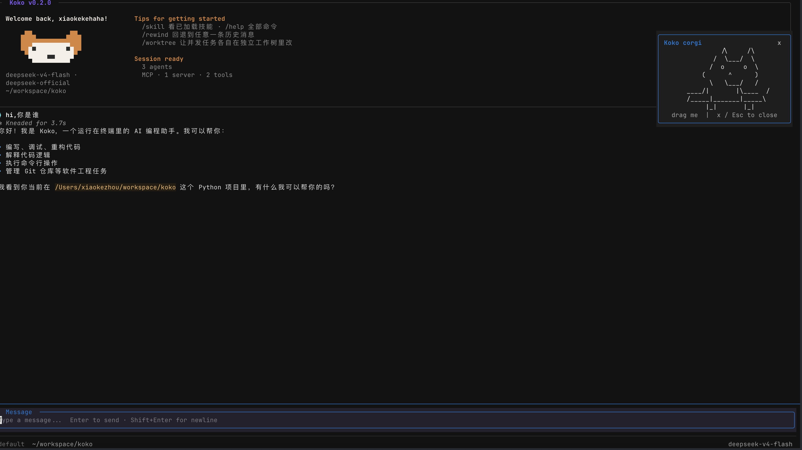

# Koko

终端里的 AI 编程助手。基于 Python + [Textual](https://textual.textualize.io/) 构建，提供交互式 TUI、非交互式单次执行、浏览器远程模式三种前端，并内置多 Agent 团队协作能力。



<p align="center"><sub>启动时的一次性欢迎卡片：当前 provider 与模型、工作目录、上手提示、会话状态（Agent 数 / MCP server 与工具数）。右侧那只可拖拽的柯基来自 <code>/mascot</code>。</sub></p>

架构上，Koko 的 Runtime 参考 [Pi](https://github.com/earendil-works/pi) 的分层设计，取向是**稳定核心 + 可扩展 Runtime**：

```text
前端：TUI  /  -p 单次执行  /  Remote 浏览器  /  队友 worker
                        ↓  同一条装配路径
        __main__.py（唯一组装根） → AgentRuntime
                        ↓
   AgentLoop        +   ToolPipeline      +   ExtensionHost
 唯一的模型↔工具循环    唯一的工具执行通道      能力登记与生命周期
```

这套分层要守住的是三件事：生产代码里只存在一个「模型 → 工具 → 模型」循环和一条工具管线；新能力通过扩展登记接入，不必改动内核；能力由谁注册、何时生效、何时撤销都可追踪，会话结束不留下悬挂的工具、监听器和后台任务。

参考不等于复刻。Pi 是 TypeScript 的，Koko 是 Python 的，目标也始终是 Koko 自己 —— 借鉴的是职责边界与不变量的形状，不是它的类型系统与包边界。哪些哲学被借鉴、哪些地方 Koko 有意不同、还差什么，见[设计参考：Pi](#设计参考pi)。

> 项目地址：https://github.com/xiaokekehaha/koko-pi-agent

---

## 目录

- [特性](#特性)
- [环境要求](#环境要求)
- [安装](#安装)
- [配置](#配置)
- [使用](#使用)
- [核心能力](#核心能力)
- [架构介绍](#架构介绍)
- [设计参考：Pi](#设计参考pi)
- [开发](#开发)

---

## 特性

| 能力 | 说明 |
| --- | --- |
| 分层 Runtime | 唯一组装根 + 唯一 `AgentLoop` + 唯一 `ToolPipeline` + `ExtensionHost` 能力登记，参考 Pi 的分层设计 |
| 三种前端 | 交互式 TUI、`-p` 单次执行（支持 NDJSON 事件流）、WebSocket + 浏览器远程模式 |
| 多模型协议 | `anthropic` / `openai` / `openai-compat` 三套协议，可同时配置多个 provider 并在会话中切换 |
| 权限体系 | 四级权限模式 + 危险命令检测 + 路径沙箱 + 三层规则文件 |
| OS 级沙箱 | Linux 走 `bwrap`，macOS 走 Seatbelt |
| 子 Agent | 内置 explore / general-purpose / plan / verification 四类子 Agent，支持后台任务 |
| 团队协作 | 多 Agent 团队，队友可跑在进程内、tmux 窗格、iTerm2 窗格或独立进程中 |
| MCP | 接入 MCP Server，自动把远端工具桥接为本地工具 |
| Hooks | 会话/轮次/工具/消息四个层级的生命周期钩子，动作类型支持 command / prompt / http / agent |
| Skills | 可加载、可安装的技能包，注册为斜杠命令 |
| 长期记忆 | 自动记忆、记忆整合、记忆召回，以及会话持久化与回溯 |
| Git Worktree | 并发子任务/队友各自在独立工作树中改动，互不干扰 |
| 自动压缩 | 上下文接近窗口上限时自动压缩历史 |

---

## 环境要求

- Python >= 3.11
- [uv](https://docs.astral.sh/uv/)（推荐的依赖与运行管理工具）
- 至少一个可用的模型 API（Anthropic、OpenAI，或任意 OpenAI 兼容服务）
- 可选：`git`（worktree 隔离）、`tmux` / iTerm2（团队协作的多窗格后端）、`node` + `npx`（运行 stdio 类 MCP Server）

---

## 安装

```bash
git clone https://github.com/xiaokekehaha/koko-pi-agent.git
```

```bash
cd koko-pi-agent && uv sync
```

`uv sync` 会创建 `.venv` 并安装全部依赖。安装完成后可通过 `uv run koko` 启动，无需手动激活虚拟环境。

---

## 配置

配置文件为 YAML，按以下顺序查找（项目级优先）：

1. `.koko/config.yaml`（项目级，随仓库走）
2. `~/.koko/config.yaml`（用户全局）

**至少要配置一个 provider**，否则启动会直接报错退出。

### 最小配置

```yaml
providers:
  - name: claude
    protocol: anthropic
    base_url: https://api.anthropic.com
    api_key: ${ANTHROPIC_API_KEY}
    model: claude-sonnet-4-5
```

`api_key` 支持 `${ENV_VAR}` 形式引用环境变量。若留空，会按协议自动回退到环境变量：`anthropic` → `ANTHROPIC_API_KEY`，`openai` / `openai-compat` → `OPENAI_API_KEY`。

### 完整配置示例

```yaml
providers:
  - name: claude
    protocol: anthropic            # anthropic | openai | openai-compat
    base_url: https://api.anthropic.com
    api_key: ${ANTHROPIC_API_KEY}
    model: claude-sonnet-4-5
    thinking: true                 # 开启扩展思考
    context_window: 200000         # 省略则自动探测
    max_output_tokens: 8192        # 省略则按 thinking 取 64000 / 8192

  - name: deepseek
    protocol: openai-compat
    base_url: https://api.deepseek.com
    api_key: ${DEEPSEEK_API_KEY}
    model: deepseek-chat

permission_mode: default           # default | acceptEdits | plan | bypassPermissions

mcp_servers:
  - name: context7
    command: npx
    args: ["-y", "@upstash/context7-mcp"]
  - name: remote-mcp
    url: https://example.com/mcp
    headers:
      Authorization: Bearer ${MCP_TOKEN}

hooks:
  - id: format-on-write
    event: post_tool_use           # session_start/session_end/turn_start/turn_end
                                   # pre_tool_use/post_tool_use/pre_send/post_receive/startup
    action:
      type: command                # command | prompt | http | agent
      command: "ruff format ."

sandbox:
  enabled: false                   # 是否启用 OS 级沙箱
  auto_allow: false                # 沙箱内命令是否自动放行
  network_enabled: false           # 沙箱内是否允许联网

worktree:
  symlink_directories: [node_modules, .venv, vendor]
  stale_cleanup_interval: 3600     # 秒
  stale_cutoff_hours: 24

enable_fork: true                  # 允许 Agent 派生子 Agent
enable_verification_agent: false   # 完成后自动跑校验 Agent
teammate_mode: ""                  # "" | in-process
enable_coordinator_mode: false     # 协调者模式
```

### `context_window` 的解析顺序

配置里没写 `context_window` 时，按以下优先级依次回退：

1. 配置文件里显式指定的值（最高优先级）
2. 从 provider 的 `/v1/models` 端点自动拉取（目前仅 `anthropic` 协议）
3. 内置的「模型名子串 → 窗口大小」映射表
4. 保守默认值：模型名含 `claude` 取 200000，其余取 128000

### 项目说明文件

Koko 启动时会自动读取项目约定并注入上下文，查找顺序：

1. `~/.koko/KOKO.md`、`~/.koko/AGENTS.md`（用户全局）
2. 从 git 根目录到当前工作目录，逐级读取每个目录下的 `KOKO.md` 和 `AGENTS.md`

---

## 使用

### 四种运行方式

交互式 TUI（默认）：

```bash
uv run koko
```

非交互式单次执行，只把最终文本打到 stdout：

```bash
uv run koko -p "解释一下 runtime/agent_loop.py 的执行流程"
```

非交互式 + NDJSON 事件流（便于被其他程序消费）：

```bash
uv run koko -p "跑一下测试并总结失败原因" --output-format stream-json
```

远程模式，启动 WebSocket 服务并附带浏览器 UI（监听 `0.0.0.0:18888`）：

```bash
uv run koko --remote
```

启动后浏览器访问 http://localhost:18888 即可。

### 命令行参数

| 参数 | 说明 |
| --- | --- |
| `-p PROMPT` | 非交互式执行单条 prompt |
| `--output-format text\|stream-json` | `-p` 模式的输出格式，默认 `text` |
| `--remote` | 启动远程模式（WebSocket + 浏览器 UI） |
| `--mode MODE` | 覆盖配置里的权限模式 |

> `--teammate --team-name <t> --agent-name <n>` 是团队协作内部使用的 worker 分支，由 tmux / iTerm2 窗格自动拉起，一般不需要手动调用。

### TUI 快捷键

| 按键 | 作用 |
| --- | --- |
| `Enter` | 提交 |
| `Alt+Enter` | 追加提交（follow up） |
| `Shift+Enter` / `Ctrl+J` | 换行 |
| `Tab` | 补全 |
| `Shift+Tab` | 切换权限模式 |
| `Esc` | 取消当前运行 / 关闭弹窗 |
| `Ctrl+O` | 折叠或展开工具调用块 |
| `Ctrl+C` | 退出 |

### 斜杠命令

在 TUI 输入框中输入 `/` 触发。输入 `/help` 查看全部，`/help <命令名>` 查看单条用法。

| 命令 | 作用 |
| --- | --- |
| `/help`（`/h`、`/?`） | 显示帮助 |
| `/status` | 显示当前状态信息 |
| `/clear` | 清除对话历史 |
| `/compact` | 手动压缩上下文 |
| `/rewind` | 回退到某个检查点 |
| `/session` | 会话管理（保存 / 恢复 / 列表） |
| `/memory` | 长期记忆管理 |
| `/permission` | 权限规则管理 |
| `/sandbox` | 沙箱管理 |
| `/plan` | 切换到 Plan 模式 |
| `/review` | 审查代码变更 |
| `/mcp` | 查看 MCP 服务器状态或重连 |
| `/skill` | 管理 Skill 技能包 |
| `/tasks` | 管理后台任务（`/tasks info <id>`、`/tasks cancel <id>`） |
| `/trace` | 查看 Agent 父子追踪树 |
| `/worktree` | 管理 Git Worktree |
| `/mascot` | 显示可拖拽的 ASCII 柯基动画 |

已安装的 Skill 也会注册成同名斜杠命令。

---

## 核心能力

### 权限模式

四级模式按工具类别（`read` / `write` / `command`）映射到 allow / ask / deny：

| 模式 | read | write | command |
| --- | --- | --- | --- |
| `default` | allow | ask | ask |
| `acceptEdits` | allow | allow | ask |
| `plan` | allow | ask | ask |
| `bypassPermissions` | allow | allow | allow |

在模式矩阵之外，还叠加了三道机制：

- **危险命令检测** — 识别 `rm -rf /` 之类的高危命令
- **路径沙箱** — 阻止越出工作目录的文件访问
- **规则引擎** — 三层 YAML 规则，后面的层级覆盖前面的：
  - 用户级 `~/.koko/permissions.yaml`
  - 项目级 `<project>/.koko/permissions.yaml`
  - 本地级 `<project>/.koko/permissions.local.yaml`（TUI 里选择「总是允许」时写入这里）

规则文件格式：

```yaml
- rule: Bash(git status*)
  effect: allow
- rule: WriteFile(/etc/*)
  effect: deny
```

### 内置工具

| 分类 | 工具 |
| --- | --- |
| 文件 | `ReadFile`、`WriteFile`、`EditFile` |
| 搜索 | `Grep`、`Glob` |
| 执行 | `Bash` |
| 子 Agent | `Agent` |
| 交互 | `AskUserQuestion`、`ExitPlanMode` |
| 技能 | `LoadSkill`、`InstallSkill` |
| Worktree | `EnterWorktree`、`ExitWorktree` |
| 团队 | `TeamCreate`、`TeamDelete`、`SendMessage` |
| 任务 | `TaskCreate`、`TaskGet`、`TaskList`、`TaskUpdate`、`TaskStop` |

工具输出超过 50000 字符时会溢出到磁盘，历史里只保留预览片段。

### 子 Agent

`koko_pi_agent/agents/builtins/` 下的 Markdown 文件定义了四个内置子 Agent：

- `explore` — 只读探索，负责在大范围里定位代码
- `general-purpose` — 通用多步任务
- `plan` — 制定实现方案
- `verification` — 完成后校验

### 团队协作

`TeamManager` + `coordinator` + `mailbox` 负责团队创建与消息投递。队友有四种运行后端：进程内（`spawn_inprocess`）、tmux 窗格（`spawn_tmux`）、iTerm2 窗格（`spawn_iterm2`），或通过 `koko --teammate` 拉起的独立进程。

---

## 架构介绍

### 分层结构

```
┌──────────────── 前端 ────────────────┐
│  TUI (app.py)   -p 模式   Remote     │
└──────────────────┬───────────────────┘
                   │
        ┌──────────▼───────────┐
        │  __main__.py 组装根   │  ← 唯一的装配入口
        └──────────┬───────────┘
                   │
        ┌──────────▼───────────┐
        │    AgentRuntime      │  ← 生命周期 open/aclose
        │  Agent + ToolRegistry│
        │   + ExtensionSession │
        └──────────┬───────────┘
                   │
   ┌───────────────┼────────────────┐
   │               │                │
┌──▼────────┐ ┌────▼──────┐ ┌───────▼──────┐
│ AgentLoop │ │ToolPipeline│ │ExtensionHost │
│ 模型↔工具 │ │ 工具执行   │ │  扩展装载    │
│  唯一实现 │ │  唯一实现  │ │              │
└───────────┘ └────────────┘ └──────────────┘
```

### 组装根：Runtime + Agent Core + ExtensionHost

`koko_pi_agent/__main__.py` 是唯一的组装根。三个入口（TUI、`-p`、`--remote`）加上 `--teammate` worker 分支，都各自装配 provider/client、`PermissionChecker`、`HookEngine`、`AgentLoader`/`TaskManager`/`TeamManager`，再通过 `AgentRuntime.open(...)` 打开 `ExtensionSession`。

`AgentRuntime`（`runtime/agent_runtime.py`）持有 Agent + ToolRegistry + ExtensionSession 的生命周期，是所有前端共享的唯一装配路径。

`ExtensionHost`（`extensions/host.py`）按 `RuntimeProfile`（`TUI_LEAD` / `PROMPT_LEAD` / `REMOTE_LEAD` / `TEAMMATE_WORKER`）过滤哪些内置扩展被激活；每个扩展调用 `ExtensionAPI.register_tool()` 把工具注册进本次运行的 `ToolRegistry`。内置扩展目录在 `extensions/builtins.py` 的 `create_builtin_extension_host()`。

### Agent 循环与工具管线

`agent.py` 的 `Agent` 是对外门面，负责环境注入、长期记忆注入、hooks 与自动压缩（`context/manager.py`）。但「模型 → 工具 → 模型」的循环只有一个实现：`runtime/agent_loop.py` 的 `AgentLoop`。工具执行也只有一个实现：`runtime/tool_pipeline.py` 的 `ToolPipeline` —— 按声明顺序准备工具，把连续的并发安全工具放进 `asyncio.TaskGroup` 并发执行，无论完成顺序如何，结果始终按声明顺序回填。

`Agent.run()`（异步事件流，供 TUI/Remote 使用）和 `Agent.run_to_completion()`（供 `TaskManager`、`AgentTool`、进程内队友等无头调用方使用）都是这同一个循环的适配器。

### 消息模型：一个扁平 Message + 三套序列化器

`conversation.py` 的 `Message` 是唯一的消息类型 —— 单个 dataclass（`role` + `content` + 可选的 `tool_uses` / `tool_results` / `thinking_blocks`）。`ConversationManager.history` 本身就是对话状态，也是持久化的直接来源（`memory/session.py` 的 `SessionRecord` 基本是它的镜像）。

所有 provider 差异都收敛在 `serialization.py`：`build_anthropic_messages` / `build_openai_input` / `build_chat_completion_messages` 各自把同一份 `Message` 列表转成对应协议的线格式。新增协议或给 `Message` 加字段，三处都要动。

消息层面没有「只给 UI 看、不发给模型」的机制 —— 任何追加进 `ConversationManager.history` 的内容都会发给模型。给 UI 用的实时结构化数据（工具进度、退出码等）走另一条事件总线：`runtime/events.py` 里的 Run/Turn/Message/Tool 事件（`ToolExecutionStarted`、`ToolUseEvent`、`ToolResultEvent`、`UsageEvent` 等），由 `Agent.run()` 产出、TUI/Remote 消费。这些事件不持久化，会话重启后无法回放。

### 目录结构

```
koko_pi_agent/
├── __main__.py          组装根，四个入口分支
├── app.py               Textual TUI
├── remote.py            WebSocket 服务 + 浏览器 UI
├── agent.py             Agent 门面
├── conversation.py      Message / ConversationManager
├── serialization.py     三套协议序列化器
├── config.py            配置加载
├── validator.py         配置校验
├── runtime/             Agent 核心
│   ├── agent_runtime.py     生命周期装配
│   ├── agent_loop.py        唯一的 模型↔工具 循环
│   ├── tool_pipeline.py     唯一的工具执行实现
│   ├── run_control.py       运行控制
│   ├── events.py            事件总线定义
│   └── ...
├── extensions/          ExtensionHost / 契约 / 内置扩展 / 资源域
├── tools/               内置工具
├── agents/              子 Agent（fork/task）系统 + builtins/*.md
├── teams/               多 Agent 团队协作
├── commands/            斜杠命令注册表与 handlers
├── hooks/               生命周期钩子
├── mcp/                 MCP 客户端与工具桥接
├── permissions/         权限模式、危险命令、路径沙箱、规则引擎
├── sandbox/             OS 级沙箱（bwrap / seatbelt）
├── memory/              长期记忆 + 会话持久化
├── skills/              技能包加载与安装
├── context/             上下文管理与自动压缩
└── worktree/            Git worktree 隔离
```

## 设计参考：Pi

Koko 把 [Pi](https://github.com/earendil-works/pi)（原 `badlogic/pi-mono`）的 Agent Core 当作架构参考和对照样本 —— **参考它的分层与扩展机制，但目标始终是 Koko 本身，不是复刻一个 Mini Pi**。Pi 是 TypeScript 的，Koko 是 Python 的；两边的类型系统、包边界、并发原语都不一样，所以借鉴的是不变量的形状和职责边界，不是文件名和目录结构。

下面的对照基于 `earendil-works/pi` main 分支（2026-08-17 抓取）。完整的逐层实证见 [docs/pi-layered-architecture.md](docs/pi-layered-architecture.md)，迭代设计见 [docs/koko-pi-inspired-runtime-design.md](docs/koko-pi-inspired-runtime-design.md)。

### 五层架构的对应关系

Pi 的分层与 Koko 的落点：

| Pi 的层 | Pi 的位置 | Koko 的对应 |
| --- | --- | --- |
| 宿主：CLI / TUI / Web / Slack | `packages/tui`、`packages/server`，Slack 在另一个仓库 | `app.py`（TUI）、`remote.py`（WebSocket + 浏览器）、`-p` 模式 |
| 产品层：会话树、压缩、Prompt、Skill、Extension | `packages/coding-agent`（649 个文件），组合根 `src/core/sdk.ts` | `__main__.py`（组合根）、`extensions/`、`context/`、`skills/`、`commands/` |
| Agent：保存消息、队列、运行状态 | `packages/agent/src/agent.ts`（592 行，一个类） | `runtime/agent_run.py` + `runtime/run_control.py` |
| agentLoop：调模型 → 执行工具 → 交回模型 | `packages/agent/src/agent-loop.ts`（796 行，一组自由函数） | `runtime/agent_loop.py` + `runtime/tool_pipeline.py` |
| pi-ai：统一各家 Provider 的消息与流式事件 | `packages/ai`（327 个文件） | `serialization.py`（三套协议序列化器）+ `runtime/model_stream.py` |

Pi 那套架构里最能说明取向的一组数字是：**内核两个文件 1388 行，产品层 649 个文件**。所谓 "small core" 指的是核心承担的职责少、变化原因少，不是代码少。Koko 把这条翻译成「稳定核心 + 可扩展 Runtime」—— 功能一件不删，只让变化频繁的装配与扩展逻辑不再散落进 Agent 和各个入口。

### 借鉴的设计哲学

**1. 唯一组合根，机制与策略三级分离。**

Pi 全系统只有一处 `new Agent({...})`（`sdk.ts`），内核的每一个回调槽位都被产品层用来接扩展事件：`transformContext` → `context` 事件、`beforeToolCall` → `tool_call` 事件、`afterToolCall` → `tool_result` 事件。内核提供机制，产品层决定策略，扩展决定具体行为。

Koko 对应：`__main__.py` 是唯一组装根，`AgentRuntime.open(...)` 是唯一装配路径，四个前端（TUI / `-p` / Remote / teammate worker）走的是同一条。扩展只能通过 `ExtensionAPI` 这个窗口登记能力，摸不到内部零件。

**2. 一个循环、一条工具管线，不许有第二台发动机。**

Pi 的 `agentLoop` 全文没有一个模块级可变变量 —— 所有状态从参数进、从返回值出。直接好处是可测试：给一个假的 `streamFn`，整个循环就能脱离真实 LLM、数据库和 UI 单独跑。

Koko 对应：`AgentLoop` 是唯一的「模型 → 工具 → 模型」实现，`ToolPipeline` 是唯一的工具执行实现。`Agent.run()`（流式，供 TUI/Remote）和 `Agent.run_to_completion()`（无头，供 `TaskManager` / `AgentTool` / 进程内队友）都只是同一个循环的适配器。这是收敛过程中最先做的一件事（阶段 0）。

**3. 工具执行是 prepare → execute → finalize 三段管道。**

Pi 的分工：prepare 做找工具、参数兼容、schema 校验、`beforeToolCall` 拦截、取消检查，任何一步失败都返回错误结果而不抛出；execute 只负责真正的 I/O；finalize 跑 `afterToolCall` 钩子并做**字段级覆盖而非深合并** —— 合并规则被写进接口注释，是契约的一部分，不是实现细节。

并行调度分三阶段，其中最关键的是第三阶段的**双顺序**：`tool_execution_end` 事件按完成顺序发（UI 可以谁先完成谁先停转圈），但进入消息历史的工具结果**必须按调用的原始顺序**，否则模型下一轮看到的上下文就是乱的。

Koko 对应：[`runtime/tool_pipeline.py`](koko_pi_agent/runtime/tool_pipeline.py) 按声明顺序 prepare，把连续的并发安全工具收进 `asyncio.TaskGroup` 并发执行，无论完成顺序如何，结果始终按声明顺序回填。

**4. 保守聚合：宁可多等一会，不可能出错。**

Pi 里有两处方向相反的聚合判断，服务的是同一个原则：

- `terminate` 用 `every` —— 必须这批工具**全部**要求停止，循环才真的停；只要还有一个在正常工作就不中断。
- `sequential` 用 `some` —— 一批里**只要有一个**工具声明了串行，整批都串行。

Koko 对应：`ToolPipeline` 遇到非并发安全的工具时会先 flush 掉已攒的并发组，再单独串行执行它，然后重新开组。

**5. 截断的工具调用整批拒绝执行。**

这是 Pi 在 v0.80.2 之后加的防御。流式的工具调用参数是用尽力而为的 JSON 抢救解析器收尾的，所以一条被 token 上限截断的消息，可能产出「能解析、能通过 schema 校验、但内容悄悄不完整」的工具调用 —— 想象一个 `bash` 调用的 `command` 参数被截成 `rm -rf /tmp/build-artifacts` 的前半截。**校验通过不等于语义完整**，所以整批拒绝，返回错误让模型重发。

Koko 对应：`ToolPipeline.execute_batch()` 一进来就检查 `message.is_truncated`，为整批工具调用生成错误结果（"Tool call was not executed because the assistant response was truncated. Reissue the complete tool call."），一个都不执行。`AgentLoop` 另有 max_tokens 升级重试来配合恢复。

**6. 每一轮重新取配置快照，而不是 run 开始时冻结。**

Pi 用 `prepareNextTurnWithContext` 在每一轮开始前重新灌入 systemPrompt、tools、model、thinkingLevel。这就是为什么扩展可以在会话进行到一半注册新工具、用户可以中途换模型。

Koko 对应：[`runtime/turn_preparer.py`](koko_pi_agent/runtime/turn_preparer.py)。

**7. steering 与 followUp 是两个队列，区别在检查时机。**

| | steering | followUp |
| --- | --- | --- |
| 检查点 | 进入内层循环前 + 每圈结尾 | 内层循环全部退出后 |
| 语义 | 紧急插队，在工具执行间隙插入 | 排队等叫号，等当前任务全干完 |
| 场景 | 用户在 Agent 干活时又输入了指令 | 系统追加「顺便跑个测试」 |

Koko 对应：`runtime/run_control.py` 的 `RunInputKind.STEERING` / `RunInputKind.FOLLOW_UP`，在 TUI 里分别对应 `Enter` 和 `Alt+Enter`。

**8. 「这次 run 结束」和「真的空闲了」必须是两个概念。**

Pi 的重试、压缩、续跑三件事全在 Loop 之外，用「一次 run 完了再判断要不要开下一个 run」实现 —— 内核只提供 `prompt()` / `continue()` 两个入口，产品层用一个 while 循环把它们串成任意策略。所以 `agent_end`（内核：这次 run 结束）和 `agent_settled`（产品：重试压缩队列全清完）是两个事件。**混为一谈的话，UI 会在自动压缩期间误报完成。**

Koko 对应：`AgentRun` 的 `_settle()` 与 `wait_until_idle()`。

**9. 失败编码成事件，不让异常穿透。**

Pi 的 `StreamFn` 契约明写：请求/模型/运行时失败不许 throw，必须编码成流里的事件加一条 `stopReason: "error"` 的完整消息。理由很实在 —— 失败走 throw，它就成了一个不在会话记录里的幽灵；编码成消息，它就能进历史、能持久化、能被 UI 渲染、能被重试逻辑检查。Pi 在第 5/4/3 层各实现了一遍这条，代价是几十行样板，换来任何失败路径下事件都成对。

### Koko 有意不同的地方

参考不等于照抄。以下几处是 Koko 主动做了不同选择，或者用 Python 的机制重新落地：

**权限系统：Pi 不内置，Koko 内置。**

这是最大的一处哲学分歧。Pi 的 README 写得很直白：pi **不内置权限系统**，默认以启动用户的权限运行，需要边界就上容器或沙箱。这是「机制与策略分离」推到极致的结果 —— 权限确认在 CLI 是弹窗、在 Slack 是消息审批、在 CI 应该完全禁止，所以内核只提供 `beforeToolCall()` 这个机制，策略交给扩展和宿主。

Koko 选择把权限做进产品：四级权限模式矩阵、危险命令检测、路径沙箱、三层规则文件，外加 OS 级沙箱（bwrap / seatbelt）。理由是 Koko 的宿主形态是收敛的（终端 + 浏览器），把安全策略留给用户自己装扩展，实际收益低于风险。

**资源清理：用 Python 的 `AsyncExitStack`，而不是 handle 集合。**

Koko 的 [`extensions/resources.py`](koko_pi_agent/extensions/resources.py) 提供 `ResourceScope`（登记 → 逆序清理）和 `TaskSupervisor`（统一创建、取消、等待并报告后台任务错误）。每个 Agent 有自己的 `ExtensionSession`，主 Agent、队友 Agent 和测试实例互不串状态；一个扩展启动失败或会话结束后，不留下工具、监听器、后台任务和连接。这是阶段 2C 做的事。

**Provider 抽象的规模差一个量级。**

Pi 的 `packages/ai` 是 327 个文件的反腐层（Anti-Corruption Layer），每个 API 一个适配器；Koko 是 `serialization.py` 里的三个函数。不变量的形状一致 —— 上层只认识一种 `Message`，厂商协议的怪癖不许穿透 —— 但规模完全不同。代价是：新增协议或给 `Message` 加字段，三个序列化函数都要动。

### 已知的结构性差距

这几处是设计文档里明确记着的、Koko 还没做到的：

| Pi | Koko 现状 |
| --- | --- |
| 会话树：JSONL + `id`/`parentId`，只追加不修改，同一 `parentId` 多个子节点即分叉，支持 `/fork` `/clone` `/tree` | 线性会话。**当前最大的结构性缺口** |
| 观察（`session_*`）与拦截（`session_before_*`）在事件系统里分离 —— 前者只是通知，后者可取消或定制 | `HookEngine` 尚未区分这两类语义 |
| `custom`（扩展状态，不进 LLM 上下文）与 `custom_message`（扩展注入的消息，进上下文）分开 | Koko 没有「只给 UI 看、不发给模型」的消息级机制，UI 数据走独立事件总线 |
| 内核每个回调槽都接到扩展事件 | ExtensionHost 仍在推进中 |

Pi 自己也在动：`packages/agent/src/harness/` 正在把会话树、压缩、崩溃恢复、多 lane 并行从产品层下沉到 agent 包，成为任何宿主都能复用的持久化运行时。这个方向对 Koko 同样有参考价值。

---

## 开发

### 运行测试

```bash
uv run pytest
```

```bash
uv run pytest tests/test_agent.py::test_stop_end_turn
```

```bash
uv run pytest -k "conversation"
```

异步测试需显式标注 `@pytest.mark.asyncio`（未配置全局 `asyncio_mode`）。`tests/conftest.py` 有一个 autouse fixture 会把 `koko_pi_agent.teams.models.Path.home` 重定向到临时目录 —— 涉及 `~/.koko` 下团队/会话路径的测试要注意这一点。

本仓库未配置 lint / 类型检查工具链。

### 代码约定

- commit message 用英文
- 变量命名用 snake_case

### 设计文档

改动 `Runtime` / `ExtensionHost` / `AgentLoop` / `ToolPipeline` 之前，先读 `docs/` 下的设计文档：

- `docs/koko-pi-inspired-runtime-design.md` — 总体设计
- `docs/koko-agent-loop-stage0-design.md` — Agent 循环
- `docs/koko-extension-host-stage1-design.md` — 扩展宿主
- `docs/koko-extension-resources-stage2a-design.md`、`stage2c` — 资源域与清理
- `docs/koko-agent-run-control-stage2a-design.md` — 运行控制

Pi 的逐层实证分析在 [docs/pi-layered-architecture.md](docs/pi-layered-architecture.md)，借鉴关系见上面的[设计参考：Pi](#设计参考pi)。

`examples/` 下（`mini_pi_agent/`、`minidb_prototype/`、`cordis_coffee_shop/`）都是独立的教学材料 —— 比如 `mini_pi_agent/` 是一个简化的 mini agent，用来理解 Pi 的概念。它们与生产代码路径无关，不要拿它们当架构改动的基线。

---

## License

尚未指定。
