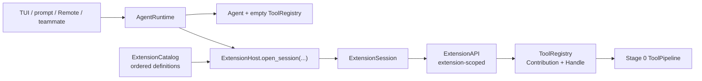
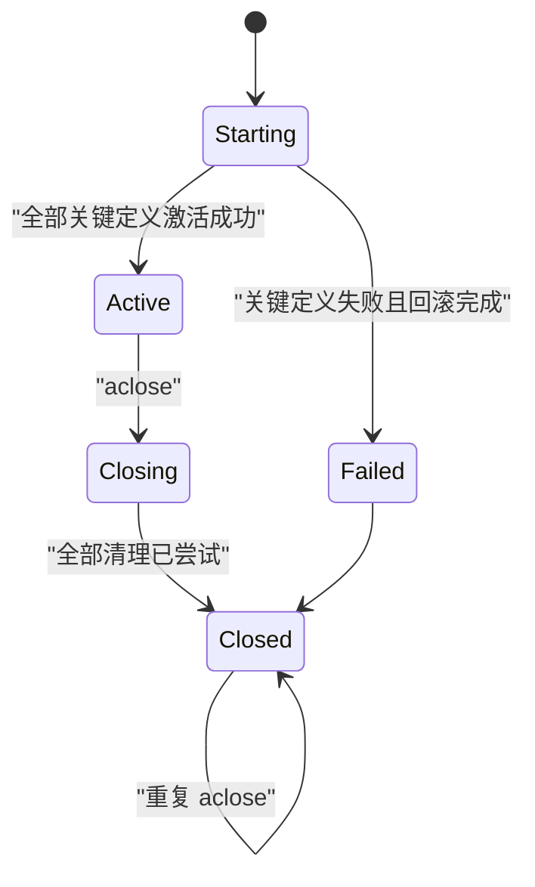
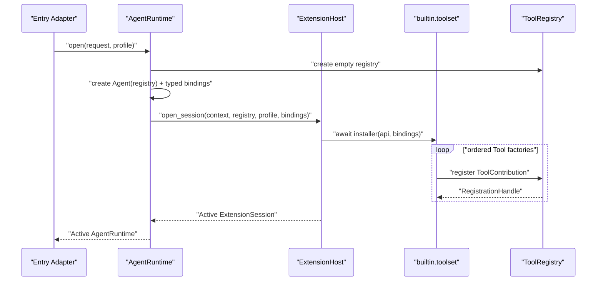

# Koko 阶段 1 设计：ExtensionHost 内置 Tool 纵向切片

> - 状态：Implemented v1.0，Stage 1A–1F 已完成并验证
> - 日期：2026-08-16
> - 前置条件：[阶段 0：统一 Agent Loop 与 Tool Execution Pipeline](./koko-agent-loop-stage0-design.md)已完成
> - 主路线：[Koko Runtime 迭代设计](./koko-pi-inspired-runtime-design.md)

## 1. 结论

阶段 1 不先做“第三方插件系统”，也不加载外部 Python 代码。它只完成一条最小但真实的纵向切片：

> 把当前散落在 TUI、prompt、Remote 和 teammate 中的内置 Tool 装配，收进一个可追踪、可回滚、可反向注销的 ExtensionHost 会话。

这一阶段真正解决的是 Tool 的所有权，不是 Tool 的业务逻辑。现有 Tool 类、名称、Schema、Permission、Hook、ToolPipeline 和 Session JSONL 都保持不变。

完成后，应用入口只选择一个 `ToolProfile` 并创建 `AgentRuntime`；它不再逐个调用 `registry.register(...)`。



## 2. 为什么阶段 1 要这样收窄

主设计描述了 ExtensionHost 的终局能力：Tool、Command、事件、资源、后台任务、发现、信任和重载。如果一次实现全部能力，会在真实调用方迁移前先铺出大量浅 Interface。

阶段 1 只证明四件事：

1. 同一个内置 Tool manifest 可以为不同入口生成确定的 Tool profile。
2. 每条 Tool contribution 都知道“谁注册了我、从哪里来”。
3. 第 N 次注册失败时，前 N-1 次注册可以自动撤销。
4. Runtime 关闭后，本 Session 拥有的 contribution 数量为零。

后续能力按独立阶段增加：

| 能力 | 阶段 |
| --- | --- |
| 通用资源、后台任务 | 2A |
| Observer、Interceptor、Hook Adapter | 2B |
| Command contribution 所有权 | 2C |
| Python 安装包发现 | 3 |
| 本地路径与项目信任 | 4 |
| 候选会话与安全重载 | 5 |

## 3. 当前代码证据

### 3.1 同一件事有四份装配 Implementation

| 入口 | 当前装配位置 | 特征 |
| --- | --- | --- |
| TUI lead | `koko_pi_agent/app.py::_select_provider()` | Tool 分多段注册，并依赖 Session、Skill、Worktree、Team 和 UI |
| headless prompt | `koko_pi_agent/__main__.py::_run_prompt()` | 先建 Agent，再补 Team Tool；函数存在多个早退分支 |
| Remote lead | `koko_pi_agent/remote.py::_init_agent()` | 注释明确写着“复刻 TUI 流程”，但实际 Tool 清单已经不同 |
| 外部 teammate | `koko_pi_agent/__main__.py::_build_teammate_registry()` | 单独维护协作 Tool、Skill、Worktree 和 MCP |

此外，`koko_pi_agent/agents/tool_filter.py` 会为 sub-agent、fork、coordinator 和 in-process teammate 新建过滤 Registry；其中多数 Tool 对象直接从父 Registry 借用。

### 3.2 当前 ToolRegistry 没有所有权语义

当前 `ToolRegistry` 的核心状态是 `dict[str, Tool]`，`register()` 直接赋值：

- 同名 Tool 静默覆盖；
- 调用方不知道覆盖的是谁；
- 注册不返回 Handle；
- 无法精确撤销一条注册；
- 部分启动失败后无法自动回滚；
- disabled 和 deferred-discovered 状态无法随注销一起清理。

ExtensionHost 如果建立在这个 Interface 上，只会成为新的手工装配层，无法成为深模块。

### 3.3 Agent 与依赖 Agent 的 Tool 不是死锁

`Agent` 构造时只保存 Registry，不要求 Registry 已经有 Tool。因此启动顺序可以是：

1. 创建空 ToolRegistry；
2. 用空 Registry 创建 Agent；
3. 创建需要 parent Agent 的内置 Tool；
4. ExtensionHost 原子激活全部 Tool；
5. 激活成功后才把 AgentRuntime 暴露给调用方。

这样不需要“两阶段 Extension”Interface，也不需要通用依赖图容器。

### 3.4 阶段 0 已经提供稳定接缝

AgentLoop 在每一轮模型调用前通过 `agent.registry.get_all_schemas()` 读取 Tool，ToolPipeline 通过同一个 Registry 查找 Tool。

阶段 1 只替换“Registry 如何被装满和清空”，不修改：

- AgentLoop 的模型循环；
- ToolPipeline 的 prepare → execute → finalize；
- interactive/headless/Remote 的 Event Adapter；
- Tool 的参数 Schema 和执行方法。

## 4. 目标、非目标与验收边界

### 4.1 目标

- 一个 ExtensionHost Implementation 负责排序、激活、回滚、关闭和诊断。
- 一个内置 Tool manifest 定义各入口的 Tool profile。
- ToolRegistry 保存结构化 Contribution，重复名称快速失败。
- 每次注册返回幂等 RegistrationHandle。
- AgentRuntime 显式拥有 Agent、主 Registry 和 ExtensionSession。
- TUI、prompt、Remote、外部 teammate 不再逐个注册内置 Tool。
- MCP 仍由 MCPManager 连接和关闭，但使用新 Registry 来源/Handle 语义。

### 4.2 非目标

- 不加载 entry point、本地路径或项目扩展。
- 不实现项目可信度判断或代码沙箱。
- 不把 CommandRegistry、HookEngine、SkillLoader 或 MCPManager 全部搬进 ExtensionHost。
- 不公开通用 `enter_async_context()`、`create_task()` 或依赖注入容器。
- 不实现热重载、候选 Session 或跨 generation 切换。
- 不重写任何现有 Tool 的业务行为。
- 不要求不同角色拥有完全相同的 Tool 清单。

### 4.3 阶段 1 完成定义

只有以下条件全部满足，阶段 1 才算完成：

- 每个生产入口通过 AgentRuntime 打开一个 owned ExtensionSession；
- 各 profile 的 Tool 名称和顺序与迁移前基线一致；
- 同名注册在启动时失败，并报告 existing/attempted 两方来源；
- 第二次注册失败时第一次注册自动撤销；
- Session 重复关闭无副作用；
- Session 关闭后 owned contribution 为零；
- 现有 Agent、Remote、Skill、sub-agent、teammate 和 ToolPipeline 测试不回归；
- 生产代码仍只有阶段 0 的唯一 AgentLoop 和 ToolPipeline。

## 5. 术语与不变量

### 5.1 术语

| 术语 | 本阶段含义 |
| --- | --- |
| ExtensionHost | 打开 ExtensionSession 的深模块，隐藏排序、回滚、关闭和诊断 |
| ExtensionCatalog | 有顺序、不可变的 Extension Definition 列表 |
| ExtensionSession | 某个 AgentRuntime 已激活的扩展作用域 |
| ExtensionAPI | 某一个 extension_id 在某一个 Session 中唯一可用的注册窗口 |
| ToolContribution | Tool 实现加 owner、source、sequence、runtime_id 和 generation |
| RegistrationHandle | 只撤销自己对应 contribution 的幂等句柄 |
| ToolProfile | 某类 Runtime 应拥有的确切 Tool 名称与顺序 |
| ToolView | 从 owned Registry 派生的只读/借用视图，不拥有父 contribution |

### 5.2 必须成立的不变量

1. `ExtensionHost.open_session()` 返回时，Session 只能是 active；启动失败不返回半成品。
2. Agent 首次 Run 只能发生在 ExtensionSession active 之后。
3. 一个 ExtensionAPI 永远绑定一个 extension_id、runtime_id 和 generation。
4. 同名 Tool 不允许“最后注册者获胜”。
5. Handle 只按 registration token 撤销，不能仅按名称删除。
6. 关闭时先让 API 失效，再执行反向注销。
7. 一个清理动作失败不能阻止其他清理动作。
8. `ToolRegistry.get/list_tools/get_all_schemas` 继续返回现有 Tool 视图。
9. owned Session 与 borrowed ToolView 不共享 RegistrationHandle。
10. Stage 1 ExtensionAPI 只允许激活期注册 Tool；active 后动态注册留给后续事件阶段。

## 6. 深模块一：ExtensionHost

### 6.1 外部 Interface

以下是设计草案，不是本轮要提交的生产代码：

```python
class ExtensionHost:
    def __init__(self, catalog: ExtensionCatalog) -> None: ...

    async def open_session(
        self,
        request: OpenExtensionSession,
    ) -> ExtensionSession: ...
```

Stage 1 不增加 `load()`、`reload()`、`enable()`、`disable()`、`register_service()` 等方法。

`OpenExtensionSession` 把内部组合所需的数据集中在一个 request value 中：

```python
@dataclass(frozen=True)
class OpenExtensionSession:
    context: SessionContext
    registry: ToolRegistry
    profile: ToolProfile
    bindings: BuiltinRuntimeBindings  # internal, not extension-author Interface
```

应用入口不会直接构造它；AgentRuntime 是唯一生产调用方。`BuiltinRuntimeBindings` 是有字段、有类型的内部装配数据，不是按字符串查询对象的通用 Service 容器。

### 6.2 Host 隐藏的 Implementation

- 验证 Catalog 中 extension ID 唯一；
- 按 Catalog 明确顺序选择当前 profile 的定义；
- 为每个 extension 创建独立 ExtensionAPI 和 AsyncExitStack；
- 等待同步或异步 installer 完成；
- 记录 activated/skipped/failed 诊断；
- installer 失败时先回滚本 extension；
- critical extension 失败时再反向关闭此前成功的 extension；
- Session 关闭时让全部 API 失效并反向清理；
- 汇总清理错误而不是在第一处失败时停止。

### 6.3 删除测试

如果删除 ExtensionHost，这些复杂度会重新散回至少四个入口：

- profile 排序；
- Extension ID 校验；
- 每次注册的 owner/source；
- 部分启动回滚；
- 关键失败处理；
- 反向关闭；
- stale API 防护；
- 诊断聚合。

因此它不是 pass-through，具备足够 Depth。

## 7. ExtensionCatalog 与内置 Tool manifest

### 7.1 Catalog 是不可变数据，不是第二个生命周期对象

Stage 1 的 ExtensionCatalog 只负责：

- 保存有顺序的 Extension Definition；
- 在构建时拒绝重复 extension ID；
- 根据 ToolProfile 选择定义；
- 为诊断保留显示名、来源和 critical 标记。

它不创建 Tool、不修改 Registry、不保存 Agent 状态，也不需要 `close()`。

### 7.2 Stage 1 只提供一个关键内置 Tool definition

生产 Catalog 首先只有一个关键定义：

```text
mewcode.builtin.toolset
```

它内部根据 ToolProfile 使用共享 Tool factory 生成确切顺序。先用一个 owner 的理由是：

- 本阶段的交付单元是“现有内置 Tool 装配”；
- 当前没有按扩展 ID 单独启停内置能力的用户需求；
- 文件、Skill、Worktree、Team Tool 的启用组合已经由入口 profile 决定；
- 过早拆成十几个 extension 会增加 Interface 和排序规则，却没有新的调用方 Leverage。

Host 的多 extension 失败与反向关闭能力通过 Interface 测试验证；Stage 2A 增加 ResourceScope/TaskSupervisor 时再引入第二个真实生产 definition。

### 7.3 Tool profile 保持行为，不追求清单相同

以下名称按当前注册顺序记录，实施前由 1A 契约测试再次钉死：

| Profile | 迁移前内置 Tool 顺序（不含 MCP） |
| --- | --- |
| `TUI_LEAD` | ReadFile, WriteFile, EditFile, Bash, Glob, Grep, LoadSkill, InstallSkill, ToolSearch, AskUserQuestion, ExitPlanMode, EnterWorktree, ExitWorktree, Agent, TeamCreate, TeamDelete, SyntheticOutput, TaskStop |
| `PROMPT_LEAD` | ReadFile, WriteFile, EditFile, Bash, Glob, Grep, ToolSearch, Agent, TeamCreate, TeamDelete, SyntheticOutput, TaskStop |
| `REMOTE_LEAD` | ReadFile, WriteFile, EditFile, Bash, Glob, Grep, ToolSearch, LoadSkill, Agent, TeamCreate, TeamDelete, TaskStop, SyntheticOutput |
| `TEAMMATE_WORKER` | ReadFile, WriteFile, EditFile, Bash, Glob, Grep, ToolSearch, SyntheticOutput, EnterWorktree, ExitWorktree, LoadSkill, InstallSkill, SendMessage, TaskCreate, TaskGet, TaskList, TaskUpdate |

这里统一的是 manifest、factory、来源和回滚规则，不是把 Remote 强行加上 AskUser，或把 teammate 错误地加上 TeamCreate。

MCP Tool 在内置 Tool 之后动态追加，仍按当前入口行为决定是否启用。

## 8. 深模块二：ExtensionSession 与 ExtensionAPI

### 8.1 ExtensionSession Interface

```python
class ExtensionSession:
    @property
    def registry(self) -> ToolRegistry: ...

    @property
    def diagnostics(self) -> tuple[ExtensionDiagnostic, ...]: ...

    async def aclose(self) -> None: ...
```

Session 不公开内部 scope 列表、installer 实例或 Registry 的可变字典。

### 8.2 状态机



调用方不会拿到 Starting 或 Failed Session；`open_session()` 只返回 Active，失败时抛出结构化 `ExtensionStartupError`。

### 8.3 ExtensionAPI 的 Stage 1 Interface

```python
class ExtensionAPI:
    @property
    def context(self) -> SessionContext: ...

    def register_tool(self, tool: Tool) -> RegistrationHandle: ...
```

ExtensionAPI 不暴露 Agent、ToolRegistry、Manager 字典或 AsyncExitStack。内置 installer 如需当前 Agent、SkillLoader 或 TeamManager，通过 Host 的内部 typed bindings 获取；该对象不进入扩展作者 Interface。

每次 `register_tool()`：

1. 检查 API 仍处于 activating；
2. 生成带 extension_id/source/runtime_id/generation 的 owner；
3. 调用 ToolRegistry 注册；
4. 把返回 Handle 加入当前 extension 的 AsyncExitStack；
5. 返回同一个 Handle，允许 installer 在激活期间主动撤销。

### 8.4 为什么 Stage 1 不允许激活后动态注册

Pi 允许 Extension 在启动后注册 Tool，但 Koko Stage 1 还没有事件管道、Session replacement 和任务监管。现在开放动态注册会引入：

- Run 正在读取 Tool Schema 时的并发变更；
- active API 的长期生命周期；
- reload 后 stale API；
- 动态 Tool 与 profile 的关系；
- 关闭和运行竞争。

这些问题不应偷偷进入“内置 Tool 纵向切片”。Stage 2B 或 Stage 5 在具备事件与 generation 切换语义后再放宽。

## 9. 深模块三：ToolRegistry 的所有权升级

### 9.1 内部状态

ToolRegistry 内部从：

```text
name -> Tool
```

变为：

```text
name -> ToolContribution(tool, owner, source, sequence, registration_token)
```

`get()`、`list_tools()`、`get_all_schemas()` 继续投影为 Tool，避免 AgentLoop、ToolPipeline 和现有命令知道 Contribution Implementation。

### 9.2 register Interface

```python
def register(
    self,
    tool: Tool,
    *,
    owner: ContributionOwner | None = None,
) -> RegistrationHandle: ...
```

兼容规则：

- 迁移期旧调用方可以不传 owner，诊断来源显示为 `legacy`；
- Stage 1 结束时所有生产内置 Tool 必须通过 ExtensionAPI 传 owner；
- MCPManager 传 `mcp:<server>` 来源并保存 Handle；
- 测试可以继续直接注册轻量 Tool，不强迫所有单元测试构造 Host。

### 9.3 冲突错误

同名注册抛出 `ToolConflictError`，错误至少包含：

- Tool 名称；
- existing extension/source；
- attempted extension/source；
- existing registration sequence；
- 当前 runtime_id/generation。

错误不得包含 Tool 参数、密钥或用户输入。

### 9.4 RegistrationHandle

Handle 的 `close()` 语义：

- 幂等；
- 通过不可猜测的 registration token 或对象身份精确匹配；
- 名称相同但 token 不同，旧 Handle 不能删除新注册；
- 成功删除时同步清理 disabled 和 discovered 状态；
- 若对应 contribution 已不存在，视为已关闭，不抛错。

Stage 1 的 Tool 注销是内存同步操作，因此 Handle 使用同步 `close()`；ExtensionSession 的总体关闭仍是 async，以便 Interface 能在 Stage 2A 接纳异步资源而不破坏调用方。

## 10. 启动与失败回滚算法

### 10.1 正常启动



### 10.2 第 N 个 Tool 注册失败

假设一个测试 extension 依次注册 A、B，B 与已有 Tool 冲突：

1. ToolRegistry 拒绝 B，不覆盖 existing Tool；
2. installer 异常离开；
3. Host 关闭该 extension 的 AsyncExitStack；
4. A 的 Handle 被反向关闭；
5. API 立即失效；
6. critical extension 使整个 open_session 失败；
7. 调用方拿不到 AgentRuntime，Agent 不可能开始 Run。

### 10.3 多 extension 回滚

测试 Catalog 中 E1 成功、E2 失败时：

- 先回滚 E2 已产生的部分 contribution；
- 再完整关闭 E1；
- 清理顺序严格与激活相反；
- 所有清理动作都尝试执行；
- 最终 `ExtensionStartupError` 同时携带启动原因和清理诊断。

## 11. AgentRuntime：入口看到的组合 Module

### 11.1 目标 Interface

```python
class AgentRuntime:
    @classmethod
    async def open(
        cls,
        request: AgentRuntimeRequest,
        *,
        extension_host: ExtensionHost,
    ) -> AgentRuntime: ...

    def start_run(...) -> AgentRun: ...
    def cancel_active_run(self) -> bool: ...
    async def aclose(self) -> None: ...

    @property
    def diagnostics(self) -> RuntimeDiagnostics: ...
```

迁移期保留只读 `runtime.agent`，供现有 App、CommandContext 和团队代码使用。它是兼容接缝，不是给 ExtensionAPI 使用的入口。

### 11.2 Stage 1 所有权

| 对象 | Stage 1 owner | 关闭方式 |
| --- | --- | --- |
| Agent | AgentRuntime | 取消 active AgentRun 并等待 idle |
| 主 ToolRegistry | AgentRuntime | 先由各 owner 关闭 Handle，最终做泄漏诊断 |
| ExtensionSession | AgentRuntime | `await session.aclose()` |
| MCPManager | 现有入口/Remote/App | 先注销 MCP Handle，再关闭 client；2A 再考虑迁入 Runtime |
| SessionManager/Session | 现有入口/App | 保持现有持久化顺序 |
| HookEngine | 现有入口/App | Stage 2B 再迁移 |
| Worktree/Team/Task manager | 现有入口/App | 本阶段作为 typed bindings，不伪装成 Host 资源 |

### 11.3 关闭顺序

Stage 1 的入口 Adapter 使用以下顺序：

1. 禁止新 Run；
2. 取消 active Run 并 `wait_until_idle()`；
3. 由现有 owner 停止 MCP/入口级动态 Tool；
4. `AgentRuntime.aclose()` 关闭 ExtensionSession；
5. 记录 Registry 中任何剩余 contribution 的来源；
6. 继续执行现有 memory、session、team 和 UI 清理。

重复关闭必须安全。

## 12. 多 Agent 与 ToolView

### 12.1 独立 Session 的范围

Stage 1 必须为这些完整 Runtime 创建独立 ExtensionSession：

- TUI lead；
- prompt lead；
- Remote lead；
- 独立进程 teammate worker。

它们各自拥有 ToolRegistry、Tool 对象、FileStateCache、RegistrationHandle 和 diagnostics。

### 12.2 短生命周期 sub-agent 的现实约束

当前 foreground/background sub-agent、fork 和 in-process teammate 都从父 Registry 过滤并复用多数 Tool 对象。TaskManager 只持有裸 Agent，也没有 Runtime close lease。

如果 Stage 1 同时把这些路径全部改成独立 AgentRuntime，会把 TaskManager、AgentTool、worktree 子 Agent、取消和通知生命周期一起拖入本阶段，失去 Tool-only 纵向切片的边界。

本阶段采用显式过渡模型：

- 完整 Runtime 使用 owned ExtensionSession；
- sub-agent/fork 使用父 Runtime 的 borrowed ToolView；
- ToolView 只控制可见性，不持有或关闭父 contribution；
- 新 Registry 的诊断明确标记 `borrowed_from=<runtime_id>`；
- 任何 borrowed view 都不能被报告为“独立 ExtensionSession”。

后续如果要求每个 in-process sub-agent 都有独立扩展状态，需要引入 `AgentRuntimeLease`，并让前台 finally 与 TaskManager finally 都显式关闭它。这是独立迁移，不在 Stage 1 偷做。

### 12.3 coordinator 模式

`apply_coordinator_filter()` 当前会新建 Registry 并替换 `agent.registry`。Stage 1 应把它改成 borrowed ToolView 或等价只读投影：

- AgentRuntime 仍拥有完整主 Registry；
- coordinator Agent 只看到允许的 Tool；
- 关闭 ToolView 不影响主 Registry；
- ExtensionSession 始终针对主 Registry 做所有权审计。

## 13. MCP 兼容策略

MCP 不是内置 Extension，但它是 ToolRegistry 的真实第二个 producer，因此必须适配新的注册 Seam。

Stage 1 对 MCPManager 的最小修改计划：

1. `connect_all()` 继续只返回 Tool 和 server diagnostics；
2. `register_all_tools()` 注册时传入 `source=mcp:<server>`；
3. MCPManager 保存每次注册返回的 Handle；
4. `shutdown()` 先反向关闭 Handle，再关闭 MCPClient；
5. MCP 与内置同名时快速失败，错误显示双方来源；
6. 一个 server 的第 N 个 Tool 冲突时，回滚该 server 已注册的 Tool，再按现有错误策略决定是否继续其他 server。

这仍是 Tool contribution 所有权，不是 Stage 2A 的通用资源托管。

## 14. 错误与诊断

### 14.1 结构化错误

| 错误 | 触发条件 | 调用方行为 |
| --- | --- | --- |
| `DuplicateExtensionIdError` | Catalog 中 extension ID 重复 | Host 构建失败 |
| `ToolConflictError` | 同名 Tool 已存在 | 当前 installer 失败，不覆盖 existing |
| `ExtensionStartupError` | critical extension 激活失败 | Runtime 创建失败，已完成回滚 |
| `ExtensionPhaseError` | active/closing/closed API 继续注册 | 拒绝操作，记录 extension/runtime |
| `ExtensionCloseError` | 一个或多个清理动作失败 | 其余清理继续，最后聚合报告 |

### 14.2 RuntimeDiagnostics 最小字段

- runtime_id；
- generation（Stage 1 固定为 1，但从第一天记录）；
- profile；
- ExtensionSession state；
- activated/failed extension ID；
- 每条 Tool contribution 的 name、extension_id、source 和 sequence；
- 关闭后残留 contribution；
- 最近一次 startup/close 错误。

诊断只包含元数据，不包含 Tool 参数、模型消息或密钥。

## 15. 分批迁移计划

每一批都必须可独立验证和回滚，不长期保留两套生产装配。

### 1A：行为刻画与 profile 基线

修改范围：只增加/调整测试和设计，不接生产 Host。

具体步骤：

1. 为 TUI、prompt、Remote、external teammate 固定不含 MCP 的 Tool 名称和顺序。
2. 固定 ToolSearch deferred 行为、Skill 接线、coordinator 可见性和 teammate 禁止项。
3. 加入“当前同名注册会覆盖”的 characterization test，作为 1B 的预期红灯。
4. 记录各入口启动和关闭 owner。

为什么先做：profile 不是同一清单；没有基线时，统一装配很容易把“结构更整齐”误当成“行为没变化”。

退出条件：四个 profile 的契约测试能精确说明迁移前行为。

回滚：删除新增测试，不影响生产。

### 1B：ToolRegistry Contribution 与 Handle

主要文件：

- `koko_pi_agent/tools/__init__.py`；
- `tests/test_tool_registry.py`（新增）。

具体步骤：

1. 引入 ContributionOwner、ToolContribution、RegistrationHandle 和 ToolConflictError。
2. `register()` 改为快速失败并返回 Handle。
3. 保持 `get/list_tools/get_all_schemas` 的既有返回类型和顺序。
4. 注销时同步清理 disabled/discovered。
5. 增加 duplicate、幂等 close、旧 Handle、顺序和 legacy owner 测试。

为什么第二步先改 Registry：没有精确撤销能力，ExtensionHost 无法提供真正回滚；先写 Host 只会把缺陷包一层。

退出条件：所有现有直接 Registry 测试通过；新冲突/注销测试通过。

回滚：恢复旧 Registry Implementation；尚无入口依赖 Host。

### 1C：ExtensionHost 事务核心

主要文件：

- `koko_pi_agent/extensions/__init__.py`；
- `koko_pi_agent/extensions/contracts.py`；
- `koko_pi_agent/extensions/host.py`；
- `tests/test_extensions.py`。

具体步骤：

1. 定义 Catalog、Definition、SessionContext、Diagnostic 和错误类型。
2. 实现 extension-scoped ExtensionAPI 的 `register_tool()`。
3. 实现单 extension 部分失败回滚。
4. 实现多 extension critical 失败反向回滚。
5. 实现 Session 幂等关闭、API 失效和清理错误聚合。
6. 通过 Host Interface 测试，不断言私有 scope 列表。

为什么先独立测试 Host：这是深模块的外部 Seam；如果必须通过 TUI 才能验证回滚，模块形状就是错的。

退出条件：成功、冲突、第二次注册失败、反向顺序、重复关闭和 stale API 全部通过。

回滚：删除 `koko_pi_agent/extensions/`；生产入口尚未接线。

### 1D：内置 manifest + prompt tracer bullet

主要文件：

- `koko_pi_agent/extensions/builtins.py`；
- `koko_pi_agent/runtime/agent_runtime.py`；
- `koko_pi_agent/runtime/__init__.py`；
- `koko_pi_agent/__main__.py`；
- `tests/test_runtime_composition.py`。

具体步骤：

1. 建立 ToolProfile 和 ordered Tool factory manifest。
2. 用空 Registry 创建 Agent，再构造 typed BuiltinRuntimeBindings。
3. `AgentRuntime.open()` 调用 Host 并只在 active 后返回。
4. 先迁移 `_run_prompt()`，用 `async with runtime` 保证所有早退路径关闭。
5. 删除 prompt 中逐个注册内置 Tool 的代码。
6. 对比 prompt profile 名称、顺序、Schema 和一次真实 AgentRun 行为。

为什么先迁移 prompt：它没有 TUI 生命周期，天然是最小完整纵向切片；可以验证 create → run → close，而不先处理 Textual 状态。

退出条件：prompt 只走新组合入口，profile 与迁移前一致，关闭后 owned contribution 为零。

回滚：恢复 `_run_prompt()` 手工装配并删除 AgentRuntime 接线；Registry/Host 可保留为未使用模块。

### 1E：TUI 与 Remote Adapter 迁移

主要文件：

- `koko_pi_agent/app.py`；
- `koko_pi_agent/remote.py`；
- 对应 UI/Remote 测试。

具体步骤：

1. 把 TUI provider 初始化改为可等待的 async 初始化状态。
2. TUI 保存 `self.runtime`，`self.agent` 只作为兼容引用。
3. 把 Bash sandbox、FileHistory、Skill、Worktree、Agent/Team 和 UI callback 放入 typed bindings。
4. 删除 TUI 的内置 `registry.register(...)` 调用。
5. Remote 使用 `REMOTE_LEAD` profile，删除其复制装配。
6. TUI/Remote 关闭时先停止 MCP，再关闭 AgentRuntime；重复关闭安全。
7. 更新覆盖 `_select_provider()` 的 UI 测试替身。

为什么放在 prompt 之后：TUI 需要异步初始化和退出时序，Remote 需要长生命周期 server；先有已验证的 Runtime Interface 能把问题限制在 Adapter 层。

退出条件：TUI/Remote profile、取消、AgentRun、Skill 和 MCP 行为不回归；两者不再手工注册内置 Tool。

回滚：恢复两个入口 Adapter；prompt tracer bullet 仍可继续验证新 Runtime。

### 1F：teammate、borrowed ToolView、MCP 与删除重复路径

主要文件：

- `koko_pi_agent/__main__.py` teammate 分支；
- `koko_pi_agent/agents/tool_filter.py`；
- `koko_pi_agent/mcp/manager.py`；
- `koko_pi_agent/tools/__init__.py` 中旧默认工厂的去留；
- teammate/sub-agent/MCP 相关测试。

具体步骤：

1. external teammate 使用 `TEAMMATE_WORKER` profile 和独立 ExtensionSession。
2. coordinator/sub-agent/fork 的派生 Registry 标记 borrowed 来源，不复制 Handle 所有权。
3. MCPManager 保存 Tool registration Handle，并在 shutdown 反向关闭。
4. 搜索所有生产 `registry.register(...)`；只允许 ExtensionAPI、MCP Adapter 和明确标记的测试/派生 view。
5. 删除或收窄 `create_default_registry()`，防止入口重新走旧装配。
6. 运行阶段 1 矩阵和全量回归。

为什么最后做：teammate 和 MCP 是第二种真实 Tool producer/consumer，适合验证新 Seam，但它们不应阻塞最小 tracer bullet。

退出条件：四个入口全部迁移；旧手工内置装配不存在；MCP 关闭不留 contribution；borrowed view 不影响父 Session。

回滚：逐入口恢复 Adapter；没有配置或持久化数据需要转换。

## 16. 预计文件影响

原主设计估算 9 个文件，但漏掉了 TUI 的真实装配和动态 Tool producer。按当前仓库证据，实施可能涉及：

| 文件 | 计划变更 |
| --- | --- |
| `koko_pi_agent/extensions/__init__.py` | 稳定导出面 |
| `koko_pi_agent/extensions/contracts.py` | Stage 1 value types、Interface、errors |
| `koko_pi_agent/extensions/host.py` | Host/Session/API 事务 Implementation |
| `koko_pi_agent/extensions/builtins.py` | ToolProfile、manifest、typed bindings |
| `koko_pi_agent/runtime/agent_runtime.py` | Agent + Registry + ExtensionSession 组合与关闭 |
| `koko_pi_agent/runtime/__init__.py` | Runtime 稳定导出 |
| `koko_pi_agent/tools/__init__.py` | Contribution、Handle、冲突和兼容查询 |
| `koko_pi_agent/__main__.py` | prompt 和 external teammate Adapter |
| `koko_pi_agent/app.py` | TUI async Runtime Adapter |
| `koko_pi_agent/remote.py` | Remote Runtime Adapter |
| `koko_pi_agent/agents/tool_filter.py` | borrowed ToolView 语义 |
| `koko_pi_agent/mcp/manager.py` | MCP 来源与 Handle owner |
| `tests/test_tool_registry.py` | Registry Interface 测试 |
| `tests/test_extensions.py` | Host Interface 测试 |
| `tests/test_runtime_composition.py` | profile 与入口组合测试 |
| 现有相关测试 | 更新兼容 fixture，不穿透 Host Implementation |

文件数增加不是目标；如果实现时可以在不制造浅模块的前提下合并 contracts/host 或复用现有测试文件，应优先减少表面积。

## 17. 测试策略

### 17.1 Interface 是测试面

| Module | 通过什么 Interface 测 | 不测试什么 |
| --- | --- | --- |
| ToolRegistry | register/get/list/Handle.close/diagnostics | `_tools` 内部字典结构 |
| ExtensionHost | open_session + session.aclose + diagnostics | AsyncExitStack 私有列表 |
| ExtensionAPI | register_tool 的结果和 phase error | API 如何保存 owner |
| AgentRuntime | open/start/cancel/close/profile | 入口内部局部变量 |
| ToolView | 可见 Tool 和父 Registry 不变 | 借用 Tool 的对象布局 |

### 17.2 Stage 1 必测矩阵

#### 注册与冲突

- 单 Tool 成功；
- 同 extension 重名；
- 两个 extension 重名；
- legacy/MCP 与内置重名；
- 错误包含双方来源；
- Registry 顺序稳定。

#### 回滚与关闭

- 第二次注册失败，第一次自动撤销；
- E2 失败后 E1 反向关闭；
- Handle 主动 close 后 Session close 仍安全；
- Session 重复 close；
- 一个 close 失败，其他 Handle 仍关闭；
- API active/closing/closed 后注册被拒绝。

#### profile

- 四个 profile 的确切名称和顺序；
- Tool Schema 与迁移前一致；
- deferred Tool 与 ToolSearch 行为；
- coordinator view 只收窄可见性；
- teammate 没有 Agent/TeamCreate/TeamDelete。

#### 隔离

- 两个 AgentRuntime 的 Registry、Tool 对象、Handle 和 disabled/discovered 状态互不影响；
- 关闭 Runtime A 不影响 Runtime B；
- borrowed ToolView 关闭不影响父 Runtime。

#### 入口

- prompt 正常/异常/早退都关闭 Runtime；
- TUI provider 切换只产生一个 active Runtime；
- Remote server 退出关闭 Runtime；
- external teammate 取消后关闭 Runtime；
- MCP shutdown 后对应 contribution 消失。

### 17.3 实施时验证

- Stage 1 新增目标测试；
- 阶段 0 的 `tests/test_agent_runtime.py` 和 `tests/test_tool_pipeline.py`；
- `tests/test_agent.py`、`tests/test_skills.py`、`tests/test_subagent.py`；
- `tests/test_teammate_registry.py`、MCP 和 Remote 测试；
- 全量 pytest；
- Ruff、compileall、`git diff --check`；
- 结构搜索确认生产内置 Tool 只由 `koko_pi_agent/extensions/builtins.py` 装配。

## 18. 风险与缓解

| 风险 | 早期信号 | 缓解 |
| --- | --- | --- |
| AgentRuntime 变成万能对象 | request 不断暴露 UI/Manager 细节 | 入口特有对象放 typed Adapter/bindings；ExtensionAPI 不暴露它们 |
| Profile manifest 复制四份逻辑 | 改一个 Tool 要改四处 factory | 共享 Tool factory，profile 只保存有序 factory ID |
| Tool 顺序变化破坏 prompt cache | profile 测试只比较 set | 测试完整 ordered list 和 Schema 投影 |
| borrowed view 被误当 owner | 子 Agent close 删除父 Tool | view 不持有父 Handle，诊断带 borrowed_from |
| TUI async 初始化出现双 Runtime | 快速切换 provider 产生两个任务 | 初始化 token/取消旧任务，只发布最后一次成功 Runtime |
| 清理失败被吞掉 | Registry 留下 contribution 但退出无提示 | 聚合 close diagnostics，入口记录 owner/source |
| Stage 1 偷跑通用插件框架 | ExtensionAPI 方法快速膨胀 | Tool-only Interface gate；其他能力必须进入对应后续阶段 |

## 19. 关键设计选择

### 已确定

- [x] ExtensionHost 是深模块，生产调用方只有 AgentRuntime。
- [x] Stage 1 只开放 `ExtensionAPI.register_tool()`。
- [x] `open_session()` 从第一天就是 async。
- [x] Agent 可以先持有空 Registry，再一次原子激活全部内置 Tool。
- [x] 同名 Tool 快速失败，不允许隐式覆盖。
- [x] ToolRegistry 的现有查询 Interface 保持兼容。
- [x] Tool profile 保持各入口现有差异和顺序。
- [x] MCP 仍由 MCPManager 拥有，但适配来源和 Handle。
- [x] 完整 Runtime 拥有 Session；sub-agent/fork 暂时使用明确的 borrowed ToolView。

### 实施审批门

- [x] 用户认可“Stage 1 只做 Tool 所有权，不同时做 Command/事件/资源”。
- [x] 用户认可四个 profile 保留差异，而不是强制同一清单。
- [x] 用户认可短生命周期 sub-agent 的独立 Runtime lease 另列后续迁移。
- [x] 用户授权修改生产代码并按 1A–1F 开始实施。

## 20. 实施结果

Stage 1A–1F 已按本设计完成：

- ToolRegistry 使用结构化 contribution、来源、序号和幂等 RegistrationHandle；同名注册快速失败。
- ExtensionHost/Session 负责异步激活、单扩展回滚、关键失败反向清理、诊断和幂等关闭。
- TUI、prompt、Remote 与 external teammate 分别使用显式 ToolProfile 和独立 AgentRuntime。
- sub-agent、fork、in-process teammate 与 coordinator 使用 borrowed ToolView；关闭 view 不影响父 Runtime。
- MCPManager 按 server 保存来源与 Handle，冲突回滚当前 server，shutdown 先注销 Tool 再关闭 client。
- 生产入口不再调用 `create_default_registry()` 或逐个注册内置 Tool；旧工厂只保留给轻量测试兼容。
- Stage 1 目标矩阵 `271 passed`；最终全量 `669 passed, 1 skipped, 1 pre-existing warning`。compileall、结构搜索和 `git diff --check` 通过；临时 Ruff 对本阶段文件的致命规则及新增文件的严格 E/F/I 检查通过。全仓常规 Ruff 仍有 406 个既有问题，本阶段没有越界清理未触及模块。

下一阶段仍按独立审批门推进。路线在 2026-08-16 根据 Agent Loop 新材料重新排序：当前 Stage 2A 先处理 AgentRun 运行中输入；通用资源与后台任务的候选设计保留并顺延。Command、事件、外部扩展发现和重载不因 Stage 1 完成而自动进入实施范围。
