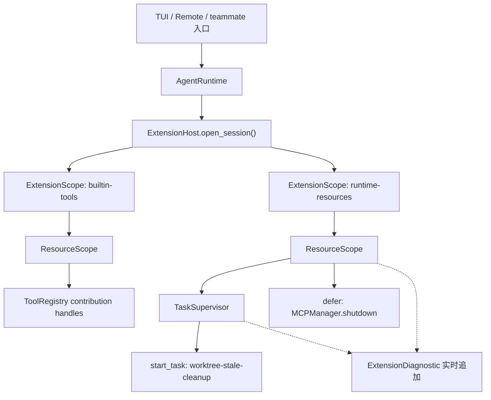

# Koko 阶段 2C 设计：ResourceScope 与 TaskSupervisor

> - 状态：Implemented v1.0，2C0–2C6 已完成并验证（见 §13）
> - 日期：2026-08-17
> - 前置条件：阶段 0 AgentLoop/ToolPipeline、阶段 1 ExtensionHost/AgentRuntime、阶段 2A RunControl、阶段 2B TurnPreparer 均已实施并验证
> - 主路线：[Koko Runtime 迭代设计](./koko-pi-inspired-runtime-design.md)
> - 前身：[ResourceScope 与 TaskSupervisor 候选设计（原阶段 2A 编号）](./koko-extension-resources-stage2a-design.md)
> - 实施方法：设计先行，完整切片实现后补行为验证；不采用 red-green-refactor TDD

## 1. 结论

阶段 2C 只做一件事：

> 让每个 Extension 实例拥有一个真正的 ResourceScope，由它统一撤销贡献、取消并等待扩展后台任务、关闭文件或连接，并把所有清理错误汇总成可观察诊断。

本阶段不迁 Command（2E），不做 EventPipeline（2D），不开放动态扩展发现或 reload（3/4/5）。

这是对阶段 1 已有 `ExtensionSession` seam 的纵向深化，不是再加一层生命周期包装。完成后：

- 扩展不再需要自己保存 cleanup 列表或裸 `asyncio.Task`；
- `MCPManager` 在开始连接前就归属于 Runtime，连接取消或异常不会留下失主 client；
- TUI 的 worktree stale-cleanup 任务由 Runtime 取消**并等待**，不再是"关完 Runtime 再 cancel、且不 await"；
- 一个 cleanup 失败不会阻止剩余资源关闭；
- Runtime 关闭后可以说明哪个 extension 的哪个资源或任务失败、超时或泄漏。



## 2. 当前代码证据：四个所有权缺口

| 缺口 | 位置 | 后果 |
|---|---|---|
| `ExtensionAPI` 只能注册 Tool | `koko_pi_agent/extensions/host.py:56` | 任何非 Tool 资源都无处托管，扩展只能自己攒 cleanup 列表 |
| MCPManager 关闭由三入口各自持有 | `app.py:2234`、`remote.py:414`、`__main__.py:597` | manager 在 Runtime active 之后本地创建（`app.py:2187`、`remote.py:382`、`__main__.py:568`），connect 在赋值前被取消就会留下失主 client |
| TUI stale-cleanup 是裸 task，且关闭顺序相反 | `app.py:1069` 创建；`app.py:2295-2301` 先关 Runtime 再 cancel，且不 await | 任务可能在依赖已关闭后仍被调度；退出路径不保证它真的停了。`app.py:883-892` 是同一序列的第二份拷贝 |
| ExtensionSession 关闭无并发保护 | `host.py:108-117` 只有状态判断 | 并发 `aclose()` 可能重复执行 cleanup。Runtime 层已有 `_close_lock`（`agent_runtime.py:47`），Session 层仍缺 |

另有一处需要在迁移时删除的旧行为：`app.py:2229-2232` 的 `except (asyncio.CancelledError, Exception): pass` 在 TUI 退出路径上吞掉取消信号。

删除测试：如果不做 `ResourceScope`，`ExtensionHost`、`app.py`、`remote.py`、`__main__.py` 与 `mcp/manager.py` 需各自重建 AsyncExitStack、task 列表、取消超时、清理顺序与错误汇总五件事。`mcp/manager.py:44` 的 `_registration_handles` 与 `app.py:812` 的 `_stale_cleanup_task` 就是这种重建的两份现存实例。

## 3. 范围与非目标

范围内：
- `ExtensionAPI` 增加三个激活期资源能力；
- `ResourceScope` 与内部 `TaskSupervisor` 作为 Host 实现；
- 诊断契约扩展与聚合关闭错误；
- 第二个真实 Definition `koko_pi_agent.runtime-resources`；
- 三个入口的 MCP 与 stale-cleanup 所有权迁移；
- `extension_id` 命名统一。

明确非目标：
- Command owner/handle/profile/Skill refresh —— 阶段 2E；
- Observer/Interceptor 与 Hook Adapter，含 `hooks/engine.py:48` 的 `asyncio.ensure_future` —— 阶段 2D；
- `runtime/agent_loop.py:576` 与 `:578` 两个 fire-and-forget task —— 它们的 owner 是 Agent 生命周期而非 extension 生命周期，收进 `start_task()` 会让 ResourceScope 从"扩展所有权"漂移成"进程内 task 统一调度器"，破坏深 Module 定位；
- active 阶段动态资源注册、session replacement、generation 切换 —— 阶段 5 reload 之前不开放；
- 安装包/本地路径发现与信任 —— 阶段 3/4；
- 强制杀死不响应取消的 Python coroutine —— 做不到，只能超时、报告并避免无限阻塞关闭。

不改变：Tool 名称与 Schema、Command 格式、Hook YAML、配置文件、Session JSONL。

## 4. 外部 Interface

调用方仍只认识 `ExtensionHost.open_session()` 与 `AgentRuntime`。`ExtensionAPI` 增加三个方法：

```python
class ExtensionAPI:
    async def acquire(self, name: str, manager: ContextManager[T] | AsyncContextManager[T]) -> T: ...
    def defer(self, name: str, cleanup: Callable[[], object | Awaitable[object]]) -> None: ...
    def start_task(self, name: str, awaitable: Awaitable[None]) -> ExtensionTaskHandle: ...
```

- `acquire()` 始终由调用方 `await`，内部自行识别同步/异步 context manager，避免暴露两套几乎相同的 Interface。
- `defer()` 接纳没有 context-manager Interface 的旧资源，例如现有 `MCPManager.shutdown()`；清理函数可同步或异步。
- `start_task()` 只接纳扩展拥有的长生命周期协程；返回只读 Handle（name / status / done），不暴露原始 `asyncio.Task`。
- 三个方法与 `register_tool()` 共用同一个 activating-only 相位守卫（`host.py:57` 已是此形状）。Session active 后继续禁止动态登记，避免提前引入 stale API 与 reload 语义。
- `ResourceScope` 与 `TaskSupervisor` 是 Host 实现，不作为入口组合根的新参数，也不让扩展直接拿到底层 `AsyncExitStack`。

## 5. 内部 Module 设计

### 5.1 ResourceScope

- 每个 `ExtensionDefinition` 激活实例一个 scope，不跨 extension 共享。
- 内部维护 contribution cleanup、TaskSupervisor、resource cleanup 三类账本；账本项含 name、kind、sequence、extension owner 与 cleanup callable。
- `aclose()` 不在首个错误处停止，而是返回全部 `ExtensionCleanupFailure`；由 `ExtensionSession` 在所有 scope 关闭后统一构造 `ExtensionCloseError`。
- 关闭顺序：**先撤 contribution，再取消并等待 task，最后按 sequence 逆序关闭资源**。能力不可再进入后，后台逻辑才停止，底层连接或文件才释放。
- 第一次 close 无论成功失败都最终进入 closed；重复 close 返回空失败列表，不重复调用 cleanup。

### 5.2 TaskSupervisor

- 只保存通过当前 `ExtensionAPI` 创建的 `asyncio.Task[None]`，任务带 extension_id、name 与内部 sequence。
- done callback 必须读取 `task.exception()`；`CancelledError` 视为正常取消，其他异常追加实时 `task_failed` 诊断。
- shutdown 使用"对所有 active task 调用 cancel → `asyncio.wait(..., timeout=...)` → 消费 done → 标记 pending timeout"，不用可能因协程吞取消而无限延长的逐个 `wait_for()`。
- 超时 task 保留内部引用与 done callback，诊断标记 leaked；Runtime 不声称已强制终止 Python coroutine。
- 后台任务启动不等于 readiness。若 extension 启动依赖连接 ready，installer 必须在返回前显式 await；`start_task()` 之后的异步失败只使 Runtime degraded，不自动触发关闭。

### 5.3 诊断与错误

现有 `ExtensionDiagnostic` 增加兼容默认字段：`kind="extension"`、`name=""`、`phase=""`，保留已有 extension_id / source / status / error 字段与现有构造方式。

新增：
- `ExtensionCleanupFailure(extension_id, source, kind, name, error)`；
- `ExtensionCloseError(failures)`，继承 `RuntimeError`，消息含每项资源名与原因；
- status：`task_failed`、`task_cancel_timeout`、`cleanup_failed`、`resource_leaked`；既有 `activated` / `failed` / `leaked` 保留。

`ExtensionSession.diagnostics` 是生命周期内持续更新的只读 snapshot。`AgentRuntime.diagnostics` 改为每次读取时组合 Session 诊断与 Runtime-local 诊断 —— 当前 `agent_runtime.py:45` 是 open 时快照，后台 task 运行期失败不可见。`_close_lock` 与 `_record_leaked_contributions()` 已在 2A/2B 期间落地，保留不动。

### 5.4 内置资源 Adapter

Catalog 增加第二个真实 Definition：`koko_pi_agent.runtime-resources`，排在 builtin-tools 之后。它从 typed bindings 读取：

- 入口在 Runtime 打开前预创建的 `MCPManager`，用 `api.defer("mcp-manager", manager.shutdown)` 托管关闭；
- TUI 的 `stale_cleanup_factory`，用 `api.start_task("worktree-stale-cleanup", factory())` 托管循环任务。

Definition 本身不连接 MCP；TUI/Remote/teammate 仍在 Runtime active 后调用现有 `register_all_tools()`。差别是 manager 在连接前已经有 owner，即使连接取消或异常也会随 Runtime 回滚或关闭。对没有这些 bindings 的 profile（如 `PROMPT_LEAD`）是 no-op。

## 6. 生命周期与失败语义

1. Host 为每个 extension 创建一个 ResourceScope；API 的 Tool handle、资源、cleanup 与 task 都记在该 scope。
2. installer 成功后 API sealed；失败或取消时先 sealed，再关闭该 extension scope。
3. 正常 Session close 按 extension 激活逆序关闭。
4. 单个 scope 内按 §5.1 的三段顺序执行，防止新工作进入即将关闭的依赖。
5. task 正常完成：读取结果并从 active 集合移除。task 抛错：读取异常并追加 `task_failed` 诊断，不制造 never-retrieved warning，也不自动关闭整个 Runtime。
6. 关闭时取消未完成 task，并在 Host 统一给出的超时内等待；忽略取消者记 `task_cancel_timeout` / `leaked`，继续关闭资源。
7. 单个 cleanup 失败时记录名称、extension、source 与错误，继续清理其他项；全部结束后用一个聚合 `ExtensionCloseError` 向调用方报告，Session/Runtime 状态仍必须是 closed。
8. installer 被取消时必须原样传播 `CancelledError`；回滚错误进入诊断，不得遮蔽取消。`host.py:144-148` 已正确，入口侧 `app.py:2229` 吞取消的旧路径在 2C5 删除。
9. `AgentRuntime.diagnostics` 组合 Session 实时诊断与 Runtime 自己的 leak 诊断，使后台 task 失败在运行期可见。

## 7. 状态与并发不变量

1. `open_session()` 未返回前，Runtime 不可见；资源登记失败按关键 extension 规则回滚。
2. API 仅 activating 可用；active / closing / closed 均拒绝 `acquire` / `defer` / `start_task` / `register_tool`。
3. 同一 Session 的 `aclose()` 幂等；并发 close 由 lock 或单一 close future 汇合，cleanup 只运行一次。
4. Runtime 先拒绝新 Run、取消并等待 active Run，再关闭 ExtensionSession（`agent_runtime.py:120-132` 已实现）。
5. MCP 初始化 task 必须先被入口取消并等待，或本身改由 supervisor 托管，之后才关闭 manager；不允许 connect 与 shutdown 无序并发。
6. cleanup error、task error 与 cancel timeout 都可观察；无 `Task exception was never retrieved`。
7. close 返回或抛出聚合错误后，Session 与 Runtime 都已经是 closed。

## 8. 兼容决策

- `ToolProfile` 更名为 `RuntimeProfile`，保留 `ToolProfile = RuntimeProfile` 兼容别名。改名放在 2C4 而非 2C1：当前 `profile` 的唯一消费者是 `builtins.py` 的 `tool_names_for_profile()`，直到第二个 Definition 出现，它才真正开始控制非 Tool extension。
- `extension_id="mewcode.builtin-tools"`（`builtins.py:339`）统一为 `koko_pi_agent.builtin-tools`，与 `tools/__init__.py:277`、`agents/tool_filter.py:216` 的既有新命名一致。
- MCP Tool 仍由 `MCPManager` 保存 `RegistrationHandle`；2C 只迁移 manager/client 的关闭所有权，不开放 active 阶段的 `ExtensionAPI.register_tool()`。
- `TaskManager`、AgentRun、UI message task、memory extraction 与 Hook event 仍保留原 owner。

## 9. 实施批次（非 TDD）

每批可独立合并与回滚。删除放在最后一批 —— 两条所有权路径并存期间必须能随时回退。

### 2C0 — 基线冻结与 seam 复核

文件：无生产改动。

1. 确认分支、changed-file manifest 与 `696 passed, 1 skipped` 基线。
2. 工作区当前含用户自己的重命名收尾改动（`KOKO.md`、`memory/instructions.py`、`tests/test_agent.py`、`tests/test_memory.py`），保持独立可审计，不覆盖。
3. 重读本文 §4–§7，拒绝任何 Command / Event / reload 范围蔓延。

退出条件：基线与 manifest 已记录。

### 2C1 — `extension_id` 命名统一

文件：`koko_pi_agent/extensions/builtins.py`；如有断言则 `tests/test_extensions.py`、`tests/test_runtime_composition.py`。

1. `mewcode.builtin-tools` → `koko_pi_agent.builtin-tools`。
2. 全仓检索确认无其他 `mewcode.` extension_id 残留。

理由：2C4 会新增第二个 Definition，若不先统一，诊断输出会同时出现旧新两种命名。单独成批是因为它触及诊断字符串与可能的测试断言，需与功能改动分开回滚。

退出条件：目标测试通过；`grep` 无 `mewcode.` extension_id。

### 2C2 — 契约与 ResourceScope 核心

文件：新增 `koko_pi_agent/extensions/resources.py`；修改 `contracts.py`、`__init__.py`；实现后新增 `tests/test_extension_resources.py`。

1. 新增 `ExtensionTaskHandle`、`ExtensionCleanupFailure`、`ExtensionCloseError` 契约与四个新 status。
2. `ExtensionDiagnostic` 增加兼容默认字段。
3. 实现 ResourceScope 与内部 TaskSupervisor：命名账本、分类关闭顺序、取消超时、实时诊断 sink。
4. 实现完成后再写 Interface 级行为测试：acquire/defer/task 的成功、失败、超时、逆序清理、并发与幂等 close、无未读取 task 异常。

理由：先独立建好生命周期 Module，再改 Host 调用方。按用户要求，测试在实现之后。

退出条件：新资源测试通过；Host 与入口行为尚未改变。

### 2C3 — 接入 ExtensionHost / ExtensionAPI / AgentRuntime

文件：`extensions/host.py`、`runtime/agent_runtime.py`、必要时 `runtime/__init__.py`；实现后更新 `tests/test_extensions.py`、`tests/test_runtime_composition.py`。

1. 用 ResourceScope 替换 per-extension 裸 `AsyncExitStack`（`host.py:130`），保持一 Definition 一 scope 与逆序关闭。
2. `ExtensionAPI` 增加三方法，复用与 Tool 注册相同的相位守卫。
3. `ExtensionSession` 增加 close lock 或单一 close 结果；收齐所有 scope 的失败后抛一个 `ExtensionCloseError`。
4. 保留原始启动/取消异常，回滚清理失败只进诊断。
5. `AgentRuntime.diagnostics` 改为组合读取；Session close 抛错时 Runtime 仍为 closed。
6. 实现后补测试：部分激活回滚、取消、清理聚合、两个 Runtime 隔离、实时 task 诊断。

理由：所有激活/回滚/关闭调用方都跨已有 Host/Session seam，任何入口都不应知道 ResourceScope 内部。

退出条件：阶段 1 的 ExtensionHost/Runtime 测试与 2C 资源测试同时通过。

### 2C4 — 真实资源 Definition 与 profile 改名

文件：`extensions/builtins.py`、`extensions/contracts.py`；实现后更新 `tests/test_runtime_composition.py`。

1. `BuiltinRuntimeBindings` 增加可选 `mcp_manager` 与 `stale_cleanup_factory`。
2. 新增 `koko_pi_agent.runtime-resources` 作为 catalog 第二个生产 Definition，排在 builtin-tools 之后。
3. 用 `defer` 托管 MCPManager 关闭；用 `start_task` 启动 TUI stale cleanup。
4. `ToolProfile` → `RuntimeProfile`，保留兼容别名；四个入口逐步改用新名称。
5. 对缺少这些 bindings 的 profile 保持 no-op；不启动连接，不改 Tool profile。
6. 实现后通过 Host/Runtime Interface 测试 profile 激活、owner 诊断、任务取消与逆序。

理由：两个真实 Adapter 证明 ResourceScope 不是假想，同时把连接与 worktree 业务逻辑留在 Host 之外。此时 profile 才真正控制非 Tool extension，改名有依据。

退出条件：真实内置 Runtime 打开与关闭后无资源或任务残留。

### 2C5 — 入口所有权迁移

文件：`app.py`、`remote.py`、`__main__.py` 外部 teammate 路径；必要时 `mcp/manager.py` 仅做幂等/诊断兼容；实现后更新 `tests/test_tui_runtime_adapter.py`、`tests/test_remote_runtime_adapter.py`、`tests/test_teammate_registry.py`、`tests/test_mcp.py`。

1. 在 `AgentRuntime.open()` 之前构造 MCPManager、load configs，并通过 typed bindings 传入（TUI / Remote / 外部 teammate）。
2. 现有 async connect 函数复用该 manager；Runtime 激活后不再创建无主的本地 manager。
3. TUI 仍在 Runtime 关闭前取消并等待 App 持有的 MCP 初始化 task，但去掉 `app.py:2229` 吞 `CancelledError` 的写法；随后由 ResourceScope 关闭 manager/clients 并移除动态 Tool handle。
4. 从入口 finally 块移除直接 manager shutdown，Runtime 关闭后清理兼容引用。
5. TUI stale-cleanup 协程创建移入 `stale_cleanup_factory`；删除 `_stale_cleanup_task` 字段与两处 cancel 路径（`app.py:887`、`app.py:2298`）。
6. 保持 prompt 行为（不绑定 MCP/stale 资源）、Remote 命令行为与 teammate 取消语义。
7. 实现后验证 provider 切换、connect 取消、关闭顺序、恰好一次关闭、无残留 task 或 client。

理由：所有权在易失败的连接工作之前建立，关掉当前"connect 在赋值前被取消则 manager 失主"的泄漏窗口。

退出条件：四个 profile 与所有迁移后的入口生命周期测试通过。

### 2C6 — 加固、删除与全量验证

文件：测试与文档，加上被 ResourceScope 取代的过时入口清理代码；无新能力。

1. 删除无用的裸 `AsyncExitStack` 接线、直接 MCP shutdown 与 stale task 所有权路径。
2. 只在尚未覆盖处补边界测试：被吞掉的取消超时、同时 close、task error 之后再 cleanup error、Runtime A 关闭不影响 B。
3. 运行 §10 全部验证门。
4. 把实际结果与偏差同步回本文、主路线与 planning 证据。

退出条件：无入口直接持有 MCP shutdown 或 stale-cleanup task；全部验证门通过。

## 10. 验证矩阵

目标测试（`test_extension_resources.py` 为 2C 新增，其余 9 个已存在）：

```bash
.venv/bin/pytest tests/test_extension_resources.py tests/test_extensions.py \
  tests/test_runtime_composition.py tests/test_tui_runtime_adapter.py \
  tests/test_remote_runtime_adapter.py tests/test_teammate_registry.py \
  tests/test_mcp.py tests/test_agent_runtime.py tests/test_tool_pipeline.py \
  tests/test_agent.py -q
```

全量与静态门：

```bash
.venv/bin/pytest -q
.venv/bin/python -m compileall -q koko_pi_agent tests
git diff --check
```

基线 `696 passed, 1 skipped`。环境约束沿用 2A/2B 已记录结论：`uv run` 读取默认 uv cache 被 filesystem policy 拒绝，改用仓库 `.venv/bin/`；`.venv` 与 PATH 均无 Ruff，如实记录不声称通过。

结构门：

| 门 | 期望 |
|---|---|
| `ExtensionAPI` 方法集 | 只有 `register_tool` / `acquire` / `defer` / `start_task` + `context`；无 Command / Event / reload |
| 入口直接调 `MCPManager.shutdown()` | 0 处 |
| TUI `_stale_cleanup_task` 字段与 cancel 路径 | 0 处 |
| per-extension cleanup 实现 | 只有 `ResourceScope`，无残留裸 `AsyncExitStack` |
| `extension_id` 含 `mewcode.` | 0 处 |
| `agent_loop.py:576` 与 `:578` 裸 `create_task` | **仍在**（2C 非目标，不得声称已修） |
| `hooks/engine.py:48` `ensure_future` | **仍在**（推迟 2D，不得声称已修） |

最后两条是反向门：它们的存在是本阶段的正确结果，用于防止把范围外的改动混进 2C 后误报为完成。

## 11. 与原候选设计的差异

原候选设计写于 2026-08-16，早于 2A/2B 实施与项目重命名。复核后的实质修订：

| 项 | 原设计 | 本文 | 理由 |
|---|---|---|---|
| 编号 | 2A0–2A5（6 批） | 2C0–2C6（7 批） | 主路线已改序；拆出独立的命名统一批次 |
| diagnostics 工作量 | "不再只是 open 时快照"，含关闭语义 | 收窄为只改 `agent_runtime.py:45` | `_close_lock` 与 `_record_leaked_contributions` 已在 2A/2B 落地 |
| `aclose()` 幂等 | Session 与 Runtime 都要补 | 只补 Session 层 | Runtime 层已有 `_close_lock` |
| `RuntimeProfile` 改名 | 契约批次（2A1） | 真实 Definition 批次（2C4） | 当前 profile 唯一消费者是 `tool_names_for_profile()`，改名在 2C1 会名不副实 |
| `extension_id` 命名 | 未涉及 | 新增 2C1 批次 | 重命名未收尾，`builtins.py:339` 仍是 `mewcode.builtin-tools` |
| `agent_loop` 裸 task | 不存在 | 明确列为非目标 + 反向结构门 | 2B 之后新增；owner 是 Agent 生命周期，不属 extension 所有权 |
| 路径 | `mewcode/*` | `koko_pi_agent/*` | 包已重命名 |
| TUI 关闭顺序 | 仅作为理论排序要求 | 补充为真实缺陷证据（§2） | `app.py:2295-2301` 顺序与不变量 #4 相反且不 await |

原候选设计的 Interface、四个内部 Module 划分、9 条生命周期语义中的 8 条与 7 条不变量中的 6 条，均无需修订。

## 12. 实施结果

七个批次全部完成。基线为 HEAD `a3edb90` 的 `4 failed, 692 passed, 1 skipped`；那 4 个失败是 `a3edb90` 删除 `agents/builtins/` 的继承失败，与本阶段无关，作为归因基准。

| 批次 | 实际交付 | 目标测试 |
|---|---|---|
| 2C1 | `extension_id` 统一（2 处生产 + 6 处测试断言） | 60 passed |
| 2C2 | 新增 `extensions/resources.py`；`contracts.py` 加 4 个契约 | 15 passed |
| 2C3 | API 三方法、Host 换用 ResourceScope、Session close lock、Runtime 组合诊断 | 70 passed |
| 2C4 | `runtime-resources` Definition、`RuntimeProfile` 改名 | 17 passed |
| 2C5 | TUI / Remote / teammate 三入口迁移 | 54 passed |
| 2C6 | 结构门与边界测试 | 全量 |

最终验证：全量 `4 failed, 716 passed, 1 skipped, 1 warning`，失败集合恰好等于基线的 4 个，本阶段零新增失败；新增 24 个测试；`compileall` 与 `git diff --check` 通过。Ruff 在当前环境未安装，未运行，不声称通过。

### 12.1 实施中修正的设计遗漏

**并发 close 会把 cleanup 跑两遍。** 第一版 `ResourceScope.aclose()` 只在入口检查 `state == "closed"`，并发的第二个调用看到 `"closing"` 便继续执行。清理过程含 await 点，必须加 `asyncio.Lock` —— §7 不变量 3 本来就要求"由 lock 或单一 close future 汇合"，是实现漏了，测试直接抓到 `['cleanup', 'cleanup']`。

**去掉吞取消的写法不等于删掉 `except CancelledError`。** 等待一个刚被自己 `cancel()` 的 task，`await` 必然抛 `CancelledError`。正确做法是检查 `task.cancelled()` 区分"我们发起的取消"与"当前协程被取消"，后者继续传播。TUI 的 `_shutdown_mcp` 因此改名为 `_stop_mcp_initialization`：它现在只负责让连接任务落地，不再关闭 manager。

### 12.2 对外可见的契约变更

`RemoteServer._shutdown()` 的关闭顺序由 `["mcp", "runtime", "session"]` 变为 `["runtime", "session"]`，MCP manager 的关闭迁入 Runtime 的 ResourceScope。`tests/test_remote_runtime_adapter.py::test_remote_shutdown_is_ordered_and_idempotent` 的断言随之更新 —— 这是本阶段的预期结果，不是回归。

### 12.3 结构门实测

§10 的 5 个正向门全部为 0 处残留；2 个反向门（`agent_loop.py:576/578` 裸 task、`hooks/engine.py:48` `ensure_future`）确认仍在，未被本阶段误改。

## 13. 后续阶段

| 能力 | 阶段 |
|---|---|
| Observer / Interceptor / Hook Adapter | 2D |
| Command contribution 所有权 | 2E |
| Python 安装包扩展发现 | 3 |
| 本地路径与项目信任 | 4 |
| 候选会话与安全重载 | 5 |
