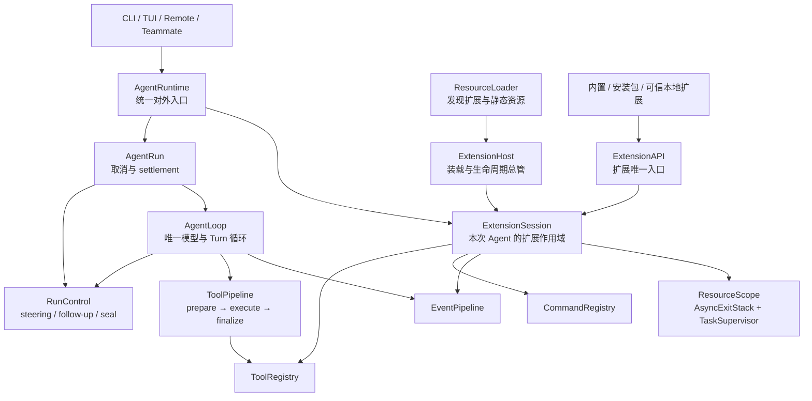
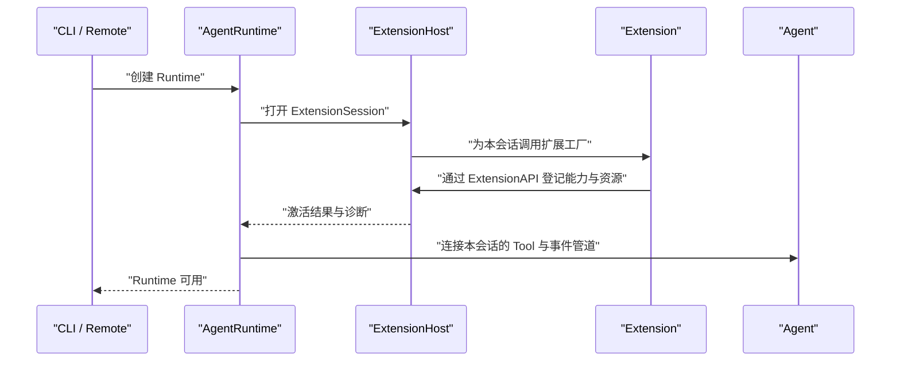
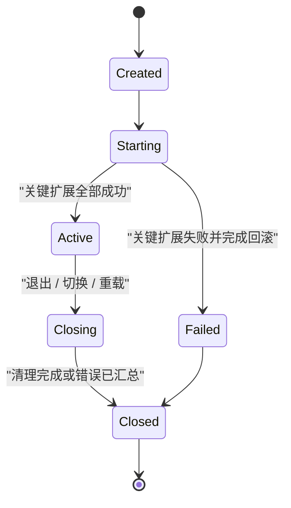
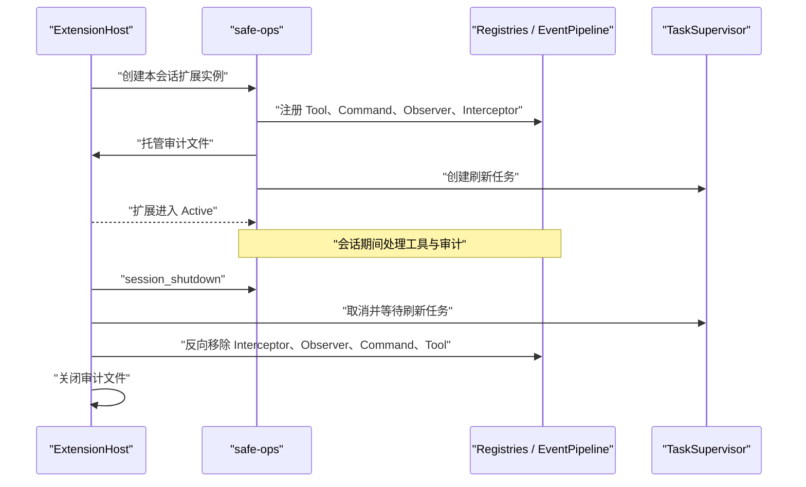

# Koko Runtime 迭代设计：参考 Pi，而不是实现 Mini Pi

> - 状态：Design v0.9，阶段 0/1/2A/2B/2C 已实施并通过全量验证
> - 日期：2026-08-16
> - 目标主体：当前 Koko 0.2.0 项目，Python 3.11+
> - 当前阶段：阶段 0/1/2A/2B/2C 均已实施并验证；下一阶段候选为 2D 事件管线或 2E Command 所有权
> - 核心取向：在现有 Koko 上迭代 Runtime，参考 Pi 的分层与扩展机制，并用 Python 的资源管理机制保证可靠清理
> - 明确边界：不是另起炉灶实现一个 Mini Pi，也不是把 Koko 改名或复刻成 Pi

关联阅读：

- [Mini Plugin Agent：面向 Python 新手的插件化编程学习设计](./plugin-agent-learning-design.md)
- [从 Cordis 的时空可组合性到 Python 插件运行时](./cordis-python-async-learning-guide.md)
- [阶段 0：统一 Agent Loop 与 Tool Execution Pipeline](./koko-agent-loop-stage0-design.md)
- [阶段 1：ExtensionHost 内置 Tool 纵向切片](./koko-extension-host-stage1-design.md)
- [阶段 2A：AgentRun 控制面与运行中输入](./koko-agent-run-control-stage2a-design.md)
- [阶段 2C：ResourceScope 与 TaskSupervisor](./koko-extension-resources-stage2c-design.md)
- [ResourceScope 原候选设计（已被 2C 复核版取代）](./koko-extension-resources-stage2a-design.md)
- [Pi 官方仓库](https://github.com/earendil-works/pi)
- [Pi Chapter 1：Core、Agent 与 Harness](https://books.antinomie.org/pi/chapter/01)
- [Pi Chapter 2：一次 Prompt 的完整路径](https://books.antinomie.org/pi/chapter/02)
- [Pi Extensions 官方文档](https://github.com/earendil-works/pi/blob/main/packages/coding-agent/docs/extensions.md)
- [Pi SDK 官方文档](https://github.com/earendil-works/pi/blob/main/packages/coding-agent/docs/sdk.md)
- [Pi Agent Loop 讲解](https://dg-ai-notes.pages.dev/modules/ch03-agent-loop/)
- [Pi 官方 Agent Loop 源码](https://github.com/earendil-works/pi/blob/main/packages/agent/src/agent-loop.ts)

## 1. 先说结论：主体是 Koko

这份设计的主体始终是当前 Koko。Pi 是架构参考和对照样本，不是要交付的新产品。

Koko 不需要重写成 Cordis，也不需要重新实现一个 Pi 或 Agent Loop。

更合适的方向是：

> 保留当前 Koko 的 Agent、Tool、Command、Hook、Skill、Team 和 Remote 行为；先把分叉的运行路径收敛成唯一 `AgentLoop`、`ToolPipeline` 和 `AgentRun`，再由 `AgentRuntime` 与 `ExtensionHost` 统一装配和管理扩展生命周期。

用通俗的话说：

- 当前 Agent 行为继续保留，但 `run()` 与 `run_to_completion()` 共享同一个 `AgentLoop`，不再维护两台发动机；
- `ToolPipeline` 是唯一工具通道，统一参数校验、权限、Hook、并发、截断保护和结果排序；
- `AgentRun` 负责单 active run、取消、最终事件和 settlement；
- `AgentRuntime` 负责把发动机、工具、命令、Hook、Skill 和会话装成一辆完整的车；
- `ExtensionHost` 是改装管理处，所有改装都必须登记；
- `ExtensionAPI` 是给扩展使用的服务窗口，扩展不能随意摸内部零件；
- `AsyncExitStack` 是撤场清单，退出时按照相反顺序逐项清理；
- 每个 Agent 都有自己的 `ExtensionSession`，避免主 Agent、队友 Agent 和测试实例相互串状态。

最终目标不是“文件都叫插件”，而是做到六件可验证的事情：

1. 生产代码只有一个模型 → Tool → 模型循环和一个 Tool 执行管线。
2. 截断 Tool Call、取消和非并发安全 Tool 有明确且可测试的安全语义。
3. 新能力可以在不修改 Agent Loop 的前提下接入。
4. 能力由谁注册、何时生效、何时撤销都可以追踪。
5. CLI、Remote 和队友 Agent 使用同一套运行和装配逻辑。
6. 一个扩展启动失败或会话结束后，不留下工具、监听器、后台任务和连接。

### 1.1 “核心职责收窄”不等于 Mini

Pi 的设计有时会被概括为“small core”。这里的 small 指核心承担的职责少、变化原因少，不是功能少、代码玩具化或另做一个缩小版 Pi。

放到 Koko 中，更准确的翻译是“稳定核心 + 可扩展 Runtime”：

| 保留的行为 | 收拢为稳定深模块 | 明确不会删除 |
| --- | --- | --- |
| 模型流式调用与响应收集 | `AgentLoop` 与 `AgentRun` | Team 与多 Agent 能力 |
| model → tool → model 行为 | `ToolPipeline` | CLI 与 Remote 两种使用方式 |
| 工具调用、重试、压缩等已验证行为 | Tool、Command、Hook、Skill 的装配 | 当前 Provider、Permission 与 MCP 接入 |
| 当前用户配置和会话格式 | 扩展发现、所有权和 Session 级清理 | Skill、Memory 与 Worktree 能力 |

所以，“核心职责收窄”描述的是代码职责边界，不是产品功能降级。Koko 的功能继续保留，只让变化频繁的装配与扩展逻辑不再散落进 Agent 和多个入口。

## 2. 为什么现在适合这样设计

### 2.1 Koko 已经具备的基础

当前仓库已经有不少 Pi 风格的基础能力：

| 已有能力 | 当前位置 | 可以保留的价值 |
| --- | --- | --- |
| Agent Loop | `koko_pi_agent/agent.py` | 模型、工具、重试、压缩和事件循环已经存在，不应重写 |
| Tool 注册表 | `koko_pi_agent/tools/__init__.py` | 已经把 Agent 与具体工具列表分开 |
| Command 注册表 | `koko_pi_agent/commands/registry.py` | 已有命令和别名冲突检查 |
| Hook 引擎 | `koko_pi_agent/hooks/engine.py` | 已有观察事件和工具前置拦截的雏形 |
| Skill Loader | `koko_pi_agent/skills/loader.py` | 已有全局、项目和内置资源的加载顺序 |
| Markdown Command Loader | `koko_pi_agent/commands/loader.py` | 已有声明式命令发现能力 |
| CLI、Remote、队友模式 | `koko_pi_agent/__main__.py`、`koko_pi_agent/remote.py` | 已有多个入口，正好能检验统一 Runtime 是否有效 |

所以这次设计的性质是“收拢和加固”，不是“推倒重来”。

### 2.2 当前最值得解决的八个问题

| 问题 | 当前表现 | 设计后应达到的状态 |
| --- | --- | --- |
| 装配分散 | CLI、Remote、队友分别手工注册工具 | 一个组合根产生一致的 Runtime |
| 所有权不清 | 注册表知道对象，不知道来自哪个扩展 | 每项贡献都带扩展 ID 和来源 |
| Tool 冲突静默 | 同名 Tool 会被后注册对象覆盖 | 默认立即报错，不依赖加载顺序猜结果 |
| 清理不完整 | 注册之后缺少统一注销路径 | 每项注册自动进入扩展自己的清理栈 |
| 后台任务无托管 | 部分 Hook 使用未跟踪的异步任务 | Runtime 统一创建、取消、等待并报告任务错误 |
| 生命周期叫法混淆 | 当前一次 `Agent.run()` 也会触发 `session_start/end` | 明确区分持久会话、一次 Agent 运行和一次模型轮次 |
| Loop 双轨 | `run()` 与 `run_to_completion()` 分别实现循环 | Streaming 与 Headless 只是同一 AgentRun 的不同 Adapter |
| Tool 安全语义分叉 | streaming 期间抢跑、Hook 路径不一致、并发声明未进入主执行路径 | 完整消息后统一 prepare → execute → finalize |

### 2.3 现有学习 Demo 不属于产品主线

工作区中的 `examples/mini_pi_agent/` 演示了最小的“模型 → 工具 → 模型”循环。它只能作为学习材料，不能成为当前 Koko 迭代的产品架构、命名来源或实现基线。

二者关系如下：

| 独立学习 Demo | 当前 Koko 迭代 |
| --- | --- |
| 证明最小循环怎样工作 | 改善真实 Koko 的扩展、装配和资源回收 |
| 使用 Fake LLM，强调确定性 | 复用 Koko 已有模型与流式执行 |
| 一个 ToolRegistry | 每个 Agent Runtime 拥有隔离的注册表和扩展会话 |
| 不处理外部插件 | 逐阶段加入内置扩展、安装包扩展和可信本地扩展 |
| 不处理热重载 | 先设计安全的关闭与替换，再考虑热重载 |

## 3. 目标、成功标准与非目标

### 3.1 目标

第一条主线是运行正确性：

- 交互、Remote、Skill 和子 Agent 共享一个 AgentLoop；
- 所有 Tool Call 共享一个 ToolPipeline；
- truncated Assistant Message 不产生 Tool 外部副作用；
- active run、取消和 settlement 由 AgentRun 统一管理。

第二条主线是扩展性：

- Tool、Command 和事件处理器通过同一种扩展入口注册；
- 新增扩展不修改 `Agent.run()`；
- CLI、Remote、主 Agent 和队友 Agent 可以选择不同扩展集合；
- 安装后的 Python 包可以通过标准入口点被发现。

第三条主线是生命周期：

- 每个扩展实例有独立资源账本；
- 注册、任务、文件、网络连接等资源都有对应清理动作；
- 启动到一半失败时，只回滚该扩展已经完成的动作；
- 关闭时先停止后加载的扩展，并继续执行剩余清理，即使某项清理失败。

第四条主线是可诊断性：

- 冲突错误同时显示能力名称、原所有者和新所有者；
- 加载结果区分成功、跳过、隔离失败和致命失败；
- 能列出当前会话中每个 Tool、Command 和事件处理器的来源；
- 后台任务异常不会变成无人读取的异步异常。

### 3.2 可验收的完成标准

当完整路线完成时，应能验证：

- 生产代码只有一个 Agent Loop 和一个 Tool Pipeline；
- interactive 与 headless 对相同脚本响应形成相同 Conversation；
- `max_tokens` 携带 Tool Call 时，Tool 副作用计数为零；
- 取消后没有 Run-owned task 残留；
- 在不改 Agent Loop 的情况下，安装一个扩展后出现新 Tool 和新 Command；
- 关闭一个 Agent Runtime 后，其全部注册和任务都消失；
- 同一进程中的主 Agent 与队友 Agent 可以拥有不同工具集；
- CLI 与 Remote 在相同配置下得到相同的内置工具清单；
- 同名能力默认失败，并能指出双方来源；
- 外部扩展加载失败不会留下半注册状态；
- 项目本地 Python 扩展在未经信任时绝不导入；
- 重载失败时旧 Runtime 仍可继续使用；
- 现有 Agent、Command、Hook、Skill 和团队相关回归测试保持通过。

### 3.3 当前明确不做

- 不把所有 Python 对象都包装成插件。
- 不重写 Koko 的 Agent 行为；阶段 0 通过测试保护现有行为，再抽取唯一 Loop Implementation。
- 不新建另一个 Mini Pi 产品或平行运行框架。
- 不在第一阶段实现 Cordis 的通用 Service、Inject 和依赖图协调器。
- 不在第一阶段支持热重载。
- 不把 Python 模块导入误称为安全沙箱。
- 不承诺隔离恶意扩展；扩展代码与 Koko 进程拥有相同系统权限。
- 不引入数据库会话、分布式任务队列或跨进程事件总线。
- 不把 TUI、Remote UI 和协议客户端同时重构。
- 不在本轮创建或修改生产实现与测试代码。

## 4. 总体架构

这里有两个不同层级，不能混为一谈：

1. `ExtensionHost` 属于进程层，保存扩展说明和工厂，本身不保存某个 Agent 的业务状态。
2. `ExtensionSession` 属于 Agent Runtime 层，每创建一个主 Agent 或队友 Agent，就创建一份独立会话。

这让多 Agent 隔离成为默认行为，而不是以后再补的特殊情况。

## 5. 深模块设计

### 5.0 `AgentLoop`、`ToolPipeline` 与 `AgentRun`：Runtime 地基

在进入扩展装配前，先形成三个稳定能力：

| Module | 小 Interface | 隐藏的 Implementation |
| --- | --- | --- |
| `AgentLoop` | 运行一个 RunRequest，向 EventSink 发事件并返回 RunResult | 模型流、Turn 循环、重试、消息回写和停止判断 |
| `ToolPipeline` | 执行一个完整 Tool Batch | 查找、校验、Hook、Permission、Approval、并发、截断保护、spill、budget、排序和 terminate |
| `AgentRun` | `steer()`、`follow_up()`、`cancel()`、`wait_until_idle()`、只读状态 | active-run、RunControl、最终事件和 settlement |

TUI、Remote、Headless、Skill 和 Sub-agent 是这些 Interface 的 Adapter，不再拥有自己的 Loop Implementation。

详细不变量、时序、Interface 草案和 0A–0F 迁移计划见[阶段 0 设计](./koko-agent-loop-stage0-design.md)。

### 5.0A `RunControl`：AgentRun 的运行中输入控制面

阶段 0 统一了 Loop，但没有定义 active run 收到新用户输入时的产品语义。阶段 2A 在不创建第二个 Loop 的前提下增加一个内部 `RunControl`：

- steering 在当前完整 Turn 后投递；
- follow-up 只在 Loop 原本自然停止时投递；
- cancel、terminate、max turns 和 failure 不消费 queued input；
- AgentLoop 是 active run 期间把 queued input 写入 Conversation 的唯一 owner；
- TUI、Remote 与直接 AgentRun 调用共享同一个 Interface。

完整 Interface、状态机、竞态处理、Adapter 协议和非 TDD 实施步骤见[阶段 2A 详细设计](./koko-agent-run-control-stage2a-design.md)。

### 5.1 `AgentRuntime`：应用看到的统一入口

`AgentRuntime` 是 CLI、Remote 和队友模式共同依赖的 Module。

它对外负责：

- 接收一次用户运行请求；
- 暴露命令分发能力；
- 提供当前 Runtime 的只读诊断信息；
- 停止进行中的工作；
- 关闭 Runtime 并等待全部资源清理。

它内部隐藏：

- Agent 如何创建；
- Tool、Command、Hook 和 Skill 如何装配；
- TeamManager、TaskManager 和 WorktreeManager 如何接线；
- 扩展会话何时激活和关闭；
- CLI 与 Remote 当前重复的注册步骤。

目标 Interface 应保持很小：创建、运行、停止、关闭、读取诊断。初始迁移期可以暂时保留对底层 Agent 的只读访问，但它是迁移接缝，不是长期扩展接口。

### 5.2 `ExtensionHost`：扩展总管

`ExtensionHost` 是本设计中最重要的深模块。

它只向调用方暴露少量操作：

- 建立扩展目录；
- 为一个 Agent Runtime 打开扩展会话；
- 返回加载诊断；
- 关闭或替换扩展会话。

它内部承担较多复杂性：

- 扩展排序；
- 扩展 ID 唯一性；
- 启动失败回滚；
- 资源所有权记录；
- 反向清理；
- 任务取消和等待；
- 冲突诊断；
- Runtime 批次号；
- 未来的重载切换。

这符合“深模块”原则：外部接口小，内部吸收的复杂度大。

### 5.3 `ExtensionCatalog`：可加载扩展的菜单

`ExtensionCatalog` 保存的是扩展说明，不是已经运行的扩展对象。

每条说明至少包含：

| 字段 | 含义 |
| --- | --- |
| 扩展 ID | 稳定、唯一、可用于启用或禁用的名字 |
| 显示名称 | 给用户看的名称 |
| 来源 | 内置、安装包、用户路径、项目路径或命令行路径 |
| 版本 | 用于诊断和兼容性判断 |
| 工厂 | 每次打开扩展会话时创建新实例的入口 |
| 是否关键 | 启动失败时是终止 Runtime，还是隔离该扩展后继续 |

“目录”和“会话”分开非常重要。同一个扩展工厂可以为主 Agent 和两个队友 Agent 各创建一次实例，它们不会共享清理栈和可变状态。

### 5.4 `ExtensionSession`：一次实际营业

`ExtensionSession` 表示一个扩展集合已经挂载到某个 Agent Runtime。

它拥有：

- 独立 ToolRegistry；
- 独立 CommandRegistry；
- 独立事件管道；
- 每个扩展自己的 ResourceScope；
- 当前 Runtime 批次号；
- 加载与运行诊断。

它不负责：

- 模型推理；
- 对话历史持久化；
- 工具业务实现；
- 全局依赖注入。

### 5.5 `ExtensionAPI`：扩展唯一可以使用的窗口

扩展作者不应该拿到 `AgentRuntime` 的全部内部对象。公开 Interface 只提供必要能力：

| 能力 | 用途 | 返回结果 |
| --- | --- | --- |
| 注册 Tool | 给模型增加可调用能力 | 可提前关闭的 RegistrationHandle |
| 注册 Command | 给用户增加命令 | 可提前关闭的 RegistrationHandle |
| 订阅观察事件 | 记录日志、指标或状态 | 可提前关闭的 RegistrationHandle |
| 注册拦截器 | 审核或修改受控流程 | 可提前关闭的 RegistrationHandle |
| 托管异步上下文 | 管理连接、文件或客户端 | 返回进入后的资源对象 |
| 登记清理动作 | 托管没有上下文管理器的旧式资源 | 无需扩展自行维护全局列表 |
| 创建后台任务 | 启动可被追踪和取消的协程 | 返回只读任务句柄 |
| 读取会话信息 | 读取工作目录、模式和会话 ID | 只读 SessionContext |

所有注册都会被自动加入当前扩展的 ResourceScope。扩展即使忘记主动关闭 Handle，会话结束时也会统一清理。

### 5.6 `ResourceScope`：Python 版 Effect 账本

每个扩展实例拥有一个 `ResourceScope`，底层使用 `contextlib.AsyncExitStack`。

它提供三层保证：

1. 扩展启动到一半报错，已经登记的动作立即反向撤销。
2. 正常关闭时，一个扩展内部按照资源获得的相反顺序清理。
3. 整个会话关闭时，扩展按照激活顺序的相反方向关闭。

清理失败不能阻止剩余资源继续清理。最后由 Runtime 汇总错误，报告“哪些资源未能正常关闭”。

### 5.7 `TaskSupervisor`：后台任务的监护人

扩展不能把原始 `asyncio.create_task()` 当作推荐接口。它应通过 ExtensionAPI 创建任务。

TaskSupervisor 负责：

- 给任务附加扩展 ID 和可读名称；
- 读取完成任务的异常；
- 会话关闭时取消仍在运行的任务；
- 在限定时间内等待任务响应取消；
- 报告忽略取消、长期不退出的任务；
- 防止会话关闭后继续创建新任务。

Python 3.11 的 `TaskGroup` 适合“一个代码块内共同成功或失败”的并发；扩展后台任务的生命周期可能跨越多个 Agent 轮次，因此需要由 Runtime 长期持有的 TaskSupervisor，不能只套一个临时 TaskGroup。

### 5.8 `ResourceLoader`：发现，不负责运行

ResourceLoader 只把不同来源转换为统一的扩展说明和静态资源说明，不直接注册 Tool，也不启动后台任务。

规划中的发现顺序：

1. Koko 内置扩展；
2. Python 安装包入口点；
3. 用户显式配置的本地路径；
4. 已信任项目的 `.koko/extensions/`；
5. 命令行临时指定的扩展路径。

外部 Python 包优先采用标准库 `importlib.metadata.entry_points()`，入口点组名规划为 `koko_pi_agent.extensions`。这样扩展可以正常打包、安装、查询版本和卸载，不需要 Koko 手写一套包管理器。

## 6. 生命周期语义

### 6.1 三个时间尺度

当前设计明确区分：

| 时间尺度 | 通俗解释 | 开始 | 结束 |
| --- | --- | --- | --- |
| Session | 打开一家店，可能服务很多位顾客 | Agent Runtime 激活 | 新建、切换、重载或退出 |
| Agent Run | 接待一位顾客的一次完整请求 | 用户提交 Prompt | Agent 不再自动重试或继续 |
| Turn | 顾客与模型的一轮交互 | 调用一次模型前 | 该次模型响应和工具结果处理完 |

因此，当前 Agent Loop 中的一次 `run()` 不应长期继续叫 `session_start/end`。目标语义是：

- `session_started` 和 `session_shutdown` 由 AgentRuntime 触发；
- `agent_started` 和 `agent_ended` 包围一次用户请求；
- `turn_started` 和 `turn_ended` 包围一次模型响应及其工具执行。

### 6.2 启动顺序

一个扩展激活失败时：

- 先反向清理该扩展已登记的资源；
- 内置关键扩展失败时，终止 Runtime 创建；
- 外部非关键扩展失败时，将它标记为隔离失败，默认允许 Runtime 带诊断继续启动；
- 严格模式下，任何显式启用的扩展失败都终止启动，供 CI 和测试使用。

### 6.3 关闭顺序

关闭设计遵循以下顺序：

1. Runtime 进入 closing 状态，拒绝新 Prompt、新 Tool 调用和新任务。
2. 向扩展发送 `session_shutdown`，让它保存必要状态。
3. 按扩展激活顺序的相反方向关闭 ResourceScope。
4. 每个 ResourceScope 内部按登记顺序的相反方向注销能力、取消任务并关闭资源。
5. 汇总清理错误，确认没有仍受 Runtime 管理的任务。
6. Runtime 进入 closed 状态，重复关闭保持无副作用。

### 6.4 启动、运行和关闭状态

## 7. 事件模型：观察与拦截分开

不设计一个含义模糊的万能 `emit()`。事件处理分成两类。

### 7.1 Observer：只观察

Observer 用于日志、指标、状态栏和审计。

规则：

- 不修改事件数据；
- 不决定主流程是否继续；
- 一个 Observer 失败时记录诊断，其他 Observer 和主流程继续；
- 默认按扩展加载顺序运行；
- 慢 Observer 必须有可观测耗时，不能悄悄拖慢 Agent。

适合的事件包括：Runtime 启动、Agent 开始、Turn 完成、Tool 完成、Session 关闭。

### 7.2 Interceptor：允许阻止或转换

Interceptor 用于权限、上下文加工和工具结果规范化。

规则：

- 严格串行执行，后一项接收前一项处理后的值；
- 顺序由显式优先级和扩展 ID 稳定决定；
- 返回结果只能是该拦截点定义的有限决策类型；
- 拦截器异常采用安全失败：工具执行前的权限拦截异常时，不执行工具；
- 每个拦截点单独定义合并规则，不使用“随便返回一个字典”的约定。

第一批值得支持的拦截点：

| 拦截点 | 可以做什么 | 不可以做什么 |
| --- | --- | --- |
| Prompt 进入前 | 拒绝、规范化或转换用户输入 | 直接修改历史文件 |
| 模型请求前 | 增加受控上下文或调整本轮系统提示 | 偷偷替换整个 Runtime |
| Tool 调用前 | 允许、拒绝或要求批准 | 绕过 PermissionChecker 直接执行 |
| Tool 结果后 | 清理、截断或标注结果 | 改变已执行的外部事实 |

### 7.3 与现有 HookEngine 的关系

现有 HookEngine 不立即删除，而是通过 Adapter 接入事件管道：

- 普通 Hook 映射为 Observer；
- `pre_tool_use` 的 reject 语义映射为 Tool 调用前 Interceptor；
- 现有 YAML 配置格式第一阶段保持兼容；
- 未跟踪的异步 Hook 逐步迁移到 TaskSupervisor。

这个 Adapter 是真实 Seam，因为旧 HookEngine 和未来 Python 扩展是两种实际存在的实现来源。

## 8. 注册、冲突与所有权

### 8.1 所有贡献必须带来源

Registry 中每条记录从“名称 → 对象”升级为“名称 → Contribution”。Contribution 至少包含：

- 名称；
- 类型，例如 Tool 或 Command；
- 实现对象；
- 扩展 ID；
- 来源位置；
- 注册序号；
- 当前 Runtime 批次号。

这使报错、列举和清理都能根据事实进行。

### 8.2 默认冲突策略

第一版采用确定性规则：

- 同名 Tool 直接失败；
- Command 名称与别名发生冲突时直接失败；
- 事件处理器允许多个并存；
- 扩展不能通过自己声明 `replace=True` 获得覆盖其他扩展的权限；
- 将来如需替换内置能力，由用户配置精确授权“哪个扩展可以替换哪个名字”。

这样可以避免“最后加载者获胜”带来的隐蔽行为和供应链风险。

### 8.3 RegistrationHandle

每次成功注册都返回一个幂等 Handle：

- 扩展可以在会话中途主动关闭它；
- ExtensionSession 关闭时会自动关闭仍然有效的 Handle；
- Handle 只能撤销自己拥有的那条 Contribution；
- 旧 Runtime 的 Handle 不能删除新 Runtime 中的同名能力。

最后一条由“对象身份 + Runtime 批次号”共同保证。

## 9. 配置与安全边界

### 9.1 规划中的配置字段

| 字段 | 类型 | 默认值 | 用途 |
| --- | --- | --- | --- |
| `extensions.enabled` | 扩展 ID 列表 | 仅内置默认集 | 明确启用哪些扩展 |
| `extensions.disabled` | 扩展 ID 列表 | 空 | 从默认集中排除扩展 |
| `extensions.paths` | 路径列表 | 空 | 显式加载本地开发扩展 |
| `extensions.failure_policy` | `warn` 或 `strict` | `warn` | 外部扩展失败时继续还是终止 |
| `extensions.replacements` | 能力名到扩展 ID 的映射 | 空 | 用户明确授权能力替换 |
| `extensions.project_trust` | `ask`、`deny` 或 `allow` | `ask` | 项目本地 Python 扩展的信任策略 |

配置加载仍遵守 Koko 现有的全局与项目合并方式，但项目配置不能自行把项目标记成可信。

### 9.2 信任模型

必须在文档和 UI 中明确：

> Python 扩展是任意代码，不是配置文件。导入它就等于允许它以 Koko 进程权限读取文件、访问网络和启动子进程。

因此：

- 安装包扩展由用户主动安装，视为显式信任；
- 命令行路径由用户主动指定，视为本次运行的显式信任；
- 用户目录扩展由用户自己维护；
- 项目目录扩展必须先经过工作区信任判断，未决定时绝不导入；
- `Isolate` 只隔离注册表和生命周期，不提供操作系统级安全。

如果未来出现运行不可信第三方代码的要求，应转向子进程、受限 RPC 和操作系统沙箱，而不是继续扩张 ExtensionAPI。

## 10. 为什么第一版不直接采用 pluggy

[pluggy 官方文档](https://pluggy.readthedocs.io/en/stable/)说明，它擅长管理插件注册、Hook 规格校验和一对多 Hook 调用；pytest 就建立在这套机制上。它是成熟方案，值得对照，但本轮不直接引入。

原因不是重复造轮子，而是当前主要问题不同：

| Koko 需要解决的问题 | pluggy 是否直接负责 |
| --- | --- |
| Tool 和 Command 的具名冲突与来源 | 否 |
| 每个 Agent 独立的扩展会话 | 否 |
| 异步连接和后台任务的反向清理 | 否 |
| CLI、Remote、队友模式的统一组合根 | 否 |
| 项目本地 Python 代码的信任判断 | 否 |
| Hook 规格与多实现调用 | 是 |

同时引入 pluggy 会让现有 HookEngine、pluggy Hook 和扩展生命周期形成三套概念。第一版先建立统一所有权和生命周期，收益更直接。

重新评估 pluggy 的触发条件：

- 公共拦截点快速增长，手工规格校验开始重复；
- 出现多个真实第三方扩展，需要成熟的 Hook 兼容演进；
- ExtensionHost 中超过一半代码都在重复实现 Hook 排序、验证和调用。

如果发生这些情况，可以在 EventPipeline 内部使用 pluggy，而不改变 ExtensionAPI。这是一个可替换的 Implementation，不需要现在就暴露成公共依赖。

## 11. 与 Pi、Cordis 概念的对应

### 11.1 Pi 是参考架构，不是目标产品

Koko 选择性吸收 Pi 的这些取向：

- Agent 核心保持小，产品能力通过扩展注册；
- Tool、Command、事件和资源由统一扩展入口贡献；
- ResourceLoader 负责发现扩展、Skill 和 Prompt 等资源；
- Session 生命周期与单次 Agent 运行生命周期分开；
- 项目本地扩展需要信任；
- 扩展运行在宿主进程中，因此拥有完整系统权限。

结合 Koko 的 Python 代码和既有多 Agent 能力，本次迭代额外强调：

- 用 `AsyncExitStack` 托管资源，而不是只约定扩展作者手写 shutdown；
- 用标准 Python entry points 发现安装包扩展；
- 每个主 Agent 和队友 Agent 都有独立 ExtensionSession；
- Observer 与 Interceptor 在类型和失败策略上分开。

### 11.2 与 Cordis 概念的映射

| Cordis 概念 | 本设计中的对应物 | 是否完整等价 |
| --- | --- | --- |
| Context | ExtensionAPI + 只读 SessionContext | 部分对应，只暴露扩展需要的能力 |
| Fiber | 某个 ExtensionSpec 在某个 ExtensionSession 中的挂载记录 | 部分对应，不实现完整状态机和依赖协调 |
| Service | Tool、Command、事件管道等稳定能力入口 | 部分对应，第一版不做通用 Service 容器 |
| Inject | 组合根传入依赖、扩展读取窄 SessionContext | 不等价，不做响应式依赖重绑定 |
| Effect | ResourceScope 中的注册 Handle 和清理动作 | 接近，使用 AsyncExitStack 实现 LIFO |
| Loader | ResourceLoader | 接近，但第一版只做发现和校验 |
| Isolate | 每个 AgentRuntime 的独立 ExtensionSession | 只做状态与解析隔离，不是安全沙箱 |

这里刻意不加入通用 Service/Inject 容器。当前 Koko 的真实扩展点主要是 Tool、Command、Hook 和 Skill；先把这些做深，比提前设计一个可以装任何对象的容器更可靠。

## 12. 设计 Demo：Safe Ops 扩展的一生

这个 Demo 不提供源码，只规定未来实现必须表现出的行为。

### 12.1 Demo 能力

假设有一个 `safe-ops` 扩展，它做四件事：

1. 注册 `workspace_summary` Tool；
2. 注册 `/audit` Command；
3. 观察 Tool 完成事件并写入审计记录；
4. 在 Bash Tool 执行前检查危险命令，必要时拒绝。

它还会在 Session 开始后打开一个审计文件，并启动一个定时刷新任务。

### 12.2 正常流程

### 12.3 启动失败 Demo

如果审计文件成功打开，但 `/audit` Command 因重名注册失败：

- `workspace_summary` Tool 必须被移除；
- 已注册的 Observer 和 Interceptor 必须被移除；
- 审计文件必须关闭；
- 刷新任务如果已经创建，必须取消并等待；
- 诊断信息必须包含 `safe-ops`、`audit` 和原冲突所有者；
- Registry 中不能留下 `safe-ops` 的任何 Contribution。

### 12.4 多 Agent 隔离 Demo

同一进程中创建主 Agent 和队友 Agent：

- 主 Agent 启用 `safe-ops`；
- 队友 Agent 不启用它；
- 主 Agent 能看到 `/audit` 和 `workspace_summary`；
- 队友 Agent 看不到二者；
- 关闭队友 Agent 不影响主 Agent 的审计任务；
- 关闭主 Agent 后才释放自己的审计资源。

这组行为证明 `Isolate` 在本设计中是“每个 Runtime 一套状态”，而不是“每个扩展一个全局单例”。

## 13. 重载设计：先定义安全条件，后实现

热重载不进入第一阶段，但架构不能堵死它。

目标流程：

1. 当前 Runtime 暂停接受新请求。
2. ResourceLoader 生成新的扩展目录和新批次号。
3. 使用全新的 Registry 和 ResourceScope 在旁边创建候选 ExtensionSession。
4. 候选会话全部关键扩展激活成功后，原子替换 Runtime 当前会话指针。
5. 新请求只进入新会话。
6. 旧会话停止、反向清理并关闭。
7. 候选激活失败时关闭候选会话，旧会话继续服务。

不直接对存活对象调用 `importlib.reload()`，原因是旧类实例、回调、任务和模块全局变量仍可能引用旧代码。新建候选会话比在旧对象上换零件更容易验证。

旧 ExtensionAPI 和 RegistrationHandle 都带批次号。会话替换后继续使用旧 API 会得到明确的 stale runtime 错误，不能修改新 Registry。

## 14. 分阶段实施计划

每个阶段都必须可以独立合并、独立回滚，并保持现有用户路径可用。

### 14.1 阶段总览

| 阶段 | 可独立交付的价值 | 主要 Interface 变化 | 配置与兼容性 |
| --- | --- | --- | --- |
| 0：统一 Loop 与 Tool Pipeline | 所有运行路径共享安全语义、取消和 settlement | 新增 AgentLoop、ToolPipeline、AgentRun、EventSink 和 Approval Adapter | 无配置和 Session 格式变化；旧 Agent 方法暂时兼容 |
| 1：内置 Tool 纵向切片 | 三个入口使用同一 Tool 装配，注册可追踪、可撤销 | 新增 AgentRuntime、ExtensionHost、ExtensionAPI 的 Tool 子集 | 无配置变化；工具名称和 Schema 保持不变 |
| 2A：AgentRun 控制面 | 运行中输入不再打断、丢失或触发并发 Run | AgentRun 增加 steering/follow-up，内部新增 RunControl | Remote 协议只增加可选 delivery；Session 格式不变 |
| 2B：Turn preparation seam | compaction、memory、reminder 与 Tool projection 从肥 Loop 集中到一个阶段 Module | 新增 TurnPreparer 与 PreparedModelCall | 无配置、Session 或 Provider Interface 变化 |
| 2C：资源与受控任务所有权 | 文件、连接和扩展后台任务统一清理 | ExtensionAPI 增加资源托管和受控任务 | 无配置变化；Tool 与入口行为不变 |
| 2D：扩展事件管线 | 稳定运行事件可被观察和拦截，Session 与 Run Hook 正式分层 | 新增 Observer、Interceptor 和类型化决策结果 | 复用 2A 稳定后的 Run/Turn 生命周期 |
| 2E：Command contribution 所有权 | Command 来源、冲突、刷新和注销可追踪 | CommandRegistry 增加 Contribution/Handle，入口使用 Command profile | 原命令格式不变；Markdown loader 仍不自动发现 |
| 3：安装包扩展 | 可从已安装 Python 包发现第三方扩展 | 新增 ResourceLoader 和扩展加载诊断 | 只增加可选配置；默认仍只启用内置能力 |
| 4：本地路径与信任 | 支持扩展开发，同时阻止仓库代码静默执行 | 新增 ProjectTrust Interface | 新增独立信任记录；项目配置不能自我授权 |
| 5：安全重载 | 新版本失败时旧 Runtime 继续工作 | AgentRuntime 增加会话替换，API 增加批次校验 | 不改变会话持久化格式；默认不开自动监听 |

### 阶段 0：统一 Agent Loop 与 Tool Execution Pipeline

目标：在不改变用户配置、Provider、Tool Schema 和 Session JSONL 的前提下，形成唯一执行路径和明确运行生命周期。

阶段 0 分为六个可独立回滚的批次：

| 批次 | 交付 |
| --- | --- |
| 0A | 行为刻画与安全红线测试 |
| 0B | 抽取唯一 ToolPipeline，修复 truncated Tool 与并发安全语义 |
| 0C | 抽取唯一 AgentLoop，Headless 改为 Adapter |
| 0D | AgentRun、cancel、TaskGroup 与 settlement |
| 0E | 依次迁移 TaskManager、AgentTool、Skill、teammate、TUI、Remote 和非交互入口 |
| 0F | 删除重复 Loop、旧 Tool 路径和越过新 Interface 的浅测试 |

预计新增 `koko_pi_agent/runtime/__init__.py`、`koko_pi_agent/runtime/events.py`、`koko_pi_agent/runtime/agent_loop.py`、`koko_pi_agent/runtime/tool_pipeline.py`、`tests/test_agent_runtime.py` 和 `tests/test_tool_pipeline.py`；现有调用方按 0A–0F 分批修改，不一次性铺开。

阶段 0 验收：生产代码只有一个 Loop 和 Tool Pipeline；截断 Tool Call 执行次数为零；interactive/headless Conversation 一致；非并发安全 Tool 不重叠；取消后无 Run-owned task；第二个并发 Run 在 Agent 层失败。

完整设计、兼容策略和回滚点见[阶段 0 详细设计](./koko-agent-loop-stage0-design.md)。

### 阶段 1：内置 Tool 走通 ExtensionHost

目标：完成最小纵向切片，证明“统一装配 + 所有权 + 反向注销”可行，但不加载外部 Python 代码。

阶段 1 详细盘点修正了初稿中的三个假设：

- 真实 TUI 装配位于 `koko_pi_agent/app.py`，不能只迁移 `__main__.py` 和 Remote；
- TUI、prompt、Remote 与 teammate 的 Tool 清单本来就不同，应使用显式 `ToolProfile` 保持名称与顺序，而不是强制清单相同；
- sub-agent、fork 与 coordinator 当前复用父 Tool 对象，本阶段明确建模为 borrowed ToolView，不冒充独立 ExtensionSession。

实现结果：

- ToolRegistry 保存带来源的 Contribution，同名注册快速失败并返回幂等 RegistrationHandle；
- ExtensionHost 只暴露 async `open_session()`，内部管理激活、回滚、反向关闭和诊断；
- Stage 1 ExtensionAPI 只提供 `register_tool()`，不提前开放 Command、事件、通用资源或后台任务；
- AgentRuntime 先创建空 Registry 与 Agent，再在首次 Run 前原子激活内置 Tool；
- 四个入口只选择 ToolProfile 并提供 typed bindings，不再逐个注册内置 Tool；
- MCPManager 仍拥有 MCP client，但保存 Tool registration Handle，并在 shutdown 时反向注销；
- 迁移按 1A–1F 进行：基线、Registry、Host、prompt tracer bullet、TUI/Remote、teammate/MCP/清理旧路径。

阶段 1 验收：

- 四个完整 Runtime profile 的内置 Tool 名称、顺序和 Schema 与迁移前一致；
- 重复 Tool 注册在启动时失败并显示双方来源；
- 关闭 ExtensionSession 后其 owned contribution 为零；
- 第二个 Tool 注册失败时，第一个 Tool 自动注销；
- borrowed ToolView 关闭不影响父 Runtime；
- 现有 Agent、ToolPipeline、Remote、Skill、sub-agent 和 teammate 测试不回归。

阶段 1 回滚：删除新组合根接线并恢复原有手工装配；没有配置格式和持久化数据迁移，回滚不需要转换用户数据。

完整 Interface、状态机、Tool profile、文件影响、1A–1F 步骤和测试矩阵见[阶段 1 详细设计](./koko-extension-host-stage1-design.md)。

### 阶段 2A：AgentRun 控制面与运行中输入

目标：统一 TUI、Remote 与 Core 对 active run 新输入的语义，消除隐式取消、静默丢失和第二并发 Run 三套冲突行为。

计划内容：

- 新增内部 `RunControl`，分别拥有 steering 与 follow-up FIFO；
- AgentRun 暴露 `steer()`/`follow_up()`，AgentRuntime 提供窄 facade；
- AgentLoop 在首次模型调用前和完整 Turn 后消费 typed directive；
- cancel、terminate、max turns 与 failure 先 seal，不消费 queued input；
- RunResult 返回 undelivered inputs，TUI/Remote 能恢复；
- 统一自然文本、Tool 和 truncated recovery 的 `TurnComplete`；
- TUI Enter/Alt+Enter 与 Remote 可选 delivery 字段接入同一 Core。

实际新增 `koko_pi_agent/runtime/run_control.py` 与 `tests/test_run_control.py`，并修改 Runtime event/loop/facade、TUI、Remote 及相关 Adapter 测试；没有创建第二套 AgentLoop，也没有修改 Session schema。

阶段 2A 验收已通过：同一 gated scripted Agent 在 TUI/Remote 中得到一致的 Conversation 投影；运行中输入不丢失、不隐式取消，硬停止不误消费；TUI Session exactly-once、单 active run 与 ToolPipeline 行为均未回归。目标矩阵 `76 passed`；当前树全量 `693 passed, 1 skipped, 1` 个既有 warning；临时 detached worktree 隔离重放 Stage 1+2A 后为 `687 passed, 1 skipped, 1 warning`。

完整范围、Interface、状态机、2A0–2A5 非 TDD 实施步骤和验证矩阵见[阶段 2A 详细设计](./koko-agent-run-control-stage2a-design.md)。

### 阶段 2B：Turn preparation seam

目标：在 2A 固定 delivery boundary 后，把每轮模型调用前的 mailbox、notification、Hook prompt、plan/coordinator reminder、deferred-tool reminder、compaction、memory/environment 和 Tool projection 集中到一个深 Module。

实现结果：

- 新增内部深 Module `TurnPreparer`，通过单一 `prepare()` Interface 返回不可变的 `PreparedModelCall`；
- mailbox、notification、pre-send Hook、system prompt、plan/coordinator reminder、Hook notification、deferred-tool reminder、auto compact、memory/environment 再注入和 Tool Schema 投影从 `_run_loop()` 移入该 Module；
- AgentLoop 继续拥有 Turn/Run 生命周期、streaming、ToolPipeline 与 RunControl 决策，没有增加任意 callback、第二套 Conversation 或动态模型配置；
- Hook 调度逻辑收回 Agent 的私有实现，AgentLoop 与 TurnPreparer 共用，不保留浅转发包装；
- 实现完成后新增 TurnPreparer Interface 测试，以及 steering 在真实慢 Tool batch 完成后才投递的纵向测试。

阶段 2B 验收已通过：相关目标回归 `42 passed`；当前完整工作树全量 `696 passed, 1 skipped, 1` 个既有 pytest mark warning；compileall 与 `git diff --check` 通过。当前受限环境没有可执行 Ruff，因此本阶段没有新增 Ruff 通过声明。

### 阶段 2C：资源与受控后台任务纳入所有权

目标保持不变：让 ExtensionAPI 完整管理长生命周期资源和 extension-owned task。

已实施并验证，见[阶段 2C 详细设计](./koko-extension-resources-stage2c-design.md)。原候选设计的三方法 Interface、四个内部 Module、9 条生命周期语义中的 8 条与 7 条不变量中的 6 条均沿用；实质修订四处：批次由 6 批改为 7 批（拆出 `extension_id` 命名统一）、diagnostics 工作因 2A/2B 已落地 `_close_lock` 与 `_record_leaked_contributions` 而收窄、`RuntimeProfile` 改名移到真实 Definition 批次、`agent_loop.py` 两个 fire-and-forget task 明确列为非目标并加反向结构门。

实施结果：新增 `koko_pi_agent/extensions/resources.py`（`ResourceScope` + 内部 `TaskSupervisor`）；`ExtensionAPI` 增加 `acquire`/`defer`/`start_task`；catalog 加入第二个生产 Definition `koko_pi_agent.runtime-resources`，用它托管 MCPManager 关闭与 TUI worktree stale-cleanup 任务；TUI/Remote/teammate 三个入口不再自己持有这两类资源。全量 `716 passed`（较基线 +24 个新测试），零新增失败；`compileall` 与 `git diff --check` 通过；当前环境无 Ruff，未声称通过。

### 阶段 2D：扩展事件管线

目标：在 2A 统一后的 Run/Turn 生命周期上开放 Observer 与有限 Interceptor，并让 HookEngine 通过 Adapter 接入。ResourceScope/TaskSupervisor 应先于异步 Observer 托管实施。

### 阶段 2E：Command contribution 所有权

目标：单独解决 Command name/alias 的 owner、source、RegistrationHandle、入口 profile 和 Skill Command 刷新，不把入口执行 Context 泄漏进 ExtensionHost；不顺带接入尚未用于生产的 Markdown Command loader。

### 阶段 3：安装包扩展

目标：支持通过 Python 包分发的第三方扩展，不支持项目目录自动导入和热重载。

计划内容：

- ResourceLoader 读取 `koko_pi_agent.extensions` entry points；
- 校验扩展 ID、工厂形态、版本和重复来源；
- 增加 enabled、disabled 和 failure policy 配置；
- 输出加载诊断和当前贡献来源；
- 编写独立的扩展作者文档与测试扩展包。

预计文件影响：新增 `koko_pi_agent/extensions/loader.py`、`tests/test_extension_loader.py` 和 `docs/extensions.md`，修改 `koko_pi_agent/extensions/contracts.py`、`koko_pi_agent/extensions/host.py`、`koko_pi_agent/config.py`、`koko_pi_agent/__main__.py` 和 `koko_pi_agent/remote.py`。

阶段 3 验收：安装测试扩展后能发现并激活；禁用后不加载；损坏扩展在 warn 模式下隔离、在 strict 模式下阻止启动。

### 阶段 4：本地路径与项目信任

目标：支持开发中的单文件或目录扩展，同时守住项目代码导入边界。

计划内容：

- 支持用户显式配置路径和命令行临时路径；
- 引入项目工作区信任记录；
- 只有信任后才扫描和导入 `.koko/extensions/`；
- 诊断中显示真实来源路径；
- 不自动执行下载和安装。

预计文件影响：新增 `koko_pi_agent/extensions/trust.py` 和 `tests/test_project_trust.py`，修改 `koko_pi_agent/extensions/loader.py`、`koko_pi_agent/config.py`、`koko_pi_agent/__main__.py`、`koko_pi_agent/remote.py`、`tests/test_extension_loader.py` 和 `docs/extensions.md`。信任决定保存在用户目录的独立记录中，绝不读取项目自身声明作为信任证据。

阶段 4 验收：未信任项目无法通过仓库文件执行 Python 扩展；拒绝信任后普通 Agent 功能仍可使用。

### 阶段 5：会话替换与安全重载

目标：在 Runtime 空闲点使用候选会话替换当前会话。

计划内容：

- 引入 Runtime 批次号和 stale API 防护；
- 候选 ExtensionSession 旁路激活；
- 成功后原子切换，失败时保留旧会话；
- 重载期间阻止新请求进入切换区；
- 对仍在运行的 Agent Run 明确采用“等待完成”或“用户确认取消”，不强行中断未知外部副作用。

预计文件影响：`koko_pi_agent/runtime/agent_runtime.py`、`koko_pi_agent/extensions/contracts.py`、`koko_pi_agent/extensions/host.py`、`koko_pi_agent/extensions/loader.py`、`koko_pi_agent/__main__.py`、`koko_pi_agent/remote.py`、`tests/test_extension_reload.py` 和 `tests/test_extensions.py`。

阶段 5 验收：损坏的新扩展版本不会破坏正在工作的旧会话；成功切换后旧 Handle 无法影响新 Registry。

## 15. 测试与验证计划

### 15.1 单元测试

| 类别 | 必测案例 |
| --- | --- |
| AgentLoop | 纯文本、单 Tool、多 Turn、模型错误、max turns、max_tokens 恢复 |
| ToolPipeline | truncated 不执行、参数错误、Hook/Permission、并发安全、结果顺序、terminate |
| AgentRun | 单 active run、cancel 幂等、最终事件早于 idle、无遗留任务 |
| Adapter | Streaming 与 Headless 的 Conversation 和 RunResult 一致 |
| 注册 | 成功注册、重复名称、别名冲突、来源诊断 |
| 注销 | 主动关闭、会话自动关闭、重复关闭、旧 Handle 关闭 |
| 启动 | 全部成功、第二步失败回滚、关键扩展失败、非关键扩展隔离 |
| 资源 | 同步上下文、异步上下文、清理异常、反向顺序 |
| 任务 | 正常结束、异常结束、取消、忽略取消、关闭后创建任务 |
| 事件 | Observer 错误隔离、Interceptor 顺序、权限安全失败 |
| 隔离 | 两个 Agent Runtime 的 Tool、Command、任务互不影响 |
| 发现 | entry point 成功、重复 ID、坏工厂、禁用扩展 |
| 信任 | 未信任不导入、允许后导入、拒绝后仍可启动 |
| 重载 | 候选成功切换、候选失败保留旧会话、旧 API 失效 |

### 15.2 集成测试

- CLI、Remote 和队友模式在相同配置下得到预期工具集合；
- TUI、Remote、Skill fork 和 Headless 子 Agent 共享同一个 AgentLoop；
- ToolSearch 仍能发现延迟 Tool；
- LoadSkill 与 SkillLoader 的现有行为不变；
- TeamCreate 创建的队友拥有自己的 ExtensionSession；
- PermissionChecker 与 Tool 前置 Interceptor 只有一个最终执行入口；
- 关闭 Remote 服务后没有扩展后台任务残留。

### 15.3 每阶段验证命令

实施时至少执行：

- 目标阶段的新增单元测试；
- `tests/test_agent.py`；
- `tests/test_commands.py`；
- `tests/test_hooks.py`；
- `tests/test_skills.py`；
- `tests/test_subagent.py`；
- `tests/test_teammate_registry.py`；
- Remote 相关测试；
- 全量 `pytest`；
- Python 编译检查；
- Git 空白与补丁格式检查。

具体命令在实施计划批准后写入阶段任务，不在设计稿中假定当前测试环境已经验证通过。

## 16. 失败处理与回滚原则

### 16.1 失败分类

| 失败 | 默认处理 |
| --- | --- |
| 内置关键扩展启动失败 | 回滚整个 Runtime 创建并报告致命错误 |
| 外部扩展工厂失败 | 回滚该扩展；warn 模式隔离，strict 模式终止 |
| Tool 或 Command 冲突 | 不注册新贡献，报告双方来源 |
| Observer 运行失败 | 记录诊断，主流程继续 |
| 权限 Interceptor 失败 | 拒绝本次 Tool 调用 |
| 清理动作失败 | 记录错误并继续清理剩余资源 |
| 后台任务不响应取消 | 超时后报告扩展 ID 与任务名，Runtime 仍完成关闭状态迁移 |
| 候选重载失败 | 关闭候选，继续使用旧会话 |

### 16.2 回滚原则

- 每阶段先保持原持久化格式不变；
- 新配置字段全部有安全默认值；
- 第一至三阶段不删除旧 Loader，只通过 Adapter 迁移；
- 每阶段结束前保留一个可删除的新接缝，回滚不要求迁移用户数据；
- 只有所有入口迁移且回归稳定后，才删除重复装配代码。

## 17. 关键风险与观察指标

| 风险 | 观察方式 | 缓解办法 |
| --- | --- | --- |
| Runtime 变成万能对象 | 公共方法数量持续增加 | 把发现和生命周期留在 ExtensionHost，展示层用 Adapter |
| 扩展拿到过多内部状态 | ExtensionAPI 类型不断暴露具体 Manager | 优先提供窄操作，不直接暴露可变 Registry |
| 生命周期死锁 | 关闭长期卡住 | 每项清理带超时和扩展来源诊断 |
| 事件顺序不可预测 | 相同配置下结果变化 | 使用稳定排序，禁止依赖导入先后 |
| 多 Agent 状态串扰 | 队友能看到主 Agent 私有贡献 | 每个 Agent 创建独立 ExtensionSession |
| 热重载产生幽灵任务 | 旧任务切换后仍输出 | 批次号、TaskSupervisor、候选会话和旧 API 失效 |
| 用户误以为扩展被沙箱 | 文档只写“隔离” | UI 和文档明确提示任意 Python 权限 |

建议增加的运行诊断：

- 当前 Runtime ID 与批次号；
- 已激活、已跳过和失败的扩展；
- 每个 Tool 和 Command 的所有者；
- 每个扩展的活动后台任务数；
- 最近一次启动、关闭或重载错误；
- 清理耗时和超时资源。

## 18. 关键假设与何时改变设计

### 18.1 当前较稳的假设

- Koko 继续以 Python 3.11+ 和 `asyncio` 为主要运行环境；
- 现有 Agent 行为是要复用的核心；双轨 Loop Implementation 要在行为测试保护下收敛为一个深模块；
- 主 Agent 与队友 Agent 需要独立状态；
- Tool、Command、Hook 和 Skill 是近期最真实的扩展点。

### 18.2 最脆弱的假设

当前最脆弱的假设是：大多数扩展资源应该属于单个 Agent Runtime，而不是全进程共享单例。

如果未来数据库连接池、模型目录缓存或遥测客户端在大量队友 Agent 之间重复创建，成本可能过高。届时应增加显式的 ProcessScope，由它负责只读或线程安全的共享资源；不能让扩展偷偷使用模块全局变量绕过所有权。

为避免未来推倒重来，ExtensionCatalog 与 ExtensionSession 已经分开。ProcessScope 可以放在二者之间，而无需改变 Tool、Command 和事件注册接口。

### 18.3 会改变当前决策的新证据

- 第三方 Hook 数量和兼容性需求快速增长：重新评估在 EventPipeline 内部采用 pluggy。
- 必须运行不可信扩展：停止进程内插件路线，设计子进程和 RPC 沙箱。
- 多数扩展都要求进程级共享资源：把 ProcessScope 提前到下一阶段。
- AgentLoop 本身需要第二个真实 Implementation：再考虑为它建立可替换 Protocol；阶段 0 只有一个 Implementation，不提前制造该 Seam。
- 项目本地扩展没有真实用户需求：不实施自动扫描，只保留安装包入口点和显式路径。

## 19. 待评审的关键决策

进入实现前，需要确认下面这些选择：

- [x] 保留现有 Koko Agent 行为，在测试保护下收敛为唯一 AgentLoop，不创建 Mini Pi 或平行 Runtime 产品。
- [x] 在 ExtensionHost 前先完成阶段 0，让所有运行路径共享唯一 AgentLoop 与 ToolPipeline。
- [x] 默认取消 streaming 期间的 Tool 抢跑，完整 Assistant Message 确认后才执行 Tool。
- [x] 用 `ToolResult.terminate` 替代 Loop 对 `ExitPlanMode` 名称的硬编码。
- [x] 第一阶段只迁移内置 Tool，先证明纵向切片。
- [x] 每个完整的 TUI、prompt、Remote 和外部 teammate Runtime 都创建独立 ExtensionSession；短生命周期 sub-agent/fork 暂用显式 borrowed ToolView。
- [x] 四个入口使用显式 ToolProfile 保持迁移前的名称、顺序和角色差异。
- [x] Stage 1 ExtensionAPI 只开放 Tool 注册，Command、事件、通用资源和任务不提前进入。
- [x] 同名 Tool 默认失败，不允许扩展自行覆盖；CommandRegistry 沿用既有冲突快速失败。
- [x] 新 Agent Loop 材料触发阶段重排：Stage 2A 先做 RunControl；TurnPreparer 作为 2B 设计门；ResourceScope、EventPipeline、Command 顺延但不删除。
- [x] Stage 2A 开发采用设计先行、实现后验证，不使用 red-green-refactor TDD。
- [x] Stage 2A RunControl、Core、Runtime facade、TUI/Remote 与持久化恢复均已实施并通过全量验证。
- [x] Stage 2B TurnPreparer 已以 typed result Module 实施，未引入通用 callback 或改变 RunControl/ToolPipeline 语义。
- [ ] 外部扩展默认 warn 隔离，CI 可使用 strict 模式。
- [ ] 第一版不引入 pluggy，不实现通用 Service/Inject 容器。
- [ ] 第一版不做热重载，只预留候选会话和批次号设计。
- [ ] 项目本地 Python 扩展必须经过工作区信任。

## 20. 下一步

阶段 0、阶段 1、[阶段 2A AgentRun 控制面](./koko-agent-run-control-stage2a-design.md)和阶段 2B TurnPreparer 均已完成。2B 已把每轮模型调用前的 Context 准备收进单一 `prepare()` Interface，AgentLoop 只消费 `PreparedModelCall`，RunControl、ToolPipeline、Session 和 Provider 行为保持不变。[阶段 2C ResourceScope 与 TaskSupervisor](./koko-extension-resources-stage2c-design.md)已完成 2C0–2C6 全部批次：扩展现在拥有真正的资源与受控后台任务所有权，关闭顺序、取消超时与清理失败聚合都由 Host 统一保证。下一步候选是 2D 事件管线（含 `hooks/engine.py` 目前无主的 `ensure_future`）或 2E Command 所有权，两者都需要单独审批；外部扩展发现和重载仍在其后。
