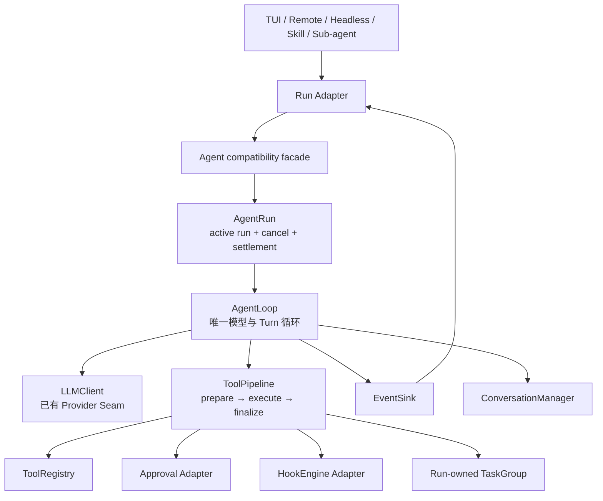
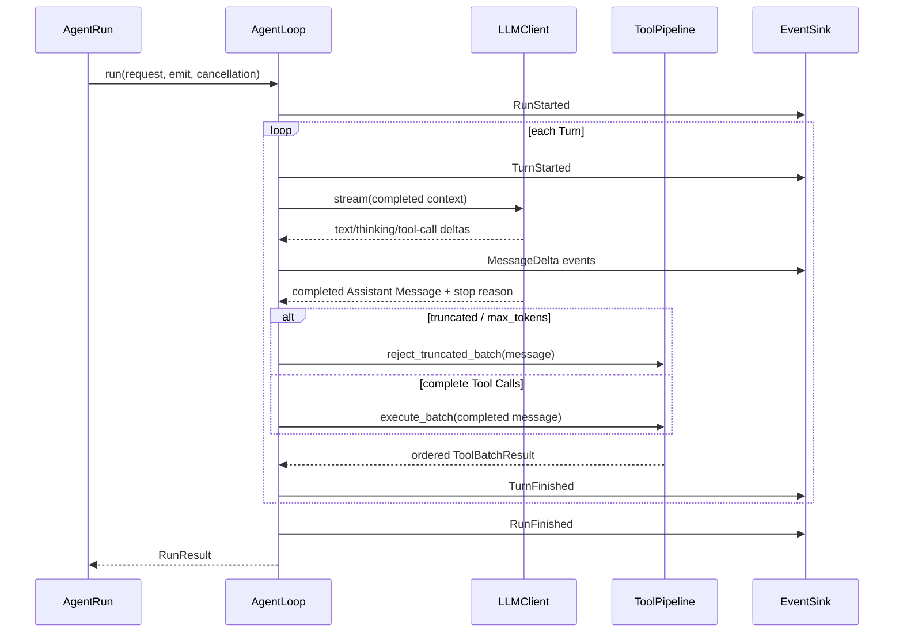
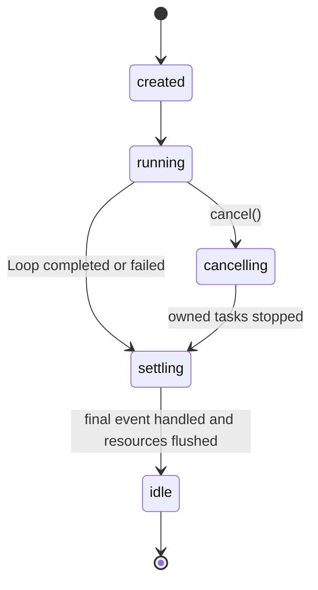

# MewCode 阶段 0 设计：统一 Agent Loop 与 Tool Execution Pipeline

> - 状态：Design v0.1，待评审
> - 日期：2026-08-16
> - 上位设计：[MewCode Runtime 迭代设计](./mewcode-pi-inspired-runtime-design.md)
> - 参考阅读：[Pi Chapter 1](https://books.antinomie.org/pi/chapter/01)、[Pi Chapter 2](https://books.antinomie.org/pi/chapter/02)
> - 当前边界：只设计和规划，不修改 `koko_pi_agent/` 生产源码

## 1. 结论

在 ExtensionHost 之前增加一个阶段 0：

> 保留当前 MewCode 的模型、Tool、Permission、Hook、Context、Memory、Session、Team 和 UI 能力；先把分叉的执行路径收敛成唯一 Agent Loop、唯一 Tool Pipeline 和明确的 AgentRun 生命周期。

阶段 0 不实现 Mini Pi，不重写产品能力，也不引入外部插件。它解决三个更基础的问题：

1. 同一个 Tool Call 在交互、非交互、Remote 和子 Agent 路径上必须具有相同的安全语义。
2. `run()` 与 `run_to_completion()` 必须成为同一个 Run 的不同 Adapter，而不是两套 Loop Implementation。
3. 取消、后台任务、最终事件和彻底 idle 必须有可验证的顺序。

完成后，现有 ExtensionHost 路线仍然成立，但它将建立在稳定的运行时 Interface 上，而不是固化当前双轨实现。

## 2. 为什么必须先做阶段 0

### 2.1 当前代码的结构性证据

| 证据 | 当前路径 | 影响 |
| --- | --- | --- |
| 交互循环 | `koko_pi_agent/agent.py::Agent.run` | 同时管理环境、记忆、Hook、压缩、模型、Tool、权限、恢复和事件 |
| 非交互循环 | `koko_pi_agent/agent.py::Agent.run_to_completion` | 重复实现模型 → Tool → 模型，但行为与交互路径不同 |
| 交互 Tool 执行 | `_execute_single_tool_direct`、`_execute_tool` | 没有统一经过 `pre_tool_use/post_tool_use` Hook |
| 非交互 Tool 执行 | `_execute_tool_noninteractive` | 单独实现 Hook、权限、校验和执行 |
| Tool 并发声明 | `partition_tool_calls`、`is_concurrency_safe` | 有测试，但生产 `run()` 没有使用该分组结果 |
| 流式 Tool 启动 | `StreamingExecutor.submit` | Assistant Message 完成前就可能产生外部副作用 |
| `max_tokens` 恢复 | `Agent.run` 的提前 `continue` | 已启动 Tool 可能在收集结果前被遗留 |
| 并发保护 | TUI / Remote 的 `_streaming` | `Agent` 自身没有单 active-run 不变量 |
| 生命周期 Hook | `Agent.run` 内的 `session_start/end` | 持久 Session 与一次 Run 的命名混用 |

这不是“代码行数太多”的问题，而是同一行为没有唯一 Seam：修复 Tool 安全、Hook、取消或事件时，需要在多个调用路径重复修改。

### 2.2 删除测试

如果删除本设计中的 `AgentLoop`，下面的复杂度会重新出现在 TUI、Remote、Skill fork、TaskManager、AgentTool 和 teammate 中：

- 模型调用与重试；
- Assistant Message 和 Tool Result 追加；
- Turn 停止判断；
- 事件顺序；
- Tool 执行与错误恢复。

如果删除 `ToolPipeline`，参数校验、权限、Hook、并发、截断保护、结果排序和持久化预算会重新散落到至少三个执行函数。

因此它们不是 pass-through，而是能带来真实 Leverage 和 Locality 的深模块。

## 3. 目标与非目标

### 3.1 目标

- 所有 Agent 运行方式共享一个 Agent Loop Implementation。
- 所有 Tool Call 共享一个 Tool Pipeline Implementation。
- 完整 Assistant Message 确认前不产生 Tool 外部副作用。
- 被截断的模型输出中的 Tool Call 全部不执行。
- 交互与非交互路径共享参数校验、Permission 和 Hook 语义。
- Agent 实例只允许一个 active run。
- 取消后不再启动新 Tool，已启动任务必须被等待或取消完成。
- 最终事件与 settlement 分开定义。
- 保持用户配置、Provider、Tool Schema、会话 JSONL 和 UI 协议兼容。

### 3.2 非目标

- 不实现 steer / follow-up 双队列。
- 不重做 Conversation Message 为 Pi 的 content-block 类型。
- 不重写 `LLMClient` Provider Adapter。
- 不在阶段 0 加载第三方 Python 扩展。
- 不实现通用 Service / Inject 容器。
- 不做热重载。
- 不改变 Team、Worktree、MCP、Skill 的产品语义。
- 不引入数据库或跨进程事件总线。
- 不为了形式相似而复制 Pi 的 TypeScript 类和文件布局。

## 4. 领域术语与不变量

### 4.1 术语

| 术语 | 定义 |
| --- | --- |
| Session | 可跨多次用户请求恢复和落盘的持久对话 |
| AgentRun | 一次用户请求触发的完整执行，从开始到自然结束、取消或失败 |
| Turn | 一次模型响应，加上该响应声明的 Tool 批次及其结果 |
| Assistant Message | 一次模型流最终形成的完整响应，包含文本、thinking、Tool Call 和 stop reason |
| Tool Batch | 同一个 Assistant Message 声明的全部 Tool Call |
| Settlement | Loop 已结束、事件处理已返回、Tool/Hook 后台任务已收束、持久化已 flush 的时刻 |

### 4.2 必须成立的不变量

1. 一个 `Agent` 同一时刻最多存在一个 active `AgentRun`。
2. Tool 只有在 Assistant Message 和 stop reason 完整确认后才能进入 execute。
3. `max_tokens` / truncated Assistant Message 中的 Tool Call 执行次数必须为零。
4. Tool Call 按模型声明顺序 prepare。
5. 非并发安全 Tool 不得与同一批中的其他 Tool 重叠执行。
6. 进入对话历史的 Tool Result 顺序必须与模型声明顺序一致。
7. 每个 Tool Call 必须得到且只得到一个 Tool Result，包括未知、禁用、拒绝、参数错误、取消和异常路径。
8. Tool、Permission 或 Hook 失败以结构化结果返回，不破坏消息配对。
9. 取消后不启动新模型请求或新 Tool。
10. `RunFinished` 表示不会再产生 Loop 事件；`wait_until_idle()` 只在全部 settlement 条件满足后返回。

## 5. 总体架构



阶段 0 只新增三个深模块：

- `AgentLoop`：唯一循环；
- `ToolPipeline`：唯一 Tool 执行管线；
- `AgentRun`：一次运行的状态、取消和 settlement。

`Agent` 暂时保留，作为兼容 facade。后续 AgentRuntime 和 ExtensionHost 组合的是这三个稳定能力，不再依赖旧的双轨执行细节。

## 6. 深模块一：AgentLoop

### 6.1 Interface 草案

以下代码只表达 Interface，不是当前实施代码：

```python
@dataclass(frozen=True)
class RunRequest:
    conversation: ConversationManager
    limits: RunLimits


@dataclass(frozen=True)
class RunResult:
    status: Literal["completed", "cancelled", "failed", "max_turns"]
    turns: int
    final_text: str
    error: str = ""


EventSink = Callable[[AgentEvent], Awaitable[None]]


class AgentLoop:
    async def run(
        self,
        request: RunRequest,
        emit: EventSink,
        cancellation: RunCancellation,
    ) -> RunResult: ...
```

对调用方只有一个动作：运行。模型、Tool Pipeline、上下文准备和停止策略在构造时注入或由 Implementation 内部组合，不能让每个调用方重新拼装一遍。

### 6.2 AgentLoop 隐藏的 Implementation

- 每轮环境、Memory、通知和压缩准备；
- 构建 system prompt 和 Tool schema；
- 模型流的收集与增量事件；
- usage 统计；
- `max_tokens` 恢复；
- Assistant Message 入历史；
- ToolPipeline 调用；
- Tool Result 入历史；
- Turn 结束与停止判断；
- 最终 RunResult。

这些行为可以在 Implementation 内继续拆私有函数，但不会膨胀外部 Interface。

### 6.3 单 Turn 时序



### 6.4 停止语义

阶段 0 只支持当前真实需求：

| 原因 | RunResult | 是否启动下一轮 |
| --- | --- | --- |
| 模型没有 Tool Call | `completed` | 否 |
| Tool Result 明确 `terminate=True` | `completed` | 否 |
| 达到 max turns | `max_turns` | 否 |
| 用户取消 | `cancelled` | 否 |
| 不可恢复模型错误 | `failed` | 否 |
| Tool 普通错误 | 仍处于当前 Run | 是，由模型读取错误结果后决定 |

`ExitPlanMode` 不再由 Loop 检查 Tool 名称。它应返回 `terminate=True`，使停止成为 Tool Result 语义，而不是核心对具体 Tool 的硬编码。

阶段 0 不引入通用 `shouldStopAfterTurn` 插件点；出现第二种真实 Host 策略后再建立 Seam。

## 7. 深模块二：ToolPipeline

### 7.1 Interface 草案

```python
@dataclass(frozen=True)
class ToolBatchRequest:
    assistant_message: CompletedAssistantMessage
    conversation: ConversationManager


@dataclass(frozen=True)
class ToolBatchResult:
    messages: tuple[ToolResultBlock, ...]
    terminate: bool


class ToolPipeline:
    async def execute_batch(
        self,
        request: ToolBatchRequest,
        emit: EventSink,
        cancellation: RunCancellation,
    ) -> ToolBatchResult: ...
```

ToolPipeline 只有一个外部动作：执行一个已经完成的 Tool Batch。它不接受半成品 Tool Call，也不允许调用方跳过 prepare。

### 7.2 prepare → execute → finalize

#### Prepare

严格按照模型声明顺序执行：

1. 检查 Assistant Message 是否被截断；
2. 查找 Tool；
3. 检查是否启用；
4. Pydantic 参数校验；
5. 执行 `pre_tool_use` Hook；
6. 执行 PermissionChecker；
7. 必要时通过 Approval Adapter 获取用户决定；
8. 形成 `PreparedToolCall` 或立即错误结果。

任何 prepare 失败都不会执行 Tool，但仍产生配对的 Tool Result。

#### Execute

- prepare 全部结束后才允许 execute；
- `is_concurrency_safe=False` 的 Tool 串行执行；
- 连续的并发安全 Tool 可以组成并发组；
- 所有任务属于当前 AgentRun 的 TaskGroup；
- 取消时 TaskGroup 停止创建新任务，并收束已开始任务；
- Tool 抛出的异常转成 `ToolResult(is_error=True)`。

#### Finalize

1. 执行 `post_tool_use` Hook；
2. 记录 recovery snapshot；
3. 对大结果做 spill / truncate；
4. 对整批结果应用 aggregate budget；
5. 收集 `terminate`；
6. 按模型声明顺序生成 ToolResultBlock。

### 7.3 截断安全规则

如果最终 stop reason 表明输出被截断：

- 本批所有 Tool Call 都不进入 execute；
- 每个调用生成明确错误结果，提示模型重新发出完整参数；
- 事件中不得出现 `ToolExecutionStarted`；
- 测试使用带计数器或文件副作用的 Tool，验证执行次数严格为零。

阶段 0 默认取消“模型仍在 streaming 时抢跑 Tool”的优化。以后如果性能数据证明有必要，只能为显式声明幂等、只读、可取消的 Tool 单独设计 speculative execution；不能恢复无条件抢跑。

### 7.4 两种顺序

并发执行有两种合理顺序，不能混为一谈：

- UI 事件可以按完成顺序到达，让用户尽快看到结果；
- 写入 Conversation 的 Tool Result 必须按模型声明顺序排列，保证重放稳定。

两种顺序都由 ToolPipeline 保证，调用方不自行排序。

### 7.5 Approval 是真实 Seam

当前至少有两个真实 Adapter：

| Adapter | `ask` 决策 |
| --- | --- |
| InteractiveApprovalAdapter | 发出 PermissionRequested，等待 TUI / Remote 用户响应 |
| HeadlessApprovalAdapter | BYPASS 时允许，否则把 ask 转成拒绝结果 |

因此 Approval Interface 不是为了测试虚构的端口，而是承载现有两种生产语义。PermissionChecker 继续负责静态判断，Approval Adapter 只处理 `ask` 如何落地。

## 8. 生命周期对象：AgentRun

### 8.1 Interface 草案

```python
class AgentRun:
    @property
    def status(self) -> RunStatus: ...

    def cancel(self) -> None: ...

    async def wait_until_idle(self) -> RunResult: ...
```

`Agent.start_run(request, sink) -> AgentRun` 在创建前检查 active run。已有 `Agent.run()` 暂时作为兼容 Adapter 存在。

### 8.2 状态机



规则：

- `created` 到 `idle` 只走一次；
- `cancel()` 幂等；
- `RunFinished` 在进入 settling 时发出；
- `wait_until_idle()` 在进入 idle 后返回；
- EventSink 内部不得等待当前 Run 的 idle，否则形成自等待；
- 需要“结束后再做”的动作由 Runtime 注册 after-settlement callback，而不是在 EventSink 内调用 wait。

### 8.3 任务所有权

AgentRun 必须持有以下任务：

- 模型 stream task；
- Tool execute task；
- 与本 Run 强相关的同步 Hook task；
- 必须在 settlement 前完成的持久化任务。

长期 Memory consolidation、跨 Run 通知轮询和扩展后台任务不属于 AgentRun；它们在后续 AgentRuntime / ResourceScope 中托管。阶段 0 必须记录这条边界，避免把所有后台任务塞进一个 TaskGroup。

## 9. Event Interface

### 9.1 层级

| 层级 | 最小事件 |
| --- | --- |
| Run | `RunStarted`、`RunFinished`、`RunFailed` |
| Turn | `TurnStarted`、`TurnFinished` |
| Message | `MessageStarted`、`MessageDelta`、`MessageFinished` |
| Tool | `ToolExecutionStarted`、`ToolExecutionFinished` |
| Control | `PermissionRequested`、`RetryScheduled`、`CompactionFinished`、`UsageUpdated` |

事件使用判别明确的 dataclass，不使用任意字典作为核心 Interface。

### 9.2 EventSink 语义

`EventSink` 是真实 Seam，至少存在 TUI、Remote、Headless 和测试 Adapter。

Interface 约束：

- 同一个 Run 内事件严格有序；
- `emit` 是 async，AgentLoop 等待 Sink 返回；
- Sink 的处理时间计入 settlement；
- Sink 异常默认使 Run 失败，因为核心无法确认调用方是否正确持久化或展示关键控制事件；
- 纯 Observer 的失败隔离留给后续 EventPipeline，而不是在阶段 0 模糊 EventSink 的可靠性交约。

### 9.3 兼容策略

- `StreamText`、`ToolUseEvent`、`ToolResultEvent`、`TurnComplete`、`LoopComplete` 等旧事件在迁移期通过 `LegacyEventAdapter` 映射；
- `koko_pi_agent.agent` 暂时 re-export 旧导入路径；
- TUI 和 Remote 可逐个迁移到新事件，不要求一次改完展示代码；
- 不同时发送语义重复的新旧事件，避免 UI 重复渲染。

## 10. Adapter 设计

### 10.1 Streaming Adapter

服务现有 TUI、Remote 和 Skill fork：

- 把 EventSink 转成兼容的 async iterator；
- 保持事件顺序；
- 调用方提前停止消费时取消对应 AgentRun 并等待收束；
- 不持有模型、Tool 或 Conversation 业务逻辑。

### 10.2 Headless Adapter

服务 TaskManager、AgentTool 和 in-process teammate：

- 消费同一个 AgentRun；
- 从 `MessageDelta/MessageFinished` 收集最终文本；
- 把 usage 和 Tool 事件转发给已有 callback；
- Permission 的 ask 按 HeadlessApprovalAdapter 规则处理；
- 返回 `RunResult.final_text`。

`run_to_completion()` 在迁移期只调用 Headless Adapter，不再包含自己的 while Loop。

### 10.3 UI Adapter

TUI 与 Remote 保留各自展示代码，因为 Textual Widget 和 WebSocket 是两种真实 Adapter；它们共享事件语义，不共享渲染 Implementation。

## 11. 保留的现有 Seam

| Seam | 现有 Adapter | 阶段 0 决策 |
| --- | --- | --- |
| `LLMClient` | Anthropic、OpenAI、OpenAI-compatible | 保留，不重写 |
| `Tool` | 内置 Tool、MCP Tool wrapper | 保留 Tool Interface；结果增加向后兼容的 `terminate` 字段 |
| Approval | Interactive、Headless | 正式命名并统一使用 |
| EventSink | TUI、Remote、Headless、测试 | 新增稳定事件 Interface |
| Conversation 持久化 | 当前 JSONL Session | 格式不变，通过 Sink / Runtime 在 settlement 前 flush |

没有第二个真实 Adapter 的地方不新增公开 Seam。例如阶段 0 不设计通用 Context Provider、Stop Policy 插件和 ExecutionEnv。

## 12. 建议目录

```text
koko_pi_agent/
├── runtime/
│   ├── __init__.py          # 稳定导出面
│   ├── events.py            # AgentEvent 与 RunResult Interface
│   ├── agent_loop.py        # AgentLoop + AgentRun Implementation
│   └── tool_pipeline.py     # ToolPipeline Implementation
├── agent.py                 # 兼容 facade，迁移后显著变薄
├── client.py                # 保持现有 Provider Seam
├── conversation.py          # 阶段 0 保持现有消息模型
└── tools/
    ├── __init__.py          # ToolRegistry
    └── base.py              # Tool / ToolResult
```

不为每个 dataclass 建文件。`events.py` 是共享 Interface 词汇；`agent_loop.py` 和 `tool_pipeline.py` 各自吸收一组高相关复杂度。

## 13. 分批实施计划

每一批都必须可以独立提交、验证和回滚。

### 0A：行为刻画与安全红线

目标：先把当前正确行为和风险路径写成 Interface 级测试，不改生产行为。

新增测试：

- interactive / headless 对同一脚本模型得到相同 Conversation；
- Tool Hook、Permission、参数错误和未知 Tool 的配对结果；
- `max_tokens` 携带 Tool Call 时副作用计数必须为零；
- 非并发安全 Tool 不重叠；
- 取消后没有 Run-owned task 残留；
- 同一个 Agent 并发启动第二个 Run 失败。

其中暴露当前缺陷的测试先标为预期失败或放在待实施提交中，不能为了让基线变绿而降低断言。

### 0B：抽取 ToolPipeline

目标：统一 Tool 安全语义，先不移动主 while Loop。

计划：

- 新建 `koko_pi_agent/runtime/events.py` 和 `tool_pipeline.py`；
- 把三条 Tool 执行路径合并到 `execute_batch()`；
- 移除 streaming 期间的无条件 Tool 抢跑；
- 正式使用 `is_concurrency_safe`；
- interactive / headless Approval Adapter 共享 PermissionChecker；
- Hook、spill、budget、recovery 全部进入 finalize；
- `ToolResult` 增加 `terminate: bool = False`；
- ExitPlanMode 改为返回 terminate，不再由 Agent 检查名称。

回滚点：恢复旧 Tool 调用接线；Conversation 和 Session 格式未变化。

### 0C：抽取唯一 AgentLoop

目标：让 `run()` 和 `run_to_completion()` 委托给同一个 Loop。

计划：

- 新建 `koko_pi_agent/runtime/agent_loop.py`；
- 从 `Agent.run()` 移出唯一 while Loop；
- 保留当前压缩、重试、usage 和消息追加行为；
- `run_to_completion()` 改为 Headless Adapter；
- Skill fork 改用 Streaming Adapter；
- 删除第二份非交互 Loop。

回滚点：兼容 facade 仍保留原方法名，调用方不改公开入口即可切回。

### 0D：AgentRun、取消与 settlement

目标：把运行状态从 UI 私有标志提升为 Agent 自身不变量。

计划：

- 增加 `start_run`、active-run 检查、`cancel` 和 `wait_until_idle`；
- 使用结构化 TaskGroup 托管 Run-owned tasks；
- 明确 `RunFinished` 与 idle 的先后；
- TUI Escape、Remote cancel、TaskManager cancel 接到同一取消路径；
- 提前停止事件消费时保证生成器和任务被关闭。

回滚点：旧 `_streaming` 标志继续作为 UI 状态，但不再承担核心并发正确性。

### 0E：迁移生产 Adapter

迁移顺序：

1. tests / fake sink；
2. Headless Adapter；
3. TaskManager 和 AgentTool；
4. Skill fork；
5. in-process teammate；
6. TUI；
7. Remote；
8. `koko_pi_agent/__main__.py` 非交互入口。

每迁移一个调用方，都比较 Conversation、Tool 结果、usage、取消和最终文本，不以“能运行”作为唯一验收。

### 0F：删除重复实现与全量验证

- 删除旧 `run_to_completion()` while Loop；
- 删除不再使用的 StreamingExecutor 或把它降为 ToolPipeline 私有 Implementation；
- 删除只覆盖旧内部函数、不覆盖新 Interface 的浅测试；
- 保留调用新 Interface 的行为测试；
- 确认 `Agent` facade 已明显变薄；
- 更新 Runtime 主设计，把 ExtensionHost 阶段设为下一阶段。

## 14. 文件影响

| 文件 | 计划变化 |
| --- | --- |
| `koko_pi_agent/runtime/__init__.py` | 新增稳定导出面 |
| `koko_pi_agent/runtime/events.py` | 新增 Run/Turn/Message/Tool 事件与结果类型 |
| `koko_pi_agent/runtime/agent_loop.py` | 新增唯一 AgentLoop 与 AgentRun |
| `koko_pi_agent/runtime/tool_pipeline.py` | 新增 ToolPipeline |
| `koko_pi_agent/agent.py` | 逐步变为兼容 facade，删除重复 Loop 与 Tool 路径 |
| `koko_pi_agent/tools/base.py` | ToolResult 增加兼容的 terminate 字段 |
| `koko_pi_agent/hooks/engine.py` | 通过 ToolPipeline Adapter 统一调用，不立即更改 YAML |
| `koko_pi_agent/app.py` | 接入 Streaming/UI Adapter 和统一 cancel |
| `koko_pi_agent/remote.py` | 接入 Streaming/Remote Adapter 和统一 cancel |
| `koko_pi_agent/agents/task_manager.py` | 接入 Headless Adapter |
| `koko_pi_agent/tools/agent_tool.py` | 接入 Headless Adapter |
| `koko_pi_agent/skills/executor.py` | 接入 Streaming Adapter |
| `koko_pi_agent/teams/spawn_inprocess.py` | 接入 Headless Adapter |
| `tests/test_agent_runtime.py` | 新增 AgentLoop / AgentRun Interface 测试 |
| `tests/test_tool_pipeline.py` | 新增 ToolPipeline Interface 测试 |

预计跨越多个文件，因此不能一次提交。0A–0F 的拆分本身就是风险控制措施。

## 15. 测试策略

### 15.1 Interface 是测试面

新测试只通过这些 Interface 观察行为：

- `AgentLoop.run()`；
- `ToolPipeline.execute_batch()`；
- `AgentRun.cancel()` / `wait_until_idle()`；
- Streaming 与 Headless Adapter。

不再以 `_execute_single_tool_direct()`、`_execute_tool_noninteractive()` 等私有函数为主要测试面。

### 15.2 必测矩阵

| 类别 | 案例 |
| --- | --- |
| Loop | 纯文本结束、单 Tool、多 Turn、max turns、模型错误、max_tokens 恢复 |
| 截断 | 含合法但不完整参数的 Tool Call，执行次数仍为零 |
| Tool prepare | 未知、禁用、参数错误、Hook 拒绝、Permission 拒绝、ask |
| Tool execute | 成功、异常、并发安全组、非并发安全串行、取消 |
| Tool finalize | post Hook、spill、aggregate budget、recovery、terminate |
| 顺序 | 完成事件可按完成顺序，Conversation 结果严格按声明顺序 |
| Adapter 一致性 | Streaming 与 Headless 的最终 Conversation 和 RunResult 一致 |
| 生命周期 | 第二个 Run 被拒绝、cancel 幂等、final event 早于 idle、无遗留任务 |
| 持久化 | Turn/Run 完成 flush，中断后消息配对可恢复 |

### 15.3 删除测试

阶段 0 完成时执行两次删除测试：

1. 假想删除 AgentLoop：如果调用方必须重新实现 while、重试、Tool 回写和停止逻辑，说明模块有 Depth。
2. 假想删除 ToolPipeline：如果权限、Hook、并发、截断和结果排序重新散落，说明模块有 Depth。

如果删除某个新模块后复杂度没有重新出现，只剩改 import，说明它是浅模块，应合并回拥有真实复杂度的 Implementation。

## 16. 兼容性

- 用户命令和配置格式不变；
- Provider 配置和模型选择不变；
- Tool 名称、参数 Schema 和默认工具集不变；
- Session JSONL 格式不变；
- 现有 `Agent.run()` 和 `run_to_completion()` 在迁移期保留；
- 现有事件导入路径暂时 re-export；
- Hook YAML 保持兼容；
- Team、Sub-agent 和 Skill 的最终输出格式不变；
- 不在同一提交中迁移 ExtensionHost。

## 17. 风险与缓解

| 风险 | 缓解 |
| --- | --- |
| 延迟 Tool 到完整消息后执行，首个 Tool 启动变慢 | 安全优先；记录延迟数据，未来只为显式幂等只读 Tool 设计可审计优化 |
| Hook 从非交互专属变为所有路径生效，暴露旧配置问题 | 加兼容测试和启动诊断，明确这是修复语义漂移而非新功能 |
| UI 事件迁移导致重复或丢失渲染 | 使用 LegacyEventAdapter，单调用方迁移，不同时发两套重复事件 |
| 取消时 Tool 忽略协作取消 | TaskGroup 等待并记录超时；不宣称 Python task cancellation 等于外部副作用回滚 |
| settlement 与 EventSink 自等待死锁 | 文档禁止 Sink 等待当前 Run idle，提供 after-settlement 注册方式 |
| AgentLoop 又吸收全部 Harness 能力 | Session 持久化、长期 Memory、Extension 资源仍留在 Runtime；定期做 Interface 与删除测试 |
| 一次修改文件过多 | 0A–0F 独立提交，每批有回滚点和行为对照 |

## 18. 验收门

阶段 0 只有同时满足下面条件才算完成：

- 生产代码只有一个模型 → Tool → 模型 while Loop；
- 生产代码只有一个 Tool prepare/execute/finalize 路径；
- truncated Tool Call 的副作用计数为零；
- interactive、Remote 和 headless 对同一脚本响应形成相同 Conversation；
- Hook 与 Permission 在所有路径行为一致；
- 非并发安全 Tool 不重叠；
- 取消后没有 Run-owned task 残留；
- 第二个并发 Run 在 Agent 层失败，而不是依赖 UI 标志；
- `RunFinished` 与 idle 顺序有测试；
- Session JSONL、Tool Schema 和用户配置没有迁移；
- 全量测试通过；
- 旧重复 Loop 和浅内部测试已经删除。

## 19. 待评审决策

- [x] 同意把阶段 0 放在 ExtensionHost 之前。
- [x] 同意阶段 0 默认取消 streaming 期间的 Tool 抢跑。
- [x] 同意 `ToolResult` 增加 `terminate: bool = False`，替代 Loop 对 `ExitPlanMode` 名称的硬编码。
- [x] 同意 AgentLoop 采用 async EventSink，旧 async iterator 由兼容 Adapter 提供。
- [x] 同意 Headless ask 在非 BYPASS 模式下安全拒绝，不尝试伪造交互。
- [x] 同意暂不实现 steer/follow-up、通用 StopPolicy 和 ExecutionEnv。
- [ ] 同意 0A–0F 分批实施，不做一次性重构。

## 20. 下一步

阶段 0 已按 0A–0F 完成实施。下一阶段是主设计中的 ExtensionHost；它复用本阶段稳定的 AgentRun、AgentLoop、ToolPipeline 和类型化事件，不再接入旧执行分支。

## 21. 实施结果（2026-08-16）

- `koko_pi_agent/runtime/events.py`：类型化 Run、Turn、Message、Tool 与兼容事件。
- `koko_pi_agent/runtime/tool_pipeline.py`：唯一 prepare → execute → finalize 路径。
- `koko_pi_agent/runtime/agent_loop.py`：唯一模型循环、AgentRun、取消、settlement 与 Streaming Adapter。
- `koko_pi_agent/agent.py`：从 1300 行以上降为兼容 facade 和 Agent 配置状态，不再包含 Tool 执行或第二份 while Loop。
- `tests/test_tool_pipeline.py`：覆盖截断零副作用、配对、并发屏障、完成顺序、写回顺序和 terminate。
- `tests/test_agent_runtime.py`：覆盖 streaming / Remote sink / headless 一致性、Hook / Permission 一致性、active-run 保护、取消收束和 RunFinished → idle 顺序。

最终验证：`635 passed, 1 skipped`；新增 Runtime 文件 Ruff 通过；全项目编译通过；`git diff --check` 通过。
