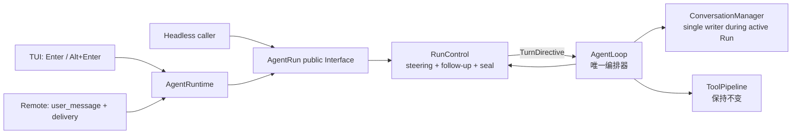
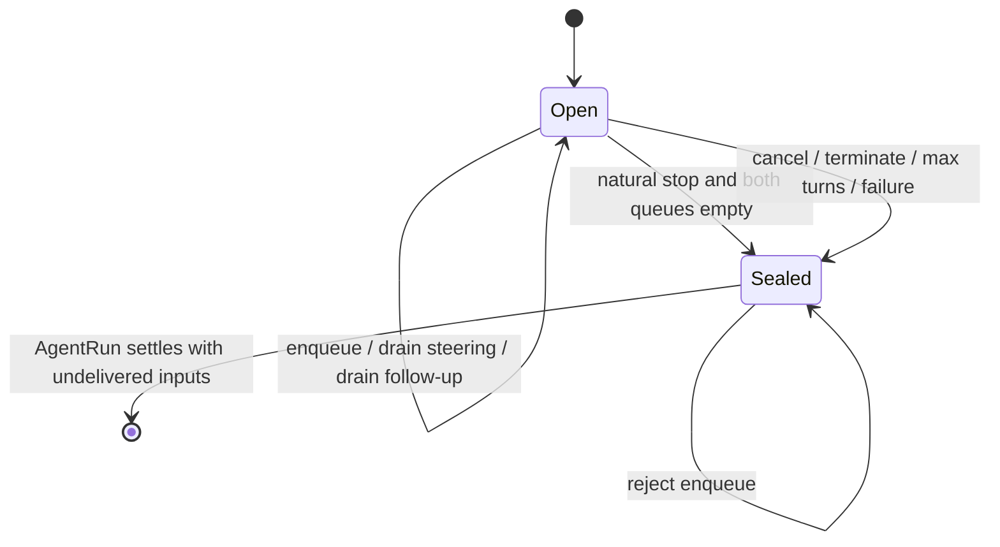

# MewCode 阶段 2A 设计：AgentRun 控制面与运行中输入

> - 状态：Implemented and verified
> - 日期：2026-08-16
> - 前置：阶段 0 AgentLoop/ToolPipeline/AgentRun 与阶段 1 AgentRuntime/ExtensionHost 已完成
> - 开发方式：设计先行，完整实现一个批次后补行为验证；不采用 red-green-refactor TDD
> - 实施结果：2A0–2A5 已完成；目标矩阵与全量回归通过

## 1. 结论

下一阶段不再优先实施 ResourceScope，而是先交付一个用户能直接感知的 Agent Loop 功能：

> 让 TUI、Remote 和核心 Runtime 对“Agent 仍在工作时，用户又提交了一条消息”使用同一套语义：普通 Enter 作为 steering，在当前 Turn 的工具结束后送入；follow-up 在 Agent 原本准备结束时送入；取消或硬停止时，尚未送入的消息可以恢复，不能静默丢失。

本阶段新增一个内部深 Module `RunControl`。它拥有两类运行中输入、FIFO、优先级、Turn 边界投递、停止时封口和未投递恢复。外部只通过 `AgentRun`/`AgentRuntime` 的窄 Interface 排队，不直接操作队列。

ResourceScope 的原详细设计仍然有效，只是从“立即实施”改为“后续基础设施候选”。这次改序不是推翻 ExtensionHost，而是先补齐 Stage 0 暴露出的跨入口产品行为缺口。

## 2. 为什么重新排序

### 2.1 实施前的真实行为有三套答案

同一个问题——运行中再次提交普通文本——实施前由三个入口给出三种不同结果：

| 入口 | 当前行为 | 用户风险 |
| --- | --- | --- |
| TUI | 取消当前 `_agent_task`，等待后再启动新 Run | 当前工作被打断，Tool/上下文可能只完成一半 |
| Remote | `_streaming` 时直接 return | 新消息静默丢失 |
| Agent Core | active run 存在时拒绝第二个 `start_run()` | 调用方得到异常，但没有正确替代路径 |

这不是未来扩展能力，而是现有产品入口已经遇到的功能问题。

### 2.2 新材料真正值得借鉴的不是“再写一个 Loop”

[Agent Loop 讲解文章](https://dg-ai-notes.pages.dev/modules/ch03-agent-loop/)提供了三个有用概念：

1. Trace 与 Turn 是两个时间尺度；
2. steering 与 follow-up 是不同的交互语义；
3. 停止条件属于框架控制，不是模型自行“理解完成”。

Pi 当前官方源码进一步确认：

- [agent-loop.ts](https://github.com/earendil-works/pi/blob/main/packages/agent/src/agent-loop.ts)使用 inner loop 处理 ToolCall 与 steering，只有在 inner loop 原本要停止时才检查 follow-up；
- [agent.ts](https://github.com/earendil-works/pi/blob/main/packages/agent/src/agent.ts)为 steering 和 follow-up 保存两个独立 `PendingMessageQueue`；
- [usage.md](https://github.com/earendil-works/pi/blob/main/packages/coding-agent/docs/usage.md#message-queue)把 Enter、Alt+Enter 和 Escape 分别映射到 steering、follow-up 和 abort/recover。

MewCode 已有唯一 `AgentLoop` 和深 `ToolPipeline`。因此正确借鉴是给现有 Loop 增加一个小控制面，而不是复制 Pi 的类、回调配置或消息体系。

### 2.3 候选模块重新比较

| 候选 | 直接价值 | Depth | 当前接缝 | 决定 |
| --- | --- | --- | --- | --- |
| `RunControl` + Turn boundary | 运行中消息不再打断、丢失或报并发错误 | 高：隐藏双队列、顺序、停止、竞态、恢复 | `AgentRun`、`AgentLoop`、TUI、Remote 都已有明确 seam | **下一阶段** |
| `TurnPreparer` | 把 compaction/reminder/context/tool projection 从肥 Loop 抽出 | 高，但第一版主要是内部可维护性 | `_run_loop()` 每轮模型调用前 | 2B 设计门，不与 2A 混做 |
| ResourceScope + TaskSupervisor | 统一扩展资源清理 | 高，原设计完整 | ExtensionSession/AsyncExitStack | 保留并顺延 |
| EventPipeline | 扩展可观察/拦截运行事件 | 中高 | `AgentEvent`/HookEngine | 等 Turn 生命周期先稳定 |
| Command contribution | 命令 owner、冲突、刷新与注销 | 中高 | CommandRegistry | 独立后续阶段 |

`RunControl` 通过删除测试：如果删除它，双队列、优先级、封口竞态、硬停止恢复和投递规则会重新散落到 AgentRun、AgentLoop、TUI 与 Remote；它不是一层转发包装。

## 3. 范围与完成定义

### 3.1 本阶段目标

1. active AgentRun 可以接收 text steering 和 follow-up。
2. steering 在当前已开始的模型响应及其 Tool batch 完成后、下一次模型调用前投递。
3. follow-up 只有在当前 Loop 原本自然停止时才投递。
4. 同类消息 FIFO；同一边界上 steering 优先于 follow-up。
5. 投递动作只有 AgentLoop 能修改 Conversation，入口不得在 active run 中直接追加历史。
6. TUI 与 Remote 使用同一 Core Interface；Remote 不再静默丢消息，TUI 不再用新消息隐式取消当前 Run。
7. Escape/显式 cancel、Tool terminate、max turns 等硬停止不会继续消费队列，未投递消息可恢复。
8. 每个完成的模型 Turn 恰好产生一个 `TurnComplete`，无论它以 ToolCall、自然文本还是截断恢复结束。
9. 单 active run、ToolPipeline、Tool Schema、Permission、Hook、Session JSONL 格式保持不变。

### 3.2 非目标

- 不支持两个并发 AgentRun；
- 不增加任意 `shouldStopAfterTurn`、`prepareNextTurn` 或通用 callback 配置；
- 不在本阶段动态切换模型、thinking level、system prompt 或 Tool 集合；
- 不实现跨进程持久化队列；进程崩溃后的 queued input 恢复另行设计；
- 不把 Pi 的 `AgentMessage`/provider Message 类型原样搬入 MewCode；
- 不改变 partial assistant 的 Conversation 持久化策略；
- 不开放扩展拦截或修改 RunControl；
- 不顺带实现 ResourceScope、EventPipeline、Command ownership 或热重载；
- 不引入可配置的 `one/all` drain mode；第一版每次按 FIFO 投递同类队列中的全部消息。

### 3.3 完成定义

只有同时满足以下条件才算阶段 2A 完成：

- TUI streaming 期间 Enter 不取消当前 Run，而是返回 queued receipt；
- TUI Alt+Enter 排入 follow-up，Escape 仍取消；
- Remote active run 期间普通 `user_message` 默认排入 steering，并返回明确 ack；
- steering 与 follow-up 在 Conversation 中的位置符合各自边界；
- terminate/max turns/cancel 后未投递内容能从 `RunResult` 读取；
- sealed/settling 竞态不会丢消息，入口会在 idle 后启动新 Run；
- 自然文本、Tool、截断恢复三种完整 Turn 都只发一次 `TurnComplete`；
- 现有第二并发 Run 拒绝、取消 settlement、ToolPipeline 和全量测试不回归。

## 4. 总体架构



职责边界：

- `AgentRun` 是外部提交运行中输入的 Interface；
- `RunControl` 是内部状态与决策 Module；
- `AgentLoop` 只在固定边界询问下一步，不保存两套队列规则；
- TUI/Remote 是输入按键、协议 ack、显示与恢复的 Adapter；
- `ConversationManager` 仍拥有真实对话历史，active run 期间只由 AgentLoop 写入新 queued input。

## 5. 核心术语

| 术语 | 本设计定义 |
| --- | --- |
| Run/Trace | 一次 `RunStarted` 到 `RunFinished`，可以包含多个模型 Turn |
| Turn | 一次完整模型响应，加上该响应产生的全部 ToolCall 处理 |
| steering | 当前 Turn 完成后尽快改变后续方向的用户输入 |
| follow-up | 当前工作本来已经完成后，继续开始下一段工作的用户输入 |
| natural stop | 模型未产生 ToolCall，且没有硬停止 |
| hard stop | cancel、Tool terminate、max turns 或运行失败，不再消费 queued input |
| delivered | queued input 已由 AgentLoop 追加进 Conversation；不是仅仅已进入队列 |
| sealed | RunControl 不再接受本 Run 的新消息，后续输入必须等待 idle 后开启新 Run |

## 6. 外部 Interface

### 6.1 数据合同

```python
class RunInputKind(Enum):
    STEERING = "steering"
    FOLLOW_UP = "follow_up"


@dataclass(frozen=True)
class QueuedRunInput:
    input_id: str
    kind: RunInputKind
    text: str


@dataclass(frozen=True)
class RunInputReceipt:
    item: QueuedRunInput
    position: int
```

第一版只接受非空 text。`input_id` 用于 Remote ack、UI 状态和 exactly-once 验证；不把 wall-clock time 放入语义合同。

### 6.2 AgentRun

```python
class AgentRun:
    def steer(self, text: str) -> RunInputReceipt: ...
    def follow_up(self, text: str) -> RunInputReceipt: ...
    async def wait_until_idle(self) -> RunResult: ...
```

规则：

- `CREATED` 或 `RUNNING` 且 RunControl 为 open 时接受；
- `CREATED` 窗口中的 steering 会在首轮模型调用前投递，follow-up 仍等第一次自然停止；
- `CANCELLING`、`SETTLING`、`IDLE` 或 sealed 时抛出类型化 `RunInputClosedError`；
- enqueue 是同步、无 await 的原子操作，只承诺同一 asyncio event loop 内调用；
- 不暴露 `drain()`、`clear()` 或底层 deque。

### 6.3 AgentRuntime

```python
class AgentRuntime:
    def steer_active_run(self, text: str) -> RunInputReceipt | None: ...
    def follow_up_active_run(self, text: str) -> RunInputReceipt | None: ...
```

没有 active run 时返回 `None`，表示 Adapter 应按现有路径启动新 Run；不由 Runtime 猜测 Conversation、EventSink 或 UI 行为。

### 6.4 RunResult

```python
@dataclass(frozen=True)
class RunResult:
    status: Literal["completed", "cancelled", "failed", "max_turns"]
    turns: int
    final_text: str
    error: str = ""
    undelivered_inputs: tuple[QueuedRunInput, ...] = ()
```

新增字段有默认值，保持现有构造调用兼容。它只包含从未写入 Conversation 的消息；已经 delivered 的输入不重复返回。

### 6.5 投递事件

```python
@dataclass(frozen=True)
class RunInputDelivered:
    kind: RunInputKind
    input_ids: tuple[str, ...]
```

enqueue 发生在事件流外，queued ack 由 Adapter 直接根据 receipt 返回；真正 delivery 由 AgentLoop 串行发出 `RunInputDelivered`。事件只携带 ID 与 kind，不复制用户正文，Conversation 仍是内容真相源。

## 7. RunControl：内部深 Module

### 7.1 小 Interface

```python
class RunControl:
    def enqueue(self, kind: RunInputKind, text: str) -> RunInputReceipt: ...
    def before_first_turn(self) -> tuple[QueuedRunInput, ...]: ...
    def after_turn(
        self,
        *,
        would_stop: bool,
        hard_stop: str | None,
    ) -> TurnDirective: ...
    def seal(self) -> tuple[QueuedRunInput, ...]: ...
```

`TurnDirective` 只告诉 Loop 三件事：是否继续、这次要投递哪些输入、原因是什么。它不持有 Conversation、LLM client、ToolRegistry 或 EventSink。

### 7.2 隐藏的复杂度

RunControl 内部隐藏：

- steering/follow-up 两个 FIFO；
- 同类全部 drain、跨类 steering 优先；
- hard stop 优先于任何 queued input；
- Tool turn 尚需自然继续时不提前消费 follow-up；
- natural stop 才消费 follow-up；
- seal 与最后一次空队列判断是同一同步临界区；
- delivered 与 undelivered 的 exactly-once 转移；
- 关闭后的明确拒绝，而不是悄悄接受永远不会处理的消息。

### 7.3 状态机



### 7.4 边界决策顺序

一个 Turn 的 assistant message 和 ToolResult 已写入 Conversation 后：

1. 如果 cancel/failure/terminate/max turns 生效，立即 seal，不消费任何 queued input；
2. 否则先 drain steering；有 steering 就投递并继续；
3. 如果本 Turn 有 ToolCall，继续到下一 Turn，但 follow-up 保持等待；
4. 如果模型自然停止，再 drain follow-up；有 follow-up 就投递并继续；
5. 两类队列均空时，以同步操作 seal 并停止。

如果 steering 与 follow-up 同时存在，steering 先进入下一 Turn；follow-up 留到 Agent 再次准备自然停止时。

其中 max turns 只在“还需要下一次模型调用”时成为 hard stop：若当前已自然结束且两类队列都为空，结果仍是正常 completed；若 ToolCall 或 queued input 原本要求继续但额度已用完，才返回 max_turns，并保留尚未投递的输入。

## 8. AgentLoop 接入

### 8.1 只增加一个控制 seam

AgentLoop 不获得一组可任意组合的 callbacks。它只在两个固定位置询问 RunControl：

1. 首次模型调用前：消费已经排入的 steering；
2. 每个完整 Turn 后：提交 `would_stop` 与 `hard_stop`，接收一个 `TurnDirective`。

ToolPipeline 的 prepare/execute/finalize、截断保护、权限和 ToolResult 排序全部不变。

### 8.2 Conversation single-writer 规则

active run 期间：

- Adapter 只 enqueue，不直接 `conversation.add_user_message()`；
- RunControl 只返回不可变的输入值，不修改 Conversation；
- AgentLoop 在决定 delivery 后按 FIFO 调用 `conversation.add_user_message()`；
- 一旦写入 Conversation，该输入从 undelivered 集合永久移除。

这比一开始深拷贝整个 Conversation 更适合 MewCode：auto compact、usage anchor、environment/memory 注入都依赖当前 Conversation 的真实身份。当前阶段先固定 single-writer，不制造两份会分叉的历史。

### 8.3 Turn 生命周期统一

`TurnComplete` 改成真正的 Turn 边界：

```python
@dataclass
class TurnComplete:
    turn: int
    will_continue: bool = True
    reason: Literal[
        "tool_calls", "steering", "follow_up", "natural",
        "retry", "terminate", "max_turns", "cancelled", "failed"
    ] = "tool_calls"
```

事件顺序：

```text
TurnStarted
  -> MessageStarted / stream / MessageFinished
  -> optional Tool batch
  -> turn_end hook
  -> RunControl.after_turn(...)
  -> TurnComplete(will_continue, reason)
  -> optional queued-input delivery
  -> next TurnStarted OR LoopComplete
```

自然文本、Tool batch 和截断恢复只要形成了完整 assistant response，都发一次 `TurnComplete`。取消发生在 response/tool batch 未完成时，不伪造完成事件。

### 8.4 停止优先级

本阶段使用固定优先级，不开放通用 stop callback：

```text
cancel / failure
  > ToolResult.terminate
  > max_iterations
  > steering
  > existing ToolCall continuation
  > follow-up at natural stop
  > natural completion
```

这使“框架决定停止”成为显式规则，同时避免过早引入一个会让任何扩展任意改变 Loop 的浅 `shouldStopAfterTurn` Interface。

## 9. Adapter 行为

### 9.1 TUI

- idle 时 Enter：保持现有行为，添加普通用户消息并启动新 Run；
- active 时 Enter：调用 `steer_active_run()`，显示 queued steering，不取消；
- active 时 Alt+Enter：调用 `follow_up_active_run()`；
- Escape：保持显式 cancel；
- receipt 返回后 UI 立即显示用户输入和队列类型，但不直接写 Conversation；
- 收到该输入被投递后的 Turn 事件，再由现有 history cursor 按对话顺序写 Session；
- `RunFinished` 时统一 flush Conversation tail，并把 `undelivered_inputs` 恢复到输入框或显示为可再次发送内容。

若 enqueue 恰好遇到 sealed/settling 窗口，TUI 等待该 Run idle 后用同一文本开启新 Run，不要求用户重新输入。

### 9.2 Remote

现有 `user_message` 增加可选字段：

```json
{
  "type": "user_message",
  "data": {
    "content": "先检查配置，不要继续部署",
    "delivery": "steering"
  }
}
```

- idle 时仍启动普通 Run；
- active 时 `delivery` 缺省为 `steering`；
- `follow_up` 显式进入 follow-up 队列；
- 接受后广播 `input_queued`，包含 `inputId`、`delivery` 和 `position`；
- 投递后广播 `input_delivered`；
- cancel/硬停止后广播 `input_restored`，内容来自 `RunResult.undelivered_inputs`；
- sealed race 自动等待 idle 后启动新 Run，不能静默 return。

旧客户端不发送 `delivery` 时仍能工作，协议只做向后兼容扩展。

### 9.3 Headless 与内部调用

`run_to_completion()` 默认不自动产生 queued input，但高级调用方拿到 `AgentRun` 后可以调用 `steer()`/`follow_up()`。Skill、sub-agent 与 teammate 不需要在本阶段修改业务行为；它们继续共享唯一 AgentLoop。

## 10. 失败、取消与竞态

### 10.1 cancel

- `AgentRun.cancel()` 先阻止新 enqueue，再取消运行任务；
- 已进入 ToolPipeline 的 Tool 仍按 Stage 0 规则写成 paired cancelled ToolResult；
- 未 delivered 的队列内容进入 `RunResult.undelivered_inputs`；
- delivered 内容已经是 Conversation 历史，不重复恢复。

### 10.2 Tool terminate 与 max turns

两者都是 hard stop：

- 不消费 steering/follow-up；
- 先 seal，再生成最终结果；
- max turns 的判断移到当前 Turn boundary，使 queued input 不会先写进 Conversation、下一轮又因上限无法执行；
- 保留现有 `RunResult.status="max_turns"` 与错误文本。

`ToolResult.terminate` 当前 MewCode 语义是任一 ToolResult 要求终止就停止。本阶段保持该业务契约，不机械改成 Pi 的“全部 terminate”。

### 10.3 最后一次 enqueue 与自然结束竞争

`after_turn()` 的“检查两个队列均空 + seal”必须是一个无 await 的同步操作。这样只有两种结果：

- enqueue 先发生：本 Turn 看见它并继续；
- seal 先发生：enqueue 得到 `RunInputClosedError`，Adapter 等待 idle 后开启新 Run。

不存在“返回 accepted，但消息永远不会被消费”的第三种结果。

### 10.4 EventSink backpressure

RunControl enqueue 不调用 EventSink，避免用户输入处理被当前事件消费者反向阻塞。queued ack 由调用 Adapter 根据 receipt 发送；delivered 事件由 AgentLoop 在串行事件流中发送。

## 11. 为什么暂不做 TurnPreparer

当前 `_run_loop()` 在每次模型调用前直接完成 mailbox、notification、Hook prompt、plan/coordinator reminder、deferred-tool reminder、auto compact、environment/memory 再注入和 Tool schema 投影，确实已经偏厚。

它适合成为后续 `TurnPreparer` 深 Module，但不与本阶段同时实施，原因是：

1. RunControl 本身已经跨 Core、TUI、Remote 和 Session flush，是一个完整纵向切片；
2. Context preparation 会接触 compaction、memory、Hook、Permission mode 和 provider request，回归面明显更大；
3. 先固定 queued input 的 delivery boundary，才能知道 TurnPreparer 应在 delivery 前还是后读取外部状态；
4. 当前没有第二个 Context preparation Implementation，不需要提前设计可替换 Protocol。

2A 完成后再单独评审 2B。候选 Interface 是“给定 turn number 与当前 Conversation，产生本次模型调用的 system/tools/context projection 和 preparation events”，不是任意 callback 容器。

## 12. 非 TDD 实施计划

开发时每个批次遵循：重读冻结 Interface -> 实现完整批次 -> 审查 diff -> 补/改可观察行为测试 -> 跑目标回归 -> 进入下一批。不先写预期失败测试。

### 2A0：冻结 Stage 1 基线

步骤：

1. 确认 Stage 1 未提交修改的准确文件清单，保留用户已有 untracked 学习材料；
2. 运行当前 AgentRun/ToolPipeline/TUI/Remote 目标测试和全量测试；
3. 记录 TUI cancel-restart、Remote drop 和 concurrent-run rejection 三个现状，只作为基线证据；
4. 不创建预期失败测试。

理由：当前工作树包含尚未提交的 Stage 1，必须能把 2A diff 与前置实现分开审计。

退出条件：基线结果与 Stage 1 已知结果一致，或新增差异已解释。

### 2A1：实现 RunControl 核心

文件：

- 新增 `koko_pi_agent/runtime/run_control.py`；
- 修改 `koko_pi_agent/runtime/events.py` 的共享合同；
- 新增 `tests/test_run_control.py`（实现完成后）。

步骤：

1. 实现 kind、queued item、receipt、closed error、directive 和 open/sealed 状态；
2. 实现 before-first-turn、after-turn、hard-stop seal 与 recover；
3. 固定双队列 FIFO、steering 优先和 exactly-once；
4. 完成实现审查后补状态表测试。

理由：先把并发与停止规则做成不依赖 LLM/UI 的深 Module，后续 AgentLoop 只消费 typed directive。

退出条件：RunControl 的公开 Interface 测试覆盖全部状态转移，测试不读取私有 deque。

### 2A2：接入 AgentRun 与 AgentLoop

文件：

- 修改 `koko_pi_agent/runtime/agent_loop.py`；
- 修改 `koko_pi_agent/agent.py`；
- 修改 `tests/test_agent_runtime.py`。

步骤：

1. 每个 AgentRun 创建独立 RunControl，并暴露 `steer()`/`follow_up()`；
2. AgentLoop 在首 Turn 前与每个完整 Turn 后调用 RunControl；
3. queued input 只在 delivery 时写 Conversation；
4. 统一自然、Tool 和 truncated recovery 的 `TurnComplete`；
5. 把 max-turn 判断并入 boundary，保持 terminate 现有 any 语义；
6. 把 `session_end` Hook 移到真正的 Run 停止点，follow-up 继续时不能提前结束 Session；
7. 所有返回路径把 undelivered inputs 放入 RunResult；
8. 实现后补跨多 Turn 的 Conversation/Event 顺序测试。

理由：这是唯一语义核心。若先改 TUI/Remote，它们只会形成新的入口分叉。

退出条件：直接 AgentRun API 已能证明 steering/follow-up/stop/cancel，不依赖真实 UI。

### 2A3：接入 AgentRuntime facade

文件：

- 修改 `koko_pi_agent/runtime/agent_runtime.py`；
- 修改 `tests/test_runtime_composition.py` 与 `tests/test_agent_runtime.py`。

步骤：

1. 增加两个 active-run 转发方法；
2. inactive 返回 None，closing/closed 继续按 Runtime state 拒绝；
3. 保持 `start_run()` 的单 active run 约束；
4. close 仍先 cancel 并等待 idle，再关闭 ExtensionSession；
5. 实现后补 Runtime Interface 测试。

理由：入口依赖 Runtime，而不是读取 AgentRun 私有 inbox，才能保留 Stage 1 的组合根边界。

退出条件：TUI/Remote 所需能力全部可从 AgentRuntime 获得。

### 2A4：迁移 TUI 与 Remote

文件：

- 修改 `koko_pi_agent/app.py`；
- 修改 `koko_pi_agent/remote.py`；
- 修改对应 Adapter 测试。

步骤：

1. TUI 将 active Enter 改成 steering，增加 Alt+Enter follow-up；
2. Escape 保持 cancel，不再把普通新消息当成隐式 cancel；
3. TUI 按 `will_continue` 渲染 TurnComplete，避免自然结束创建多余空回复区；
4. Remote 去掉 streaming 时静默 return，增加 delivery 路由与 queued/delivered/restored ack；
5. 两入口实现 sealed race 的 wait-idle-then-start；
6. 实现后分别做 Adapter 行为验证。

理由：两个真实 Adapter 同批接入才能证明 Core Interface 没有偏向某一个 UI。

退出条件：同一 scripted Agent 在 TUI/Remote 获得相同 Conversation 和 RunResult 投影。

### 2A5：Session flush、恢复与删除旧路径

步骤：

1. TUI 在 RunFinished 时 flush 尚未持久化的 Conversation tail；
2. cancel/terminate/max turns 后恢复 undelivered inputs，验证不会重复写 Session；
3. 删除 streaming 普通输入触发 `_agent_task.cancel()` 的旧路径；
4. 删除 Remote streaming 普通输入直接 return 的旧路径；
5. 搜索入口直接向 active Conversation 追加 queued input 的旁路；
6. 跑目标、累计、全量与静态验证。

理由：queued input 最危险的失败不是算法错误，而是 UI 显示、Conversation 和 Session 三者顺序不一致。

退出条件：无静默丢失、无双写、无未解释旧分支。

## 13. 预计文件影响

| 文件 | 计划修改 | 理由 |
| --- | --- | --- |
| `koko_pi_agent/runtime/run_control.py` | 新增深 Module | 集中双队列、边界、封口和恢复 |
| `koko_pi_agent/runtime/events.py` | 输入合同、RunResult、TurnComplete 信息 | 让可观察结果跨 Adapter 一致 |
| `koko_pi_agent/runtime/agent_loop.py` | 两个固定 control seam、Turn 生命周期 | 保持唯一薄编排器 |
| `koko_pi_agent/agent.py` | AgentRun 构造与兼容 facade | 不创建第二个 Loop |
| `koko_pi_agent/runtime/agent_runtime.py` | active-run 输入 Interface | 保持入口只依赖 Runtime |
| `koko_pi_agent/app.py` | Enter/Alt+Enter/cancel、显示、Session flush | 消除隐式取消 |
| `koko_pi_agent/remote.py` | delivery 路由与 ack | 消除静默丢失 |
| `tests/test_run_control.py` | 实现后的 Interface 测试 | 验证状态机而非私有容器 |
| `tests/test_agent_runtime.py` | Loop/Conversation/Event 行为 | 验证真正纵向切片 |
| TUI/Remote Adapter tests | 跨入口回归 | 验证用户可见行为一致 |

不计划修改 ToolPipeline、ToolRegistry、ExtensionHost、ExtensionAPI、配置 schema、Session JSONL schema 和学习 Demo。

## 14. 实现后验证矩阵

### 14.1 RunControl

- before-first-turn 只消费 steering；
- 同类消息 FIFO 且一次 drain 全部；
- steering 与 follow-up 同时存在时只先投递 steering；
- Tool continuation 不消费 follow-up；
- natural stop 消费 follow-up；
- hard stop 不消费任何队列；
- seal 后 enqueue 明确失败；
- recover 只返回 undelivered，且不会二次返回。

### 14.2 AgentLoop

- streaming 中加入 steering，当前 Tool batch 完成后下一次模型调用可见；
- streaming 中加入 follow-up，Agent 首次自然停止后下一次模型调用可见；
- 两者同时加入时的 Conversation 顺序正确；
- terminate/max turns/cancel 的 RunResult 带准确 undelivered inputs；
- natural/Tool/truncated response 的 TurnStarted/TurnComplete 一一配对；
- 第二个 concurrent run 仍失败；
- ToolResult 排序、截断不执行、Permission 和 Hook 不回归。

### 14.3 Adapter 与持久化

- TUI Enter 不 cancel，Alt+Enter 进入 follow-up，Escape cancel；
- Remote active user_message 得到 queued ack，不再 drop；
- sealed race 最终成为新 Run，而不是 accepted-but-lost；
- queued input UI 显示一次、Conversation 一次、Session 一次；
- abort 后 undelivered input 可见并可再次发送；
- idle 普通消息行为保持不变。

### 14.4 目标命令

实现时根据最终测试文件名校正命令，计划至少运行：

```bash
.venv/bin/pytest tests/test_run_control.py tests/test_agent_runtime.py tests/test_runtime_composition.py tests/test_tui_runtime_adapter.py tests/test_remote_runtime_adapter.py tests/test_tool_pipeline.py tests/test_agent.py -q
.venv/bin/pytest -q
uvx ruff check --select E9,F63,F7,F82 mewcode tests
.venv/bin/python -m compileall -q mewcode tests
git diff --check
```

结构检查：

- 生产代码仍只有一个 `AgentLoop` 和一个 `ToolPipeline`；
- TUI active 普通输入路径不再调用 `_agent_task.cancel()`；
- Remote active 普通输入路径不再静默 return；
- active run 中只有 AgentLoop 把 queued input 写入 Conversation；
- `RunControl` 不依赖 TUI、Remote、Conversation、LLM client 或 ExtensionHost。

## 15. 风险与缓解

| 风险 | 缓解 |
| --- | --- |
| queued input 与自然结束竞争 | `after_turn` 空检查与 seal 无 await，closed receipt 走 wait-idle-then-start |
| UI 显示了消息但 Conversation 未投递 | receipt、delivered 和 RunResult undelivered 三态明确分开 |
| cancel 后 Session 丢 delivered tail | RunFinished 统一 flush；使用 Message identity anchor，避免前部 context 注入移动 list index 后重复落盘 |
| TurnComplete 补齐导致 TUI 多建空行 | 增加 `will_continue`，Adapter 只在 true 时创建下一回复区 |
| generic policy 让 Loop 变浅 | 本阶段只实现固定停止优先级，不开放任意 callback |
| follow-up 被 Tool turn 提前消费 | `would_stop=False` 时 RunControl 不 drain follow-up |
| max turns 前先投递却无法执行 | 上限在当前 Turn boundary 先于 queued input 判断 |
| 把 Agent 任务误纳入 Extension TaskSupervisor | RunControl 归 AgentRun；ResourceScope 继续只处理 extension-owned task |

## 16. 后续路线

完成 2A 后按独立审批门推进：

> 路线状态更新（2026-08-16）：2B TurnPreparer 已在后续独立批次完成；本节继续保留 2A 完成时的阶段拆分依据。

1. **2B TurnPreparer（已完成）**：集中 compaction、memory/environment、reminder、Hook prompt 和 Tool projection，通过 typed result 接回 AgentLoop。
2. **2C ResourceScope + TaskSupervisor**：使用已经完成的候选设计，实施前按新编号复核。
3. **2D EventPipeline**：在统一 Turn/Run 生命周期上接 Observer/Interceptor，并把 Hook 作为 Adapter。
4. **2E Command contribution**：单独解决 owner、handle、profile 与刷新。

外部扩展发现、工作区信任和热重载仍保持原后续阶段，不因 RunControl 提前而自动进入范围。

## 17. 审批门

- [x] 不重写第二套 Agent Loop。
- [x] 下一阶段优先解决 active-run 输入不一致。
- [x] steering 与 follow-up 使用两个语义队列。
- [x] AgentLoop 是 Conversation 的 queued-input single writer。
- [x] cancel/terminate/max turns 不消费 queued input。
- [x] 第一版固定 drain-all，不增加配置 schema。
- [x] 保留 MewCode `terminate=any` 现有语义。
- [x] TurnPreparer、ResourceScope、EventPipeline、Command 均不混入 2A。
- [x] 开发不用 TDD，但每批实现后必须补行为测试并跑回归。
- [x] 用户明确授权后才开始修改生产代码。

## 18. 当前结果

阶段 2A 已按非 TDD 流程完成实现：

- 新增独立 `RunControl`，实现 steering/follow-up 双 FIFO、Turn directive、seal 与未投递恢复；
- AgentRun、AgentLoop 与 AgentRuntime facade 已接入，所有完整模型 Turn 统一产生一次 `TurnComplete`；
- TUI 支持 Enter steering、Alt+Enter follow-up 和协作式取消；Remote 支持 delivery、queued/delivered/restored ack；
- TUI Session 使用 Message identity anchor 在 Turn/Loop/RunFinished flush tail，避免首条消息或 queued input 重复持久化；
- cancel、terminate、max-turn、sealed race、truncated retry、入口 Conversation 与 Session exactly-once 均有实现后行为测试；
- Stage 2A 目标矩阵为 `76 passed`，当前完整工作树全量为 `693 passed, 1 skipped, 1` 个既有 pytest mark warning；排除用户学习 artifacts 后在临时 detached worktree 重放 Stage 1+2A，得到 `687 passed, 1 skipped, 1 warning`；Ruff、compileall 与 `git diff --check` 均通过。

实现没有改变 Session JSONL schema、ToolPipeline、Tool Schema、Permission 或 `terminate=any` 语义。原 ResourceScope 设计继续顺延，TurnPreparer、ResourceScope、EventPipeline 与 Command ownership 均未混入本阶段。
