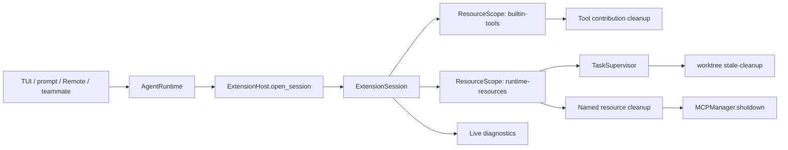
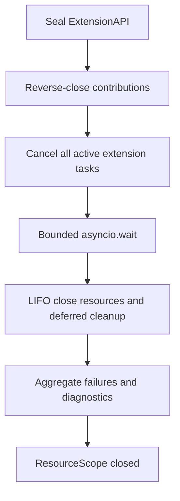
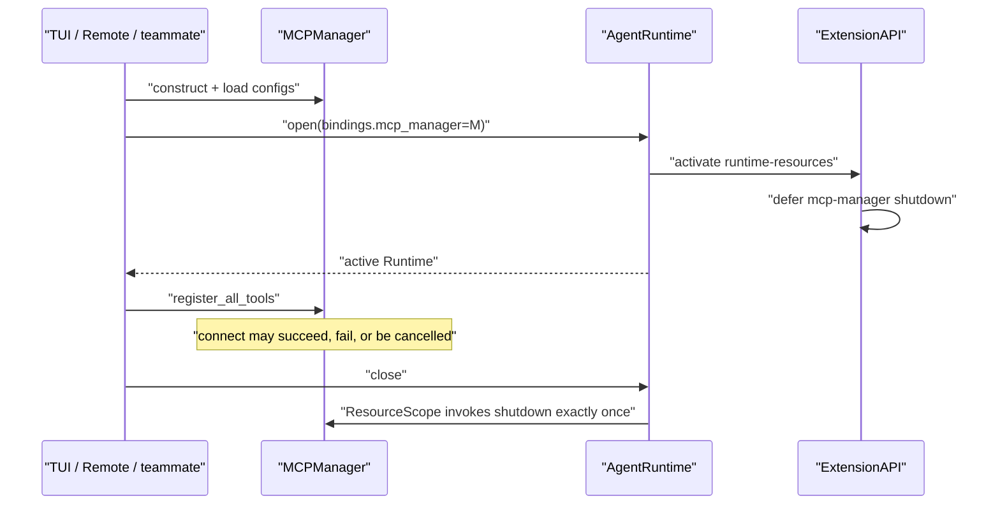

# MewCode 候选设计：ResourceScope 与 TaskSupervisor（原阶段 2A）

> 路线状态更新（2026-08-16）：在补充 Agent Loop 材料并对照 TUI/Remote/Core 的运行中输入行为后，当前阶段 2A 已改为 `RunControl`。本文设计证据和 Interface 继续保留，但实施顺延到候选阶段 2C；文内 2A0–2A5 是原批次编号，真正开发前统一重编号并重新审批。

> - 状态：Design v1.0，等待开发授权
> - 日期：2026-08-16
> - 前置条件：[阶段 1：ExtensionHost 内置 Tool 纵向切片](./mewcode-extension-host-stage1-design.md)已完成
> - 主路线：[MewCode Runtime 迭代设计](./mewcode-pi-inspired-runtime-design.md)
> - 实施方法：设计先行，完整切片实现后补行为验证；不采用 red-green-refactor TDD

## 1. 结论

阶段 2A 只做一件事：

> 让每个 Extension 实例拥有一个真正的 ResourceScope，由它统一撤销贡献、取消并等待扩展后台任务、关闭文件或连接，并把所有清理错误汇总成可观察诊断。

本阶段不迁 Command，不做 EventPipeline，也不开放动态扩展发现或 reload。

这是对 Stage 1 现有 ExtensionSession seam 的纵向深化，不是另加一层生命周期包装。完成后：

- 扩展不再需要自己保存 cleanup 列表或裸 `asyncio.Task`；
- MCPManager 在开始连接前就归属于 Runtime，连接取消或异常不会留下失主 client；
- TUI 的 worktree stale-cleanup 任务由 Runtime 取消并等待；
- 一个 cleanup 失败不会阻止剩余资源关闭；
- Runtime 关闭后可以说明哪个 extension 的哪个资源或任务失败、超时或泄漏。

## 2. 为什么先做资源和任务，不先做 Command

主路线初稿把 Command、资源和任务都放在原 Stage 2A。Stage 1 完成后的真实代码证据表明，它们不适合绑成一个批次。

| 候选切片 | 当前真实问题 | Depth 与独立价值 | 决定 |
| --- | --- | --- | --- |
| ResourceScope + TaskSupervisor | MCP connect 前无 owner、TUI stale task 只 cancel 不等待、Hook async task 无跟踪 | 直接深化 per-extension scope；统一回滚、关闭、超时和诊断 | 本阶段实施 |
| Command 所有权 | 无 owner/handle/unregister，Skill 刷新直接改 Registry 私有字段 | 有价值，但牵涉 TUI/Remote profile、CommandContext 和 Skill 刷新语义 | 拆到 2C |
| EventPipeline | async Hook 未跟踪，Run/Session 事件混用 | 有价值，但 TaskSupervisor 是其前置依赖 | 保持 2B |

删除测试也支持这个选择：如果删除 ResourceScope，AsyncExitStack、task list、取消超时、反向关闭和错误汇总会重新散落到 Host、TUI、Remote、teammate 和 MCP 路径；它不是 pass-through Module。

## 3. 当前代码证据

### 3.1 Stage 1 已经有正确 seam，但 Implementation 还浅

`koko_pi_agent/extensions/host.py` 已经为每个 ExtensionDefinition 创建独立 `AsyncExitStack`，然后把 extension scope 反向压入 session scope。

这已经证明：

- owner 粒度应该是“当前 Runtime 中的一次 extension 激活”；
- installer 中途失败可以局部回滚；
- Session 可以按 extension 激活逆序关闭；
- ExtensionAPI 可以统一做 phase guard。

但裸 AsyncExitStack 目前只保存 Tool RegistrationHandle，缺少：

- 资源名称和类型；
- 后台任务跟踪；
- 取消超时；
- cleanup 失败的结构化诊断；
- capability、task、resource 的安全关闭顺序；
- 并发 close 的 exact-once 保证。

### 3.2 MCP 存在“连接开始了，owner 还没建立”的窗口

TUI、Remote 和 external teammate 当前都是：

1. Runtime 已经 active；
2. 在入口函数中局部创建 MCPManager；
3. `await manager.register_all_tools(...)`；
4. 成功后才把 manager 保存到入口字段或局部 finally owner。

如果第 3 步被取消或抛出未预期异常，manager 可能在赋值前丢失，而它内部已经建立了部分 client/transport。

阶段 2A 改成：先创建 manager 并通过 ResourceScope 登记 `shutdown()`，再开始连接。

### 3.3 TUI stale-cleanup 是真实的长生命周期任务

`koko_pi_agent/app.py` 当前直接 `asyncio.create_task(start_stale_cleanup_task(...))`：

- provider 切换时只 cancel，没有 await；
- App 退出时只 cancel，没有确认任务结束；
- 任务没有 extension/source/name 诊断；
- 任务异常由 coroutine 内部日志吸收，Runtime 不知道它是否仍在运行。

它适合作为 TaskSupervisor 的第一个生产 Adapter。

### 3.4 TaskManager 不是本阶段的 TaskSupervisor

`koko_pi_agent/agents/task_manager.py` 管理的是用户可见后台 Agent 作业，包含结果、token、mailbox、通知和业务状态。

TaskSupervisor 管理的是扩展拥有的协程生命周期，只关心：

- 谁创建；
- 叫什么；
- 是否完成或失败；
- 关闭时能否响应取消；
- 是否留下异常或泄漏。

两者名字接近，但 Interface 和 owner 完全不同，不能合并。

## 4. 目标、非目标与完成定义

### 4.1 目标

1. 每个 extension 激活实例拥有独立 ResourceScope。
2. ExtensionAPI 可以托管同步/异步 context manager、旧式 cleanup 和扩展后台协程。
3. installer 失败、取消或 Session 正常关闭时都执行确定的回滚。
4. cleanup 失败不阻止其他清理，并在最后统一报告。
5. task 异常一定被读取，不产生 `Task exception was never retrieved`。
6. 关闭对不响应取消的 task 有界等待，不无限挂起。
7. MCPManager 与 TUI stale-cleanup 通过真实 Adapter 接入。
8. Stage 0/1 的 Tool、Run、入口和多 Agent 行为不回归。

### 4.2 非目标

- 不修改 CommandRegistry 或内置 Command 装配。
- 不新增 Observer、Interceptor 或万能 `emit()`。
- 不迁移 HookEngine 的事件语义；只为后续 2B 提供 TaskSupervisor 地基。
- 不接入 Markdown Command loader、Python package entry point 或项目本地扩展。
- 不开放 active phase 动态登记资源。
- 不实现 Runtime replacement、generation 切换或热重载。
- 不把所有 App/Agent/Run 的裸 task 一次迁入 TaskSupervisor。
- 不声称可以强制终止吞掉 `CancelledError` 的 Python coroutine。
- 不修改配置格式、Session JSONL、Tool 名称或 Tool Schema。

### 4.3 完成定义

同时满足以下条件才算 Stage 2A 完成：

- ResourceScope 是唯一 per-extension cleanup Implementation；
- ExtensionAPI 只有 `register_tool/acquire/defer/start_task` 四类能力；
- MCP manager 在连接开始前已有 Runtime owner；
- TUI 不再持有 `_stale_cleanup_task`；
- migrated entries 不直接调用 MCPManager.shutdown；
- Session/Runtime 并发或重复关闭不会重复 cleanup；
- task failure、cancel timeout、cleanup failure 和 leak 都有来源诊断；
- Stage 2 目标矩阵、Stage 0/1 回归和全量测试通过。

## 5. 总体架构



入口仍只创建 AgentRuntime。它不直接创建 ResourceScope，也不维护 extension task 列表。

## 6. 外部 Interface

### 6.1 ExtensionAPI

```python
class ExtensionAPI:
    @property
    def context(self) -> SessionContext: ...

    def register_tool(self, tool: Tool) -> RegistrationHandle: ...

    async def acquire(
        self,
        name: str,
        manager: ContextManager[T] | AsyncContextManager[T],
    ) -> T: ...

    def defer(
        self,
        name: str,
        cleanup: Callable[[], object | Awaitable[object]],
    ) -> None: ...

    def start_task(
        self,
        name: str,
        awaitable: Awaitable[None],
    ) -> ExtensionTaskHandle: ...
```

设计理由：

- `acquire()` 始终 `await`，内部识别同步或异步 context manager；调用方不需要学习两套近似方法。
- `defer()` 兼容尚未实现 context-manager Interface 的旧资源，如 MCPManager。
- `start_task()` 返回只读 Handle，不把原始 asyncio.Task 暴露给扩展。
- ResourceScope 不作为 ExtensionAPI 的公开属性，避免扩展越过 phase guard 操作底层账本。

### 6.2 ExtensionTaskHandle

Handle 只提供观察能力：

```python
class ExtensionTaskHandle(Protocol):
    @property
    def name(self) -> str: ...

    @property
    def done(self) -> bool: ...

    @property
    def status(self) -> str: ...
```

本阶段不提供公开 `cancel()`。任务的 owner 是 Runtime；扩展若需要业务级停止，应通过自己拥有的 Event 或资源协议让协程自然结束。

### 6.3 Phase guard

四类 API 都只允许在 `activating` 调用：

| API state | register/acquire/defer/start_task |
| --- | --- |
| activating | allowed |
| active | rejected with ExtensionPhaseError |
| closing | rejected with ExtensionPhaseError |
| closed | rejected with ExtensionPhaseError |

这样保持 Stage 1 的 sealed API，不提前承担 reload 和 stale API 问题。

## 7. ResourceScope：深 Module

### 7.1 Interface 与 Implementation

ResourceScope 是 Host 内部 Module。外部调用方不构造、不注入，也不测试其私有列表。

它内部维护三类账本：

1. contribution cleanup：Tool Handle，未来可接 Command/Event Handle；
2. TaskSupervisor：扩展后台协程；
3. resource cleanup：context manager 和 defer callback。

每项内部记录：

- extension_id；
- source；
- kind；
- human-readable name；
- registration sequence；
- cleanup operation。

### 7.2 为什么不继续使用一个裸 AsyncExitStack

单个 ExitStack 只能表达“严格 LIFO”，不能表达本阶段需要的安全类别顺序：

1. 先撤销可调用能力；
2. 再停止会使用资源的后台任务；
3. 最后关闭连接、文件和其他资源。

ResourceScope 可以在内部继续用 AsyncExitStack 管理普通资源，但贡献与任务需要独立账本。

### 7.3 关闭顺序



第一次 close 无论是否有失败，都最终进入 closed。重复 close 不重复调用任何 cleanup。

## 8. TaskSupervisor

### 8.1 职责

- 用 extension ID、任务名和 sequence 包装 task；
- 保存 active task；
- done 时读取异常；
- 把非取消异常写入实时 diagnostics；
- Session 关闭时批量 cancel；
- 在统一 timeout 内等待；
- 报告不响应取消的 task；
- closing/closed 后拒绝新 task。

### 8.2 为什么不用 TaskGroup

TaskGroup 适合一个词法代码块内共同成功或失败的并发。扩展后台任务可能跨越许多 Agent Run，生命周期由 Session 而不是 installer 的代码块决定，因此 Runtime 必须长期持有 supervisor。

### 8.3 有界关闭算法

```python
for task in active_tasks:
    task.cancel()

done, pending = await asyncio.wait(active_tasks, timeout=cancel_timeout)

for task in done:
    consume_result_or_exception(task)

for task in pending:
    record_cancel_timeout_and_leak(task)
```

不用逐个 `wait_for(task)`：某些协程吞掉取消时，逐个等待会让总关闭时间不受控。

### 8.4 任务失败策略

后台任务失败默认把 Runtime 标记为 degraded diagnostic，但不自动关闭 Runtime。

原因：自动关闭需要一个新的 supervisor-to-runtime 控制面，还必须定义 UI/Remote 如何通知用户、是否重启，以及 critical/optional task 策略。当前没有第二个真实需求，不提前铺 Interface。

如果 installer 必须等待资源 ready，它应在返回前显式 await readiness；不能把 `start_task()` 当作启动成功证明。

## 9. 错误与诊断

### 9.1 合同

`ExtensionDiagnostic` 增加带默认值的兼容字段：

```python
@dataclass(frozen=True)
class ExtensionDiagnostic:
    extension_id: str
    source: str
    status: str
    error: str = ""
    kind: str = "extension"
    name: str = ""
    phase: str = ""
```

新增：

```python
@dataclass(frozen=True)
class ExtensionCleanupFailure:
    extension_id: str
    source: str
    kind: str
    name: str
    error: str

class ExtensionCloseError(RuntimeError):
    failures: tuple[ExtensionCleanupFailure, ...]
```

### 9.2 status

| status | 含义 |
| --- | --- |
| activated / failed | 保留 Stage 1 语义 |
| task_failed | 后台任务非取消异常 |
| task_cancel_timeout | 关闭等待超时 |
| cleanup_failed | 某个 named cleanup 抛错 |
| resource_leaked | 关闭后仍存活或无法确认关闭 |
| leaked | 保留 Stage 1 未拥有 Tool contribution 诊断 |

### 9.3 聚合原则

- 所有 scope 和所有 cleanup 都执行后才构造 ExtensionCloseError；
- Session 和 Runtime 在抛出聚合错误前已经进入 closed；
- 第二次 close 无副作用，不重复抛第一次错误；
- installer 的原始异常或 CancelledError 不能被 rollback cleanup 错误遮蔽；rollback 错误进入 diagnostics。

AgentRuntime 的 diagnostics 改为每次读取时组合 Session 实时诊断与 Runtime-local leak 诊断，不能只复制 open 时快照。

## 10. RuntimeProfile 命名

Stage 1 的 `ToolProfile` 已经开始决定整个 Runtime 的角色。Stage 2A 增加非 Tool definition 后，继续叫 ToolProfile 会误导调用方。

本阶段引入：

```python
class RuntimeProfile(str, Enum):
    TUI_LEAD = "tui_lead"
    PROMPT_LEAD = "prompt_lead"
    REMOTE_LEAD = "remote_lead"
    TEAMMATE_WORKER = "teammate_worker"

ToolProfile = RuntimeProfile
```

生产代码逐步改用 RuntimeProfile；ToolProfile 作为兼容别名保留，不改变字符串值、配置或 profile 行为。

## 11. 两个生产 Adapter

### 11.1 `mewcode.runtime-resources` Definition

Catalog 在 `mewcode.builtin-tools` 后增加第二个 Definition：

```text
mewcode.builtin-tools
mewcode.runtime-resources
```

它读取 BuiltinRuntimeBindings 中两个可选依赖：

- `mcp_manager`；
- `stale_cleanup_factory`。

没有对应 binding 的 profile 是合法 no-op，不改变 Tool 清单。

### 11.2 MCPManager Adapter



MCP Tool 的动态 RegistrationHandle 仍由 MCPManager 保存。ResourceScope 只获得 manager/client 的关闭所有权，不开放 active phase register_tool。

### 11.3 Worktree stale-cleanup Adapter

TUI 在创建 bindings 时提供 coroutine factory。`mewcode.runtime-resources` 激活时调用：

```python
api.start_task("worktree-stale-cleanup", bindings.stale_cleanup_factory())
```

provider 切换和 App 退出只关闭 Runtime；TaskSupervisor 负责 cancel、wait 和诊断。App 不再保存 `_stale_cleanup_task`。

## 12. 生命周期不变量

1. `open_session()` 成功前 Runtime 不可见。
2. 每个 extension 一个 ResourceScope，不跨 Runtime 或 generation 共享。
3. API active 后 sealed；不能晚注册资源或 task。
4. Runtime 先拒绝新 Run并等待 active AgentRun 结束，再关闭 Session。
5. 同一 Session 并发 close 汇合到一次 cleanup。
6. MCP init task 在 manager shutdown 前必须先取消并等待，不能让 connect/shutdown 无序并发。
7. contribution 被撤销后才取消 task；task 停止后才关闭底层资源。
8. cleanup failure 不阻止后续 cleanup。
9. close 结束后状态一定 closed，即使向调用方抛出聚合错误。
10. 两个 Runtime 的 scope、task、resource 和 diagnostics 互不影响。

## 13. 非 TDD 实施计划

用户已明确要求开发阶段不用 TDD。本阶段采用：

> 设计冻结 -> 基线确认 -> 完整实现一个批次 -> diff 审查 -> 补/改 Interface 测试 -> 目标回归 -> 累积回归。

不安排预期失败测试，也不执行 red-green-refactor 循环。

### 2A0：冻结基线

步骤：

1. 确认 Stage 1 当前分支、HEAD、changed-file manifest 和 `669 passed` 基线。
2. 推荐先把 Stage 1 形成独立 commit；没有用户授权时不自动提交。
3. 若仍在同一未提交工作树开发，必须记录 Stage 2 文件清单并逐批审计 diff。

理由：当前 Stage 1 实现仍未提交，并与用户已有学习材料共存；没有基线就无法准确回滚 Stage 2。

退出条件：Stage 1 行为基线与工作区边界明确。

### 2A1：ResourceScope 与 TaskSupervisor 核心

文件：

- 新增 `koko_pi_agent/extensions/resources.py`；
- 修改 `koko_pi_agent/extensions/contracts.py`；
- 修改 `koko_pi_agent/extensions/__init__.py`；
- 实现完成后新增 `tests/test_extension_resources.py`。

步骤：

1. 增加 RuntimeProfile 兼容命名和 task/cleanup/error contracts。
2. 实现 named resource ledger、TaskSupervisor、分类关闭和超时诊断。
3. 完成实现后，从公开 Interface 验证 acquire/defer/task/close 行为。

理由：先独立完成生命周期核心，再让 Host 和入口接入，降低组合根迁移噪声。

退出条件：resource Interface 测试通过，Host 尚未改变。

### 2A2：接入 Host、Session 与 AgentRuntime

文件：

- `koko_pi_agent/extensions/host.py`；
- `koko_pi_agent/runtime/agent_runtime.py`；
- 必要时 `koko_pi_agent/runtime/__init__.py`；
- 实现后更新 `tests/test_extensions.py`、`tests/test_runtime_composition.py`。

步骤：

1. 用 ResourceScope 替换 per-extension 裸 AsyncExitStack。
2. 给 ExtensionAPI 增加 acquire/defer/start_task。
3. Session 增加并发幂等关闭和聚合错误。
4. 保留原始启动/取消异常，rollback 错误只进 diagnostics。
5. Runtime diagnostics 改成实时组合。
6. 实现后补齐启动回滚、取消、关闭失败、隔离和实时诊断验证。

理由：所有复杂度留在现有 Host/Session seam，入口不认识资源账本。

退出条件：Stage 1 Host/Runtime 行为和 Stage 2 resource 行为一起通过。

### 2A3：增加真实 runtime-resources Definition

文件：

- `koko_pi_agent/extensions/builtins.py`；
- 实现后更新 `tests/test_runtime_composition.py`。

步骤：

1. BuiltinRuntimeBindings 增加可选 mcp_manager 与 stale_cleanup_factory。
2. Catalog 增加 `mewcode.runtime-resources`。
3. manager 用 defer 托管；stale task 用 start_task 托管。
4. 不连接 MCP，不改变 ToolProfile 清单。

理由：用两个真实 Adapter 证明 Module Depth，不用假扩展或测试专用生产代码。

退出条件：真实内置 Runtime 关闭后没有 owned task/resource。

### 2A4：迁移 TUI、Remote 与 external teammate

文件：

- `koko_pi_agent/app.py`；
- `koko_pi_agent/remote.py`；
- `koko_pi_agent/__main__.py`；
- 必要时最小修改 `koko_pi_agent/mcp/manager.py`；
- 实现后更新 TUI/Remote/teammate/MCP 入口测试。

步骤：

1. Runtime open 前创建 MCPManager、加载 config 并注入 bindings。
2. 现有 connect 函数复用 manager，不再创建局部无 owner manager。
3. TUI 仍先取消并等待 App-owned MCP init task，再关闭 Runtime。
4. 删除入口 direct manager.shutdown；Runtime close 后清空兼容引用。
5. 把 stale cleanup 改成 binding factory，删除 App task 字段和取消路径。
6. 实现后验证 provider switch、connect cancellation、exact-once close 和 teammate cancellation。

理由：先建立 owner，再做可能失败的连接，关闭当前泄漏窗口。

退出条件：四个 Runtime profile 和入口生命周期目标测试通过。

### 2A5：删除旧路径并全量验证

步骤：

1. 删除 obsolete direct shutdown、stale task owner 和重复 cleanup 代码。
2. 实现后补少量边缘行为验证：吞取消超时、并发 close、多错误聚合、Runtime 隔离。
3. 运行目标、Stage 0/1 回归、全量、Ruff、compileall 和结构检查。
4. 把实际测试数字和偏差写回本文与主路线。

理由：如果保留两套 owner，会产生 double close 和相互矛盾的诊断。

退出条件：全部 gate 通过，Stage 2A 状态才能改为 Implemented。

## 14. 预计文件影响

| 文件 | 修改 | 理由 |
| --- | --- | --- |
| `koko_pi_agent/extensions/resources.py` | 新深 Module | 隐藏任务、资源、顺序、超时和诊断复杂度 |
| `koko_pi_agent/extensions/contracts.py` | profile/task/error/diagnostic contracts | 让生命周期事实类型化 |
| `koko_pi_agent/extensions/host.py` | API 与 ResourceScope 集成 | 保持唯一激活/回滚/关闭 seam |
| `koko_pi_agent/extensions/builtins.py` | runtime-resources Definition | 接入真实 Adapter |
| `koko_pi_agent/runtime/agent_runtime.py` | 实时诊断、关闭聚合 | 让 post-activation failure 可见 |
| `koko_pi_agent/app.py` | MCP pre-owner、stale task 迁移 | 删除 TUI 直接资源 owner |
| `koko_pi_agent/remote.py` | MCP pre-owner | 修复连接失败窗口 |
| `koko_pi_agent/__main__.py` | teammate MCP pre-owner | 统一 external teammate 生命周期 |
| `koko_pi_agent/mcp/manager.py` | 仅必要的幂等/诊断兼容 | 不移动连接业务逻辑 |
| `tests/test_extension_resources.py` | 实现后 Interface 验证 | 只跨公开 seam 测行为 |
| 现有 Runtime/入口测试 | 实现后回归更新 | 验证真实 Adapter 和兼容性 |

明确不修改：CommandRegistry、HookEngine、配置 schema、Session JSONL 和学习示例。

## 15. 实现后验证矩阵

### 15.1 ResourceScope

- sync context 正常进入与退出；
- async context 正常进入与退出；
- defer 同步与异步 cleanup；
- 资源 LIFO；
- contribution -> task -> resource 类别顺序；
- 第一个 cleanup 失败后其他 cleanup 仍执行；
- 并发/重复 close exact-once；
- active/closed API 拒绝登记。

### 15.2 TaskSupervisor

- 正常完成被读取；
- 抛错产生 task_failed diagnostic；
- Session close 取消并等待；
- CancelledError 不记为失败；
- 吞取消超过 timeout 产生 timeout/leak；
- 没有 never-retrieved exception；
- Runtime A close 不影响 Runtime B。

### 15.3 真实 Adapter

- MCP connect 前 manager 已被 ResourceScope 托管；
- connect 失败/取消后 Runtime close 仍 shutdown；
- manager shutdown 先撤销 MCP Tool Handle，再关 client；
- TUI provider switch 取消旧 stale cleanup，只保留新 Runtime task；
- Remote 和 teammate finally 不 double close manager；
- prompt profile 不凭空增加资源或行为。

### 15.4 回归命令

```bash
.venv/bin/pytest tests/test_extension_resources.py tests/test_extensions.py tests/test_runtime_composition.py tests/test_tui_runtime_adapter.py tests/test_remote_runtime_adapter.py tests/test_teammate_registry.py tests/test_mcp.py tests/test_agent_runtime.py tests/test_tool_pipeline.py tests/test_agent.py -q
.venv/bin/pytest -q
uvx ruff check --select E9,F63,F7,F82 mewcode tests
.venv/bin/python -m compileall -q mewcode tests
git diff --check
```

结构检查：

- ExtensionAPI 不出现 Command/Event/reload 方法；
- migrated entries 不直接调用 MCPManager.shutdown；
- TUI 不再存在 `_stale_cleanup_task` owner；
- ResourceScope 是唯一 per-extension cleanup Implementation；
- HookEngine 的 `ensure_future()` 明确仍属于 2B，不能误报已修复。

## 16. 风险与缓解

| 风险 | 缓解 |
| --- | --- |
| ResourceScope 与旧 AsyncExitStack double close | 2A2 一次替换 per-extension scope，2A5 搜索并删除旧路径 |
| MCP connect 与 shutdown 并发 | 入口先取消并等待 init task，再关闭 Runtime |
| task 吞取消导致退出挂死 | 批量 cancel + bounded asyncio.wait + leak diagnostic |
| cleanup 异常遮蔽原始启动取消 | 原始异常优先传播，rollback error 只进 diagnostics |
| 实时 diagnostic 仍被 Runtime 快照冻结 | Runtime property 动态组合 Session 与 local diagnostics |
| RuntimeProfile 重命名造成大面积破坏 | 字符串值不变，保留 ToolProfile alias，分批迁生产引用 |
| 不用 TDD 导致行为遗漏 | 先冻结 Interface 和矩阵；每批实现后立即补行为验证并跑累积回归 |
| Stage 1 未提交导致范围混淆 | 2A0 先冻结 manifest；推荐单独 commit，但不未经授权提交 |

## 17. 审批门

设计阶段已确定：

- [x] Stage 2A 只做 ResourceScope + TaskSupervisor。
- [x] Command 拆到后续 2C，EventPipeline 保持 2B。
- [x] API 仍只允许激活期登记。
- [x] MCP shutdown 与 TUI stale-cleanup 是两个生产 tracer bullet。
- [x] 开发不采用 TDD，但保留实现后 Interface 测试和全量回归。
- [x] 本轮只改文档与 planning 文件。

进入生产代码开发前仍需：

- [ ] 用户明确授权按 2A0–2A5 开发。
- [ ] 确认如何冻结当前未提交的 Stage 1 基线；不会自动 commit/push。

## 18. 当前结果

阶段 2A 已完成范围选择、Interface、生命周期、Adapter、分批实施和验证设计。本轮没有修改 `koko_pi_agent/` 生产代码或测试代码。
