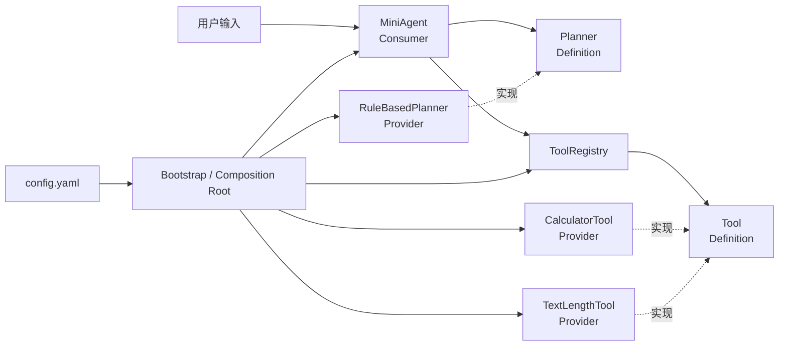
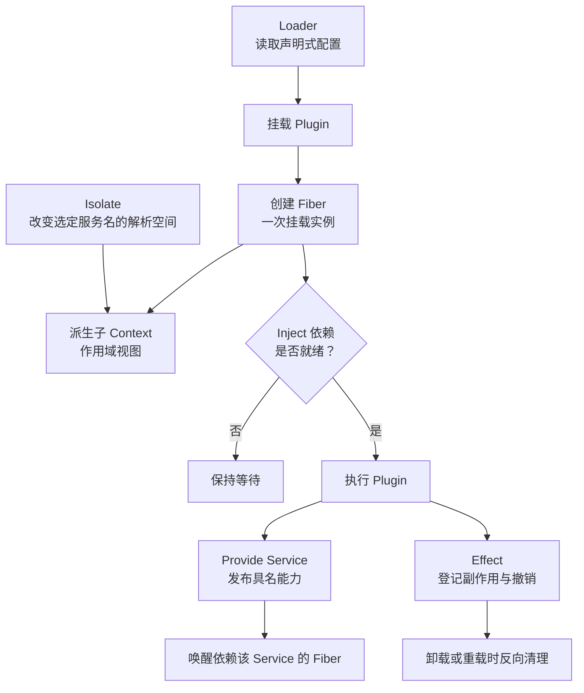
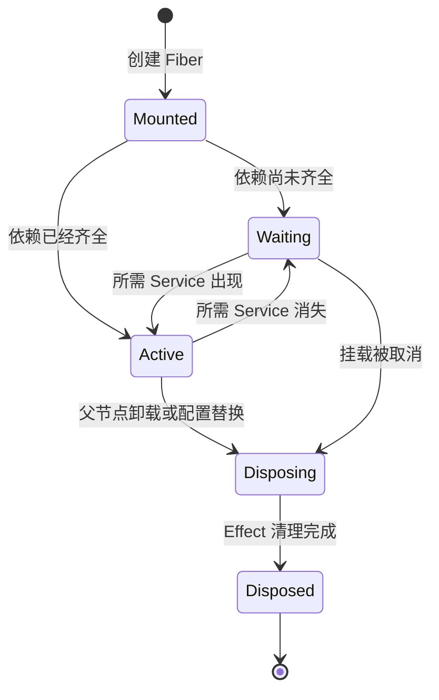
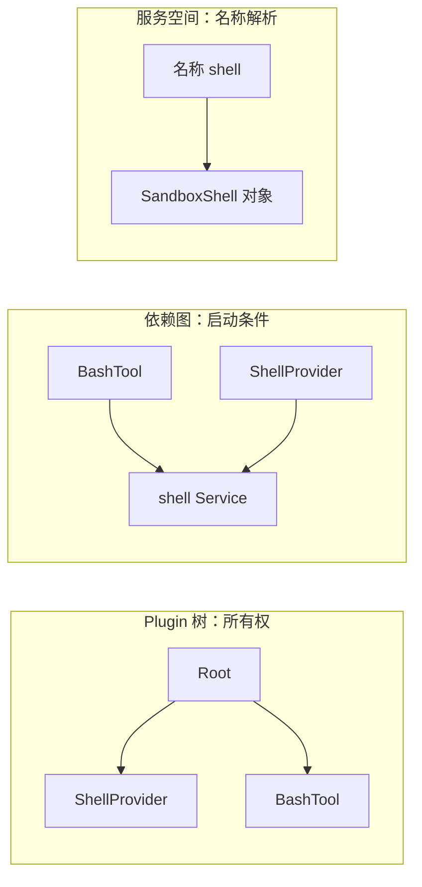
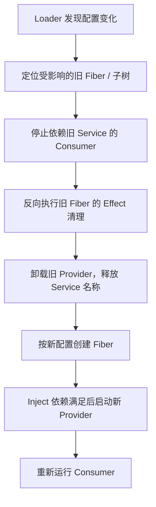
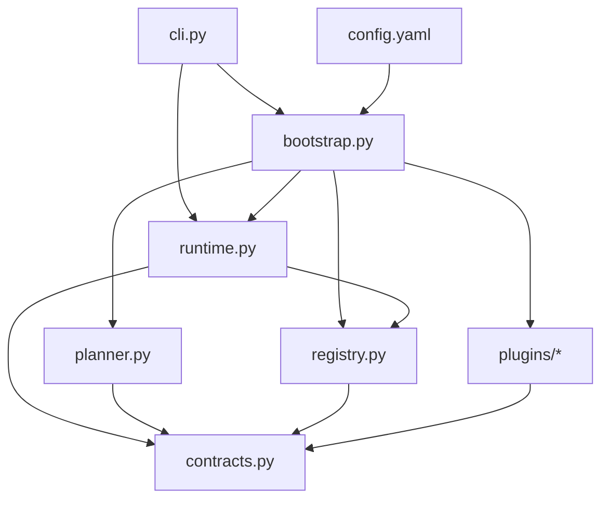
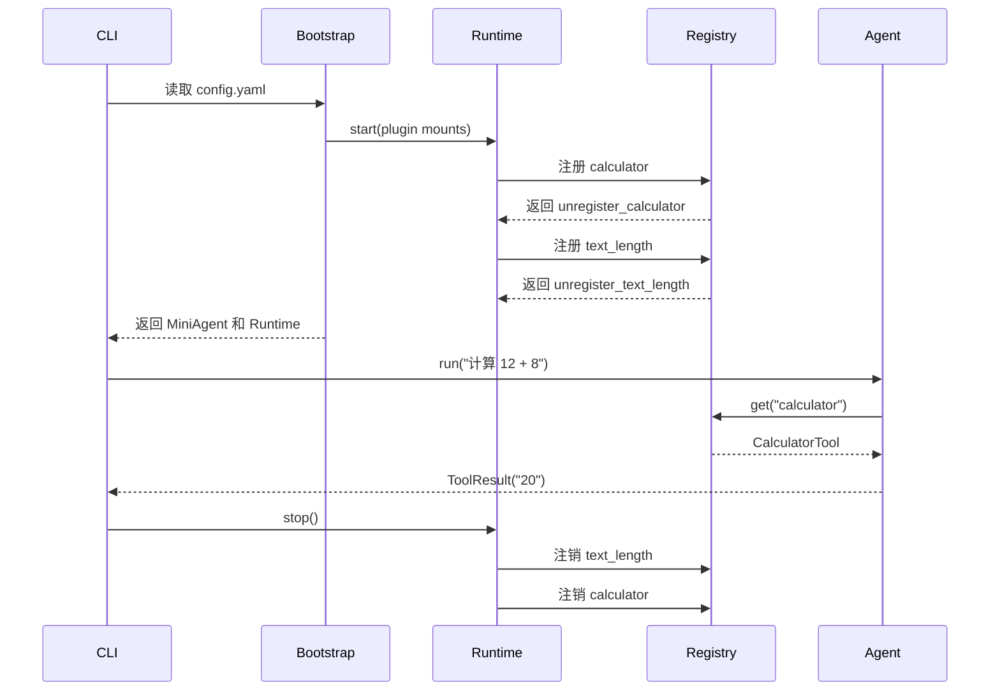

# Mini Plugin Agent：面向 Python 新手的插件化编程学习设计

> - 状态：Design v0.3（通俗概念说明阶段，暂不实施源码）
> - 面向读者：掌握 Python 函数、类、字典和异常基础的学习者
> - 案例定位：独立、可测试、不调用真实大模型的教学项目
> - 对应思想：Definition / Provider / Consumer、依赖注入、注册表、可逆生命周期、配置组合

> 继续阅读：如果要把这些学习概念应用到当前 MewCode，请看[《MewCode Runtime 迭代设计：参考 Pi，而不是实现 Mini Pi》](./mewcode-pi-inspired-runtime-design.md)。该文以 MewCode 为主体，是生产架构规划，不代表已经批准实施。

## 1. 为什么设计这个案例

Cordis 和 DeepSeek Harness 展示的是一套成熟的插件运行时。直接模仿它的 Fiber、热重载、隔离和依赖调度，对新手来说跨度太大。

本案例先实现一个小型命令行 Agent：用户输入自然语言格式的简单命令，Planner 决定调用哪个 Tool，Agent 从注册表找到 Tool 并执行。它不依赖真实模型，因此每次执行都是确定的，学习者可以把注意力放在程序设计上。

完成案例后，读者应该能回答：

1. 接口、实现和使用者为什么要分开？
2. 为什么依赖应该从外部传入？
3. 注册表比大量 `if/elif` 好在哪里？
4. 为什么注册能力时还要设计注销能力？
5. 配置如何决定一个 Agent 最终拥有哪些工具？
6. 这些概念在 MewCode 中分别对应哪些真实代码？

## 2. 学习目标与非目标

### 2.1 学习目标

- 使用 `Protocol` 或抽象基类定义稳定契约。
- 使用 Provider 提供不同实现。
- 使用依赖注入组装对象，不在业务类内部偷偷创建依赖。
- 使用字典实现 Tool 注册表，并对重复注册快速失败。
- 使用“注册返回注销函数”的方式管理副作用。
- 使用 `start()` / `stop()` 建立清晰生命周期。
- 使用 YAML 配置选择需要加载的插件。
- 使用单元测试验证契约、冲突处理和资源回收。
- 能用自己的话区分 Context、Fiber、Service、Inject、Effect、Loader 和 Isolate。
- 能解释插件树、依赖图和服务解析空间为什么不是同一个东西。

### 2.2 第一版暂不实现

- 不连接 OpenAI、Anthropic 或其他大模型 API。
- 不实现自动扫描目录和动态 `import`。
- 不实现并发、流式输出、MCP 或多 Agent。
- 不实现 Cordis 式依赖图调度、热重载和 Session 隔离。
- 不修改 MewCode 当前生产代码。
- 本轮不创建 `examples/mini_plugin_agent/` 下的任何源码；文中的代码仅是设计 Demo。

这些能力会放在案例完成后的进阶路线中，避免同时学习太多概念。

## 3. 最终使用效果

启动：

```bash
uv run python -m examples.mini_plugin_agent.cli
```

交互示例：

```text
Mini Plugin Agent 已启动，可用工具：calculator, text_length

你：计算 12 + 8
Agent：20

你：统计字数 插件系统
Agent：4

你：查询天气 上海
Agent：无法为这条输入选择工具

你：exit
Mini Plugin Agent 已停止，所有插件均已注销
```

它虽然还没有大模型，但已经拥有 Agent Harness 的最小骨架：

```text
输入 → 规划调用 → 查找工具 → 执行工具 → 返回结果
```

## 4. 总体架构



这里有三类角色：

| 角色 | 案例中的对象 | 责任 |
| --- | --- | --- |
| Definition | `Tool`、`Planner` | 定义能力和输入输出，不决定具体实现 |
| Provider | `CalculatorTool`、`TextLengthTool`、`RuleBasedPlanner` | 提供具体实现 |
| Consumer | `MiniAgent` | 使用能力，只依赖 Definition |

`Bootstrap` 是唯一知道所有具体实现的地方，也叫 Composition Root（组合根）。

先用日常语言记住它们：

- Definition（契约）：统一的插座规格，规定什么形状、怎么通电；
- Provider（提供方）：生产符合插座规格的具体设备；
- Consumer（使用方）：只管使用插座，不关心背后是哪家设备厂商；
- Composition Root（组合根）：总装配台，负责决定这次把哪些具体设备连接起来。

“依赖抽象”可以理解为：Consumer 依赖稳定的插座规格，而不是把某一家厂商的电线焊死在自己身上。

## 5. Cordis 核心概念：先理解运行时，再设计教学版

本节基于博客文章[《Cordis 在做什么：从 DeepSeek Harness 看》](https://blog.antinomie.org/)中的机制描述。原文分析的是固定版本的 DeepSeek Harness 与 Cordis；本节用面向 Python 新手的语言重新组织概念。

除非特别说明，下面的代码都是“Cordis 风格教学伪代码”，用于说明关系，不保证可以直接复制到 Cordis 项目中运行。

### 5.1 先建立一张总图



一句话版本：

> Loader 决定挂什么，Fiber 记录一次挂载的生命，Context 决定它能看见什么，Service 表示共享能力，Inject 决定何时能启动，Effect 保证如何干净退出，Isolate 决定同名服务是否共享。

核心术语速查：

| 概念 | 最短定义 | 它主要回答的问题 |
| --- | --- | --- |
| Plugin | 被运行时加载的一段组件代码 | “要运行哪段能力代码？” |
| Context | 插件所在节点的作用域视图和操作入口 | “这个插件在哪里，能看到哪些服务？” |
| Fiber | 某个 Plugin 的一次具体挂载实例 | “这一次挂载现在是什么状态，拥有哪些资源？” |
| Service | 通过名称共享的能力对象 | “其他插件通过什么稳定入口使用能力？” |
| Inject | Plugin 对所需 Service 的声明 | “什么条件满足后才能启动？” |
| Effect | 与 Fiber 生命周期绑定的可撤销副作用 | “卸载时如何恢复干净状态？” |
| Loader | 把配置转换成插件树的编排器 | “配置如何变成正在运行的系统？” |
| Isolate | 为选定 Service 创建独立解析空间 | “哪些 Session 或子树不应共享同名服务？” |

#### 用“商场开店”一次记住这些词

假设我们在管理一座允许店铺随时开业、停业和换品牌的商场：

| 技术术语 | 通俗说法 | 商场比喻 |
| --- | --- | --- |
| Plugin | 一份可被系统加载的功能方案 | 某个品牌的开店方案 |
| Plugin Runtime | 管理同一份 Plugin 代码的运行记录 | 品牌总部保存所有分店名单 |
| Fiber | Plugin 的一次具体运行实例 | 这个品牌在三楼开的某一家具体分店 |
| Context | 当前实例的位置和资源访问范围 | 分店的铺位、门禁卡和能使用的商场设施 |
| Service | 通过稳定名称找到的公共能力 | 名为“仓库”“收银”“保安”的商场服务 |
| Provider | 提供 Service 的组件 | 真正运营仓库或保安服务的公司 |
| Consumer | 使用 Service 的组件 | 使用仓库或保安服务的店铺 |
| Inject | 开始营业前必须具备的条件清单 | 有电、有收银系统后才能开门 |
| Effect | 做事时同时登记怎样撤销 | 入驻时登记招牌和设备，退租时按清单拆除 |
| Dispose | 执行一次撤销或清理 | 关店、拆招牌、归还钥匙 |
| Loader | 根据配置创建 Plugin 树 | 按商场规划图安排哪些店开在哪一层 |
| Registry | 按名称查找对象的登记表 | 商场服务台的店铺和服务通讯录 |
| Isolate | 给某些 Service 单独划分空间 | 每家店拥有自己的收银账本，不与邻店混用 |
| Hot Reload | 不中断整个系统地替换局部组件 | 商场不停业，只关闭并重新装修其中一家店 |

这套比喻只帮助记忆，不是严格等价：

- Fiber 不是工作人员，也不是计算机线程，而是“一次挂载”的运行时记录；
- Context 不是真实房间，而是代码能够看到和操作哪些资源的范围；
- Isolate 只是分开 Service 的名称解析，不自动提供文件、网络或 Shell 安全保护。

### 5.2 Plugin：被加载的代码单位

> 通俗说：Plugin 像一份“开店方案”。方案说明开店需要什么、开门后做什么、关店时清理什么。

Plugin 不是某一种固定的业务能力。它是 Cordis 能够挂载、等待、启动和卸载的代码单位，可以用函数、类或带 `apply` 的对象表达。

一个 Plugin 通常包含三类信息：

- 依赖声明，例如需要 `tools` 和 `planner`；
- 配置约束，例如超时时间必须是正数；
- 启动逻辑，例如发布服务、注册工具或订阅事件。

Cordis 风格伪代码：

```ts
export const inject = ["tools"]

export function apply(ctx, config) {
  ctx.tools.register(new CalculatorTool(config.precision))
}
```

这段代码表达的是：

1. 当前 Plugin 需要 `tools` Service；
2. `tools` 不存在时不要执行 `apply`；
3. 依赖就绪后，把计算器注册进工具表；
4. Plugin 卸载时，这次注册也应该被撤销。

需要区分：

- Plugin 是“带生命周期的代码单位”；
- Tool 是 Agent 可以调用的一种领域对象；
- 一个 Plugin 可以注册多个 Tool，也可以一个 Tool 都不注册；
- 同一份 Plugin 代码可以挂载多次，每次挂载都会产生不同 Fiber。

### 5.3 Context：作用域视图，不只是全局字典

> 通俗说：Context 像这家分店拿到的“铺位信息 + 门禁卡 + 商场服务目录”。它决定分店属于哪里，也决定能找到哪些公共服务。

Context 同时承担两个角色：

1. 它是访问服务、挂载子插件、登记 Effect 的操作入口；
2. 它表示插件树中的一个作用域节点。

可以把 Context 理解为插件运行时拿到的“环境视图”：

```text
Root Context
├── Session A Context
│   ├── Planner Plugin Context
│   └── Calculator Plugin Context
└── Session B Context
    ├── Planner Plugin Context
    └── Calculator Plugin Context
```

当父 Context 挂载一个 Plugin 时，运行时会为这次挂载派生出子 Context。父节点卸载时，由它拥有的子树也会级联卸载。

教学伪代码：

```ts
const root = new Context()

root.provide("logger", logger)
root.plugin(SessionPlugin, { sessionId: "A" })
root.plugin(SessionPlugin, { sessionId: "B" })
```

需要特别注意，Context 树表达的是“谁挂载谁、谁拥有谁”，不是依赖关系本身。

例如：

```text
Root
├── ShellProvider      提供 shell
└── BashTool           inject shell
```

`ShellProvider` 和 `BashTool` 可以是兄弟节点。树边表示它们都归 Root 所有；`BashTool → shell` 才是依赖边。

### 5.4 Fiber：一次挂载的运行时档案

> 通俗说：Plugin 是“开店方案”，Fiber 是根据这份方案真正开出来的某一家分店及其营业档案。

调用一次 `ctx.plugin(X, config)`，运行时就创建一个 Fiber。Fiber 不是操作系统线程、Python 生成器或 `asyncio.Task`，而是 Cordis 用来记录“一次插件挂载”的对象。

一个 Fiber 概念上需要保存：

- 挂载它的父 Context；
- 本次挂载使用的 config；
- Plugin 声明的 Inject；
- 为本次挂载创建的子 Context；
- 当前生命周期状态；
- 本次运行登记的 Effect 和清理函数；
- 指向 Plugin 运行时定义的关联。

同一个 Plugin 被挂两次，会得到两个 Fiber：

```text
CalculatorPlugin 代码
├── Fiber A：precision=2，属于 Session A
└── Fiber B：precision=6，属于 Session B
```

Fiber 还需要和 Plugin Runtime 区分。Plugin Runtime 概念上代表“这份 Plugin 代码及其统一回调”，可以关联多次挂载；Fiber 代表其中一次具体挂载：

```text
Plugin Runtime：CalculatorPlugin callback
├── Fiber A：Session A 的一次挂载
├── Fiber B：Session B 的一次挂载
└── Fiber C：测试环境的一次挂载
```

因此，配置和 Effect 应该放在 Fiber 这一侧管理，不能简单存在 Plugin 类的全局字段上，否则多个 Session 会共享并覆盖彼此状态。

这里的 Runtime 可以通俗理解为“总管家”：它不等于某一家分店，而是负责记录同一品牌开出了哪些具体分店。

挂载和启动不是同一个动作：

```text
ctx.plugin(X)
    │
    ├─ 立即：建立 Fiber、保存 config 和 inject
    │
    └─ 稍后：依赖全部就绪后，才执行 Plugin 代码
```

为了帮助理解，可以使用下面的简化状态图。状态名称是教学用语，不是对 Cordis 内部枚举名称的逐字复刻。



时间线 Demo：

```text
t0：挂载 BashTool，创建 Fiber，但 shell 尚不存在，所以等待
t1：BashProvider 发布 shell，BashTool Fiber 被激活
t2：shell Provider 被替换，BashTool 先清理旧 Effect
t3：新 shell 出现，BashTool 在新依赖上重新执行
t4：父 Context 卸载，BashTool Fiber 和其子树一起回收
```

### 5.5 Service：通过名称共享的能力

> 通俗说：Service 像商场里的“仓库”“保安”“收银”等公共服务。店铺记住服务名称，不需要知道今天是哪家公司在提供。

Service 是一个 Plugin 发布给其他 Plugin 使用的具名对象。名称是稳定接缝，实现对象可以替换。

概念 Demo：

```ts
ctx.provide("shell", new SandboxShell())

// 消费者只通过稳定名称使用能力
await ctx.shell.run("pwd")
```

它对应 Definition / Provider / Consumer：

```text
ShellExecutor 契约
        ↑
SandboxShell Provider  --provide("shell")-->  ctx.shell
                                                ↑
                                      BashTool Consumer
```

需要区分 Service 和 Plugin：

- `SandboxShellPlugin` 是有启动和卸载过程的组件；
- `SandboxShell` 是它发布出去的能力对象；
- Plugin 可以发布零个、一个或多个 Service；
- Service 的生命周期通常由提供它的 Plugin 所在 Fiber 管理。

在同一个服务解析空间里，`shell` 这类独占 Service 通常只能有一个 Provider。第二个实现同时占用相同名称时，应在注册阶段报冲突，而不是让消费者随机选一个。

### 5.6 Inject：声明启动条件

> 通俗说：Inject 是开店前置清单，例如“有电、有收银、有仓库后才能营业”。条件不齐时先等，不要勉强开门。

Inject 表示“这个 Plugin 运行前需要哪些 Service”。它不是普通的 Python/TypeScript `import`，也不只是类型注解；它直接参与 Plugin 的生命周期调度。

```ts
export const inject = ["tools", "shell"]
```

这句声明带来三个行为：

1. `tools` 或 `shell` 缺失时，Plugin 保持等待；
2. 两个 Service 都出现后，Plugin 才启动；
3. 其中一个 Service 消失或更换 Provider 时，依赖方会停止并在新依赖上重新运行。

因此，挂载顺序不再等于启动顺序：

```ts
ctx.plugin(BashTool)      // 先挂载，但因为缺少 shell 而等待
ctx.plugin(BashProvider)  // 后挂载，发布 shell
```

运行结果仍然是：

```text
BashProvider 先成功提供 shell
→ BashTool 的依赖满足
→ BashTool 再启动
```

这比手写初始化顺序更稳定，因为依赖关系已经成为运行时可以检查的数据。

Inject 只解决“启动需要什么”。它不自动解决以下问题：

- Service 的业务接口是否设计合理；
- 配置内容是否合法；
- 两个 Plugin 是否形成循环依赖；
- Plugin 内部是否偷偷创建了未登记的全局资源。

### 5.7 Effect：把副作用变成可撤销操作

> 通俗说：Effect 是“做一件会改变商场状态的事时，同时留下退租清理办法”。挂招牌时，就登记以后怎样拆招牌。

副作用是指对当前函数之外的系统状态产生影响，例如：

- 往注册表添加 Provider；
- 发布 Service；
- 注册事件监听器；
- 启动定时器或后台进程；
- 创建临时文件或网络连接。

Cordis 的关键约定是：影响系统组合状态的注册都应该通过 Effect 完成。

教学伪代码：

```ts
ctx.effect(() => {
  toolRegistry.set("calculator", calculator)

  return () => {
    toolRegistry.delete("calculator")
  }
})
```

Fiber 激活时执行“做”的部分，并保存返回的清理函数；Fiber 卸载时执行“撤销”的部分。

```text
挂载：register calculator
运行：其他组件可以发现 calculator
卸载：unregister calculator
```

Effect 带来三个重要性质：

- 所有权明确：哪个 Fiber 注册的，就由哪个 Fiber 回收；
- 失败可回滚：启动到一半失败，可以撤销已经完成的步骤；
- 热替换可实现：旧组件清理干净后，再挂新组件。

清理通常按与注册相反的顺序执行：

```text
注册：Service → Listener → Timer
清理：Timer → Listener → Service
```

普通函数“返回清理函数”只是编码技巧；Effect 更进一步，把这个清理函数交给运行时统一管理，并与 Fiber 生命周期绑定。

文中的 `Dispose` 就是一次具体的“撤销按钮”或“清理函数”。调用它，应该把之前那次注册产生的影响安全地移除。

### 5.8 Loader：把声明式配置变成插件树

> 通俗说：Loader 像拿着商场规划图的管理员。配置写明开哪些店、放在哪个组、使用什么参数，Loader 负责把图纸变成实际营业状态。

Loader 的任务不是实现搜索、Shell 或 Agent Loop，而是解释配置并把目标系统形态挂载出来。

一条典型配置包含：

```yaml
- id: calculator
  name: example:calculator-plugin
  disabled: false
  config:
    precision: 2
```

Loader 概念上执行：

```text
读取 entry
→ 根据 name 导入 Plugin
→ 校验 config 并填默认值
→ 根据 disabled 判断是否挂载
→ 创建 Fiber
→ 继续处理 group 的子 entry
```

完整配置可以表达一棵树：

```yaml
- id: session-tools
  name: cordis:group
  group: true
  config:
    - id: tool-runtime
      name: example:tool-runtime
    - id: calculator
      name: example:calculator-plugin
```

展开后：

```text
session-tools Group Fiber
├── tool-runtime Fiber
└── calculator Fiber
```

DSH 还会在基础配置上叠加 bundle、profile、机器级和命令行 patch。Patch 根据 `id` 找到要修改的 entry，后应用的层覆盖先应用的层。

对新手最重要的理解是：

> Loader 让“系统由哪些插件组成”成为可读取、可比较、可修改的数据，而不是散落在启动代码里的大量 `if/else`。

### 5.9 Isolate：隔离服务解析，不是安全沙箱

> 通俗说：Isolate 像给每家店分配独立的收银账本。大家都把它叫“收银”，但 A 店拿到的是 A 的账本，B 店拿到的是 B 的账本。

默认情况下，同一服务解析空间里的 Plugin 通过同一个名称找到同一个 Service。两个 Session 如果都提供独占的 `terminals` Service，就可能发生名称冲突或状态串扰。

Isolate 可以为选定服务名建立私有解析空间：

```yaml
- id: session-a
  name: cordis:group
  group: true
  isolate:
    terminals: true
  config:
    - id: terminal-runtime
      name: example:terminal-runtime
```

两个 Session 的效果：

```text
Root Context
├── Session A isolate(terminals)
│   └── terminals → TerminalRegistry A
└── Session B isolate(terminals)
    └── terminals → TerminalRegistry B
```

Session A 内部发布和读取的 `terminals` 都指向 A 的私有空间；Session B 同理。它们名称相同，但不会冲突。

Isolate 不等于：

- 操作系统进程隔离；
- 文件系统沙箱；
- 网络权限控制；
- 密钥保护；
- Python 虚拟环境。

它只改变选定 Service 名称的解析边界。因此即使使用 Isolate，具有 Shell 权限的 Plugin 仍然需要单独的安全策略。

### 5.10 独占 Service 与注册表 Service

> 通俗说：独占 Service 像整座商场只能有一个总电闸；注册表 Service 像餐饮楼层的商户名录，可以同时登记很多家餐厅。

不是所有变化都应该触发整条依赖链重载。文章区分了两种组合方式：

| 方式 | 例子 | 数量关系 | 变化时的影响 |
| --- | --- | --- | --- |
| 独占 Service | `shell`、`llm` | 一个解析空间通常只有一个实现 | Provider 更换时，依赖方需要重新运行 |
| 注册表 Service | `web` 内的搜索 Provider 表 | 一个能力下可同时注册多个实现 | 只增删表项，消费方通常无需重载 |

独占 Service Demo：

```text
ctx.shell → SandboxShell
```

注册表 Service Demo：

```text
ctx.web.searchProviders
├── exa    → ExaSearchProvider
├── local  → LocalSearchProvider
└── cache  → CachedSearchProvider
```

选择原则：

- 系统同一时刻必须只有一个实现，并且更换会改变基础行为：使用独占 Service；
- 多个实现可以并存，而且增删频繁：在稳定 Service 内部提供注册表。

这体现了一个很实用的设计技巧：根据变化频率决定扩展点放在哪一层。

### 5.11 Plugin 树、依赖图和服务空间必须分开看

> 通俗说：店铺归哪一层管理、开店前需要哪些设施、拿门禁卡能进入哪些房间，是三张不同的图。

这是最容易混淆的地方。



- Plugin 树决定父子所有权和级联卸载；
- 依赖图由 Inject 和 Service 提供关系形成，决定启动时机；
- 服务空间决定某个 Context 中的名称最终解析到哪个对象；
- Isolate 修改的是第三层，不直接改变前两层。

一个系统可以有很简单的 Plugin 树，却有复杂的依赖图；也可以有相同的 Plugin 树，但因为 Isolate 不同而解析到不同 Service。

### 5.12 热重载不是单独功能，而是这些机制的结果

> 通俗说：热重载就是“商场不停业，只把其中一家旧店关干净，再按新方案开起来”。如果旧招牌和定时广播没拆掉，就不算真正换完。

配置变化后，可靠的替换过程应是：



因此热重载依赖所有基础机制同时正确：

- Loader 能计算新的目标组合；
- Fiber 知道旧实例拥有哪些资源；
- Effect 能完整撤销副作用；
- Service 的出现和消失能通知 Inject 依赖方；
- Context 树能限定需要回收的范围；
- Isolate 能避免替换一个 Session 时污染另一个 Session。

如果某个 Plugin 偷偷创建了全局定时器，却没有登记 Effect，那么“配置热重载成功”并不代表旧行为真的消失了。

### 5.13 综合 Demo：一个隔离的 Session Agent

下面的配置同时演示 Loader、Context 树、Service、Inject、Effect 和 Isolate：

```yaml
- id: session-a
  name: cordis:group
  group: true
  isolate:
    tools: true
  config:
    - id: tool-runtime
      name: demo:tool-runtime

    - id: calculator
      name: demo:calculator-plugin

    - id: planner
      name: demo:rule-planner

    - id: agent
      name: demo:mini-agent
```

假设各 Plugin 的声明如下：

| Plugin | Inject | 提供或注册的内容 |
| --- | --- | --- |
| `tool-runtime` | 无 | 提供独占 `tools` Service，内部保存 Tool 注册表 |
| `calculator-plugin` | `tools` | 通过 Effect 向 `tools` 注册 `calculator` |
| `rule-planner` | 无 | 提供独占 `planner` Service |
| `mini-agent` | `tools`、`planner` | 提供 `agent` Service，消费 Planner 和 Tool |

启动过程：

```text
1. Loader 读取 session-a group。
2. Group 为 tools 建立 Session A 私有解析空间。
3. Loader 为四个 Plugin 分别创建 Fiber 和子 Context。
4. calculator-plugin 等待 tools；mini-agent 等待 tools + planner。
5. tool-runtime 启动并 provide("tools")。
6. calculator-plugin 被唤醒，通过 Effect 注册 calculator。
7. rule-planner provide("planner")。
8. mini-agent 的两个 Inject 都满足，开始提供 agent。
9. 用户输入“计算 12 + 8”，agent 从私有 tools 注册表找到 calculator。
```

卸载过程：

```text
1. Loader 或 Session 管理器卸载 session-a group。
2. mini-agent 先停止，不再接受新调用。
3. calculator-plugin 的 Effect 注销 calculator。
4. tool-runtime 撤销 tools Service。
5. Group 的整个子树和私有 tools 服务空间被回收。
6. 另一个 Session 的 tools 不受影响。
```

### 5.14 与 Mini Plugin Agent 教学版的映射

第一版教学项目不会重新实现 Cordis，只实现足够理解这些思想的简化对应物：

| Cordis 概念 | 教学版对应物 | 是否等价 |
| --- | --- | --- |
| Plugin | `CalculatorTool` 等 Provider 加上 mount 函数 | 只是简化类比 |
| Context | Bootstrap 显式传递的 Registry、Planner 等对象 | 没有通用作用域树 |
| Fiber | `PluginRuntime` 保存的一次 mount 和 disposer | 没有完整状态机 |
| Service | `Planner` 对象和 `ToolRegistry` | 没有统一具名服务仓库 |
| Inject | 构造函数参数与 Bootstrap 启动检查 | 没有动态等待和持续重判定 |
| Effect | `register()` 返回的 `Dispose` | 只覆盖注册表副作用 |
| Loader | YAML 加 `bootstrap.py` | 没有 patch、HMR 和动态导入 |
| Isolate | 每个 App 或 Session 单独创建 Registry | 通过对象隔离模拟，不是名称解析隔离 |

这张表很重要：教学版的目标是理解设计习惯，不是假装用几十行 Python 就完整复制 Cordis。

### 5.15 其他常见术语的人话版

| 术语 | 通俗解释 | 不要误解成 |
| --- | --- | --- |
| Mount（挂载） | 把一个组件交给运行时管理，并放进 Plugin 树 | 使用 `pip install` 安装软件包 |
| Activate（激活） | 依赖满足后，真正开始执行 Plugin 代码 | 仅仅创建了 Python 对象 |
| Unload / Dispose（卸载 / 清理） | 停止组件并撤销它登记的影响 | 只把变量设为 `None` |
| Lifecycle（生命周期） | 从创建、等待、运行到清理结束的完整过程 | 只有启动阶段 |
| Dependency（依赖） | 当前组件正常工作前必须存在的能力 | 代码文件之间所有 `import` |
| Dependency Injection（依赖注入） | 需要的对象由外部传进来，不在内部偷偷创建 | 自动下载第三方包 |
| Contract / Interface（契约 / 接口） | 双方约定好的调用规格，例如方法名、参数和返回值 | 某一个具体实现类 |
| Protocol | Python 用来描述“对象只要长这样就算符合契约”的类型工具 | 网络通信协议专属概念 |
| Schema | 配置或参数应具有哪些字段、类型和默认值的说明书 | 数据库表本身 |
| Factory（工厂） | 专门负责创建对象的函数或类 | 一定要建立复杂的工厂类体系 |
| Registry（注册表） | 按名称保存和查找对象的通讯录 | Windows 注册表 |
| Scope（作用域） | 当前组件能够看到和使用哪些名称或资源的范围 | 仅指 Python 局部变量作用域 |
| Side Effect（副作用） | 函数修改了外部状态，例如注册监听器、启动进程 | 一定是有害行为 |
| LIFO | 后加入的先清理，像最后放上去的盘子最先拿走 | 按字母顺序清理 |
| Group | Plugin 树中用来包含一组子 Plugin 的父节点 | 自动提供安全隔离 |
| Preset（预设） | 已经配好的一整套 Plugin 组合 | 运行时里的 `mode` 判断分支 |
| Patch（补丁配置） | 按 `id` 修改已有配置条目的变更清单 | Git 代码补丁或深度合并所有字段 |
| HMR / Hot Reload | 运行中卸载旧组件并加载新组件 | 不做清理地把初始化代码再跑一遍 |

最值得新手先记住的四句人话：

1. 依赖注入：需要什么，就从外面递进来。
2. Registry：按名字找对象的通讯录。
3. Effect：做事时顺便写好撤销办法。
4. Lifecycle：不仅要想怎么开始，也要想怎么结束。

## 6. 建议目录结构

```text
examples/
└── mini_plugin_agent/
    ├── __init__.py
    ├── cli.py                 # 命令行入口
    ├── config.yaml            # 选择 Planner 和 Tool
    ├── contracts.py           # Tool、Planner、ToolCall、ToolResult
    ├── planner.py             # RuleBasedPlanner Provider
    ├── registry.py            # ToolRegistry
    ├── runtime.py             # MiniAgent、PluginRuntime
    ├── bootstrap.py           # 读取配置并组装对象
    └── plugins/
        ├── __init__.py
        ├── calculator.py      # CalculatorTool Provider
        └── text_length.py     # TextLengthTool Provider

tests/
├── test_mini_agent_contracts.py
├── test_mini_agent_registry.py
├── test_mini_agent_runtime.py
└── test_mini_agent_e2e.py
```

教学案例放在 `examples/`，避免读者误以为它已经是 MewCode 的生产能力。测试仍放在仓库统一的 `tests/` 中。

### 6.1 `contracts.py`：只定义共同语言

责任：

- 定义 `Tool` 和 `Planner` 必须具备的方法；
- 定义 `ToolCall` 和 `ToolResult` 这类跨模块传递的数据；
- 让 Provider 和 Consumer 可以在不互相导入的情况下协作。

输入与输出：

```text
Planner：str → ToolCall | None
Tool：arguments → ToolResult
```

允许依赖：Python 标准库中的 `dataclass`、`Protocol` 和基础类型。

不应该负责：

- 不解析 YAML；
- 不实例化具体 Tool；
- 不保存注册表；
- 不读取用户输入；
- 不调用 Planner 或 Tool。

最小 Demo：

```python
call = ToolCall(
    tool_name="calculator",
    arguments={"left": 12, "operator": "+", "right": 8},
)
result = ToolResult(output="20")
```

判断这个模块是否设计得好，可以问：新增 `WeatherTool` 时，是否需要修改 `Tool` 契约？如果新 Tool 仍然是“接收参数、返回结果”，答案应该是不需要。

### 6.2 `plugins/`：放具体 Provider

责任：

- 实现 `Tool` 契约；
- 验证与当前 Tool 有关的业务参数；
- 完成一种具体能力，例如计算或统计字符；
- 把业务异常转换成明确的 `ToolResult`。

允许依赖：`contracts.py`，以及当前 Provider 真正需要的领域库。

不应该负责：

- 不读取全局配置文件；
- 不决定自己是否启用；
- 不直接读取终端输入；
- 不创建整个 Agent；
- 不把自己偷偷写进全局字典。

模块边界 Demo：

```python
tool = CalculatorTool()
result = tool.execute({"left": 12, "operator": "+", "right": 8})

assert result.output == "20"
```

Provider 可以被单独测试，完全不需要启动 CLI、Planner 或 Agent。

### 6.3 `registry.py`：管理可发现对象

责任：

- 按稳定名称保存 Tool；
- 注册时检测名称冲突；
- 按名称查找和列出 Tool；
- 为每次注册返回对应的注销函数。

输入与输出：

```text
register(Tool) → Dispose
get(name) → Tool
names() → list[str]
```

允许依赖：`contracts.Tool`。

不应该负责：

- 不创建 CalculatorTool；
- 不解析用户命令；
- 不执行 Tool；
- 不决定哪个 Tool 应该处理当前问题。

生命周期 Demo：

```python
dispose = registry.register(CalculatorTool())
assert registry.names() == ["calculator"]

dispose()
assert registry.names() == []
```

Registry 是容器，不是业务决策者。

### 6.4 `planner.py`：把意图转换成调用计划

责任：

- 接收用户输入；
- 判断应该选择哪个 Tool；
- 构造满足契约的 `ToolCall`；
- 无法识别时返回 `None`。

输入与输出：

```text
"计算 12 + 8"
    ↓
ToolCall(
    tool_name="calculator",
    arguments={"left": 12, "operator": "+", "right": 8},
)
```

允许依赖：`contracts.ToolCall` 和解析输入所需的标准库。

不应该负责：

- 不保存 Tool 实例；
- 不执行 CalculatorTool；
- 不打印最终结果；
- 不管理插件启动和停止。

这个边界让 `RuleBasedPlanner` 将来可以替换成 `LlmPlanner`，而 `MiniAgent` 保持不变。

### 6.5 `runtime.py`：协调调用和管理生命周期

该文件在教学版中暂时包含两个对象，它们职责不同。

`MiniAgent` 负责一次业务调用：

```text
用户输入
→ Planner.plan()
→ Registry.get()
→ Tool.execute()
→ ToolResult
```

`PluginRuntime` 负责插件生命周期：

```text
mount
→ 保存 disposer
→ 发生错误时回滚
→ stop 时按相反顺序 dispose
```

`MiniAgent` 允许依赖 `Planner`、`ToolRegistry` 和契约数据；`PluginRuntime` 只应该依赖 mount/dispose 这种生命周期协议。

不应该负责：

- 不读取 YAML；
- 不决定加载哪些具体 Provider；
- 不进行终端输入输出；
- 不把配置名称硬编码成具体类。

如果后续两个对象都变复杂，可以把它们拆成 `agent.py` 和 `plugin_runtime.py`。第一版放在同一文件，只是为了减少新手需要同时浏览的文件数量。

### 6.6 `bootstrap.py`：唯一的组合根

责任：

- 接收已经验证过的配置；
- 根据配置选择 Provider 工厂；
- 创建 Registry、Planner、Runtime 和 Agent；
- 按正确顺序挂载 Provider；
- 返回已经组装好的应用对象。

概念 Demo：

```python
def build_app(config: AppConfig) -> App:
    registry = ToolRegistry()
    runtime = PluginRuntime()
    planner = create_planner(config.planner)
    mounts = create_tool_mounts(config.tools, registry)

    runtime.start(mounts)
    agent = MiniAgent(planner=planner, registry=registry)
    return App(agent=agent, runtime=runtime)
```

Bootstrap 可以知道具体类，因为“把抽象连接到实现”就是组合根的责任。其他业务模块不应该重复做这件事。

不应该负责：

- 不运行交互循环；
- 不解析“计算 12 + 8”；
- 不实现计算器；
- 不吞掉未知 Provider 或无效配置错误。

### 6.7 `config.yaml`：描述想要的组合

责任：声明本次运行选择哪个 Planner、启用哪些 Tool。

```yaml
planner: rule_based
tools:
  - calculator
  - text_length
```

它描述的是目标形态：

```text
一个 RuleBasedPlanner
+ 一个 ToolRegistry
+ CalculatorTool
+ TextLengthTool
```

不应该放进配置的内容：

- 计算器的加法实现；
- `MiniAgent.run()` 的控制流程；
- Python 对象实例；
- 需要保密的明文 API Key。

第一版中，删除 `text_length` 这一行就表示不挂载它。Planner 如果仍然选择未挂载的 Tool，Agent 应返回“找不到工具”的明确错误，这也是验证组合是否一致的一种方式。

### 6.8 `cli.py`：只负责程序边界

责任：

- 找到并读取配置；
- 调用 Bootstrap 获得已经组装的 App；
- 循环读取用户输入；
- 把 `ToolResult` 显示给用户；
- 在退出或异常时调用 `runtime.stop()`。

控制流 Demo：

```python
app = build_app(load_config())

try:
    while True:
        user_input = input("你：")
        if user_input == "exit":
            break

        result = app.agent.run(user_input)
        print(f"Agent：{result.output}")
finally:
    app.runtime.stop()
```

不应该负责：

- 不自己判断应该调用 calculator 还是 text_length；
- 不直接访问 Registry 内部字典；
- 不在循环中创建新的 Tool；
- 不复制 Bootstrap 的组装逻辑。

### 6.9 `tests/`：验证边界，而不是只验证结果

测试分四层：

| 层级 | 关注点 | 示例 |
| --- | --- | --- |
| Provider 单元测试 | 单个能力是否正确 | 除数为 0 返回错误 |
| Registry 单元测试 | 注册、冲突和注销 | 同名 Tool 快速失败 |
| Runtime 单元测试 | 编排和回滚 | 第二个 mount 失败时撤销第一个 |
| 端到端测试 | 配置到结果的完整路径 | 输入“计算 12 + 8”得到“20” |

测试尤其要验证“没有残留”：

```text
运行前 Registry = []
启动后 Registry = [calculator, text_length]
停止后 Registry = []
```

### 6.10 模块依赖方向



依赖应该大体从程序边界流向稳定契约：

```text
CLI / Bootstrap
→ Runtime / Planner / Registry / Providers
→ Contracts
```

`contracts.py` 不应该反过来导入任何上层模块，否则最稳定的契约层会被具体实现污染。

### 6.11 端到端 Demo：一条输入经过了哪些模块

输入：

```text
计算 12 + 8
```

逐步追踪：

| 步骤 | 模块 | 输入 | 输出或状态变化 |
| --- | --- | --- | --- |
| 1 | `cli.py` | 终端文本 | 把字符串交给 `MiniAgent` |
| 2 | `runtime.py` / `MiniAgent` | 用户字符串 | 调用 `Planner.plan()` |
| 3 | `planner.py` | `计算 12 + 8` | `ToolCall("calculator", {...})` |
| 4 | `registry.py` | `calculator` | 返回 `CalculatorTool` |
| 5 | `plugins/calculator.py` | 两个数字和运算符 | `ToolResult("20")` |
| 6 | `runtime.py` / `MiniAgent` | Tool 结果 | 返回给 CLI |
| 7 | `cli.py` | `ToolResult("20")` | 显示 `Agent：20` |

退出时走另一条路径：

```text
cli.py finally
→ PluginRuntime.stop()
→ 反向调用所有 Dispose
→ ToolRegistry 清空
```

这两个路径分别代表“业务调用流”和“资源生命周期流”。把它们分开理解，是阅读大型插件系统的重要技巧。

## 7. 案例一：先定义契约

文件：`examples/mini_plugin_agent/contracts.py`

```python
from __future__ import annotations

from dataclasses import dataclass
from typing import Any, Protocol


@dataclass(frozen=True)
class ToolCall:
    tool_name: str
    arguments: dict[str, Any]


@dataclass(frozen=True)
class ToolResult:
    output: str
    is_error: bool = False


class Tool(Protocol):
    name: str
    description: str

    def execute(self, arguments: dict[str, Any]) -> ToolResult:
        ...


class Planner(Protocol):
    def plan(self, user_input: str) -> ToolCall | None:
        ...
```

### 7.1 为什么先写契约

`MiniAgent` 不应该知道计算器使用 `if`、第三方库还是远程服务。它只需要知道：

- Tool 有名称和说明；
- Tool 接收参数并返回 `ToolResult`；
- Planner 接收用户输入，返回一个 `ToolCall` 或 `None`。

这是“依赖抽象，而不是依赖具体实现”。

### 7.2 为什么第一版使用同步函数

MewCode 的真实 `Tool.execute()` 是异步的，因为文件、Shell、网络和模型调用都可能等待 I/O。教学版先用同步函数，避免同时引入事件循环。完成基础版后，再把 `execute()` 升级为 `async def`。

## 8. 案例二：实现两个 Provider

### 8.1 CalculatorTool

文件：`examples/mini_plugin_agent/plugins/calculator.py`

```python
from typing import Any

from examples.mini_plugin_agent.contracts import ToolResult


class CalculatorTool:
    name = "calculator"
    description = "计算两个数字的加减乘除"

    def execute(self, arguments: dict[str, Any]) -> ToolResult:
        left = arguments.get("left")
        operator = arguments.get("operator")
        right = arguments.get("right")

        if not isinstance(left, (int, float)):
            return ToolResult("left 必须是数字", is_error=True)
        if not isinstance(right, (int, float)):
            return ToolResult("right 必须是数字", is_error=True)
        if not isinstance(operator, str):
            return ToolResult("operator 必须是字符串", is_error=True)

        operations = {
            "+": lambda: left + right,
            "-": lambda: left - right,
            "*": lambda: left * right,
            "/": lambda: left / right,
        }

        operation = operations.get(operator)
        if operation is None:
            return ToolResult(f"不支持运算符：{operator}", is_error=True)
        if operator == "/" and right == 0:
            return ToolResult("除数不能为 0", is_error=True)

        return ToolResult(f"{operation():g}")
```

这里故意不使用 `eval()`。即使是教学案例，也不应该执行未经验证的用户输入。

### 8.2 TextLengthTool

文件：`examples/mini_plugin_agent/plugins/text_length.py`

```python
from typing import Any

from examples.mini_plugin_agent.contracts import ToolResult


class TextLengthTool:
    name = "text_length"
    description = "统计去除空白后的字符数量"

    def execute(self, arguments: dict[str, Any]) -> ToolResult:
        text = arguments.get("text")
        if not isinstance(text, str):
            return ToolResult("text 必须是字符串", is_error=True)

        count = sum(1 for character in text if not character.isspace())
        return ToolResult(str(count))
```

这两个类没有显式继承 `Tool`，但它们拥有契约要求的属性和方法，所以满足 Python 的结构化类型检查。这也是 `Protocol` 与传统继承的区别之一。

## 9. 案例三：用注册表管理多个实现

文件：`examples/mini_plugin_agent/registry.py`

```python
from collections.abc import Callable

from examples.mini_plugin_agent.contracts import Tool


Dispose = Callable[[], None]


class ToolRegistry:
    def __init__(self) -> None:
        self._tools: dict[str, Tool] = {}

    def register(self, tool: Tool) -> Dispose:
        if tool.name in self._tools:
            raise ValueError(f'工具 "{tool.name}" 已注册')

        self._tools[tool.name] = tool

        def unregister() -> None:
            current = self._tools.get(tool.name)
            if current is tool:
                del self._tools[tool.name]

        return unregister

    def get(self, name: str) -> Tool:
        tool = self._tools.get(name)
        if tool is None:
            raise LookupError(f'找不到工具 "{name}"')
        return tool

    def names(self) -> list[str]:
        return sorted(self._tools)
```

### 9.1 这里学习三个技巧

第一，使用字典按名称查找对象：

```python
self._tools: dict[str, Tool] = {}
```

第二，重复注册时快速失败，不默默覆盖旧对象：

```python
if tool.name in self._tools:
    raise ValueError(...)
```

第三，注册动作返回对应的注销函数：

```python
dispose = registry.register(tool)
dispose()
```

这就是 Cordis `effect` 思想的最小版本：做一件事时，同时留下可靠的撤销路径。

### 9.2 为什么注销时检查对象身份

```python
if current is tool:
```

它可以避免一个旧的注销函数误删后来注册的同名对象。虽然第一版禁止重复注册，这个检查仍然让生命周期代码更稳健。

## 10. 案例四：实现 Planner 和 Consumer

### 10.1 RuleBasedPlanner

文件：`examples/mini_plugin_agent/planner.py`

第一版 Planner 只识别两种固定格式：

```text
计算 <数字> <运算符> <数字>
统计字数 <文本>
```

示例设计：

```python
class RuleBasedPlanner:
    def plan(self, user_input: str) -> ToolCall | None:
        if user_input.startswith("计算 "):
            parts = user_input.removeprefix("计算 ").split()
            if len(parts) != 3:
                return None

            left, operator, right = parts
            try:
                return ToolCall(
                    tool_name="calculator",
                    arguments={
                        "left": float(left),
                        "operator": operator,
                        "right": float(right),
                    },
                )
            except ValueError:
                return None

        if user_input.startswith("统计字数 "):
            return ToolCall(
                tool_name="text_length",
                arguments={"text": user_input.removeprefix("统计字数 ")},
            )

        return None
```

未来连接大模型时，可以增加 `LlmPlanner`，但 `MiniAgent` 不需要修改，因为两者满足相同的 `Planner` 契约。

### 10.2 MiniAgent

文件：`examples/mini_plugin_agent/runtime.py`

```python
from examples.mini_plugin_agent.contracts import Planner, ToolResult
from examples.mini_plugin_agent.registry import ToolRegistry


class MiniAgent:
    def __init__(self, planner: Planner, registry: ToolRegistry) -> None:
        self._planner = planner
        self._registry = registry

    def run(self, user_input: str) -> ToolResult:
        call = self._planner.plan(user_input)
        if call is None:
            return ToolResult("无法为这条输入选择工具", is_error=True)

        try:
            tool = self._registry.get(call.tool_name)
        except LookupError as error:
            return ToolResult(str(error), is_error=True)

        return tool.execute(call.arguments)
```

`MiniAgent` 没有创建 `RuleBasedPlanner()` 或 `ToolRegistry()`，而是通过构造函数接收它们：

```python
MiniAgent(planner=planner, registry=registry)
```

这就是依赖注入。测试时可以传入 Fake Planner 和 Fake Tool，不需要启动完整程序。

## 11. 案例五：生命周期与可逆注册

插件运行时负责保存所有注销函数，并按注册的相反顺序执行：

```python
from collections.abc import Callable, Iterable


Dispose = Callable[[], None]


class PluginRuntime:
    def __init__(self) -> None:
        self._disposers: list[Dispose] = []

    def start(self, mounts: Iterable[Callable[[], Dispose]]) -> None:
        try:
            for mount in mounts:
                self._disposers.append(mount())
        except Exception:
            self.stop()
            raise

    def stop(self) -> None:
        while self._disposers:
            dispose = self._disposers.pop()
            dispose()
```

组装时：

```python
registry = ToolRegistry()
runtime = PluginRuntime()

runtime.start(
    [
        lambda: registry.register(CalculatorTool()),
        lambda: registry.register(TextLengthTool()),
    ]
)

try:
    agent = MiniAgent(RuleBasedPlanner(), registry)
    print(agent.run("计算 12 + 8").output)
finally:
    runtime.stop()
```

### 11.1 为什么反向注销

如果 B 在 A 之后启动，而且 B 依赖 A，关闭时应该先关闭 B，再关闭 A：

```text
启动：A → B → C
关闭：C → B → A
```

这是资源栈、`with`、`contextlib.ExitStack` 和许多插件框架共同采用的规则。

### 11.2 为什么启动失败后立即 stop

假设第一个插件注册成功，第二个插件启动时报错。如果直接抛出异常，第一个插件会残留在注册表中。`except` 中调用 `stop()` 可以把已经完成的步骤撤销，避免“一半成功、一半失败”的状态。

## 12. 案例六：配置决定组合

文件：`examples/mini_plugin_agent/config.yaml`

```yaml
planner: rule_based
tools:
  - calculator
  - text_length
```

Bootstrap 负责把配置名称映射到 Provider：

```python
TOOL_FACTORIES = {
    "calculator": CalculatorTool,
    "text_length": TextLengthTool,
}

PLANNER_FACTORIES = {
    "rule_based": RuleBasedPlanner,
}
```

加载时必须验证未知名称：

```python
factory = TOOL_FACTORIES.get(tool_name)
if factory is None:
    raise ValueError(f'配置了未知工具："{tool_name}"')
```

第一版使用显式工厂表，不自动扫描 Python 文件。显式表比较笨，但容易阅读、调试和测试。等理解注册表和组合根后，再学习动态导入。

## 13. 完整生命周期



## 14. 分阶段实施计划

### 阶段 1：契约与 Provider

实现：

- `ToolCall`、`ToolResult`；
- `Tool`、`Planner`；
- `CalculatorTool`、`TextLengthTool`。

验收：

- 正确执行加减乘除；
- 除数为 0 返回错误结果；
- 非法运算符返回错误结果；
- 字数统计忽略空白。

### 阶段 2：注册表

实现：

- 注册、查找、列出和注销；
- 重复名称快速失败；
- 注销函数可以重复调用而不报错。

验收：

- 未注册名称抛出带工具名的 `LookupError`；
- 重复注册不覆盖旧工具；
- 注销后无法再查到工具。

### 阶段 3：Planner 与 Agent

实现：

- `RuleBasedPlanner`；
- `MiniAgent`；
- Fake Planner 和 Fake Tool 测试。

验收：

- Agent 只依赖 `Planner` 和 `ToolRegistry`；
- 未识别输入返回明确错误；
- Planner 选择不存在的工具时，Agent 不崩溃。

### 阶段 4：生命周期

实现：

- `PluginRuntime.start()`；
- `PluginRuntime.stop()`；
- 启动失败回滚；
- 反向注销。

验收：

- 正常退出后注册表为空；
- 第二个插件启动失败时，第一个插件也被注销；
- 多次调用 `stop()` 不报错。

### 阶段 5：配置与 CLI

实现：

- YAML 配置加载；
- Provider 工厂表；
- Bootstrap；
- 命令行循环；
- 端到端测试。

验收：

- 修改 YAML 即可关闭某个 Tool；
- 配置未知 Tool 时启动失败并指出具体名称；
- 无论正常退出还是发生异常，Runtime 都会执行 `stop()`。

## 15. 测试设计案例

### 15.1 重复注册应该失败

```python
def test_duplicate_tool_name_fails_fast() -> None:
    registry = ToolRegistry()
    registry.register(CalculatorTool())

    with pytest.raises(ValueError, match="calculator"):
        registry.register(CalculatorTool())
```

### 15.2 注册必须可以撤销

```python
def test_register_returns_disposer() -> None:
    registry = ToolRegistry()
    dispose = registry.register(CalculatorTool())

    assert registry.get("calculator").name == "calculator"

    dispose()

    with pytest.raises(LookupError, match="calculator"):
        registry.get("calculator")
```

### 15.3 Agent 应该依赖契约

```python
class FakePlanner:
    def plan(self, user_input: str) -> ToolCall:
        return ToolCall("fake", {"value": user_input})


class FakeTool:
    name = "fake"
    description = "测试工具"

    def execute(self, arguments: dict[str, object]) -> ToolResult:
        return ToolResult(str(arguments["value"]))


def test_agent_accepts_fake_dependencies() -> None:
    registry = ToolRegistry()
    registry.register(FakeTool())
    agent = MiniAgent(FakePlanner(), registry)

    assert agent.run("hello").output == "hello"
```

### 15.4 启动失败必须回滚

```python
def test_runtime_rolls_back_when_mount_fails() -> None:
    events: list[str] = []
    runtime = PluginRuntime()

    def mount_first():
        events.append("start:first")
        return lambda: events.append("stop:first")

    def mount_broken():
        raise RuntimeError("broken plugin")

    with pytest.raises(RuntimeError, match="broken plugin"):
        runtime.start([mount_first, mount_broken])

    assert events == ["start:first", "stop:first"]
```

## 16. 与 MewCode 真实代码的对应关系

完成教学案例后，再阅读以下文件：

| 教学案例 | MewCode 真实位置 | 阅读重点 |
| --- | --- | --- |
| `contracts.py` 中的 `Tool` | `koko_pi_agent/tools/base.py` | 抽象基类、Pydantic 参数模型、异步执行、Tool schema |
| `registry.py` | `koko_pi_agent/tools/__init__.py` | 注册、启停、延迟发现和不同协议的 schema |
| `MiniAgent` | `koko_pi_agent/agent.py` | 模型调用、Tool Call 执行和对话循环 |
| `bootstrap.py` | `koko_pi_agent/__main__.py` | 客户端、权限、工具、Agent 和 Team 的组装 |
| `config.yaml` | `.koko/config.yaml` 与 `koko_pi_agent/config.py` | 配置加载、Provider 选择和默认值 |
| 配置验证 | `koko_pi_agent/validator.py` | 启动前发现无效配置 |

需要特别注意一个差异：教学版注册表遇到同名 Tool 会抛错；当前 MewCode 的 `ToolRegistry.register()` 会用新对象覆盖旧对象。教学版选择快速失败，是为了让新手更容易观察冲突并理解独占注册。不要把教学行为误认为当前生产实现。

## 17. 关键设计决策

### 决策 1：案例独立于生产代码

原因：学习者可以自由重构、故意制造错误，不影响 MewCode 正常运行。

代价：部分类型和注册逻辑会与生产代码重复。

### 决策 2：第一版不用真实 LLM

原因：移除网络、密钥、费用和不确定输出后，测试可以稳定复现。

代价：Planner 只能识别固定句式，还不是真正的智能规划。

### 决策 3：第一版显式列出 Provider

原因：工厂字典容易追踪“名称最终创建了哪个类”。

代价：新增 Provider 时必须同时修改工厂表。

### 决策 4：所有注册都返回 Dispose

原因：从第一天建立“副作用必须可撤销”的习惯，为后续热替换做准备。

代价：比只写 `registry[name] = tool` 多一些生命周期代码。

### 决策 5：生命周期采用 LIFO

原因：后启动的组件更可能依赖先启动的组件，应该先关闭。

代价：插件之间如果形成复杂依赖图，仅靠列表顺序还不够；那是后续依赖调度阶段解决的问题。

## 18. 常见错误与观察方法

### 错误 1：在 MiniAgent 内创建具体 Planner

```python
class MiniAgent:
    def __init__(self):
        self._planner = RuleBasedPlanner()
```

问题：Agent 与具体实现绑定，测试和替换实现都会变难。

### 错误 2：重复名称时静默覆盖

```python
self._tools[tool.name] = tool
```

问题：最终使用哪个 Provider 取决于隐蔽的执行顺序。

### 错误 3：只注册，不注销

问题：重新启动或测试多轮运行后，可能出现重复监听、残留对象或状态串扰。

### 错误 4：配置名称不存在时继续运行

问题：错误会延迟到用户真正调用工具时才出现，定位更困难。

### 错误 5：使用 `eval()` 计算用户表达式

问题：用户输入可能被当作 Python 代码执行。教学版只接受两个数字和一个白名单运算符。

## 19. 建议练习

基础练习：

1. 新增 `reverse_text` Tool，并通过 YAML 启用。
2. 给 `calculator` 增加取余 `%`，补充除数为 0 测试。
3. 禁用 `text_length` 后，观察 Planner 仍选择它时 Agent 返回什么。
4. 故意注册两个同名 Tool，确认错误信息包含名称。
5. 故意让第二个插件启动失败，确认第一个插件被注销。

进阶练习：

1. 把 `Tool.execute()` 改成异步接口。
2. 使用 Pydantic 为每个 Tool 建立参数模型。
3. 增加 `LlmPlanner`，但保持 `MiniAgent` 不变。
4. 使用 `contextlib.ExitStack` 替代手写的 disposer 列表。
5. 增加插件依赖声明，例如 `requires = {"database"}`。
6. 根据依赖关系计算启动顺序，并检测循环依赖。
7. 修改配置时卸载旧 Tool、挂载新 Tool，尝试实现最小热重载。

## 20. 完成标准

案例满足以下条件时，基础学习阶段完成：

- [ ] 不修改 `MiniAgent` 就能新增第三个 Tool。
- [ ] 不修改 `MiniAgent` 就能替换 Planner。
- [ ] 重复 Tool 名称会在启动阶段立即报错。
- [ ] 每次注册都能获得对应的注销函数。
- [ ] 启动中途失败不会残留已注册 Tool。
- [ ] 正常退出和异常退出都会回收插件。
- [ ] YAML 决定启用哪些 Tool。
- [ ] 核心模块有单元测试，CLI 有一个端到端测试。
- [ ] 学习者能指出 Definition、Provider、Consumer 和 Composition Root。
- [ ] 学习者能区分 Context 和 Fiber，并说明同一 Plugin 为什么可以有多个 Fiber。
- [ ] 学习者能分别画出 Plugin 所有权树、Inject 依赖图和服务解析空间。
- [ ] 学习者能说明 Isolate 为什么不等于安全沙箱。

## 21. 读者自测

完成代码后，不看本文回答：

1. `MiniAgent` 为什么不应该直接实例化 `CalculatorTool`？
2. `ToolRegistry` 为什么要返回注销函数？
3. 为什么插件要按启动的相反顺序停止？
4. 如果 Planner 返回了未注册的工具名，错误应该在哪一层处理？
5. 新增 `weather` Tool 需要修改哪些文件？哪些文件不应该修改？
6. 当前设计距离 Cordis 的热重载还缺少哪些机制？
7. 教学版与 MewCode 当前 `ToolRegistry.register()` 的冲突策略有什么不同？
8. Context 树表达的关系与 Inject 依赖表达的关系有什么不同？
9. Fiber 保存哪些“本次挂载”信息？为什么不能只在 Plugin 类上保存？
10. Service 和提供这个 Service 的 Plugin 是同一个对象吗？
11. 为什么 Inject 不只是普通的 `import` 或构造函数类型注解？
12. Effect 如何让配置热重载变得可靠？遗漏一个定时器清理会发生什么？
13. Loader、Bootstrap 和业务 Provider 各自应该知道哪些信息？
14. 两个 Session 都需要名为 `tools` 的独占 Service 时，Isolate 解决的是什么冲突？

如果这些问题都能用自己的话回答，并能通过测试验证，就已经掌握了这篇 Cordis 文章中最值得新手学习的编程基础。

## 22. 后续实施顺序（当前不执行）

建议下一轮严格按下面顺序写代码：

```text
contracts.py
→ calculator.py / text_length.py
→ registry.py
→ planner.py / runtime.py
→ 生命周期测试
→ config.yaml / bootstrap.py
→ cli.py
→ 端到端测试
```

不要先写 CLI。优先让每一个底层组件都能通过测试，再进行最终组装。
