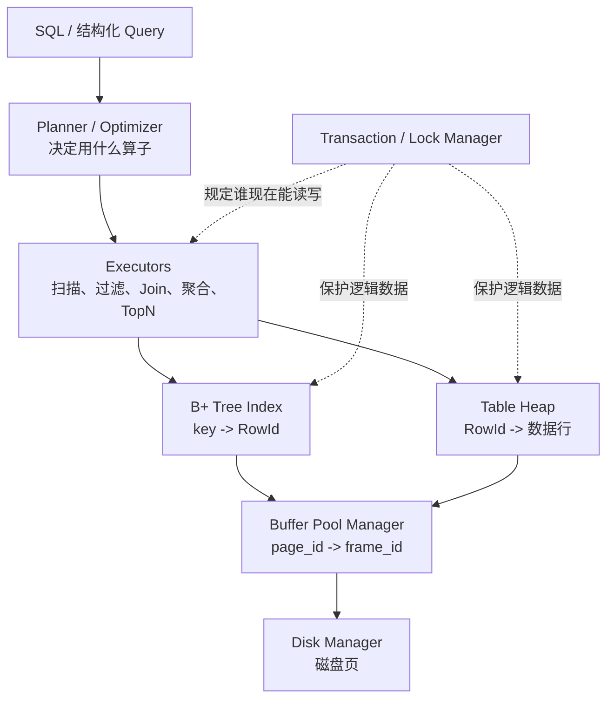

# 从 BusTub 四个项目到 Python MiniDB：通俗学习与搭建指南

> - 面向读者：会 Python 函数、类、字典和 `with`，但没有实现过数据库内核
> - 案例定位：先理解四层怎样协作，再逐步增加真实数据库约束
> - 配套代码：[`examples/minidb_prototype/`](../examples/minidb_prototype/)
> - 一键运行：`uv run python -m examples.minidb_prototype.demo`

## 1. 先给结论：你的难度排序很合理

`P2 > P1 = P4 > P3` 是一个很合理的体感，不过四个项目的“难”不是同一种难：

| 项目 | 主要难点 | 最常见的失败方式 |
| --- | --- | --- |
| P1 Buffer Pool | 资源所有权、页面生命周期、并发状态 | Pin/Unpin 不配平，脏页丢失，所有 frame 都不可淘汰 |
| P2 B+ Tree | 递归结构、不变量、页生命周期、并发同时出现 | 分裂边界错一位，父分隔键错，删除后树不再平衡 |
| P3 Query Execution | 看懂已有接口，把算子接成流水线 | Schema/表达式索引用错，`Init/Next` 状态不一致 |
| P4 Lock Manager | 事务状态机、等待与唤醒、异常路径 | 丢失唤醒、幽灵请求、死锁解除后锁未释放 |

P2 通常最痛苦，是因为一次修改可能从叶子一路传播到根，而且每一层都同时受到
“排序、容量、父子关系、持久化、并发”五组约束。P3 的基础算子相对容易，是因为
它们大多只处理“从孩子取一行，再加工一行”；一旦进入通用优化器，难度会立刻上升。

还有一个版本边界需要先说清楚：你贴出的任务组合与 CMU 15-445 Fall 2022 很吻合，
尤其是 P1 的可扩展哈希和 P4 的锁管理器。BusTub 每学期会调整项目；例如
[Fall 2025 P4](https://15445.courses.cs.cmu.edu/fall2025/project4/) 已改为 MVCC。
因此本文讲的是这套经典四项目主线，不把不同学期的实现要求混在一起。

## 2. 四个项目其实是一条调用链

先不要把它们看成四份作业。用户执行一条查询时，系统大致这样走：



用一句人话概括：

- P1 是档案室：硬盘是仓库，内存中的 frame 是有限的办公桌；
- P2 是导览牌：告诉你某个 key 对应哪一页、哪一个槽位；
- P3 是流水线：决定数据先扫描、再过滤、还是直接走索引；
- P4 是交通灯：多人同时工作时，决定谁走、谁等、谁回滚。

依赖顺序是 `P1 -> P2 -> P3 -> P4`，但学习难度不必按这个顺序排序。

## 3. 先运行 Python 案例

```bash
uv run python -m examples.minidb_prototype.demo
```

案例使用一张 `users` 表：

```text
id | name | age | city
---+------+-----+------
5  | 小周 | 29  | 深圳
2  | 阿宁 | 35  | 上海
8  | 小雨 | 24  | 杭州
1  | 老陈 | 41  | 北京
3  | 小林 | 31  | 广州
7  | 阿青 | 38  | 成都
9  | 小叶 | 27  | 武汉
```

为了快速看见状态变化，案例故意设置：

- 缓冲池只有 3 个 frame；
- 每个数据页最多放 2 行；
- LRU-K 的 `K=2`；
- B+ 树每个节点最多放 3 个 key。

所以插入第 7 行时一定会出现第 4 个数据页，缓冲池必须淘汰一个旧页；B+ 树插入
第 4 个 key 时也一定会分裂。

## 4. P1：Buffer Pool Manager

### 4.1 先分清 page 和 frame

这是 P1 最重要的两个词：

| 名称 | 是什么 | 比喻 |
| --- | --- | --- |
| `page_id` | 数据库页在磁盘世界里的稳定编号 | 档案盒编号 |
| `frame_id` | 内存缓冲池中某个固定槽位的编号 | 办公桌编号 |

同一个 `page_id=42` 今天可能在 `frame_id=1`，被淘汰后明天又可能装进
`frame_id=7`。因此需要 Page Table 保存：

```text
page_id -> frame_id
```

原项目要求用可扩展哈希表实现这个映射。它不是“页内容”，而是缓冲池快速查找页
所在内存槽位的通讯录。

### 4.2 可扩展哈希为什么能扩容

普通比喻是“楼层目录 + 储物柜”：

- Directory 根据哈希值末尾几位找到 Bucket；
- `global_depth` 表示目录看几位；
- `local_depth` 表示某个 Bucket 当前用几位区分自己；
- Bucket 满时先拆这个 Bucket；
- 只有当 `local_depth == global_depth` 时，目录才翻倍。

它的好处是局部扩容：不必每次把全表所有 key 都搬一次。

配套实现见 `storage.py` 的 `ExtendibleHashTable`。Demo 最终会打印目录和每个桶的
key，方便观察多个目录项是否仍指向同一个桶。

### 4.3 Pin/Unpin 到底在保护什么

把 `pin_count` 理解成“现在有几个人借用了这张桌子”：

```text
FetchPage  -> pin_count += 1
UnpinPage  -> pin_count -= 1
pin_count > 0 -> 绝对不能淘汰
pin_count = 0 -> 只是允许被淘汰，不代表马上淘汰
```

两类经典错误：

1. 少 Unpin：所有桌子都显示“有人使用”，最后没有可淘汰 frame；
2. 多 Unpin：还有线程在使用页面，系统却认为它空闲，可能把内容换走。

Python 教学版用上下文管理器把两步绑在一起：

```python
with buffer_pool.fetch_page(page_id, write=True) as page:
    page["rows"][0] = {"id": 7, "name": "阿青"}
# 离开 with 时自动 unpin，并把页面标成 dirty
```

这里不是为了语法漂亮，而是把资源所有权编码进控制流。函数正常返回、提前
`return` 或抛异常，`__exit__` 都会执行。这与 C++ RAII/Page Guard 的思路一致。

P1 应始终守住四条不变量：

1. 一个常驻 `page_id` 只映射到一个 frame；
2. 一个 frame 同一时刻最多装一个 page；
3. `pin_count > 0` 的 frame 不能进入可淘汰集合；
4. dirty frame 被复用前必须先写回磁盘。

### 4.4 LRU-K 不是“最后一次最久没用”

LRU 只看最后一次访问。LRU-K 看“倒数第 K 次访问距今多久”。当 `K=2`：

```text
frame A 的访问时刻：[2, 10]
frame B 的访问时刻：[7]
当前时刻：12
```

- A 已经访问满 2 次，backward 2-distance 是 `12 - 2 = 10`；
- B 只有 1 次历史，不足 K 次，距离按正无穷处理；
- 因此 B 优先淘汰。

直觉是：只来过一次的“路过型页面”不要挤掉被反复访问的热点页面。

原文提到的两类容器优化非常自然：

- cold：访问不足 K 次，按最早访问时间淘汰；
- hot：访问至少 K 次，按倒数第 K 次访问时间淘汰。

教学实现也把 `cold` 和 `hot` 分开保存。需要注意：真正高性能实现不会在每次
淘汰时扫描整个集合，而会使用有序容器或堆，并处理时间戳更新和失效项。

## 5. P2：B+ Tree Index

### 5.1 B+ 树不是存整行数据

在这个例子中，B+ 树保存：

```text
id -> RowId(page_id, slot)
```

例如：

```text
7 -> (2, 1)
```

查询先通过索引找到 RowId，再让 Table Heap 通过 Buffer Pool 取出真正的数据行。

### 5.2 内部节点和叶子节点职责不同

```text
            internal [5, 8]
              /      |      \
leaf [1,2,3] -> leaf [5,7] -> leaf [8,9]
```

- Internal Node 只放分隔 key 和子节点指针，作用是指路；
- Leaf Node 放 `key -> RowId`；
- 所有叶子在同一层；
- 叶子用 `next` 串起来，因此范围查询不需要反复回到根。

点查 `id=7`：从根根据分隔 key 进入中间叶子，再二分找到 7。

范围查 `3 <= id <= 8`：先找到 3 所在叶子，然后沿 `next` 读取 3、5、7、8。

### 5.3 叶子分裂和内部节点分裂不一样

叶子分裂：

```text
[1, 2, 5, 8] -> [1, 2] + [5, 8]
父节点得到分隔 key 5
```

`5` 仍留在右叶中，同时复制一份到父节点当路标。

内部节点分裂：

```text
[3, 5, 8, 10] -> [3, 5] + [10]
中间分隔 key 8 上推到父节点
```

内部节点的中间 key 通常不再留在左右孩子里。把“叶子复制上去”和“内部上推
出去”混为一谈，是常见 bug。

### 5.4 不要死背向上还是向下取整

你被 `max/min 除以 2` 折磨，根本原因通常不是算术，而是没有先固定表示法。

开始编码前先写清楚：

1. `max_size` 指最大 key 数，还是最大 child 数？
2. 满时立即分裂，还是插入溢出一项后分裂？
3. Internal Node 是 `m 个 key + m+1 个 child`，还是用一个无效 key 对齐数组？
4. 根、非根叶子、非根内部节点各自的最小占用是多少？

然后让公式服务于不变量：

```text
分裂前所有 entry 必须恰好分到 left、right，或有一个 key 上推父节点；
分裂后两个非根节点都必须达到最小占用；
所有 key 仍有序；
父分隔 key 能把搜索导向正确孩子。
```

不同课程版本和代码表示法可能采用不同边界。先从测试用的小容量手算
`max_size=3/4/5`，比记一个脱离上下文的 `ceil` 更可靠。

### 5.5 删除只需要两个动作，不要被函数名骗了

节点下溢后，概念上只有两个选择：

1. 兄弟有富余：借一个 entry，也叫 redistribute/rotate；
2. 兄弟也在最低占用：两个节点合并，也叫 merge/coalesce。

所以原文中的 `Coalesce` 和 `Merge` 容易造成术语混乱。官方项目说明也会把
coalescing 用来指合并。学习时统一成“借”和“合”最清楚。

删除决策可以写成：

```text
if 当前节点未下溢:
    结束
elif 选中的兄弟有富余:
    借一个，并更新父分隔 key
else:
    合并，并从父节点删除一个分隔 key/child 指针
    继续检查父节点是否下溢
```

优先只看右兄弟、最右节点才看左兄弟，确实能减少重复分支；但这不是脱离实现
约束的万能优化。你仍要处理父分隔键方向、根缩高和并发 latch 顺序。

### 5.6 为什么 P2 比教科书伪代码更难

教科书常把节点当普通内存对象，BusTub 中节点实际在 page 里：

```text
FetchPage(child_page_id)
  -> latch page
  -> 修改 B+ 树节点
  -> unlatch
  -> UnpinPage(dirty=True)
```

于是树算法和 P1 生命周期交织在一起。并发版还要做 latch crabbing：向下走时拿
孩子 latch，确认孩子对本次操作是“安全的”以后，才释放祖先 latch。

当前 Python 原型只实现内存节点的插入、分裂、点查和范围扫描，刻意省略删除、
节点页持久化和并发 latch。先把树不变量看懂，再把节点换成 page_id，调试成本低得多。

## 6. P3：Query Execution

### 6.1 Executor 是一条拉取式流水线

经典 Volcano/Iterator 模型可以理解成：父算子每次向孩子问“再给我一行”。

```text
Limit
  -> Project
      -> Filter
          -> SeqScan
```

每个算子通常只有两类核心状态：

- `Init()`：准备游标、哈希表、排序缓冲区等；
- `Next()`：返回下一行，或表示结束。

实现第一个 Executor 后，后面变顺，是因为大家都遵守相同契约。区别只是每次从
孩子拿到行后做什么。

### 6.2 为什么先看 Plan 中“已经有什么信息”

Executor 不应该重新解析 SQL。Planner 已经给出：

- 输入 Schema；
- 输出 Schema；
- 表和索引的 Catalog 信息；
- 谓词表达式；
- Join Key、Group Key、Order By；
- 子 Plan。

P3 很多 bug 来自重复猜测这些信息，或把“第几个输出列”和“原表第几个列”混用。

### 6.3 两个最容易看懂的优化

查询一：

```sql
SELECT id, name, age FROM users WHERE id = 7;
```

原计划：

```text
SeqScan -> Filter(id = 7) -> Project
```

优化后：

```text
IndexLookup(id = 7) -> Project
```

Demo 中前者概念上需要检查 7 行，索引计划只取 1 个候选 RowId。

查询二：

```sql
SELECT name, age
FROM users
WHERE age >= 30
ORDER BY age DESC
LIMIT 3;
```

原计划：

```text
SeqScan -> Filter -> Sort 全部结果 -> Limit 3 -> Project
```

优化后：

```text
SeqScan(predicate 下推) -> TopN(只维护 3 个候选) -> Project
```

谓词下推不一定减少底层扫描的页数，但会减少向上游传递的行；TopN 则避免保存和
排序所有结果。案例会打印 `rows_examined`、`rows_after_filter` 和
`rows_returned`，让区别可以量化。

### 6.4 通用优化器为什么难

不要写一棵不断加深的 `if/elif` 树去匹配所有 Plan 形状。更稳妥的成长路线是：

1. 每条规则只做一种局部、可证明等价的变换；
2. 先递归优化孩子，再匹配当前节点；
3. 使用 Pattern/Visitor，而不是到处手工判断节点类型；
4. 每条规则都保存 before/after plan，用结果集对拍；
5. 规则正确后，再讨论应用顺序和 cost。

真实优化器不仅要“结果相同”，还要估计基数、选择率、I/O、CPU 和内存，所以它
往往比基础 Executor 难一个数量级。

## 7. P4：Lock Manager

### 7.1 先分清 latch 和 transaction lock

这两个词很容易混：

| 机制 | 保护什么 | 持续多久 |
| --- | --- | --- |
| latch / mutex | 内存数据结构不被线程同时写坏 | 很短，一段临界区 |
| transaction lock | 数据库逻辑读写是否允许 | 可能跨越一条语句甚至整个事务 |

P1/P2 中保护 frame、哈希桶、树节点的通常是 latch。P4 中防止脏读、丢失更新的
是 transaction lock。

### 7.2 隔离级别先用“锁活多久”理解

下面是经典现象表；具体 DBMS 实现可能提供比 SQL 标准更强的保证：

| 隔离级别 | 脏读 | 不可重复读 | 幻读 |
| --- | --- | --- | --- |
| Read Uncommitted | 可能 | 可能 | 可能 |
| Read Committed | 避免 | 可能 | 可能 |
| Repeatable Read | 避免 | 避免 | 标准语义下仍可能 |
| Serializable | 避免 | 避免 | 避免 |

- 脏读：读到别人还没提交、之后可能回滚的数据；
- 不可重复读：同一行在同一事务中读两次，值变了；
- 幻读：同一范围条件读两次，多出或少了符合条件的行。

只锁住现有 tuple 通常不能阻止“别人插入一条新的范围内 tuple”，所以处理幻读
还会涉及 range/predicate/key-range lock，或 MVCC/Serializable 验证机制。

### 7.3 死锁检测的 DFS 不难，难的是共享状态

案例故意制造：

```text
T1 持有 row:A，等待 row:B
T2 持有 row:B，等待 row:A

waits-for graph: T1 -> T2 -> T1
```

检测器步骤：

1. 从锁请求队列构建 waits-for graph；
2. DFS 找环；
3. 选择 victim，例如事务 id 较大的年轻事务；
4. 标记 victim 为 ABORTED；
5. 删除它所有已授予和等待中的请求；
6. `notify_all()`，让其他事务重新检查条件。

第一次运行原型时还暴露了一个很典型的 bug：检测器用新 `list` 替换了锁队列，
等待线程仍握着旧列表引用，于是它永远看见已经回滚的“幽灵请求”。修复方式是原地
修改队列 `queue[:] = ...`，让所有线程始终观察同一个队列对象。

这说明 P4 真正困难的是：

- wait 必须放在循环里，醒来后重新检查条件；
- 状态修改和 `notify` 必须受同一个 Condition 锁保护；
- abort/exception 路径也必须释放已持有资源；
- 不能让等待线程观察到过时或身份不同的队列。

### 7.4 Count QPS 手动跟踪是什么意思

原文提到“不每次执行 `COUNT(*)`，而是手动 track Count”。最可能的思路是维护
派生计数：

```text
INSERT nft(owner=7)  -> owner_count[7] += 1
DELETE nft(owner=7)  -> owner_count[7] -= 1
UPDATE owner 7 -> 8  -> owner_count[7] -= 1; owner_count[8] += 1
SELECT COUNT ...     -> 直接读 owner_count[owner]
```

这样查询从扫描很多 tuple 变成一次 O(1) 查找，本质上类似增量维护的物化视图。

但正确实现至少要回答：

1. 事务回滚时，计数增减怎样一起撤销？
2. 数据行与计数更新是否处于同一个原子提交中？
3. 多个线程更新同一个 owner 的计数，会不会形成新的热点锁？
4. 删除和更新怎样拿到旧 owner，避免减错计数？
5. 崩溃恢复后，计数和真实数据不一致怎么办？

降低热点竞争可以考虑分片计数，例如每线程/每分区保存局部 delta，读时求和；但这
又增加了读成本和一致性复杂度。所以它不是“加一个 dict”这么简单，而是空间、写入
放大、一致性和锁竞争之间的交换。

## 8. Python 系统怎么分阶段搭建

不要一上来写 SQL Parser + 文件存储 + B+ 树删除 + 多线程事务。推荐下面的顺序。

### Stage 0：当前可运行原型

目录：

```text
examples/minidb_prototype/
├── storage.py      # ExtensibleHash、LRU-K、Disk、BufferPool、PageGuard
├── table.py        # HeapTable、RowId
├── index.py        # B+Tree insert/search/range
├── execution.py    # Query、Plan、两条优化规则
├── concurrency.py  # X lock、等待图、死锁检测
└── demo.py         # 一次运行打印全部状态
```

它回答的是：“四层状态模型能否串起来，并被新手直接观察？”

它不是生产数据库，因为所谓磁盘只是内存字典，B+ 树节点也还没有写进 page。

### Stage 1：把每层不变量测扎实

建议测试顺序：

1. 可扩展哈希：目录翻倍、局部桶分裂、覆盖已有 key；
2. LRU-K：不足 K 次优先、不可淘汰 frame 永不返回；
3. Buffer Pool：命中、缺页、脏页淘汰、全部 pinned 时失败；
4. B+ 树：随机插入后与 Python 排序字典对拍；
5. Executor：优化前后结果集合完全相同；
6. Lock Manager：并发请求最终都退出，队列中无幽灵请求。

### Stage 2：补齐 B+ 树删除

先保持节点在内存中，实现：

- 叶子向左右兄弟借；
- 叶子合并与 `next_leaf` 修复；
- 内部节点借/合；
- 父分隔 key 更新；
- 根只有一个 child 时缩高。

每次操作后写一个 `validate()`，递归检查排序、容量、孩子数量、叶子等高、叶子链和
搜索结果。验证器比可视化更重要：可视化告诉你“看起来不对”，验证器告诉你第一条
被破坏的不变量。

### Stage 3：把 B+ 树节点放进 Buffer Pool page

把 `children: list[BPlusNode]` 改成 `child_page_ids: list[int]`：

```text
node object -> page bytes / 可序列化 page data
child object reference -> child_page_id
直接访问 child -> FetchPage(child_page_id)
```

这一阶段再引入 ReadPageGuard/WritePageGuard，并确保任何返回路径都释放 latch 和
pin。完成单线程持久化后，最后再加 latch crabbing。

### Stage 4：扩展执行器，不急着解析 SQL

先继续使用结构化 `Query`/Plan Node，依次加：

1. SeqScan、IndexScan；
2. Filter、Project；
3. Insert、Delete、Update；
4. Hash Join；
5. Hash Aggregate；
6. Sort、Limit、TopN；
7. 规则优化器。

等执行模型稳定后，再选一个轻量 SQL Parser，把 AST 翻译成现有 Plan。Parser 只是
入口，不应该决定内部执行架构。

### Stage 5：补完整事务语义

按复杂度递增：

1. 只实现 X 行锁和 Strict 2PL；
2. 加 S 锁与 S/X 兼容矩阵；
3. 加 IS/IX/SIX 和表/行层级锁；
4. 实现 RU/RC/RR 的加锁与释放时机；
5. 实现 deadlock detector；
6. 让 Insert/Delete/Update 和索引修改登记 write set；
7. Abort 时按相反顺序撤销数据、索引和派生计数。

### Stage 6：如果目标是真数据库，再学恢复

到这里仍只能算“内存中正确运行”。要抵抗进程崩溃，还需要：

- WAL 和 Log Sequence Number；
- steal/no-steal、force/no-force 策略；
- redo/undo；
- checkpoint；
- 页校验与文件格式版本。

这部分不要偷偷塞进 P1。Buffer Pool 负责页在内存与磁盘之间移动；Recovery 负责
崩溃后怎样恢复到事务一致状态，二者有关联但不是同一个职责。

## 9. 建议的学习动作

第一次运行后，不要马上加功能。先做四个小实验：

1. 把 `pool_size=3` 改成 2，预测哪个 page 先被淘汰，再看输出；
2. 把 B+ 树插入顺序改成升序，观察树形是否仍平衡；
3. 暂时禁用索引优化，对比 `rows_examined`；
4. 把死锁 victim 从最大事务 id 改成最小 id，看最终事件顺序怎样变化。

如果你能不看代码解释下面四句话，就算真正抓住主线了：

```text
P1：一个 page 为什么能比内存大得多的数据库透明换入换出？
P2：一个 key 怎样从根走到叶子，再变成 RowId？
P3：同一条查询为什么换一个 Plan 就能少做很多工作？
P4：两个各自正确的事务为什么放在一起会永远等下去？
```

## 10. 资料边界

本文按原文对应的经典项目版本组织，但只做独立教学实现，不包含 BusTub 作业答案。
官方资料：

- [Fall 2022 Project 1：Extendible Hash、LRU-K、Buffer Pool](https://15445.courses.cs.cmu.edu/fall2022/project1/)
- [Fall 2022 Project 2：B+ Tree](https://15445.courses.cs.cmu.edu/fall2022/project2/)
- [Fall 2022 Project 3：Query Execution](https://15445.courses.cs.cmu.edu/fall2022/project3/)
- [Fall 2022 Project 4：Concurrency Control](https://15445.courses.cs.cmu.edu/fall2022/project4/)
- [Fall 2025 Project 4：MVOCC，用于理解课程版本变化](https://15445.courses.cs.cmu.edu/fall2025/project4/)
- [BusTub 官方仓库](https://github.com/cmu-db/bustub)

需要一直记住三个教学简化：

1. 原型 Disk Manager 没有真实文件 I/O；
2. 原型 B+ 树节点没有进入 Buffer Pool，也没有实现删除；
3. 原型 Lock Manager 只用 X 行锁演示等待和死锁，不等价于完整隔离级别实现。
